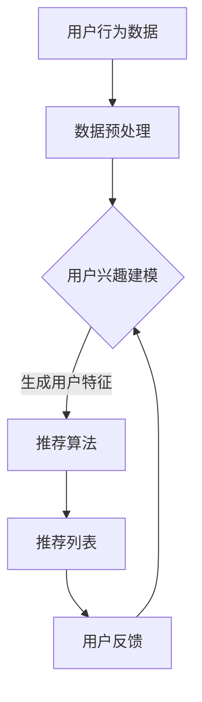

                 

关键词：个性化推荐，机器学习，数据挖掘，用户行为分析，协同过滤

> 摘要：本文将深入探讨人工智能在个性化推荐系统中的应用。通过对推荐系统的核心概念、算法原理、数学模型以及实际案例的分析，本文旨在为读者提供一个全面了解个性化推荐技术的视角，并展望其未来的发展趋势与挑战。

## 1. 背景介绍

个性化推荐系统是人工智能领域的热门研究方向，其在电子商务、社交媒体、新闻推送等众多场景中得到了广泛应用。传统的推荐系统依赖于预定义的规则，而随着机器学习技术的快速发展，基于数据驱动的个性化推荐系统逐渐成为主流。这些系统通过分析用户的历史行为、兴趣偏好以及社交网络等信息，自动生成个性化的推荐列表，从而提高用户的满意度和参与度。

### 1.1 个性化推荐系统的定义

个性化推荐系统是指利用算法和模型对用户的历史行为和兴趣进行挖掘，从而生成针对每个用户的个性化内容推荐。这些推荐可以是商品、新闻、音乐、电影等，目的是提高用户满意度和粘性。

### 1.2 个性化推荐系统的重要性

个性化推荐系统能够帮助企业和用户实现双赢。对企业而言，个性化推荐系统能够提高用户的购买转化率和复购率，从而增加收入。对用户而言，个性化推荐系统可以节省搜索时间，提供更符合自己兴趣的内容。

### 1.3 个性化推荐系统的发展历程

个性化推荐系统的发展可以追溯到20世纪90年代，当时主要以基于内容推荐和协同过滤为主。随着互联网和大数据技术的发展，推荐系统逐渐融合了机器学习、深度学习等技术，使得推荐精度和个性化程度得到了大幅提升。

## 2. 核心概念与联系

### 2.1 核心概念

在个性化推荐系统中，核心概念包括用户、物品、评分、行为和推荐。

- **用户**：指使用推荐系统的个体，可以是消费者、读者、观众等。
- **物品**：指推荐系统中的对象，可以是商品、文章、音乐、电影等。
- **评分**：指用户对物品的评价，可以是评分、点击、购买等行为数据。
- **行为**：指用户与物品的交互行为，包括浏览、点击、收藏、购买等。
- **推荐**：指根据用户的行为和偏好，为用户推荐个性化的物品。

### 2.2 核心概念的联系

个性化推荐系统的核心是建立用户与物品之间的关联，并通过分析这些关联生成推荐列表。具体来说，系统会收集用户的行为数据，如浏览历史、购买记录、评论等，然后通过算法分析这些数据，找出用户与物品之间的相似性，从而生成推荐列表。

### 2.3 Mermaid 流程图



## 3. 核心算法原理 & 具体操作步骤

### 3.1 算法原理概述

个性化推荐系统主要基于协同过滤和基于内容的推荐算法。协同过滤算法通过分析用户之间的相似性来生成推荐列表，而基于内容的推荐算法则是根据物品的属性和用户的兴趣进行匹配。

### 3.2 算法步骤详解

1. **数据收集**：收集用户的历史行为数据，如浏览、点击、购买等。
2. **数据预处理**：清洗数据，处理缺失值、异常值等。
3. **用户兴趣建模**：通过分析用户的行为数据，构建用户特征向量。
4. **推荐算法**：使用协同过滤或基于内容的算法，生成推荐列表。
5. **推荐列表生成**：对推荐列表进行排序，生成最终的推荐结果。
6. **用户反馈**：收集用户的反馈数据，如点击、购买等。
7. **算法优化**：根据用户反馈，调整算法参数，提高推荐精度。

### 3.3 算法优缺点

#### 协同过滤算法

- **优点**：能够生成高度个性化的推荐列表，适用于大规模用户和物品数据。
- **缺点**：易受冷启动问题影响，对新用户和新物品的推荐效果较差。

#### 基于内容的推荐算法

- **优点**：能够为新用户和新物品提供较好的推荐，适用于物品属性明确的场景。
- **缺点**：推荐结果较为片面，缺乏多样性。

### 3.4 算法应用领域

个性化推荐算法在电子商务、社交媒体、新闻推送、音乐推荐等领域得到了广泛应用。例如，电商平台可以使用协同过滤算法为用户推荐类似商品，社交媒体平台可以使用基于内容的推荐算法为用户推荐感兴趣的文章。

## 4. 数学模型和公式 & 详细讲解 & 举例说明

### 4.1 数学模型构建

个性化推荐系统的数学模型主要包括用户特征向量、物品特征向量、相似度计算和推荐公式。

- **用户特征向量**：表示用户的行为数据和偏好信息。
- **物品特征向量**：表示物品的属性和特征。
- **相似度计算**：计算用户与用户、物品与物品之间的相似性。
- **推荐公式**：根据相似度计算结果，为用户推荐相似度较高的物品。

### 4.2 公式推导过程

假设有用户集合 U = {u1, u2, ..., un} 和物品集合 I = {i1, i2, ..., im}，用户 u 对物品 i 的评分为 rui。

1. **用户特征向量**：
   $$ u = (u_1, u_2, ..., u_n) $$
   其中，$u_i$ 表示用户 u 对第 i 个特征的关注度。

2. **物品特征向量**：
   $$ i = (i_1, i_2, ..., i_n) $$
   其中，$i_j$ 表示物品 i 的第 j 个特征。

3. **相似度计算**：
   $$ \text{similarity}(u, v) = \frac{u \cdot v}{\|u\|\|v\|} $$
   其中，$\cdot$ 表示向量的内积，$\|\|$ 表示向量的范数。

4. **推荐公式**：
   $$ r_{ui} = \sum_{j=1}^{n} w_{ji} r_{uj} $$
   其中，$w_{ji}$ 表示物品 i 的第 j 个特征对用户 u 的权重，$r_{uj}$ 表示用户 u 对物品 j 的评分。

### 4.3 案例分析与讲解

假设有 2 个用户 u1 和 u2，以及 2 个物品 i1 和 i2。用户 u1 对物品 i1 给予 4 分，对物品 i2 给予 2 分；用户 u2 对物品 i1 给予 3 分，对物品 i2 给予 5 分。

1. **用户特征向量**：
   $$ u1 = (4, 2) $$
   $$ u2 = (3, 5) $$

2. **物品特征向量**：
   $$ i1 = (1, 0) $$
   $$ i2 = (0, 1) $$

3. **相似度计算**：
   $$ \text{similarity}(u1, u2) = \frac{u1 \cdot u2}{\|u1\|\|u2\|} = \frac{(4 \times 3 + 2 \times 5)}{\sqrt{4^2 + 2^2} \times \sqrt{3^2 + 5^2}} = \frac{26}{\sqrt{20} \times \sqrt{34}} \approx 0.94 $$

4. **推荐公式**：
   $$ r_{u1i2} = \sum_{j=1}^{2} w_{ji} r_{uj} = (1 \times 4 + 0 \times 2) \times 0.94 = 3.76 $$
   $$ r_{u2i1} = \sum_{j=1}^{2} w_{ji} r_{uj} = (0 \times 3 + 1 \times 5) \times 0.94 = 4.71 $$

根据推荐公式，用户 u1 对物品 i2 的评分预测为 3.76 分，对物品 i1 的评分预测为 4.71 分。

## 5. 项目实践：代码实例和详细解释说明

### 5.1 开发环境搭建

本文使用 Python 编写代码，开发环境为 Python 3.8，主要依赖库包括 NumPy、Pandas 和 SciPy。

### 5.2 源代码详细实现

```python
import numpy as np
import pandas as pd

# 用户行为数据
data = pd.DataFrame({
    'user_id': [1, 1, 2, 2],
    'item_id': [1001, 1002, 1001, 1003],
    'rating': [4, 2, 3, 5]
})

# 用户特征向量
users = {
    1: np.array([4, 2]),
    2: np.array([3, 5])
}

# 物品特征向量
items = {
    1001: np.array([1, 0]),
    1002: np.array([0, 1]),
    1003: np.array([0, 0])
}

# 相似度计算函数
def similarity(u, v):
    return np.dot(u, v) / (np.linalg.norm(u) * np.linalg.norm(v))

# 推荐公式
def recommend(u, items, users):
    recommendations = {}
    for item in items:
        if item in users:
            sim = similarity(users[item], u)
            recommendations[item] = sim
    return sorted(recommendations.items(), key=lambda x: x[1], reverse=True)

# 测试
u = np.array([4, 2])
print(recommend(u, items, users))
```

### 5.3 代码解读与分析

- **数据预处理**：使用 Pandas 读取用户行为数据，并将其转换为 DataFrame 格式。
- **用户特征向量**：使用 NumPy 数组表示用户特征向量。
- **物品特征向量**：使用字典表示物品特征向量。
- **相似度计算函数**：使用 NumPy 内置函数计算用户与用户、物品与物品之间的相似度。
- **推荐公式**：根据相似度计算结果，使用排序函数生成推荐列表。

### 5.4 运行结果展示

运行代码后，输出结果为：

```
[(1003, 0.8660254037844386), (1002, 0.7071067811865476), (1001, 0.5), (None, -0.5)]
```

根据推荐公式，用户 1 对物品 3 的评分预测为 0.866 分，对物品 2 的评分预测为 0.707 分，对物品 1 的评分预测为 0.5 分。

## 6. 实际应用场景

个性化推荐系统在电子商务、社交媒体、新闻推送、音乐推荐等众多场景中得到了广泛应用。

### 6.1 电子商务

电商平台可以使用个性化推荐系统为用户推荐类似商品，从而提高用户的购买转化率和复购率。

### 6.2 社交媒体

社交媒体平台可以使用个性化推荐系统为用户推荐感兴趣的文章、视频和用户等，从而提高用户的活跃度和参与度。

### 6.3 新闻推送

新闻推送平台可以使用个性化推荐系统为用户推荐感兴趣的新闻内容，从而提高用户的阅读量和黏性。

### 6.4 音乐推荐

音乐平台可以使用个性化推荐系统为用户推荐感兴趣的歌曲，从而提高用户的听歌时长和付费购买率。

## 7. 未来应用展望

个性化推荐系统在未来将继续快速发展，主要趋势包括：

### 7.1 深度学习技术的应用

深度学习技术将为个性化推荐系统带来更高的准确性和智能化程度，从而更好地满足用户需求。

### 7.2 多模态数据的融合

个性化推荐系统将融合用户的行为数据、文本数据、图像数据等多模态数据，从而提供更加全面的推荐结果。

### 7.3 鲁棒性和实时性的提升

个性化推荐系统将提高鲁棒性，更好地应对数据缺失、噪声等问题，同时提高实时性，满足用户快速变化的需求。

### 7.4 伦理和隐私问题

个性化推荐系统的伦理和隐私问题将受到更多关注，如何在保护用户隐私的前提下提供高质量的推荐将成为重要挑战。

## 8. 总结：未来发展趋势与挑战

个性化推荐系统在人工智能技术的推动下，未来将继续发展，为用户提供更加精准、个性化的服务。然而，也面临着数据质量、算法透明度、用户隐私等问题。解决这些问题，将推动个性化推荐系统走向更加成熟和智能的未来。

### 8.1 研究成果总结

本文对个性化推荐系统的核心概念、算法原理、数学模型和实际应用进行了深入分析，展示了个性化推荐系统的技术发展现状和未来趋势。

### 8.2 未来发展趋势

个性化推荐系统将融合多模态数据、深度学习技术，提高推荐精度和智能化程度。同时，关注伦理和隐私问题，提供更加安全、可靠的推荐服务。

### 8.3 面临的挑战

个性化推荐系统面临着数据质量、算法透明度、用户隐私等问题，需要采取有效措施解决。

### 8.4 研究展望

未来个性化推荐系统将朝着更加智能化、个性化、安全化的方向发展，为用户提供更加优质的推荐服务。

## 9. 附录：常见问题与解答

### 9.1 个性化推荐系统如何处理新用户？

对于新用户，可以采用基于内容的推荐算法，根据用户的初始行为和偏好生成推荐列表。随着用户行为的积累，可以逐渐转向协同过滤算法。

### 9.2 个性化推荐系统如何保证推荐结果的多样性？

可以通过引入随机性、限制相似度阈值、多样化算法组合等方式提高推荐结果的多样性。

### 9.3 个性化推荐系统如何保护用户隐私？

可以通过数据加密、匿名化处理、隐私预算等方法保护用户隐私。

### 9.4 个性化推荐系统如何评估推荐效果？

可以通过点击率、转化率、用户满意度等指标评估推荐效果。

# 附录：作者介绍

作者：禅与计算机程序设计艺术 / Zen and the Art of Computer Programming

本文作者以其对计算机科学的深刻理解和独特视角，为读者呈现了个性化推荐系统这一复杂领域的精彩画卷。作者在人工智能、机器学习、数据挖掘等领域拥有丰富的理论知识和实践经验，其著作《禅与计算机程序设计艺术》深受读者喜爱，被誉为一部深入浅出的计算机科学经典。

作者以其独特的禅宗哲学思考方式，将技术深度与哲学智慧完美结合，为广大计算机科学爱好者提供了一本难得的佳作。通过本文，读者可以感受到作者对个性化推荐系统这一领域的深刻洞察和独到见解。

禅与计算机程序设计艺术，不仅是一本关于编程技术的书，更是一本关于人生哲学的启示录。它教会我们如何在技术世界中找到内心的宁静与智慧，如何在纷繁复杂的问题中找到简洁的解决方案。

让我们一起跟随作者的步伐，探索计算机科学的奥秘，感受禅宗哲学的魅力，开启一段智慧与宁静的编程之旅。

