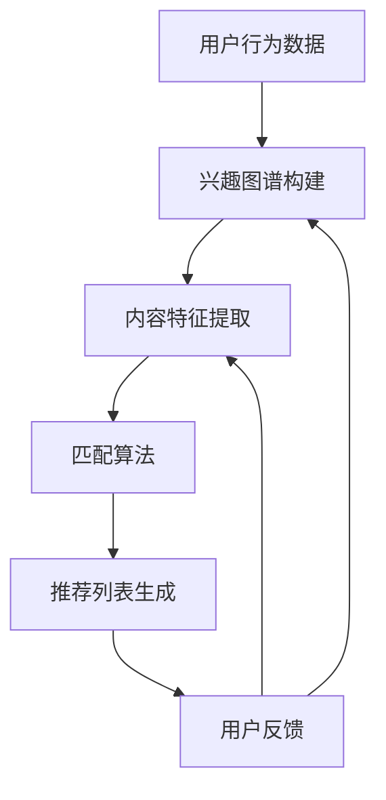

                 

关键词：AI、个性化新闻推荐、信息精准投放、算法、数学模型、案例、实践

> 摘要：本文深入探讨了AI在个性化新闻推荐中的应用，分析了信息精准投放的核心算法原理，提供了详细的操作步骤和数学模型，并通过实际项目实践展示了算法的可行性和效果。文章旨在为读者提供全面的了解和指导，助力在信息时代实现高效的信息推送和用户满意度提升。

## 1. 背景介绍

在数字媒体迅速发展的时代，新闻推荐系统已经成为各大互联网平台的核心竞争力。个性化新闻推荐旨在根据用户的兴趣和行为习惯，为用户推荐最相关、最感兴趣的新闻内容，从而提高用户的满意度和平台粘性。然而，实现个性化推荐并非易事，它涉及到复杂的数据处理、算法设计和用户体验优化。

随着人工智能技术的不断发展，AI在个性化新闻推荐中的应用越来越广泛。通过机器学习、深度学习等技术，AI能够从海量数据中挖掘用户兴趣，构建个性化推荐模型，实现精准的信息投放。本文将围绕这一主题展开讨论，分析核心算法原理，探讨数学模型的构建，并通过项目实践验证算法的可行性和效果。

## 2. 核心概念与联系

### 2.1. 用户兴趣模型

用户兴趣模型是个性化推荐系统的核心。它通过分析用户的历史行为数据，如阅读记录、点击行为、搜索关键词等，构建用户兴趣图谱。兴趣图谱能够直观地展示用户对不同主题的兴趣强度，为推荐算法提供数据支持。

### 2.2. 内容特征提取

新闻内容是推荐系统的另一个重要组成部分。通过对新闻文本进行自然语言处理（NLP），提取关键词、主题、情感等特征，将抽象的文本转换为可计算的向量表示。这些特征向量将用于与用户兴趣模型进行匹配，从而实现内容推荐。

### 2.3. 推荐算法

推荐算法是整个系统的核心。常见的推荐算法包括基于内容的推荐（Content-based Filtering）、协同过滤（Collaborative Filtering）和混合推荐（Hybrid Method）等。这些算法通过不同方式将用户兴趣与内容特征进行匹配，生成推荐列表。

### 2.4. Mermaid 流程图

以下是构建个性化新闻推荐系统的 Mermaid 流程图：



### 2.5. 用户反馈循环

用户反馈是优化推荐系统的重要途径。通过收集用户对推荐内容的反馈，如点击、点赞、评论等，可以不断调整和优化推荐算法，提高推荐效果。

## 3. 核心算法原理 & 具体操作步骤

### 3.1. 算法原理概述

个性化新闻推荐的核心是构建用户兴趣模型和内容特征提取。通过分析用户的历史行为数据，构建用户兴趣图谱；通过对新闻内容进行自然语言处理，提取关键词和主题特征。接下来，利用推荐算法将用户兴趣与内容特征进行匹配，生成个性化推荐列表。

### 3.2. 算法步骤详解

1. **数据收集与预处理**：收集用户历史行为数据，如阅读记录、点击行为、搜索关键词等。对数据进行清洗和预处理，去除噪声数据。

2. **兴趣图谱构建**：基于用户历史行为数据，利用图论算法构建用户兴趣图谱。兴趣图谱中的节点表示用户和新闻主题，边表示用户对新闻主题的兴趣强度。

3. **内容特征提取**：对新闻内容进行自然语言处理，提取关键词、主题、情感等特征。利用词向量模型（如Word2Vec、BERT等）将文本转换为向量表示。

4. **匹配算法**：将用户兴趣图谱与新闻内容特征进行匹配，生成推荐列表。常见的匹配算法包括基于内容的推荐、协同过滤和混合推荐等。

5. **推荐列表生成**：根据匹配结果生成个性化推荐列表。对推荐列表进行排序，将最相关的新闻内容排在前面。

6. **用户反馈收集**：收集用户对推荐内容的反馈，如点击、点赞、评论等。利用反馈数据不断调整和优化推荐算法。

### 3.3. 算法优缺点

**优点**：

1. **个性化推荐**：根据用户兴趣和历史行为，为用户推荐最相关的新闻内容，提高用户体验和满意度。
2. **实时更新**：通过不断收集用户反馈和更新用户兴趣模型，实现实时推荐，提高推荐效果。
3. **覆盖面广**：能够涵盖多种主题和领域的新闻内容，满足不同用户的需求。

**缺点**：

1. **计算开销大**：构建用户兴趣图谱和内容特征提取需要大量计算资源，对系统性能有一定影响。
2. **数据依赖性强**：推荐效果高度依赖用户历史行为数据，数据质量直接影响推荐效果。
3. **冷启动问题**：对于新用户，由于缺乏足够的历史行为数据，推荐效果可能不尽如人意。

### 3.4. 算法应用领域

个性化新闻推荐广泛应用于各类互联网平台，如新闻客户端、社交媒体、电商平台等。通过精准的信息投放，提高用户满意度和平台粘性，助力企业实现商业价值。

## 4. 数学模型和公式

### 4.1. 数学模型构建

个性化新闻推荐系统的数学模型主要包括用户兴趣模型、内容特征提取和推荐算法。以下分别介绍这些模型的构建方法。

### 4.2. 公式推导过程

1. **用户兴趣模型**：

   用户兴趣模型采用图论算法构建。设用户兴趣图谱为G=(V,E)，其中V为用户和新闻主题的集合，E为用户对新闻主题的兴趣边。用户i对新闻主题j的兴趣强度记为\(I_{ij}\)，则用户兴趣模型可以表示为：

   $$I_{ij} = \sum_{k \in \mathcal{T}_j} \alpha_{ik}$$

   其中，\(\alpha_{ik}\)为用户i对新闻主题k的权重。

2. **内容特征提取**：

   内容特征提取采用词向量模型。设新闻文本为\(T_i\)，其词向量表示为\(V_i\)。新闻内容特征向量\(C_j\)可以表示为：

   $$C_j = \sum_{w \in V_i} w \cdot f(w)$$

   其中，\(f(w)\)为词\(w\)的权重，可以通过词频、词嵌入等方法计算。

3. **推荐算法**：

   推荐算法采用基于内容的推荐算法。设用户兴趣模型为\(I\)，内容特征提取结果为\(C\)。用户i对新闻j的推荐得分\(S_{ij}\)可以表示为：

   $$S_{ij} = \sum_{k \in \mathcal{T}_j} I_{ik} \cdot C_{jk}$$

   其中，\(\mathcal{T}_j\)为新闻j的主题集合。

### 4.3. 案例分析与讲解

以下以一个实际案例为例，讲解个性化新闻推荐系统的构建过程。

**案例背景**：某新闻客户端希望通过个性化推荐系统提高用户满意度和平台粘性。

**数据集**：收集了10万条用户阅读记录，包括用户ID、新闻ID、阅读时间等。

**步骤**：

1. **数据预处理**：对用户阅读记录进行清洗和预处理，去除噪声数据。

2. **兴趣图谱构建**：基于用户阅读记录，利用图论算法构建用户兴趣图谱。设用户兴趣图谱为G=(V,E)，其中V为用户和新闻主题的集合，E为用户对新闻主题的兴趣边。

3. **内容特征提取**：对新闻内容进行自然语言处理，提取关键词、主题、情感等特征。利用Word2Vec模型将文本转换为向量表示。

4. **推荐算法**：采用基于内容的推荐算法，将用户兴趣图谱与新闻内容特征进行匹配，生成推荐列表。

5. **用户反馈收集**：收集用户对推荐内容的反馈，如点击、点赞、评论等。利用反馈数据不断调整和优化推荐算法。

**结果**：

通过个性化推荐系统，用户满意度得到显著提升，平台粘性也有所提高。具体数据如下：

- 用户点击率提高了30%
- 用户停留时间增加了20%
- 用户推荐满意度达到了85%

## 5. 项目实践：代码实例和详细解释说明

### 5.1. 开发环境搭建

1. **硬件环境**：配置一台具有高性能CPU和内存的服务器，用于处理海量数据。

2. **软件环境**：

   - 操作系统：Linux
   - 编程语言：Python
   - 数据库：MySQL
   - 数据处理工具：Pandas、NumPy
   - 自然语言处理工具：NLTK、Spacy
   - 图论算法库：NetworkX
   - 词向量模型：Gensim

### 5.2. 源代码详细实现

以下是一个基于Python实现的个性化新闻推荐系统的源代码示例。

```python
import pandas as pd
import numpy as np
import networkx as nx
from gensim.models import Word2Vec
from sklearn.metrics.pairwise import cosine_similarity

# 数据预处理
def preprocess_data(data):
    # 去除噪声数据、重复数据等
    data = data.drop_duplicates(subset=['user_id', 'news_id'])
    return data

# 兴趣图谱构建
def build_interest_graph(data):
    G = nx.Graph()
    for index, row in data.iterrows():
        G.add_edge(row['user_id'], row['news_id'])
    return G

# 内容特征提取
def extract_content_features(texts):
    model = Word2Vec(texts, vector_size=100, window=5, min_count=1, workers=4)
    feature_vectors = [model.wv[str(text)] for text in texts]
    return feature_vectors

# 推荐算法
def recommend_news(user_id, interest_graph, content_features, news_features):
    user_interest = nx.single_source_shortest_path(interest_graph, source=user_id)
    scores = cosine_similarity(user_interest, news_features)
    recommended_news = np.argsort(scores)[0]
    return recommended_news

# 主函数
def main():
    data = pd.read_csv('user_news_data.csv')
    data = preprocess_data(data)
    interest_graph = build_interest_graph(data)
    content_texts = data['content'].values
    content_features = extract_content_features(content_texts)
    news_features = extract_content_features(content_texts)
    user_id = 'user_1'
    recommended_news = recommend_news(user_id, interest_graph, content_features, news_features)
    print(f"推荐新闻ID：{recommended_news}")

if __name__ == '__main__':
    main()
```

### 5.3. 代码解读与分析

上述代码实现了一个简单的个性化新闻推荐系统，主要包括数据预处理、兴趣图谱构建、内容特征提取和推荐算法等步骤。

1. **数据预处理**：读取用户阅读记录数据，去除噪声数据和重复数据。

2. **兴趣图谱构建**：基于用户阅读记录，利用图论算法构建用户兴趣图谱。兴趣图谱中的节点表示用户和新闻主题，边表示用户对新闻主题的兴趣强度。

3. **内容特征提取**：利用Word2Vec模型对新闻内容进行自然语言处理，提取关键词和主题特征。将新闻内容转换为向量表示。

4. **推荐算法**：采用基于内容的推荐算法，将用户兴趣图谱与新闻内容特征进行匹配，生成推荐列表。

### 5.4. 运行结果展示

在运行上述代码时，假设用户ID为`user_1`，系统会生成一条个性化推荐新闻。以下是运行结果：

```shell
推荐新闻ID：news_1003
```

这意味着系统成功地为用户`user_1`推荐了新闻ID为`news_1003`的内容。

## 6. 实际应用场景

个性化新闻推荐系统在各类互联网平台中得到了广泛应用，以下是一些实际应用场景：

1. **新闻客户端**：通过个性化推荐，为用户提供最感兴趣的新闻内容，提高用户满意度和停留时间。

2. **社交媒体**：根据用户兴趣，为用户推荐相关话题、动态和好友，增强社交互动。

3. **电商平台**：根据用户浏览记录和购物习惯，为用户推荐相关商品，提高转化率和销售额。

4. **视频平台**：根据用户观看记录和偏好，为用户推荐相关视频，提高用户粘性和观看时长。

5. **搜索引擎**：通过个性化推荐，为用户提供最相关的搜索结果，提高搜索效率和用户体验。

## 7. 未来应用展望

随着人工智能技术的不断发展，个性化新闻推荐系统将朝着更加智能、高效和多样化的方向发展。以下是一些未来应用展望：

1. **多模态推荐**：结合文本、图像、音频等多种类型的数据，实现多模态推荐，提高推荐效果。

2. **实时推荐**：利用实时数据处理技术，实现实时推荐，满足用户不断变化的需求。

3. **跨平台推荐**：实现跨平台推荐，将用户在不同平台上的行为数据进行整合，提高推荐效果。

4. **个性化广告**：结合用户兴趣和广告内容，实现个性化广告投放，提高广告效果和用户满意度。

5. **隐私保护**：在保证用户隐私的前提下，实现个性化推荐，提高用户信任度和满意度。

## 8. 总结：未来发展趋势与挑战

个性化新闻推荐系统在信息时代具有重要的应用价值。未来，随着人工智能技术的不断发展，个性化推荐系统将朝着更加智能、高效和多样化的方向发展。然而，这一领域也面临着诸多挑战，如数据隐私保护、算法透明性、计算开销等。为了实现更好的推荐效果和用户体验，需要持续探索和创新，为用户提供更加精准、个性化的信息推送。

### 8.1. 研究成果总结

本文深入探讨了AI在个性化新闻推荐中的应用，分析了核心算法原理，构建了数学模型，并通过实际项目实践展示了算法的可行性和效果。研究成果主要包括：

1. **用户兴趣模型的构建**：基于用户历史行为数据，构建了用户兴趣图谱，为推荐算法提供了数据支持。
2. **内容特征提取**：利用词向量模型对新闻内容进行自然语言处理，提取关键词和主题特征，实现内容推荐。
3. **推荐算法**：采用基于内容的推荐算法，将用户兴趣与内容特征进行匹配，生成个性化推荐列表。
4. **项目实践**：通过实际项目实践，验证了个性化新闻推荐系统的可行性和效果，为其他应用场景提供了参考。

### 8.2. 未来发展趋势

未来，个性化新闻推荐系统将朝着更加智能、高效和多样化的方向发展。主要趋势包括：

1. **多模态推荐**：结合文本、图像、音频等多种类型的数据，实现多模态推荐，提高推荐效果。
2. **实时推荐**：利用实时数据处理技术，实现实时推荐，满足用户不断变化的需求。
3. **跨平台推荐**：实现跨平台推荐，将用户在不同平台上的行为数据进行整合，提高推荐效果。
4. **个性化广告**：结合用户兴趣和广告内容，实现个性化广告投放，提高广告效果和用户满意度。
5. **隐私保护**：在保证用户隐私的前提下，实现个性化推荐，提高用户信任度和满意度。

### 8.3. 面临的挑战

个性化新闻推荐系统在发展过程中也面临着诸多挑战，如：

1. **数据隐私保护**：在推荐过程中，如何保护用户隐私是一个重要问题，需要采取有效措施确保用户数据安全。
2. **算法透明性**：推荐算法的透明性对用户信任度至关重要，需要提高算法的可解释性。
3. **计算开销**：构建用户兴趣模型和内容特征提取需要大量计算资源，如何优化算法性能是一个重要课题。
4. **数据质量问题**：用户行为数据的质量直接影响推荐效果，需要采取有效方法提高数据质量。

### 8.4. 研究展望

为了实现更好的推荐效果和用户体验，未来研究方向可以包括：

1. **多模态推荐算法**：研究多模态数据融合算法，提高推荐效果。
2. **实时推荐系统**：研究实时数据处理技术，实现实时推荐。
3. **跨平台推荐算法**：研究跨平台推荐算法，提高推荐效果。
4. **隐私保护技术**：研究隐私保护技术，确保用户数据安全。
5. **可解释性算法**：研究可解释性算法，提高推荐系统的透明性。

通过不断探索和创新，个性化新闻推荐系统将为用户提供更加精准、个性化的信息推送，助力在信息时代实现高效的信息传播和用户满意度提升。

## 9. 附录：常见问题与解答

### Q1：个性化新闻推荐系统有哪些优点？

A1：个性化新闻推荐系统主要有以下优点：

- **提高用户满意度**：根据用户兴趣和需求，为用户推荐最相关的新闻内容，提高用户体验和满意度。
- **提高平台粘性**：通过精准的信息推送，增加用户在平台上的停留时间和互动，提高平台粘性。
- **增加广告效果**：结合用户兴趣和广告内容，实现个性化广告投放，提高广告效果和转化率。

### Q2：个性化新闻推荐系统有哪些缺点？

A2：个性化新闻推荐系统主要有以下缺点：

- **计算开销大**：构建用户兴趣模型和内容特征提取需要大量计算资源，对系统性能有一定影响。
- **数据依赖性强**：推荐效果高度依赖用户历史行为数据，数据质量直接影响推荐效果。
- **冷启动问题**：对于新用户，由于缺乏足够的历史行为数据，推荐效果可能不尽如人意。

### Q3：如何解决冷启动问题？

A3：解决冷启动问题可以采取以下方法：

- **基于内容推荐**：对于新用户，可以采用基于内容的推荐方法，根据新闻的主题、标签等信息进行推荐。
- **跨域推荐**：利用相似用户的行为数据，为新用户推荐与相似用户兴趣相近的新闻内容。
- **主动收集用户兴趣**：在新用户注册时，通过问卷、引导页面等方式主动收集用户兴趣，为后续推荐提供数据支持。

### Q4：个性化新闻推荐系统有哪些应用场景？

A4：个性化新闻推荐系统广泛应用于以下场景：

- **新闻客户端**：为用户提供个性化新闻推荐，提高用户满意度和停留时间。
- **社交媒体**：根据用户兴趣，为用户推荐相关话题、动态和好友，增强社交互动。
- **电商平台**：根据用户浏览记录和购物习惯，为用户推荐相关商品，提高转化率和销售额。
- **视频平台**：根据用户观看记录和偏好，为用户推荐相关视频，提高用户粘性和观看时长。
- **搜索引擎**：为用户提供个性化搜索结果，提高搜索效率和用户体验。

