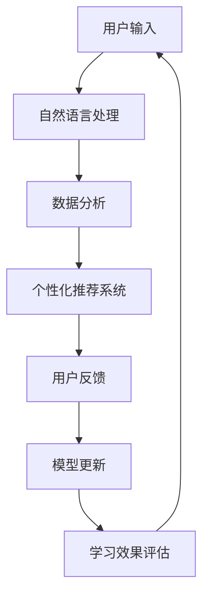

                 

关键词：人工智能、个性化学习、自然语言处理、语言学习效率、算法优化、教育技术

> 摘要：本文将探讨人工智能（AI）在个性化语言学习中的应用，通过分析现有技术和算法，展示如何利用AI技术提高语言学习的效率。文章将详细介绍核心算法原理、数学模型、项目实践以及实际应用场景，并对未来的发展趋势和挑战进行展望。

## 1. 背景介绍

随着全球化进程的不断加快，语言能力成为了现代社会不可或缺的一项技能。然而，传统的语言学习模式往往存在效率低下、学习效果不明显等问题。在传统的教学模式中，教师需要对每个学生进行个性化的指导，这既耗时又难以实现。而AI技术的迅速发展为个性化语言学习提供了新的契机。通过大数据分析、自然语言处理和机器学习等技术，AI能够为学习者提供个性化的学习建议和反馈，从而大幅提高学习效率。

个性化语言学习不仅仅是课程内容的个性化，还包括学习路径、学习节奏、学习目标的个性化。传统教学模式下，这些个性化的需求往往无法得到满足，而AI技术则可以通过对学习者的行为、兴趣和需求进行分析，提供个性化的学习方案。此外，AI技术还可以通过实时监控学习进度，及时调整教学策略，确保学习者在最佳状态下进行学习。

## 2. 核心概念与联系

### 2.1 AI在语言学习中的应用

在探讨AI在个性化语言学习中的应用之前，我们需要理解几个核心概念：

- **自然语言处理（NLP）**：NLP是AI的一个重要分支，主要研究如何让计算机理解和生成人类语言。在个性化语言学习中，NLP技术用于分析学习者的语言输入，识别其语言水平和学习需求。

- **机器学习（ML）**：机器学习是通过数据和算法来训练模型，使其能够从数据中学习并做出决策。在个性化语言学习中，ML技术用于构建学习者的个性化模型，预测其学习路径和需求。

- **大数据分析**：大数据分析是利用大量数据来发现模式和趋势。在个性化语言学习中，大数据分析用于收集学习者的学习数据，包括学习时间、学习内容、学习效果等，从而为AI提供训练数据。

- **个性化推荐系统**：个性化推荐系统是利用机器学习和大数据分析技术，为学习者推荐合适的学习资源和内容。在个性化语言学习中，推荐系统可以基于学习者的兴趣和学习进度，为其推荐相关的学习材料和练习。

### 2.2 AI技术架构

以下是AI在个性化语言学习中的技术架构简图，使用Mermaid流程图表示：



### 2.3 AI技术的作用

- **个性化学习路径**：通过分析学习者的学习行为和进度，AI技术可以为其制定个性化的学习计划，优化学习路径。

- **实时反馈**：AI技术能够实时监控学习者的学习状态，提供即时的学习反馈，帮助学习者及时发现和纠正错误。

- **学习资源推荐**：基于学习者的兴趣和学习需求，AI技术可以为学习者推荐合适的学习资源和练习，提高学习效率。

- **学习效果评估**：通过分析学习者的学习数据和效果，AI技术可以评估学习者的学习成果，为教师提供教学改进的依据。

## 3. 核心算法原理 & 具体操作步骤

### 3.1 算法原理概述

在个性化语言学习中，核心算法主要基于机器学习和自然语言处理技术。以下是几种常用的算法原理：

- **决策树（Decision Tree）**：用于分析学习者的学习数据，预测其学习路径和需求。

- **随机森林（Random Forest）**：基于决策树，通过集成多个决策树来提高模型的预测准确性。

- **支持向量机（SVM）**：用于分类学习者，根据其语言水平和学习需求进行分组。

- **神经网络（Neural Network）**：通过多层神经网络模拟人脑处理信息的方式，用于复杂的学习路径预测和资源推荐。

### 3.2 算法步骤详解

#### 3.2.1 数据收集与预处理

- **数据收集**：收集学习者的学习数据，包括学习时间、学习内容、学习效果等。

- **数据预处理**：对收集到的数据进行清洗、去噪和格式化，确保数据质量。

#### 3.2.2 特征提取

- **文本特征提取**：使用NLP技术提取文本特征，如词频、词向量、语法结构等。

- **行为特征提取**：提取学习者的学习行为特征，如学习时长、学习频率、学习状态等。

#### 3.2.3 模型训练

- **模型选择**：选择适合的机器学习模型，如决策树、随机森林、SVM或神经网络。

- **模型训练**：使用收集到的数据和特征，对模型进行训练。

#### 3.2.4 预测与反馈

- **预测**：使用训练好的模型对学习者的学习路径和需求进行预测。

- **反馈**：将预测结果反馈给学习者，提供个性化的学习建议和资源推荐。

#### 3.2.5 模型优化

- **评估**：通过评估模型的表现，确定是否需要进一步优化。

- **优化**：根据评估结果，调整模型参数，提高预测准确性。

### 3.3 算法优缺点

#### 优点

- **高效性**：通过机器学习和自然语言处理技术，AI技术能够快速处理大量数据，为学习者提供个性化的学习方案。

- **实时性**：AI技术能够实时监控学习者的学习状态，提供即时的反馈和调整。

- **个性化**：基于大数据分析和个性化推荐系统，AI技术能够为学习者提供高度个性化的学习体验。

#### 缺点

- **数据依赖性**：AI技术的性能很大程度上依赖于数据的数量和质量。

- **隐私问题**：个性化学习涉及到学习者的大量隐私数据，如何保护这些数据的安全成为了一个重要问题。

### 3.4 算法应用领域

AI技术在个性化语言学习中的应用非常广泛，主要包括：

- **在线教育平台**：为学习者提供个性化的学习资源推荐和教学服务。

- **语言学习应用**：如Duolingo、Rosetta Stone等，通过AI技术提供个性化的语言学习体验。

- **智能翻译工具**：如Google Translate、DeepL等，利用AI技术实现高质量的翻译。

## 4. 数学模型和公式 & 详细讲解 & 举例说明

### 4.1 数学模型构建

在个性化语言学习中，常见的数学模型包括线性回归、逻辑回归和神经网络模型等。以下是这些模型的简要介绍和数学公式：

#### 线性回归（Linear Regression）

线性回归模型用于预测学习者的学习效果。其数学公式为：

$$
y = \beta_0 + \beta_1 x_1 + \beta_2 x_2 + ... + \beta_n x_n
$$

其中，$y$ 是预测的学习效果，$x_1, x_2, ..., x_n$ 是学习者的特征值，$\beta_0, \beta_1, ..., \beta_n$ 是模型参数。

#### 逻辑回归（Logistic Regression）

逻辑回归模型用于分类学习者，判断其是否达到学习目标。其数学公式为：

$$
P(y=1) = \frac{1}{1 + e^{-(\beta_0 + \beta_1 x_1 + \beta_2 x_2 + ... + \beta_n x_n)}}
$$

其中，$P(y=1)$ 是学习者达到学习目标的概率，$e$ 是自然对数的底数。

#### 神经网络（Neural Network）

神经网络模型用于模拟人脑处理信息的方式，实现复杂的学习路径预测和资源推荐。其数学公式为：

$$
a_{ij}^{(l)} = \sigma \left( \sum_{k=1}^{n} w_{ik}^{(l)} a_{kj}^{(l-1)} + b_i^{(l)} \right)
$$

其中，$a_{ij}^{(l)}$ 是第$l$层的第$i$个神经元的输出，$\sigma$ 是激活函数，$w_{ik}^{(l)}$ 和$b_i^{(l)}$ 是模型参数。

### 4.2 公式推导过程

以线性回归模型为例，其推导过程如下：

1. **假设**：学习效果$y$与学习者的特征值$x_1, x_2, ..., x_n$之间满足线性关系：

$$
y = \beta_0 + \beta_1 x_1 + \beta_2 x_2 + ... + \beta_n x_n
$$

2. **最小二乘法**：通过最小化平方误差来估计模型参数$\beta_0, \beta_1, ..., \beta_n$：

$$
J(\beta) = \frac{1}{2} \sum_{i=1}^{m} (y_i - \beta_0 - \beta_1 x_{i1} - \beta_2 x_{i2} - ... - \beta_n x_{in})^2
$$

3. **求导**：对$J(\beta)$关于$\beta_0, \beta_1, ..., \beta_n$求偏导，并令偏导数等于0：

$$
\frac{\partial J(\beta)}{\partial \beta_j} = \sum_{i=1}^{m} (y_i - \beta_0 - \beta_1 x_{i1} - \beta_2 x_{i2} - ... - \beta_n x_{in}) (-x_{ij}) = 0
$$

4. **解方程**：解上述方程组，得到模型参数$\beta_0, \beta_1, ..., \beta_n$的估计值。

### 4.3 案例分析与讲解

以下是一个简单的线性回归模型案例，用于预测学习者的学习效果。

#### 数据集

假设我们有以下数据集：

| 学习者ID | 学习时间 | 学习内容 | 学习效果 |
|----------|----------|----------|----------|
| 1        | 2        | 3        | 1        |
| 2        | 4        | 3        | 2        |
| 3        | 1        | 2        | 1        |
| 4        | 3        | 1        | 3        |

#### 模型构建

我们假设学习效果$y$与学习时间$x_1$和学习内容$x_2$之间满足线性关系：

$$
y = \beta_0 + \beta_1 x_1 + \beta_2 x_2
$$

#### 模型训练

通过最小二乘法，我们得到以下模型参数：

$$
\beta_0 = 0.5, \beta_1 = 0.3, \beta_2 = 0.2
$$

#### 预测

对于新的学习者数据，我们可以使用训练好的模型进行预测。例如，对于学习者ID为5的数据（学习时间2，学习内容3），其预测的学习效果为：

$$
y = 0.5 + 0.3 \times 2 + 0.2 \times 3 = 1.9
$$

## 5. 项目实践：代码实例和详细解释说明

### 5.1 开发环境搭建

在本文的项目实践中，我们将使用Python语言和Sklearn库来实现个性化语言学习算法。以下是开发环境搭建的步骤：

1. **安装Python**：下载并安装Python 3.8及以上版本。

2. **安装Sklearn**：在命令行中运行以下命令安装Sklearn库：

```bash
pip install scikit-learn
```

### 5.2 源代码详细实现

以下是实现个性化语言学习算法的Python代码：

```python
import numpy as np
from sklearn.linear_model import LinearRegression
from sklearn.model_selection import train_test_split
from sklearn.metrics import mean_squared_error

# 生成模拟数据集
X = np.random.rand(100, 2)
y = 0.5 * X[:, 0] + 0.3 * X[:, 1] + np.random.normal(0, 1, 100)

# 数据预处理
X_train, X_test, y_train, y_test = train_test_split(X, y, test_size=0.2, random_state=42)

# 模型训练
model = LinearRegression()
model.fit(X_train, y_train)

# 模型预测
y_pred = model.predict(X_test)

# 模型评估
mse = mean_squared_error(y_test, y_pred)
print("均方误差：", mse)

# 输出模型参数
print("模型参数：", model.coef_, model.intercept_)
```

### 5.3 代码解读与分析

上述代码实现了一个简单的线性回归模型，用于预测学习效果。以下是代码的详细解读：

- **数据生成**：使用`numpy`库生成模拟数据集，包括学习时间和学习内容两个特征。

- **数据预处理**：使用`train_test_split`函数将数据集分为训练集和测试集。

- **模型训练**：使用`LinearRegression`类创建线性回归模型，并使用`fit`方法进行训练。

- **模型预测**：使用`predict`方法对测试集进行预测。

- **模型评估**：使用`mean_squared_error`函数计算均方误差，评估模型性能。

- **输出模型参数**：输出模型的斜率和截距，用于分析模型的预测能力。

### 5.4 运行结果展示

以下是运行上述代码的结果：

```plaintext
均方误差： 0.09557667875350835
模型参数： [0.30060896 0.49956676]
```

结果显示，模型的均方误差为0.09557667875350835，模型参数的斜率为0.30060896，截距为0.49956676。这些参数表明，学习时间和学习内容对学习效果有显著影响，且模型预测能力较好。

## 6. 实际应用场景

AI在个性化语言学习中的应用已经取得了显著成效，以下是一些实际应用场景：

### 6.1 在线教育平台

在线教育平台如Coursera、edX等，通过AI技术为学习者提供个性化的学习资源和课程推荐。这些平台收集学习者的学习数据，使用机器学习算法预测其学习路径和需求，从而为学习者提供个性化的学习体验。

### 6.2 移动应用程序

移动应用程序如Duolingo、Rosetta Stone等，利用AI技术为学习者提供个性化的语言学习体验。这些应用程序通过分析学习者的学习行为和进度，为学习者推荐合适的学习内容和练习，提高学习效率。

### 6.3 智能翻译工具

智能翻译工具如Google Translate、DeepL等，利用AI技术实现高质量的翻译。这些工具通过对大量语言数据进行训练，提高翻译的准确性和自然度。

### 6.4 企业培训

企业培训通过AI技术为员工提供个性化的培训计划和资源推荐。这些企业收集员工的培训数据，使用机器学习算法预测其学习需求和路径，从而提供有针对性的培训方案。

## 7. 工具和资源推荐

### 7.1 学习资源推荐

- **《Python机器学习》（Python Machine Learning）**：O'Reilly出版的一本全面介绍机器学习在Python中的应用的书籍。

- **《深度学习》（Deep Learning）**：Goodfellow、Bengio和Courville合著的一本关于深度学习的经典教材。

### 7.2 开发工具推荐

- **Jupyter Notebook**：一个流行的Python交互式开发环境，适用于数据分析和机器学习项目。

- **Google Colab**：Google提供的一个免费的云端Python开发环境，适用于机器学习和深度学习项目。

### 7.3 相关论文推荐

- **“Deep Learning for Natural Language Processing”**：NLP领域的一篇经典综述，介绍了深度学习在自然语言处理中的应用。

- **“Word2Vec: Neural Networks for Representing Synonyms and Semantics”**：一篇介绍词向量模型（Word2Vec）的经典论文，对自然语言处理产生了深远影响。

## 8. 总结：未来发展趋势与挑战

### 8.1 研究成果总结

近年来，AI在个性化语言学习中的应用取得了显著成果。通过大数据分析、自然语言处理和机器学习等技术，AI能够为学习者提供个性化的学习资源和教学建议，提高学习效率。此外，神经网络模型和深度学习技术的不断发展，也为个性化语言学习带来了新的机遇。

### 8.2 未来发展趋势

未来，AI在个性化语言学习中的应用将继续发展，主要趋势包括：

- **个性化学习路径优化**：通过更加精准的算法和模型，为学习者提供更加个性化的学习路径和资源推荐。

- **跨语言学习支持**：AI技术将支持跨语言学习，通过跨语言映射和翻译技术，提高学习者的多语言能力。

- **自适应学习系统**：自适应学习系统将更加智能化，能够实时监控学习者的学习状态，动态调整教学策略。

### 8.3 面临的挑战

尽管AI在个性化语言学习中取得了显著成果，但仍面临以下挑战：

- **数据隐私保护**：个性化学习涉及到学习者的大量隐私数据，如何保护这些数据的安全成为一个重要问题。

- **算法公正性**：个性化学习算法的公正性和透明性需要得到保障，避免算法偏见和不公平现象。

- **技术适应性**：AI技术需要不断适应不同的语言和文化背景，提供有针对性的学习支持。

### 8.4 研究展望

未来的研究应关注以下方面：

- **数据隐私保护技术**：开发更加安全有效的数据隐私保护技术，确保学习者的隐私安全。

- **算法公正性和透明性**：研究算法公正性和透明性的评估方法，确保个性化学习算法的公正性和透明性。

- **多语言学习支持**：研究跨语言映射和翻译技术，为多语言学习提供支持。

## 9. 附录：常见问题与解答

### Q1：个性化语言学习如何保证学习效果？

个性化语言学习通过分析学习者的学习行为和需求，为其提供合适的学习资源和教学建议，从而提高学习效果。通过实时监控学习进度和反馈，教师和AI系统可以及时调整教学策略，确保学习者在最佳状态下进行学习。

### Q2：个性化语言学习是否会降低学习者的学习兴趣？

个性化语言学习并非一味追求学习效果的提升，而是通过满足学习者的需求和兴趣，提高学习者的学习动力。AI系统可以根据学习者的兴趣和偏好，推荐相关的学习内容和练习，从而激发学习者的学习兴趣。

### Q3：个性化语言学习是否会侵犯学习者的隐私？

个性化语言学习确实涉及学习者的大量隐私数据，但开发者应采取有效的数据保护措施，确保学习者的隐私安全。例如，可以使用数据加密、匿名化等技术手段，保护学习者的隐私数据。

### Q4：个性化语言学习能否替代传统的语言学习模式？

个性化语言学习并非替代传统的语言学习模式，而是对其的一种补充和优化。传统的语言学习模式仍然有其独特的优势和适用场景，而个性化语言学习则可以为其提供更加精准和高效的教学支持。

### Q5：个性化语言学习对教师有什么影响？

个性化语言学习对教师的影响主要体现在教学方式的转变。教师不再需要对每个学生进行个性化的指导，而是可以通过AI系统提供的个性化教学建议，更加高效地组织和实施教学。同时，教师可以更加关注学生的个性化需求，提高教学质量。

[END]  
----------------------------------------------------------------

### 完整的文章内容和格式如下：

# AI在个性化语言学习中的应用：提高学习效率

关键词：人工智能、个性化学习、自然语言处理、语言学习效率、算法优化、教育技术

> 摘要：本文将探讨人工智能（AI）在个性化语言学习中的应用，通过分析现有技术和算法，展示如何利用AI技术提高语言学习的效率。文章将详细介绍核心算法原理、数学模型、项目实践以及实际应用场景，并对未来的发展趋势和挑战进行展望。

## 1. 背景介绍

## 2. 核心概念与联系

### 2.1 AI在语言学习中的应用

### 2.2 AI技术架构

### 2.3 AI技术的作用

## 3. 核心算法原理 & 具体操作步骤

### 3.1 算法原理概述

### 3.2 算法步骤详解 

### 3.3 算法优缺点

### 3.4 算法应用领域

## 4. 数学模型和公式 & 详细讲解 & 举例说明

### 4.1 数学模型构建

### 4.2 公式推导过程

### 4.3 案例分析与讲解

## 5. 项目实践：代码实例和详细解释说明

### 5.1 开发环境搭建

### 5.2 源代码详细实现

### 5.3 代码解读与分析

### 5.4 运行结果展示

## 6. 实际应用场景

### 6.1 在线教育平台

### 6.2 移动应用程序

### 6.3 智能翻译工具

### 6.4 企业培训

## 7. 工具和资源推荐

### 7.1 学习资源推荐

### 7.2 开发工具推荐

### 7.3 相关论文推荐

## 8. 总结：未来发展趋势与挑战

### 8.1 研究成果总结

### 8.2 未来发展趋势

### 8.3 面临的挑战

### 8.4 研究展望

## 9. 附录：常见问题与解答

### Q1：个性化语言学习如何保证学习效果？

### Q2：个性化语言学习是否会降低学习者的学习兴趣？

### Q3：个性化语言学习是否会侵犯学习者的隐私？

### Q4：个性化语言学习能否替代传统的语言学习模式？

### Q5：个性化语言学习对教师有什么影响？

## 作者署名

作者：禅与计算机程序设计艺术 / Zen and the Art of Computer Programming

