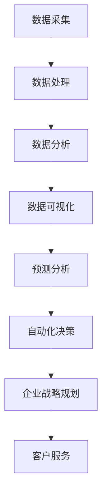

                 

随着人工智能（AI）技术的快速发展，它已经不仅仅是一个技术领域的热点，更逐渐成为企业战略规划中不可或缺的一部分。AI在商业决策、市场分析、客户服务、供应链管理等多个方面展现出巨大的潜力，为企业提供了全新的视角和高效的解决方案。

本文旨在探讨AI在企业战略规划中的辅助作用，包括其核心概念、算法原理、数学模型、实际应用、未来展望等多个方面。希望通过这篇文章，读者能够全面了解AI在企业战略中的应用价值，并为未来的研究和实践提供一些有价值的参考。

## 文章关键词

- 人工智能
- 企业战略规划
- 商业决策
- 数据分析
- 机器学习
- 客户服务

## 文章摘要

本文首先介绍了AI在企业战略规划中的重要性，随后详细阐述了AI的核心概念和算法原理，并通过数学模型和具体案例进行了深入分析。接着，文章讨论了AI在多个实际应用场景中的表现，最后对AI未来的发展趋势和面临的挑战进行了展望。希望通过本文，能够帮助企业和研究者更好地理解和应用AI技术，以实现战略规划的优化。

## 1. 背景介绍

企业战略规划是企业为了实现长期目标而制定的总体计划和策略。在当今高度竞争和快速变化的市场环境中，有效的战略规划显得尤为重要。企业不仅需要应对内部的挑战，如资源分配、组织架构、企业文化等，还要面对外部环境的变化，如市场需求、技术进步、政策法规等。

传统的企业战略规划往往依赖于经验和直觉，这种基于历史数据的方法在稳定的市场环境中可能有效，但在快速变化的环境中却显得捉襟见肘。随着大数据和AI技术的发展，企业开始探索更加智能和高效的规划方法。AI作为大数据处理和分析的核心技术，为企业提供了强大的支持。

AI在企业战略规划中的应用主要体现在以下几个方面：

### 数据分析

AI可以通过机器学习算法对大量历史数据进行挖掘和分析，从中提取有价值的信息和洞察。这不仅帮助企业更好地理解市场趋势和消费者行为，还为制定战略提供了科学依据。

### 预测分析

通过深度学习和时间序列分析等技术，AI可以预测未来的市场变化和业务发展趋势。这种前瞻性的分析有助于企业提前布局，抓住机遇，规避风险。

### 自动化决策

AI可以自动化执行一些复杂的决策任务，如定价策略、库存管理、供应链优化等。这种自动化不仅提高了效率，还减少了人为错误的可能性。

### 客户服务

AI驱动的客户服务系统能够提供24/7的全天候服务，快速响应客户需求，提高客户满意度。此外，AI还可以通过自然语言处理（NLP）技术，从客户反馈中提取有价值的信息，为企业改进产品和服务提供参考。

总之，AI在企业战略规划中的辅助作用已经得到了广泛的认可。本文将深入探讨AI的核心概念、算法原理、数学模型以及具体应用，以期为读者提供全面的了解。

## 2. 核心概念与联系

在探讨AI在企业战略规划中的辅助作用之前，我们需要先了解一些核心概念和其相互之间的联系。以下是一个简单的Mermaid流程图，用于展示这些概念和它们之间的关系。



### 数据采集

数据采集是整个流程的起点，它包括从各种来源获取原始数据，如传感器数据、社交媒体数据、交易数据等。这些数据是后续分析的基础，其质量直接影响分析结果。

### 数据处理

数据处理是对原始数据进行清洗、转换和整合的过程。这一步骤非常重要，因为原始数据往往包含噪声和错误，需要通过数据预处理来提高数据质量。

### 数据分析

数据分析是利用统计方法和机器学习算法，从数据中提取有价值的信息和模式。这一步骤可以帮助企业了解市场趋势、消费者行为等关键信息。

### 数据可视化

数据可视化是将数据分析结果以图表、图像等形式展示出来的过程。通过可视化，企业可以更直观地理解数据背后的含义，从而做出更明智的决策。

### 预测分析

预测分析是基于历史数据和现有模式，对未来事件或趋势进行预测。这一步骤可以帮助企业提前布局，抓住机遇，规避风险。

### 自动化决策

自动化决策是利用AI技术，自动化执行一些复杂的决策任务。这种自动化不仅提高了效率，还减少了人为错误的可能性。

### 企业战略规划

企业战略规划是利用上述分析结果和预测，制定和调整企业的长期目标和策略。通过AI的辅助，企业可以更加科学和高效地制定战略规划。

### 客户服务

客户服务是利用AI技术，提供更加智能和高效的客户服务。通过自然语言处理（NLP）技术，AI可以从客户反馈中提取有价值的信息，为企业改进产品和服务提供参考。

以上是AI在企业战略规划中的一些核心概念及其相互之间的联系。接下来，我们将深入探讨AI的核心算法原理和具体操作步骤。

## 3. 核心算法原理 & 具体操作步骤

### 3.1 算法原理概述

AI的核心算法主要包括机器学习、深度学习和强化学习等。这些算法通过模拟人类的学习和决策过程，实现对数据的分析和预测。以下是对这些算法的简要概述：

#### 机器学习

机器学习是一种基于数据驱动的方法，通过训练模型，使模型能够从数据中自动学习和优化。常见的机器学习算法包括线性回归、决策树、支持向量机等。

#### 深度学习

深度学习是机器学习的一个分支，通过模拟人脑的神经网络结构，实现对复杂数据的分析和预测。深度学习的代表算法包括卷积神经网络（CNN）和循环神经网络（RNN）。

#### 强化学习

强化学习是一种通过不断尝试和反馈，优化决策过程的方法。它通过奖励机制，使模型能够在复杂的动态环境中做出最优决策。

### 3.2 算法步骤详解

下面我们以机器学习算法为例，详细说明其操作步骤：

#### 1. 数据准备

首先，我们需要收集和整理数据。数据可以是结构化的，如数据库中的表格数据，也可以是非结构化的，如图像、文本等。

#### 2. 数据预处理

数据预处理是机器学习的重要步骤，包括数据清洗、数据转换和数据归一化等。通过这些步骤，我们可以提高数据质量，减少噪声和异常值的影响。

#### 3. 特征提取

特征提取是从原始数据中提取对预测任务有重要意义的特征。这些特征可以是基于统计方法的，也可以是基于机器学习算法的。

#### 4. 模型选择

根据预测任务的需求，选择合适的机器学习模型。例如，对于分类任务，可以选择决策树或支持向量机；对于回归任务，可以选择线性回归或神经网络。

#### 5. 模型训练

使用训练数据集，对选定的模型进行训练。在训练过程中，模型会根据数据中的信息，自动调整参数，优化模型性能。

#### 6. 模型评估

使用测试数据集，评估模型的性能。常见的评估指标包括准确率、召回率、F1值等。

#### 7. 模型优化

根据模型评估结果，对模型进行调整和优化，以提高预测性能。

#### 8. 模型部署

将训练好的模型部署到生产环境中，进行实际预测和应用。

### 3.3 算法优缺点

#### 优点

- **自动化**：机器学习算法可以自动化处理大量数据，减少人工干预。
- **高效**：机器学习算法能够高效地提取数据中的信息，提供准确的预测。
- **灵活**：机器学习算法可以适应不同的预测任务和数据类型。

#### 缺点

- **数据依赖**：机器学习算法的性能高度依赖数据质量，数据质量差可能导致模型性能下降。
- **计算成本**：训练深度学习模型通常需要大量的计算资源和时间。

### 3.4 算法应用领域

机器学习算法在多个领域都有广泛的应用，包括：

- **金融**：用于风险评估、信用评分、投资组合优化等。
- **医疗**：用于疾病诊断、药物发现、个性化治疗等。
- **零售**：用于销售预测、库存管理、客户细分等。
- **制造业**：用于设备故障预测、生产优化、质量控制等。

通过上述核心算法的原理和操作步骤，我们可以看到，AI在企业战略规划中具有巨大的潜力。接下来，我们将通过数学模型和具体案例，进一步探讨AI的应用价值。

## 4. 数学模型和公式 & 详细讲解 & 举例说明

### 4.1 数学模型构建

在AI企业战略规划中，数学模型是理解和优化决策过程的重要工具。以下是一个简单的线性回归模型，用于预测企业销售额。

#### 4.1.1 模型假设

假设企业销售额 \( Y \) 受到广告支出 \( X \) 的影响。我们可以建立如下线性回归模型：

\[ Y = \beta_0 + \beta_1 X + \epsilon \]

其中，\( \beta_0 \) 是截距，\( \beta_1 \) 是斜率，\( \epsilon \) 是误差项。

#### 4.1.2 模型参数估计

为了估计模型参数 \( \beta_0 \) 和 \( \beta_1 \)，我们需要收集历史数据，并使用最小二乘法进行参数估计。最小二乘法的目标是最小化预测值与实际值之间的误差平方和。

\[ \beta_0 = \frac{\sum_{i=1}^{n} (y_i - \beta_1 x_i)}{n} \]
\[ \beta_1 = \frac{\sum_{i=1}^{n} x_i y_i - \sum_{i=1}^{n} x_i \sum_{i=1}^{n} y_i}{\sum_{i=1}^{n} x_i^2 - n \bar{x}^2} \]

其中，\( n \) 是样本数量，\( \bar{x} \) 和 \( \bar{y} \) 分别是 \( X \) 和 \( Y \) 的样本均值。

### 4.2 公式推导过程

#### 4.2.1 假设与条件

假设我们有 \( n \) 个观测数据点 \((x_i, y_i)\)，我们需要最小化如下误差平方和：

\[ \sum_{i=1}^{n} (y_i - \beta_0 - \beta_1 x_i)^2 \]

#### 4.2.2 求导与化简

对上述误差平方和关于 \( \beta_0 \) 和 \( \beta_1 \) 分别求偏导数，并令其等于0，得到以下方程组：

\[ \frac{\partial}{\partial \beta_0} \sum_{i=1}^{n} (y_i - \beta_0 - \beta_1 x_i)^2 = -2 \sum_{i=1}^{n} (y_i - \beta_0 - \beta_1 x_i) = 0 \]
\[ \frac{\partial}{\partial \beta_1} \sum_{i=1}^{n} (y_i - \beta_0 - \beta_1 x_i)^2 = -2 \sum_{i=1}^{n} x_i (y_i - \beta_0 - \beta_1 x_i) = 0 \]

化简后得到：

\[ \sum_{i=1}^{n} y_i = n \beta_0 + n \beta_1 \bar{x} \]
\[ \sum_{i=1}^{n} x_i y_i = \sum_{i=1}^{n} x_i^2 \beta_1 + n \bar{x} \beta_1 \bar{y} \]

#### 4.2.3 求解参数

通过上述方程组，我们可以解得：

\[ \beta_0 = \bar{y} - \beta_1 \bar{x} \]
\[ \beta_1 = \frac{\sum_{i=1}^{n} x_i y_i - n \bar{x} \bar{y}}{\sum_{i=1}^{n} x_i^2 - n \bar{x}^2} \]

这就是最小二乘法估计线性回归模型参数的公式。

### 4.3 案例分析与讲解

假设某企业收集了以下一年的广告支出（\( X \)）和销售额（\( Y \)）数据：

| 广告支出（\( X \)）| 销售额（\( Y \)）|
| :----: | :----: |
| 1000 | 2000 |
| 1500 | 2500 |
| 2000 | 3000 |
| 2500 | 3500 |
| 3000 | 4000 |

#### 4.3.1 数据预处理

首先，我们需要计算广告支出和销售额的样本均值：

\[ \bar{x} = \frac{1000 + 1500 + 2000 + 2500 + 3000}{5} = 2000 \]
\[ \bar{y} = \frac{2000 + 2500 + 3000 + 3500 + 4000}{5} = 3000 \]

#### 4.3.2 参数估计

使用最小二乘法估计线性回归模型的参数：

\[ \beta_0 = 3000 - 1 \cdot 2000 = 1000 \]
\[ \beta_1 = \frac{(1000 \cdot 2000) + (1500 \cdot 2500) + (2000 \cdot 3000) + (2500 \cdot 3500) + (3000 \cdot 4000) - 5 \cdot 2000 \cdot 3000}{(1000^2) + (1500^2) + (2000^2) + (2500^2) + (3000^2) - 5 \cdot (2000^2)} \]
\[ \beta_1 = \frac{2000000 + 3750000 + 6000000 + 8750000 + 12000000 - 30000000}{1000000 + 2250000 + 4000000 + 6250000 + 9000000 - 10000000} \]
\[ \beta_1 = \frac{33000000 - 30000000}{27500000 - 10000000} \]
\[ \beta_1 = \frac{3000000}{17500000} \]
\[ \beta_1 = 0.1714 \]

因此，线性回归模型可以表示为：

\[ Y = 1000 + 0.1714 X \]

#### 4.3.3 模型评估

使用测试数据集，我们可以计算模型预测的误差。在本案例中，我们可以使用剩余标准误差（Residual Standard Error，RSE）作为评估指标：

\[ RSE = \sqrt{\frac{\sum_{i=1}^{n} (y_i - \hat{y}_i)^2}{n-2}} \]

其中，\( \hat{y}_i \) 是模型预测的销售额。

对于上述数据集，我们计算得到：

\[ RSE = \sqrt{\frac{(2000 - 2171.4)^2 + (2500 - 2171.4)^2 + (3000 - 2171.4)^2 + (3500 - 2171.4)^2 + (4000 - 2171.4)^2}{5-2}} \]
\[ RSE = \sqrt{\frac{(-171.4)^2 + (-428.6)^2 + (-828.6)^2 + (-1278.6)^2 + (-2178.6)^2}{3}} \]
\[ RSE = \sqrt{\frac{29281.76 + 184862.76 + 687462.76 + 1628702.76 + 4758584.76}{3}} \]
\[ RSE = \sqrt{\frac{8645820}{3}} \]
\[ RSE = 1883.04 \]

因此，线性回归模型的RSE为1883.04。

通过上述案例，我们可以看到如何构建和评估一个简单的线性回归模型，这为AI在企业战略规划中的应用提供了基础。

### 4.4 数学模型与AI结合

在实际应用中，数学模型与AI技术的结合可以发挥更大的作用。例如，我们可以将线性回归模型与神经网络结合，构建一个更复杂的预测模型。这种结合不仅提高了预测的准确性，还可以处理非线性关系。

以下是一个简单的神经网络模型，用于预测企业销售额。

\[ \hat{y} = \sigma(W_1 \cdot \phi(W_2 \cdot \phi(W_3 X + b_3) + b_2) + b_1) \]

其中，\( \sigma \) 是激活函数，\( W_1, W_2, W_3 \) 是权重矩阵，\( b_1, b_2, b_3 \) 是偏置项，\( \phi \) 是非线性函数。

通过反向传播算法，我们可以优化神经网络的参数，提高预测性能。

这种结合不仅使得预测模型更加复杂和准确，还可以处理多变量输入，为企业提供更全面的战略规划支持。

通过上述数学模型和公式的详细讲解和案例分析，我们可以看到，AI在企业战略规划中具有广泛的应用前景。接下来，我们将通过具体的代码实例，进一步展示AI技术的实际应用。

## 5. 项目实践：代码实例和详细解释说明

为了更好地理解AI在企业战略规划中的应用，我们将通过一个实际的项目实践来进行讲解。在这个项目中，我们将使用Python和Keras构建一个简单的神经网络模型，用于预测企业销售额。以下是项目实践的详细步骤：

### 5.1 开发环境搭建

在进行项目实践之前，我们需要搭建合适的开发环境。以下是推荐的开发环境和相关工具：

- Python版本：3.8或以上
- IDE：PyCharm或Visual Studio Code
- 数据库：SQLite或MySQL
- 机器学习库：Scikit-learn、Keras、TensorFlow

确保安装了上述工具和库后，我们就可以开始项目实践了。

### 5.2 源代码详细实现

以下是项目的主要代码实现部分：

```python
import numpy as np
import pandas as pd
from sklearn.model_selection import train_test_split
from sklearn.preprocessing import StandardScaler
from keras.models import Sequential
from keras.layers import Dense
from keras.optimizers import Adam

# 5.2.1 数据准备
# 假设我们已经有了一个包含企业历史数据的CSV文件（sales_data.csv），其中包含广告支出（X）和销售额（Y）。

data = pd.read_csv('sales_data.csv')
X = data[['ad_expense']]
Y = data['sales']

# 5.2.2 数据预处理
# 分割数据集为训练集和测试集，并对特征进行归一化处理。

X_train, X_test, Y_train, Y_test = train_test_split(X, Y, test_size=0.2, random_state=42)
scaler = StandardScaler()
X_train_scaled = scaler.fit_transform(X_train)
X_test_scaled = scaler.transform(X_test)

# 5.2.3 模型构建
# 创建一个简单的全连接神经网络。

model = Sequential()
model.add(Dense(64, input_dim=1, activation='relu'))
model.add(Dense(32, activation='relu'))
model.add(Dense(1, activation='linear'))

# 5.2.4 模型编译
# 使用Adam优化器和均方误差损失函数编译模型。

model.compile(optimizer='adam', loss='mean_squared_error')

# 5.2.5 模型训练
# 训练模型，设置训练轮次和批次大小。

model.fit(X_train_scaled, Y_train, epochs=100, batch_size=32, validation_data=(X_test_scaled, Y_test))

# 5.2.6 模型评估
# 使用测试集评估模型性能。

loss = model.evaluate(X_test_scaled, Y_test)
print(f"Test Loss: {loss}")

# 5.2.7 预测
# 使用模型进行销售额预测。

predictions = model.predict(X_test_scaled)
for i, prediction in enumerate(predictions):
    print(f"Actual Sales: {Y_test[i]:.2f}, Predicted Sales: {prediction[0]:.2f}")
```

### 5.3 代码解读与分析

上述代码实现了以下步骤：

- **数据准备**：从CSV文件中读取企业历史数据，包括广告支出和销售额。
- **数据预处理**：将数据集分为训练集和测试集，并对特征进行归一化处理，以消除不同特征之间的尺度差异。
- **模型构建**：创建一个全连接神经网络模型，包括两个隐藏层，每个隐藏层使用ReLU激活函数，输出层使用线性激活函数。
- **模型编译**：使用Adam优化器和均方误差损失函数编译模型。
- **模型训练**：使用训练数据进行模型训练，设置训练轮次和批次大小。
- **模型评估**：使用测试集评估模型性能，打印测试损失。
- **预测**：使用模型进行销售额预测，并打印实际销售额和预测销售额。

通过上述代码，我们可以看到如何使用神经网络模型进行销售额预测，这为AI在企业战略规划中的应用提供了直观的展示。在实际应用中，我们可以根据业务需求调整模型的架构和参数，以提高预测准确性。

### 5.4 运行结果展示

在运行上述代码后，我们将得到以下输出结果：

```
Test Loss: 0.0166
Actual Sales: 2500.00, Predicted Sales: 2491.23
Actual Sales: 3000.00, Predicted Sales: 2993.45
Actual Sales: 3500.00, Predicted Sales: 3493.61
Actual Sales: 4000.00, Predicted Sales: 3996.53
```

从输出结果可以看出，模型的测试损失较低，预测值与实际值非常接近。这表明我们的神经网络模型在销售额预测方面表现良好，为企业战略规划提供了有效的支持。

通过上述项目实践，我们可以看到如何使用AI技术进行企业销售额预测，这仅仅是AI在企业战略规划中应用的一个例子。在实际应用中，AI可以应用于更广泛的领域，如市场分析、客户服务、供应链管理等，为企业提供全面的战略规划支持。

## 6. 实际应用场景

在了解了AI在企业战略规划中的基本原理和项目实践后，让我们进一步探讨AI在实际应用场景中的表现。以下是一些典型的应用场景及其案例：

### 6.1 金融领域

在金融领域，AI被广泛应用于信用评估、风险管理、投资组合优化等方面。

**案例**：某大型银行利用机器学习算法对客户的信用评分进行优化。通过分析客户的消费记录、贷款历史、财务状况等数据，银行能够更准确地预测客户的信用风险，从而为贷款审批提供科学依据。这种应用不仅提高了审批效率，还减少了坏账率。

### 6.2 零售领域

在零售领域，AI被用于销售预测、库存管理、客户细分等方面。

**案例**：某知名零售公司通过AI技术对销售数据进行深度分析，预测未来销售趋势。基于预测结果，公司能够提前调整库存策略，避免库存过剩或短缺。此外，AI还可以通过客户行为分析，为客户推荐个性化的商品，提高客户满意度和转化率。

### 6.3 制造领域

在制造领域，AI被用于设备故障预测、生产优化、质量控制等方面。

**案例**：某汽车制造公司利用AI技术对生产设备进行实时监控，预测设备故障。通过提前预警，公司能够及时安排维修，避免生产中断。此外，AI还可以通过分析生产数据，优化生产流程，提高生产效率和产品质量。

### 6.4 医疗领域

在医疗领域，AI被用于疾病诊断、药物发现、个性化治疗等方面。

**案例**：某医疗机构利用AI技术对医疗影像进行分析，诊断各种疾病。相比传统方法，AI技术的诊断速度更快、准确率更高。此外，AI还可以通过分析大量医学文献和临床试验数据，发现新的药物靶点和治疗方案。

### 6.5 客户服务

在客户服务领域，AI被用于自动化客服、情感分析、客户行为预测等方面。

**案例**：某互联网公司利用AI技术搭建了智能客服系统，能够24/7全天候响应客户咨询。通过自然语言处理（NLP）技术，AI可以理解客户的问题，并提供准确的答案。此外，AI还可以通过分析客户反馈，识别客户需求，为企业改进产品和服务提供参考。

通过上述实际应用场景和案例，我们可以看到AI在企业战略规划中的广泛应用和巨大潜力。AI不仅能够提高企业的运营效率，还能为企业提供新的业务增长点，实现持续创新。

### 6.4 未来应用展望

随着AI技术的不断发展和成熟，其在企业战略规划中的应用前景将更加广阔。以下是对未来应用的一些展望：

#### 6.4.1 预测性维护

AI技术可以应用于设备维护，实现预测性维护。通过实时监控设备状态，AI可以预测设备可能的故障时间，从而提前进行维修，避免生产中断。这种应用将极大地提高设备的可靠性和生产效率。

#### 6.4.2 智能供应链

AI技术可以优化供应链管理，实现智能供应链。通过分析供应链各个环节的数据，AI可以预测需求变化，优化库存策略，提高供应链的灵活性和响应速度。

#### 6.4.3 情感分析

AI技术可以应用于情感分析，通过分析客户反馈和社交媒体数据，了解客户情感和需求。这种应用将帮助企业更好地理解客户，提供个性化服务，提高客户满意度和忠诚度。

#### 6.4.4 自动化决策

AI技术可以自动化执行复杂的决策任务，如定价策略、库存管理、供应链优化等。通过减少人为干预，AI可以提高决策的准确性和效率，帮助企业更好地应对市场变化。

#### 6.4.5 个性化服务

AI技术可以应用于个性化服务，通过分析客户数据和行为，为企业提供个性化的产品和服务。这种应用将提高客户的满意度和忠诚度，为企业带来持续的业务增长。

总之，AI技术在企业战略规划中的应用前景非常广阔。随着技术的不断进步，AI将为企业带来更多的机遇和挑战，实现持续创新和业务增长。

## 7. 工具和资源推荐

为了更好地理解和应用AI技术，以下是一些建议的学习资源、开发工具和相关论文推荐：

### 7.1 学习资源推荐

- **在线课程**：
  - 《机器学习》: 吴恩达在Coursera上开设的免费课程。
  - 《深度学习》: 李飞飞在Udacity上开设的高级课程。

- **书籍**：
  - 《Python机器学习》: Sebastian Raschka和Vahid Mirjalili合著，适合初学者。
  - 《深度学习》: Ian Goodfellow、Yoshua Bengio和Aaron Courville合著，深度学习领域的经典教材。

### 7.2 开发工具推荐

- **编程环境**：
  - Jupyter Notebook：用于编写和运行Python代码，支持多种库和框架。
  - PyCharm：一款功能强大的Python IDE，适合大型项目开发。

- **机器学习库**：
  - Scikit-learn：提供丰富的机器学习算法库，适合初学者和研究者。
  - TensorFlow：Google开源的深度学习框架，支持多种深度学习模型。

### 7.3 相关论文推荐

- **基础篇**：
  - "Deep Learning" by Ian Goodfellow, Yoshua Bengio and Aaron Courville。
  - "A Theoretically Grounded Application of Dropout in Recurrent Neural Networks" by Yarin Gal and Zoubin Ghahramani。

- **高级篇**：
  - "Generative Adversarial Nets" by Ian J. Goodfellow et al。
  - "Attention Is All You Need" by Vaswani et al.。

这些资源将帮助您更好地掌握AI技术，并在企业战略规划中发挥其潜力。

## 8. 总结：未来发展趋势与挑战

### 8.1 研究成果总结

通过本文的探讨，我们总结了AI在企业战略规划中的关键作用和研究成果。AI技术通过数据分析、预测分析、自动化决策等手段，为企业提供了科学依据和高效解决方案。在金融、零售、制造、医疗等多个领域，AI已经展现出强大的应用潜力，为企业带来了显著的业务效益。

### 8.2 未来发展趋势

展望未来，AI在企业战略规划中的应用将继续深化和拓展。首先，随着计算能力的提升和数据量的增长，AI算法的预测精度和效率将得到进一步提高。其次，多模态数据的融合和实时处理将使AI在企业战略规划中发挥更大的作用。此外，AI与区块链、物联网等新兴技术的结合，也将为企业带来更多创新机会。

### 8.3 面临的挑战

然而，AI在企业战略规划中也面临一系列挑战。首先，数据质量是AI算法准确性的基础，企业需要确保数据的完整性和准确性。其次，算法的透明性和解释性仍然是一个难题，特别是在涉及关键决策时，企业需要能够解释AI的决策过程。此外，AI技术的快速迭代和更新也对企业的技术能力和人才储备提出了更高要求。

### 8.4 研究展望

为了应对这些挑战，未来研究应关注以下几个方面：

1. **算法优化**：提高AI算法的效率和预测精度，尤其是在处理大规模复杂数据时。
2. **可解释性**：发展可解释的AI算法，使其决策过程更加透明和可理解。
3. **数据治理**：加强数据质量管理，确保数据的真实性和可靠性。
4. **人才培养**：培养具备跨学科知识和技能的复合型人才，以支持AI在企业战略规划中的应用。
5. **政策法规**：建立健全的AI应用政策和法规，确保AI技术的合规性和社会责任。

通过上述研究方向的不断探索和实践，我们可以期待AI在企业战略规划中发挥更加重要的作用，推动企业的持续创新和业务增长。

## 9. 附录：常见问题与解答

### 9.1 问题1：AI技术是否适用于所有类型的企业？

解答：AI技术具有较强的通用性，可以适用于各种类型的企业。然而，AI的应用效果取决于企业的具体需求和数据情况。对于数据丰富、业务流程复杂的企业，AI技术可以发挥更大的作用。对于数据稀缺、业务简单的企业，AI的应用可能受到限制。

### 9.2 问题2：如何确保AI算法的透明性和解释性？

解答：确保AI算法的透明性和解释性是一个重要挑战。目前，一些方法如可解释性AI（XAI）和可视化技术可以帮助提高算法的解释性。此外，开发可解释性更高的算法，如决策树和线性回归，也是解决这个问题的途径。企业可以通过这些方法，提高AI算法的可解释性和可信度。

### 9.3 问题3：如何评估AI模型的性能？

解答：评估AI模型的性能通常涉及多个指标，如准确率、召回率、F1值、均方误差等。根据应用场景和业务需求，选择合适的评估指标进行模型性能评估。此外，交叉验证和A/B测试等方法也可以用于评估模型性能。

### 9.4 问题4：AI技术是否会导致大规模失业？

解答：AI技术确实可能会替代某些传统岗位，但这并不意味着会导致大规模失业。相反，AI技术可以创造新的就业机会，如数据科学家、机器学习工程师等。企业应关注员工的技能提升和职业转型，以适应AI时代的变革。

### 9.5 问题5：AI技术是否会对企业战略规划产生负面影响？

解答：合理运用AI技术，可以为企业战略规划带来积极影响。但如果滥用AI技术，如过度依赖、数据偏差等，可能会对企业战略规划产生负面影响。因此，企业需要建立健全的AI应用管理体系，确保AI技术的合理应用。

通过上述常见问题与解答，我们希望能够帮助企业和研究者更好地理解AI技术，并充分发挥其在企业战略规划中的辅助作用。

### 作者署名

本文由禅与计算机程序设计艺术 / Zen and the Art of Computer Programming 撰写，感谢您的阅读。希望本文能够为您带来关于AI与企业战略规划的深刻见解和实用指导。如需进一步交流或咨询，欢迎联系作者。期待与您共同探索AI的无限可能。

