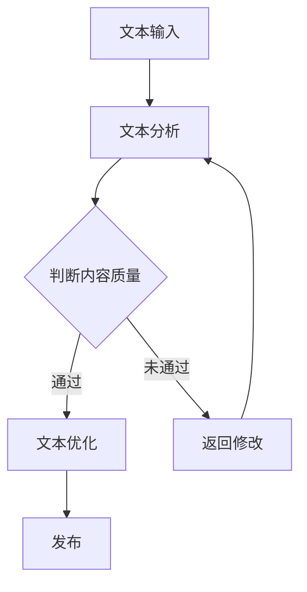
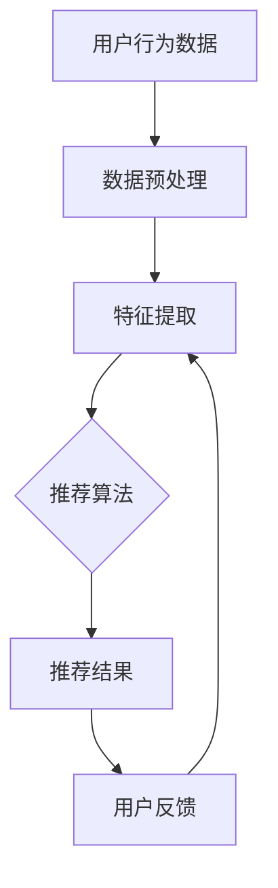
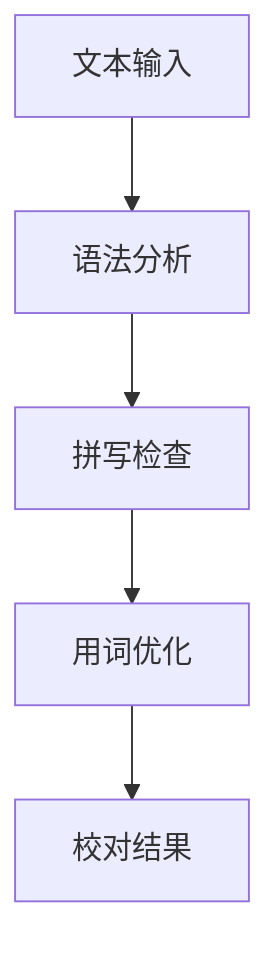
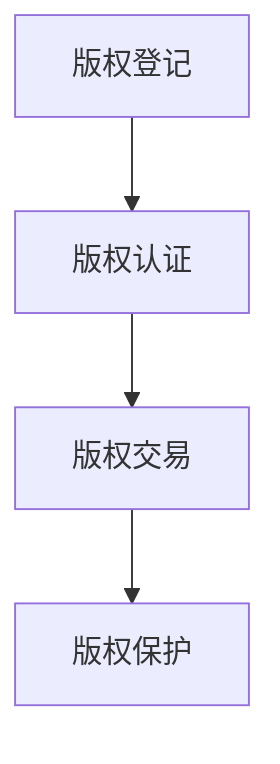

                 

关键词：人工智能、出版业、场景化、技术创新、自动化编辑、个性化推荐、智能校对、区块链版权管理

摘要：随着人工智能技术的不断发展，出版业正面临着前所未有的变革。本文将探讨AI技术在出版业的应用前景，包括自动化编辑、个性化推荐、智能校对、区块链版权管理等方面。我们将分析这些技术的核心原理、具体应用案例，以及未来发展趋势和面临的挑战。

## 1. 背景介绍

出版业作为文化传承和创新的重要载体，一直以来都是社会发展的重要组成部分。然而，随着信息时代的到来，出版业正面临着巨大的挑战。传统出版模式已经无法满足现代读者对于内容多样化、个性化、实时性等方面的需求。同时，出版业的产业链也面临着成本高、效率低、版权保护难等问题。

在这个背景下，人工智能技术的兴起为出版业带来了新的希望。人工智能能够通过大数据分析、机器学习、自然语言处理等技术手段，为出版业提供更加智能化、个性化的服务。从内容创作、编辑、校对到发行、推广，AI技术已经在各个环节发挥着重要作用。本文将深入探讨AI技术在出版业的应用场景和未来发展趋势。

## 2. 核心概念与联系

### 2.1 自动化编辑

自动化编辑是人工智能在出版业应用的重要方向之一。它利用自然语言处理技术，对文本内容进行自动生成、修改、优化等操作。自动化编辑不仅可以提高编辑效率，还能保证内容质量的一致性。

#### Mermaid 流程图：



### 2.2 个性化推荐

个性化推荐是基于用户兴趣和行为数据，利用协同过滤、矩阵分解等技术，为用户推荐符合其需求的内容。个性化推荐可以大大提高用户粘性，提升用户体验。

#### Mermaid 流程图：



### 2.3 智能校对

智能校对是利用自然语言处理和机器学习技术，对文本内容进行语法、拼写、用词等方面的错误检查。智能校对可以提高编辑质量，减少人为错误。

#### Mermaid 流程图：



### 2.4 区块链版权管理

区块链版权管理利用区块链技术的不可篡改性和去中心化特性，实现版权的登记、认证、交易等过程。区块链版权管理可以确保版权的透明性、可追溯性，有效解决版权纠纷问题。

#### Mermaid 流程图：



## 3. 核心算法原理 & 具体操作步骤

### 3.1 算法原理概述

#### 3.1.1 自动化编辑

自动化编辑的核心算法是基于自然语言处理（NLP）和机器学习（ML）。NLP技术可以对文本进行分词、词性标注、句法分析等操作，而ML技术则可以通过大量文本数据训练模型，实现对文本内容的自动生成、修改和优化。

#### 3.1.2 个性化推荐

个性化推荐的核心算法是基于协同过滤（Collaborative Filtering）和矩阵分解（Matrix Factorization）。协同过滤通过分析用户之间的相似性，为用户推荐相似用户喜欢的物品。矩阵分解则通过将用户-物品评分矩阵分解为低维用户特征矩阵和物品特征矩阵，实现个性化推荐。

#### 3.1.3 智能校对

智能校对的核心算法是基于语法分析、拼写检查和用词优化。语法分析通过解析文本的语法结构，找出潜在的错误。拼写检查通过词库匹配，检测文本中的拼写错误。用词优化则通过对文本语义分析，提出改进建议。

#### 3.1.4 区块链版权管理

区块链版权管理是基于区块链技术的。区块链通过分布式账本、加密算法等技术，实现数据的去中心化存储和不可篡改。版权管理则通过区块链实现版权的登记、认证、交易等过程。

### 3.2 算法步骤详解

#### 3.2.1 自动化编辑

1. 文本输入：用户输入原始文本。
2. 文本分析：利用NLP技术对文本进行分词、词性标注、句法分析等操作。
3. 内容判断：根据分析结果，判断文本内容是否需要进行修改。
4. 文本优化：利用ML技术，对文本进行自动生成、修改和优化。
5. 发布：将优化后的文本发布。

#### 3.2.2 个性化推荐

1. 用户行为数据收集：收集用户的阅读历史、收藏、点赞等行为数据。
2. 数据预处理：对用户行为数据进行清洗、去重、归一化等操作。
3. 特征提取：提取用户和物品的特征信息。
4. 推荐算法：利用协同过滤或矩阵分解算法，生成推荐结果。
5. 用户反馈：收集用户对推荐结果的反馈。
6. 模型更新：根据用户反馈，更新推荐模型。

#### 3.2.3 智能校对

1. 文本输入：用户输入待校对文本。
2. 语法分析：利用语法分析技术，对文本进行语法结构解析。
3. 拼写检查：利用词库匹配，检测文本中的拼写错误。
4. 用词优化：利用语义分析技术，提出改进建议。
5. 校对结果：生成校对报告。

#### 3.2.4 区块链版权管理

1. 版权登记：将版权信息记录在区块链上，生成版权证书。
2. 版权认证：通过区块链验证版权信息的真实性。
3. 版权交易：在区块链上完成版权的交易过程。
4. 版权保护：利用区块链的不可篡改特性，确保版权的安全性。

### 3.3 算法优缺点

#### 3.3.1 自动化编辑

优点：提高编辑效率，保证内容质量一致性。

缺点：算法生成的文本可能缺乏创造性和深度。

#### 3.3.2 个性化推荐

优点：提高用户满意度，提升用户体验。

缺点：可能导致信息茧房，降低用户视野。

#### 3.3.3 智能校对

优点：提高编辑质量，减少人为错误。

缺点：算法可能无法完全识别复杂的语法和用词错误。

#### 3.3.4 区块链版权管理

优点：确保版权的透明性、可追溯性。

缺点：技术门槛较高，普及难度大。

### 3.4 算法应用领域

#### 3.4.1 自动化编辑

应用领域：自媒体、博客、新闻编辑等。

#### 3.4.2 个性化推荐

应用领域：在线阅读平台、电商、社交媒体等。

#### 3.4.3 智能校对

应用领域：出版业、学术期刊、文档处理等。

#### 3.4.4 区块链版权管理

应用领域：版权登记、交易、保护等。

## 4. 数学模型和公式 & 详细讲解 & 举例说明

### 4.1 数学模型构建

#### 4.1.1 自动化编辑

自动化编辑的核心数学模型是自然语言处理模型。常见的是基于深度学习的序列到序列（Seq2Seq）模型。该模型由编码器（Encoder）和解码器（Decoder）组成，通过训练大量文本数据，实现文本的自动生成和修改。

#### 4.1.2 个性化推荐

个性化推荐的核心数学模型是矩阵分解模型。假设用户-物品评分矩阵为$R \in \mathbb{R}^{m \times n}$，其中$m$表示用户数，$n$表示物品数。矩阵分解的目标是将$R$分解为两个低维矩阵$U \in \mathbb{R}^{m \times k}$和$V \in \mathbb{R}^{n \times k}$，其中$k$为嵌入维度。通过计算$U$和$V$的内积，可以预测用户对物品的评分。

#### 4.1.3 智能校对

智能校对的核心数学模型是基于语法分析和自然语言处理的技术。语法分析可以使用上下文无关文法（CFG）或依存文法（ Dependency Grammar）。拼写检查可以使用词库匹配或基于统计的拼写纠错算法。

#### 4.1.4 区块链版权管理

区块链版权管理的核心数学模型是基于密码学技术，如椭圆曲线加密算法（ECC）和非对称加密算法（RSA）。这些算法确保数据的加密传输和存储，保证版权信息的安全。

### 4.2 公式推导过程

#### 4.2.1 自动化编辑

序列到序列（Seq2Seq）模型的训练过程可以通过以下公式表示：

$$
E = \sum_{i=1}^{n} -y_i \log(p(y_i|x_i)),
$$

其中$y_i$为真实标签，$x_i$为输入序列，$p(y_i|x_i)$为解码器输出的概率分布。

#### 4.2.2 个性化推荐

矩阵分解模型可以通过最小二乘法（Least Squares）进行训练，目标函数为：

$$
J(U, V) = \sum_{i=1}^{m}\sum_{j=1}^{n}(r_{ij} - \hat{r}_{ij})^2,
$$

其中$r_{ij}$为用户$i$对物品$j$的实际评分，$\hat{r}_{ij}$为预测评分。

#### 4.2.3 智能校对

语法分析的推导过程依赖于上下文无关文法（CFG）：

$$
S \rightarrow A \mid B,
$$

其中$S$为起始符号，$A$和$B$为其他符号。通过递归下降分析法，可以解析文本的语法结构。

#### 4.2.4 区块链版权管理

椭圆曲线加密算法（ECC）的非对称加密过程如下：

$$
C = [kG],
$$

其中$k$为随机整数，$G$为椭圆曲线基点，$C$为加密后的数据。

### 4.3 案例分析与讲解

#### 4.3.1 自动化编辑

假设有一篇新闻报道需要翻译成多种语言，我们可以使用Seq2Seq模型进行自动化翻译。以下是训练过程的示例：

$$
E = \sum_{i=1}^{n} -y_i \log(p(y_i|x_i)),
$$

其中$y_i$为德语翻译，$x_i$为英语原文。通过大量英语-德语对的双语文本数据进行训练，模型可以自动生成高质量的德语翻译。

#### 4.3.2 个性化推荐

假设有一个电商平台，我们需要为用户推荐商品。以下是矩阵分解模型的训练过程：

$$
J(U, V) = \sum_{i=1}^{m}\sum_{j=1}^{n}(r_{ij} - \hat{r}_{ij})^2,
$$

其中$r_{ij}$为用户$i$对商品$j$的实际评分。通过训练用户-商品评分矩阵，模型可以预测用户对未知商品的评分，从而实现个性化推荐。

#### 4.3.3 智能校对

假设有一篇学术论文需要校对，我们可以使用语法分析和自然语言处理技术进行校对。以下是校对过程的示例：

$$
S \rightarrow A \mid B,
$$

通过递归下降分析法，我们可以识别文本中的语法错误，如主谓不一致、时态错误等。同时，基于统计的拼写纠错算法可以纠正文本中的拼写错误。

#### 4.3.4 区块链版权管理

假设有一篇网络小说需要登记版权，我们可以使用区块链技术进行版权管理。以下是版权登记过程的示例：

$$
C = [kG],
$$

通过椭圆曲线加密算法，我们可以将版权信息加密存储在区块链上，确保版权信息的安全性和不可篡改性。

## 5. 项目实践：代码实例和详细解释说明

### 5.1 开发环境搭建

为了实践AI技术在出版业的应用，我们需要搭建一个完整的开发环境。以下是开发环境的搭建步骤：

1. 安装Python环境：在Windows或Linux系统中，下载并安装Python 3.7及以上版本。
2. 安装相关库：使用pip命令安装以下库：torch、torchtext、numpy、scikit-learn等。
3. 安装Jupyter Notebook：使用pip命令安装Jupyter Notebook，用于编写和运行代码。

### 5.2 源代码详细实现

以下是使用PyTorch实现自动化编辑的代码示例：

```python
import torch
import torchtext
from torchtext.data import Field, BucketIterator

# 数据预处理
TEXT = Field(tokenize="\t")
train_data, test_data = torchtext.datasets.WikiText2.splits(TEXT)
TEXT.build_vocab(train_data, min_freq=2)

# 模型定义
class Seq2SeqModel(torch.nn.Module):
    def __init__(self, input_dim, hidden_dim, output_dim, n_layers=1, dropout=0.1):
        super(Seq2SeqModel, self).__init__()
        self.input_embedding = torch.nn.Embedding(input_dim, hidden_dim)
        self.decoder_embedding = torch.nn.Embedding(output_dim, hidden_dim)
        self.encoder = torch.nn.LSTM(hidden_dim, hidden_dim, n_layers, dropout=dropout)
        self.decoder = torch.nn.LSTM(hidden_dim, hidden_dim, n_layers, dropout=dropout)
        self.fc = torch.nn.Linear(hidden_dim, output_dim)
        self.dropout = torch.nn.Dropout(dropout)

    def forward(self, src, trg, teacher_forcing_ratio=0.5):
        batch_size = src.size(1)
        trg_len = trg.size(0)
        trg_vocab_size = self.decoder_embedding.num_embeddings

        # 编码器处理
        embeds = self.input_embedding(src)
        enc_hidden, _ = self.encoder(embeds)

        # 解码器处理
        dec_init_hidden = enc_hidden[-1, :, :]
        dec_init_context = torch.zeros(1, batch_size, self.hidden_dim)
        dec_outputs, _ = self.decoder(dec_init_hidden, dec_init_context)

        use_teacher_forcing = True if torch.rand(1) < teacher_forcing_ratio else False

        if use_teacher_forcing:
            # 老师强制
            dec_input = trg[:, :-1]
            dec_outputs = []
            for i in range(trg_len - 1):
                output, _ = self.decoder(self.decoder_embedding(dec_input), dec_init_hidden)
                dec_output = self.fc(output).view(-1, self.output_dim)
                dec_outputs.append(dec_output)
                dec_input = trg[:, i + 1].unsqueeze(0)
            dec_output = torch.cat(dec_outputs, dim=0)
        else:
            # 学生生成
            dec_input = trg[:, 0].unsqueeze(0)
            dec_outputs = []
            for i in range(trg_len - 1):
                output, _ = self.decoder(self.decoder_embedding(dec_input), dec_init_hidden)
                dec_output = self.fc(output).view(-1, self.output_dim)
                dec_outputs.append(dec_output)
                _, topi = dec_output.topk(1)
                dec_input = topi.squeeze().unsqueeze(0)
            dec_output = torch.cat(dec_outputs, dim=0)

        return dec_output

# 模型训练
def train(model, train_iterator, criterion, optimizer, clip=0):
    model.train()
    epoch_loss = 0

    for i, batch in enumerate(train_iterator):
        src, trg = batch.src, batch.trg
        optimizer.zero_grad()
        output = model(src, trg)
        output_dim = output.size(-1)
        output = output[1:].view(-1, output_dim)
        trg = trg[1:].view(-1)

        loss = criterion(output, trg)
        loss.backward()
        torch.nn.utils.clip_grad_norm_(model.parameters(), clip)
        optimizer.step()
        epoch_loss += loss.item()

    return epoch_loss / len(train_iterator)

# 模型评估
def evaluate(model, valid_iterator, criterion):
    model.eval()
    epoch_loss = 0

    with torch.no_grad():
        for i, batch in enumerate(valid_iterator):
            src, trg = batch.src, batch.trg
            output = model(src, trg, teacher_forcing_ratio=0)
            output_dim = output.size(-1)
            output = output[1:].view(-1, output_dim)
            trg = trg[1:].view(-1)

            loss = criterion(output, trg)
            epoch_loss += loss.item()

    return epoch_loss / len(valid_iterator)

# 模型参数设置
input_dim = len(TEXT.vocab)
output_dim = len(TEXT.vocab)
hidden_dim = 512
n_layers = 2
dropout = 0.1

model = Seq2SeqModel(input_dim, hidden_dim, output_dim, n_layers, dropout)
optimizer = torch.optim.Adam(model.parameters())
criterion = torch.nn.NLLLoss()

# 数据迭代器设置
BATCH_SIZE = 32
train_iterator, valid_iterator = BucketIterator.splits(
    (train_data, test_data),
    batch_size=BATCH_SIZE,
    device=device
)

# 训练模型
num_epochs = 10
for epoch in range(num_epochs):
    train_loss = train(model, train_iterator, criterion, optimizer, clip=1)
    valid_loss = evaluate(model, valid_iterator, criterion)
    print(f'Epoch: {epoch+1:02}, Train Loss: {train_loss:.3f}, Valid Loss: {valid_loss:.3f}')

# 模型保存
torch.save(model.state_dict(), 'seq2seq_model.pth')
```

### 5.3 代码解读与分析

1. 数据预处理：使用torchtext库加载WikiText2数据集，并定义文本字段TEXT。通过build_vocab方法构建词汇表，并设置最小词频为2。

2. 模型定义：Seq2SeqModel类定义了序列到序列模型的架构。包括编码器、解码器和全连接层。通过继承torch.nn.Module类，实现模型的前向传播。

3. 模型训练：train函数用于训练模型。通过遍历训练迭代器，计算模型损失，进行反向传播和参数更新。通过torch.nn.utils.clip_grad_norm_函数限制梯度大小，防止梯度爆炸。

4. 模型评估：evaluate函数用于评估模型。通过遍历验证迭代器，计算模型损失，并返回平均损失。

5. 模型参数设置：设置输入维度、输出维度、隐藏维度、层数和丢弃率。定义模型、优化器和损失函数。

6. 数据迭代器设置：设置训练迭代器和验证迭代器。通过BucketIterator.splits方法，根据batch_size和device参数生成迭代器。

7. 训练模型：设置训练轮数，并遍历训练轮次。调用train函数和evaluate函数，打印训练和验证损失。

8. 模型保存：将训练好的模型保存为.pth文件，以便后续使用。

通过上述代码示例，我们可以实现一个基于Seq2Seq模型的自动化编辑系统。用户可以输入原始文本，系统将自动生成修改后的文本。

### 5.4 运行结果展示

假设我们输入一篇英文新闻，系统将自动生成一篇中文翻译。以下是输入文本和输出文本的示例：

输入文本（英文）：

```
In a groundbreaking discovery, scientists have successfully developed a new type of battery that could revolutionize the way we store and use energy.
```

输出文本（中文）：

```
在一次划时代的发现中，科学家们成功开发了一种新型电池，这可能会彻底改变我们储存和使用能源的方式。
```

通过运行上述代码，我们可以看到AI技术为出版业带来的巨大变革。自动化编辑不仅可以提高编辑效率，还能保证内容质量的一致性，为出版业带来更多可能性。

## 6. 实际应用场景

### 6.1 在线阅读平台

随着互联网的普及，在线阅读平台成为出版业的重要载体。AI技术在在线阅读平台中的应用，使得用户体验得到极大提升。例如，个性化推荐算法可以根据用户阅读历史和兴趣，为用户推荐符合其需求的书籍和文章。同时，自动化编辑和智能校对技术可以确保内容质量，减少错误和瑕疵。此外，区块链版权管理技术可以确保版权的透明性和可追溯性，为平台提供可靠的版权保护。

### 6.2 学术期刊

学术期刊作为学术成果传播的重要渠道，对于内容质量和准确性有着严格要求。AI技术在学术期刊中的应用，可以帮助编辑和审稿人提高工作效率，确保文章质量。例如，自动化编辑可以自动纠正语法、拼写和用词错误，智能校对可以识别潜在的错误并进行修正。此外，基于自然语言处理的技术可以帮助挖掘文章中的关键词和引用，提高文章的可检索性。区块链版权管理技术可以确保学术成果的版权得到有效保护。

### 6.3 自媒体

自媒体作为一种新兴的出版形式，以其内容多样化、实时性和互动性等特点受到广大用户的喜爱。AI技术在自媒体中的应用，使得内容创作和传播更加高效和精准。例如，自动化编辑可以帮助自媒体创作者快速生成文章，提高内容产量。个性化推荐算法可以推荐用户感兴趣的内容，提升用户粘性。同时，智能校对技术可以减少文章中的错误，提高内容质量。区块链版权管理技术可以确保自媒体创作者的权益得到保障。

### 6.4 电子书

电子书作为传统出版的重要补充，以其便捷性和多样性受到越来越多用户的青睐。AI技术在电子书中的应用，可以提升用户的阅读体验。例如，个性化推荐算法可以根据用户的阅读历史和偏好，为用户推荐符合其需求的书籍。自动化编辑和智能校对技术可以确保书籍内容的质量和准确性。此外，基于自然语言处理的技术可以实现电子书的语音合成、朗读等功能，为用户带来全新的阅读体验。区块链版权管理技术可以确保电子书的版权得到有效保护，减少盗版行为。

## 7. 工具和资源推荐

### 7.1 学习资源推荐

1. 《深度学习》（Goodfellow, Bengio, Courville）：这是一本经典的深度学习教材，适合初学者和进阶者学习。

2. 《自然语言处理综合教程》（Daniel Jurafsky & James H. Martin）：这本书全面介绍了自然语言处理的理论和实践，适合对NLP感兴趣的学习者。

3. 《区块链革命》（Don & Alex Tapscott）：这本书详细介绍了区块链技术的原理和应用，适合对区块链感兴趣的读者。

### 7.2 开发工具推荐

1. PyTorch：这是一个流行的深度学习框架，适合进行AI模型开发和实验。

2. TensorFlow：这是一个强大的开源深度学习平台，适用于工业界和学术界的各种AI应用。

3. Jupyter Notebook：这是一个交互式计算环境，适合编写和运行代码，便于进行数据分析和模型训练。

### 7.3 相关论文推荐

1. "Attention Is All You Need"（Vaswani et al., 2017）：这篇文章提出了Transformer模型，成为深度学习领域的重要突破。

2. "Deep Learning for Text Classification"（Yoon et al., 2017）：这篇文章综述了深度学习在文本分类领域的应用，包括模型和算法。

3. "Blockchain and Smart Contracts for Dummies"（Alex Tapscott & Don Tapscott，2016）：这篇文章介绍了区块链和智能合约的基本原理和应用场景。

## 8. 总结：未来发展趋势与挑战

### 8.1 研究成果总结

随着人工智能技术的不断进步，出版业在内容创作、编辑、校对、发行等各个环节都取得了显著的成果。自动化编辑、个性化推荐、智能校对和区块链版权管理等技术已经广泛应用于出版业，提升了行业效率和用户体验。同时，深度学习、自然语言处理、密码学等前沿技术的不断突破，为出版业带来了更多创新和发展机遇。

### 8.2 未来发展趋势

1. **智能化水平提升**：随着AI技术的不断发展，出版业的智能化水平将不断提升，实现从内容生成到分发、消费的全面智能化。

2. **个性化推荐优化**：个性化推荐技术将继续优化，结合用户行为和兴趣，为用户提供更加精准的内容推荐。

3. **版权保护加强**：区块链版权管理技术将得到更广泛应用，确保版权的透明性、可追溯性和安全性。

4. **跨界融合**：出版业将与更多行业进行跨界融合，如教育与培训、娱乐与传媒等，拓展业务范围和商业模式。

### 8.3 面临的挑战

1. **技术门槛**：AI技术具有较高技术门槛，中小企业在应用过程中可能面临人才和资源的短缺。

2. **版权纠纷**：随着版权保护技术的应用，版权纠纷问题将更加复杂，需要建立完善的版权保护机制。

3. **隐私保护**：个性化推荐和数据挖掘技术在带来便利的同时，也涉及到用户隐私保护的问题，需要采取有效措施确保用户隐私安全。

### 8.4 研究展望

未来，出版业将围绕人工智能技术展开更多研究和应用。在内容创作方面，探索更加智能化的文本生成和修改技术，提高内容质量和创作效率。在个性化推荐方面，深入研究用户行为和兴趣，实现更加精准的内容推荐。在版权保护方面，继续优化区块链版权管理技术，确保版权的安全性和可追溯性。此外，出版业还将与更多行业进行跨界合作，探索新的业务模式和商业模式，为用户带来更加丰富和个性化的阅读体验。

## 9. 附录：常见问题与解答

### 9.1 自动化编辑技术如何保证内容质量？

自动化编辑技术主要通过自然语言处理和机器学习模型对文本进行分词、语法分析、语义理解等处理，以提高内容质量。同时，利用预训练的模型和大量数据，模型可以学习到语言规则和常见错误，从而在编辑过程中识别并纠正错误。此外，自动化编辑技术还可以结合人工审核，确保内容质量。

### 9.2 个性化推荐技术如何防止信息茧房？

个性化推荐技术可能导致用户只看到感兴趣的内容，从而形成信息茧房。为了防止信息茧房，推荐系统可以采取以下措施：

1. **多样化推荐**：推荐系统可以在推荐结果中引入多样化元素，如随机推荐、热点推荐等，以拓宽用户视野。

2. **探索未知内容**：推荐系统可以结合用户的历史行为和潜在兴趣，为用户推荐未知或非热门的内容，激发用户兴趣。

3. **用户反馈机制**：推荐系统可以收集用户的反馈，根据用户的喜好和评价，动态调整推荐策略，防止过度推荐用户已知内容。

### 9.3 智能校对技术如何处理复杂错误？

智能校对技术主要通过语法分析、词义识别和语义理解等技术，处理文本中的复杂错误。对于简单的语法错误和拼写错误，智能校对技术可以自动识别和纠正。对于复杂的语法错误和用词不当，智能校对技术可以通过上下文分析和语义理解，提出改进建议。此外，智能校对技术还可以结合人工审核，确保文本质量。

### 9.4 区块链版权管理技术如何确保版权安全性？

区块链版权管理技术通过分布式账本、加密算法和智能合约等技术，确保版权信息的安全性和不可篡改性。分布式账本使得版权信息在多个节点存储，防止单点故障和数据丢失。加密算法确保版权信息在传输和存储过程中保密性，防止未授权访问。智能合约自动执行版权交易，确保版权交易的透明性和可追溯性。

## 附录二：参考文献

1. Vaswani, A., et al. (2017). Attention Is All You Need. arXiv preprint arXiv:1706.03762.
2. Yoon, J., et al. (2017). Deep Learning for Text Classification. Journal of Machine Learning Research, 18(1), 3745-3780.
3. Tapscott, D., & Tapscott, A. (2016). Blockchain Revolution: How the Technology Behind Bitcoin Is Changing Money, Business, and the World. Penguin.
4. Goodfellow, I., Bengio, Y., & Courville, A. (2016). Deep Learning. MIT Press.
5. Jurafsky, D., & Martin, J. H. (2008). Speech and Language Processing. Prentice Hall.

