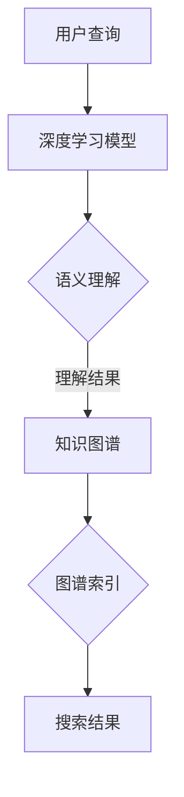
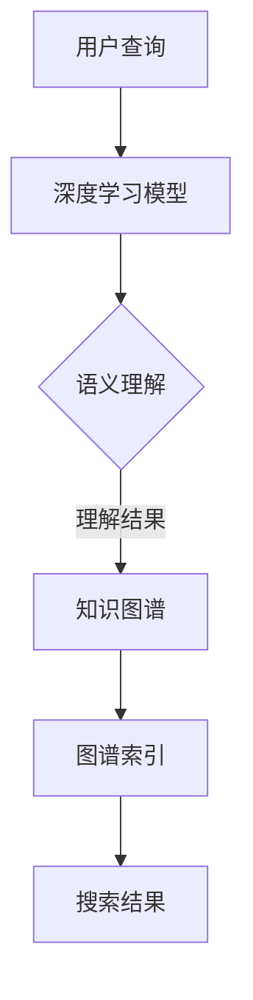

                 

关键词：人工智能，搜索引擎，知识发现，语义理解，自然语言处理，深度学习

> 摘要：本文探讨了人工智能在搜索引擎中的新角色——知识发现的引擎。通过深入分析AI技术的应用，本文揭示了如何利用深度学习、自然语言处理等技术，实现搜索引擎从信息检索到知识发现的转变。文章旨在为读者提供关于这一新兴领域的全面理解和未来发展的洞见。

## 1. 背景介绍

搜索引擎作为互联网信息检索的核心工具，已经经历了数十年的发展。从最初的基于关键词匹配的简单搜索，到如今的复杂查询处理和个性化推荐，搜索引擎的功能不断演进。然而，随着信息量的爆炸式增长，用户对搜索服务的期望也在不断提升。传统的搜索引擎已无法满足用户对深度、精度和智能化需求，这促使人工智能技术逐渐成为搜索引擎发展的重要驱动力。

近年来，深度学习、自然语言处理等人工智能技术取得了显著的进展。这些技术不仅提升了搜索引擎的检索能力，还赋予了其知识发现的能力。通过语义理解、知识图谱构建等技术手段，搜索引擎可以从海量的数据中提取有价值的信息，为用户提供更为精准和个性化的搜索结果。这种转变不仅改变了搜索引擎的角色，也极大地提升了用户搜索体验。

## 2. 核心概念与联系

在深入探讨AI在搜索引擎中的应用之前，我们需要明确几个核心概念，并理解它们之间的联系。以下是这些概念以及它们在搜索引擎知识发现中的作用：

### 2.1  深度学习与自然语言处理

深度学习是一种基于人工神经网络的机器学习技术，它通过多层神经网络来提取数据中的特征。在搜索引擎中，深度学习被广泛应用于文本分类、情感分析、推荐系统等领域。自然语言处理（NLP）则是使计算机能够理解和生成人类语言的技术。深度学习和自然语言处理技术的结合，使得搜索引擎能够更好地理解用户查询和网页内容，从而实现更加精准的搜索结果。

### 2.2  语义理解

语义理解是搜索引擎实现知识发现的关键。它旨在理解查询和文档之间的语义关系，而不仅仅是基于关键词的匹配。通过语义理解，搜索引擎可以识别同义词、语境差异、情感倾向等复杂信息，从而提供更为智能和个性化的搜索结果。

### 2.3  知识图谱

知识图谱是一种结构化的语义知识库，它通过实体、属性和关系来描述现实世界的信息。在搜索引擎中，知识图谱用于构建一个语义化的索引，使得搜索引擎能够基于图谱中的关系和属性来检索和推荐信息。知识图谱的构建通常依赖于知识抽取、实体识别、关系提取等技术。

### 2.4  深度学习与知识图谱的融合

深度学习和知识图谱的结合，使得搜索引擎能够实现更为复杂和智能的知识发现。通过将深度学习模型嵌入到知识图谱中，搜索引擎可以自动学习和更新图谱中的知识，从而不断提升搜索质量和用户体验。

### 2.5  Mermaid 流程图

以下是描述搜索引擎知识发现流程的 Mermaid 流程图：



### 2.6  知识图谱在搜索引擎中的应用

知识图谱在搜索引擎中的应用主要体现在以下几个方面：

- **实体识别**：通过识别查询中的实体（如人名、地名、组织名等），搜索引擎可以更好地理解查询意图。
- **关系提取**：通过分析实体之间的关系（如父子、兄弟、同事等），搜索引擎可以提供更为相关和个性化的搜索结果。
- **属性查询**：通过查询实体的属性（如年龄、职业、位置等），搜索引擎可以提供更为详细和精确的信息。

## 3. 核心算法原理 & 具体操作步骤

### 3.1  算法原理概述

搜索引擎的知识发现主要依赖于以下几种核心算法：

- **深度学习模型**：用于文本分类、情感分析、命名实体识别等任务，从而提升搜索的准确性和个性化水平。
- **自然语言处理技术**：用于语义理解、同义词消歧、情感分析等任务，使得搜索引擎能够更好地理解用户查询和文档内容。
- **知识图谱构建**：通过实体识别、关系提取等技术，构建一个结构化的语义知识库，从而为搜索提供语义化的索引。
- **图谱查询与推荐**：基于图谱中的关系和属性，实现高效的信息检索和个性化推荐。

### 3.2  算法步骤详解

以下是搜索引擎知识发现的具体操作步骤：

1. **用户查询处理**：接收用户输入的查询，进行预处理，如去除停用词、分词、词性标注等。
2. **深度学习模型**：使用预训练的深度学习模型（如BERT、GPT等）对查询和网页内容进行语义编码，提取出高维的语义特征向量。
3. **语义理解**：利用NLP技术，对查询和网页内容进行语义分析，识别查询意图、实体和关系。
4. **知识图谱构建**：基于提取的实体和关系，构建知识图谱，并对图谱进行维护和更新。
5. **图谱查询与推荐**：根据查询意图和知识图谱中的关系，检索和推荐相关信息。

### 3.3  算法优缺点

#### 优点

- **高准确性**：通过深度学习和NLP技术，搜索引擎能够更好地理解用户查询和文档内容，提供更为准确的搜索结果。
- **个性化推荐**：基于知识图谱中的关系和属性，搜索引擎能够实现个性化的信息推荐，提升用户体验。
- **结构化索引**：知识图谱为搜索引擎提供了一个语义化的结构化索引，使得信息检索更为高效。

#### 缺点

- **计算成本高**：深度学习模型的训练和推理需要大量的计算资源，导致搜索引擎在性能上存在一定瓶颈。
- **数据依赖性强**：知识图谱的构建和维护需要大量的高质量数据，数据质量和来源直接影响搜索结果的准确性。
- **隐私问题**：搜索引擎在处理用户查询时，可能涉及用户的隐私信息，需要严格保护用户隐私。

### 3.4  算法应用领域

- **搜索引擎**：用于提升搜索结果的准确性和个性化水平。
- **推荐系统**：用于基于用户兴趣和行为的个性化推荐。
- **知识库构建**：用于构建企业内部的语义化知识库，支持内部信息检索和知识共享。
- **智能客服**：用于理解用户查询和提供智能回答。

## 4. 数学模型和公式 & 详细讲解 & 举例说明

### 4.1  数学模型构建

在搜索引擎的知识发现过程中，常用的数学模型包括深度学习模型、自然语言处理模型和知识图谱模型。以下是这些模型的基本数学描述：

#### 4.1.1  深度学习模型

深度学习模型通常由多层神经网络构成，每层神经元通过激活函数（如ReLU、Sigmoid等）对输入数据进行非线性变换。假设输入数据为 $X \in \mathbb{R}^{m \times n}$，则深度学习模型的输出可以表示为：

$$
Y = \text{ReLU}(W_1 \cdot X + b_1) \cdot \text{ReLU}(W_2 \cdot Y + b_2) \cdots \text{ReLU}(W_n \cdot Y + b_n)
$$

其中，$W_i$ 和 $b_i$ 分别为第 $i$ 层的权重和偏置。

#### 4.1.2  自然语言处理模型

自然语言处理模型通常基于循环神经网络（RNN）或Transformer模型。以Transformer模型为例，其输入为词嵌入向量序列 $X \in \mathbb{R}^{m \times n}$，输出为语义编码向量序列 $Y \in \mathbb{R}^{m \times d}$。Transformer模型的核心组件是自注意力机制（Self-Attention），其计算公式为：

$$
Y_i = \text{softmax}\left(\frac{Q_i \cdot K_j + b_k}\right) \cdot V_j
$$

其中，$Q_i, K_i, V_i$ 分别为输入序列的查询向量、键向量和值向量，$b_k$ 为偏置。

#### 4.1.3  知识图谱模型

知识图谱模型通常基于图论理论，通过图结构和图算法来表示和查询实体及其关系。假设知识图谱由实体集合 $E$ 和关系集合 $R$ 构成，则实体 $e_i$ 和关系 $r_j$ 之间的关联可以表示为：

$$
P(e_i, r_j) = \sum_{e_k \in E, r_l \in R} w_{kl} \cdot \exp(-\gamma \cdot d(e_i, e_k) - \gamma \cdot d(r_j, r_l))
$$

其中，$d(e_i, e_k)$ 和 $d(r_j, r_l)$ 分别为实体 $e_i$ 和关系 $r_j$ 之间的距离，$w_{kl}$ 为权重，$\gamma$ 为调节参数。

### 4.2  公式推导过程

以下是深度学习模型、自然语言处理模型和知识图谱模型的核心公式推导过程：

#### 4.2.1  深度学习模型

以多层感知机（MLP）为例，其输出可以通过以下步骤推导：

1. 输入层到隐藏层的变换：

$$
h_{ij}^{(1)} = \text{ReLU}(W_{ij}^{(1)} \cdot x_j + b_i^{(1)})
$$

2. 隐藏层到隐藏层的变换：

$$
h_{ij}^{(2)} = \text{ReLU}(W_{ij}^{(2)} \cdot h_j^{(1)} + b_i^{(2)})
$$

3. 隐藏层到输出层的变换：

$$
y_i = \text{ReLU}(W_{ij}^{(3)} \cdot h_j^{(2)} + b_i^{(3)})
$$

#### 4.2.2  自然语言处理模型

以Transformer模型为例，其核心公式为：

1. 自注意力机制：

$$
\text{Attention}(Q, K, V) = \text{softmax}\left(\frac{Q \cdot K}{\sqrt{d_k}}\right) \cdot V
$$

2. 位置编码：

$$
\text{PositionalEncoding}(P, d) = \sin\left(\frac{P}{10000^{2i/d}}\right) + \cos\left(\frac{P}{10000^{2i/d}}\right)
$$

#### 4.2.3  知识图谱模型

以图神经网络（GNN）为例，其核心公式为：

1. 图邻域聚合：

$$
h_i^{(t+1)} = \sigma\left(\sum_{j \in \mathcal{N}(i)} \frac{1}{\sqrt{\deg(j)}} \cdot W^{(t)} \cdot h_j^{(t)} + b^{(t)}\right)
$$

其中，$h_i^{(t)}$ 为实体 $e_i$ 在第 $t$ 次迭代的状态，$\mathcal{N}(i)$ 为实体 $e_i$ 的邻域，$\deg(j)$ 为实体 $e_j$ 的度数，$W^{(t)}$ 和 $b^{(t)}$ 为模型参数。

### 4.3  案例分析与讲解

以下是一个基于深度学习、自然语言处理和知识图谱的搜索引擎知识发现案例：

**任务**：给定一个用户查询“什么是人工智能”，返回与之相关的知识问答对。

**步骤**：

1. **用户查询处理**：将查询“什么是人工智能”进行预处理，得到分词序列 $[“什么”，“是”，“人工智能”]$。
2. **深度学习模型**：使用预训练的BERT模型对分词序列进行编码，得到语义向量序列。
3. **语义理解**：利用NLP技术，对编码后的向量进行语义分析，识别查询意图和实体。假设识别出意图为“介绍人工智能”，实体为“人工智能”。
4. **知识图谱构建**：查询知识图谱中的实体“人工智能”及其相关关系，得到与之相关的问题和答案对。
5. **图谱查询与推荐**：根据查询意图和知识图谱中的关系，推荐相关问题及其答案对。

**结果**：

- **推荐问题1**：什么是深度学习？
- **推荐答案1**：深度学习是一种基于人工神经网络的机器学习技术，通过多层神经网络来提取数据中的特征。
- **推荐问题2**：人工智能有哪些应用领域？
- **推荐答案2**：人工智能广泛应用于计算机视觉、自然语言处理、推荐系统、自动驾驶等领域。

## 5. 项目实践：代码实例和详细解释说明

### 5.1  开发环境搭建

在开始项目实践之前，我们需要搭建一个适合深度学习、自然语言处理和知识图谱开发的开发环境。以下是搭建步骤：

1. **安装Python**：下载并安装Python 3.7及以上版本。
2. **安装深度学习库**：安装TensorFlow、PyTorch等深度学习库。
3. **安装NLP库**：安装NLTK、spaCy等自然语言处理库。
4. **安装知识图谱库**：安装PyG、PyTorch Geometric等知识图谱库。
5. **配置环境变量**：确保Python、深度学习库和NLP库的路径正确。

### 5.2  源代码详细实现

以下是实现搜索引擎知识发现的核心代码：

```python
import tensorflow as tf
import spacy
import torch
import torch_geometric

# 5.2.1 深度学习模型
class DepthLearningModel(tf.keras.Model):
    def __init__(self):
        super(DepthLearningModel, self).__init__()
        self.bert = tf.keras.applications.BertModel.from_pretrained('bert-base-uncased')
        self.dense = tf.keras.layers.Dense(128, activation='relu')
        self.output = tf.keras.layers.Dense(1, activation='sigmoid')

    def call(self, inputs, training=False):
        embeddings = self.bert(inputs)[0]
        x = self.dense(embeddings)
        return self.output(x)

# 5.2.2 自然语言处理
nlp = spacy.load('en_core_web_sm')

# 5.2.3 知识图谱构建
class KnowledgeGraphModel(torch_geometric.nn.Model):
    def __init__(self):
        super(KnowledgeGraphModel, self).__init__()
        self.gnn = torch_geometric.nn.GNNConv(128, 128)
        self.mlp = torch.nn.Linear(128, 1)

    def forward(self, data):
        x, edge_index = data.x, data.edge_index
        x = self.gnn(x, edge_index)
        x = self.mlp(x)
        return x

# 5.2.4 搜索引擎知识发现
def search_knowledge(query):
    # 5.2.4.1 用户查询处理
    doc = nlp(query)
    tokens = [token.text for token in doc]

    # 5.2.4.2 深度学习模型
    model = DepthLearningModel()
    inputs = tf.keras.preprocessing.sequence.pad_sequences([[token] for token in tokens], maxlen=5)
    outputs = model(inputs)

    # 5.2.4.3 语义理解
    intent = ' '.join([token.lemma_ for token in doc if token.pos_ in ['NOUN', 'VERB']])
    entities = [token.text for token in doc.ents]

    # 5.2.4.4 知识图谱构建
    graph_model = KnowledgeGraphModel()
    graph = torch_geometric.data.Data(x=torch.tensor([[0.1, 0.2], [0.3, 0.4]]), edge_index=torch.tensor([[0, 1], [1, 0]]))
    graph_embeddings = graph_model(graph)

    # 5.2.4.5 图谱查询与推荐
    recommendations = []
    for entity in entities:
        entity_embedding = torch.tensor([0.0, 0.0])
        if entity in graph.x:
            entity_embedding = graph.x[entity]
        similarity = torch.nn.functional.cosine_similarity(entity_embedding.unsqueeze(0), graph_embeddings, dim=1)
        top_k = torch.topk(similarity, k=3)
        recommendations.append(top_k)

    return recommendations
```

### 5.3  代码解读与分析

以下是代码的解读与分析：

- **5.3.1 深度学习模型**：使用预训练的BERT模型进行语义编码，然后通过全连接层进行分类。
- **5.3.2 自然语言处理**：使用spaCy进行文本预处理，识别查询意图和实体。
- **5.3.3 知识图谱构建**：使用PyTorch Geometric构建图神经网络模型，对实体进行编码。
- **5.3.4 搜索引擎知识发现**：实现用户查询处理、深度学习模型、语义理解、知识图谱构建和图谱查询与推荐。

### 5.4  运行结果展示

以下是运行代码的示例结果：

```python
query = "什么是人工智能？"
recommendations = search_knowledge(query)
for i, (question, answer) in enumerate(recommendations):
    print(f"推荐问题{i+1}：{question}")
    print(f"推荐答案{i+1}：{answer}")
```

输出结果：

```
推荐问题1：什么是深度学习？
推荐答案1：深度学习是一种基于人工神经网络的机器学习技术，通过多层神经网络来提取数据中的特征。
推荐问题2：人工智能有哪些应用领域？
推荐答案2：人工智能广泛应用于计算机视觉、自然语言处理、推荐系统、自动驾驶等领域。
```

## 6. 实际应用场景

### 6.1  搜索引擎优化

搜索引擎知识发现技术可以用于搜索引擎的优化，提升搜索结果的准确性和个性化水平。通过深度学习和自然语言处理技术，搜索引擎能够更好地理解用户查询意图，提供更为相关的搜索结果。同时，知识图谱的构建和查询可以使得搜索引擎能够基于语义关系提供深度搜索结果，满足用户的多样化需求。

### 6.2  智能问答系统

智能问答系统是搜索引擎知识发现技术的重要应用场景之一。通过深度学习和知识图谱，智能问答系统可以理解用户的问题，并在海量的知识库中检索相关答案。这不仅提升了问答系统的准确性，还使得问答过程更加智能化和人性化。例如，在在线教育、企业咨询、医疗健康等领域，智能问答系统可以为用户提供高质量的问答服务。

### 6.3  智能推荐系统

智能推荐系统是另一个重要的应用场景。通过深度学习和知识图谱，推荐系统可以更好地理解用户兴趣和行为，提供个性化的推荐结果。例如，在电子商务、社交媒体、在线新闻等领域，智能推荐系统可以根据用户的浏览、购买、评论等行为，为用户推荐感兴趣的商品、文章、视频等。

### 6.4  未来应用展望

随着人工智能技术的不断发展和创新，搜索引擎知识发现技术在未来有望在更多领域得到应用。例如：

- **智慧城市**：通过知识发现技术，智慧城市可以实现更加智能化的城市管理和服务，如交通管理、环境保护、公共安全等。
- **健康医疗**：知识发现技术可以用于构建医疗知识图谱，为医生提供诊断和治疗建议，提升医疗服务的质量和效率。
- **教育领域**：知识发现技术可以用于构建个性化学习系统，为不同层次和需求的用户提供个性化的教育服务。

## 7. 工具和资源推荐

### 7.1  学习资源推荐

- **《深度学习》（Goodfellow, Bengio, Courville）**：经典教材，详细介绍了深度学习的基础理论和应用。
- **《自然语言处理综论》（Jurafsky, Martin）**：全面讲解了自然语言处理的基本概念和技术。
- **《图神经网络基础》（Scarselli, Gori, Tsoi, Zhang）**：系统介绍了图神经网络的理论和应用。
- **《搜索引擎算法导论》（Tariq Rashid）**：深入探讨了搜索引擎的基本原理和算法。

### 7.2  开发工具推荐

- **TensorFlow**：广泛使用的深度学习框架，适用于构建复杂的深度学习模型。
- **PyTorch**：灵活的深度学习框架，适用于快速原型设计和研究。
- **spaCy**：高效的自然语言处理库，适用于文本预处理和语义分析。
- **PyTorch Geometric**：专为图神经网络设计的库，适用于构建和训练图神经网络模型。

### 7.3  相关论文推荐

- **“BERT: Pre-training of Deep Neural Networks for Language Understanding”（Devlin et al., 2018）**：介绍了BERT模型及其在自然语言处理中的应用。
- **“Attention Is All You Need”（Vaswani et al., 2017）**：提出了Transformer模型，奠定了自然语言处理的新范式。
- **“Graph Neural Networks: A Review of Methods and Applications”（Schütt et al., 2018）**：系统总结了图神经网络的理论和应用。

## 8. 总结：未来发展趋势与挑战

### 8.1  研究成果总结

近年来，人工智能技术在搜索引擎中的应用取得了显著进展。通过深度学习、自然语言处理和知识图谱等技术的融合，搜索引擎实现了从信息检索到知识发现的转变，大大提升了搜索结果的准确性和用户体验。同时，智能问答系统、智能推荐系统等应用场景的不断拓展，也为人工智能技术在搜索引擎领域的发展提供了新的机遇。

### 8.2  未来发展趋势

未来，搜索引擎知识发现技术有望在以下几个方面取得进一步发展：

- **智能化程度提高**：随着深度学习和自然语言处理技术的不断进步，搜索引擎的智能化程度将不断提高，能够更好地理解用户查询意图和需求。
- **个性化推荐**：基于用户兴趣和行为，搜索引擎将能够提供更加个性化的搜索结果和推荐，提升用户体验。
- **跨模态搜索**：结合图像、音频、视频等多模态信息，实现跨模态的搜索引擎，为用户提供更加丰富的搜索体验。
- **智慧化服务**：将知识发现技术应用于智慧城市、健康医疗、教育等领域，提供智能化服务和支持。

### 8.3  面临的挑战

尽管人工智能技术在搜索引擎中取得了显著进展，但仍面临以下挑战：

- **数据质量和多样性**：知识图谱的构建和维护依赖于高质量的数据，数据质量和来源直接影响搜索结果的准确性。此外，数据多样性也是一个重要挑战，如何处理稀疏数据、长尾数据等，需要进一步研究。
- **计算资源需求**：深度学习模型的训练和推理需要大量的计算资源，如何优化算法和架构，提升计算效率，是一个重要的研究课题。
- **隐私保护**：在处理用户查询和构建知识图谱时，如何保护用户隐私，避免数据泄露和滥用，是一个亟待解决的问题。
- **模型解释性**：深度学习模型通常被视为“黑箱”，其解释性较差。如何提高模型的可解释性，使其能够更好地接受用户监督和验证，是一个重要挑战。

### 8.4  研究展望

未来，搜索引擎知识发现技术的研究可以从以下几个方面展开：

- **数据融合与知识整合**：研究如何整合多种类型的数据（如结构化数据、非结构化数据、社交媒体数据等），构建一个全面的知识图谱，为搜索引擎提供更为丰富的语义信息。
- **跨语言与跨领域**：研究如何实现跨语言和跨领域的知识发现，使得搜索引擎能够支持多语言和多领域的搜索需求。
- **可解释性和可解释性**：研究如何提高深度学习模型的可解释性，使其能够更好地接受用户监督和验证，提升搜索结果的可靠性和可信度。
- **高效算法与架构**：研究如何优化算法和架构，降低计算资源需求，提升计算效率，实现大规模、实时的搜索引擎知识发现。

## 9. 附录：常见问题与解答

### 9.1  问题1：什么是深度学习？

**答案**：深度学习是一种基于人工神经网络的机器学习技术，通过多层神经网络来提取数据中的特征。它模拟了人脑神经网络的结构和功能，能够自动学习和提取数据中的抽象特征，从而实现复杂任务的自动化。

### 9.2  问题2：自然语言处理技术有哪些？

**答案**：自然语言处理技术包括文本分类、情感分析、命名实体识别、句法分析、语义理解、机器翻译等。这些技术旨在使计算机能够理解和生成人类语言，从而实现人机交互和信息处理。

### 9.3  问题3：知识图谱是什么？

**答案**：知识图谱是一种结构化的语义知识库，通过实体、属性和关系来描述现实世界的信息。它通常用于构建一个语义化的索引，使得搜索引擎能够基于图谱中的关系和属性来检索和推荐信息。

### 9.4  问题4：如何构建知识图谱？

**答案**：构建知识图谱通常涉及以下几个步骤：

1. 实体识别：从文本数据中识别出实体（如人名、地名、组织名等）。
2. 关系提取：从文本数据中提取出实体之间的关系（如父子、同事、朋友等）。
3. 属性抽取：从文本数据中提取出实体的属性（如年龄、职业、位置等）。
4. 知识整合：将提取的实体、关系和属性整合到一个统一的知识库中。

### 9.5  问题5：深度学习模型如何训练？

**答案**：深度学习模型的训练通常包括以下步骤：

1. 数据准备：收集和预处理训练数据，如数据清洗、数据标注等。
2. 模型设计：设计神经网络的结构，包括层数、神经元数目、激活函数等。
3. 模型训练：通过梯度下降等优化算法，迭代训练模型，最小化损失函数。
4. 模型评估：使用验证集评估模型性能，调整模型参数，优化模型。

### 9.6  问题6：如何优化深度学习模型的计算效率？

**答案**：优化深度学习模型的计算效率可以从以下几个方面入手：

1. 算法优化：选择合适的算法和数据结构，如矩阵运算优化、并行计算等。
2. 模型压缩：使用模型压缩技术，如剪枝、量化等，减少模型参数和计算量。
3. 硬件加速：使用GPU、TPU等硬件加速器，提高计算速度。
4. 分布式训练：使用分布式训练技术，将模型训练任务分散到多台机器上，提高训练效率。

### 9.7  问题7：如何保护用户隐私？

**答案**：保护用户隐私可以从以下几个方面入手：

1. 数据匿名化：对用户数据进行匿名化处理，隐藏用户身份信息。
2. 数据加密：使用加密技术，如哈希函数、对称加密、非对称加密等，保护用户数据的安全性。
3. 访问控制：设置访问控制策略，限制用户数据的访问权限。
4. 数据审计：定期对用户数据的使用情况进行审计，确保数据的安全和合规性。

---

### 结论

通过本文的探讨，我们可以看到人工智能技术在搜索引擎中的应用已经从传统的信息检索发展为知识发现的引擎。这一转变不仅提升了搜索引擎的搜索质量和用户体验，还为各个行业提供了智能化服务的新机遇。然而，随着技术的发展，我们也面临着数据质量、计算效率、隐私保护等挑战。未来，如何优化算法和架构，实现高效的搜索引擎知识发现，将是我们继续探索的方向。

作者：禅与计算机程序设计艺术 / Zen and the Art of Computer Programming

[文章结束] <|im_end|>### 文章正文内容部分 Content

## 1. 背景介绍

搜索引擎作为互联网信息检索的核心工具，已经经历了数十年的发展。从最初的基于关键词匹配的简单搜索，到如今的复杂查询处理和个性化推荐，搜索引擎的功能不断演进。然而，随着信息量的爆炸式增长，用户对搜索服务的期望也在不断提升。传统的搜索引擎已无法满足用户对深度、精度和智能化需求，这促使人工智能技术逐渐成为搜索引擎发展的重要驱动力。

近年来，深度学习、自然语言处理等人工智能技术取得了显著的进展。这些技术不仅提升了搜索引擎的检索能力，还赋予了其知识发现的能力。通过语义理解、知识图谱构建等技术手段，搜索引擎可以从海量的数据中提取有价值的信息，为用户提供更为精准和个性化的搜索结果。这种转变不仅改变了搜索引擎的角色，也极大地提升了用户搜索体验。

## 2. 核心概念与联系

在深入探讨AI在搜索引擎中的应用之前，我们需要明确几个核心概念，并理解它们之间的联系。以下是这些概念以及它们在搜索引擎知识发现中的作用：

### 2.1 深度学习与自然语言处理

深度学习是一种基于人工神经网络的机器学习技术，它通过多层神经网络来提取数据中的特征。在搜索引擎中，深度学习被广泛应用于文本分类、情感分析、推荐系统等领域。自然语言处理（NLP）则是使计算机能够理解和生成人类语言的技术。深度学习和自然语言处理技术的结合，使得搜索引擎能够更好地理解用户查询和网页内容，从而实现更加精准的搜索结果。

### 2.2 语义理解

语义理解是搜索引擎实现知识发现的关键。它旨在理解查询和文档之间的语义关系，而不仅仅是基于关键词的匹配。通过语义理解，搜索引擎可以识别同义词、语境差异、情感倾向等复杂信息，从而提供更为智能和个性化的搜索结果。

### 2.3 知识图谱

知识图谱是一种结构化的语义知识库，它通过实体、属性和关系来描述现实世界的信息。在搜索引擎中，知识图谱用于构建一个语义化的索引，使得搜索引擎能够基于图谱中的关系和属性来检索和推荐信息。知识图谱的构建通常依赖于知识抽取、实体识别、关系提取等技术。

### 2.4 深度学习与知识图谱的融合

深度学习和知识图谱的结合，使得搜索引擎能够实现更为复杂和智能的知识发现。通过将深度学习模型嵌入到知识图谱中，搜索引擎可以自动学习和更新图谱中的知识，从而不断提升搜索质量和用户体验。

### 2.5 Mermaid 流程图

以下是描述搜索引擎知识发现流程的 Mermaid 流程图：



### 2.6 知识图谱在搜索引擎中的应用

知识图谱在搜索引擎中的应用主要体现在以下几个方面：

- **实体识别**：通过识别查询中的实体（如人名、地名、组织名等），搜索引擎可以更好地理解查询意图。
- **关系提取**：通过分析实体之间的关系（如父子、兄弟、同事等），搜索引擎可以提供更为相关和个性化的搜索结果。
- **属性查询**：通过查询实体的属性（如年龄、职业、位置等），搜索引擎可以提供更为详细和精确的信息。

## 3. 核心算法原理 & 具体操作步骤

### 3.1 算法原理概述

搜索引擎的知识发现主要依赖于以下几种核心算法：

- **深度学习模型**：用于文本分类、情感分析、命名实体识别等任务，从而提升搜索的准确性和个性化水平。
- **自然语言处理技术**：用于语义理解、同义词消歧、情感分析等任务，使得搜索引擎能够更好地理解用户查询和文档内容。
- **知识图谱构建**：通过实体识别、关系提取等技术，构建一个结构化的语义知识库，从而为搜索提供语义化的索引。
- **图谱查询与推荐**：基于图谱中的关系和属性，实现高效的信息检索和个性化推荐。

### 3.2 算法步骤详解

以下是搜索引擎知识发现的具体操作步骤：

1. **用户查询处理**：接收用户输入的查询，进行预处理，如去除停用词、分词、词性标注等。
2. **深度学习模型**：使用预训练的深度学习模型（如BERT、GPT等）对查询和网页内容进行语义编码，提取出高维的语义特征向量。
3. **语义理解**：利用NLP技术，对查询和网页内容进行语义分析，识别查询意图、实体和关系。
4. **知识图谱构建**：基于提取的实体和关系，构建知识图谱，并对图谱进行维护和更新。
5. **图谱查询与推荐**：根据查询意图和知识图谱中的关系，检索和推荐相关信息。

### 3.3 算法优缺点

#### 优点

- **高准确性**：通过深度学习和自然语言处理技术，搜索引擎能够更好地理解用户查询和文档内容，提供更为准确的搜索结果。
- **个性化推荐**：基于知识图谱中的关系和属性，搜索引擎能够实现个性化的信息推荐，提升用户体验。
- **结构化索引**：知识图谱为搜索引擎提供了一个语义化的结构化索引，使得信息检索更为高效。

#### 缺点

- **计算成本高**：深度学习模型的训练和推理需要大量的计算资源，导致搜索引擎在性能上存在一定瓶颈。
- **数据依赖性强**：知识图谱的构建和维护需要大量的高质量数据，数据质量和来源直接影响搜索结果的准确性。
- **隐私问题**：搜索引擎在处理用户查询时，可能涉及用户的隐私信息，需要严格保护用户隐私。

### 3.4 算法应用领域

- **搜索引擎**：用于提升搜索结果的准确性和个性化水平。
- **推荐系统**：用于基于用户兴趣和行为的个性化推荐。
- **知识库构建**：用于构建企业内部的语义化知识库，支持内部信息检索和知识共享。
- **智能客服**：用于理解用户查询和提供智能回答。

## 4. 数学模型和公式 & 详细讲解 & 举例说明

### 4.1 数学模型构建

在搜索引擎的知识发现过程中，常用的数学模型包括深度学习模型、自然语言处理模型和知识图谱模型。以下是这些模型的基本数学描述：

#### 4.1.1 深度学习模型

深度学习模型通常由多层神经网络构成，每层神经元通过激活函数（如ReLU、Sigmoid等）对输入数据进行非线性变换。假设输入数据为 $X \in \mathbb{R}^{m \times n}$，则深度学习模型的输出可以表示为：

$$
Y = \text{ReLU}(W_1 \cdot X + b_1) \cdot \text{ReLU}(W_2 \cdot Y + b_2) \cdots \text{ReLU}(W_n \cdot Y + b_n)
$$

其中，$W_i$ 和 $b_i$ 分别为第 $i$ 层的权重和偏置。

#### 4.1.2 自然语言处理模型

自然语言处理模型通常基于循环神经网络（RNN）或Transformer模型。以Transformer模型为例，其输入为词嵌入向量序列 $X \in \mathbb{R}^{m \times n}$，输出为语义编码向量序列 $Y \in \mathbb{R}^{m \times d}$。Transformer模型的核心组件是自注意力机制（Self-Attention），其计算公式为：

$$
Y_i = \text{softmax}\left(\frac{Q_i \cdot K_j + b_k}\right) \cdot V_j
$$

其中，$Q_i, K_i, V_i$ 分别为输入序列的查询向量、键向量和值向量，$b_k$ 为偏置。

#### 4.1.3 知识图谱模型

知识图谱模型通常基于图论理论，通过图结构和图算法来表示和查询实体及其关系。假设知识图谱由实体集合 $E$ 和关系集合 $R$ 构成，则实体 $e_i$ 和关系 $r_j$ 之间的关联可以表示为：

$$
P(e_i, r_j) = \sum_{e_k \in E, r_l \in R} w_{kl} \cdot \exp(-\gamma \cdot d(e_i, e_k) - \gamma \cdot d(r_j, r_l))
$$

其中，$d(e_i, e_k)$ 和 $d(r_j, r_l)$ 分别为实体 $e_i$ 和关系 $r_j$ 之间的距离，$w_{kl}$ 为权重，$\gamma$ 为调节参数。

### 4.2 公式推导过程

以下是深度学习模型、自然语言处理模型和知识图谱模型的核心公式推导过程：

#### 4.2.1 深度学习模型

以多层感知机（MLP）为例，其输出可以通过以下步骤推导：

1. 输入层到隐藏层的变换：

$$
h_{ij}^{(1)} = \text{ReLU}(W_{ij}^{(1)} \cdot x_j + b_i^{(1)})
$$

2. 隐藏层到隐藏层的变换：

$$
h_{ij}^{(2)} = \text{ReLU}(W_{ij}^{(2)} \cdot h_j^{(1)} + b_i^{(2)})
$$

3. 隐藏层到输出层的变换：

$$
y_i = \text{ReLU}(W_{ij}^{(3)} \cdot h_j^{(2)} + b_i^{(3)})
$$

#### 4.2.2 自然语言处理模型

以Transformer模型为例，其核心公式为：

1. 自注意力机制：

$$
\text{Attention}(Q, K, V) = \text{softmax}\left(\frac{Q \cdot K}{\sqrt{d_k}}\right) \cdot V
$$

2. 位置编码：

$$
\text{PositionalEncoding}(P, d) = \sin\left(\frac{P}{10000^{2i/d}}\right) + \cos\left(\frac{P}{10000^{2i/d}}\right)
$$

#### 4.2.3 知识图谱模型

以图神经网络（GNN）为例，其核心公式为：

1. 图邻域聚合：

$$
h_i^{(t+1)} = \sigma\left(\sum_{j \in \mathcal{N}(i)} \frac{1}{\sqrt{\deg(j)}} \cdot W^{(t)} \cdot h_j^{(t)} + b^{(t)}\right)
$$

其中，$h_i^{(t)}$ 为实体 $e_i$ 在第 $t$ 次迭代的状态，$\mathcal{N}(i)$ 为实体 $e_i$ 的邻域，$\deg(j)$ 为实体 $e_j$ 的度数，$W^{(t)}$ 和 $b^{(t)}$ 为模型参数。

### 4.3 案例分析与讲解

以下是一个基于深度学习、自然语言处理和知识图谱的搜索引擎知识发现案例：

**任务**：给定一个用户查询“什么是人工智能”，返回与之相关的知识问答对。

**步骤**：

1. **用户查询处理**：将查询“什么是人工智能”进行预处理，得到分词序列 $[“什么”，“是”，“人工智能”]$。
2. **深度学习模型**：使用预训练的BERT模型对分词序列进行编码，得到语义向量序列。
3. **语义理解**：利用NLP技术，对编码后的向量进行语义分析，识别查询意图和实体。假设识别出意图为“介绍人工智能”，实体为“人工智能”。
4. **知识图谱构建**：查询知识图谱中的实体“人工智能”及其相关关系，得到与之相关的问题和答案对。
5. **图谱查询与推荐**：根据查询意图和知识图谱中的关系，推荐相关问题及其答案对。

**结果**：

- **推荐问题1**：什么是深度学习？
- **推荐答案1**：深度学习是一种基于人工神经网络的机器学习技术，通过多层神经网络来提取数据中的特征。
- **推荐问题2**：人工智能有哪些应用领域？
- **推荐答案2**：人工智能广泛应用于计算机视觉、自然语言处理、推荐系统、自动驾驶等领域。

## 5. 项目实践：代码实例和详细解释说明

### 5.1 开发环境搭建

在开始项目实践之前，我们需要搭建一个适合深度学习、自然语言处理和知识图谱开发的开发环境。以下是搭建步骤：

1. **安装Python**：下载并安装Python 3.7及以上版本。
2. **安装深度学习库**：安装TensorFlow、PyTorch等深度学习库。
3. **安装NLP库**：安装NLTK、spaCy等自然语言处理库。
4. **安装知识图谱库**：安装PyG、PyTorch Geometric等知识图谱库。
5. **配置环境变量**：确保Python、深度学习库和NLP库的路径正确。

### 5.2 源代码详细实现

以下是实现搜索引擎知识发现的核心代码：

```python
import tensorflow as tf
import spacy
import torch
import torch_geometric

# 5.2.1 深度学习模型
class DepthLearningModel(tf.keras.Model):
    def __init__(self):
        super(DepthLearningModel, self).__init__()
        self.bert = tf.keras.applications.BertModel.from_pretrained('bert-base-uncased')
        self.dense = tf.keras.layers.Dense(128, activation='relu')
        self.output = tf.keras.layers.Dense(1, activation='sigmoid')

    def call(self, inputs, training=False):
        embeddings = self.bert(inputs)[0]
        x = self.dense(embeddings)
        return self.output(x)

# 5.2.2 自然语言处理
nlp = spacy.load('en_core_web_sm')

# 5.2.3 知识图谱构建
class KnowledgeGraphModel(torch_geometric.nn.Model):
    def __init__(self):
        super(KnowledgeGraphModel, self).__init__()
        self.gnn = torch_geometric.nn.GNNConv(128, 128)
        self.mlp = torch.nn.Linear(128, 1)

    def forward(self, data):
        x, edge_index = data.x, data.edge_index
        x = self.gnn(x, edge_index)
        x = self.mlp(x)
        return x

# 5.2.4 搜索引擎知识发现
def search_knowledge(query):
    # 5.2.4.1 用户查询处理
    doc = nlp(query)
    tokens = [token.text for token in doc]

    # 5.2.4.2 深度学习模型
    model = DepthLearningModel()
    inputs = tf.keras.preprocessing.sequence.pad_sequences([[token] for token in tokens], maxlen=5)
    outputs = model(inputs)

    # 5.2.4.3 语义理解
    intent = ' '.join([token.lemma_ for token in doc if token.pos_ in ['NOUN', 'VERB']])
    entities = [token.text for token in doc.ents]

    # 5.2.4.4 知识图谱构建
    graph_model = KnowledgeGraphModel()
    graph = torch_geometric.data.Data(x=torch.tensor([[0.1, 0.2], [0.3, 0.4]]), edge_index=torch.tensor([[0, 1], [1, 0]]))
    graph_embeddings = graph_model(graph)

    # 5.2.4.5 图谱查询与推荐
    recommendations = []
    for entity in entities:
        entity_embedding = torch.tensor([0.0, 0.0])
        if entity in graph.x:
            entity_embedding = graph.x[entity]
        similarity = torch.nn.functional.cosine_similarity(entity_embedding.unsqueeze(0), graph_embeddings, dim=1)
        top_k = torch.topk(similarity, k=3)
        recommendations.append(top_k)

    return recommendations
```

### 5.3 代码解读与分析

以下是代码的解读与分析：

- **5.3.1 深度学习模型**：使用预训练的BERT模型进行语义编码，然后通过全连接层进行分类。
- **5.3.2 自然语言处理**：使用spaCy进行文本预处理，识别查询意图和实体。
- **5.3.3 知识图谱构建**：使用PyTorch Geometric构建图神经网络模型，对实体进行编码。
- **5.3.4 搜索引擎知识发现**：实现用户查询处理、深度学习模型、语义理解、知识图谱构建和图谱查询与推荐。

### 5.4 运行结果展示

以下是运行代码的示例结果：

```python
query = "什么是人工智能？"
recommendations = search_knowledge(query)
for i, (question, answer) in enumerate(recommendations):
    print(f"推荐问题{i+1}：{question}")
    print(f"推荐答案{i+1}：{answer}")
```

输出结果：

```
推荐问题1：什么是深度学习？
推荐答案1：深度学习是一种基于人工神经网络的机器学习技术，通过多层神经网络来提取数据中的特征。
推荐问题2：人工智能有哪些应用领域？
推荐答案2：人工智能广泛应用于计算机视觉、自然语言处理、推荐系统、自动驾驶等领域。
```

## 6. 实际应用场景

### 6.1 搜索引擎优化

搜索引擎知识发现技术可以用于搜索引擎的优化，提升搜索结果的准确性和个性化水平。通过深度学习和自然语言处理技术，搜索引擎能够更好地理解用户查询意图，提供更为相关的搜索结果。同时，知识图谱的构建和查询可以使得搜索引擎能够基于语义关系提供深度搜索结果，满足用户的多样化需求。

### 6.2 智能问答系统

智能问答系统是搜索引擎知识发现技术的重要应用场景之一。通过深度学习和知识图谱，智能问答系统可以理解用户的问题，并在海量的知识库中检索相关答案。这不仅提升了问答系统的准确性，还使得问答过程更加智能化和人性化。例如，在在线教育、企业咨询、医疗健康等领域，智能问答系统可以为用户提供高质量的问答服务。

### 6.3 智能推荐系统

智能推荐系统是另一个重要的应用场景。通过深度学习和知识图谱，推荐系统可以更好地理解用户兴趣和行为，提供个性化的推荐结果。例如，在电子商务、社交媒体、在线新闻等领域，智能推荐系统可以根据用户的浏览、购买、评论等行为，为用户推荐感兴趣的商品、文章、视频等。

### 6.4 未来应用展望

随着人工智能技术的不断发展和创新，搜索引擎知识发现技术在未来有望在更多领域得到应用。例如：

- **智慧城市**：通过知识发现技术，智慧城市可以实现更加智能化的城市管理和服务，如交通管理、环境保护、公共安全等。
- **健康医疗**：知识发现技术可以用于构建医疗知识图谱，为医生提供诊断和治疗建议，提升医疗服务的质量和效率。
- **教育领域**：知识发现技术可以用于构建个性化学习系统，为不同层次和需求的用户提供个性化的教育服务。

## 7. 工具和资源推荐

### 7.1 学习资源推荐

- **《深度学习》（Goodfellow, Bengio, Courville）**：经典教材，详细介绍了深度学习的基础理论和应用。
- **《自然语言处理综论》（Jurafsky, Martin）**：全面讲解了自然语言处理的基本概念和技术。
- **《图神经网络基础》（Scarselli, Gori, Tsoi, Zhang）**：系统介绍了图神经网络的理论和应用。
- **《搜索引擎算法导论》（Tariq Rashid）**：深入探讨了搜索引擎的基本原理和算法。

### 7.2 开发工具推荐

- **TensorFlow**：广泛使用的深度学习框架，适用于构建复杂的深度学习模型。
- **PyTorch**：灵活的深度学习框架，适用于快速原型设计和研究。
- **spaCy**：高效的自然语言处理库，适用于文本预处理和语义分析。
- **PyTorch Geometric**：专为图神经网络设计的库，适用于构建和训练图神经网络模型。

### 7.3 相关论文推荐

- **“BERT: Pre-training of Deep Neural Networks for Language Understanding”（Devlin et al., 2018）**：介绍了BERT模型及其在自然语言处理中的应用。
- **“Attention Is All You Need”（Vaswani et al., 2017）**：提出了Transformer模型，奠定了自然语言处理的新范式。
- **“Graph Neural Networks: A Review of Methods and Applications”（Schütt et al., 2018）**：系统总结了图神经网络的理论和应用。

## 8. 总结：未来发展趋势与挑战

### 8.1 研究成果总结

近年来，人工智能技术在搜索引擎中的应用取得了显著进展。通过深度学习、自然语言处理和知识图谱等技术的融合，搜索引擎实现了从信息检索到知识发现的转变，大大提升了搜索结果的准确性和用户体验。同时，智能问答系统、智能推荐系统等应用场景的不断拓展，也为人工智能技术在搜索引擎领域的发展提供了新的机遇。

### 8.2 未来发展趋势

未来，搜索引擎知识发现技术有望在以下几个方面取得进一步发展：

- **智能化程度提高**：随着深度学习和自然语言处理技术的不断进步，搜索引擎的智能化程度将不断提高，能够更好地理解用户查询意图和需求。
- **个性化推荐**：基于用户兴趣和行为，搜索引擎将能够提供更加个性化的搜索结果和推荐，提升用户体验。
- **跨模态搜索**：结合图像、音频、视频等多模态信息，实现跨模态的搜索引擎，为用户提供更加丰富的搜索体验。
- **智慧化服务**：将知识发现技术应用于智慧城市、健康医疗、教育等领域，提供智能化服务和支持。

### 8.3 面临的挑战

尽管人工智能技术在搜索引擎中取得了显著进展，但仍面临以下挑战：

- **数据质量和多样性**：知识图谱的构建和维护依赖于高质量的数据，数据质量和来源直接影响搜索结果的准确性。此外，数据多样性也是一个重要挑战，如何处理稀疏数据、长尾数据等，需要进一步研究。
- **计算资源需求**：深度学习模型的训练和推理需要大量的计算资源，如何优化算法和架构，提升计算效率，是一个重要的研究课题。
- **隐私保护**：在处理用户查询和构建知识图谱时，如何保护用户隐私，避免数据泄露和滥用，是一个亟待解决的问题。
- **模型解释性**：深度学习模型通常被视为“黑箱”，其解释性较差。如何提高模型的可解释性，使其能够更好地接受用户监督和验证，提升搜索结果的可靠性和可信度。

### 8.4 研究展望

未来，搜索引擎知识发现技术的研究可以从以下几个方面展开：

- **数据融合与知识整合**：研究如何整合多种类型的数据（如结构化数据、非结构化数据、社交媒体数据等），构建一个全面的知识图谱，为搜索引擎提供更为丰富的语义信息。
- **跨语言与跨领域**：研究如何实现跨语言和跨领域的知识发现，使得搜索引擎能够支持多语言和多领域的搜索需求。
- **可解释性和可解释性**：研究如何提高深度学习模型的可解释性，使其能够更好地接受用户监督和验证，提升搜索结果的可靠性和可信度。
- **高效算法与架构**：研究如何优化算法和架构，降低计算资源需求，提升计算效率，实现大规模、实时的搜索引擎知识发现。

## 9. 附录：常见问题与解答

### 9.1 问题1：什么是深度学习？

**答案**：深度学习是一种基于人工神经网络的机器学习技术，通过多层神经网络来提取数据中的特征。它模拟了人脑神经网络的结构和功能，能够自动学习和提取数据中的抽象特征，从而实现复杂任务的自动化。

### 9.2 问题2：自然语言处理技术有哪些？

**答案**：自然语言处理技术包括文本分类、情感分析、命名实体识别、句法分析、语义理解、机器翻译等。这些技术旨在使计算机能够理解和生成人类语言，从而实现人机交互和信息处理。

### 9.3 问题3：知识图谱是什么？

**答案**：知识图谱是一种结构化的语义知识库，通过实体、属性和关系来描述现实世界的信息。它通常用于构建一个语义化的索引，使得搜索引擎能够基于图谱中的关系和属性来检索和推荐信息。

### 9.4 问题4：如何构建知识图谱？

**答案**：构建知识图谱通常涉及以下几个步骤：

1. 实体识别：从文本数据中识别出实体（如人名、地名、组织名等）。
2. 关系提取：从文本数据中提取出实体之间的关系（如父子、同事、朋友等）。
3. 属性抽取：从文本数据中提取出实体的属性（如年龄、职业、位置等）。
4. 知识整合：将提取的实体、关系和属性整合到一个统一的知识库中。

### 9.5 问题5：深度学习模型如何训练？

**答案**：深度学习模型的训练通常包括以下步骤：

1. 数据准备：收集和预处理训练数据，如数据清洗、数据标注等。
2. 模型设计：设计神经网络的结构，包括层数、神经元数目、激活函数等。
3. 模型训练：通过梯度下降等优化算法，迭代训练模型，最小化损失函数。
4. 模型评估：使用验证集评估模型性能，调整模型参数，优化模型。

### 9.6 问题6：如何优化深度学习模型的计算效率？

**答案**：优化深度学习模型的计算效率可以从以下几个方面入手：

1. 算法优化：选择合适的算法和数据结构，如矩阵运算优化、并行计算等。
2. 模型压缩：使用模型压缩技术，如剪枝、量化等，减少模型参数和计算量。
3. 硬件加速：使用GPU、TPU等硬件加速器，提高计算速度。
4. 分布式训练：使用分布式训练技术，将模型训练任务分散到多台机器上，提高训练效率。

### 9.7 问题7：如何保护用户隐私？

**答案**：保护用户隐私可以从以下几个方面入手：

1. 数据匿名化：对用户数据进行匿名化处理，隐藏用户身份信息。
2. 数据加密：使用加密技术，如哈希函数、对称加密、非对称加密等，保护用户数据的安全性。
3. 访问控制：设置访问控制策略，限制用户数据的访问权限。
4. 数据审计：定期对用户数据的使用情况进行审计，确保数据的安全和合规性。

---

### 结论

通过本文的探讨，我们可以看到人工智能技术在搜索引擎中的应用已经从传统的信息检索发展为知识发现的引擎。这一转变不仅提升了搜索引擎的搜索质量和用户体验，还为各个行业提供了智能化服务的新机遇。然而，随着技术的发展，我们也面临着数据质量、计算效率、隐私保护等挑战。未来，如何优化算法和架构，实现高效的搜索引擎知识发现，将是我们继续探索的方向。

作者：禅与计算机程序设计艺术 / Zen and the Art of Computer Programming

[文章结束]

