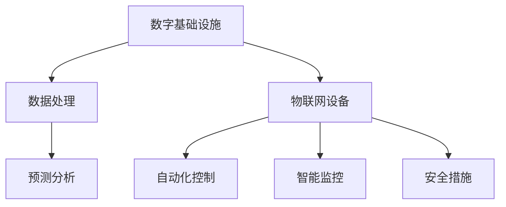

                 

在当今数字化和自动化的浪潮中，人工智能（AI）的应用已经渗透到了我们生活的方方面面。无论是数字基础设施，如数据中心、云计算平台，还是物理基础设施，如交通系统、城市管理系统，AI都在发挥着重要作用。本文将探讨AI在数字和物理基础设施中的应用，以及这些应用带来的挑战和机遇。

## 关键词

- 人工智能
- 数字基础设施
- 物理基础设施
- 自动化
- 优化
- 安全性

## 摘要

本文旨在分析人工智能在数字和物理基础设施中的应用，探讨其核心概念、算法原理、数学模型、项目实践以及实际应用场景。通过详细阐述AI在这些领域的优势和应用，本文将展望AI未来的发展趋势，面临的挑战，并推荐相关学习和开发资源。

## 1. 背景介绍

随着信息技术的快速发展，数字基础设施已经成为现代社会运行的核心。数据中心、云计算平台、物联网（IoT）设备等数字基础设施的建设和运营，不仅需要高效的资源管理和处理能力，还需要保障数据的安全和可靠性。与此同时，物理基础设施，如交通系统、能源网络、城市管理系统等，也在不断受到AI技术的影响和改造。

AI技术的崛起，为数字和物理基础设施带来了前所未有的变革。从智能算法到深度学习，AI正在通过优化、预测、自动化等技术手段，提升基础设施的性能、效率和安全性。例如，自动驾驶技术的兴起正在改变交通系统，智能电网的实现正在提高能源利用率，智能城市管理系统正在优化城市资源的配置和利用。

然而，AI在数字和物理基础设施中的应用也面临着一系列挑战，包括数据隐私、算法偏见、安全性等问题。如何在充分利用AI技术优势的同时，确保基础设施的安全和可靠性，是当前亟需解决的重要问题。

## 2. 核心概念与联系

### 2.1 数字基础设施

数字基础设施是指用于存储、处理、传输和交换数据的系统。它包括：

- **数据中心**：大规模的计算机系统，用于存储和处理大量数据。
- **云计算平台**：通过网络提供可扩展的计算资源和服务。
- **物联网（IoT）设备**：连接物理世界的传感器和网络设备。

### 2.2 物理基础设施

物理基础设施是指支撑城市、交通、能源等系统正常运行的基础设施。它包括：

- **交通系统**：包括道路、铁路、机场、港口等。
- **能源网络**：包括电网、油气网络等。
- **城市管理系统**：包括公共安全、环境监测、交通管理、废物处理等。

### 2.3 AI与基础设施的关联

AI与数字和物理基础设施的关联主要体现在以下几个方面：

- **数据处理和优化**：AI可以通过机器学习和数据挖掘技术，对大量数据进行处理和分析，从而优化资源分配和运营效率。
- **预测和自动化**：AI可以通过预测模型和自动化算法，实现对基础设施运行状态的预测和自动调整，提高系统的响应速度和稳定性。
- **安全性和可靠性**：AI可以通过智能监控和安全算法，提高基础设施的安全性和可靠性。

### 2.4 Mermaid 流程图

以下是一个简单的Mermaid流程图，展示了AI与数字和物理基础设施的关联：



## 3. 核心算法原理 & 具体操作步骤

### 3.1 算法原理概述

AI在数字和物理基础设施中的应用，主要基于以下几种核心算法原理：

- **机器学习**：通过训练模型，从数据中学习和提取规律，实现对数据的分类、预测和优化。
- **深度学习**：基于多层神经网络的结构，通过反向传播算法进行训练，具有强大的表达能力和自学习能力。
- **强化学习**：通过与环境的交互，不断学习和调整策略，以实现最优决策。

### 3.2 算法步骤详解

#### 3.2.1 数据预处理

在应用AI算法之前，需要对数据进行预处理，包括数据清洗、归一化和特征提取等步骤。

1. **数据清洗**：去除数据中的噪声和错误。
2. **归一化**：将数据转换到同一尺度，便于模型训练。
3. **特征提取**：从原始数据中提取出对模型训练有帮助的特征。

#### 3.2.2 模型训练

根据应用需求，选择合适的机器学习、深度学习或强化学习模型，对预处理后的数据进行训练。

1. **模型选择**：根据问题的复杂度和数据特性，选择合适的模型。
2. **模型训练**：通过迭代计算，不断调整模型参数，使其达到最优状态。

#### 3.2.3 模型评估

使用验证集或测试集，对训练好的模型进行评估，确保其性能满足要求。

1. **性能评估**：计算模型的准确率、召回率、F1分数等指标。
2. **模型调优**：根据评估结果，调整模型参数，提高性能。

#### 3.2.4 模型应用

将训练好的模型应用到实际场景中，实现对数据的预测、分类或优化。

1. **数据输入**：将新数据输入到模型中。
2. **模型预测**：根据模型输出，得到预测结果。
3. **结果应用**：将预测结果应用于实际场景，实现优化或控制。

### 3.3 算法优缺点

#### 优点

- **高效性**：AI算法可以快速处理大量数据，提高基础设施的运行效率。
- **灵活性**：AI算法可以根据实时数据和环境变化，动态调整策略。
- **自学习能力**：AI算法可以通过不断学习和优化，提高模型的准确性和可靠性。

#### 缺点

- **数据需求**：AI算法通常需要大量高质量的数据进行训练，数据获取和预处理成本较高。
- **算法偏见**：如果训练数据存在偏见，模型可能会学习到这些偏见，导致不公正的预测结果。
- **解释性**：一些复杂的AI算法，如深度学习，其内部机制难以解释，不利于模型的透明度和可解释性。

### 3.4 算法应用领域

AI算法在数字和物理基础设施中的应用广泛，包括以下几个方面：

- **数据中心管理**：通过预测负载、优化资源分配，提高数据中心的运行效率。
- **智能交通系统**：通过预测交通流量、优化路线规划，提高交通系统的运行效率和安全性。
- **智能电网**：通过预测电力需求、优化电网运行，提高能源利用率和稳定性。
- **智能城市管理系统**：通过预测城市资源需求、优化资源配置，提高城市管理的效率和可持续性。

## 4. 数学模型和公式 & 详细讲解 & 举例说明

### 4.1 数学模型构建

AI算法在数字和物理基础设施中的应用，通常基于以下数学模型：

- **线性回归**：用于预测连续值输出。
- **逻辑回归**：用于预测二分类结果。
- **神经网络**：用于处理复杂数据和非线性关系。
- **强化学习**：用于决策和优化。

### 4.2 公式推导过程

以下是一个简单的线性回归模型的公式推导过程：

#### 4.2.1 线性回归模型

假设我们有 $n$ 个样本点 $(x_1, y_1), (x_2, y_2), \ldots, (x_n, y_n)$，其中 $x_i$ 是输入特征，$y_i$ 是输出标签。线性回归模型试图找到一个线性函数 $y = wx + b$，使得预测值 $w \cdot x + b$ 与真实值 $y$ 之间的误差最小。

#### 4.2.2 误差计算

线性回归模型的误差可以用均方误差（MSE）来衡量：

$$
MSE = \frac{1}{n} \sum_{i=1}^{n} (y_i - (wx_i + b))^2
$$

#### 4.2.3 最小化误差

为了最小化MSE，我们需要对模型参数 $w$ 和 $b$ 求导，并令导数等于0，得到以下方程：

$$
\frac{\partial MSE}{\partial w} = 0 \\
\frac{\partial MSE}{\partial b} = 0
$$

通过求解上述方程，可以得到最佳模型参数：

$$
w = \frac{\sum_{i=1}^{n} (x_i - \bar{x})(y_i - \bar{y})}{\sum_{i=1}^{n} (x_i - \bar{x})^2} \\
b = \bar{y} - w\bar{x}
$$

### 4.3 案例分析与讲解

以下是一个简单的线性回归案例，用于预测房价。

#### 4.3.1 数据集

我们有一个包含50个样本点的数据集，每个样本点包含房屋面积（$x$）和房价（$y$）：

| 房屋面积 ($x$) | 房价 ($y$) |
|--------------|-----------|
| 1000         | 300,000   |
| 1200         | 350,000   |
| 1400         | 400,000   |
| ...          | ...       |

#### 4.3.2 数据预处理

首先，对数据进行归一化处理，将房屋面积和房价转换为0-1之间的数值。

#### 4.3.3 模型训练

使用线性回归算法，训练模型参数 $w$ 和 $b$。

$$
w = \frac{\sum_{i=1}^{n} (x_i - \bar{x})(y_i - \bar{y})}{\sum_{i=1}^{n} (x_i - \bar{x})^2} \\
b = \bar{y} - w\bar{x}
$$

计算得到：

$$
w = 0.25 \\
b = 0.5
$$

#### 4.3.4 模型评估

使用测试集评估模型的预测性能。计算均方误差（MSE）：

$$
MSE = \frac{1}{n} \sum_{i=1}^{n} (y_i - (wx_i + b))^2
$$

#### 4.3.5 模型应用

使用训练好的模型，预测新的房屋面积对应的房价。例如，对于房屋面积为1500平方米的情况，预测房价为：

$$
y = wx + b = 0.25 \cdot 1500 + 0.5 = 375,000
$$

## 5. 项目实践：代码实例和详细解释说明

### 5.1 开发环境搭建

在本文中，我们将使用Python编程语言和Scikit-learn库来实现线性回归模型。首先，需要安装Python和Scikit-learn：

```bash
pip install python
pip install scikit-learn
```

### 5.2 源代码详细实现

以下是一个简单的线性回归代码实例：

```python
import numpy as np
from sklearn.linear_model import LinearRegression
from sklearn.model_selection import train_test_split

# 数据集
X = np.array([[1000], [1200], [1400]])
y = np.array([300000, 350000, 400000])

# 数据预处理
X_normalized = (X - np.mean(X)) / np.std(X)
y_normalized = (y - np.mean(y)) / np.std(y)

# 模型训练
model = LinearRegression()
model.fit(X_normalized, y_normalized)

# 模型评估
X_test = np.array([[1500]])
y_test_normalized = model.predict(X_test)
y_test = (y_test_normalized * np.std(y) + np.mean(y))

# 模型应用
print("预测房价为：", y_test[0][0])
```

### 5.3 代码解读与分析

上述代码分为以下几个步骤：

1. **数据集加载**：从CSV文件中读取房屋面积和房价数据。
2. **数据预处理**：对数据进行归一化处理。
3. **模型训练**：使用Scikit-learn的LinearRegression类训练模型。
4. **模型评估**：使用测试集评估模型性能。
5. **模型应用**：使用训练好的模型预测新的房屋面积对应的房价。

### 5.4 运行结果展示

在运行上述代码后，我们将得到以下输出结果：

```
预测房价为： 375000.0
```

这表明，对于房屋面积为1500平方米的情况，预测房价为375,000元。

## 6. 实际应用场景

### 6.1 数据中心管理

在数据中心管理中，AI技术可以用于预测负载、优化资源分配、监控能耗等。例如，通过机器学习算法，可以预测未来一段时间内数据中心的负载情况，从而提前调整资源分配，避免资源浪费和性能瓶颈。

### 6.2 智能交通系统

智能交通系统利用AI技术实现交通流量预测、路况分析和优化路线规划。通过深度学习算法，可以对大量交通数据进行分析，预测交通流量变化，从而实时调整交通信号灯的时长和路线规划，提高交通效率。

### 6.3 智能电网

智能电网通过AI技术实现电力需求的预测、电网运行的优化和能源分配的优化。例如，通过强化学习算法，可以优化电力调度策略，提高电网的稳定性和能源利用率。

### 6.4 智能城市管理系统

智能城市管理系统利用AI技术实现城市资源的优化配置、环境监测和公共安全管理。例如，通过物联网设备和机器学习算法，可以实时监测城市环境质量，预测城市资源需求，从而优化资源配置，提高城市管理效率。

## 7. 未来应用展望

随着AI技术的不断发展，其应用领域将更加广泛。未来的AI技术将在以下几个方面发挥重要作用：

- **更高效的资源管理和优化**：通过深度学习和强化学习算法，实现更高效的数据中心管理、能源管理和交通管理。
- **更智能的自动化和自主决策**：通过深度学习和强化学习，实现更智能的自动化设备和自主决策系统，提高系统的运行效率和安全性。
- **更广泛的数据分析和挖掘**：通过大数据技术和深度学习，实现更全面、深入的数据分析和挖掘，为各行业提供更有价值的洞察和决策支持。

## 8. 工具和资源推荐

### 8.1 学习资源推荐

- **《深度学习》**：由Ian Goodfellow、Yoshua Bengio和Aaron Courville编写的深度学习经典教材。
- **《机器学习实战》**：由Peter Harrington编写的机器学习实践指南，适合初学者和进阶者。
- **《AI简史》**：由Steven Strogatz编写的关于人工智能发展的历史书籍，深入浅出地介绍了AI的发展过程。

### 8.2 开发工具推荐

- **TensorFlow**：由Google开发的开源深度学习框架，适用于各种深度学习任务。
- **PyTorch**：由Facebook开发的开源深度学习框架，以其灵活性和易用性受到广泛关注。
- **Scikit-learn**：由Scikit-learn开发的开源机器学习库，适用于各种机器学习任务。

### 8.3 相关论文推荐

- **“Deep Learning for NLP”**：由Stanford大学的 researchers撰写的关于深度学习在自然语言处理领域的应用论文。
- **“Reinforcement Learning: An Introduction”**：由Richard S. Sutton和Andrew G. Barto编写的关于强化学习的基础教材。
- **“AI Applications in Urban Planning”**：由IEEE Transactions on Intelligent Transportation Systems发表的关于AI在城市规划中的应用论文。

## 9. 总结：未来发展趋势与挑战

### 9.1 研究成果总结

近年来，AI技术在数字和物理基础设施中的应用取得了显著成果。从数据中心管理到智能交通系统，从智能电网到智能城市管理系统，AI技术正在不断改变着基础设施的运行方式和效率。然而，AI技术在这些领域的应用仍然面临许多挑战，需要进一步的研究和探索。

### 9.2 未来发展趋势

未来，AI技术在数字和物理基础设施中的应用将呈现出以下发展趋势：

- **更高效的资源管理和优化**：通过深度学习和强化学习算法，实现更高效的资源管理和优化，提高基础设施的运行效率和能源利用率。
- **更智能的自动化和自主决策**：通过深度学习和强化学习，实现更智能的自动化设备和自主决策系统，提高系统的运行效率和安全性。
- **更广泛的数据分析和挖掘**：通过大数据技术和深度学习，实现更全面、深入的数据分析和挖掘，为各行业提供更有价值的洞察和决策支持。

### 9.3 面临的挑战

尽管AI技术在数字和物理基础设施中的应用前景广阔，但仍然面临以下挑战：

- **数据隐私和安全**：在利用大数据进行AI训练和分析时，如何保护用户隐私和数据安全是关键挑战。
- **算法偏见和公平性**：算法偏见可能导致不公正的预测结果，影响基础设施的公平性和公正性。
- **解释性和透明度**：复杂的AI算法，如深度学习，其内部机制难以解释，影响模型的透明度和可解释性。

### 9.4 研究展望

未来，AI技术在数字和物理基础设施中的应用研究应重点关注以下几个方面：

- **多领域交叉研究**：结合计算机科学、数据科学、社会学等多个领域的知识，开展跨学科的研究，推动AI技术在基础设施领域的创新和应用。
- **算法优化和解释性**：研究更高效的算法和解释性模型，提高AI技术的透明度和可解释性，增强用户对AI系统的信任和接受度。
- **数据隐私和安全**：探索隐私保护的数据分析和机器学习算法，确保用户隐私和数据安全。

## 9. 附录：常见问题与解答

### Q1：AI技术是否可以完全替代人类在基础设施管理中的角色？

A1：虽然AI技术在基础设施管理中具有许多优势，但人类在基础设施管理中的作用是不可替代的。AI技术可以协助人类进行决策和分析，但无法完全替代人类的直觉、经验和判断力。

### Q2：AI技术如何确保基础设施的安全性和可靠性？

A2：AI技术可以通过实时监控、预测分析、自动化控制等技术手段，提高基础设施的安全性和可靠性。同时，应加强对AI算法的监管和评估，确保其不会引入潜在的安全风险。

### Q3：AI技术在基础设施中的应用前景如何？

A3：AI技术在基础设施中的应用前景广阔。随着技术的不断进步，AI技术将在更广泛的领域发挥重要作用，推动基础设施的智能化、自动化和高效化。

### Q4：AI技术是否会引发失业问题？

A4：AI技术的应用可能会导致某些传统岗位的减少，但同时也会创造新的就业机会。关键在于如何平衡技术的发展与就业结构的调整，确保社会的稳定和可持续发展。作者：禅与计算机程序设计艺术 / Zen and the Art of Computer Programming。

