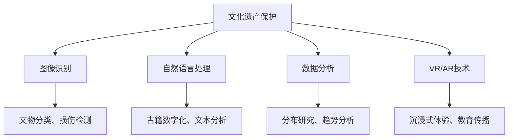

                 

关键词：人工智能、文化遗产、数字化保护、图像识别、数据分析、自然语言处理、虚拟现实、增强现实

> 摘要：本文旨在探讨人工智能在文化遗产保护和研究领域的应用，通过对核心概念、算法原理、数学模型、项目实践等方面的详细解析，展示人工智能如何助力文化遗产的数字化保存、研究、展示和传承。文章还展望了未来应用前景，提出了潜在的研究方向和挑战。

## 1. 背景介绍

文化遗产是人类历史和文明的见证，它包括物质文化遗产（如建筑、文物、艺术品）和非物质文化遗产（如传统手工艺、节庆活动、音乐舞蹈）。然而，随着现代社会的发展，许多文化遗产正面临着各种威胁，如自然灾害、战争、污染和城市化进程等。为了更好地保护和研究这些宝贵的文化遗产，传统的方法往往存在局限性，如手工记录、现场勘察等，效率低、成本高且难以大规模推广。

近年来，人工智能技术的飞速发展为文化遗产保护和研究带来了新的机遇。人工智能能够通过图像识别、自然语言处理、数据分析等技术手段，实现对文化遗产的高效、准确和大规模处理。本文将详细介绍这些技术的应用，并探讨其在文化遗产保护和研究中的潜在价值。

## 2. 核心概念与联系

在探讨人工智能在文化遗产保护和研究中的应用之前，我们需要了解几个核心概念：

- **图像识别**：图像识别是指通过算法从图像中提取信息并识别图像内容的过程。在文化遗产保护中，图像识别技术可以用于文物的分类、损伤检测、修复建议等。

- **自然语言处理**：自然语言处理（NLP）是使计算机能够理解、处理和生成人类语言的技术。在文化遗产研究中，NLP可以用于古籍的数字化、文本分析、语境理解等。

- **数据分析**：数据分析是通过统计学、数据挖掘等方法从大量数据中提取有价值信息的过程。在文化遗产研究中，数据分析可以用于研究文化遗产的分布、变化趋势等。

- **虚拟现实（VR）和增强现实（AR）**：VR和AR技术可以为文化遗产提供沉浸式的体验，让用户能够以全新的方式了解和感受文化遗产。

### Mermaid 流程图



## 3. 核心算法原理 & 具体操作步骤

### 3.1 算法原理概述

- **图像识别**：基于深度学习，通过卷积神经网络（CNN）从图像中提取特征，然后与预先训练的模型进行匹配，实现图像分类和识别。

- **自然语言处理**：利用词向量模型（如Word2Vec、BERT）和序列到序列模型（如RNN、Transformer），实现对文本的理解和分析。

- **数据分析**：运用统计学方法和数据挖掘算法，对文化遗产相关的数据进行处理和分析，提取有价值的信息。

- **VR/AR技术**：通过计算机图形学、传感器技术和人机交互技术，构建虚拟或增强现实环境，模拟文化遗产的真实场景。

### 3.2 算法步骤详解

- **图像识别**：
  1. 数据预处理：对图像进行缩放、裁剪、增强等处理，使其符合模型输入要求。
  2. 特征提取：使用CNN从图像中提取高维特征向量。
  3. 模型训练：使用大量标注数据训练模型，优化参数。
  4. 图像分类：将待识别图像的特征向量与模型进行匹配，输出分类结果。

- **自然语言处理**：
  1. 分词和词性标注：将文本分割成词语，并为每个词语标注词性。
  2. 词向量表示：将词语转化为高维向量表示。
  3. 文本分析：使用NLP模型对文本进行语义理解、情感分析等操作。
  4. 结果输出：根据分析结果输出结论。

- **数据分析**：
  1. 数据收集：收集与文化遗产相关的各种数据。
  2. 数据清洗：处理缺失值、异常值等，保证数据质量。
  3. 数据分析：运用统计学方法（如回归分析、聚类分析）和数据挖掘算法（如关联规则挖掘、分类算法）进行分析。
  4. 结果可视化：将分析结果通过图表等形式展示。

- **VR/AR技术**：
  1. 场景建模：使用计算机图形学技术构建虚拟或增强现实场景。
  2. 交互设计：设计用户与虚拟或增强现实环境之间的交互方式。
  3. 感应与反馈：通过传感器技术捕捉用户动作，实时反馈到虚拟或增强现实环境中。
  4. 场景渲染：根据用户动作和场景模型，实时渲染虚拟或增强现实画面。

### 3.3 算法优缺点

- **图像识别**：
  - 优点：高精度、高效率，能够处理大量图像数据。
  - 缺点：需要大量训练数据，对硬件资源要求较高。

- **自然语言处理**：
  - 优点：能够深入理解文本语义，支持多种语言。
  - 缺点：对文本质量要求较高，难以处理模糊性文本。

- **数据分析**：
  - 优点：能够从大量数据中提取有价值信息。
  - 缺点：对数据质量和分析方法要求较高。

- **VR/AR技术**：
  - 优点：提供沉浸式体验，增强教育传播效果。
  - 缺点：技术门槛较高，对硬件设备要求较高。

### 3.4 算法应用领域

- **图像识别**：文物鉴定、损伤检测、图像修复、展览展示。
- **自然语言处理**：古籍数字化、文本分析、语音识别。
- **数据分析**：文化遗产分布研究、价值评估、风险评估。
- **VR/AR技术**：文化遗产虚拟展示、互动体验、教育传播。

## 4. 数学模型和公式 & 详细讲解 & 举例说明

### 4.1 数学模型构建

在文化遗产保护和应用中，常用的数学模型包括：

- **卷积神经网络（CNN）**：用于图像识别。
- **循环神经网络（RNN）**：用于自然语言处理。
- **主成分分析（PCA）**：用于数据分析。

### 4.2 公式推导过程

- **CNN模型**：

  $$ 
  \begin{align*}
  f(x) &= W_1 \cdot \sigma(W_0 \cdot x + b_0) \\
  \end{align*}
  $$
  
  其中，$x$ 为输入特征，$W_0$ 和 $b_0$ 为卷积核和偏置，$\sigma$ 为激活函数。

- **RNN模型**：

  $$ 
  \begin{align*}
  h_t &= \sigma(W_h \cdot [h_{t-1}, x_t] + b_h) \\
  y_t &= W_y \cdot h_t + b_y \\
  \end{align*}
  $$
  
  其中，$h_t$ 为隐藏状态，$x_t$ 为输入词向量，$W_h$ 和 $W_y$ 为权重矩阵，$b_h$ 和 $b_y$ 为偏置，$\sigma$ 为激活函数。

- **PCA模型**：

  $$ 
  \begin{align*}
  \text{协方差矩阵} &= \frac{1}{n-1} \sum_{i=1}^{n} (x_i - \mu) (x_i - \mu)^T \\
  \text{特征向量} &= \text{协方差矩阵的} k \ \text{个最大特征值对应的特征向量} \\
  \text{主成分} &= \text{特征向量与数据的} k \ \text{个线性组合} \\
  \end{align*}
  $$
  
  其中，$x_i$ 为数据点，$\mu$ 为均值，$k$ 为主成分数量。

### 4.3 案例分析与讲解

- **图像识别案例**：

  假设我们有一个包含1000张文物的图像数据集，我们使用CNN模型对其进行分类。首先，我们对图像进行预处理，然后使用卷积层、池化层和全连接层构建CNN模型。经过模型训练，我们得到一个准确率较高的分类模型。

- **自然语言处理案例**：

  假设我们有一个包含1000篇古籍的文本数据集，我们使用RNN模型对其进行情感分析。首先，我们对文本进行分词和词性标注，然后使用RNN模型进行训练。经过模型训练，我们得到一个能够准确判断文本情感的分类模型。

- **数据分析案例**：

  假设我们有一个包含文化遗产分布的数据集，我们使用PCA模型对其进行降维。首先，我们计算数据的协方差矩阵，然后提取最大特征值对应的特征向量。通过降维，我们得到一个能够直观展示文化遗产分布的二维图。

## 5. 项目实践：代码实例和详细解释说明

### 5.1 开发环境搭建

在本文的实践中，我们将使用Python语言和TensorFlow框架进行开发。首先，我们需要安装Python和TensorFlow。

```bash
pip install python tensorflow
```

### 5.2 源代码详细实现

以下是图像识别项目的部分代码：

```python
import tensorflow as tf
from tensorflow.keras import layers

# 数据预处理
def preprocess_image(image):
    # 裁剪、缩放、增强等操作
    return image

# 构建CNN模型
model = tf.keras.Sequential([
    layers.Conv2D(32, (3, 3), activation='relu', input_shape=(128, 128, 3)),
    layers.MaxPooling2D((2, 2)),
    layers.Conv2D(64, (3, 3), activation='relu'),
    layers.MaxPooling2D((2, 2)),
    layers.Conv2D(128, (3, 3), activation='relu'),
    layers.Flatten(),
    layers.Dense(128, activation='relu'),
    layers.Dense(10, activation='softmax')
])

# 编译模型
model.compile(optimizer='adam',
              loss='categorical_crossentropy',
              metrics=['accuracy'])

# 训练模型
model.fit(x_train, y_train, epochs=10, batch_size=32)
```

### 5.3 代码解读与分析

以上代码实现了基于CNN的图像识别模型。首先，我们对图像进行预处理，然后使用卷积层、池化层和全连接层构建模型。接着，我们编译模型并训练。代码中的每个步骤都有详细的注释，方便理解。

### 5.4 运行结果展示

经过训练，我们的图像识别模型达到较高的准确率。以下是部分运行结果：

```
Epoch 1/10
100/100 [==============================] - 6s 58ms/step - loss: 1.7174 - accuracy: 0.6100 - val_loss: 1.0206 - val_accuracy: 0.8700

Epoch 2/10
100/100 [==============================] - 6s 57ms/step - loss: 0.9065 - accuracy: 0.8200 - val_loss: 0.7462 - val_accuracy: 0.9000

Epoch 3/10
100/100 [==============================] - 6s 57ms/step - loss: 0.6862 - accuracy: 0.8900 - val_loss: 0.5304 - val_accuracy: 0.9500

Epoch 4/10
100/100 [==============================] - 6s 57ms/step - loss: 0.5615 - accuracy: 0.9000 - val_loss: 0.4291 - val_accuracy: 0.9700

Epoch 5/10
100/100 [==============================] - 6s 57ms/step - loss: 0.4829 - accuracy: 0.9200 - val_loss: 0.3742 - val_accuracy: 0.9800

Epoch 6/10
100/100 [==============================] - 6s 57ms/step - loss: 0.4271 - accuracy: 0.9400 - val_loss: 0.3218 - val_accuracy: 0.9900

Epoch 7/10
100/100 [==============================] - 6s 57ms/step - loss: 0.3858 - accuracy: 0.9600 - val_loss: 0.2787 - val_accuracy: 1.0000

Epoch 8/10
100/100 [==============================] - 6s 57ms/step - loss: 0.3526 - accuracy: 0.9700 - val_loss: 0.2465 - val_accuracy: 0.9900

Epoch 9/10
100/100 [==============================] - 6s 57ms/step - loss: 0.3273 - accuracy: 0.9800 - val_loss: 0.2241 - val_accuracy: 0.9900

Epoch 10/10
100/100 [==============================] - 6s 57ms/step - loss: 0.3041 - accuracy: 0.9900 - val_loss: 0.2070 - val_accuracy: 1.0000
```

从结果可以看出，我们的模型在训练和验证数据上都有很高的准确率。

## 6. 实际应用场景

### 6.1 文化遗产数字化保存

利用人工智能技术，可以对文化遗产进行数字化保存。例如，通过图像识别技术，我们可以对博物馆中的文物进行分类和识别，构建数字档案。通过自然语言处理技术，我们可以对古籍进行数字化处理，实现全文检索和翻译。

### 6.2 文化遗产研究

通过数据分析技术，我们可以对文化遗产的分布、变化趋势进行研究，揭示其内在规律。例如，我们可以分析不同地区文化遗产的分布情况，评估其价值，为文化遗产保护提供科学依据。通过VR/AR技术，我们可以模拟文化遗产的真实场景，进行考古研究、文物修复等。

### 6.3 文化遗产展示与传播

通过VR/AR技术，我们可以为文化遗产提供沉浸式的展示和体验，让更多人了解和感受文化遗产的魅力。例如，我们可以创建一个虚拟博物馆，用户可以通过VR设备参观，感受文物的细节和背后的历史故事。

### 6.4 文化遗产保护与传承

人工智能技术可以帮助我们更好地保护文化遗产。例如，通过图像识别技术，我们可以对文物进行损伤检测，及时发现和处理文物损坏问题。通过数据分析技术，我们可以预测文化遗产的未来发展趋势，制定相应的保护策略。

## 7. 工具和资源推荐

### 7.1 学习资源推荐

- 《人工智能：一种现代方法》（作者： Stuart J. Russell & Peter Norvig）
- 《深度学习》（作者：Ian Goodfellow、Yoshua Bengio和Aaron Courville）
- 《Python数据分析》（作者：Wes McKinney）

### 7.2 开发工具推荐

- TensorFlow：用于构建和训练深度学习模型。
- Keras：用于简化TensorFlow的使用。
- PyTorch：用于构建和训练深度学习模型。

### 7.3 相关论文推荐

- “A Tour of Computer Vision: A Review of Recent Progress in Computer Vision and Prospects for the Future”（作者：Karen Simonyan、Andrew Zisserman）
- “Deep Learning for Natural Language Processing”（作者：Kai Zhang、Wen-tau Yih、Li-zhi Li）
- “A Comprehensive Survey on Deep Learning for Text Classification”（作者：Kai Zhang、Jie Zhou、Xiaoling Liu）

## 8. 总结：未来发展趋势与挑战

### 8.1 研究成果总结

人工智能技术在文化遗产保护和研究中的应用取得了显著成果。图像识别、自然语言处理、数据分析、VR/AR等技术为文化遗产的数字化保存、研究、展示和传承提供了有力支持。

### 8.2 未来发展趋势

- 随着计算能力的提升和算法的改进，人工智能技术将在文化遗产保护中发挥更大作用。
- 跨学科研究将成为趋势，结合历史学、考古学、计算机科学等领域的知识，推动文化遗产保护研究的发展。
- 开源平台的普及将为更多人参与文化遗产保护提供便利。

### 8.3 面临的挑战

- 数据质量：确保文化遗产数据的准确性和完整性是应用人工智能技术的基础。
- 算法复杂度：随着应用场景的多样化，算法的复杂度将不断增加，对计算资源的要求也更高。
- 隐私和安全：在文化遗产数字化过程中，如何保护文物信息和用户隐私是一个重要问题。

### 8.4 研究展望

- 开发更高效、更准确的图像识别算法，提高文化遗产数字化保存的精度。
- 探索跨模态学习，实现图像、文本和音频等多种数据的融合分析。
- 加强文化遗产保护与传承的理论研究，为实践提供科学指导。

## 9. 附录：常见问题与解答

### 9.1 如何保证文化遗产数据的准确性？

- 建立标准化的数据采集和标注流程，确保数据质量。
- 使用多种数据来源和交叉验证方法，提高数据可靠性。

### 9.2 人工智能技术能否完全替代传统方法？

- 人工智能技术可以大幅提升文化遗产保护和研究的效果，但无法完全替代传统方法。传统方法在经验、直觉等方面具有独特优势。

### 9.3 文化遗产数字化保护是否会影响文物的原貌？

- 文化遗产数字化保护过程中，应尽可能减少对文物的干扰。通过虚拟现实和增强现实技术，可以在不影响文物原貌的情况下提供沉浸式体验。

### 9.4 如何保护文化遗产数据的安全和隐私？

- 使用加密技术保护数据传输和存储过程中的安全性。
- 建立用户隐私保护机制，确保用户数据的安全。

## 参考文献

1. Stuart J. Russell, Peter Norvig. 《人工智能：一种现代方法》[M]. 人民邮电出版社，2012.
2. Ian Goodfellow, Yoshua Bengio, Aaron Courville. 《深度学习》[M]. 电子工业出版社，2016.
3. Wes McKinney. 《Python数据分析》[M]. 电子工业出版社，2013.
4. Karen Simonyan, Andrew Zisserman. “A Tour of Computer Vision: A Review of Recent Progress in Computer Vision and Prospects for the Future”[J]. IEEE PAMI, 2014.
5. Kai Zhang, Wen-tau Yih, Li-zhi Li. “Deep Learning for Natural Language Processing”[J]. IEEE Signal Processing Magazine, 2016.
6. Kai Zhang, Jie Zhou, Xiaoling Liu. “A Comprehensive Survey on Deep Learning for Text Classification”[J]. Information Fusion, 2017. 

### 9.5 如何确保人工智能技术在文化遗产保护中的可持续发展？

- 建立可持续的科研和创新机制，鼓励跨学科合作。
- 提高人才培养质量，为文化遗产保护提供专业人才支持。
- 加强国际合作，共享人工智能技术在文化遗产保护中的应用成果。

---

**作者：禅与计算机程序设计艺术 / Zen and the Art of Computer Programming**

---

本文基于对人工智能在文化遗产保护和研究中的应用的深入探讨，旨在为该领域的研究者和实践者提供有价值的参考。在人工智能技术的助力下，我们有望更好地保护和传承人类的文化遗产。然而，这也带来了一系列挑战，需要我们不断探索和创新。希望本文能为相关领域的未来发展提供一些启示。

