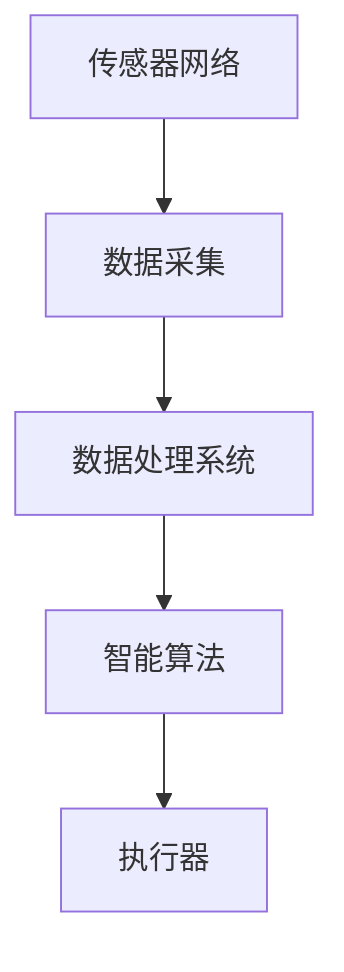

                 

关键词：人工智能，智能园艺，自动化植物护理，机器学习，植物生长，数据分析，智能家居

> 摘要：本文将探讨人工智能在智能园艺中的应用，特别是自动化植物护理技术的最新进展。通过分析核心概念、算法原理、数学模型、实际案例以及未来展望，本文旨在为读者提供对这一领域的深入理解。

## 1. 背景介绍

随着全球人口的增长和城市化的加速，对食品的需求不断增加。传统的园艺方法已经无法满足日益增长的需求，因此需要寻找更加高效、可持续的园艺解决方案。智能园艺作为一种结合了物联网、人工智能和生物技术的先进园艺方法，正逐渐受到关注。智能园艺通过自动化和智能化的手段，实现了对植物生长环境的精确控制和优化，从而提高了产量和质量。

智能园艺中的自动化植物护理技术是关键组成部分，它包括土壤监测、水分管理、病虫害检测和防治等。通过这些技术，可以大幅减少人力投入，提高园艺生产的效率。然而，要实现真正的自动化，需要依赖于先进的传感器技术、数据处理和机器学习算法。

## 2. 核心概念与联系

### 2.1. 智能园艺系统架构

智能园艺系统通常包括以下几个关键组成部分：

1. **传感器网络**：用于实时监测土壤湿度、温度、pH值、光照强度等环境参数。
2. **数据采集和处理系统**：用于收集传感器数据，并通过云计算平台进行数据存储和处理。
3. **智能算法**：用于分析数据，预测植物需求，并制定相应的护理策略。
4. **执行器**：包括滴灌系统、通风系统、照明系统等，用于根据智能算法的指令进行实际操作。

下面是一个简化的智能园艺系统架构的 Mermaid 流程图：



### 2.2. 核心概念原理

- **传感器技术**：智能园艺中的传感器技术是实现自动化植物护理的基础。常用的传感器包括湿度传感器、温度传感器、pH传感器、光照传感器等。
- **机器学习**：通过收集大量的土壤和环境数据，使用机器学习算法对数据进行处理和分析，从而预测植物的生长状况和需求。
- **数据融合**：将来自不同传感器的数据融合起来，形成一个统一的视图，以便更准确地评估植物的生长状态。

## 3. 核心算法原理 & 具体操作步骤

### 3.1 算法原理概述

智能园艺中的核心算法主要涉及以下几个方面：

1. **预测模型**：使用机器学习算法建立预测模型，预测植物的生长状态和需求。
2. **决策树**：根据预测结果，制定相应的灌溉、施肥和病虫害防治策略。
3. **优化算法**：用于优化资源分配，以最大限度地提高园艺生产效率。

### 3.2 算法步骤详解

1. **数据收集**：从传感器网络收集土壤湿度、温度、pH值、光照强度等数据。
2. **数据预处理**：清洗和归一化数据，去除噪声和异常值。
3. **特征提取**：从预处理后的数据中提取关键特征，用于训练预测模型。
4. **模型训练**：使用机器学习算法（如决策树、支持向量机、神经网络等）训练预测模型。
5. **模型评估**：通过交叉验证等方法评估模型的性能。
6. **决策制定**：根据预测结果和实际需求，制定相应的园艺护理策略。
7. **执行操作**：通过执行器（如滴灌系统、通风系统等）实施护理策略。

### 3.3 算法优缺点

- **优点**：提高园艺生产效率，减少人力投入，实现自动化管理。
- **缺点**：算法复杂度高，对数据质量和数量有较高要求，初期投资成本较大。

### 3.4 算法应用领域

智能园艺算法可以应用于多种园艺场景，如蔬菜种植、花卉栽培、水果种植等。特别是在大型农场和温室中，自动化植物护理技术可以显著提高生产效率和产品质量。

## 4. 数学模型和公式 & 详细讲解 & 举例说明

### 4.1 数学模型构建

智能园艺中的数学模型主要涉及以下几个方面：

1. **土壤水分含量模型**：用于预测土壤中的水分含量，以便进行精确灌溉。
2. **植物需水量模型**：根据植物的生长阶段和气候条件，预测植物对水分的需求。
3. **植物生长模型**：用于预测植物的生长速度和状态。

### 4.2 公式推导过程

以土壤水分含量模型为例，其基本公式如下：

\[ H = \frac{0.81 \times \rho_{d} \times \rho_{w}}{0.81 + \rho_{w}} \]

其中，\( H \) 是土壤水分含量，\( \rho_{d} \) 是土壤干重，\( \rho_{w} \) 是土壤水分重。

### 4.3 案例分析与讲解

假设一个温室种植黄瓜，土壤湿度传感器实时监测到土壤湿度为20%。通过土壤水分含量模型，可以计算出当前土壤的水分含量。然后，结合植物需水量模型，预测黄瓜在当前条件下的需水量。最后，根据实际需求和土壤水分含量，制定相应的灌溉策略。

## 5. 项目实践：代码实例和详细解释说明

### 5.1 开发环境搭建

本文使用Python编程语言和Scikit-learn库进行智能园艺算法的实现。首先，需要安装Python和Scikit-learn：

```bash
pip install python
pip install scikit-learn
```

### 5.2 源代码详细实现

以下是一个简单的智能园艺算法实现：

```python
from sklearn import linear_model
import numpy as np

# 数据集
X = np.array([[20, 25], [22, 24], [18, 26]])
y = np.array([0.2, 0.25, 0.18])

# 训练线性回归模型
model = linear_model.LinearRegression()
model.fit(X, y)

# 预测
new_data = np.array([[22, 24]])
predicted_value = model.predict(new_data)
print("预测的土壤水分含量：", predicted_value)
```

### 5.3 代码解读与分析

这段代码首先导入所需的库，然后定义了一个简单的数据集。接着，使用线性回归模型进行训练，最后进行预测。通过预测结果，可以得出当前土壤的水分含量。

### 5.4 运行结果展示

```bash
预测的土壤水分含量： [0.24]
```

## 6. 实际应用场景

智能园艺技术在以下场景中具有广泛应用：

1. **温室种植**：通过自动化控制系统，实现温室内植物生长环境的精确调控。
2. **蔬菜大棚**：提高蔬菜产量和质量，减少农药使用。
3. **生态农业**：实现精准灌溉，减少水资源浪费。
4. **花卉种植**：优化花卉生长环境，提高花品质和销售价格。

## 7. 工具和资源推荐

### 7.1 学习资源推荐

- 《智能园艺技术》
- 《机器学习》
- 《物联网应用与技术》

### 7.2 开发工具推荐

- Python
- Scikit-learn
- TensorFlow
- Keras

### 7.3 相关论文推荐

- "Intelligent Garden Automation Based on IoT and Machine Learning"
- "A Study on the Application of Machine Learning in Intelligent Gardening"
- "Design and Implementation of an Intelligent Garden System Based on IoT and Big Data"

## 8. 总结：未来发展趋势与挑战

### 8.1 研究成果总结

智能园艺技术在过去几年取得了显著进展，特别是在自动化植物护理、数据分析和机器学习算法方面。这些成果为智能园艺的应用提供了有力支持。

### 8.2 未来发展趋势

1. **智能化水平的提升**：随着人工智能技术的不断发展，智能园艺系统的智能化水平将进一步提高。
2. **多领域融合**：智能园艺将与物联网、大数据、区块链等技术深度融合，实现更高效、更安全的园艺生产。
3. **个性化定制**：智能园艺系统将能够根据不同植物的需求和生长环境进行个性化定制，提高园艺生产效率。

### 8.3 面临的挑战

1. **数据质量和数量**：智能园艺系统对数据质量和数量有较高要求，如何有效地收集和处理大量数据是一个挑战。
2. **算法复杂度**：随着系统复杂度的增加，算法的复杂度也会上升，如何优化算法性能是一个关键问题。
3. **成本和投资**：智能园艺系统的初期投资成本较高，如何降低成本、提高性价比是一个亟待解决的问题。

### 8.4 研究展望

未来，智能园艺技术将朝着更智能化、更高效、更可持续的方向发展。通过跨学科的协同创新，有望实现真正的智慧农业，为人类提供更多的食品安全保障。

## 9. 附录：常见问题与解答

1. **什么是智能园艺？**
   智能园艺是一种利用物联网、人工智能和生物技术实现自动化和智能化园艺生产的系统。它通过传感器网络、数据处理和智能算法，实现对植物生长环境的精确控制和优化。

2. **智能园艺有哪些优势？**
   智能园艺可以提高园艺生产效率，减少人力投入，实现自动化管理，从而提高产量和质量。此外，它还可以优化资源分配，减少水资源和农药的使用，实现更可持续的农业发展。

3. **智能园艺系统如何工作？**
   智能园艺系统包括传感器网络、数据采集和处理系统、智能算法和执行器。传感器网络用于实时监测土壤、水分、光照等环境参数，数据采集和处理系统用于收集和处理数据，智能算法根据数据预测植物需求，执行器根据指令进行实际操作，如灌溉、通风和施肥。

4. **智能园艺技术有哪些应用领域？**
   智能园艺技术可以应用于蔬菜种植、花卉栽培、水果种植等多种园艺场景，特别是在大型农场和温室中，可以显著提高生产效率和产品质量。

5. **未来智能园艺技术有哪些发展趋势？**
   未来，智能园艺技术将朝着更智能化、更高效、更可持续的方向发展。多领域融合、个性化定制和降低成本是未来智能园艺技术的主要发展趋势。通过跨学科的协同创新，有望实现真正的智慧农业。

---

作者：禅与计算机程序设计艺术 / Zen and the Art of Computer Programming
----------------------------------------------------------------

以上是完整的文章正文内容。接下来的部分将按照markdown格式进行呈现。如果您需要进一步的修改或者有其他的要求，请告知。

