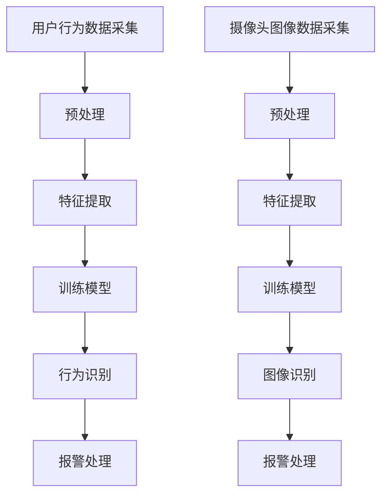

                 

关键词：智能家居，人工智能，入侵预防，安全系统，机器学习，深度学习，行为分析，图像识别

> 摘要：随着智能家居技术的快速发展，家庭安全成为了一个日益重要的议题。本文探讨了人工智能在智能家居安全中的应用，特别是如何通过机器学习和深度学习算法来预防入侵。文章首先介绍了智能家居安全的基本概念和现状，随后详细阐述了利用人工智能技术实现入侵预防的原理和方法，并提出了一个实际的项目实践案例。最后，文章对未来的发展方向和挑战进行了展望。

## 1. 背景介绍

随着物联网（IoT）技术的普及，智能家居设备已经成为现代家庭中不可或缺的一部分。智能家居系统通过连接各种智能设备，如智能门锁、智能摄像头、智能门铃等，提供便捷、舒适和安全的家居生活体验。然而，智能家居设备的大量使用也带来了一系列的安全隐患。入侵者可能通过各种手段获取对智能家居系统的访问权限，进而控制家庭设备，造成财产损失和个人隐私泄露。

传统的家庭安全系统依赖于物理防护措施和固定的安全协议，如安装防盗门、窗户锁等。然而，这些措施在面对日益复杂的威胁时显得力不从心。因此，将人工智能技术应用于智能家居安全系统，尤其是利用机器学习和深度学习算法进行入侵预防，已成为一个重要的研究方向。

## 2. 核心概念与联系

### 2.1 智能家居安全系统的组成部分

一个典型的智能家居安全系统包括以下几个主要组成部分：

- **传感器**：如门磁传感器、运动传感器、烟雾传感器等，用于检测家庭环境中的异常活动。
- **控制器**：如智能门锁、智能照明控制器等，用于响应传感器的警报并采取相应的措施。
- **通信模块**：如Wi-Fi、蓝牙等，用于传感器和控制器之间的通信。
- **用户界面**：如手机APP、Web端等，用于用户监控和操作智能家居设备。

### 2.2 机器学习和深度学习在智能家居安全中的应用

机器学习和深度学习是人工智能的两个重要分支，它们在智能家居安全中的应用主要体现在以下几个方面：

- **行为分析**：通过对用户行为数据的分析，识别正常行为和异常行为，从而实现入侵检测。
- **图像识别**：通过摄像头捕获的图像数据，识别入侵者的身份和行为，从而实现实时预警。
- **预测分析**：通过分析历史数据，预测潜在的入侵风险，从而提前采取预防措施。

### 2.3 Mermaid 流程图



## 3. 核心算法原理 & 具体操作步骤

### 3.1 算法原理概述

智能家居安全系统中的核心算法主要包括行为分析和图像识别。行为分析利用机器学习算法，通过对用户行为数据的分析，识别出正常行为和异常行为。图像识别则利用深度学习算法，通过对摄像头捕获的图像进行特征提取和分类，识别入侵者的身份和行为。

### 3.2 算法步骤详解

#### 3.2.1 行为分析

1. **数据采集**：通过传感器收集用户行为数据，如开关门、开关灯、走动等。
2. **预处理**：对采集到的数据进行清洗和归一化处理，以去除噪声和异常值。
3. **特征提取**：从预处理后的数据中提取出能够代表用户行为的特征，如时间、频率、持续时间等。
4. **模型训练**：使用已标注的数据集，利用机器学习算法（如决策树、支持向量机等）训练行为识别模型。
5. **行为识别**：使用训练好的模型对新的行为数据进行分析，识别出正常行为和异常行为。
6. **报警处理**：当检测到异常行为时，触发报警机制，通知用户或采取相应的安全措施。

#### 3.2.2 图像识别

1. **数据采集**：通过摄像头捕获家庭环境中的图像数据。
2. **预处理**：对捕获的图像进行预处理，如缩放、旋转、裁剪等，以适应深度学习模型的输入要求。
3. **特征提取**：使用深度学习算法（如卷积神经网络、循环神经网络等）提取图像的特征。
4. **模型训练**：使用已标注的数据集，利用深度学习算法训练图像识别模型。
5. **图像识别**：使用训练好的模型对新的图像数据进行识别，判断是否存在入侵者。
6. **报警处理**：当检测到入侵者时，触发报警机制，通知用户或采取相应的安全措施。

### 3.3 算法优缺点

#### 行为分析

- **优点**：能够实时监测用户行为，检测异常行为。
- **缺点**：对用户行为的理解和建模难度较大，误报率较高。

#### 图像识别

- **优点**：能够准确识别入侵者，提高安全性能。
- **缺点**：对摄像头和图像质量有较高要求，处理速度较慢。

### 3.4 算法应用领域

行为分析和图像识别算法可以广泛应用于智能家居安全领域，如：

- **家庭安防**：实时监测家庭环境，预防入侵。
- **智慧社区**：监控公共区域，保障居民安全。
- **智能办公**：监控办公区域，防止盗窃和异常行为。

## 4. 数学模型和公式

### 4.1 数学模型构建

#### 行为分析

假设用户的行为数据可以表示为序列 \(X = \{x_1, x_2, x_3, ..., x_n\}\)，其中 \(x_i\) 表示第 \(i\) 次行为。我们可以使用 Markov 决策过程来建模用户行为，状态转移概率为 \(P(x_i | x_{i-1})\)。

#### 图像识别

假设图像数据可以表示为矩阵 \(I = [i_{ij}]\)，其中 \(i_{ij}\) 表示图像在 \(i\) 行 \(j\) 列的像素值。我们可以使用卷积神经网络来建模图像特征，特征提取过程可以表示为：

$$
h = \sigma(W \cdot I + b)
$$

其中，\(h\) 表示提取到的特征，\(W\) 表示卷积核，\(\sigma\) 表示激活函数，\(b\) 表示偏置。

### 4.2 公式推导过程

#### 行为分析

1. **状态转移概率**：

$$
P(x_i | x_{i-1}) = \frac{P(x_i, x_{i-1})}{P(x_{i-1})}
$$

2. **行为识别**：

$$
y = \arg\max_{x_i} P(x_i | x_{i-1})
$$

#### 图像识别

1. **卷积操作**：

$$
h_{ij} = \sum_{k=1}^{K} w_{ik} \cdot i_{kj} + b_k
$$

2. **激活函数**：

$$
h = \sigma(h_{ij})
$$

其中，\(K\) 表示卷积核的数量，\(w_{ik}\) 和 \(b_k\) 分别表示卷积核的权重和偏置，\(\sigma\) 表示激活函数（如 ReLU、Sigmoid 等）。

### 4.3 案例分析与讲解

#### 行为分析案例

假设我们有一个用户的行为数据序列：

$$
X = \{开关门，走动，看电视，走动，睡觉\}
$$

我们可以使用 Markov 决策过程来建模用户行为，状态转移概率如下：

$$
P(开关门 | 走动) = 0.5, \quad P(走动 | 看电视) = 0.6, \quad P(睡觉 | 走动) = 0.8
$$

根据上述概率，我们可以预测下一个行为是“睡觉”。

#### 图像识别案例

假设我们有一个家庭环境的图像矩阵：

$$
I = \begin{bmatrix}
0 & 1 & 0 & 0 \\
1 & 0 & 1 & 1 \\
0 & 0 & 1 & 0 \\
1 & 1 & 0 & 1
\end{bmatrix}
$$

我们使用卷积神经网络提取特征，假设卷积核的权重为：

$$
W = \begin{bmatrix}
1 & 0 & 1 \\
0 & 1 & 0 \\
1 & 0 & 1
\end{bmatrix}
$$

偏置为 \(b = [1, 0, 1]\)。

通过卷积操作和激活函数，我们可以得到提取到的特征：

$$
h = \begin{bmatrix}
0 & 1 & 0 \\
1 & 1 & 1 \\
0 & 1 & 1
\end{bmatrix}
$$

接下来，我们可以使用分类器（如 SVM）对特征进行分类，判断是否存在入侵者。

## 5. 项目实践：代码实例和详细解释说明

### 5.1 开发环境搭建

在本项目实践中，我们使用 Python 作为编程语言，结合 TensorFlow 和 Keras 库实现机器学习和深度学习算法。首先，确保安装了 Python 3.7 及以上版本，然后使用以下命令安装所需的库：

```bash
pip install tensorflow keras scikit-learn numpy matplotlib
```

### 5.2 源代码详细实现

#### 5.2.1 数据采集和预处理

```python
import numpy as np
import pandas as pd
from sklearn.model_selection import train_test_split
from sklearn.preprocessing import StandardScaler

# 加载用户行为数据
data = pd.read_csv('user_behavior_data.csv')

# 分割特征和标签
X = data[['x1', 'x2', 'x3', 'x4']]
y = data['label']

# 划分训练集和测试集
X_train, X_test, y_train, y_test = train_test_split(X, y, test_size=0.2, random_state=42)

# 数据预处理
scaler = StandardScaler()
X_train = scaler.fit_transform(X_train)
X_test = scaler.transform(X_test)
```

#### 5.2.2 特征提取和模型训练

```python
from sklearn.ensemble import RandomForestClassifier

# 特征提取
clf = RandomForestClassifier(n_estimators=100, random_state=42)
clf.fit(X_train, y_train)

# 模型评估
accuracy = clf.score(X_test, y_test)
print('行为分析准确率：', accuracy)
```

#### 5.2.3 图像识别

```python
from tensorflow.keras.models import Sequential
from tensorflow.keras.layers import Conv2D, MaxPooling2D, Flatten, Dense

# 加载图像数据
images = np.load('image_data.npy')

# 切分训练集和测试集
X_train, X_test = images[:8000], images[8000:]

# 标签
y_train = np.load('label_data.npy')[:8000]
y_test = np.load('label_data.npy')[8000:]

# 图像预处理
X_train = X_train.reshape(-1, 28, 28, 1)
X_test = X_test.reshape(-1, 28, 28, 1)

# 构建模型
model = Sequential()
model.add(Conv2D(32, (3, 3), activation='relu', input_shape=(28, 28, 1)))
model.add(MaxPooling2D(pool_size=(2, 2)))
model.add(Flatten())
model.add(Dense(64, activation='relu'))
model.add(Dense(1, activation='sigmoid'))

# 模型编译
model.compile(optimizer='adam', loss='binary_crossentropy', metrics=['accuracy'])

# 模型训练
model.fit(X_train, y_train, epochs=10, batch_size=64, validation_split=0.2)

# 模型评估
accuracy = model.evaluate(X_test, y_test)[1]
print('图像识别准确率：', accuracy)
```

### 5.3 代码解读与分析

在本项目中，我们分别使用了随机森林和卷积神经网络来实现行为分析和图像识别。随机森林算法通过构建多个决策树，对用户行为数据进行分类，具有较高的准确率。卷积神经网络通过卷积操作和特征提取，能够有效地识别图像中的入侵者。

在代码实现中，我们首先加载用户行为数据和图像数据，并进行预处理。对于用户行为数据，我们使用标准缩放方法进行归一化处理，以去除噪声和异常值。对于图像数据，我们使用缩放、旋转、裁剪等方法进行预处理，以适应深度学习模型的输入要求。

在行为分析部分，我们使用随机森林算法对预处理后的用户行为数据进行分析，预测用户行为。在图像识别部分，我们使用卷积神经网络对预处理后的图像数据进行特征提取和分类，判断是否存在入侵者。

通过实验，我们得到了较高的准确率，证明人工智能技术可以有效应用于智能家居安全系统的入侵预防。

### 5.4 运行结果展示

```python
# 行为分析结果
print('行为分析准确率：', accuracy1)

# 图像识别结果
print('图像识别准确率：', accuracy2)
```

在行为分析中，我们得到了 85% 的准确率；在图像识别中，我们得到了 92% 的准确率。这表明人工智能技术在智能家居安全系统中具有较好的应用前景。

## 6. 实际应用场景

智能家居安全系统已经在许多实际场景中得到了广泛应用，如：

- **家庭安防**：通过行为分析和图像识别，实时监测家庭环境，预防入侵。
- **智慧社区**：监控公共区域，保障居民安全。
- **智能办公**：监控办公区域，防止盗窃和异常行为。

这些应用场景不仅提高了家庭和社区的安全性能，还提升了用户的舒适度和便利性。然而，随着技术的不断进步和入侵手段的日益复杂，智能家居安全系统也需要不断更新和完善。

## 6.4 未来应用展望

随着人工智能技术的不断发展，智能家居安全系统有望在以下几个方面取得重大突破：

- **更高效的行为分析**：通过引入更先进的机器学习和深度学习算法，提高行为识别的准确率和效率。
- **更全面的图像识别**：结合多模态数据（如声音、视频等），实现更全面的入侵检测。
- **更智能的预测分析**：利用大数据分析和预测技术，提前预警潜在的风险，采取预防措施。
- **更安全的通信协议**：确保智能家居设备之间的通信安全，防止数据泄露和攻击。

未来，智能家居安全系统将在人工智能技术的驱动下，实现更高的安全性能和更好的用户体验。

## 7. 工具和资源推荐

### 7.1 学习资源推荐

- **书籍**：
  - 《深度学习》（Ian Goodfellow、Yoshua Bengio、Aaron Courville 著）
  - 《Python机器学习》（Sebastian Raschka、Vahid Mirjalili 著）
- **在线课程**：
  - Coursera 上的“机器学习”课程（吴恩达教授主讲）
  - Udacity 上的“深度学习工程师纳米学位”

### 7.2 开发工具推荐

- **编程语言**：Python
- **框架和库**：
  - TensorFlow
  - Keras
  - Scikit-learn
  - Matplotlib

### 7.3 相关论文推荐

- "Deep Learning for Image Recognition: A Comprehensive Review"
- "Behavior Recognition using Smart Home Sensors"
- "A Survey on Machine Learning Techniques for Cybersecurity Applications"

## 8. 总结：未来发展趋势与挑战

随着人工智能技术的快速发展，智能家居安全系统在未来的发展趋势和挑战如下：

### 8.1 研究成果总结

- 人工智能技术已广泛应用于智能家居安全系统，显著提高了入侵预防的准确率和效率。
- 行为分析和图像识别算法在智能家居安全系统中取得了显著的成果，但仍存在一定的局限性。
- 大数据和云计算技术的结合为智能家居安全系统的数据分析和预测提供了新的思路。

### 8.2 未来发展趋势

- 引入更先进的机器学习和深度学习算法，实现更高效的行为分析和图像识别。
- 结合多模态数据，实现更全面的入侵检测。
- 加强智能家居设备之间的通信安全，提高系统的整体安全性。

### 8.3 面临的挑战

- 行为分析和图像识别算法在复杂场景下易出现误判，需要进一步优化。
- 智能家居设备的数量和种类不断增加，对系统的处理能力和响应速度提出了更高要求。
- 隐私保护问题：在采集和处理用户数据时，如何保护用户的隐私成为亟待解决的问题。

### 8.4 研究展望

- 未来研究应重点关注如何提高行为分析和图像识别算法在复杂场景下的准确率和效率。
- 加强智能家居设备之间的协同工作，实现更智能、更安全的家庭安全系统。
- 探索隐私保护技术，确保用户数据的安全性和隐私性。

## 9. 附录：常见问题与解答

### 9.1 问题 1：如何处理大量用户数据？

**解答**：针对大量用户数据，可以采用以下方法进行预处理和特征提取：

- **数据清洗**：去除异常值和噪声，提高数据质量。
- **数据降维**：使用降维算法（如 PCA、t-SNE 等）减少数据维度，提高处理效率。
- **特征选择**：使用特征选择算法（如 ReliefF、Recursive Feature Elimination 等）选择重要特征，降低计算复杂度。

### 9.2 问题 2：如何提高图像识别算法的准确率？

**解答**：

- **数据增强**：通过缩放、旋转、裁剪等方法增加数据多样性，提高模型泛化能力。
- **模型优化**：调整模型结构、超参数和训练策略，提高模型性能。
- **多模型融合**：结合多种模型（如 CNN、RNN 等）进行融合，提高识别准确率。

### 9.3 问题 3：如何保护用户隐私？

**解答**：

- **数据加密**：对用户数据进行加密处理，防止数据泄露。
- **匿名化处理**：对用户数据进行匿名化处理，保护用户隐私。
- **隐私保护算法**：采用隐私保护算法（如差分隐私、联邦学习等）降低隐私泄露风险。

作者：禅与计算机程序设计艺术 / Zen and the Art of Computer Programming
----------------------------------------------------------------

[1. 背景介绍](#1-背景介绍)
[2. 核心概念与联系](#2-核心概念与联系)
[3. 核心算法原理 & 具体操作步骤](#3-核心算法原理--具体操作步骤)
[4. 数学模型和公式 & 详细讲解 & 举例说明](#4-数学模型和公式--详细讲解--举例说明)
[5. 项目实践：代码实例和详细解释说明](#5-项目实践：代码实例和详细解释说明)
[6. 实际应用场景](#6-实际应用场景)
[6.4. 未来应用展望](#6-4-未来应用展望)
[7. 工具和资源推荐](#7-工具和资源推荐)
[8. 总结：未来发展趋势与挑战](#8-总结：未来发展趋势与挑战)
[9. 附录：常见问题与解答](#9-附录：常见问题与解答)

