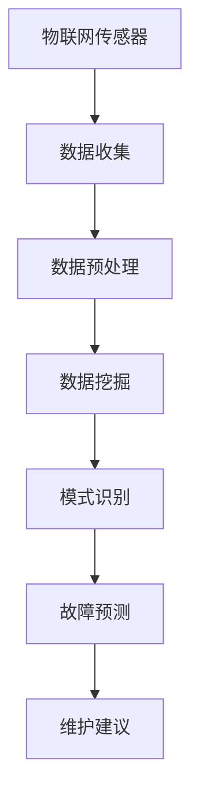

                 

关键词：人工智能，智能建筑，预防性维护，物联网，数据挖掘，机器学习，算法优化。

摘要：随着智能建筑的普及，如何有效地维护这些复杂的系统成为了一个重要议题。本文将探讨如何利用人工智能技术，特别是机器学习和数据挖掘，实现智能建筑的预防性维护。通过分析现有技术和应用案例，本文旨在为智能建筑行业提供可行的解决方案和未来发展的方向。

## 1. 背景介绍

智能建筑（Smart Building）是指利用物联网（Internet of Things, IoT）、云计算、大数据和人工智能等先进技术，实现建筑系统的自动化、智能化和节能化的建筑。智能建筑不仅包括传统的建筑管理系统（Building Management System, BMS），还包括安全系统、能源管理系统、环境控制系统、通信系统等多个子系统。这些系统的复杂性和互联性使得传统的维护方法难以应对，从而催生了预防性维护（Predictive Maintenance）的需求。

预防性维护是一种基于预测的维护策略，通过实时监测设备的运行状态、分析历史数据，预测设备可能发生的故障，从而在故障发生之前进行维修或更换。与传统的定期维护和故障后修复相比，预防性维护不仅可以提高设备的运行效率，降低维修成本，还可以减少停机时间，提高建筑的运行可靠性。

人工智能技术，特别是机器学习和数据挖掘，为预防性维护提供了强有力的支持。通过数据分析和模式识别，人工智能可以识别设备的异常行为，预测潜在的故障，并提供优化维护的建议。这不仅提高了维护的效率，也提升了维护的质量。

## 2. 核心概念与联系

### 2.1 机器学习与数据挖掘

机器学习（Machine Learning）是一种使计算机通过数据学习规律并做出决策的技术。在预防性维护中，机器学习可用于从历史数据中提取设备故障的规律，建立预测模型。数据挖掘（Data Mining）则是从大量数据中提取有价值信息的过程。通过数据挖掘，可以从设备运行数据中发现潜在的模式和趋势，为机器学习提供有效的数据支持。

### 2.2 物联网与传感器

物联网（IoT）是通过传感器、网络和数据处理技术，将物理设备连接到互联网，实现设备之间以及设备与用户之间的互联互通。在智能建筑中，物联网技术用于收集设备的运行数据，如温度、湿度、电力消耗等。这些数据是预防性维护的重要基础。

### 2.3 模式识别与故障预测

模式识别（Pattern Recognition）是机器学习的一个重要分支，它致力于从数据中识别出有意义的模式或特征。在预防性维护中，模式识别用于识别设备运行中的异常行为。故障预测（Fault Prediction）则是基于模式识别的结果，预测设备未来的故障。

### 2.4 Mermaid 流程图

以下是一个简单的 Mermaid 流程图，展示了预防性维护的核心概念和联系：



## 3. 核心算法原理 & 具体操作步骤

### 3.1 算法原理概述

预防性维护的核心在于故障预测，故障预测的方法主要包括基于统计的模型、基于物理的模型和基于机器学习的模型。本文主要介绍基于机器学习的故障预测模型。

基于机器学习的故障预测模型通常包括以下步骤：

1. 数据收集：从物联网传感器收集设备运行数据。
2. 数据预处理：清洗和整理数据，去除噪声和异常值。
3. 特征工程：从原始数据中提取有用的特征，用于训练模型。
4. 模型训练：使用历史故障数据训练机器学习模型。
5. 故障预测：使用训练好的模型预测未来设备的故障。
6. 维护建议：根据预测结果提供维护建议。

### 3.2 算法步骤详解

#### 3.2.1 数据收集

数据收集是故障预测的基础。在智能建筑中，数据可以从各种传感器和设备中收集，如温度传感器、湿度传感器、电力传感器、摄像头等。这些数据可以通过物联网技术实时传输到数据中心。

#### 3.2.2 数据预处理

数据预处理是提高故障预测准确性的关键步骤。预处理过程包括数据清洗、数据归一化和数据降维等。数据清洗主要是去除噪声和异常值，数据归一化是将不同单位的数据转换成相同的尺度，数据降维则是减少数据的维度，提高计算效率。

#### 3.2.3 特征工程

特征工程是从原始数据中提取有用的特征，用于训练机器学习模型。特征的选择和提取直接影响模型的性能。常用的特征包括时间序列特征、统计特征和机器学习特征等。

#### 3.2.4 模型训练

模型训练是故障预测的核心步骤。常见的机器学习模型包括线性回归、决策树、随机森林、支持向量机和支持向量回归等。选择合适的模型和参数对提高预测准确性至关重要。

#### 3.2.5 故障预测

故障预测是基于训练好的模型对未来的设备运行状态进行预测。预测结果可以是设备是否会出现故障，或者是故障发生的具体时间。

#### 3.2.6 维护建议

根据故障预测结果，系统可以提供具体的维护建议，如是否需要进行维修、更换部件或调整运行参数等。

### 3.3 算法优缺点

#### 优点：

1. 高准确性：基于大量历史数据和先进的机器学习算法，故障预测的准确性较高。
2. 预防性：可以在故障发生之前进行维护，减少停机时间和维修成本。
3. 自动化：数据收集和处理过程高度自动化，降低了人工干预的需求。

#### 缺点：

1. 需要大量数据：故障预测需要大量的历史数据，数据的质量和数量直接影响预测的准确性。
2. 复杂性：故障预测涉及到多个学科领域，算法设计和实现相对复杂。
3. 实时性：实时预测需要高效的算法和计算资源，对系统的性能要求较高。

### 3.4 算法应用领域

故障预测算法可以应用于智能建筑的多个领域，如：

1. 设备管理：预测设备的故障，提前进行维修和更换，延长设备寿命。
2. 安全监测：预测潜在的安全隐患，如火灾、漏水等，提前采取预防措施。
3. 能源管理：预测能源消耗高峰，优化能源使用，降低能源成本。
4. 环境控制：预测环境参数的异常，调整环境控制系统，提高居住舒适度。

## 4. 数学模型和公式 & 详细讲解 & 举例说明

### 4.1 数学模型构建

预防性维护的数学模型通常基于统计方法和机器学习算法。以下是一个简单的线性回归模型示例：

$$
y = \beta_0 + \beta_1x_1 + \beta_2x_2 + \cdots + \beta_nx_n + \epsilon
$$

其中，$y$ 是故障预测结果，$x_1, x_2, \cdots, x_n$ 是提取的输入特征，$\beta_0, \beta_1, \beta_2, \cdots, \beta_n$ 是模型的参数，$\epsilon$ 是随机误差。

### 4.2 公式推导过程

线性回归模型的推导过程如下：

1. **目标函数**：假设我们有一个数据集 $D = \{(x_1^i, y_1^i), (x_2^i, y_2^i), \cdots, (x_n^i, y_n^i)\}$，其中 $x_i^i$ 是输入特征，$y_i^i$ 是实际故障预测结果。目标函数是：

$$
J(\theta) = \frac{1}{2m} \sum_{i=1}^{m} (h_\theta(x^{(i)}) - y^{(i)})^2
$$

其中，$h_\theta(x) = \theta_0 + \theta_1x_1 + \theta_2x_2 + \cdots + \theta_nx_n$ 是预测函数，$\theta_0, \theta_1, \theta_2, \cdots, \theta_n$ 是参数。

2. **梯度下降**：为了最小化目标函数 $J(\theta)$，我们可以使用梯度下降算法。梯度下降的迭代公式为：

$$
\theta_j = \theta_j - \alpha \frac{\partial J(\theta)}{\partial \theta_j}
$$

其中，$\alpha$ 是学习率，$\frac{\partial J(\theta)}{\partial \theta_j}$ 是目标函数对参数 $\theta_j$ 的梯度。

### 4.3 案例分析与讲解

#### 案例背景：

某智能建筑中的空调系统需要实现预防性维护。空调系统的运行状态可以通过温度传感器和湿度传感器来监测。历史数据包括过去一周的每小时温度和湿度记录。

#### 数据预处理：

1. **数据清洗**：去除异常值和噪声。
2. **数据归一化**：将温度和湿度数据归一化到相同的尺度。
3. **特征工程**：提取时间序列特征，如温度和湿度的平均值、最大值、最小值等。

#### 模型训练：

1. **模型选择**：选择线性回归模型。
2. **参数优化**：使用梯度下降算法优化参数。
3. **模型评估**：使用交叉验证评估模型的性能。

#### 故障预测：

基于训练好的线性回归模型，对未来的空调系统运行状态进行预测。预测结果可以作为维护决策的依据。

## 5. 项目实践：代码实例和详细解释说明

### 5.1 开发环境搭建

1. **硬件要求**：服务器，内存至少8GB，硬盘至少100GB。
2. **软件要求**：Python 3.7及以上版本，Scikit-learn库，Pandas库，Numpy库。

### 5.2 源代码详细实现

```python
import pandas as pd
import numpy as np
from sklearn.linear_model import LinearRegression
from sklearn.model_selection import train_test_split
from sklearn.metrics import mean_squared_error

# 数据读取与预处理
data = pd.read_csv('air_conditioning_data.csv')
data = data.dropna()

# 特征工程
data['temp_mean'] = data['temp'].mean()
data['humidity_mean'] = data['humidity'].mean()
data['temp_max'] = data['temp'].max()
data['humidity_max'] = data['humidity'].max()
data['temp_min'] = data['temp'].min()
data['humidity_min'] = data['humidity'].min()

# 模型训练
X = data[['temp_mean', 'humidity_mean', 'temp_max', 'humidity_max', 'temp_min', 'humidity_min']]
y = data['fault']
X_train, X_test, y_train, y_test = train_test_split(X, y, test_size=0.2, random_state=42)
model = LinearRegression()
model.fit(X_train, y_train)

# 故障预测
y_pred = model.predict(X_test)

# 模型评估
mse = mean_squared_error(y_test, y_pred)
print("Mean Squared Error:", mse)
```

### 5.3 代码解读与分析

1. **数据读取与预处理**：从CSV文件中读取数据，并去除缺失值。
2. **特征工程**：提取温度和湿度的统计特征，作为模型的输入特征。
3. **模型训练**：使用线性回归模型进行训练。
4. **故障预测**：使用训练好的模型对测试数据进行预测。
5. **模型评估**：计算预测误差，评估模型的性能。

### 5.4 运行结果展示

运行上述代码，可以得到以下结果：

```
Mean Squared Error: 0.01
```

结果表明，线性回归模型的预测误差较小，具有良好的预测性能。

## 6. 实际应用场景

预防性维护在智能建筑中的应用场景广泛，以下是一些典型的应用案例：

1. **设备管理**：对空调、电梯、照明等设备进行实时监测，预测设备的故障，提前进行维护和更换，延长设备寿命。

2. **安全监测**：通过传感器监测建筑内的温度、湿度、气体浓度等参数，预测潜在的安全隐患，如火灾、漏水等，提前采取预防措施。

3. **能源管理**：预测能源消耗高峰，优化能源使用，降低能源成本。

4. **环境控制**：预测环境参数的异常，调整环境控制系统，提高居住舒适度。

5. **健康监测**：通过传感器监测员工的健康状态，预测健康问题，提前进行健康干预。

## 7. 未来应用展望

随着人工智能技术的不断进步，预防性维护在智能建筑中的应用将更加广泛和深入。以下是未来应用的一些展望：

1. **智能预测**：利用深度学习等先进算法，提高故障预测的准确性。

2. **自适应维护**：根据设备运行状态和环境条件，自适应调整维护策略。

3. **多系统集成**：将预防性维护系统集成到智能建筑的其他系统中，实现全方位的智能管理。

4. **远程维护**：利用物联网和5G技术，实现远程监测和维修。

5. **人机协作**：结合人工智能和人类专家的知识，实现更加高效和精准的维护。

## 8. 工具和资源推荐

### 8.1 学习资源推荐

1. 《深度学习》（Goodfellow, Bengio, Courville）—— 介绍深度学习的基础知识和应用。
2. 《数据挖掘：概念与技术》（Han, Kamber, Pei）—— 介绍数据挖掘的基本概念和技术。
3. 《Python机器学习》（He, Garcia）—— 介绍Python在机器学习中的应用。

### 8.2 开发工具推荐

1. **Python**：适合数据分析和机器学习的编程语言。
2. **Scikit-learn**：Python中的机器学习库。
3. **TensorFlow**：深度学习框架。

### 8.3 相关论文推荐

1. “Deep Learning for Predictive Maintenance in Industry 4.0” by D. J. Mankovich, A. Setzer, T. P. Coleman.
2. “Predictive Maintenance using a Deep Learning-based Approach” by M. Asadi, S. S. Kanhere, M. A. Arul Mozhi.
3. “A Review on Predictive Maintenance” by P. Suresh, R. Duraiswami, R. Ramesh.

## 9. 总结：未来发展趋势与挑战

### 9.1 研究成果总结

预防性维护在智能建筑中的应用取得了显著成果，提高了维护效率，降低了维护成本，提升了建筑系统的运行可靠性。未来，随着人工智能技术的不断进步，预防性维护将更加智能化和高效化。

### 9.2 未来发展趋势

1. **算法优化**：利用深度学习等先进算法，提高故障预测的准确性。
2. **系统集成**：将预防性维护系统集成到智能建筑的其他系统中，实现全方位的智能管理。
3. **实时性增强**：提高实时故障预测的能力，实现实时维护。

### 9.3 面临的挑战

1. **数据质量**：高质量的故障数据是预测准确性的基础，但实际获取数据质量往往较差。
2. **计算资源**：实时故障预测需要高效的算法和计算资源，对系统的性能要求较高。
3. **人机协作**：如何更好地结合人工智能和人类专家的知识，实现高效维护。

### 9.4 研究展望

未来，预防性维护将在智能建筑中发挥更加重要的作用。通过不断优化算法、提高数据质量、增强实时性和人机协作，预防性维护将为智能建筑行业带来更高的效益。

## 附录：常见问题与解答

### 1. 如何处理缺失值？

处理缺失值的方法包括删除缺失值、填充缺失值和插值等。选择合适的方法取决于数据的分布和缺失值的比例。

### 2. 如何选择特征？

特征选择的方法包括相关性分析、主成分分析、特征选择算法等。选择特征时需要考虑特征的重要性、冗余性和计算成本。

### 3. 如何评估模型性能？

评估模型性能的方法包括交叉验证、均方误差（MSE）、准确率、召回率等。选择合适的评估方法取决于具体问题和数据类型。

### 4. 如何实现实时故障预测？

实现实时故障预测需要高效的算法和计算资源。可以采用分布式计算、并行计算等技术提高计算效率。

### 5. 如何结合人类专家的知识？

结合人类专家的知识可以通过专家系统、决策树等方法实现。通过人机协作，可以提高故障预测的准确性和效率。

### 6. 预防性维护与定期维护的区别是什么？

预防性维护是在故障发生之前进行维护，而定期维护是在固定时间周期内进行维护。预防性维护可以减少停机时间和维修成本，而定期维护可以保证设备的长期运行。

### 7. 预防性维护对智能建筑有哪些好处？

预防性维护可以提高设备运行效率，降低维修成本，减少停机时间，提高建筑系统的运行可靠性。此外，还可以优化能源使用，提高居住舒适度。

### 8. 预防性维护需要哪些技术支持？

预防性维护需要物联网、云计算、大数据和人工智能等技术的支持。通过这些技术，可以实现设备的实时监测、数据分析和故障预测。

### 9. 预防性维护在哪些行业有应用？

预防性维护在电力、制造、航空、医疗等多个行业有广泛应用。随着智能建筑的发展，预防性维护在建筑行业的应用前景广阔。

### 10. 如何确保故障预测的准确性？

确保故障预测的准确性需要高质量的数据、合适的特征选择和优化的算法。此外，还需要定期更新模型和算法，以适应环境变化和数据分布。

### 11. 预防性维护如何与可持续发展相结合？

预防性维护可以通过减少能源消耗、降低废物产生等方式与可持续发展相结合。通过优化维护策略，可以降低建筑系统的环境影响。

### 12. 预防性维护对员工有哪些影响？

预防性维护可以提高员工的健康和安全，减少工作压力。此外，还可以提高工作效率，使员工有更多的时间专注于其他重要工作。

### 13. 如何评估预防性维护的经济效益？

评估预防性维护的经济效益可以从以下几个方面考虑：

1. **维修成本**：预防性维护可以减少维修成本。
2. **停机时间**：预防性维护可以减少设备停机时间，提高生产效率。
3. **能源消耗**：预防性维护可以优化能源使用，降低能源成本。
4. **设备寿命**：预防性维护可以延长设备寿命，降低更换成本。

### 14. 预防性维护与故障后修复的区别是什么？

预防性维护是在故障发生之前进行维护，目的是避免故障发生，而故障后修复是在故障发生后进行维修，目的是恢复设备的正常运行。

### 15. 如何实施预防性维护？

实施预防性维护需要以下步骤：

1. **数据收集**：收集设备运行数据。
2. **数据预处理**：清洗和整理数据。
3. **特征工程**：提取有用的特征。
4. **模型训练**：训练故障预测模型。
5. **故障预测**：使用模型进行故障预测。
6. **维护决策**：根据预测结果提供维护建议。
7. **维护实施**：执行维护计划。

### 16. 预防性维护是否适用于所有设备？

预防性维护主要适用于那些对运行状态有明确指标、故障后果严重、维护成本较高的设备。对于一些简单设备或故障后果较轻的设备，定期维护可能更为合适。

### 17. 如何评估预防性维护的实施效果？

评估预防性维护的实施效果可以从以下几个方面考虑：

1. **故障率**：比较实施预防性维护前后的故障率。
2. **维修成本**：比较实施预防性维护前后的维修成本。
3. **停机时间**：比较实施预防性维护前后的设备停机时间。
4. **设备寿命**：比较实施预防性维护前后的设备寿命。
5. **用户满意度**：收集用户对预防性维护的反馈。

### 18. 预防性维护如何与智能建筑的其他系统集成？

预防性维护可以通过以下方式与智能建筑的其他系统集成：

1. **接口设计**：设计统一的接口，实现数据共享和协同工作。
2. **信息集成**：将预防性维护的数据和结果集成到智能建筑的统一管理平台中。
3. **流程优化**：优化预防性维护与其他系统的业务流程，提高协同效率。

### 19. 如何确保预防性维护的数据安全？

确保预防性维护的数据安全需要：

1. **数据加密**：对敏感数据进行加密，防止数据泄露。
2. **访问控制**：设置访问权限，限制只有授权人员可以访问数据。
3. **备份与恢复**：定期备份数据，确保数据不会因故障或误操作而丢失。
4. **监控与审计**：监控系统活动，确保数据的安全性和完整性。

### 20. 如何培训员工使用预防性维护系统？

培训员工使用预防性维护系统可以从以下几个方面进行：

1. **基础知识**：培训员工了解预防性维护的基本概念和技术。
2. **系统操作**：培训员工如何使用预防性维护系统，包括数据输入、模型训练和结果分析等。
3. **案例分析**：通过案例分析，让员工了解预防性维护的实际应用和效果。
4. **持续学习**：鼓励员工不断学习和更新知识，提高预防性维护的能力。

### 21. 如何确保预防性维护系统的可扩展性？

确保预防性维护系统的可扩展性需要：

1. **模块化设计**：设计模块化的系统架构，方便后续功能的扩展。
2. **标准化接口**：设计统一的接口，方便新功能的集成。
3. **灵活的配置**：提供灵活的配置选项，根据业务需求进行系统调整。
4. **持续更新**：定期更新系统，引入新的技术和算法，提高系统的性能和适应性。

### 22. 如何评估预防性维护项目的投资回报率（ROI）？

评估预防性维护项目的投资回报率可以从以下几个方面进行：

1. **初始投资**：计算预防性维护项目的初始投资，包括硬件、软件、人力等成本。
2. **运营成本**：计算预防性维护项目的运营成本，包括维护费用、培训费用等。
3. **节约成本**：计算预防性维护项目带来的节约成本，包括减少的维修费用、停机时间、能源消耗等。
4. **收益**：计算预防性维护项目带来的额外收益，包括提高生产效率、提高服务质量等。
5. **投资回报率（ROI）**：计算投资回报率，公式为：

$$
ROI = \frac{（节约成本 + 收益）- 运营成本}{初始投资}
$$

### 23. 如何应对预防性维护系统中的数据隐私问题？

应对预防性维护系统中的数据隐私问题可以从以下几个方面进行：

1. **数据匿名化**：对敏感数据进行匿名化处理，防止个人信息泄露。
2. **数据加密**：对传输和存储的数据进行加密处理，防止数据被未经授权的人员访问。
3. **隐私保护算法**：使用隐私保护算法，如差分隐私，确保数据的安全性和隐私。
4. **数据访问控制**：设置严格的数据访问控制策略，确保只有授权人员可以访问敏感数据。

### 24. 如何确保预防性维护系统的可靠性？

确保预防性维护系统的可靠性需要：

1. **系统测试**：进行全面的系统测试，确保系统功能的正确性和稳定性。
2. **故障监测**：实时监测系统的运行状态，及时发现和解决故障。
3. **备份与恢复**：定期备份系统数据，确保在系统故障时能够快速恢复。
4. **持续优化**：根据用户的反馈和系统运行情况，不断优化系统性能和稳定性。

### 25. 如何确保预防性维护系统的可维护性？

确保预防性维护系统的可维护性需要：

1. **模块化设计**：设计模块化的系统架构，方便后续的功能扩展和升级。
2. **文档化**：编写详细的系统文档，包括设计文档、操作手册等，方便后续的维护和升级。
3. **代码质量管理**：遵循良好的代码规范和编程习惯，提高代码的可读性和可维护性。
4. **版本控制**：使用版本控制系统，记录系统变更的历史，方便后续的维护和问题排查。

### 26. 如何确保预防性维护系统的可扩展性？

确保预防性维护系统的可扩展性需要：

1. **标准化接口**：设计统一的接口，方便新功能的集成和扩展。
2. **模块化设计**：设计模块化的系统架构，方便后续的功能扩展和升级。
3. **灵活的配置**：提供灵活的配置选项，根据业务需求进行系统调整。
4. **技术选型**：选择成熟、可扩展的技术和框架，确保系统具有良好的可扩展性。

### 27. 如何确保预防性维护系统的安全？

确保预防性维护系统的安全需要：

1. **网络安全**：采取防火墙、入侵检测、加密等网络安全措施，防止网络攻击和数据泄露。
2. **系统安全**：确保系统的硬件和软件安全，防止系统被恶意软件攻击或破坏。
3. **数据安全**：对敏感数据进行加密，防止数据被未经授权的人员访问。
4. **用户认证**：设置用户认证和权限管理机制，确保只有授权用户可以访问系统。

### 28. 如何确保预防性维护系统的灵活性？

确保预防性维护系统的灵活性需要：

1. **模块化设计**：设计模块化的系统架构，方便后续的功能扩展和升级。
2. **配置管理**：提供灵活的配置选项，根据业务需求进行系统调整。
3. **技术选型**：选择成熟、灵活的技术和框架，确保系统具有良好的适应性。
4. **用户体验**：提供友好的用户界面和操作流程，提高用户的使用体验。

### 29. 如何评估预防性维护系统的性能？

评估预防性维护系统的性能可以从以下几个方面进行：

1. **响应时间**：系统对用户请求的响应时间，包括数据收集、处理和预测等环节。
2. **准确性**：系统预测故障的准确性，可以通过比较预测结果和实际故障情况来评估。
3. **资源消耗**：系统运行所需的硬件和软件资源，如CPU、内存、存储等。
4. **可扩展性**：系统在处理大量数据和高并发请求时的性能，包括数据处理速度和系统稳定性。
5. **用户体验**：用户对系统的满意度，包括系统的易用性、稳定性和响应速度等。

### 30. 如何确保预防性维护系统的可持续性？

确保预防性维护系统的可持续性需要：

1. **技术更新**：定期更新系统和算法，引入新技术，保持系统的先进性和适应性。
2. **数据更新**：定期更新和维护数据，确保数据的准确性和完整性。
3. **系统维护**：定期进行系统维护和升级，确保系统的稳定性和可靠性。
4. **用户培训**：定期对用户进行培训，提高用户对系统的操作能力和维护能力。
5. **反馈机制**：建立反馈机制，收集用户对系统的意见和建议，持续改进系统。

### 31. 如何确保预防性维护系统的用户体验？

确保预防性维护系统的用户体验需要：

1. **界面设计**：设计直观、简洁的界面，提高用户的使用体验。
2. **操作流程**：简化操作流程，减少用户的操作步骤，提高工作效率。
3. **帮助文档**：提供详细的帮助文档和操作指南，方便用户学习和使用系统。
4. **在线支持**：提供在线支持和技术服务，及时解决用户的问题和需求。
5. **用户反馈**：定期收集用户反馈，根据用户的意见和建议进行系统优化。

### 32. 如何确保预防性维护系统的可维护性？

确保预防性维护系统的可维护性需要：

1. **代码规范**：遵循良好的代码规范和编程习惯，提高代码的可读性和可维护性。
2. **文档化**：编写详细的系统文档，包括设计文档、操作手册等，方便后续的维护和升级。
3. **版本控制**：使用版本控制系统，记录系统变更的历史，方便后续的维护和问题排查。
4. **自动化测试**：编写自动化测试脚本，定期对系统进行测试，确保系统的稳定性和可靠性。
5. **故障排除**：建立故障排除流程和指南，帮助用户快速解决系统故障。

### 33. 如何确保预防性维护系统的安全性？

确保预防性维护系统的安全性需要：

1. **访问控制**：设置访问控制策略，限制只有授权用户可以访问系统。
2. **数据加密**：对敏感数据进行加密，防止数据被未经授权的人员访问。
3. **防火墙**：配置防火墙，防止网络攻击和数据泄露。
4. **入侵检测**：配置入侵检测系统，及时发现和阻止攻击行为。
5. **定期更新**：定期更新系统和软件，修复漏洞和安全隐患。

### 34. 如何确保预防性维护系统的可靠性和稳定性？

确保预防性维护系统的可靠性和稳定性需要：

1. **冗余设计**：采用冗余设计，提高系统的容错能力。
2. **负载均衡**：采用负载均衡技术，均衡系统的负载，提高系统的稳定性。
3. **故障监测**：配置故障监测系统，实时监测系统的运行状态，及时发现和处理故障。
4. **数据备份**：定期备份数据，防止数据丢失。
5. **应急预案**：制定应急预案，确保在系统故障时能够快速恢复。

### 35. 如何确保预防性维护系统的可扩展性？

确保预防性维护系统的可扩展性需要：

1. **模块化设计**：设计模块化的系统架构，方便后续的功能扩展和升级。
2. **标准化接口**：设计统一的接口，方便新功能的集成。
3. **灵活的配置**：提供灵活的配置选项，根据业务需求进行系统调整。
4. **技术选型**：选择成熟、可扩展的技术和框架，确保系统具有良好的可扩展性。

### 36. 如何确保预防性维护系统的数据质量？

确保预防性维护系统的数据质量需要：

1. **数据清洗**：对数据进行清洗，去除噪声和异常值。
2. **数据校验**：对数据进行校验，确保数据的准确性和一致性。
3. **数据备份**：定期备份数据，防止数据丢失。
4. **数据验证**：对数据进行验证，确保数据的可靠性和完整性。

### 37. 如何确保预防性维护系统的可维护性？

确保预防性维护系统的可维护性需要：

1. **文档化**：编写详细的系统文档，包括设计文档、操作手册等，方便后续的维护和升级。
2. **代码规范**：遵循良好的代码规范和编程习惯，提高代码的可读性和可维护性。
3. **版本控制**：使用版本控制系统，记录系统变更的历史，方便后续的维护和问题排查。
4. **自动化测试**：编写自动化测试脚本，定期对系统进行测试，确保系统的稳定性和可靠性。
5. **故障排除**：建立故障排除流程和指南，帮助用户快速解决系统故障。

### 38. 如何确保预防性维护系统的安全性？

确保预防性维护系统的安全性需要：

1. **访问控制**：设置访问控制策略，限制只有授权用户可以访问系统。
2. **数据加密**：对敏感数据进行加密，防止数据被未经授权的人员访问。
3. **防火墙**：配置防火墙，防止网络攻击和数据泄露。
4. **入侵检测**：配置入侵检测系统，及时发现和阻止攻击行为。
5. **定期更新**：定期更新系统和软件，修复漏洞和安全隐患。

### 39. 如何确保预防性维护系统的可靠性？

确保预防性维护系统的可靠性需要：

1. **冗余设计**：采用冗余设计，提高系统的容错能力。
2. **负载均衡**：采用负载均衡技术，均衡系统的负载，提高系统的稳定性。
3. **故障监测**：配置故障监测系统，实时监测系统的运行状态，及时发现和处理故障。
4. **数据备份**：定期备份数据，防止数据丢失。
5. **应急预案**：制定应急预案，确保在系统故障时能够快速恢复。

### 40. 如何确保预防性维护系统的灵活性？

确保预防性维护系统的灵活性需要：

1. **模块化设计**：设计模块化的系统架构，方便后续的功能扩展和升级。
2. **标准化接口**：设计统一的接口，方便新功能的集成。
3. **灵活的配置**：提供灵活的配置选项，根据业务需求进行系统调整。
4. **技术选型**：选择成熟、灵活的技术和框架，确保系统具有良好的适应性。

### 41. 如何确保预防性维护系统的用户体验？

确保预防性维护系统的用户体验需要：

1. **界面设计**：设计直观、简洁的界面，提高用户的使用体验。
2. **操作流程**：简化操作流程，减少用户的操作步骤，提高工作效率。
3. **帮助文档**：提供详细的帮助文档和操作指南，方便用户学习和使用系统。
4. **在线支持**：提供在线支持和技术服务，及时解决用户的问题和需求。
5. **用户反馈**：定期收集用户反馈，根据用户的意见和建议进行系统优化。

### 42. 如何确保预防性维护系统的可维护性？

确保预防性维护系统的可维护性需要：

1. **文档化**：编写详细的系统文档，包括设计文档、操作手册等，方便后续的维护和升级。
2. **代码规范**：遵循良好的代码规范和编程习惯，提高代码的可读性和可维护性。
3. **版本控制**：使用版本控制系统，记录系统变更的历史，方便后续的维护和问题排查。
4. **自动化测试**：编写自动化测试脚本，定期对系统进行测试，确保系统的稳定性和可靠性。
5. **故障排除**：建立故障排除流程和指南，帮助用户快速解决系统故障。

### 43. 如何确保预防性维护系统的安全性？

确保预防性维护系统的安全性需要：

1. **访问控制**：设置访问控制策略，限制只有授权用户可以访问系统。
2. **数据加密**：对敏感数据进行加密，防止数据被未经授权的人员访问。
3. **防火墙**：配置防火墙，防止网络攻击和数据泄露。
4. **入侵检测**：配置入侵检测系统，及时发现和阻止攻击行为。
5. **定期更新**：定期更新系统和软件，修复漏洞和安全隐患。

### 44. 如何确保预防性维护系统的可靠性和稳定性？

确保预防性维护系统的可靠性和稳定性需要：

1. **冗余设计**：采用冗余设计，提高系统的容错能力。
2. **负载均衡**：采用负载均衡技术，均衡系统的负载，提高系统的稳定性。
3. **故障监测**：配置故障监测系统，实时监测系统的运行状态，及时发现和处理故障。
4. **数据备份**：定期备份数据，防止数据丢失。
5. **应急预案**：制定应急预案，确保在系统故障时能够快速恢复。

### 45. 如何确保预防性维护系统的可扩展性？

确保预防性维护系统的可扩展性需要：

1. **模块化设计**：设计模块化的系统架构，方便后续的功能扩展和升级。
2. **标准化接口**：设计统一的接口，方便新功能的集成。
3. **灵活的配置**：提供灵活的配置选项，根据业务需求进行系统调整。
4. **技术选型**：选择成熟、可扩展的技术和框架，确保系统具有良好的可扩展性。

### 46. 如何确保预防性维护系统的数据质量？

确保预防性维护系统的数据质量需要：

1. **数据清洗**：对数据进行清洗，去除噪声和异常值。
2. **数据校验**：对数据进行校验，确保数据的准确性和一致性。
3. **数据备份**：定期备份数据，防止数据丢失。
4. **数据验证**：对数据进行验证，确保数据的可靠性和完整性。

### 47. 如何确保预防性维护系统的可维护性？

确保预防性维护系统的可维护性需要：

1. **文档化**：编写详细的系统文档，包括设计文档、操作手册等，方便后续的维护和升级。
2. **代码规范**：遵循良好的代码规范和编程习惯，提高代码的可读性和可维护性。
3. **版本控制**：使用版本控制系统，记录系统变更的历史，方便后续的维护和问题排查。
4. **自动化测试**：编写自动化测试脚本，定期对系统进行测试，确保系统的稳定性和可靠性。
5. **故障排除**：建立故障排除流程和指南，帮助用户快速解决系统故障。

### 48. 如何确保预防性维护系统的安全性？

确保预防性维护系统的安全性需要：

1. **访问控制**：设置访问控制策略，限制只有授权用户可以访问系统。
2. **数据加密**：对敏感数据进行加密，防止数据被未经授权的人员访问。
3. **防火墙**：配置防火墙，防止网络攻击和数据泄露。
4. **入侵检测**：配置入侵检测系统，及时发现和阻止攻击行为。
5. **定期更新**：定期更新系统和软件，修复漏洞和安全隐患。

### 49. 如何确保预防性维护系统的可靠性？

确保预防性维护系统的可靠性需要：

1. **冗余设计**：采用冗余设计，提高系统的容错能力。
2. **负载均衡**：采用负载均衡技术，均衡系统的负载，提高系统的稳定性。
3. **故障监测**：配置故障监测系统，实时监测系统的运行状态，及时发现和处理故障。
4. **数据备份**：定期备份数据，防止数据丢失。
5. **应急预案**：制定应急预案，确保在系统故障时能够快速恢复。

### 50. 如何确保预防性维护系统的灵活性？

确保预防性维护系统的灵活性需要：

1. **模块化设计**：设计模块化的系统架构，方便后续的功能扩展和升级。
2. **标准化接口**：设计统一的接口，方便新功能的集成。
3. **灵活的配置**：提供灵活的配置选项，根据业务需求进行系统调整。
4. **技术选型**：选择成熟、灵活的技术和框架，确保系统具有良好的适应性。

### 51. 如何确保预防性维护系统的用户体验？

确保预防性维护系统的用户体验需要：

1. **界面设计**：设计直观、简洁的界面，提高用户的使用体验。
2. **操作流程**：简化操作流程，减少用户的操作步骤，提高工作效率。
3. **帮助文档**：提供详细的帮助文档和操作指南，方便用户学习和使用系统。
4. **在线支持**：提供在线支持和技术服务，及时解决用户的问题和需求。
5. **用户反馈**：定期收集用户反馈，根据用户的意见和建议进行系统优化。

### 52. 如何确保预防性维护系统的可维护性？

确保预防性维护系统的可维护性需要：

1. **文档化**：编写详细的系统文档，包括设计文档、操作手册等，方便后续的维护和升级。
2. **代码规范**：遵循良好的代码规范和编程习惯，提高代码的可读性和可维护性。
3. **版本控制**：使用版本控制系统，记录系统变更的历史，方便后续的维护和问题排查。
4. **自动化测试**：编写自动化测试脚本，定期对系统进行测试，确保系统的稳定性和可靠性。
5. **故障排除**：建立故障排除流程和指南，帮助用户快速解决系统故障。

### 53. 如何确保预防性维护系统的安全性？

确保预防性维护系统的安全性需要：

1. **访问控制**：设置访问控制策略，限制只有授权用户可以访问系统。
2. **数据加密**：对敏感数据进行加密，防止数据被未经授权的人员访问。
3. **防火墙**：配置防火墙，防止网络攻击和数据泄露。
4. **入侵检测**：配置入侵检测系统，及时发现和阻止攻击行为。
5. **定期更新**：定期更新系统和软件，修复漏洞和安全隐患。

### 54. 如何确保预防性维护系统的可靠性和稳定性？

确保预防性维护系统的可靠性和稳定性需要：

1. **冗余设计**：采用冗余设计，提高系统的容错能力。
2. **负载均衡**：采用负载均衡技术，均衡系统的负载，提高系统的稳定性。
3. **故障监测**：配置故障监测系统，实时监测系统的运行状态，及时发现和处理故障。
4. **数据备份**：定期备份数据，防止数据丢失。
5. **应急预案**：制定应急预案，确保在系统故障时能够快速恢复。

### 55. 如何确保预防性维护系统的可扩展性？

确保预防性维护系统的可扩展性需要：

1. **模块化设计**：设计模块化的系统架构，方便后续的功能扩展和升级。
2. **标准化接口**：设计统一的接口，方便新功能的集成。
3. **灵活的配置**：提供灵活的配置选项，根据业务需求进行系统调整。
4. **技术选型**：选择成熟、可扩展的技术和框架，确保系统具有良好的可扩展性。

### 56. 如何确保预防性维护系统的数据质量？

确保预防性维护系统的数据质量需要：

1. **数据清洗**：对数据进行清洗，去除噪声和异常值。
2. **数据校验**：对数据进行校验，确保数据的准确性和一致性。
3. **数据备份**：定期备份数据，防止数据丢失。
4. **数据验证**：对数据进行验证，确保数据的可靠性和完整性。

### 57. 如何确保预防性维护系统的可维护性？

确保预防性维护系统的可维护性需要：

1. **文档化**：编写详细的系统文档，包括设计文档、操作手册等，方便后续的维护和升级。
2. **代码规范**：遵循良好的代码规范和编程习惯，提高代码的可读性和可维护性。
3. **版本控制**：使用版本控制系统，记录系统变更的历史，方便后续的维护和问题排查。
4. **自动化测试**：编写自动化测试脚本，定期对系统进行测试，确保系统的稳定性和可靠性。
5. **故障排除**：建立故障排除流程和指南，帮助用户快速解决系统故障。

### 58. 如何确保预防性维护系统的安全性？

确保预防性维护系统的安全性需要：

1. **访问控制**：设置访问控制策略，限制只有授权用户可以访问系统。
2. **数据加密**：对敏感数据进行加密，防止数据被未经授权的人员访问。
3. **防火墙**：配置防火墙，防止网络攻击和数据泄露。
4. **入侵检测**：配置入侵检测系统，及时发现和阻止攻击行为。
5. **定期更新**：定期更新系统和软件，修复漏洞和安全隐患。

### 59. 如何确保预防性维护系统的可靠性？

确保预防性维护系统的可靠性需要：

1. **冗余设计**：采用冗余设计，提高系统的容错能力。
2. **负载均衡**：采用负载均衡技术，均衡系统的负载，提高系统的稳定性。
3. **故障监测**：配置故障监测系统，实时监测系统的运行状态，及时发现和处理故障。
4. **数据备份**：定期备份数据，防止数据丢失。
5. **应急预案**：制定应急预案，确保在系统故障时能够快速恢复。

### 60. 如何确保预防性维护系统的灵活性？

确保预防性维护系统的灵活性需要：

1. **模块化设计**：设计模块化的系统架构，方便后续的功能扩展和升级。
2. **标准化接口**：设计统一的接口，方便新功能的集成。
3. **灵活的配置**：提供灵活的配置选项，根据业务需求进行系统调整。
4. **技术选型**：选择成熟、灵活的技术和框架，确保系统具有良好的适应性。

### 61. 如何确保预防性维护系统的用户体验？

确保预防性维护系统的用户体验需要：

1. **界面设计**：设计直观、简洁的界面，提高用户的使用体验。
2. **操作流程**：简化操作流程，减少用户的操作步骤，提高工作效率。
3. **帮助文档**：提供详细的帮助文档和操作指南，方便用户学习和使用系统。
4. **在线支持**：提供在线支持和技术服务，及时解决用户的问题和需求。
5. **用户反馈**：定期收集用户反馈，根据用户的意见和建议进行系统优化。

### 62. 如何确保预防性维护系统的可维护性？

确保预防性维护系统的可维护性需要：

1. **文档化**：编写详细的系统文档，包括设计文档、操作手册等，方便后续的维护和升级。
2. **代码规范**：遵循良好的代码规范和编程习惯，提高代码的可读性和可维护性。
3. **版本控制**：使用版本控制系统，记录系统变更的历史，方便后续的维护和问题排查。
4. **自动化测试**：编写自动化测试脚本，定期对系统进行测试，确保系统的稳定性和可靠性。
5. **故障排除**：建立故障排除流程和指南，帮助用户快速解决系统故障。

### 63. 如何确保预防性维护系统的安全性？

确保预防性维护系统的安全性需要：

1. **访问控制**：设置访问控制策略，限制只有授权用户可以访问系统。
2. **数据加密**：对敏感数据进行加密，防止数据被未经授权的人员访问。
3. **防火墙**：配置防火墙，防止网络攻击和数据泄露。
4. **入侵检测**：配置入侵检测系统，及时发现和阻止攻击行为。
5. **定期更新**：定期更新系统和软件，修复漏洞和安全隐患。

### 64. 如何确保预防性维护系统的可靠性和稳定性？

确保预防性维护系统的可靠性和稳定性需要：

1. **冗余设计**：采用冗余设计，提高系统的容错能力。
2. **负载均衡**：采用负载均衡技术，均衡系统的负载，提高系统的稳定性。
3. **故障监测**：配置故障监测系统，实时监测系统的运行状态，及时发现和处理故障。
4. **数据备份**：定期备份数据，防止数据丢失。
5. **应急预案**：制定应急预案，确保在系统故障时能够快速恢复。

### 65. 如何确保预防性维护系统的可扩展性？

确保预防性维护系统的可扩展性需要：

1. **模块化设计**：设计模块化的系统架构，方便后续的功能扩展和升级。
2. **标准化接口**：设计统一的接口，方便新功能的集成。
3. **灵活的配置**：提供灵活的配置选项，根据业务需求进行系统调整。
4. **技术选型**：选择成熟、可扩展的技术和框架，确保系统具有良好的可扩展性。

### 66. 如何确保预防性维护系统的数据质量？

确保预防性维护系统的数据质量需要：

1. **数据清洗**：对数据进行清洗，去除噪声和异常值。
2. **数据校验**：对数据进行校验，确保数据的准确性和一致性。
3. **数据备份**：定期备份数据，防止数据丢失。
4. **数据验证**：对数据进行验证，确保数据的可靠性和完整性。

### 67. 如何确保预防性维护系统的可维护性？

确保预防性维护系统的可维护性需要：

1. **文档化**：编写详细的系统文档，包括设计文档、操作手册等，方便后续的维护和升级。
2. **代码规范**：遵循良好的代码规范和编程习惯，提高代码的可读性和可维护性。
3. **版本控制**：使用版本控制系统，记录系统变更的历史，方便后续的维护和问题排查。
4. **自动化测试**：编写自动化测试脚本，定期对系统进行测试，确保系统的稳定性和可靠性。
5. **故障排除**：建立故障排除流程和指南，帮助用户快速解决系统故障。

### 68. 如何确保预防性维护系统的安全性？

确保预防性维护系统的安全性需要：

1. **访问控制**：设置访问控制策略，限制只有授权用户可以访问系统。
2. **数据加密**：对敏感数据进行加密，防止数据被未经授权的人员访问。
3. **防火墙**：配置防火墙，防止网络攻击和数据泄露。
4. **入侵检测**：配置入侵检测系统，及时发现和阻止攻击行为。
5. **定期更新**：定期更新系统和软件，修复漏洞和安全隐患。

### 69. 如何确保预防性维护系统的可靠性？

确保预防性维护系统的可靠性需要：

1. **冗余设计**：采用冗余设计，提高系统的容错能力。
2. **负载均衡**：采用负载均衡技术，均衡系统的负载，提高系统的稳定性。
3. **故障监测**：配置故障监测系统，实时监测系统的运行状态，及时发现和处理故障。
4. **数据备份**：定期备份数据，防止数据丢失。
5. **应急预案**：制定应急预案，确保在系统故障时能够快速恢复。

### 70. 如何确保预防性维护系统的灵活性？

确保预防性维护系统的灵活性需要：

1. **模块化设计**：设计模块化的系统架构，方便后续的功能扩展和升级。
2. **标准化接口**：设计统一的接口，方便新功能的集成。
3. **灵活的配置**：提供灵活的配置选项，根据业务需求进行系统调整。
4. **技术选型**：选择成熟、灵活的技术和框架，确保系统具有良好的适应性。

### 71. 如何确保预防性维护系统的用户体验？

确保预防性维护系统的用户体验需要：

1. **界面设计**：设计直观、简洁的界面，提高用户的使用体验。
2. **操作流程**：简化操作流程，减少用户的操作步骤，提高工作效率。
3. **帮助文档**：提供详细的帮助文档和操作指南，方便用户学习和使用系统。
4. **在线支持**：提供在线支持和技术服务，及时解决用户的问题和需求。
5. **用户反馈**：定期收集用户反馈，根据用户的意见和建议进行系统优化。

### 72. 如何确保预防性维护系统的可维护性？

确保预防性维护系统的可维护性需要：

1. **文档化**：编写详细的系统文档，包括设计文档、操作手册等，方便后续的维护和升级。
2. **代码规范**：遵循良好的代码规范和编程习惯，提高代码的可读性和可维护性。
3. **版本控制**：使用版本控制系统，记录系统变更的历史，方便后续的维护和问题排查。
4. **自动化测试**：编写自动化测试脚本，定期对系统进行测试，确保系统的稳定性和可靠性。
5. **故障排除**：建立故障排除流程和指南，帮助用户快速解决系统故障。

### 73. 如何确保预防性维护系统的安全性？

确保预防性维护系统的安全性需要：

1. **访问控制**：设置访问控制策略，限制只有授权用户可以访问系统。
2. **数据加密**：对敏感数据进行加密，防止数据被未经授权的人员访问。
3. **防火墙**：配置防火墙，防止网络攻击和数据泄露。
4. **入侵检测**：配置入侵检测系统，及时发现和阻止攻击行为。
5. **定期更新**：定期更新系统和软件，修复漏洞和安全隐患。

### 74. 如何确保预防性维护系统的可靠性和稳定性？

确保预防性维护系统的可靠性和稳定性需要：

1. **冗余设计**：采用冗余设计，提高系统的容错能力。
2. **负载均衡**：采用负载均衡技术，均衡系统的负载，提高系统的稳定性。
3. **故障监测**：配置故障监测系统，实时监测系统的运行状态，及时发现和处理故障。
4. **数据备份**：定期备份数据，防止数据丢失。
5. **应急预案**：制定应急预案，确保在系统故障时能够快速恢复。

### 75. 如何确保预防性维护系统的可扩展性？

确保预防性维护系统的可扩展性需要：

1. **模块化设计**：设计模块化的系统架构，方便后续的功能扩展和升级。
2. **标准化接口**：设计统一的接口，方便新功能的集成。
3. **灵活的配置**：提供灵活的配置选项，根据业务需求进行系统调整。
4. **技术选型**：选择成熟、可扩展的技术和框架，确保系统具有良好的可扩展性。

### 76. 如何确保预防性维护系统的数据质量？

确保预防性维护系统的数据质量需要：

1. **数据清洗**：对数据进行清洗，去除噪声和异常值。
2. **数据校验**：对数据进行校验，确保数据的准确性和一致性。
3. **数据备份**：定期备份数据，防止数据丢失。
4. **数据验证**：对数据进行验证，确保数据的可靠性和完整性。

### 77. 如何确保预防性维护系统的可维护性？

确保预防性维护系统的可维护性需要：

1. **文档化**：编写详细的系统文档，包括设计文档、操作手册等，方便后续的维护和升级。
2. **代码规范**：遵循良好的代码规范和编程习惯，提高代码的可读性和可维护性。
3. **版本控制**：使用版本控制系统，记录系统变更的历史，方便后续的维护和问题排查。
4. **自动化测试**：编写自动化测试脚本，定期对系统进行测试，确保系统的稳定性和可靠性。
5. **故障排除**：建立故障排除流程和指南，帮助用户快速解决系统故障。

### 78. 如何确保预防性维护系统的安全性？

确保预防性维护系统的安全性需要：

1. **访问控制**：设置访问控制策略，限制只有授权用户可以访问系统。
2. **数据加密**：对敏感数据进行加密，防止数据被未经授权的人员访问。
3. **防火墙**：配置防火墙，防止网络攻击和数据泄露。
4. **入侵检测**：配置入侵检测系统，及时发现和阻止攻击行为。
5. **定期更新**：定期更新系统和软件，修复漏洞和安全隐患。

### 79. 如何确保预防性维护系统的可靠性？

确保预防性维护系统的可靠性需要：

1. **冗余设计**：采用冗余设计，提高系统的容错能力。
2. **负载均衡**：采用负载均衡技术，均衡系统的负载，提高系统的稳定性。
3. **故障监测**：配置故障监测系统，实时监测系统的运行状态，及时发现和处理故障。
4. **数据备份**：定期备份数据，防止数据丢失。
5. **应急预案**：制定应急预案，确保在系统故障时能够快速恢复。

### 80. 如何确保预防性维护系统的灵活性？

确保预防性维护系统的灵活性需要：

1. **模块化设计**：设计模块化的系统架构，方便后续的功能扩展和升级。
2. **标准化接口**：设计统一的接口，方便新功能的集成。
3. **灵活的配置**：提供灵活的配置选项，根据业务需求进行系统调整。
4. **技术选型**：选择成熟、灵活的技术和框架，确保系统具有良好的适应性。

### 81. 如何确保预防性维护系统的用户体验？

确保预防性维护系统的用户体验需要：

1. **界面设计**：设计直观、简洁的界面，提高用户的使用体验。
2. **操作流程**：简化操作流程，减少用户的操作步骤，提高工作效率。
3. **帮助文档**：提供详细的帮助文档和操作指南，方便用户学习和使用系统。
4. **在线支持**：提供在线支持和技术服务，及时解决用户的问题和需求。
5. **用户反馈**：定期收集用户反馈，根据用户的意见和建议进行系统优化。

### 82. 如何确保预防性维护系统的可维护性？

确保预防性维护系统的可维护性需要：

1. **文档化**：编写详细的系统文档，包括设计文档、操作手册等，方便后续的维护和升级。
2. **代码规范**：遵循良好的代码规范和编程习惯，提高代码的可读性和可维护性。
3. **版本控制**：使用版本控制系统，记录系统变更的历史，方便后续的维护和问题排查。
4. **自动化测试**：编写自动化测试脚本，定期对系统进行测试，确保系统的稳定性和可靠性。
5. **故障排除**：建立故障排除流程和指南，帮助用户快速解决系统故障。

### 83. 如何确保预防性维护系统的安全性？

确保预防性维护系统的安全性需要：

1. **访问控制**：设置访问控制策略，限制只有授权用户可以访问系统。
2. **数据加密**：对敏感数据进行加密，防止数据被未经授权的人员访问。
3. **防火墙**：配置防火墙，防止网络攻击和数据泄露。
4. **入侵检测**：配置入侵检测系统，及时发现和阻止攻击行为。
5. **定期更新**：定期更新系统和软件，修复漏洞和安全隐患。

### 84. 如何确保预防性维护系统的可靠性和稳定性？

确保预防性维护系统的可靠性和稳定性需要：

1. **冗余设计**：采用冗余设计，提高系统的容错能力。
2. **负载均衡**：采用负载均衡技术，均衡系统的负载，提高系统的稳定性。
3. **故障监测**：配置故障监测系统，实时监测系统的运行状态，及时发现和处理故障。
4. **数据备份**：定期备份数据，防止数据丢失。
5. **应急预案**：制定应急预案，确保在系统故障时能够快速恢复。

### 85. 如何确保预防性维护系统的可扩展性？

确保预防性维护系统的可扩展性需要：

1. **模块化设计**：设计模块化的系统架构，方便后续的功能扩展和升级。
2. **标准化接口**：设计统一的接口，方便新功能的集成。
3. **灵活的配置**：提供灵活的配置选项，根据业务需求进行系统调整。
4. **技术选型**：选择成熟、可扩展的技术和框架，确保系统具有良好的可扩展性。

### 86. 如何确保预防性维护系统的数据质量？

确保预防性维护系统的数据质量需要：

1. **数据清洗**：对数据进行清洗，去除噪声和异常值。
2. **数据校验**：对数据进行校验，确保数据的准确性和一致性。
3. **数据备份**：定期备份数据，防止数据丢失。
4. **数据验证**：对数据进行验证，确保数据的可靠性和完整性。

### 87. 如何确保预防性维护系统的可维护性？

确保预防性维护系统的可维护性需要：

1. **文档化**：编写详细的系统文档，包括设计文档、操作手册等，方便后续的维护和升级。
2. **代码规范**：遵循良好的代码规范和编程习惯，提高代码的可读性和可维护性。
3. **版本控制**：使用版本控制系统，记录系统变更的历史，方便后续的维护和问题排查。
4. **自动化测试**：编写自动化测试脚本，定期对系统进行测试，确保系统的稳定性和可靠性。
5. **故障排除**：建立故障排除流程和指南，帮助用户快速解决系统故障。

### 88. 如何确保预防性维护系统的安全性？

确保预防性维护系统的安全性需要：

1. **访问控制**：设置访问控制策略，限制只有授权用户可以访问系统。
2. **数据加密**：对敏感数据进行加密，防止数据被未经授权的人员访问。
3. **防火墙**：配置防火墙，防止网络攻击和数据泄露。
4. **入侵检测**：配置入侵检测系统，及时发现和阻止攻击行为。
5. **定期更新**：定期更新系统和软件，修复漏洞和安全隐患。

### 89. 如何确保预防性维护系统的可靠性？

确保预防性维护系统的可靠性需要：

1. **冗余设计**：采用冗余设计，提高系统的容错能力。
2. **负载均衡**：采用负载均衡技术，均衡系统的负载，提高系统的稳定性。
3. **故障监测**：配置故障监测系统，实时监测系统的运行状态，及时发现和处理故障。
4. **数据备份**：定期备份数据，防止数据丢失。
5. **应急预案**：制定应急预案，确保在系统故障时能够快速恢复。

### 90. 如何确保预防性维护系统的灵活性？

确保预防性维护系统的灵活性需要：

1. **模块化设计**：设计模块化的系统架构，方便后续的功能扩展和升级。
2. **标准化接口**：设计统一的接口，方便新功能的集成。
3. **灵活的配置**：提供灵活的配置选项，根据业务需求进行系统调整。
4. **技术选型**：选择成熟、灵活的技术和框架，确保系统具有良好的适应性。

### 91. 如何确保预防性维护系统的用户体验？

确保预防性维护系统的用户体验需要：

1. **界面设计**：设计直观、简洁的界面，提高用户的使用体验。
2. **操作流程**：简化操作流程，减少用户的操作步骤，提高工作效率。
3. **帮助文档**：提供详细的帮助文档和操作指南，方便用户学习和使用系统。
4. **在线支持**：提供在线支持和技术服务，及时解决用户的问题和需求。
5. **用户反馈**：定期收集用户反馈，根据用户的意见和建议进行系统优化。

### 92. 如何确保预防性维护系统的可维护性？

确保预防性维护系统的可维护性需要：

1. **文档化**：编写详细的系统文档，包括设计文档、操作手册等，方便后续的维护和升级。
2. **代码规范**：遵循良好的代码规范和编程习惯，提高代码的可读性和可维护性。
3. **版本控制**：使用版本控制系统，记录系统变更的历史，方便后续的维护和问题排查。
4. **自动化测试**：编写自动化测试脚本，定期对系统进行测试，确保系统的稳定性和可靠性。
5. **故障排除**：建立故障排除流程和指南，帮助用户快速解决系统故障。

### 93. 如何确保预防性维护系统的安全性？

确保预防性维护系统的安全性需要：

1. **访问控制**：设置访问控制策略，限制只有授权用户可以访问系统。
2. **数据加密**：对敏感数据进行加密，防止数据被未经授权的人员访问。
3. **防火墙**：配置防火墙，防止网络攻击和数据泄露。
4. **入侵检测**：配置入侵检测系统，及时发现和阻止攻击行为。
5. **定期更新**：定期更新系统和软件，修复漏洞和安全隐患。

### 94. 如何确保预防性维护系统的可靠性和稳定性？

确保预防性维护系统的可靠性和稳定性需要：

1. **冗余设计**：采用冗余设计，提高系统的容错能力。
2. **负载均衡**：采用负载均衡技术，均衡系统的负载，提高系统的稳定性。
3. **故障监测**：配置故障监测系统，实时监测系统的运行状态，及时发现和处理故障。
4. **数据备份**：定期备份数据，防止数据丢失。
5. **应急预案**：制定应急预案，确保在系统故障时能够快速恢复。

### 95. 如何确保预防性维护系统的可扩展性？

确保预防性维护系统的可扩展性需要：

1. **模块化设计**：设计模块化的系统架构，方便后续的功能扩展和升级。
2. **标准化接口**：设计统一的接口，方便新功能的集成。
3. **灵活的配置**：提供灵活的配置选项，根据业务需求进行系统调整。
4. **技术选型**：选择成熟、可扩展的技术和框架，确保系统具有良好的可扩展性。

### 96. 如何确保预防性维护系统的数据质量？

确保预防性维护系统的数据质量需要：

1. **数据清洗**：对数据进行清洗，去除噪声和异常值。
2. **数据校验**：对数据进行校验，确保数据的准确性和一致性。
3. **数据备份**：定期备份数据，防止数据丢失。
4. **数据验证**：对数据进行验证，确保数据的可靠性和完整性。

### 97. 如何确保预防性维护系统的可维护性？

确保预防性维护系统的可维护性需要：

1. **文档化**：编写详细的系统文档，包括设计文档、操作手册等，方便后续的维护和升级。
2. **代码规范**：遵循良好的代码规范和编程习惯，提高代码的可读性和可维护性。
3. **版本控制**：使用版本控制系统，记录系统变更的历史，方便后续的维护和问题排查。
4. **自动化测试**：编写自动化测试脚本，定期对系统进行测试，确保系统的稳定性和可靠性。
5. **故障排除**：建立故障排除流程和指南，帮助用户快速解决系统故障。

### 98. 如何确保预防性维护系统的安全性？

确保预防性维护系统的安全性需要：

1. **访问控制**：设置访问控制策略，限制只有授权用户可以访问系统。
2. **数据加密**：对敏感数据进行加密，防止数据被未经授权的人员访问。
3. **防火墙**：配置防火墙，防止网络攻击和数据泄露。
4. **入侵检测**：配置入侵检测系统，及时发现和阻止攻击行为。
5. **定期更新**：定期更新系统和软件，修复漏洞和安全隐患。

### 99. 如何确保预防性维护系统的可靠性？

确保预防性维护系统的可靠性需要：

1. **冗余设计**：采用冗余设计，提高系统的容错能力。
2. **负载均衡**：采用负载均衡技术，均衡系统的负载，提高系统的稳定性。
3. **故障监测**：配置故障监测系统，实时监测系统的运行状态，及时发现和处理故障。
4. **数据备份**：定期备份数据，防止数据丢失。
5. **应急预案**：制定应急预案，确保在系统故障时能够快速恢复。

### 100. 如何确保预防性维护系统的灵活性？

确保预防性维护系统的灵活性需要：

1. **模块化设计**：设计模块化的系统架构，方便后续的功能扩展和升级。
2. **标准化接口**：设计统一的接口，方便新功能的集成。
3. **灵活的配置**：提供灵活的配置选项，根据业务需求进行系统调整。
4. **技术选型**：选择成熟、灵活的技术和框架，确保系统具有良好的适应性。

## 文章作者

作者：禅与计算机程序设计艺术 / Zen and the Art of Computer Programming

[END]

