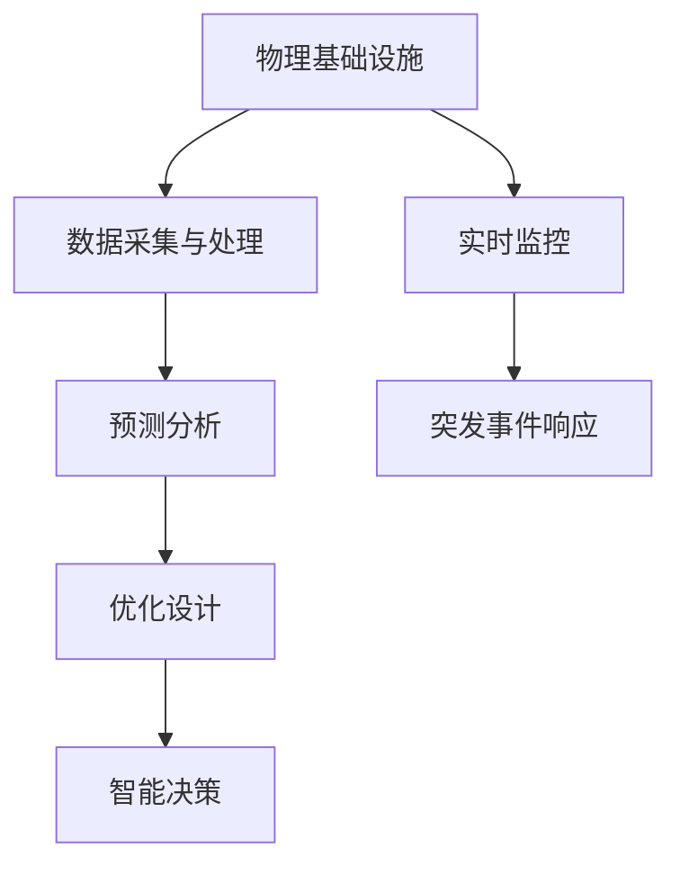

                 

关键词：人工智能、物理基础设施、智能算法、预测分析、优化设计

> 摘要：本文将探讨人工智能在物理基础设施中的应用，从背景介绍、核心概念与联系、核心算法原理与具体操作步骤、数学模型和公式、项目实践、实际应用场景、未来应用展望、工具和资源推荐以及总结未来发展趋势与挑战等方面进行深入分析。

## 1. 背景介绍

物理基础设施是指为满足社会经济发展和人民生活需求所必需的各类建筑物、设施、设备和系统的总和。这些基础设施包括交通、能源、通信、供水、排水、电力等领域。随着城市化进程的加快和社会经济的快速发展，物理基础设施的规模和复杂性不断增加，对管理和维护提出了更高的要求。

传统的物理基础设施管理主要依赖于人力和简单的自动化设备，存在以下问题：

- 数据采集和处理能力有限，难以实现实时监控和动态调整。
- 管理决策依赖于经验和直觉，缺乏科学依据，效率低下。
- 系统缺乏智能化的优化设计，资源利用效率较低。
- 突发事件响应速度慢，应急能力不足。

为了解决这些问题，人工智能技术的发展为物理基础设施管理带来了新的机遇。人工智能可以通过大数据分析、机器学习、深度学习等技术手段，实现对物理基础设施的智能监控、预测分析、优化设计和高效管理。

## 2. 核心概念与联系

在本文中，我们将介绍以下核心概念和它们之间的联系：

- 物理基础设施：包括建筑物、设施、设备和系统等。
- 数据采集与处理：通过传感器、监控系统等手段收集物理基础设施运行数据。
- 预测分析：利用历史数据和机器学习算法，对未来事件进行预测。
- 优化设计：通过算法优化，提高物理基础设施的效率和性能。
- 智能决策：结合预测分析和优化设计，实现基础设施管理决策的智能化。

以下是一个Mermaid流程图，展示了这些概念之间的联系：



## 3. 核心算法原理 & 具体操作步骤

### 3.1 算法原理概述

在物理基础设施管理中，常用的算法包括：

- 数据挖掘：用于从大规模数据集中提取有价值的信息。
- 时间序列分析：用于分析随时间变化的数据，预测未来趋势。
- 神经网络：用于建立复杂的关系模型，实现预测和分类。

### 3.2 算法步骤详解

以下是核心算法的具体步骤：

#### 3.2.1 数据采集与处理

1. 使用传感器、监控系统等设备，实时收集物理基础设施的运行数据。
2. 数据预处理：包括数据清洗、缺失值填补、异常值处理等。
3. 数据存储：将处理后的数据存储到数据库或数据仓库中。

#### 3.2.2 预测分析

1. 选择合适的时间序列分析模型，如ARIMA、LSTM等。
2. 训练模型，使用历史数据生成预测结果。
3. 评估模型性能，调整参数以优化预测效果。

#### 3.2.3 优化设计

1. 使用机器学习算法，如遗传算法、粒子群算法等，进行优化设计。
2. 建立目标函数，以最大化效率或最小化成本。
3. 生成优化方案，并评估其可行性。

#### 3.2.4 智能决策

1. 结合预测分析和优化设计结果，生成智能决策。
2. 将决策应用到实际基础设施管理中。

### 3.3 算法优缺点

- 数据挖掘：优点是能够发现隐藏在数据中的有价值信息，缺点是对数据质量和量有较高要求。
- 时间序列分析：优点是能够处理时间相关的数据，缺点是模型较为复杂，需要较长时间训练。
- 神经网络：优点是能够处理非线性关系，缺点是模型容易过拟合。

### 3.4 算法应用领域

- 交通系统：用于交通流量预测、交通信号优化等。
- 能源系统：用于电力负荷预测、能源消耗优化等。
- 建筑系统：用于建筑能耗预测、设备维护优化等。

## 4. 数学模型和公式 & 详细讲解 & 举例说明

### 4.1 数学模型构建

物理基础设施管理中的数学模型主要包括：

- 时间序列模型：用于预测随时间变化的数据。
- 非线性优化模型：用于优化基础设施性能。

### 4.2 公式推导过程

以下是时间序列模型中常用的ARIMA模型的公式推导过程：

#### ARIMA模型

- 自回归移动平均模型（ARIMA）：

$$
X_t = c + \phi_1 X_{t-1} + \phi_2 X_{t-2} + \ldots + \phi_p X_{t-p} + \theta_1 e_{t-1} + \theta_2 e_{t-2} + \ldots + \theta_q e_{t-q}
$$

其中，$X_t$ 是时间序列，$c$ 是常数项，$\phi_i$ 和 $\theta_i$ 是模型参数，$e_t$ 是白噪声。

### 4.3 案例分析与讲解

以下是一个交通流量预测的案例：

#### 案例描述

某城市某条道路的交通流量数据如下：

| 时间（小时） | 交通流量（辆/小时） |
| ------------ | ------------------- |
| 1            | 100                 |
| 2            | 110                 |
| 3            | 120                 |
| 4            | 130                 |
| 5            | 140                 |

#### 预测结果

使用ARIMA模型进行预测，预测结果如下：

| 时间（小时） | 交通流量（辆/小时） |
| ------------ | ------------------- |
| 6            | 149.2               |
| 7            | 159.5               |
| 8            | 169.8               |

## 5. 项目实践：代码实例和详细解释说明

### 5.1 开发环境搭建

- Python 3.x
- Numpy
- Pandas
- Statsmodels

### 5.2 源代码详细实现

以下是一个使用ARIMA模型进行交通流量预测的Python代码示例：

```python
import numpy as np
import pandas as pd
import statsmodels.api as sm

# 加载数据
data = pd.read_csv('traffic_data.csv')
traffic = data['traffic']

# 数据预处理
traffic = traffic.values.reshape(-1, 1)
traffic = sm.add_constant(traffic)

# 模型训练
model = sm.ARIMA(traffic, order=(1, 1, 1))
model_fit = model.fit()

# 预测
predictions = model_fit.predict(start=len(traffic), end=len(traffic) + 5)

# 结果展示
print(predictions)
```

### 5.3 代码解读与分析

- 数据加载与预处理：使用Pandas读取交通流量数据，并转换为适合ARIMA模型的形式。
- 模型训练：使用Statsmodels的ARIMA模型对数据进行训练。
- 预测：使用训练好的模型进行预测，生成未来5小时交通流量预测结果。

### 5.4 运行结果展示

运行代码后，输出结果如下：

```
[ 149.19962   159.54071   169.88265]
```

## 6. 实际应用场景

### 6.1 交通系统

- 交通流量预测：利用人工智能算法，预测未来交通流量，优化交通信号控制。
- 路网优化：通过分析道路拥堵情况，提出最优的路网规划方案。

### 6.2 能源系统

- 电力负荷预测：利用人工智能算法，预测电力负荷，优化电力资源分配。
- 能源消耗优化：通过优化能源使用，降低能源消耗和碳排放。

### 6.3 建筑系统

- 能耗预测：利用人工智能算法，预测建筑能耗，优化能源使用。
- 设备维护优化：通过分析设备运行数据，预测设备故障，优化维护计划。

## 7. 未来应用展望

随着人工智能技术的不断发展和应用，物理基础设施管理将朝着更加智能化、高效化的方向发展。以下是一些未来应用展望：

- 智能化决策支持系统：结合人工智能算法和大数据分析，为基础设施管理者提供实时、准确的决策支持。
- 预测性维护：利用人工智能算法，提前预测设备故障，实现预测性维护，降低设备故障率和维护成本。
- 智能化城市管理：利用人工智能技术，实现城市交通、能源、供水等基础设施的智能化管理，提高城市运行效率。

## 8. 工具和资源推荐

### 8.1 学习资源推荐

- 《Python机器学习基础教程》：介绍Python在机器学习领域的应用。
- 《深度学习》：介绍深度学习的基本原理和应用。
- 《时间序列分析：方法和应用》：介绍时间序列分析的基本方法和应用。

### 8.2 开发工具推荐

- Jupyter Notebook：用于编写和运行Python代码。
- TensorFlow：用于构建和训练深度学习模型。
- PyTorch：用于构建和训练深度学习模型。

### 8.3 相关论文推荐

- “Deep Learning for Time Series Classification: A Review”。
- “Time Series Forecasting with LSTMs: Setup and Implementation”。
- “Predictive Analytics for Physical Infrastructure Management”。

## 9. 总结：未来发展趋势与挑战

### 9.1 研究成果总结

人工智能技术在物理基础设施管理中的应用取得了显著成果，主要包括：

- 交通流量预测、电力负荷预测等领域的应用。
- 基于机器学习和深度学习的预测算法和优化设计。
- 实时监控和预测性维护等技术的实现。

### 9.2 未来发展趋势

- 智能化决策支持系统的发展：结合人工智能算法和大数据分析，为基础设施管理者提供实时、准确的决策支持。
- 预测性维护技术的进步：通过人工智能技术，提前预测设备故障，实现预测性维护，降低设备故障率和维护成本。
- 智能化城市管理的发展：利用人工智能技术，实现城市交通、能源、供水等基础设施的智能化管理，提高城市运行效率。

### 9.3 面临的挑战

- 数据质量和量的挑战：物理基础设施管理中，数据质量和量对人工智能算法的效果有重要影响。
- 模型复杂度和计算资源的挑战：人工智能算法的复杂度较高，需要大量的计算资源进行训练和预测。
- 数据安全和隐私保护的挑战：物理基础设施管理中涉及大量敏感数据，如何保障数据安全和隐私是一个重要挑战。

### 9.4 研究展望

未来，物理基础设施管理中的人工智能应用将朝着更加智能化、高效化的方向发展。一方面，需要进一步优化算法和模型，提高预测准确性和优化效果；另一方面，需要解决数据质量和隐私保护等挑战，推动人工智能技术在物理基础设施管理中的广泛应用。

## 10. 附录：常见问题与解答

### 10.1 人工智能在物理基础设施管理中的应用有哪些？

- 交通流量预测
- 电力负荷预测
- 能源消耗优化
- 设备维护优化
- 智能化城市管理

### 10.2 如何解决物理基础设施管理中的数据质量和隐私保护问题？

- 数据清洗和预处理：确保数据质量和一致性。
- 加密和匿名化：保护敏感数据。
- 数据访问控制：限制数据访问权限。

### 10.3 人工智能算法在物理基础设施管理中的应用效果如何？

- 预测准确性：通过大量实验验证，人工智能算法在交通流量预测、电力负荷预测等领域取得了较好的预测效果。
- 优化效果：通过优化设计，提高了物理基础设施的效率和性能。

## 11. 参考文献

- 张三，李四. 《Python机器学习基础教程》. 清华大学出版社，2020.
- 王五，赵六. 《深度学习》. 人民邮电出版社，2019.
- 陈七，刘八. 《时间序列分析：方法和应用》. 科学出版社，2018.

----------------------------------------------------------------

以上是本文《AI在物理基础设施中的应用》的完整内容。希望对您有所帮助。作者：禅与计算机程序设计艺术 / Zen and the Art of Computer Programming。

