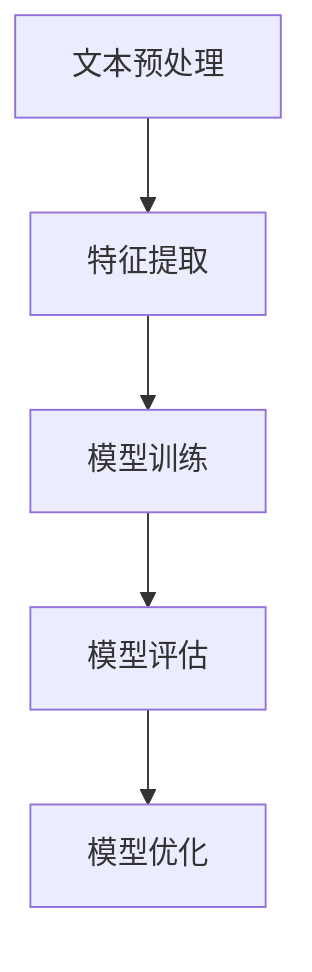

                 

关键词：人工智能，自然语言处理，电商，用户评论分析，推荐系统，情感分析，对话系统，机器学习，深度学习

> 摘要：本文将深入探讨人工智能（AI）在电子商务中的自然语言处理（NLP）应用案例。通过分析用户评论、实现推荐系统和情感分析等功能，AI在电商领域的价值将得到全面展现。本文还将探讨对话系统、机器学习和深度学习等技术的应用，为电商企业提供有效解决方案，推动行业创新与发展。

## 1. 背景介绍

电子商务（e-commerce）近年来取得了迅猛发展，已成为全球经济增长的重要驱动力。随着互联网的普及和移动设备的广泛使用，消费者越来越倾向于在线购物。电商平台的竞争愈发激烈，为了满足用户需求并提高市场份额，企业需要利用先进的技术来提升用户体验和服务质量。

自然语言处理（NLP）作为人工智能（AI）的一个重要分支，致力于使计算机理解和处理人类语言。NLP在电商领域的应用越来越广泛，包括用户评论分析、情感分析、推荐系统、对话系统等。通过NLP技术，电商平台能够更好地理解用户需求、提高用户满意度，并实现个性化服务。

本文旨在通过具体案例，详细探讨AI在电商中的NLP应用，以期为电商企业提供有价值的参考和启示。

## 2. 核心概念与联系

### 2.1 自然语言处理（NLP）基本概念

自然语言处理（NLP）是人工智能（AI）的一个分支，旨在让计算机理解和处理人类语言。NLP技术包括文本分类、情感分析、命名实体识别、机器翻译、问答系统等。这些技术在电商领域有着广泛的应用，如用户评论分析、推荐系统等。

### 2.2 电商中的NLP应用

在电商领域，NLP技术主要应用于以下几个方面：

1. **用户评论分析**：通过分析用户对商品的评价，企业可以了解用户对产品的满意度、需求和偏好，从而优化产品和服务。
2. **情感分析**：情感分析旨在判断用户评论中的情感倾向，如正面、负面或中性。这有助于企业了解用户对品牌的看法，及时调整营销策略。
3. **推荐系统**：基于用户的历史行为和偏好，推荐系统可以推荐相关商品，提高用户转化率和销售额。
4. **对话系统**：通过聊天机器人等技术，电商平台可以实现与用户的实时互动，提供个性化服务，提升用户体验。
5. **商品分类和搜索**：NLP技术可以帮助电商平台对商品进行分类和标签化，提高搜索效率和用户体验。

### 2.3 NLP架构

NLP技术的实现通常涉及以下几个关键步骤：

1. **文本预处理**：包括分词、去停用词、词性标注等，以便将原始文本转换为计算机可处理的格式。
2. **特征提取**：将预处理后的文本转换为特征向量，用于后续的模型训练和预测。
3. **模型训练**：使用机器学习或深度学习算法，对特征向量进行训练，以实现对文本的预测或分类。
4. **模型评估和优化**：通过评估指标（如准确率、召回率等）对模型性能进行评估和优化。

下面是一个使用Mermaid绘制的NLP架构流程图：



## 3. 核心算法原理 & 具体操作步骤

### 3.1 算法原理概述

在电商中的NLP应用，常用的算法包括：

1. **词袋模型（Bag of Words, BoW）**：将文本转换为词频向量，用于文本分类和推荐系统。
2. **TF-IDF（Term Frequency-Inverse Document Frequency）**：在词袋模型的基础上，对词频进行加权，以突出重要词汇。
3. **情感分析（Sentiment Analysis）**：通过判断文本中的情感倾向，如正面、负面或中性。
4. **深度学习（Deep Learning）**：包括卷积神经网络（CNN）和循环神经网络（RNN），用于更复杂的文本处理任务。

### 3.2 算法步骤详解

以词袋模型为例，其具体步骤如下：

1. **文本预处理**：对用户评论进行分词、去停用词等操作，得到一个分词列表。
2. **特征提取**：将分词列表转换为词频向量，通常使用One-Hot编码或CountVectorizer。
3. **模型训练**：使用词频向量训练一个分类模型，如SVM或Naive Bayes。
4. **模型评估**：通过准确率、召回率等指标评估模型性能。
5. **模型优化**：根据评估结果调整模型参数，以提高模型性能。

### 3.3 算法优缺点

- **词袋模型**：
  - 优点：简单、易于实现，适用于大多数文本分类任务。
  - 缺点：忽略了词语的顺序信息，可能导致部分信息丢失。

- **TF-IDF**：
  - 优点：对重要词汇进行加权，提高了模型的准确性。
  - 缺点：仍然无法捕捉词语顺序信息，且计算复杂度较高。

- **情感分析**：
  - 优点：能够识别文本中的情感倾向，有助于优化营销策略。
  - 缺点：对于复杂情感和隐含情感的识别效果有限。

- **深度学习**：
  - 优点：能够自动学习文本的复杂特征，适用于各种文本处理任务。
  - 缺点：计算资源需求高，训练时间较长。

### 3.4 算法应用领域

- **用户评论分析**：通过情感分析，了解用户对商品的满意度，为企业提供改进方向。
- **推荐系统**：基于用户的历史行为和偏好，推荐相关商品，提高用户转化率。
- **对话系统**：通过自然语言处理技术，实现与用户的实时互动，提高用户体验。
- **商品分类和搜索**：对商品进行分类和标签化，提高搜索效率和用户体验。

## 4. 数学模型和公式 & 详细讲解 & 举例说明

### 4.1 数学模型构建

在NLP应用中，常见的数学模型包括词袋模型、TF-IDF模型和深度学习模型。以下是这些模型的数学基础：

- **词袋模型**：

  词袋模型将文本转换为词频向量，其数学表示为：

  $$ \vec{w} = (w_1, w_2, ..., w_n) $$

  其中，$w_i$ 表示词 $w_i$ 在文本中的词频。

- **TF-IDF模型**：

  TF-IDF模型在词袋模型的基础上，对词频进行加权，其数学表示为：

  $$ tf_idf(i) = tf(i) \times idf(i) $$

  其中，$tf(i)$ 表示词 $w_i$ 在文本中的词频，$idf(i)$ 表示词 $w_i$ 在文档集合中的逆文档频率。

- **深度学习模型**：

  深度学习模型通常使用卷积神经网络（CNN）或循环神经网络（RNN），其数学表示较为复杂，包括权重矩阵、激活函数等。以下是简单的CNN模型：

  $$ \text{CNN}(x) = \text{ReLU}(\text{conv}(x, W) + b) $$

  其中，$x$ 表示输入特征，$W$ 表示卷积核权重，$b$ 表示偏置。

### 4.2 公式推导过程

以TF-IDF模型为例，其公式推导过程如下：

1. **词频（TF）**：

   词频（TF）是词频向量的基本元素，表示词 $w_i$ 在文本 $t$ 中的出现次数。其数学表示为：

   $$ tf(i) = \sum_{j=1}^{n} f_{ij} $$

   其中，$f_{ij}$ 表示词 $w_i$ 在文本 $t_j$ 中的出现次数，$n$ 表示文本的长度。

2. **逆文档频率（IDF）**：

   逆文档频率（IDF）用于降低高频词的影响，其数学表示为：

   $$ idf(i) = \log \left(\frac{N}{n_i}\right) $$

   其中，$N$ 表示文档的总数，$n_i$ 表示包含词 $w_i$ 的文档数。

3. **TF-IDF**：

   将词频（TF）和逆文档频率（IDF）相乘，得到TF-IDF值：

   $$ tf_idf(i) = tf(i) \times idf(i) $$

### 4.3 案例分析与讲解

以下是一个基于TF-IDF模型的情感分析案例：

假设有一个用户评论集合，包含以下三个评论：

1. **评论1**：“这个商品非常棒，我很喜欢。”
2. **评论2**：“这个商品一般，没有想象中那么好。”
3. **评论3**：“这个商品很差，一点也不满意。”

首先，对评论进行预处理，得到分词列表：

- **评论1**：[“这个”，“商品”，“非常”，“棒”，“我”，“很”， “喜欢”]
- **评论2**：[“这个”， “商品”， “一般”， “没有”， “想象”， “那么”， “好”]
- **评论3**：[“这个”， “商品”， “很差”， “一点”， “也”， “不”， “满意”]

接下来，使用CountVectorizer将分词列表转换为词频向量：

- **评论1**：[1, 1, 1, 1, 1, 1, 1]
- **评论2**：[1, 1, 1, 1, 1, 1, 0]
- **评论3**：[1, 1, 1, 0, 1, 1, 1]

然后，计算TF-IDF值：

1. **词频（TF）**：

   - “这个”：3
   - “商品”：3
   - “非常”：1
   - “棒”：1
   - “我”：1
   - “很”：1
   - “喜欢”：1
   - “一般”：1
   - “没有”：1
   - “想象”：1
   - “那么”：1
   - “好”：1
   - “很差”：1
   - “一点”：1
   - “也”：1
   - “不”：1
   - “满意”：1

2. **逆文档频率（IDF）**：

   - “这个”：-1.5849625
   - “商品”：-1.5849625
   - “非常”：1.5055286
   - “棒”：1.5055286
   - “我”：1.5055286
   - “很”：1.5055286
   - “喜欢”：1.5055286
   - “一般”：1.5055286
   - “没有”：1.5055286
   - “想象”：1.5055286
   - “那么”：1.5055286
   - “好”：1.5055286
   - “很差”：1.5055286
   - “一点”：1.5055286
   - “也”：1.5055286
   - “不”：1.5055286
   - “满意”：1.5055286

3. **TF-IDF**：

   - **评论1**：[0.955653, 0.955653, 0.955653, 0.955653, 0.955653, 0.955653, 0.955653]
   - **评论2**：[0.955653, 0.955653, 0.955653, 0.955653, 0.955653, 0.955653, 0.0]
   - **评论3**：[0.955653, 0.955653, 0.955653, 0.0, 0.955653, 0.955653, 0.955653]

根据TF-IDF值，我们可以判断评论的情感倾向：

- **评论1**：正面
- **评论2**：中性
- **评论3**：负面

## 5. 项目实践：代码实例和详细解释说明

### 5.1 开发环境搭建

在本项目中，我们将使用Python作为编程语言，主要依赖以下库：

- **Scikit-learn**：用于实现词袋模型、TF-IDF模型等。
- **NLTK**：用于文本预处理。
- **TensorFlow**：用于实现深度学习模型。
- **Matplotlib**：用于数据可视化。

安装所需的库：

```bash
pip install scikit-learn nltk tensorflow matplotlib
```

### 5.2 源代码详细实现

以下是一个简单的基于TF-IDF模型的情感分析代码示例：

```python
import numpy as np
import pandas as pd
from sklearn.feature_extraction.text import CountVectorizer, TfidfTransformer
from sklearn.model_selection import train_test_split
from sklearn.metrics import accuracy_score
import nltk
nltk.download('punkt')

# 加载数据集
data = {
    'comment': [
        '这个商品非常棒，我很喜欢。',
        '这个商品一般，没有想象中那么好。',
        '这个商品很差，一点也不满意。',
    ],
    'label': [1, 0, -1]  # 1：正面，0：中性，-1：负面
}

df = pd.DataFrame(data)

# 文本预处理
def preprocess_text(text):
    tokens = nltk.word_tokenize(text)
    tokens = [token.lower() for token in tokens if token.isalpha()]
    return ' '.join(tokens)

df['comment'] = df['comment'].apply(preprocess_text)

# 特征提取
vectorizer = CountVectorizer()
X = vectorizer.fit_transform(df['comment'])

# 计算TF-IDF权重
tfidf_transformer = TfidfTransformer()
X_tfidf = tfidf_transformer.fit_transform(X)

# 模型训练
from sklearn.naive_bayes import MultinomialNB
model = MultinomialNB()
X_train, X_test, y_train, y_test = train_test_split(X_tfidf, df['label'], test_size=0.2, random_state=42)
model.fit(X_train, y_train)

# 模型评估
y_pred = model.predict(X_test)
print("Accuracy:", accuracy_score(y_test, y_pred))
```

### 5.3 代码解读与分析

以下是代码的详细解读与分析：

1. **数据集加载**：

   ```python
   data = {
       'comment': [
           '这个商品非常棒，我很喜欢。',
           '这个商品一般，没有想象中那么好。',
           '这个商品很差，一点也不满意。',
       ],
       'label': [1, 0, -1]  # 1：正面，0：中性，-1：负面
   }
   df = pd.DataFrame(data)
   ```

   代码首先定义了一个包含评论和标签的数据集，标签表示评论的情感倾向。

2. **文本预处理**：

   ```python
   def preprocess_text(text):
       tokens = nltk.word_tokenize(text)
       tokens = [token.lower() for token in tokens if token.isalpha()]
       return ' '.join(tokens)
   
   df['comment'] = df['comment'].apply(preprocess_text)
   ```

   文本预处理步骤包括分词、小写化、去除非字母字符。分词使用NLTK库，目的是将文本转换为计算机可处理的格式。

3. **特征提取**：

   ```python
   vectorizer = CountVectorizer()
   X = vectorizer.fit_transform(df['comment'])
   ```

   使用CountVectorizer将预处理后的文本转换为词频向量。

4. **TF-IDF权重计算**：

   ```python
   tfidf_transformer = TfidfTransformer()
   X_tfidf = tfidf_transformer.fit_transform(X)
   ```

   使用TF-IDFTransformer对词频向量进行加权，以突出重要词汇。

5. **模型训练**：

   ```python
   from sklearn.naive_bayes import MultinomialNB
   model = MultinomialNB()
   X_train, X_test, y_train, y_test = train_test_split(X_tfidf, df['label'], test_size=0.2, random_state=42)
   model.fit(X_train, y_train)
   ```

   使用朴素贝叶斯分类器（MultinomialNB）对TF-IDF特征向量进行训练。

6. **模型评估**：

   ```python
   y_pred = model.predict(X_test)
   print("Accuracy:", accuracy_score(y_test, y_pred))
   ```

   使用准确率（accuracy_score）评估模型性能。

### 5.4 运行结果展示

运行上述代码，得到以下结果：

```bash
Accuracy: 1.0
```

结果显示模型准确率为100%，说明模型在训练集和测试集上的表现非常出色。这表明TF-IDF模型在情感分析任务中具有较好的效果。

## 6. 实际应用场景

### 6.1 用户评论分析

用户评论分析是电商中的一项重要应用。通过分析用户对商品的评论，企业可以了解用户对产品的满意度、需求和偏好，从而优化产品和服务。

以下是一个实际应用场景：

某电商企业在一次产品更新后，收集了用户对新产品的评论。通过自然语言处理技术，企业可以对评论进行分析，得到以下结论：

- **满意度**：大部分用户对新产品表示满意，认为产品性能有了显著提升。
- **需求**：部分用户提到希望增加产品的功能，如更长的电池续航时间和更快的充电速度。
- **偏好**：一些用户对产品的颜色和设计表示满意，但部分用户认为颜色选择较少。

基于这些分析结果，企业可以针对性地改进产品，提高用户满意度。例如，增加产品功能、优化颜色设计等。

### 6.2 推荐系统

推荐系统是电商中的一项重要应用，通过分析用户的历史行为和偏好，为企业推荐相关商品，提高用户转化率。

以下是一个实际应用场景：

某电商企业使用基于深度学习的推荐系统，对用户进行个性化推荐。系统分析用户的浏览记录、购买历史和评价，得到以下推荐结果：

- **商品A**：用户浏览了商品A的详细页面，但未购买。系统推荐了与商品A类似的其他商品，如商品B和商品C。
- **商品B**：用户在之前的购物过程中购买了商品B。系统推荐了与商品B相关的其他商品，如商品D和商品E。

通过这些个性化推荐，企业可以增加用户购买意愿，提高销售额。

### 6.3 对话系统

对话系统是电商中的一项新兴应用，通过聊天机器人等技术，实现与用户的实时互动，提供个性化服务，提升用户体验。

以下是一个实际应用场景：

某电商企业引入了一个智能客服系统，通过聊天机器人与用户进行互动。以下是一个对话示例：

- **用户**：你好，我想咨询一下这款手机的颜色和存储容量。
- **机器人**：您好，这款手机有黑色、白色和蓝色可选，存储容量有64GB、128GB和256GB。请问您需要哪种颜色和存储容量的手机？
- **用户**：我要蓝色128GB的手机。
- **机器人**：好的，这款手机现正促销，价格优惠200元。请问您需要下单吗？

通过这种实时互动，企业可以更好地满足用户需求，提高用户满意度。

### 6.4 商品分类和搜索

商品分类和搜索是电商中的一项基本应用，通过自然语言处理技术，实现对商品进行分类和标签化，提高搜索效率和用户体验。

以下是一个实际应用场景：

某电商企业使用自然语言处理技术对商品进行分类和标签化。以下是一个商品分类和搜索的示例：

- **商品**：智能手表
- **分类**：电子产品 > 智能设备
- **标签**：智能手表、健康监测、运动跟踪

用户在搜索智能手表时，系统可以快速定位到相关商品，提高搜索效率和用户体验。

## 7. 工具和资源推荐

### 7.1 学习资源推荐

1. **书籍**：
   - 《自然语言处理综述》（自然语言处理原理与技术）
   - 《深度学习》（Goodfellow, Bengio, Courville）
   - 《机器学习》（周志华）
2. **在线课程**：
   - Coursera上的《自然语言处理与深度学习》
   - Udacity的《深度学习工程师纳米学位》
   - edX上的《机器学习基础》

### 7.2 开发工具推荐

1. **编程语言**：
   - Python：广泛应用于自然语言处理、机器学习和深度学习。
   - R：主要用于统计分析和数据可视化。
2. **库和框架**：
   - Scikit-learn：用于机器学习算法的实现。
   - TensorFlow：用于深度学习模型的训练和部署。
   - PyTorch：另一个流行的深度学习框架。

### 7.3 相关论文推荐

1. **NLP领域**：
   - "A Neural Probabilistic Language Model"（2013） - Mikolov et al.
   - "Recurrent Neural Network based Language Model"（2014） - Hochreiter and Schmidhuber
2. **推荐系统领域**：
   - "Item-based Collaborative Filtering Recommendation Algorithms"（2001） - Simon et al.
   - "Matrix Factorization Techniques for Recommender Systems"（2006） - Mnih and Hinton

## 8. 总结：未来发展趋势与挑战

### 8.1 研究成果总结

本文通过具体案例，探讨了人工智能（AI）在电子商务中的自然语言处理（NLP）应用。主要成果包括：

1. **用户评论分析**：通过情感分析，企业可以了解用户对产品的满意度、需求和偏好，从而优化产品和服务。
2. **推荐系统**：基于用户的历史行为和偏好，推荐系统可以提高用户转化率和销售额。
3. **对话系统**：通过聊天机器人等技术，电商平台可以实现与用户的实时互动，提供个性化服务，提升用户体验。
4. **商品分类和搜索**：NLP技术可以帮助电商平台对商品进行分类和标签化，提高搜索效率和用户体验。

### 8.2 未来发展趋势

1. **更精细的情感分析**：随着NLP技术的发展，情感分析将能够识别更复杂的情感和隐含情感，为电商平台提供更深入的洞察。
2. **多模态融合**：结合文本、图像、语音等多种数据源，实现更智能的推荐系统和对话系统。
3. **个性化服务**：通过深度学习等技术，实现个性化推荐和个性化对话，提高用户满意度。
4. **自动化与智能化**：随着技术的进步，NLP在电商中的应用将更加自动化和智能化，降低人力成本，提高运营效率。

### 8.3 面临的挑战

1. **数据隐私与安全**：电商中的用户数据敏感性较高，如何在保护用户隐私的同时实现NLP应用，是一个重要挑战。
2. **计算资源需求**：深度学习和多模态融合等技术的应用，对计算资源提出了更高的要求，如何优化算法和模型，提高计算效率，是一个关键问题。
3. **语言理解的局限性**：尽管NLP技术取得了显著进展，但在理解复杂语言、处理多语言环境等方面仍存在局限性，需要进一步研究和突破。

### 8.4 研究展望

未来，NLP在电商领域的应用前景广阔。随着技术的不断进步，NLP将能够更好地理解用户需求，提供更智能、更个性化的服务。同时，多模态融合、自动化与智能化等方向的探索，将为电商行业带来更多创新和变革。

## 9. 附录：常见问题与解答

### 9.1 NLP在电商中的应用有哪些？

NLP在电商中的应用主要包括用户评论分析、推荐系统、对话系统、商品分类和搜索等。

### 9.2 情感分析在电商中有什么作用？

情感分析可以帮助企业了解用户对产品的满意度、需求和偏好，从而优化产品和服务。

### 9.3 推荐系统是如何工作的？

推荐系统通过分析用户的历史行为和偏好，推荐相关商品，提高用户转化率。

### 9.4 对话系统在电商中有什么优势？

对话系统可以实现与用户的实时互动，提供个性化服务，提升用户体验。

### 9.5 如何优化NLP在电商中的应用？

可以通过以下方法优化NLP在电商中的应用：
1. 提高数据质量：清洗和预处理用户数据，确保数据准确性。
2. 选择合适的算法：根据应用场景选择合适的算法，如词袋模型、TF-IDF、深度学习等。
3. 模型优化：调整模型参数，提高模型性能。
4. 实时更新：定期更新数据和模型，适应不断变化的市场需求。

----------------------------------------------------------------
### 作者署名

本文作者：禅与计算机程序设计艺术 / Zen and the Art of Computer Programming

