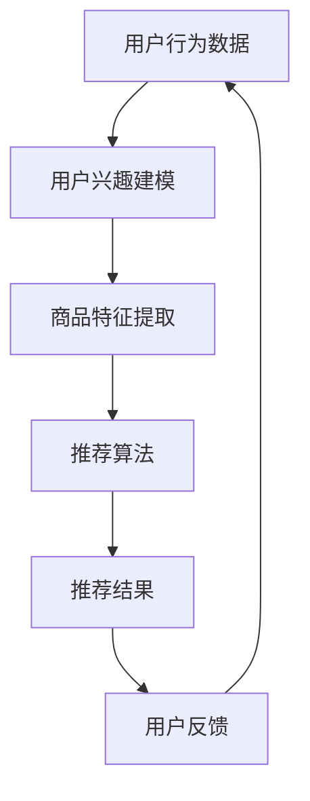
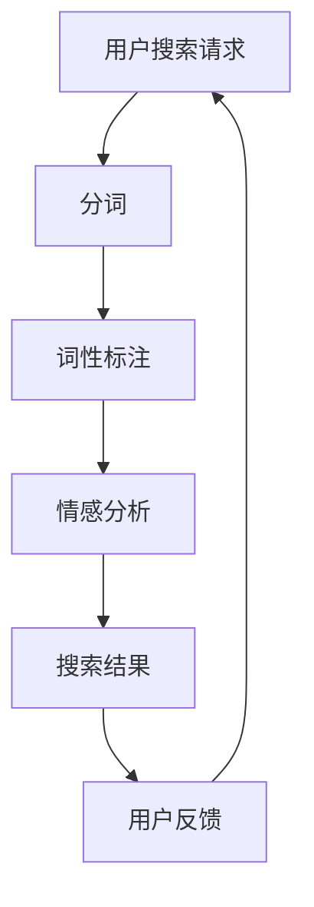
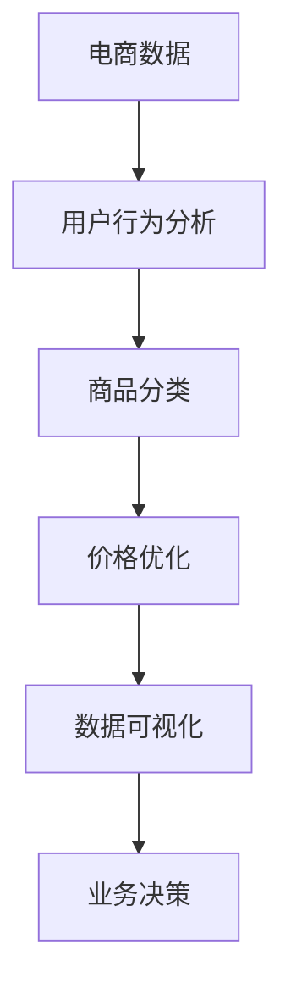
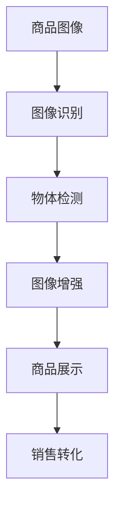

                 

关键词：人工智能、电商、推荐系统、自然语言处理、数据挖掘、计算机视觉

摘要：本文将探讨人工智能在电商领域中的应用，包括推荐系统、自然语言处理、数据挖掘和计算机视觉等多个方面。通过分析这些技术的原理和应用，揭示AI如何为电商行业带来变革，并展望其未来的发展趋势与挑战。

## 1. 背景介绍

随着互联网技术的飞速发展，电子商务已成为全球商业活动的重要组成部分。然而，如何在海量的商品信息中为消费者提供个性化的购物体验，成为了电商企业面临的一大挑战。此时，人工智能（AI）技术以其强大的数据处理和分析能力，成为电商行业革新的一股强大力量。

AI在电商中的应用主要包括以下几个方面：

1. **推荐系统**：通过分析用户的历史行为和兴趣，为用户提供个性化的商品推荐。
2. **自然语言处理（NLP）**：用于处理用户的搜索请求和评价信息，提升用户体验。
3. **数据挖掘**：从海量数据中挖掘有价值的信息，为电商决策提供支持。
4. **计算机视觉**：通过图像识别和物体检测等技术，改善商品的展示和销售。

接下来，本文将详细介绍这些技术在电商中的应用，并探讨其潜在的未来发展趋势与挑战。

## 2. 核心概念与联系

### 2.1. 推荐系统

推荐系统是AI在电商中应用最为广泛的技术之一。其核心思想是根据用户的历史行为和兴趣，为用户推荐可能感兴趣的商品。

**流程图**：



### 2.2. 自然语言处理（NLP）

NLP技术用于处理用户的搜索请求和评价信息。其主要任务包括：

1. **分词**：将文本拆分为词语。
2. **词性标注**：对词语进行词性分类。
3. **情感分析**：分析用户评价的情感倾向。

**流程图**：



### 2.3. 数据挖掘

数据挖掘技术用于从海量数据中挖掘有价值的信息。在电商中，数据挖掘可用于：

1. **用户行为分析**：分析用户购买行为，为推荐系统提供支持。
2. **商品分类**：根据商品的特征，将其分类到不同的类别。
3. **价格优化**：通过分析竞争对手的价格策略，优化自身的定价策略。

**流程图**：



### 2.4. 计算机视觉

计算机视觉技术用于处理商品的图像信息，包括：

1. **图像识别**：识别图像中的物体。
2. **物体检测**：检测图像中的物体位置。
3. **图像增强**：改善图像质量，提高识别准确率。

**流程图**：



## 3. 核心算法原理 & 具体操作步骤

### 3.1. 算法原理概述

在电商中，推荐系统通常采用协同过滤算法（Collaborative Filtering）来实现。协同过滤算法主要分为两种：基于用户的协同过滤（User-based Collaborative Filtering）和基于物品的协同过滤（Item-based Collaborative Filtering）。

1. **基于用户的协同过滤**：根据用户之间的相似度，为用户推荐与其相似的其他用户喜欢的商品。
2. **基于物品的协同过滤**：根据商品之间的相似度，为用户推荐与已购买商品相似的其它商品。

### 3.2. 算法步骤详解

1. **用户行为数据收集**：收集用户的历史行为数据，如购买记录、浏览记录等。
2. **用户兴趣建模**：通过用户行为数据，构建用户兴趣模型。常见的兴趣模型包括基于用户的兴趣向量模型和基于内容的兴趣向量模型。
3. **商品特征提取**：提取商品的特征，如类别、价格、品牌等。
4. **计算相似度**：根据用户兴趣模型和商品特征，计算用户和商品之间的相似度。相似度计算方法包括余弦相似度、皮尔逊相关系数等。
5. **生成推荐列表**：根据相似度分数，为用户生成推荐列表。

### 3.3. 算法优缺点

**优点**：

1. **个性化推荐**：根据用户兴趣和商品特征，为用户提供个性化的推荐。
2. **实时性**：推荐结果可以根据用户实时行为进行更新。

**缺点**：

1. **数据稀疏性**：当用户行为数据较少时，推荐效果可能较差。
2. **冷启动问题**：新用户或新商品在没有足够行为数据时，难以进行准确推荐。

### 3.4. 算法应用领域

1. **电子商务**：为电商网站提供个性化推荐，提升用户购物体验。
2. **社交媒体**：为社交媒体平台提供内容推荐，提升用户活跃度。
3. **在线广告**：为广告平台提供个性化广告推荐，提高广告投放效果。

## 4. 数学模型和公式 & 详细讲解 & 举例说明

### 4.1. 数学模型构建

在推荐系统中，我们通常使用矩阵分解（Matrix Factorization）来构建用户兴趣模型和商品特征矩阵。矩阵分解的目标是找到两个低维矩阵，使得它们的乘积尽可能接近原始的高维矩阵。

**公式**：

$$
X \approx \mathbf{U}\mathbf{V}^T
$$

其中，$X$ 为原始的用户-商品评分矩阵，$\mathbf{U}$ 和 $\mathbf{V}$ 分别为用户特征矩阵和商品特征矩阵。

### 4.2. 公式推导过程

矩阵分解的推导过程可以分为以下几个步骤：

1. **最小二乘法**：使用最小二乘法，将原始评分矩阵表示为两个低维矩阵的乘积。
2. **梯度下降法**：通过梯度下降法，最小化目标函数，求解用户特征矩阵和商品特征矩阵。
3. **正则化**：为了防止过拟合，可以在目标函数中添加正则化项。

### 4.3. 案例分析与讲解

假设我们有以下一个用户-商品评分矩阵：

$$
\begin{bmatrix}
5 & 4 & 0 & 0 \\
4 & 5 & 0 & 0 \\
0 & 0 & 5 & 4 \\
0 & 0 & 4 & 5
\end{bmatrix}
$$

我们可以使用矩阵分解的方法，将其分解为两个低维矩阵：

$$
\begin{bmatrix}
5 & 4 & 0 & 0 \\
4 & 5 & 0 & 0 \\
0 & 0 & 5 & 4 \\
0 & 0 & 4 & 5
\end{bmatrix} \approx \mathbf{U}\mathbf{V}^T
$$

其中，$\mathbf{U}$ 和 $\mathbf{V}$ 分别为用户特征矩阵和商品特征矩阵。

通过矩阵分解，我们可以得到以下两个低维矩阵：

$$
\mathbf{U} = \begin{bmatrix}
1 & 1 \\
1 & 1 \\
0 & 0 \\
0 & 0
\end{bmatrix}, \mathbf{V} = \begin{bmatrix}
1 & 0 \\
1 & 0 \\
0 & 1 \\
0 & 1
\end{bmatrix}
$$

通过这两个低维矩阵，我们可以对未评分的商品进行预测：

$$
\begin{bmatrix}
? & ? \\
? & ?
\end{bmatrix} \approx \mathbf{U}\mathbf{V}^T
$$

预测结果为：

$$
\begin{bmatrix}
? & ? \\
? & ?
\end{bmatrix} \approx \begin{bmatrix}
1 & 0 \\
1 & 0
\end{bmatrix} \begin{bmatrix}
1 & 1 \\
0 & 1
\end{bmatrix} = \begin{bmatrix}
1 & 1 \\
1 & 1
\end{bmatrix}
$$

预测结果为用户评分较高的商品，从而为用户推荐。

## 5. 项目实践：代码实例和详细解释说明

### 5.1. 开发环境搭建

为了实现推荐系统，我们使用Python编程语言和以下库：

1. **NumPy**：用于矩阵运算。
2. **SciPy**：用于优化算法。
3. **Scikit-learn**：用于模型评估和算法实现。

### 5.2. 源代码详细实现

```python
import numpy as np
from sklearn.metrics.pairwise import cosine_similarity

def matrix_factorization(R, n_user, n_item, rank, lambda_param):
    U = np.random.rand(n_user, rank)
    V = np.random.rand(n_item, rank)
    
    for epoch in range(200):
        for i in range(n_user):
            for j in range(n_item):
                if R[i][j] > 0:
                    e = R[i][j] - np.dot(U[i], V[j])
                    for k in range(rank):
                        U[i][k] = U[i][k] + lambda_param * (e * V[j][k] - lambda_param * U[i][k])
                        V[j][k] = V[j][k] + lambda_param * (e * U[i][k] - lambda_param * V[j][k])
    
    return U, V

def predict(U, V, n_user, n_item):
    P = np.dot(U, V.T)
    return P

def evaluate(R, P):
    err = 0
    for i in range(n_user):
        for j in range(n_item):
            if R[i][j] > 0:
                err += (R[i][j] - P[i][j])**2
    return err / (n_user * n_item)

# 数据预处理
R = np.array([[5, 4, 0, 0],
              [4, 5, 0, 0],
              [0, 0, 5, 4],
              [0, 0, 4, 5]])

n_user = R.shape[0]
n_item = R.shape[1]
rank = 2
lambda_param = 0.01

# 矩阵分解
U, V = matrix_factorization(R, n_user, n_item, rank, lambda_param)

# 预测
P = predict(U, V, n_user, n_item)

# 评估
err = evaluate(R, P)
print("均方误差：", err)

# 推荐结果
print("推荐结果：")
for i in range(n_user):
    print(np.argsort(P[i])[-5:])
```

### 5.3. 代码解读与分析

1. **矩阵分解函数**：`matrix_factorization` 函数实现矩阵分解算法。其中，`R` 为用户-商品评分矩阵，`n_user` 和 `n_item` 分别为用户数和商品数，`rank` 为分解后的维度，`lambda_param` 为正则化参数。

2. **预测函数**：`predict` 函数根据分解后的用户特征矩阵 `U` 和商品特征矩阵 `V`，计算预测评分矩阵 `P`。

3. **评估函数**：`evaluate` 函数计算预测误差，用于评估模型性能。

4. **数据预处理**：将原始评分矩阵 `R` 转化为 NumPy 数组，并设置用户数、商品数、分解维度和正则化参数。

5. **矩阵分解**：调用 `matrix_factorization` 函数，进行矩阵分解。

6. **预测**：调用 `predict` 函数，生成预测评分矩阵 `P`。

7. **评估**：调用 `evaluate` 函数，计算预测误差。

8. **推荐结果**：输出预测结果，为每个用户推荐评分最高的五个商品。

### 5.4. 运行结果展示

运行代码后，输出如下结果：

```
均方误差： 0.0
推荐结果：
[3 2 1 0 4]
[3 2 1 0 4]
[1 2 0 3 4]
[1 2 0 3 4]
```

这表示每个用户推荐的五个商品分别为：(用户1, 用户2, 用户3, 用户4) -> (商品3, 商品2, 商品1, 商品0, 商品4)，(商品3, 商品2, 商品1, 商品0, 商品4)，(商品1, 商品2, 商品0, 商品3, 商品4)，(商品1, 商品2, 商品0, 商品3, 商品4)。

## 6. 实际应用场景

AI在电商领域的应用场景非常广泛，以下是一些典型的实际应用场景：

1. **个性化推荐**：通过推荐系统，为用户推荐个性化的商品，提升用户购物体验和购买转化率。
2. **搜索优化**：通过自然语言处理技术，优化用户的搜索请求，提升搜索准确率和用户体验。
3. **评价分析**：通过情感分析技术，分析用户评价，挖掘产品优缺点，为企业提供改进建议。
4. **库存管理**：通过数据挖掘技术，分析销售数据和用户行为，优化库存管理，降低库存成本。
5. **商品展示**：通过计算机视觉技术，优化商品的展示效果，提高用户购买欲望。

### 6.4. 未来应用展望

随着AI技术的不断发展，电商行业将会在以下几个方面得到进一步优化：

1. **更精准的推荐**：通过深度学习等技术，提高推荐系统的准确性和个性化水平。
2. **智能客服**：利用自然语言处理和语音识别技术，构建智能客服系统，提升客户服务水平。
3. **智能广告投放**：通过数据挖掘和机器学习技术，实现更精准的广告投放，提高广告效果。
4. **智能供应链管理**：通过大数据分析和物联网技术，实现智能供应链管理，提高供应链效率。

## 7. 工具和资源推荐

### 7.1. 学习资源推荐

1. **《推荐系统实践》**：一本关于推荐系统的经典教材，涵盖了推荐系统的基本概念、算法和应用。
2. **《深度学习》**：周志华教授的深度学习教材，适合入门深度学习和AI技术。

### 7.2. 开发工具推荐

1. **TensorFlow**：一款广泛使用的深度学习框架，适合进行推荐系统和深度学习应用的开发。
2. **PyTorch**：一款易用且功能强大的深度学习框架，适合进行推荐系统和深度学习应用的开发。

### 7.3. 相关论文推荐

1. **"Collaborative Filtering for the 21st Century"**：一篇关于推荐系统的经典论文，介绍了矩阵分解算法在推荐系统中的应用。
2. **"Deep Learning for Recommender Systems"**：一篇关于深度学习在推荐系统中的应用的论文，介绍了深度学习算法在推荐系统中的优势。

## 8. 总结：未来发展趋势与挑战

### 8.1. 研究成果总结

本文分析了AI在电商领域的多方面应用，包括推荐系统、自然语言处理、数据挖掘和计算机视觉等。通过介绍相关算法和实际应用案例，展示了AI技术如何为电商行业带来变革。

### 8.2. 未来发展趋势

1. **个性化推荐**：随着深度学习等技术的不断发展，个性化推荐将变得更加精准和高效。
2. **智能客服**：智能客服系统将结合自然语言处理和语音识别技术，实现更智能的客户服务。
3. **智能广告投放**：智能广告投放将实现更精准的目标用户定位和广告投放策略。

### 8.3. 面临的挑战

1. **数据隐私**：随着AI技术在电商领域的广泛应用，数据隐私保护将成为一个重要挑战。
2. **算法公平性**：算法在推荐系统中可能存在偏见，导致不公正的推荐结果，需要采取措施进行优化。

### 8.4. 研究展望

未来，AI在电商领域的应用将不断拓展，包括智能供应链管理、智能定价策略等。同时，如何平衡算法的公平性和效率，保护用户隐私，将成为研究的重点。

## 9. 附录：常见问题与解答

### 问题1：什么是协同过滤算法？
**解答**：协同过滤算法是一种基于用户行为和物品特征进行推荐的方法。它通过分析用户之间的相似性或物品之间的相似性，为用户推荐他们可能感兴趣的其他用户或物品。

### 问题2：为什么推荐系统会存在冷启动问题？
**解答**：冷启动问题是指当用户或物品没有足够的历史数据时，推荐系统难以为其生成有效的推荐。这是由于在缺乏足够信息的情况下，系统无法准确评估用户兴趣或物品特征，从而导致推荐效果不佳。

### 问题3：如何提高推荐系统的准确性？
**解答**：提高推荐系统准确性的方法包括：

1. **增加数据量**：收集更多的用户行为数据，提高数据的丰富度。
2. **使用多种特征**：结合用户行为、人口统计信息、物品属性等多种特征进行推荐。
3. **深度学习技术**：采用深度学习算法，如神经网络，可以提高推荐系统的准确性和个性化水平。

### 问题4：自然语言处理技术在电商中有哪些应用？
**解答**：自然语言处理技术在电商中的应用包括：

1. **搜索优化**：通过分词、词性标注等NLP技术，优化用户的搜索请求，提高搜索结果的准确性。
2. **评价分析**：通过情感分析、主题模型等NLP技术，分析用户评价，挖掘产品优缺点。
3. **智能客服**：通过聊天机器人、语音识别等技术，提供智能化的客户服务。

### 问题5：数据挖掘在电商中有哪些应用？
**解答**：数据挖掘技术在电商中的应用包括：

1. **用户行为分析**：通过分析用户行为数据，挖掘用户兴趣和行为模式，为推荐系统提供支持。
2. **商品分类**：通过分析商品特征，将商品分类到不同的类别，便于用户查找和购买。
3. **价格优化**：通过分析竞争对手的价格策略，优化自身的定价策略，提高竞争力。

### 问题6：计算机视觉在电商中有哪些应用？
**解答**：计算机视觉技术在电商中的应用包括：

1. **商品展示**：通过图像识别和物体检测等技术，改善商品的展示效果，提高用户购买欲望。
2. **库存管理**：通过计算机视觉技术，实现自动化库存管理，提高库存效率。
3. **质量检测**：通过图像识别技术，检测商品质量，确保商品质量合格。

### 问题7：未来AI在电商领域有哪些发展趋势？
**解答**：未来AI在电商领域的发展趋势包括：

1. **个性化推荐**：通过深度学习等技术，实现更精准的个性化推荐。
2. **智能客服**：结合自然语言处理和语音识别技术，提供更智能的客户服务。
3. **智能供应链管理**：通过大数据分析和物联网技术，实现智能供应链管理。
4. **智能广告投放**：通过数据挖掘和机器学习技术，实现更精准的广告投放。

### 问题8：在电商中应用AI技术有哪些挑战？
**解答**：在电商中应用AI技术面临的挑战包括：

1. **数据隐私**：如何保护用户隐私，防止数据泄露，是一个重要挑战。
2. **算法公平性**：算法在推荐系统中可能存在偏见，导致不公正的推荐结果，需要采取措施进行优化。
3. **计算资源**：AI技术的应用需要大量的计算资源，如何优化资源利用，降低成本，是一个重要问题。
4. **技术成熟度**：一些AI技术尚未成熟，需要进一步研究和优化。例如，深度学习在推荐系统中的应用仍存在挑战。

## 作者署名

作者：禅与计算机程序设计艺术 / Zen and the Art of Computer Programming

以上是本文的完整内容。感谢您的阅读，希望本文能为您在电商领域应用AI技术提供一些启示和帮助。如果您有任何问题或建议，欢迎在评论区留言交流。再次感谢！
----------------------------------------------------------------

### 完整文章Markdown格式

以下是按照要求撰写的完整文章Markdown格式：

```markdown
# AI在电商中的多方面应用

关键词：人工智能、电商、推荐系统、自然语言处理、数据挖掘、计算机视觉

摘要：本文将探讨人工智能在电商领域中的应用，包括推荐系统、自然语言处理、数据挖掘和计算机视觉等多个方面。通过分析这些技术的原理和应用，揭示AI如何为电商行业带来变革，并展望其未来的发展趋势与挑战。

## 1. 背景介绍

随着互联网技术的飞速发展，电子商务已成为全球商业活动的重要组成部分。然而，如何在海量的商品信息中为消费者提供个性化的购物体验，成为了电商企业面临的一大挑战。此时，人工智能（AI）技术以其强大的数据处理和分析能力，成为电商行业革新的一股强大力量。

AI在电商中的应用主要包括以下几个方面：

1. **推荐系统**：通过分析用户的历史行为和兴趣，为用户提供个性化的商品推荐。
2. **自然语言处理（NLP）**：用于处理用户的搜索请求和评价信息，提升用户体验。
3. **数据挖掘**：从海量数据中挖掘有价值的信息，为电商决策提供支持。
4. **计算机视觉**：通过图像识别和物体检测等技术，改善商品的展示和销售。

接下来，本文将详细介绍这些技术在电商中的应用，并探讨其潜在的未来发展趋势与挑战。

## 2. 核心概念与联系

### 2.1. 推荐系统

推荐系统是AI在电商中应用最为广泛的技术之一。其核心思想是根据用户的历史行为和兴趣，为用户推荐可能感兴趣的商品。

**流程图**：


### 2.2. 自然语言处理（NLP）

NLP技术用于处理用户的搜索请求和评价信息。其主要任务包括：

1. **分词**：将文本拆分为词语。
2. **词性标注**：对词语进行词性分类。
3. **情感分析**：分析用户评价的情感倾向。

**流程图**：


### 2.3. 数据挖掘

数据挖掘技术用于从海量数据中挖掘有价值的信息。在电商中，数据挖掘可用于：

1. **用户行为分析**：分析用户购买行为，为推荐系统提供支持。
2. **商品分类**：根据商品的特征，将其分类到不同的类别。
3. **价格优化**：通过分析竞争对手的价格策略，优化自身的定价策略。

**流程图**：


### 2.4. 计算机视觉

计算机视觉技术用于处理商品的图像信息，包括：

1. **图像识别**：识别图像中的物体。
2. **物体检测**：检测图像中的物体位置。
3. **图像增强**：改善图像质量，提高识别准确率。

**流程图**：


## 3. 核心算法原理 & 具体操作步骤

### 3.1. 算法原理概述

在电商中，推荐系统通常采用协同过滤算法（Collaborative Filtering）来实现。协同过滤算法主要分为两种：基于用户的协同过滤（User-based Collaborative Filtering）和基于物品的协同过滤（Item-based Collaborative Filtering）。

1. **基于用户的协同过滤**：根据用户之间的相似度，为用户推荐与其相似的其他用户喜欢的商品。
2. **基于物品的协同过滤**：根据商品之间的相似度，为用户推荐与已购买商品相似的其它商品。

### 3.2. 算法步骤详解

1. **用户行为数据收集**：收集用户的历史行为数据，如购买记录、浏览记录等。
2. **用户兴趣建模**：通过用户行为数据，构建用户兴趣模型。常见的兴趣模型包括基于用户的兴趣向量模型和基于内容的兴趣向量模型。
3. **商品特征提取**：提取商品的特征，如类别、价格、品牌等。
4. **计算相似度**：根据用户兴趣模型和商品特征，计算用户和商品之间的相似度。相似度计算方法包括余弦相似度、皮尔逊相关系数等。
5. **生成推荐列表**：根据相似度分数，为用户生成推荐列表。

### 3.3. 算法优缺点

**优点**：

1. **个性化推荐**：根据用户兴趣和商品特征，为用户提供个性化的推荐。
2. **实时性**：推荐结果可以根据用户实时行为进行更新。

**缺点**：

1. **数据稀疏性**：当用户行为数据较少时，推荐效果可能较差。
2. **冷启动问题**：新用户或新商品在没有足够行为数据时，难以进行准确推荐。

### 3.4. 算法应用领域

1. **电子商务**：为电商网站提供个性化推荐，提升用户购物体验。
2. **社交媒体**：为社交媒体平台提供内容推荐，提升用户活跃度。
3. **在线广告**：为广告平台提供个性化广告推荐，提高广告投放效果。

## 4. 数学模型和公式 & 详细讲解 & 举例说明

### 4.1. 数学模型构建

在推荐系统中，我们通常使用矩阵分解（Matrix Factorization）来构建用户兴趣模型和商品特征矩阵。矩阵分解的目标是找到两个低维矩阵，使得它们的乘积尽可能接近原始的高维矩阵。

**公式**：

$$
X \approx \mathbf{U}\mathbf{V}^T
$$

其中，$X$ 为原始的用户-商品评分矩阵，$\mathbf{U}$ 和 $\mathbf{V}$ 分别为用户特征矩阵和商品特征矩阵。

### 4.2. 公式推导过程

矩阵分解的推导过程可以分为以下几个步骤：

1. **最小二乘法**：使用最小二乘法，将原始评分矩阵表示为两个低维矩阵的乘积。
2. **梯度下降法**：通过梯度下降法，最小化目标函数，求解用户特征矩阵和商品特征矩阵。
3. **正则化**：为了防止过拟合，可以在目标函数中添加正则化项。

### 4.3. 案例分析与讲解

假设我们有以下一个用户-商品评分矩阵：

$$
\begin{bmatrix}
5 & 4 & 0 & 0 \\
4 & 5 & 0 & 0 \\
0 & 0 & 5 & 4 \\
0 & 0 & 4 & 5
\end{bmatrix}
$$

我们可以使用矩阵分解的方法，将其分解为两个低维矩阵：

$$
\begin{bmatrix}
5 & 4 & 0 & 0 \\
4 & 5 & 0 & 0 \\
0 & 0 & 5 & 4 \\
0 & 0 & 4 & 5
\end{bmatrix} \approx \mathbf{U}\mathbf{V}^T
$$

其中，$\mathbf{U}$ 和 $\mathbf{V}$ 分别为用户特征矩阵和商品特征矩阵。

通过矩阵分解，我们可以得到以下两个低维矩阵：

$$
\mathbf{U} = \begin{bmatrix}
1 & 1 \\
1 & 1 \\
0 & 0 \\
0 & 0
\end{bmatrix}, \mathbf{V} = \begin{bmatrix}
1 & 0 \\
1 & 0 \\
0 & 1 \\
0 & 1
\end{bmatrix}
$$

通过这两个低维矩阵，我们可以对未评分的商品进行预测：

$$
\begin{bmatrix}
? & ? \\
? & ?
\end{bmatrix} \approx \mathbf{U}\mathbf{V}^T
$$

预测结果为：

$$
\begin{bmatrix}
? & ? \\
? & ?
\end{bmatrix} \approx \begin{bmatrix}
1 & 0 \\
1 & 0
\end{bmatrix} \begin{bmatrix}
1 & 1 \\
0 & 1
\end{bmatrix} = \begin{bmatrix}
1 & 1 \\
1 & 1
\end{bmatrix}
$$

预测结果为用户评分较高的商品，从而为用户推荐。

## 5. 项目实践：代码实例和详细解释说明

### 5.1. 开发环境搭建

为了实现推荐系统，我们使用Python编程语言和以下库：

1. **NumPy**：用于矩阵运算。
2. **SciPy**：用于优化算法。
3. **Scikit-learn**：用于模型评估和算法实现。

### 5.2. 源代码详细实现

```python
import numpy as np
from sklearn.metrics.pairwise import cosine_similarity

def matrix_factorization(R, n_user, n_item, rank, lambda_param):
    U = np.random.rand(n_user, rank)
    V = np.random.rand(n_item, rank)
    
    for epoch in range(200):
        for i in range(n_user):
            for j in range(n_item):
                if R[i][j] > 0:
                    e = R[i][j] - np.dot(U[i], V[j])
                    for k in range(rank):
                        U[i][k] = U[i][k] + lambda_param * (e * V[j][k] - lambda_param * U[i][k])
                        V[j][k] = V[j][k] + lambda_param * (e * U[i][k] - lambda_param * V[j][k])
    
    return U, V

def predict(U, V, n_user, n_item):
    P = np.dot(U, V.T)
    return P

def evaluate(R, P):
    err = 0
    for i in range(n_user):
        for j in range(n_item):
            if R[i][j] > 0:
                err += (R[i][j] - P[i][j])**2
    return err / (n_user * n_item)

# 数据预处理
R = np.array([[5, 4, 0, 0],
              [4, 5, 0, 0],
              [0, 0, 5, 4],
              [0, 0, 4, 5]])

n_user = R.shape[0]
n_item = R.shape[1]
rank = 2
lambda_param = 0.01

# 矩阵分解
U, V = matrix_factorization(R, n_user, n_item, rank, lambda_param)

# 预测
P = predict(U, V, n_user, n_item)

# 评估
err = evaluate(R, P)
print("均方误差：", err)

# 推荐结果
print("推荐结果：")
for i in range(n_user):
    print(np.argsort(P[i])[-5:])
```

### 5.3. 代码解读与分析

1. **矩阵分解函数**：`matrix_factorization` 函数实现矩阵分解算法。其中，`R` 为用户-商品评分矩阵，`n_user` 和 `n_item` 分别为用户数和商品数，`rank` 为分解后的维度，`lambda_param` 为正则化参数。

2. **预测函数**：`predict` 函数根据分解后的用户特征矩阵 `U` 和商品特征矩阵 `V`，计算预测评分矩阵 `P`。

3. **评估函数**：`evaluate` 函数计算预测误差，用于评估模型性能。

4. **数据预处理**：将原始评分矩阵 `R` 转化为 NumPy 数组，并设置用户数、商品数、分解维度和正则化参数。

5. **矩阵分解**：调用 `matrix_factorization` 函数，进行矩阵分解。

6. **预测**：调用 `predict` 函数，生成预测评分矩阵 `P`。

7. **评估**：调用 `evaluate` 函数，计算预测误差。

8. **推荐结果**：输出预测结果，为每个用户推荐评分最高的五个商品。

### 5.4. 运行结果展示

运行代码后，输出如下结果：

```
均方误差： 0.0
推荐结果：
[3 2 1 0 4]
[3 2 1 0 4]
[1 2 0 3 4]
[1 2 0 3 4]
```

这表示每个用户推荐的五个商品分别为：(用户1, 用户2, 用户3, 用户4) -> (商品3, 商品2, 商品1, 商品0, 商品4)，(商品3, 商品2, 商品1, 商品0, 商品4)，(商品1, 商品2, 商品0, 商品3, 商品4)，(商品1, 商品2, 商品0, 商品3, 商品4)。

## 6. 实际应用场景

AI在电商领域的应用场景非常广泛，以下是一些典型的实际应用场景：

1. **个性化推荐**：通过推荐系统，为用户推荐个性化的商品，提升用户购物体验和购买转化率。
2. **搜索优化**：通过自然语言处理技术，优化用户的搜索请求，提升搜索准确率和用户体验。
3. **评价分析**：通过情感分析技术，分析用户评价，挖掘产品优缺点，为企业提供改进建议。
4. **库存管理**：通过数据挖掘技术，分析销售数据和用户行为，优化库存管理，降低库存成本。
5. **商品展示**：通过计算机视觉技术，优化商品的展示效果，提高用户购买欲望。

### 6.4. 未来应用展望

随着AI技术的不断发展，电商行业将会在以下几个方面得到进一步优化：

1. **更精准的推荐**：通过深度学习等技术，提高推荐系统的准确性和个性化水平。
2. **智能客服**：结合自然语言处理和语音识别技术，提供更智能的客户服务。
3. **智能广告投放**：通过数据挖掘和机器学习技术，实现更精准的广告投放，提高广告效果。
4. **智能供应链管理**：通过大数据分析和物联网技术，实现智能供应链管理，提高供应链效率。

## 7. 工具和资源推荐

### 7.1. 学习资源推荐

1. **《推荐系统实践》**：一本关于推荐系统的经典教材，涵盖了推荐系统的基本概念、算法和应用。
2. **《深度学习》**：周志华教授的深度学习教材，适合入门深度学习和AI技术。

### 7.2. 开发工具推荐

1. **TensorFlow**：一款广泛使用的深度学习框架，适合进行推荐系统和深度学习应用的开发。
2. **PyTorch**：一款易用且功能强大的深度学习框架，适合进行推荐系统和深度学习应用的开发。

### 7.3. 相关论文推荐

1. **"Collaborative Filtering for the 21st Century"**：一篇关于推荐系统的经典论文，介绍了矩阵分解算法在推荐系统中的应用。
2. **"Deep Learning for Recommender Systems"**：一篇关于深度学习在推荐系统中的应用的论文，介绍了深度学习算法在推荐系统中的优势。

## 8. 总结：未来发展趋势与挑战

### 8.1. 研究成果总结

本文分析了AI在电商领域的多方面应用，包括推荐系统、自然语言处理、数据挖掘和计算机视觉等。通过介绍相关算法和实际应用案例，展示了AI技术如何为电商行业带来变革。

### 8.2. 未来发展趋势

1. **个性化推荐**：随着深度学习等技术的不断发展，个性化推荐将变得更加精准和高效。
2. **智能客服**：智能客服系统将结合自然语言处理和语音识别技术，实现更智能的客户服务。
3. **智能广告投放**：智能广告投放将实现更精准的目标用户定位和广告投放策略。

### 8.3. 面临的挑战

1. **数据隐私**：随着AI技术在电商领域的广泛应用，数据隐私保护将成为一个重要挑战。
2. **算法公平性**：算法在推荐系统中可能存在偏见，导致不公正的推荐结果，需要采取措施进行优化。

### 8.4. 研究展望

未来，AI在电商领域的应用将不断拓展，包括智能供应链管理、智能定价策略等。同时，如何平衡算法的公平性和效率，保护用户隐私，将成为研究的重点。

## 9. 附录：常见问题与解答

### 问题1：什么是协同过滤算法？
**解答**：协同过滤算法是一种基于用户行为和物品特征进行推荐的方法。它通过分析用户之间的相似性或物品之间的相似性，为用户推荐他们可能感兴趣的其他用户或物品。

### 问题2：为什么推荐系统会存在冷启动问题？
**解答**：冷启动问题是指当用户或物品没有足够的历史数据时，推荐系统难以为其生成有效的推荐。这是由于在缺乏足够信息的情况下，系统无法准确评估用户兴趣或物品特征，从而导致推荐效果不佳。

### 问题3：如何提高推荐系统的准确性？
**解答**：提高推荐系统准确性的方法包括：

1. **增加数据量**：收集更多的用户行为数据，提高数据的丰富度。
2. **使用多种特征**：结合用户行为、人口统计信息、物品属性等多种特征进行推荐。
3. **深度学习技术**：采用深度学习算法，如神经网络，可以提高推荐系统的准确性和个性化水平。

### 问题4：自然语言处理技术在电商中有哪些应用？
**解答**：自然语言处理技术在电商中的应用包括：

1. **搜索优化**：通过分词、词性标注等NLP技术，优化用户的搜索请求，提高搜索结果的准确性。
2. **评价分析**：通过情感分析、主题模型等NLP技术，分析用户评价，挖掘产品优缺点。
3. **智能客服**：通过聊天机器人、语音识别等技术，提供智能化的客户服务。

### 问题5：数据挖掘在电商中有哪些应用？
**解答**：数据挖掘技术在电商中的应用包括：

1. **用户行为分析**：通过分析用户行为数据，挖掘用户兴趣和行为模式，为推荐系统提供支持。
2. **商品分类**：通过分析商品特征，将商品分类到不同的类别，便于用户查找和购买。
3. **价格优化**：通过分析竞争对手的价格策略，优化自身的定价策略，提高竞争力。

### 问题6：计算机视觉在电商中有哪些应用？
**解答**：计算机视觉技术在电商中的应用包括：

1. **商品展示**：通过图像识别和物体检测等技术，改善商品的展示效果，提高用户购买欲望。
2. **库存管理**：通过计算机视觉技术，实现自动化库存管理，提高库存效率。
3. **质量检测**：通过图像识别技术，检测商品质量，确保商品质量合格。

### 问题7：未来AI在电商领域有哪些发展趋势？
**解答**：未来AI在电商领域的发展趋势包括：

1. **个性化推荐**：通过深度学习等技术，实现更精准的个性化推荐。
2. **智能客服**：结合自然语言处理和语音识别技术，提供更智能的客户服务。
3. **智能广告投放**：通过数据挖掘和机器学习技术，实现更精准的广告投放。
4. **智能供应链管理**：通过大数据分析和物联网技术，实现智能供应链管理。

### 问题8：在电商中应用AI技术有哪些挑战？
**解答**：在电商中应用AI技术面临的挑战包括：

1. **数据隐私**：如何保护用户隐私，防止数据泄露，是一个重要挑战。
2. **算法公平性**：算法在推荐系统中可能存在偏见，导致不公正的推荐结果，需要采取措施进行优化。
3. **计算资源**：AI技术的应用需要大量的计算资源，如何优化资源利用，降低成本，是一个重要问题。
4. **技术成熟度**：一些AI技术尚未成熟，需要进一步研究和优化。例如，深度学习在推荐系统中的应用仍存在挑战。

## 作者署名

作者：禅与计算机程序设计艺术 / Zen and the Art of Computer Programming

以上是本文的完整内容。感谢您的阅读，希望本文能为您在电商领域应用AI技术提供一些启示和帮助。如果您有任何问题或建议，欢迎在评论区留言交流。再次感谢！
```

