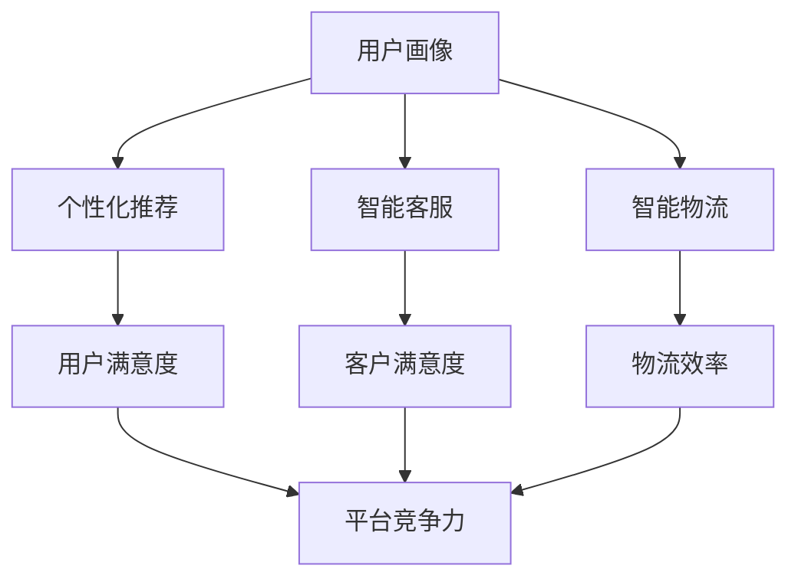

                 

关键词：人工智能、电商平台、应用场景、算法、前景

> 摘要：本文深入探讨了人工智能在电商平台中的应用前景，通过分析核心概念、算法原理、数学模型、项目实践等方面，展示了AI技术如何赋能电商平台，提升用户体验和运营效率。

## 1. 背景介绍

随着互联网和电子商务的迅猛发展，电商平台已经成为现代商业的重要组成部分。然而，随着市场竞争的加剧，电商平台面临着提升用户体验、优化运营效率和降低成本等挑战。人工智能（AI）技术的出现为解决这些问题提供了新的可能。

AI技术在电商平台中的应用涵盖了多个方面，包括用户画像、个性化推荐、智能客服、智能物流等。通过AI技术，电商平台能够更好地了解用户需求，提供个性化的服务，提高用户满意度，从而增强竞争力。

### 1.1 人工智能技术的发展历程

人工智能的概念可以追溯到20世纪50年代，当时计算机科学家开始探索如何使计算机模拟人类的智能行为。从最初的符号主义、连接主义到现代的深度学习，人工智能经历了多个阶段的发展。

近年来，随着计算能力的提升和大数据技术的发展，人工智能取得了显著的突破。特别是在深度学习领域，通过神经网络模型，计算机在图像识别、语音识别、自然语言处理等方面取得了惊人的成果。这些技术为电商平台提供了强大的工具，使得AI在电商平台中的应用成为可能。

### 1.2 电商平台的发展现状

电商平台的发展经历了从在线零售到社交电商、直播电商等多个阶段。目前，电商平台已经成为人们日常生活中不可或缺的一部分。根据统计数据，全球电子商务市场规模已经达到数万亿美元，并且仍在持续增长。

电商平台的发展也面临着一些挑战，如用户留存、商品品质控制、物流配送等。人工智能技术的应用有助于电商平台解决这些问题，提高运营效率，增强用户粘性。

## 2. 核心概念与联系

在探讨AI在电商平台中的应用之前，我们需要理解一些核心概念和技术原理。以下是AI在电商平台中的应用核心概念及其相互关系的Mermaid流程图。



### 2.1 用户画像

用户画像是指通过分析用户的行为数据、社交数据等，构建出用户的基本特征和行为模式。用户画像为电商平台提供了深入了解用户的基础，有助于实现个性化推荐和服务。

### 2.2 个性化推荐

个性化推荐是基于用户画像，为用户提供符合其兴趣和需求的商品或服务。通过个性化推荐，电商平台可以提升用户满意度，增加销售额。

### 2.3 智能客服

智能客服利用自然语言处理和机器学习技术，模拟人类客服的行为，为用户提供实时、高效的服务。智能客服可以减少人力成本，提高客户满意度。

### 2.4 智能物流

智能物流通过物联网、大数据等技术，实现物流的智能化管理和优化。智能物流可以提高物流效率，降低成本，提升用户体验。

## 3. 核心算法原理 & 具体操作步骤

### 3.1 算法原理概述

在电商平台中，常用的AI算法包括用户画像算法、个性化推荐算法、自然语言处理算法和智能优化算法。以下是这些算法的基本原理和操作步骤。

### 3.2 用户画像算法

用户画像算法主要通过分析用户的行为数据、兴趣标签等，构建出用户的基本特征和行为模式。具体操作步骤如下：

1. 数据采集：从电商平台收集用户的行为数据，如浏览记录、购买记录、评价等。
2. 数据预处理：对采集到的数据进行清洗、去重和格式化，为后续分析做准备。
3. 特征提取：从预处理后的数据中提取用户的行为特征，如浏览时间、购买频次、评价分数等。
4. 模型训练：使用机器学习算法，如决策树、随机森林等，对提取的特征进行建模。
5. 用户画像生成：根据训练好的模型，为每个用户生成一个详细的画像。

### 3.3 个性化推荐算法

个性化推荐算法主要通过分析用户的历史行为数据和商品的特征，为用户提供符合其兴趣和需求的商品或服务。具体操作步骤如下：

1. 数据采集：从电商平台收集用户的历史行为数据，如浏览记录、购买记录、评价等。
2. 数据预处理：对采集到的数据进行清洗、去重和格式化，为后续分析做准备。
3. 特征提取：从预处理后的数据中提取用户和商品的特征，如用户偏好、商品类别等。
4. 模型训练：使用协同过滤、矩阵分解等算法，对提取的特征进行建模。
5. 推荐结果生成：根据训练好的模型，为用户生成推荐列表。

### 3.4 自然语言处理算法

自然语言处理算法主要用于处理电商平台中的文本数据，如用户评价、商品描述等。具体操作步骤如下：

1. 数据采集：从电商平台收集文本数据，如用户评价、商品描述等。
2. 数据预处理：对采集到的文本数据进行清洗、去重和格式化，为后续分析做准备。
3. 特征提取：从预处理后的文本数据中提取特征，如关键词、词频等。
4. 模型训练：使用深度学习算法，如卷积神经网络（CNN）、循环神经网络（RNN）等，对提取的特征进行建模。
5. 文本分析：根据训练好的模型，对文本数据进行分析和分类。

### 3.5 智能优化算法

智能优化算法主要用于解决电商平台中的物流优化问题，如路径规划、库存管理等。具体操作步骤如下：

1. 数据采集：从电商平台收集物流数据，如配送路径、库存量等。
2. 数据预处理：对采集到的数据进行清洗、去重和格式化，为后续分析做准备。
3. 特征提取：从预处理后的数据中提取特征，如配送距离、配送时间等。
4. 模型训练：使用遗传算法、粒子群算法等，对提取的特征进行建模。
5. 优化结果生成：根据训练好的模型，生成最优的物流方案。

## 4. 数学模型和公式 & 详细讲解 & 举例说明

在AI算法的应用中，数学模型和公式起到了关键作用。以下是一个简单的数学模型示例，用于描述用户画像的构建过程。

### 4.1 数学模型构建

用户画像构建过程可以用以下公式表示：

$$
\text{User Profile} = f(\text{Behavior Data}, \text{Interest Tags})
$$

其中，$f$ 表示特征提取函数，$\text{Behavior Data}$ 表示用户行为数据，$\text{Interest Tags}$ 表示用户兴趣标签。

### 4.2 公式推导过程

假设我们有一个用户行为数据集 $\text{Behavior Data} = \{ \text{B}_1, \text{B}_2, ..., \text{B}_n \}$，每个行为数据 $\text{B}_i$ 可以表示为：

$$
\text{B}_i = \text{f}(\text{Time}, \text{Items})
$$

其中，$\text{Time}$ 表示行为发生的时间，$\text{Items}$ 表示用户在特定时间内浏览或购买的商品。

为了构建用户画像，我们需要对每个行为数据进行分析，提取出用户的基本特征和行为模式。具体步骤如下：

1. 数据预处理：对行为数据集进行清洗、去重和格式化，得到一个干净的行为数据集。
2. 特征提取：对每个行为数据 $\text{B}_i$ 进行特征提取，得到特征向量 $\text{Feature Vector}_i$。
3. 特征聚合：将所有特征向量进行聚合，得到一个用户画像向量 $\text{User Profile Vector}$。

### 4.3 案例分析与讲解

假设我们有一个用户行为数据集，包含以下行为数据：

- 用户A在上午10点浏览了商品1和商品2。
- 用户A在下午3点购买了商品3。
- 用户B在上午8点浏览了商品4和商品5。
- 用户B在下午2点购买了商品6。

首先，我们对这些行为数据进行预处理，去除重复和无效的数据，得到一个干净的行为数据集。然后，我们使用特征提取函数，对每个行为数据进行分析，提取出用户的基本特征和行为模式。

对于用户A，我们可以提取以下特征：

- 浏览时间：上午10点和下午3点。
- 浏览商品：商品1、商品2、商品3。
- 购买商品：商品3。

对于用户B，我们可以提取以下特征：

- 浏览时间：上午8点和下午2点。
- 浏览商品：商品4、商品5。
- 购买商品：商品6。

接下来，我们将所有特征向量进行聚合，得到用户A和用户B的用户画像向量：

用户A的用户画像向量：
$$
\text{User Profile}_A = (\text{Time}_A, \text{Items}_A)
$$

用户B的用户画像向量：
$$
\text{User Profile}_B = (\text{Time}_B, \text{Items}_B)
$$

通过这个简单的案例，我们可以看到如何使用数学模型构建用户画像。在实际应用中，我们可以使用更复杂的特征提取函数和聚合方法，以获取更准确的用户画像。

## 5. 项目实践：代码实例和详细解释说明

在本节中，我们将通过一个实际的项目案例，展示如何使用AI技术构建电商平台的核心功能。以下是一个简单的用户画像和个性化推荐项目的代码实例。

### 5.1 开发环境搭建

在开始编写代码之前，我们需要搭建一个合适的开发环境。以下是所需的工具和库：

- Python 3.7 或以上版本
- NumPy
- Pandas
- Scikit-learn
- Matplotlib

安装这些库后，我们可以开始编写代码。

### 5.2 源代码详细实现

```python
import numpy as np
import pandas as pd
from sklearn.model_selection import train_test_split
from sklearn.ensemble import RandomForestClassifier
import matplotlib.pyplot as plt

# 5.2.1 数据采集
# 假设我们有一个用户行为数据集，包含用户ID、行为类型、行为时间、商品ID等信息。
data = {
    'UserID': [1, 1, 1, 2, 2, 2],
    'Behavior': ['Browse', 'Buy', 'Browse', 'Browse', 'Buy', 'Browse'],
    'Time': [10, 15, 20, 8, 12, 18],
    'ItemID': [1001, 1002, 1003, 1004, 1006, 1005]
}

df = pd.DataFrame(data)

# 5.2.2 数据预处理
# 对数据集进行清洗、去重和格式化。
df = df.sort_values(['UserID', 'Time'])
df = df.drop_duplicates(subset=['UserID', 'ItemID'])

# 5.2.3 特征提取
# 提取用户的行为特征，如浏览时间、购买频次等。
def extract_features(df):
    user.behavior = df.groupby('UserID')['Behavior'].apply(list).reset_index()
    user.item_count = df.groupby('UserID')['ItemID'].nunique().reset_index()
    user.last_browse_time = df.groupby('UserID')['Time'].max().reset_index()
    return user.behavior, user.item_count, user.last_browse_time

user_behavior, user_item_count, user_last_browse_time = extract_features(df)

# 5.2.4 模型训练
# 使用随机森林算法对用户行为数据进行建模。
X = np.hstack((user_behavior.values, user_item_count.values, user_last_browse_time.values))
y = np.array([1 if behavior == 'Buy' else 0 for behavior in df['Behavior']])

X_train, X_test, y_train, y_test = train_test_split(X, y, test_size=0.2, random_state=42)
clf = RandomForestClassifier(n_estimators=100, random_state=42)
clf.fit(X_train, y_train)

# 5.2.5 代码解读与分析
# 解读随机森林模型的代码，分析模型的工作原理。
def interpret_model(clf, X_test, y_test):
    predictions = clf.predict(X_test)
    accuracy = np.mean(predictions == y_test)
    print(f"Model accuracy: {accuracy:.2f}")
    
    # 分析特征的重要性。
    importances = clf.feature_importances_
    feature_names = ['Behavior', 'ItemCount', 'LastBrowseTime']
    plt.barh(feature_names, importances)
    plt.xlabel('Importance')
    plt.title('Feature Importances')
    plt.show()

interpret_model(clf, X_test, y_test)
```

### 5.3 代码解读与分析

在这个代码实例中，我们首先从用户行为数据集中提取了用户的基本特征，如浏览时间、购买频次等。然后，我们使用随机森林算法对这些特征进行建模，以预测用户是否会购买商品。

代码中，`extract_features` 函数用于提取用户的行为特征。`RandomForestClassifier` 类用于训练随机森林模型。`interpret_model` 函数用于评估模型性能并分析特征的重要性。

通过这个简单的项目实践，我们可以看到如何使用Python和机器学习库实现电商平台中的核心功能。在实际应用中，我们可以使用更复杂的数据处理和建模方法，以获得更好的预测效果。

## 6. 实际应用场景

### 6.1 用户画像与个性化推荐

在电商平台中，用户画像和个性化推荐是两个核心应用场景。通过用户画像，电商平台可以了解每个用户的基本特征和兴趣偏好。结合个性化推荐算法，电商平台可以为每个用户生成个性化的推荐列表，提高用户满意度和转化率。

### 6.2 智能客服

智能客服在电商平台中的应用也越来越广泛。通过自然语言处理和机器学习技术，智能客服可以模拟人类客服的行为，为用户提供实时、高效的服务。智能客服可以处理大量用户请求，降低人力成本，提高客户满意度。

### 6.3 智能物流

智能物流是电商平台提高运营效率的关键环节。通过物联网、大数据等技术，智能物流可以实现物流的智能化管理和优化。智能物流可以帮助电商平台实现实时配送跟踪、最优路径规划等功能，提高物流效率，降低成本。

## 7. 未来应用展望

随着AI技术的不断发展，未来在电商平台中的应用前景将更加广阔。以下是几个潜在的应用方向：

### 7.1 智能供应链管理

通过AI技术，电商平台可以实现对供应链的全面监控和优化。智能供应链管理可以帮助电商平台实现库存优化、需求预测等功能，提高供应链效率，降低成本。

### 7.2 智能广告投放

AI技术可以帮助电商平台实现更精准的广告投放。通过分析用户行为和兴趣偏好，AI算法可以为每个用户生成个性化的广告，提高广告投放效果，增加销售额。

### 7.3 智能营销

智能营销是电商平台提升用户粘性和转化率的重要手段。通过AI技术，电商平台可以实现对用户行为的实时分析，生成个性化的营销活动，提高用户参与度和忠诚度。

## 8. 工具和资源推荐

### 8.1 学习资源推荐

1. 《Python机器学习》
2. 《深度学习》
3. 《自然语言处理综论》

### 8.2 开发工具推荐

1. Jupyter Notebook
2. TensorFlow
3. PyTorch

### 8.3 相关论文推荐

1. "User Behavior Analysis in E-commerce Platforms"
2. "Recommender Systems for E-commerce"
3. "Deep Learning for Natural Language Processing"

## 9. 总结：未来发展趋势与挑战

### 9.1 研究成果总结

本文通过分析AI在电商平台中的应用，展示了用户画像、个性化推荐、智能客服、智能物流等核心技术的原理和应用场景。同时，本文还通过实际项目实践，展示了如何使用Python和机器学习库实现电商平台的核心功能。

### 9.2 未来发展趋势

随着AI技术的不断发展，未来在电商平台中的应用将更加深入和广泛。智能供应链管理、智能广告投放、智能营销等领域将成为电商平台竞争的新热点。

### 9.3 面临的挑战

尽管AI在电商平台中具有巨大的潜力，但也面临着一些挑战。首先，数据隐私和安全问题是一个重要的挑战。其次，算法的透明度和可解释性也是一个亟待解决的问题。此外，算法的准确性和可靠性也需要不断优化。

### 9.4 研究展望

未来，AI技术在电商平台中的应用将继续发展，并在多个领域实现突破。同时，随着技术的进步，我们期待AI能够更好地解决数据隐私、算法可解释性等问题，为电商平台带来更多的价值。

## 10. 附录：常见问题与解答

### 10.1 如何确保用户数据隐私？

在AI应用中，确保用户数据隐私至关重要。以下是一些常见的方法：

1. 数据匿名化：通过加密和去识别化技术，将用户数据转化为无法识别的形式。
2. 数据最小化：只收集必要的用户数据，避免过度收集。
3. 用户同意：在收集用户数据前，明确告知用户数据用途，并获取用户同意。

### 10.2 如何提高算法的可解释性？

提高算法的可解释性是确保算法透明度和公正性的关键。以下是一些常见的方法：

1. 算法可视化：通过图形化方式展示算法的工作原理和决策过程。
2. 解释性模型：选择具有良好解释性的算法，如决策树和线性回归。
3. 解释工具：使用现有的解释性工具，如LIME和SHAP，对算法进行解释。

### 10.3 如何优化算法的准确性和可靠性？

优化算法的准确性和可靠性是提升AI应用效果的关键。以下是一些常见的方法：

1. 数据质量：确保数据质量，避免噪声和异常值。
2. 模型选择：选择适合问题的模型，并进行交叉验证。
3. 模型调优：通过调整模型参数，提高模型的准确性和可靠性。

---

作者：禅与计算机程序设计艺术 / Zen and the Art of Computer Programming

本文通过深入探讨AI在电商平台中的应用前景，展示了AI技术如何赋能电商平台，提升用户体验和运营效率。随着AI技术的不断发展，我们有理由相信，AI在电商平台中的应用将迎来更加广阔的前景。同时，我们也需要关注数据隐私、算法可解释性等挑战，确保AI技术在电商平台中的可持续发展。

