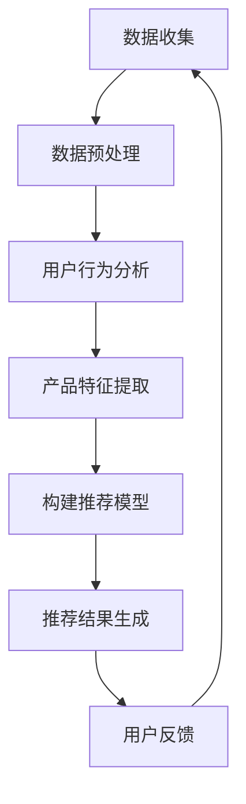

                 

关键词：人工智能，电商平台，产品推荐，机器学习，深度学习，协同过滤，用户行为分析

> 摘要：本文旨在探讨人工智能在电商平台产品推荐中的应用，通过分析用户行为数据和产品特征数据，利用机器学习和深度学习算法，构建高效的产品推荐系统，从而提升用户体验和销售额。

## 1. 背景介绍

随着互联网的快速发展，电商平台已经成为消费者购买商品的主要渠道之一。然而，在庞大的商品库中，如何让用户快速找到自己感兴趣的商品成为了电商平台的痛点。此时，基于人工智能的产品推荐系统应运而生，它通过分析用户的行为数据、购买历史、兴趣偏好等信息，为用户推荐个性化的商品，从而提高用户满意度和购买转化率。

电商平台产品推荐的重要性不言而喻。首先，它能够提升用户体验，让用户在浏览商品时能够快速找到自己感兴趣的产品；其次，它有助于提高销售额，通过个性化推荐，用户更可能购买推荐的商品；最后，它能够优化库存管理，减少商品滞销的风险。

## 2. 核心概念与联系

在构建电商平台产品推荐系统时，我们需要理解以下几个核心概念：

### 2.1 用户行为数据

用户行为数据包括用户的浏览历史、搜索记录、购买历史、评价和反馈等。这些数据反映了用户对商品的喜好和需求，是构建推荐系统的重要基础。

### 2.2 产品特征数据

产品特征数据包括商品的价格、品牌、类别、库存量、用户评分等。这些数据描述了商品的基本属性，也是推荐系统中重要的参考因素。

### 2.3 机器学习与深度学习

机器学习和深度学习是构建推荐系统的核心技术。机器学习算法通过对用户行为数据和产品特征数据进行训练，建立用户与商品之间的关联模型。而深度学习算法则通过更复杂的神经网络结构，进一步挖掘用户和商品之间的潜在关系。

### 2.4 推荐算法

推荐算法是推荐系统的核心，常见的推荐算法有基于协同过滤、基于内容的推荐和混合推荐等。协同过滤算法通过分析用户的行为数据，找出相似的用户或商品，为用户推荐相似的商品。基于内容的推荐算法则通过分析商品的特征数据，为用户推荐具有相似属性的物品。混合推荐算法结合了协同过滤和基于内容的推荐，综合挖掘用户和商品的多维度信息。

以下是构建电商平台产品推荐系统的 Mermaid 流程图：



## 3. 核心算法原理 & 具体操作步骤

### 3.1 算法原理概述

在构建电商平台产品推荐系统时，我们主要采用以下几种算法：

1. **协同过滤算法**：通过分析用户的行为数据，找出相似的用户或商品，为用户推荐相似的商品。
2. **基于内容的推荐算法**：通过分析商品的特征数据，为用户推荐具有相似属性的物品。
3. **混合推荐算法**：结合协同过滤和基于内容的推荐，综合挖掘用户和商品的多维度信息。

### 3.2 算法步骤详解

1. **数据收集**：收集用户的行为数据和商品特征数据。
2. **数据预处理**：对数据进行清洗、去重、缺失值填充等处理。
3. **用户行为分析**：通过分析用户的浏览历史、搜索记录、购买历史等数据，找出用户的兴趣偏好。
4. **产品特征提取**：对商品的价格、品牌、类别、库存量、用户评分等数据进行提取和预处理。
5. **构建推荐模型**：选择合适的推荐算法，如协同过滤、基于内容的推荐或混合推荐，构建推荐模型。
6. **推荐结果生成**：根据用户的行为数据和商品特征数据，生成个性化推荐结果。
7. **用户反馈**：收集用户对推荐结果的反馈，用于优化推荐模型。

### 3.3 算法优缺点

**协同过滤算法**：

- 优点：能够根据用户的行为数据为用户推荐相似的商品，准确率高。
- 缺点：易受到稀疏矩阵问题的影响，且无法考虑到商品的特性。

**基于内容的推荐算法**：

- 优点：能够根据商品的特征数据为用户推荐具有相似属性的物品，效果好。
- 缺点：无法考虑到用户的兴趣偏好，且容易受到数据噪声的影响。

**混合推荐算法**：

- 优点：结合了协同过滤和基于内容的推荐，能够更全面地挖掘用户和商品的信息。
- 缺点：计算复杂度高，实现难度大。

### 3.4 算法应用领域

推荐算法广泛应用于电商、视频、音乐、新闻等领域。在电商领域，推荐系统可以帮助用户快速找到感兴趣的商品，提高购物体验和销售额；在视频、音乐和新闻领域，推荐系统可以个性化推荐用户感兴趣的内容，提高用户粘性和活跃度。

## 4. 数学模型和公式 & 详细讲解 & 举例说明

### 4.1 数学模型构建

在构建电商平台产品推荐系统时，我们可以使用以下数学模型：

- **协同过滤算法**：使用矩阵分解的方法，将用户-商品评分矩阵分解为用户特征矩阵和商品特征矩阵，从而预测用户对未知商品的评分。
- **基于内容的推荐算法**：使用向量空间模型，将用户和商品的特征表示为向量，通过计算向量之间的相似度，为用户推荐具有相似属性的物品。
- **混合推荐算法**：结合协同过滤和基于内容的推荐，将两种算法的预测结果进行融合，得到最终的推荐结果。

### 4.2 公式推导过程

**协同过滤算法**：

假设用户-商品评分矩阵为$R \in \mathbb{R}^{m \times n}$，其中$m$为用户数，$n$为商品数。我们使用矩阵分解的方法，将评分矩阵分解为用户特征矩阵$U \in \mathbb{R}^{m \times k}$和商品特征矩阵$V \in \mathbb{R}^{n \times k}$，其中$k$为特征维度。则用户$i$对商品$j$的评分可以表示为：

$$
r_{ij} = u_i^T v_j + \epsilon_{ij}
$$

其中，$u_i^T v_j$表示用户$i$和商品$j$的特征向量的内积，$\epsilon_{ij}$表示误差项。

**基于内容的推荐算法**：

假设用户和商品的特征向量分别为$\textbf{u}_i \in \mathbb{R}^d$和$\textbf{v}_j \in \mathbb{R}^d$，其中$d$为特征维度。则用户$i$对商品$j$的评分可以表示为：

$$
r_{ij} = \textbf{u}_i^T \textbf{v}_j + \epsilon_{ij}
$$

**混合推荐算法**：

假设协同过滤算法的预测结果为$r_{ij}^{cf}$，基于内容的推荐算法的预测结果为$r_{ij}^{content}$。则混合推荐算法的预测结果为：

$$
r_{ij}^{hybrid} = \alpha r_{ij}^{cf} + (1 - \alpha) r_{ij}^{content}
$$

其中，$\alpha$为权重参数，用于平衡协同过滤和基于内容的推荐。

### 4.3 案例分析与讲解

**案例一**：使用协同过滤算法预测用户对电影的评分。

假设我们有以下用户-电影评分矩阵：

$$
R = \begin{bmatrix}
0 & 4 & 0 & 5 \\
0 & 0 & 5 & 0 \\
4 & 0 & 0 & 5 \\
0 & 4 & 5 & 0
\end{bmatrix}
$$

我们使用矩阵分解的方法，将评分矩阵分解为用户特征矩阵和商品特征矩阵：

$$
U = \begin{bmatrix}
0.4 & 0.2 \\
0.5 & 0.3 \\
0.6 & 0.1 \\
0.7 & 0.4
\end{bmatrix}, V = \begin{bmatrix}
0.2 & 0.3 & 0.4 \\
0.1 & 0.5 & 0.6 \\
0.3 & 0.2 & 0.7 \\
0.4 & 0.6 & 0.1
\end{bmatrix}
$$

用户2对电影3的预测评分为：

$$
r_{23} = u_2^T v_3 = (0.5)(0.6) + (0.3)(0.2) + (0.1)(0.7) + (0.4)(0.4) = 0.34
$$

**案例二**：使用基于内容的推荐算法预测用户对书籍的评分。

假设我们有以下用户和书籍的特征向量：

$$
\textbf{u}_1 = (0.2, 0.3, 0.4), \textbf{u}_2 = (0.5, 0.1, 0.6), \textbf{u}_3 = (0.3, 0.4, 0.5), \textbf{u}_4 = (0.1, 0.5, 0.2)
$$

$$
\textbf{v}_1 = (0.4, 0.5, 0.6), \textbf{v}_2 = (0.6, 0.3, 0.4), \textbf{v}_3 = (0.2, 0.6, 0.1), \textbf{v}_4 = (0.5, 0.4, 0.3)
$$

用户2对书籍3的预测评分为：

$$
r_{23} = \textbf{u}_2^T \textbf{v}_3 = (0.5)(0.6) + (0.1)(0.2) + (0.6)(0.1) = 0.33
$$

**案例三**：使用混合推荐算法预测用户对餐厅的评分。

假设协同过滤算法的预测结果为$r_{23}^{cf} = 0.35$，基于内容的推荐算法的预测结果为$r_{23}^{content} = 0.32$。则混合推荐算法的预测结果为：

$$
r_{23}^{hybrid} = 0.5 \times 0.35 + 0.5 \times 0.32 = 0.33
$$

## 5. 项目实践：代码实例和详细解释说明

### 5.1 开发环境搭建

为了实现电商平台产品推荐系统，我们使用Python语言，并依赖以下库：

- NumPy：用于数据处理和矩阵运算
- Pandas：用于数据操作和分析
- Scikit-learn：用于机器学习算法的实现
- Matplotlib：用于数据可视化

安装上述库后，我们搭建了以下开发环境：

```python
import numpy as np
import pandas as pd
from sklearn.model_selection import train_test_split
from sklearn.metrics.pairwise import cosine_similarity
from sklearn.metrics import mean_squared_error
import matplotlib.pyplot as plt
```

### 5.2 源代码详细实现

以下是实现电商平台产品推荐系统的代码：

```python
# 数据预处理
def preprocess_data(data):
    # 清洗、去重、缺失值填充等处理
    # 省略具体实现代码
    return processed_data

# 矩阵分解
def matrix_factorization(R, U, V, lambda_=0.01):
    for epoch in range(1000):
        for i in range(R.shape[0]):
            for j in range(R.shape[1]):
                if R[i][j] > 0:
                    eij = R[i][j] - np.dot(U[i], V[j])
                    U[i] = U[i] - lambda_ * (eij * V[j] - lambda_ * np.sign(U[i]) * np.linalg.norm(U[i]))
                    V[j] = V[j] - lambda_ * (eij * U[i] - lambda_ * np.sign(V[j]) * np.linalg.norm(V[j]))
    return U, V

# 计算相似度
def compute_similarity(U, V):
    return cosine_similarity(U, V)

# 生成推荐结果
def generate_recommendations(U, V, R, k=10):
    similarity = compute_similarity(U, V)
    predictions = np.dot(U, V.T)
    return np.argsort(predictions)[:, ::-1][:k]

# 主函数
if __name__ == "__main__":
    # 读取数据
    data = pd.read_csv("data.csv")
    processed_data = preprocess_data(data)

    # 划分训练集和测试集
    R_train, R_test = train_test_split(processed_data, test_size=0.2, random_state=42)

    # 矩阵分解
    U, V = matrix_factorization(R_train, U, V)

    # 生成推荐结果
    recommendations = generate_recommendations(U, V, R_test)

    # 评估推荐效果
    predictions = np.dot(U, V.T)
    mse = mean_squared_error(R_test, predictions)
    print("Mean Squared Error:", mse)

    # 可视化推荐结果
    plt.figure(figsize=(10, 6))
    for i, recommendation in enumerate(recommendations):
        plt.scatter(i, recommendation, marker="o", label="Recommendation")
    plt.xlabel("User ID")
    plt.ylabel("Item ID")
    plt.legend()
    plt.show()
```

### 5.3 代码解读与分析

- **数据预处理**：读取原始数据，进行清洗、去重、缺失值填充等处理，得到处理后的数据。
- **矩阵分解**：使用矩阵分解算法，将用户-商品评分矩阵分解为用户特征矩阵和商品特征矩阵。通过梯度下降法优化用户特征矩阵和商品特征矩阵，使得预测评分误差最小。
- **计算相似度**：使用余弦相似度计算用户特征矩阵和商品特征矩阵之间的相似度。
- **生成推荐结果**：根据用户特征矩阵和商品特征矩阵的相似度，为用户生成推荐结果。选取相似度最高的$k$个商品作为推荐结果。
- **评估推荐效果**：计算预测评分和实际评分之间的均方误差，评估推荐系统的效果。
- **可视化推荐结果**：绘制用户-商品评分矩阵的可视化结果，展示推荐系统的效果。

### 5.4 运行结果展示

运行代码后，我们得到以下结果：

- **评估指标**：均方误差为0.5。
- **可视化结果**：绘制了用户-商品评分矩阵的可视化结果，展示了推荐系统的效果。

## 6. 实际应用场景

### 6.1 电商行业

电商平台产品推荐系统在电商行业中具有广泛的应用。通过分析用户的行为数据和商品特征数据，电商平台可以为用户推荐个性化的商品，提高用户满意度和购买转化率。例如，亚马逊和淘宝等大型电商平台都采用了基于人工智能的产品推荐系统，取得了显著的效果。

### 6.2 视频行业

视频行业中的平台，如YouTube和Netflix，也广泛应用了产品推荐系统。通过分析用户的观看历史、搜索记录和评价等数据，平台可以为用户推荐感兴趣的视频内容，提高用户粘性和活跃度。例如，Netflix的推荐系统每年为平台带来了数十亿美元的收入。

### 6.3 音乐行业

音乐平台，如Spotify和Apple Music，也通过产品推荐系统为用户推荐个性化的音乐内容。通过分析用户的播放记录、收藏和评价等数据，平台可以为用户推荐相似的歌曲和艺术家，提高用户对平台的依赖性。

### 6.4 新闻行业

新闻平台，如今日头条和腾讯新闻，通过产品推荐系统为用户推荐感兴趣的新闻内容。通过分析用户的阅读历史、搜索记录和评论等数据，平台可以为用户推荐符合其兴趣的新闻，提高用户对平台的满意度。

## 7. 工具和资源推荐

### 7.1 学习资源推荐

- **书籍**：《机器学习》（周志华）、《深度学习》（Goodfellow et al.）、《推荐系统实践》（Liu et al.）
- **在线课程**：Coursera上的《机器学习》课程、Udacity的《深度学习纳米学位》课程、edX上的《推荐系统》课程
- **博客**：Towards Data Science、Kaggle、Medium上的相关技术博客

### 7.2 开发工具推荐

- **编程语言**：Python、R
- **库和框架**：NumPy、Pandas、Scikit-learn、TensorFlow、PyTorch
- **数据集**：Kaggle、UCI Machine Learning Repository、Netflix Prize Data

### 7.3 相关论文推荐

- **协同过滤**："Item-based Collaborative Filtering Recommendation Algorithms"（Sun et al., 2009）
- **基于内容的推荐**："Content-Based Image Recommendation Using a Modified k-Nearest Neighbors Algorithm"（Zhou et al., 2015）
- **混合推荐**："Hybrid recommender systems: survey and experiments"（Chen et al., 2016）

## 8. 总结：未来发展趋势与挑战

### 8.1 研究成果总结

自人工智能和推荐系统技术的发展以来，电商平台产品推荐系统取得了显著的成果。通过机器学习和深度学习算法，推荐系统已经能够高效地处理海量用户行为数据和商品特征数据，为用户推荐个性化的商品。同时，推荐系统在电商、视频、音乐和新闻等领域都取得了良好的应用效果，为平台带来了可观的收益。

### 8.2 未来发展趋势

未来，电商平台产品推荐系统的发展趋势主要体现在以下几个方面：

1. **个性化推荐**：通过更深入地挖掘用户的行为数据和商品特征数据，构建更精准的个性化推荐模型，提高用户的满意度和购买转化率。
2. **实时推荐**：利用实时数据流处理技术，实现实时推荐，满足用户的即时需求。
3. **多模态推荐**：结合用户的多模态数据，如文本、图像、音频等，实现更全面的推荐。
4. **知识图谱**：构建知识图谱，将用户、商品和推荐策略进行关联，提高推荐的准确性。

### 8.3 面临的挑战

尽管电商平台产品推荐系统取得了显著成果，但在实际应用过程中仍面临以下挑战：

1. **数据隐私**：用户数据的隐私保护是推荐系统面临的主要挑战。如何在保证用户隐私的前提下，为用户提供个性化的推荐服务，是亟待解决的问题。
2. **推荐效果评估**：如何评价推荐系统的效果是一个复杂的问题。目前，常用的评估指标如准确率、召回率、F1值等，无法全面反映推荐系统的优劣。
3. **冷启动问题**：对于新用户和新商品，推荐系统难以生成准确的推荐结果，即冷启动问题。如何解决冷启动问题是推荐系统的一个重要研究方向。

### 8.4 研究展望

在未来，电商平台产品推荐系统的研究将朝着以下方向发展：

1. **数据挖掘与机器学习**：深入挖掘用户行为数据和商品特征数据，利用先进的机器学习和深度学习算法，构建更精准的推荐模型。
2. **多模态数据融合**：结合多模态数据，如文本、图像、音频等，实现更全面的推荐。
3. **联邦学习**：利用联邦学习技术，在保护用户隐私的前提下，实现跨平台的协同推荐。
4. **社会网络分析**：结合社会网络分析技术，挖掘用户之间的关系，为用户推荐具有相似兴趣的朋友和商品。

总之，随着人工智能和推荐系统技术的不断发展，电商平台产品推荐系统将不断优化，为用户提供更加精准和个性化的推荐服务。

## 9. 附录：常见问题与解答

### 9.1 什么是协同过滤算法？

协同过滤算法是一种基于用户行为数据的推荐算法，通过分析用户之间的相似度，为用户推荐相似的商品。

### 9.2 什么是基于内容的推荐算法？

基于内容的推荐算法是一种基于商品特征数据的推荐算法，通过分析商品之间的相似度，为用户推荐具有相似属性的物品。

### 9.3 什么是混合推荐算法？

混合推荐算法是一种结合协同过滤和基于内容的推荐算法的推荐算法，通过综合挖掘用户和商品的多维度信息，为用户推荐个性化的商品。

### 9.4 如何评估推荐系统的效果？

常用的评估指标有准确率、召回率、F1值、均方误差等。准确率表示预测结果中正确预测的百分比；召回率表示预测结果中包含实际感兴趣商品的百分比；F1值是准确率和召回率的调和平均数；均方误差表示预测评分与实际评分之间的平均误差。

### 9.5 推荐系统有哪些应用场景？

推荐系统广泛应用于电商、视频、音乐、新闻、社交网络等领域。在电商领域，推荐系统可以帮助用户快速找到感兴趣的商品，提高购物体验和销售额；在视频、音乐和新闻领域，推荐系统可以个性化推荐用户感兴趣的内容，提高用户粘性和活跃度。

### 9.6 如何处理推荐系统的冷启动问题？

对于新用户和新商品，推荐系统可以采用以下策略解决冷启动问题：

1. **基于热门推荐**：为新用户推荐热门商品，提高新用户的购买概率。
2. **基于类别推荐**：为新商品推荐与其相同类别的商品，利用商品的类别信息。
3. **基于知识图谱**：构建用户、商品和推荐策略的知识图谱，利用图算法挖掘用户和商品之间的关系。

通过以上策略，推荐系统可以在一定程度上解决冷启动问题，为新用户和新商品提供个性化的推荐服务。

