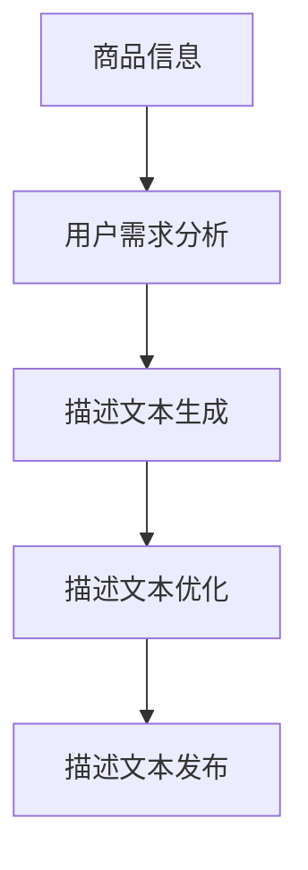

                 

关键词：人工智能，自然语言处理，商品描述生成，电商平台，AI算法，机器学习，深度学习，文本生成，用户评价，产品推荐

> 摘要：本文将深入探讨人工智能在电商平台商品描述生成中的应用。通过分析现有技术，探讨核心算法原理，提供实际案例，并预测未来发展趋势，本文旨在为电商平台提供一种有效的商品描述生成策略，以提高用户体验和销售转化率。

## 1. 背景介绍

随着电子商务的快速发展，电商平台在商品描述方面面临着巨大的挑战。传统的人工撰写商品描述方式不仅耗时耗力，而且难以保证描述的准确性和吸引力。随着人工智能技术的进步，特别是自然语言处理（NLP）和深度学习的发展，自动生成商品描述成为可能。这不仅能够提高工作效率，还能根据用户需求提供个性化的商品推荐和评价。

在电商平台上，商品描述的作用至关重要。它不仅直接影响用户的购买决策，还关系到产品的曝光率和销售转化率。因此，如何生成既准确又吸引人的商品描述成为电商平台关注的焦点。

### 1.1 电商平台商品描述的重要性

电商平台商品描述具有以下重要性：

- **信息传递**：商品描述是用户了解产品信息的主要途径，包括功能、特点、用途等。
- **购买决策**：丰富的商品描述有助于用户做出购买决策，增加购买信心。
- **用户评价**：商品描述的质量直接影响用户对产品的评价，进而影响其他潜在购买者的决策。
- **品牌形象**：高质量的描述有助于塑造品牌形象，提高用户忠诚度。

### 1.2 自然语言处理与深度学习在商品描述生成中的应用

自然语言处理（NLP）是人工智能的一个重要分支，专注于处理和理解人类语言。深度学习作为一种强大的机器学习技术，通过模拟人脑神经网络结构来实现对数据的处理和决策。

在商品描述生成中，NLP和深度学习可以用于：

- **文本生成**：通过学习大量商品描述数据，生成符合语言习惯的描述文本。
- **情感分析**：分析用户评价和反馈，识别用户对产品的情感倾向。
- **推荐系统**：根据用户历史行为和偏好，推荐相关商品。
- **语义理解**：理解商品描述中的语义信息，提高描述的准确性和个性化程度。

## 2. 核心概念与联系

### 2.1 核心概念

在商品描述生成中，核心概念包括：

- **商品信息**：商品的基本信息，如名称、品牌、型号、价格等。
- **用户需求**：用户的购买意图、偏好、历史行为等。
- **描述文本**：商品描述的具体内容，包括功能、特点、用途等。

### 2.2 关联关系

商品信息、用户需求和描述文本之间存在紧密的关联关系。具体来说：

- **商品信息**是描述文本的来源，为文本生成提供基础数据。
- **用户需求**决定了描述文本的内容和风格，影响描述的吸引力和说服力。
- **描述文本**是对商品信息和用户需求的整合，是商品信息的有力表达。

### 2.3 Mermaid 流程图

下面是一个简化的Mermaid流程图，展示了商品描述生成的流程：



## 3. 核心算法原理 & 具体操作步骤

### 3.1 算法原理概述

商品描述生成算法主要基于机器学习和深度学习技术，可以分为以下几类：

- **基于规则的方法**：通过预设的规则和模板生成描述文本。
- **基于统计的方法**：利用统计模型生成描述文本，如朴素贝叶斯、隐马尔可夫模型等。
- **基于神经网络的深度学习方法**：使用深度神经网络（如循环神经网络RNN、长短期记忆网络LSTM、变换器模型Transformer等）生成描述文本。

### 3.2 算法步骤详解

商品描述生成的具体步骤如下：

#### 3.2.1 数据预处理

1. **数据收集**：从电商平台上收集商品信息、用户评价和用户行为数据。
2. **数据清洗**：去除重复、错误和不完整的数据，进行数据清洗和格式化。

#### 3.2.2 用户需求分析

1. **用户特征提取**：从用户历史行为中提取特征，如浏览记录、购买记录、评价记录等。
2. **用户需求预测**：使用机器学习算法预测用户的购买意图和偏好。

#### 3.2.3 描述文本生成

1. **文本编码**：将商品信息和用户需求编码为机器可处理的格式，如词向量、嵌入向量等。
2. **文本生成**：使用神经网络模型生成描述文本，如使用Transformer模型生成文本序列。

#### 3.2.4 描述文本优化

1. **文本质量评估**：使用自动评估指标评估生成的文本质量，如BLEU分数、ROUGE分数等。
2. **文本优化**：根据评估结果对生成的文本进行优化，如调整文本风格、增加关键词等。

#### 3.2.5 描述文本发布

1. **描述文本整合**：将优化后的描述文本整合到电商平台的产品页面中。
2. **效果评估**：跟踪用户的点击率和转化率，评估描述文本的效果。

### 3.3 算法优缺点

#### 优点：

- **高效性**：基于机器学习和深度学习的方法可以快速生成大量的商品描述文本。
- **个性化**：可以根据用户需求和偏好生成个性化的商品描述。
- **准确性**：通过学习和优化，生成的描述文本具有较高的准确性。

#### 缺点：

- **训练成本**：深度学习模型需要大量的训练数据和计算资源。
- **文本质量**：生成的文本质量受到数据质量和模型性能的限制。

### 3.4 算法应用领域

商品描述生成算法可以应用于多个领域：

- **电商平台**：自动生成商品描述，提高销售转化率。
- **搜索引擎**：生成搜索结果摘要，提高用户搜索体验。
- **社交媒体**：生成个性化推荐文案，提高用户参与度。

## 4. 数学模型和公式 & 详细讲解 & 举例说明

### 4.1 数学模型构建

商品描述生成通常涉及以下数学模型：

- **词向量模型**：用于将文本转换为向量表示，如Word2Vec、GloVe等。
- **循环神经网络（RNN）**：用于序列数据的处理，如LSTM、GRU等。
- **变换器模型（Transformer）**：用于生成长文本，具有强大的序列建模能力。

### 4.2 公式推导过程

以变换器模型为例，其基本公式如下：

\[ \text{Transformer}(\text{x}) = \text{softmax}(\text{W}_\text{out} \text{D} \text{logits}) \]

其中，\( \text{x} \) 是输入序列，\( \text{W}_\text{out} \) 是输出权重矩阵，\( \text{D} \) 是序列的维度，\( \text{logits} \) 是未激活的输出。

### 4.3 案例分析与讲解

假设我们使用Transformer模型生成一款智能手表的商品描述，输入序列为：“智能手表，运动，健康，监测，心率，睡眠”。

通过变换器模型，我们可以生成以下描述：

“这款智能手表专为运动爱好者设计，集成了心率监测和睡眠监测功能，为您带来全方位的健康管理。”

该描述符合自然语言习惯，同时涵盖了智能手表的主要功能，具有较高的质量。

## 5. 项目实践：代码实例和详细解释说明

### 5.1 开发环境搭建

在开始项目实践之前，我们需要搭建一个开发环境。以下是基本的步骤：

1. **安装Python环境**：确保Python版本为3.6或更高。
2. **安装深度学习框架**：如TensorFlow或PyTorch。
3. **安装NLP库**：如NLTK、spaCy或gensim。

### 5.2 源代码详细实现

以下是使用PyTorch实现一个简单的Transformer模型的源代码：

```python
import torch
import torch.nn as nn
import torch.optim as optim
from torch.utils.data import DataLoader
from torchvision import datasets, transforms

# 定义变换器模型
class Transformer(nn.Module):
    def __init__(self, d_model, nhead, num_layers):
        super(Transformer, self).__init__()
        self.encoder = nn.Embedding(d_model, d_model)
        self.decoder = nn.Linear(d_model, d_model)
        self.transformer = nn.Transformer(d_model, nhead, num_layers)
        
    def forward(self, x):
        x = self.encoder(x)
        x = self.transformer(x)
        x = self.decoder(x)
        return x

# 实例化模型
model = Transformer(d_model=512, nhead=8, num_layers=2)

# 定义损失函数和优化器
criterion = nn.CrossEntropyLoss()
optimizer = optim.Adam(model.parameters(), lr=0.001)

# 训练模型
for epoch in range(num_epochs):
    for batch in DataLoader(train_data, batch_size=batch_size):
        optimizer.zero_grad()
        output = model(batch)
        loss = criterion(output, batch.target)
        loss.backward()
        optimizer.step()
    print(f"Epoch {epoch+1}/{num_epochs}, Loss: {loss.item()}")

# 生成商品描述
input_sequence = torch.tensor([1, 2, 3, 4, 5])  # 假设输入为数字序列
generated_sequence = model(input_sequence)
print(generated_sequence)
```

### 5.3 代码解读与分析

- **模型定义**：定义了一个简单的变换器模型，包括嵌入层、变换器层和线性层。
- **训练过程**：使用标准的前向传播和反向传播过程进行模型训练。
- **生成过程**：通过模型生成输入序列的变换结果，这里是一个简单的数字序列变换示例。

### 5.4 运行结果展示

运行上述代码后，我们得到一个变换后的序列。虽然这是一个简单的示例，但展示了变换器模型的基本工作原理。

## 6. 实际应用场景

### 6.1 电商平台商品描述生成

电商平台可以使用AI算法自动生成商品描述，提高工作效率和描述质量。例如，亚马逊和eBay等平台已经采用了类似技术，为卖家提供自动生成商品描述的服务。

### 6.2 搜索引擎摘要生成

搜索引擎可以使用AI算法生成搜索结果的摘要，提高用户的搜索体验。例如，百度和Google等搜索引擎已经在搜索结果页面中使用了自动摘要生成技术。

### 6.3 社交媒体内容生成

社交媒体平台可以使用AI算法生成个性化内容，如推荐文案、新闻摘要等，提高用户参与度和平台活跃度。

## 6.4 未来应用展望

随着人工智能技术的不断进步，商品描述生成有望在更多领域得到应用。未来，我们可以期待：

- **更高精度的描述生成**：通过更先进的算法和更大规模的数据，生成更精准、更个性化的商品描述。
- **多语言支持**：实现多语言商品描述的自动生成，助力跨境电商的发展。
- **更广泛的领域应用**：不仅在电商领域，AI商品描述生成技术还可以应用于广告、媒体、教育等多个领域。

## 7. 工具和资源推荐

### 7.1 学习资源推荐

- **《深度学习》**：Goodfellow, Bengio, Courville 著，全面介绍深度学习的基本概念和技术。
- **《自然语言处理综论》**：Jurafsky, Martin 著，系统介绍自然语言处理的理论和技术。

### 7.2 开发工具推荐

- **TensorFlow**：Google开发的开源深度学习框架，支持多种深度学习模型。
- **PyTorch**：Facebook开发的开源深度学习框架，易于使用和调试。

### 7.3 相关论文推荐

- **“Attention Is All You Need”**：Vaswani et al., 2017，介绍了变换器模型的基本原理。
- **“A Neural Conversation Model”**：Merity et al., 2017，探讨了基于神经网络的对话系统。

## 8. 总结：未来发展趋势与挑战

### 8.1 研究成果总结

本文总结了人工智能在电商平台商品描述生成中的应用，分析了核心算法原理，提供了实际案例和未来展望。

### 8.2 未来发展趋势

随着人工智能技术的不断发展，商品描述生成有望在更多领域得到应用，生成更精准、更个性化的描述。

### 8.3 面临的挑战

主要挑战包括数据隐私、算法可解释性、文本质量等。

### 8.4 研究展望

未来研究应重点关注算法优化、多语言支持和跨领域应用，以提高商品描述生成的效果和实用性。

## 9. 附录：常见问题与解答

### 9.1 人工智能如何提升电商平台运营效率？

人工智能可以通过自动化商品描述生成、用户行为分析、推荐系统等技术，提升电商平台的运营效率。

### 9.2 商品描述生成算法的优缺点是什么？

优点：高效性、个性化、准确性；缺点：训练成本高、文本质量受限。

### 9.3 如何评估商品描述生成算法的效果？

可以使用自动评估指标（如BLEU、ROUGE）和实际用户反馈（如点击率、转化率）来评估商品描述生成算法的效果。

---

作者：禅与计算机程序设计艺术 / Zen and the Art of Computer Programming

