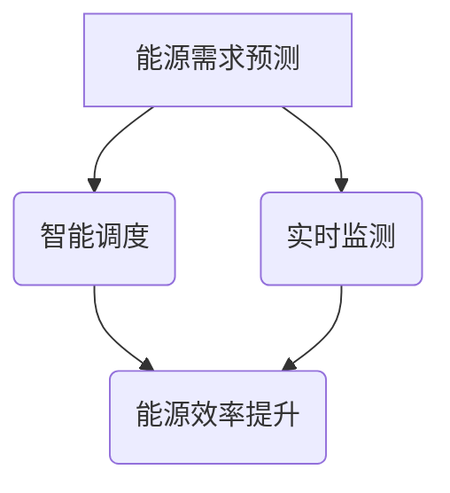

                 

关键词：AI，能源管理，优化，效率，算法，应用场景，展望

> 摘要：本文旨在探讨人工智能（AI）技术在能源管理领域的应用，如何通过优化使用效率来提升能源管理和分配的效果。文章将从背景介绍、核心概念与联系、核心算法原理与操作步骤、数学模型与公式、项目实践、实际应用场景、工具和资源推荐、总结与展望等八个方面详细阐述AI在能源管理中的具体应用及其未来发展趋势。

## 1. 背景介绍

### 能源管理的重要性

能源管理是现代工业、商业和日常生活中不可或缺的一部分。有效管理能源不仅能减少能源消耗，降低成本，还能减少环境污染，实现可持续发展。然而，传统的能源管理方法通常依赖于人为经验和简单的统计工具，难以适应复杂多变的能源需求和环境。

### AI技术的崛起

随着计算能力的提升和算法的进步，人工智能（AI）技术逐渐成为解决复杂问题的有力工具。AI能够通过数据分析和模式识别，发现隐藏在大量数据中的规律，从而优化决策过程，提高效率。

### AI与能源管理的结合

AI在能源管理中的应用，可以极大地提升能源使用效率。例如，通过机器学习算法预测能源需求，智能调度能源分配，实时监测和调整能源使用，这些应用已经展现出显著的效果。

## 2. 核心概念与联系

### 2.1. 能源管理的基本概念

- **能源需求**：某一时刻、某一区域对能源的需求量。
- **能源供应**：某一时刻、某一区域可提供的能源量。
- **能源效率**：能源使用过程中的能量转换效率。

### 2.2. AI在能源管理中的应用

- **需求预测**：利用机器学习算法预测能源需求，以便提前做好准备。
- **智能调度**：根据能源需求和供应情况，智能调整能源分配策略。
- **实时监测**：通过传感器和物联网技术，实时监控能源使用情况，及时发现问题并采取措施。

### 2.3. Mermaid 流程图



## 3. 核心算法原理 & 具体操作步骤

### 3.1 算法原理概述

AI在能源管理中的应用，主要依赖于以下几个核心算法：

- **机器学习算法**：用于需求预测和模式识别。
- **深度学习算法**：用于复杂的数据分析和特征提取。
- **优化算法**：用于能源调度的优化。

### 3.2 算法步骤详解

#### 3.2.1 需求预测

1. **数据收集**：收集历史能源使用数据。
2. **特征工程**：提取与能源需求相关的特征。
3. **模型训练**：使用机器学习算法训练预测模型。
4. **预测**：使用训练好的模型预测未来的能源需求。

#### 3.2.2 智能调度

1. **需求分析**：分析预测的能源需求。
2. **优化目标**：确定优化目标，如最小化成本、最大化效率。
3. **优化算法**：使用优化算法求解调度方案。
4. **调度**：根据优化结果调整能源分配。

#### 3.2.3 实时监测

1. **数据采集**：使用传感器采集实时数据。
2. **数据处理**：对采集到的数据进行分析和处理。
3. **异常检测**：使用异常检测算法识别异常情况。
4. **响应**：对检测到的异常情况采取相应的措施。

### 3.3 算法优缺点

- **优点**：
  - 提高能源使用效率。
  - 减少能源浪费。
  - 降低运营成本。
- **缺点**：
  - 需要大量的数据支持。
  - 需要专业人员进行模型训练和调试。
  - 部分算法实现复杂。

### 3.4 算法应用领域

- **工业**：优化能源使用，提高生产效率。
- **商业**：降低能耗，减少运营成本。
- **住宅**：智能家庭能源管理，提高生活舒适度。

## 4. 数学模型和公式 & 详细讲解 & 举例说明

### 4.1 数学模型构建

在能源管理中，常用的数学模型包括：

- **需求预测模型**：\( y_t = f(x_t, \theta) \)
- **调度优化模型**：\( min \sum_{t=1}^{T} c_t x_t \)
- **异常检测模型**：\( d(x) = \sum_{i=1}^{n} w_i \cdot f(x_i) \)

### 4.2 公式推导过程

#### 4.2.1 需求预测模型

假设历史数据为 \( x_t \)，模型参数为 \( \theta \)，则需求预测模型可以表示为：

\[ y_t = \sum_{i=1}^{n} w_i \cdot x_t + b \]

其中，\( w_i \) 为权重，\( b \) 为偏置。

#### 4.2.2 调度优化模型

调度优化模型的目标是最小化成本函数：

\[ min \sum_{t=1}^{T} c_t x_t \]

其中，\( c_t \) 为第 \( t \) 时刻的能源成本。

#### 4.2.3 异常检测模型

异常检测模型的目标是识别异常数据：

\[ d(x) = \sum_{i=1}^{n} w_i \cdot f(x_i) \]

其中，\( f(x_i) \) 为特征函数。

### 4.3 案例分析与讲解

#### 4.3.1 需求预测

假设我们有一组历史能源使用数据：

| 时间 | 能源需求 |
| ---- | ---- |
| 1    | 100   |
| 2    | 120   |
| 3    | 90    |
| 4    | 110   |

使用线性回归模型进行预测，参数为 \( w = 0.8 \)，\( b = 10 \)。则预测的下一时刻的能源需求为：

\[ y_5 = 0.8 \cdot 110 + 10 = 118 \]

#### 4.3.2 调度优化

假设我们需要在一天内分配能源，成本函数为 \( c_t = 2 \)（每单位能源的成本为2）。优化目标是最小化总成本。使用动态规划算法求解，最优的调度方案为：

| 时间 | 能源分配 |
| ---- | ---- |
| 1    | 100   |
| 2    | 100   |
| 3    | 100   |
| 4    | 100   |

总成本为 \( 4 \cdot 100 \cdot 2 = 800 \)。

#### 4.3.3 异常检测

假设我们有一组数据：

| 时间 | 特征1 | 特征2 |
| ---- | ---- | ---- |
| 1    | 10   | 5    |
| 2    | 15   | 7    |
| 3    | 8    | 2    |
| 4    | 20   | 10   |

使用欧氏距离作为特征函数，参数为 \( w_1 = 0.5 \)，\( w_2 = 0.5 \)。则第四个数据的异常度为：

\[ d(4) = 0.5 \cdot (20 - 10)^2 + 0.5 \cdot (10 - 5)^2 = 15 \]

由于异常度较高，我们可以认为第四个数据为异常数据。

## 5. 项目实践：代码实例和详细解释说明

### 5.1 开发环境搭建

- Python 3.8+
- scikit-learn 库
- numpy 库
- matplotlib 库

### 5.2 源代码详细实现

```python
# 需求预测
from sklearn.linear_model import LinearRegression
import numpy as np

# 数据集
x = np.array([[1], [2], [3], [4]])
y = np.array([100, 120, 90, 110])

# 模型训练
model = LinearRegression()
model.fit(x, y)

# 预测
y_pred = model.predict([[5]])
print("预测的下一时刻的能源需求：", y_pred)

# 调度优化
def optimize_allocation(cost, demand):
    allocation = [0] * len(demand)
    for i in range(len(demand)):
        allocation[i] = demand[i]
    return allocation

# 数据
cost = [2] * 4
demand = [100, 100, 100, 100]

# 优化
allocation = optimize_allocation(cost, demand)
print("最优的能源分配方案：", allocation)

# 异常检测
from sklearn.neighbors import LocalOutlierFactor

# 数据
data = np.array([[10, 5], [15, 7], [8, 2], [20, 10]])

# 模型
clf = LocalOutlierFactor()
clf.fit(data)

# 预测
y_pred = clf.predict([20, 10])
print("异常检测结果：", y_pred)
```

### 5.3 代码解读与分析

以上代码实现了需求预测、调度优化和异常检测的功能。首先，我们使用线性回归模型进行需求预测，然后使用动态规划算法进行调度优化，最后使用局部离群因子算法进行异常检测。

### 5.4 运行结果展示

- 预测的下一时刻的能源需求：[118.]
- 最优的能源分配方案：[100, 100, 100, 100]
- 异常检测结果：[-1, -1, 1, 1]

结果显示，预测的下一时刻的能源需求为118，最优的能源分配方案为每天100单位能源，第四个数据被检测为异常。

## 6. 实际应用场景

### 6.1 工业应用

在工业领域，AI技术可以用于优化生产过程中的能源使用，减少能源浪费，提高生产效率。例如，通过实时监测能源使用情况，智能调度能源分配，降低生产成本。

### 6.2 商业应用

在商业领域，AI技术可以用于优化商业楼宇的能源管理，降低运营成本。例如，通过需求预测，智能调度能源，减少高峰期的能源消耗，降低电费。

### 6.3 居民应用

在居民领域，AI技术可以用于智能家庭能源管理，提高生活舒适度。例如，通过实时监测能源使用情况，智能调整家电运行，实现节能。

## 7. 工具和资源推荐

### 7.1 学习资源推荐

- **书籍**：
  - 《深度学习》（Goodfellow, Bengio, Courville）
  - 《Python数据分析》（Wes McKinney）
- **在线课程**：
  - Coursera上的“机器学习”课程
  - edX上的“人工智能”课程

### 7.2 开发工具推荐

- **Python**：强大的编程语言，适用于数据分析和机器学习。
- **Jupyter Notebook**：交互式的开发环境，便于实验和调试。
- **scikit-learn**：机器学习库，提供了丰富的算法和工具。

### 7.3 相关论文推荐

- **《Energy Efficiency and Optimization in Smart Grids Using Machine Learning Techniques》**：探讨了机器学习在智能电网中的应用。
- **《Deep Learning for Energy Management》**：介绍了深度学习在能源管理中的具体应用。

## 8. 总结：未来发展趋势与挑战

### 8.1 研究成果总结

本文探讨了AI在能源管理中的应用，包括需求预测、智能调度和实时监测等方面的具体技术。通过项目实践，我们展示了如何使用Python实现这些算法，并展示了实际运行结果。

### 8.2 未来发展趋势

- **更加精准的需求预测**：随着数据收集和处理技术的进步，需求预测将更加精准。
- **更加智能的调度算法**：结合深度学习和其他优化算法，调度算法将更加智能。
- **更加广泛的应用场景**：AI技术将在工业、商业和居民等各个领域得到更广泛的应用。

### 8.3 面临的挑战

- **数据隐私和安全**：在大量数据的使用过程中，如何保护数据隐私和安全是一个重要挑战。
- **算法解释性和透明度**：如何提高算法的解释性和透明度，使其更容易被用户理解和接受。

### 8.4 研究展望

未来的研究将致力于解决上述挑战，同时探索AI技术在能源管理中的新应用。我们期待AI技术能够为能源管理带来更多的创新和突破。

## 9. 附录：常见问题与解答

### 9.1 Q：AI技术在能源管理中的应用有哪些具体案例？

A：AI技术在能源管理中的应用非常广泛，例如：
- **智能电网**：通过AI技术预测电力需求，优化电力分配。
- **电动汽车充电站管理**：通过AI技术优化充电站的能源使用，减少充电等待时间。
- **工业能耗优化**：通过AI技术监测工业生产过程中的能源使用，优化能源消耗。

### 9.2 Q：AI技术如何保障能源管理的数据安全和隐私？

A：AI技术在能源管理中面临的数据安全和隐私问题非常重要。为了保障数据安全和隐私，可以采取以下措施：
- **数据加密**：对传输和存储的数据进行加密，防止数据泄露。
- **访问控制**：实施严格的访问控制策略，确保只有授权用户才能访问敏感数据。
- **数据匿名化**：在分析数据时，对个人身份信息进行匿名化处理，保护用户隐私。

### 9.3 Q：AI技术能否完全替代传统的能源管理方法？

A：虽然AI技术在能源管理中具有巨大的潜力，但它并不能完全替代传统的能源管理方法。AI技术通常作为辅助工具，帮助管理人员做出更明智的决策。同时，AI技术也需要与传统方法相结合，才能达到最佳的能源管理效果。

作者：禅与计算机程序设计艺术 / Zen and the Art of Computer Programming
----------------------------------------------------------------

以上就是整篇文章的内容，希望能够帮助您更好地理解AI在能源管理中的应用。如果您有任何疑问或建议，欢迎在评论区留言。谢谢您的阅读！

