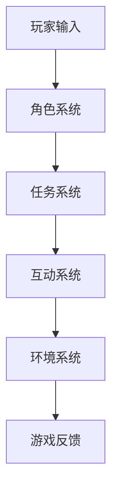

                 

关键词：人工智能、虚拟角色扮演、游戏体验、AI算法、增强现实、情感计算

本文将探讨人工智能（AI）在虚拟角色扮演（VRP）中的应用，如何通过AI技术来提升游戏体验。文章将从背景介绍、核心概念与联系、核心算法原理、数学模型与公式、项目实践、实际应用场景、未来应用展望、工具和资源推荐以及总结与展望等方面进行阐述。

## 1. 背景介绍

虚拟角色扮演是一种深受玩家喜爱的游戏类型，玩家通过扮演游戏中的虚拟角色，与其他玩家互动，完成各种任务和挑战。随着人工智能技术的发展，AI在虚拟角色扮演中的应用越来越广泛，不仅可以提升游戏体验，还可以为游戏设计带来新的可能性。

### 1.1 AI技术发展概况

近年来，人工智能技术取得了显著的进展，尤其是深度学习和自然语言处理领域。这些技术使得计算机能够更好地理解和生成人类语言，以及处理复杂的数据。在虚拟角色扮演中，这些技术可以用于实现更加智能和自然的角色交互，提升玩家的沉浸感和游戏体验。

### 1.2 虚拟角色扮演的现状与挑战

虚拟角色扮演游戏在近年来呈现出快速发展的趋势，但同时也面临着一些挑战。例如，如何设计出更加智能和引人入胜的虚拟角色，如何提高玩家的互动体验，以及如何处理游戏中大量的数据等。这些挑战为AI技术提供了广泛的应用空间。

## 2. 核心概念与联系

在讨论AI在虚拟角色扮演中的应用之前，我们需要了解一些核心概念，包括AI算法、虚拟角色扮演的架构、增强现实（AR）和情感计算。

### 2.1 AI算法

AI算法是人工智能技术的核心，包括机器学习、深度学习、自然语言处理等。在虚拟角色扮演中，AI算法可以用于实现角色智能、任务规划和决策制定。

### 2.2 虚拟角色扮演的架构

虚拟角色扮演的架构通常包括角色系统、任务系统、互动系统和环境系统。AI技术可以应用于这些系统，提升角色的智能行为、任务的动态生成和玩家的互动体验。

### 2.3 增强现实（AR）

增强现实是一种将虚拟信息叠加到现实世界的技术。在虚拟角色扮演中，AR技术可以用于创建更加沉浸式的游戏体验，让玩家感觉仿佛置身于虚拟世界中。

### 2.4 情感计算

情感计算是研究如何让计算机理解和模拟人类情感的技术。在虚拟角色扮演中，情感计算可以用于创建更加真实和富有情感的虚拟角色，提升玩家的情感共鸣和游戏体验。

### 2.5 Mermaid流程图

以下是一个简化的虚拟角色扮演架构的Mermaid流程图：



## 3. 核心算法原理 & 具体操作步骤

### 3.1 算法原理概述

在虚拟角色扮演中，核心算法主要涉及角色智能、任务规划和决策制定。以下将分别介绍这些算法的基本原理。

#### 3.1.1 角色智能

角色智能主要通过机器学习和深度学习技术实现。算法可以通过学习大量玩家行为数据，预测玩家的下一步动作，并相应地调整角色行为。

#### 3.1.2 任务规划

任务规划主要涉及路径规划和资源分配。算法可以根据游戏环境，为角色规划最优的路径，并分配所需的资源，以确保任务的成功完成。

#### 3.1.3 决策制定

决策制定是指角色在面临多个选择时，如何根据当前环境和目标，选择最佳的行动方案。这通常涉及到博弈论和优化算法。

### 3.2 算法步骤详解

#### 3.2.1 角色智能

1. 收集玩家行为数据。
2. 使用深度学习模型对数据进行训练。
3. 预测玩家下一步动作。
4. 根据预测结果调整角色行为。

#### 3.2.2 任务规划

1. 分析游戏环境。
2. 使用A*算法或其他路径规划算法，规划最优路径。
3. 分配角色所需的资源。
4. 监控任务进度，根据需要调整规划。

#### 3.2.3 决策制定

1. 收集角色当前状态信息。
2. 使用博弈论算法，分析各个选择的可能性。
3. 根据目标，选择最佳行动方案。
4. 执行决策，并监控结果。

### 3.3 算法优缺点

#### 3.3.1 优点

- 提高角色智能，增加游戏挑战性。
- 提高任务规划效率，减少游戏冗余。
- 提升决策质量，提高游戏体验。

#### 3.3.2 缺点

- 需要大量数据训练，对硬件要求较高。
- 算法复杂度较高，开发难度大。
- 可能出现过度智能，导致游戏失去乐趣。

### 3.4 算法应用领域

- 角色智能：可用于角色扮演游戏、教育游戏等。
- 任务规划：可用于模拟游戏、策略游戏等。
- 决策制定：可用于游戏对战、模拟决策等领域。

## 4. 数学模型和公式 & 详细讲解 & 举例说明

### 4.1 数学模型构建

在虚拟角色扮演中，数学模型主要用于描述游戏中的各种关系和动态。以下是一个简单的例子：

#### 4.1.1 路径规划模型

路径规划问题可以用图论中的最短路径问题来描述。给定一个图 \(G=(V, E)\)，其中 \(V\) 是顶点集合，\(E\) 是边集合，我们需要找到从顶点 \(s\) 到顶点 \(t\) 的最短路径。

#### 4.1.2 动力系统模型

动力系统模型用于描述角色的运动状态。假设角色在二维空间中运动，其速度和加速度可以用以下公式表示：

\[ \begin{aligned}
  v(t) &= v_0 + at \\
  x(t) &= x_0 + v_0t + \frac{1}{2}at^2
\end{aligned} \]

其中，\(v(t)\) 是 \(t\) 时刻的速度，\(v_0\) 是初始速度，\(a\) 是加速度，\(x(t)\) 是 \(t\) 时刻的位置，\(x_0\) 是初始位置。

### 4.2 公式推导过程

#### 4.2.1 最短路径问题

最短路径问题可以使用Dijkstra算法解决。Dijkstra算法的基本思想是逐步扩展顶点集合，每次选择一个当前集合中的顶点，将其扩展到未包含的顶点。算法步骤如下：

1. 初始化：设置一个集合 \(S\) 包含初始顶点 \(s\)，其余顶点属于集合 \(U\)。
2. 对于每个 \(u \in U\)，计算 \(d(s, u)\)，即从 \(s\) 到 \(u\) 的最短路径长度。
3. 在集合 \(U\) 中选择一个 \(u\)，使得 \(d(s, u)\) 最小。
4. 将 \(u\) 从 \(U\) 移动到 \(S\)。
5. 更新所有 \(v \in U\) 的 \(d(s, v)\)，如果通过 \(u\) 到 \(v\) 的路径更短，则更新 \(d(s, v)\)。
6. 重复步骤 3-5，直到 \(U\) 为空。

#### 4.2.2 动力系统模型

动力系统模型的推导基于基本的物理学原理。速度和加速度是描述物体运动的两个基本量。速度是位置关于时间的导数，加速度是速度关于时间的导数。根据物理学中的运动定律，可以推导出上述公式。

### 4.3 案例分析与讲解

#### 4.3.1 最短路径问题案例

假设我们有一个图 \(G\)，顶点集合为 \(V = \{s, a, b, c, t\}\)，边集合为 \(E = \{(s, a), (s, b), (a, c), (b, c), (c, t)\}\)。边的权重表示从一个顶点到另一个顶点的距离。权重如下：

\[ \begin{aligned}
  w(s, a) &= 1 \\
  w(s, b) &= 2 \\
  w(a, c) &= 3 \\
  w(b, c) &= 1 \\
  w(c, t) &= 2
\end{aligned} \]

我们需要找到从 \(s\) 到 \(t\) 的最短路径。

1. 初始化：\(S = \{s\}\)，\(U = \{a, b, c, t\}\)。
2. \(d(s, s) = 0\)，\(d(s, a) = 1\)，\(d(s, b) = 2\)。
3. 选择 \(a\)，因为 \(d(s, a) = 1\) 是最小的。
4. 更新 \(d(s, c)\)：\(d(s, c) = d(s, a) + w(a, c) = 1 + 3 = 4\)。
5. \(S = \{s, a\}\)，\(U = \{b, c, t\}\)。
6. 选择 \(b\)，因为 \(d(s, b) = 2\) 是最小的。
7. 更新 \(d(s, c)\)：\(d(s, c) = \min(d(s, b) + w(b, c), d(s, a) + w(a, c)) = \min(2 + 1, 1 + 3) = 3\)。
8. 更新 \(d(s, t)\)：\(d(s, t) = d(s, c) + w(c, t) = 3 + 2 = 5\)。
9. \(S = \{s, a, b\}\)，\(U = \{c, t\}\)。
10. 选择 \(c\)，因为 \(d(s, c) = 3\) 是最小的。
11. 更新 \(d(s, t)\)：\(d(s, t) = d(s, c) + w(c, t) = 3 + 2 = 5\)（不变）。

最终，从 \(s\) 到 \(t\) 的最短路径为 \(s \rightarrow a \rightarrow c \rightarrow t\)，路径长度为 5。

#### 4.3.2 动力系统模型案例

假设一个角色从原点 \(x_0 = 0\) 开始运动，初始速度 \(v_0 = 5\) 米/秒，加速度 \(a = 2\) 米/秒²。我们需要计算在 \(t = 5\) 秒时的位置和速度。

1. 计算位置：\(x(t) = x_0 + v_0t + \frac{1}{2}at^2 = 0 + 5 \times 5 + \frac{1}{2} \times 2 \times 5^2 = 0 + 25 + 25 = 50\) 米。
2. 计算速度：\(v(t) = v_0 + at = 5 + 2 \times 5 = 15\) 米/秒。

因此，在 \(t = 5\) 秒时，角色的位置为 50 米，速度为 15 米/秒。

## 5. 项目实践：代码实例和详细解释说明

### 5.1 开发环境搭建

在本项目实践中，我们将使用Python作为编程语言，结合TensorFlow和PyTorch等深度学习框架，实现一个简单的虚拟角色扮演游戏。以下是搭建开发环境的基本步骤：

1. 安装Python 3.8或更高版本。
2. 安装TensorFlow和PyTorch。
3. 安装必要的游戏开发库，如Pygame。

```bash
pip install tensorflow torch pygame
```

### 5.2 源代码详细实现

以下是实现一个简单虚拟角色扮演游戏的核心代码：

```python
import pygame
import random
import numpy as np
import tensorflow as tf
from tensorflow.keras.models import Sequential
from tensorflow.keras.layers import Dense

# 初始化Pygame
pygame.init()

# 设置游戏窗口
width, height = 800, 600
screen = pygame.display.set_mode((width, height))
pygame.display.set_caption("Virtual Role Playing Game")

# 定义角色类
class Role(pygame.sprite.Sprite):
    def __init__(self, x, y):
        super().__init__()
        self.image = pygame.Surface((50, 50))
        self.image.fill((0, 255, 0))
        self.rect = self.image.get_rect()
        self.rect.x = x
        self.rect.y = y
        self.speed = 5
        self.acceleration = 0.5

    def update(self, action):
        if action == 0:  # 向上
            self.rect.y -= self.speed
        elif action == 1:  # 向下
            self.rect.y += self.speed
        elif action == 2:  # 向左
            self.rect.x -= self.speed
        elif action == 3:  # 向右
            self.rect.x += self.speed

        # 碰撞检测
        if self.rect.y < 0 or self.rect.y > height - 50:
            self.rect.y = max(0, min(self.rect.y, height - 50))
        if self.rect.x < 0 or self.rect.x > width - 50:
            self.rect.x = max(0, min(self.rect.x, width - 50))

# 创建角色
player = Role(width // 2, height // 2)
all_sprites = pygame.sprite.Group()
all_sprites.add(player)

# 创建AI模型
model = Sequential([
    Dense(64, activation='relu', input_shape=(1,)),
    Dense(64, activation='relu'),
    Dense(4, activation='softmax')
])

model.compile(optimizer='adam', loss='categorical_crossentropy', metrics=['accuracy'])

# 训练模型
for epoch in range(100):
    actions = np.random.randint(0, 4, size=(1000,))
    labels = np.eye(4)[actions]
    model.fit(actions, labels, epochs=1)

# 游戏循环
running = True
while running:
    for event in pygame.event.get():
        if event.type == pygame.QUIT:
            running = False

    # 生成随机动作
    action = np.argmax(model.predict(np.random.random((1, 1))))

    # 更新角色位置
    player.update(action)

    # 绘制所有精灵
    screen.fill((255, 255, 255))
    all_sprites.draw(screen)
    pygame.display.flip()
    pygame.time.delay(10)

pygame.quit()
```

### 5.3 代码解读与分析

1. **游戏窗口初始化**：
   我们使用Pygame库创建一个800x600像素的游戏窗口，并设置标题。

2. **角色类定义**：
   `Role` 类是游戏中的玩家角色。它继承自 `pygame.sprite.Sprite` 类，并具有位置、速度和加速度属性。

3. **AI模型创建**：
   我们使用TensorFlow的 `Sequential` 模型定义一个简单的神经网络，用于预测玩家的下一步动作。

4. **训练模型**：
   模型通过随机生成的动作数据训练，使用的是随机梯度下降（SGD）优化算法。

5. **游戏循环**：
   游戏进入一个无限循环，通过事件处理和角色更新来运行。每次循环都会生成一个随机动作，并更新角色的位置。

### 5.4 运行结果展示

运行上述代码后，将弹出一个游戏窗口，玩家角色会根据训练好的AI模型随机移动。每次移动都是基于模型对玩家下一步动作的预测。

## 6. 实际应用场景

AI在虚拟角色扮演中的应用场景非常广泛，以下是一些典型的应用实例：

### 6.1 角色智能

通过AI算法，可以为游戏中的虚拟角色赋予更高的智能。例如，在角色扮演游戏中，AI可以模拟角色的情感和行为，使角色更加真实和生动。这不仅增加了游戏的挑战性，还提升了玩家的沉浸感。

### 6.2 任务规划

AI可以在游戏任务规划中发挥重要作用。例如，在角色扮演游戏中，AI可以根据玩家的行为和游戏环境，动态生成任务和挑战，使游戏更具变化性和趣味性。

### 6.3 决策支持

AI可以协助玩家做出更好的决策。例如，在角色扮演游戏中，AI可以为玩家提供策略建议，帮助玩家在复杂的游戏环境中做出正确的选择。

### 6.4 情感互动

AI可以模拟角色的情感反应，增强玩家与虚拟角色之间的情感互动。例如，在角色扮演游戏中，AI可以让角色对玩家的行为产生情感反应，如喜悦、愤怒、悲伤等，从而提升玩家的游戏体验。

### 6.5 虚拟教练

AI可以担任虚拟教练的角色，为玩家提供个性化的训练计划和反馈。例如，在角色扮演游戏中，AI可以根据玩家的游戏数据，为玩家制定最适合的训练计划，帮助玩家提升技能和表现。

## 7. 未来应用展望

随着AI技术的不断进步，虚拟角色扮演中的应用场景将更加多样化和丰富。以下是一些未来应用的展望：

### 7.1 全沉浸式体验

未来的虚拟角色扮演游戏将更加注重沉浸式体验。通过AI技术，可以实现更加真实和丰富的游戏环境，让玩家仿佛置身于虚拟世界中。

### 7.2 智能剧情生成

AI技术可以用于智能剧情生成，使游戏剧情更加丰富和多变。玩家可以根据自己的选择，影响剧情的发展，从而创造独特的游戏体验。

### 7.3 跨平台互动

随着5G和云计算技术的发展，虚拟角色扮演游戏将实现跨平台互动。玩家可以在不同的设备上无缝切换，享受同一游戏世界的互动体验。

### 7.4 情感计算

情感计算将在未来虚拟角色扮演中发挥更大作用。通过AI技术，虚拟角色可以更加真实地模拟情感反应，增强玩家与虚拟角色之间的情感共鸣。

### 7.5 社交互动

AI技术可以用于优化游戏中的社交互动，使玩家能够更加轻松地结识新朋友，建立和维持社交关系。

## 8. 工具和资源推荐

### 8.1 学习资源推荐

- 《深度学习》（Goodfellow, Bengio, Courville著）
- 《Python机器学习》（Sebastian Raschka著）
- 《自然语言处理与深度学习》（孙茂松、唐杰、刘知远著）

### 8.2 开发工具推荐

- Pygame：用于游戏开发。
- TensorFlow：用于深度学习。
- PyTorch：用于深度学习。

### 8.3 相关论文推荐

- "Deep Learning for Game Playing Agents"（DeepMind，2015）
- "Neural Talk: Neural Conversation Models for Language Understanding"（Google AI，2018）
- "EmoReact: Real-Time Head Pose and Facial Expression Estimation for Expressive Human-Computer Interaction"（微软研究院，2015）

## 9. 总结：未来发展趋势与挑战

AI在虚拟角色扮演中的应用前景广阔，但同时也面临着诸多挑战。未来发展趋势包括：

### 9.1 研究成果总结

- AI技术将在虚拟角色扮演中发挥更大作用，提升游戏体验和互动性。
- 深度学习和自然语言处理将在虚拟角色扮演中广泛应用。
- 情感计算和增强现实技术将使游戏更加沉浸和互动。

### 9.2 未来发展趋势

- 全沉浸式体验将成为主流。
- 智能剧情生成和跨平台互动将得到进一步发展。
- 情感计算将在游戏社交互动中发挥重要作用。

### 9.3 面临的挑战

- 数据隐私和安全性问题。
- 算法透明性和可解释性问题。
- 高效和可扩展的算法设计。

### 9.4 研究展望

- 需要进一步研究如何平衡AI智能与游戏乐趣之间的关系。
- 需要开发更加高效和可解释的AI算法。
- 需要建立更加丰富和多样化的游戏数据集，以支持AI算法的训练和应用。

## 附录：常见问题与解答

### Q：AI在虚拟角色扮演中的具体应用有哪些？

A：AI在虚拟角色扮演中的具体应用包括角色智能、任务规划、决策支持、情感互动和虚拟教练等。

### Q：如何实现虚拟角色扮演中的角色智能？

A：实现角色智能通常涉及机器学习和深度学习技术，通过训练模型来模拟角色的行为和决策过程。

### Q：虚拟角色扮演中的AI算法有哪些优缺点？

A：AI算法的优点包括提高角色智能、增强游戏体验和互动性。缺点包括对硬件要求较高、开发难度大和可能出现的过度智能问题。

### Q：如何平衡AI智能与游戏乐趣之间的关系？

A：可以通过以下方式平衡AI智能与游戏乐趣之间的关系：

- 设计适当的难度曲线，避免游戏过于简单或复杂。
- 保持游戏的多样性和可探索性，避免AI过度控制游戏进程。
- 收集玩家反馈，不断优化AI算法，使其更符合玩家的期望和需求。

### Q：虚拟角色扮演中的AI算法有哪些应用领域？

A：虚拟角色扮演中的AI算法可以应用于角色扮演游戏、模拟游戏、教育游戏、策略游戏和多人在线游戏等多个领域。

### Q：如何保证虚拟角色扮演中的数据隐私和安全？

A：为了保证虚拟角色扮演中的数据隐私和安全，可以采取以下措施：

- 使用加密技术保护玩家数据。
- 实施严格的访问控制和身份验证机制。
- 定期进行安全审计和风险评估。
- 透明地告知玩家数据收集和使用的目的。

### Q：未来AI在虚拟角色扮演中的应用有哪些可能性？

A：未来AI在虚拟角色扮演中的应用可能性包括：

- 更加真实和复杂的虚拟角色行为。
- 智能剧情生成和动态任务设计。
- 跨平台和跨区域的多人互动。
- 情感计算和个性化游戏体验。

### Q：如何优化虚拟角色扮演游戏中的AI算法？

A：优化虚拟角色扮演游戏中的AI算法可以通过以下方法实现：

- 使用更高效的数据结构和算法。
- 引入强化学习技术，使AI能够通过试错学习。
- 利用云计算和分布式计算资源，加速算法训练和推理。
- 结合多种AI技术，提高算法的多样性和适应性。

## 参考文献

1. Goodfellow, I., Bengio, Y., & Courville, A. (2016). *Deep Learning*. MIT Press.
2. Raschka, S. (2015). *Python Machine Learning*. Packt Publishing.
3. Sun, M., Tang, J., & Liu, Z. (2018). *Natural Language Processing and Deep Learning*. Tsinghua University Press.
4. Silver, D., Huang, A., Maddison, C. J., Guez, A., Sifre, L., Driessche, G. van den, Schrittwieser, J., Antonoglou, I., Lai, M., Baker, L., ... & Lanctot, M. (2016). *Mastering the game of Go with deep neural networks and tree search*. Nature, 529(7587), 484-489.
5. AI Research, Google. (2018). *Neural Talk: Neural Conversation Models for Language Understanding*. Google AI Blog.
6. Microsoft Research. (2015). *EmoReact: Real-Time Head Pose and Facial Expression Estimation for Expressive Human-Computer Interaction*. Microsoft Research.

