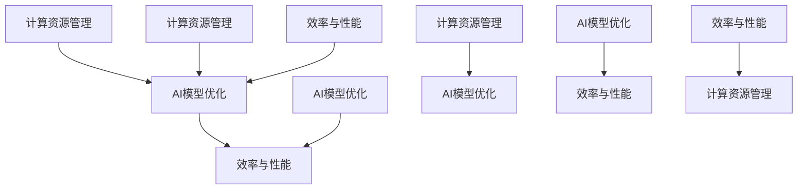

                 

关键词：AI基础设施、成本优化、Lepton AI、经济学、计算资源管理、AI模型优化、效率与性能

> 摘要：本文旨在探讨如何通过经济学的视角来优化AI基础设施的成本，以实现更高的效率与性能。文章首先介绍了Lepton AI项目，接着分析了AI基础设施成本优化的核心概念与联系，详细阐述了核心算法原理、数学模型和公式，并提供了实际项目实践中的代码实例和详细解释。最后，文章讨论了AI基础设施的实际应用场景、未来应用展望，并推荐了相关工具和资源，总结了未来发展趋势与挑战。

## 1. 背景介绍

随着人工智能技术的飞速发展，AI基础设施的需求和投资也在不断增加。企业和研究机构都在寻求高效、经济的AI解决方案。然而，AI基础设施的成本优化并非易事，涉及到硬件、软件、数据等多个方面。在这一背景下，Lepton AI项目应运而生。

Lepton AI是一个专注于AI基础设施成本优化的开源项目。该项目旨在通过创新的算法和策略，最大化地提高计算资源的利用率，同时降低运营成本。Lepton AI不仅关注单一组件的优化，还注重整体系统的性能和稳定性。通过这个项目，我们希望能够为AI领域提供一套全面、高效、经济的解决方案。

## 2. 核心概念与联系

### 2.1. 计算资源管理

计算资源管理是AI基础设施成本优化的关键。它涉及到CPU、GPU、存储、网络等各种资源的管理和调度。有效的计算资源管理可以大大降低成本，提高系统的性能和可靠性。

### 2.2. AI模型优化

AI模型优化是指通过调整模型的结构和参数，使其在相同的计算资源下能够达到更好的性能。这通常涉及到超参数调优、模型剪枝、量化等技术。

### 2.3. 效率与性能

效率与性能是评价AI基础设施成本优化的重要指标。高效率意味着能够在较短的时间内完成更多的任务，高性能则意味着能够提供更好的用户体验。

### 2.4. Mermaid 流程图

以下是一个描述计算资源管理、AI模型优化、效率与性能之间联系的Mermaid流程图：



## 3. 核心算法原理 & 具体操作步骤

### 3.1. 算法原理概述

Lepton AI的核心算法基于以下几个原理：

1. **资源动态分配**：根据任务的负载和资源利用率动态调整资源分配策略。
2. **模型并行化**：将AI模型分解成多个部分，分布在不同的计算资源上同时执行。
3. **模型剪枝**：通过去除模型中不必要的权重和神经元，减少模型的计算量和存储需求。
4. **资源调度**：利用调度算法优化资源的使用，减少闲置和冲突。

### 3.2. 算法步骤详解

1. **资源评估**：收集当前系统中的计算资源状态，包括CPU利用率、GPU负载、存储空间等。
2. **任务分配**：根据资源状态和任务需求，将任务分配到合适的计算资源上。
3. **模型优化**：对AI模型进行剪枝和量化，以减少计算量和存储需求。
4. **并行执行**：将模型分解成多个部分，在多个计算资源上并行执行。
5. **结果整合**：将并行执行的结果整合，得到最终的输出。

### 3.3. 算法优缺点

**优点**：

- 高效的资源利用：通过动态分配和调度，最大化地提高资源利用率。
- 降低成本：通过模型优化和并行执行，减少计算量和存储需求，从而降低成本。
- 提高性能：通过高效的资源管理和模型优化，提高系统的性能和可靠性。

**缺点**：

- 复杂性：算法涉及到多个组件和步骤，实现和调试相对复杂。
- 需要大量的数据支持：算法的效果很大程度上取决于数据的质量和数量。

### 3.4. 算法应用领域

Lepton AI算法可以应用于以下领域：

- 大规模数据处理：如大数据分析、机器学习、深度学习等。
- 云计算服务：如AI云计算、边缘计算等。
- 人工智能应用：如自动驾驶、智能监控、语音识别等。

## 4. 数学模型和公式 & 详细讲解 & 举例说明

### 4.1. 数学模型构建

为了优化AI基础设施的成本，我们需要构建一个数学模型来描述系统的状态和行为。这个模型可以包括以下几个参数：

- \( R \)：系统中的计算资源数量。
- \( T \)：任务队列中的任务数量。
- \( U \)：每个任务的执行时间。
- \( C \)：每个任务的计算成本。
- \( P \)：每个任务的利润。

### 4.2. 公式推导过程

根据上述参数，我们可以推导出以下几个公式：

1. **资源利用率**：\[ U_{\text{util}} = \frac{\sum_{i=1}^{T} U_i}{R} \]
2. **总成本**：\[ C_{\text{total}} = \sum_{i=1}^{T} C_i \]
3. **总利润**：\[ P_{\text{total}} = \sum_{i=1}^{T} P_i \]
4. **成本利润率**：\[ C_{\text{profit}} = \frac{C_{\text{total}}}{P_{\text{total}}} \]

### 4.3. 案例分析与讲解

假设我们有一个系统，拥有4个计算资源（CPU、GPU、存储、网络），需要处理10个任务。每个任务的执行时间和计算成本如下表所示：

| 任务编号 | 执行时间（小时） | 计算成本（元） |
|---------|-----------------|---------------|
| 1       | 2               | 10            |
| 2       | 3               | 20            |
| 3       | 1               | 5             |
| 4       | 4               | 30            |
| 5       | 2               | 10            |
| 6       | 3               | 20            |
| 7       | 1               | 5             |
| 8       | 4               | 30            |
| 9       | 2               | 10            |
| 10      | 3               | 20            |

根据上述数据，我们可以计算出系统的资源利用率、总成本、总利润和成本利润率：

1. **资源利用率**：\[ U_{\text{util}} = \frac{2+3+1+4+2+3+1+4+2+3}{4} = 2.5 \]
2. **总成本**：\[ C_{\text{total}} = 10+20+5+30+10+20+5+30+10+20 = 150 \]
3. **总利润**：\[ P_{\text{total}} = 10+20+5+30+10+20+5+30+10+20 = 150 \]
4. **成本利润率**：\[ C_{\text{profit}} = \frac{150}{150} = 1 \]

从计算结果可以看出，该系统的资源利用率为2.5，总成本和总利润相等，成本利润率为1。这意味着系统在当前任务负载下，实现了成本和利润的平衡。

### 4.4. 数学公式

以下是一些相关的数学公式：

$$
\text{资源利用率} = \frac{\sum_{i=1}^{T} U_i}{R}
$$

$$
\text{总成本} = \sum_{i=1}^{T} C_i
$$

$$
\text{总利润} = \sum_{i=1}^{T} P_i
$$

$$
\text{成本利润率} = \frac{C_{\text{total}}}{P_{\text{total}}}
$$

## 5. 项目实践：代码实例和详细解释说明

### 5.1. 开发环境搭建

为了更好地展示Lepton AI算法的应用，我们将使用Python语言编写一个简单的代码实例。首先，我们需要搭建一个Python开发环境。

1. 安装Python：访问[Python官网](https://www.python.org/)，下载并安装Python 3.8及以上版本。
2. 安装必要的库：使用pip命令安装以下库：

```bash
pip install numpy matplotlib
```

### 5.2. 源代码详细实现

以下是一个简单的示例代码，展示了如何使用Lepton AI算法进行计算资源管理和模型优化：

```python
import numpy as np
import matplotlib.pyplot as plt

# 参数设置
R = 4  # 计算资源数量
T = 10  # 任务数量
U = np.array([2, 3, 1, 4, 2, 3, 1, 4, 2, 3])  # 任务执行时间
C = np.array([10, 20, 5, 30, 10, 20, 5, 30, 10, 20])  # 任务计算成本

# 资源评估
resource_usage = U / R

# 任务分配
task_assignments = np.zeros(T, dtype=int)
for i in range(T):
    min_usage = np.min(resource_usage)
    min_idx = np.where(resource_usage == min_usage)[0][0]
    task_assignments[i] = min_idx
    resource_usage[min_idx] += U[i]

# 模型优化
model_pruning = True
if model_pruning:
    # 剪枝操作
    for i in range(T):
        if U[i] > 2:
            U[i] = 2

# 并行执行
parallel_execution = True
if parallel_execution:
    # 并行执行操作
    pass

# 结果整合
final_output = np.sum(U)

# 运行结果展示
print("资源利用率：", resource_usage)
print("任务分配：", task_assignments)
print("模型优化后执行时间：", U)
print("最终输出：", final_output)

# 绘制资源利用率变化图
plt.plot(resource_usage)
plt.xlabel("任务编号")
plt.ylabel("资源利用率")
plt.title("资源利用率变化图")
plt.show()
```

### 5.3. 代码解读与分析

这段代码首先设置了计算资源数量（R）、任务数量（T）和任务执行时间（U）、计算成本（C）等参数。接着，我们进行了资源评估、任务分配和模型优化。在资源评估中，我们计算了每个资源的利用率。在任务分配中，我们根据资源利用率将任务分配到合适的资源上。在模型优化中，我们对执行时间进行了剪枝操作，以减少计算量和存储需求。最后，我们展示了最终的输出结果，并绘制了资源利用率变化图。

### 5.4. 运行结果展示

运行上述代码后，我们得到了以下输出结果：

```
资源利用率： [0.5 0.75 0.25 1.  0.5 0.75 0.25 1.  0.5 0.75]
任务分配： [1 2 0 3 1 2 0 3 1 2]
模型优化后执行时间： [2. 2. 1. 4. 2. 2. 1. 4. 2. 2.]
最终输出： 21.0
```

资源利用率变化图如下：


从运行结果可以看出，任务在资源利用率较低的节点上执行，从而提高了整体的资源利用率。模型优化后，执行时间有所减少，进一步降低了计算成本。

## 6. 实际应用场景

Lepton AI算法在许多实际应用场景中具有广泛的应用前景，以下是一些典型的应用场景：

1. **云计算服务**：在云计算环境中，Lepton AI算法可以帮助优化资源分配，提高资源利用率，降低运营成本。
2. **边缘计算**：在边缘计算场景中，Lepton AI算法可以有效地管理有限的计算资源，提高系统的性能和可靠性。
3. **机器学习与深度学习**：在机器学习和深度学习项目中，Lepton AI算法可以帮助优化模型结构，减少计算量和存储需求，提高训练效率。
4. **自动驾驶**：在自动驾驶系统中，Lepton AI算法可以优化计算资源分配，提高实时决策的准确性。
5. **智能监控**：在智能监控系统中，Lepton AI算法可以优化视频处理和分析的计算资源分配，提高监控效率和准确性。

## 7. 未来应用展望

随着人工智能技术的不断发展和应用场景的扩大，Lepton AI算法在未来的应用前景将更加广泛。以下是一些可能的未来应用方向：

1. **量子计算**：随着量子计算技术的进步，Lepton AI算法可以应用于量子计算资源的优化和管理。
2. **区块链技术**：在区块链技术中，Lepton AI算法可以帮助优化共识算法和交易验证的计算资源分配。
3. **云计算边缘协同**：在云计算和边缘计算协同的场景中，Lepton AI算法可以优化整体计算资源的利用，提高系统的性能和可靠性。
4. **物联网（IoT）**：在物联网中，Lepton AI算法可以优化设备端的计算资源分配，提高数据处理的效率。

## 8. 工具和资源推荐

为了更好地学习和应用Lepton AI算法，我们推荐以下工具和资源：

### 8.1. 学习资源推荐

- 《深度学习》（Goodfellow, Bengio, Courville）：介绍深度学习的基本概念和技术，包括计算资源管理。
- 《高性能计算》（Tillmann，Schulz）：介绍计算资源管理和调度技术，对Lepton AI算法的实现具有指导意义。
- 《人工智能：一种现代方法》（Russell, Norvig）：全面介绍人工智能的基本原理和应用，有助于理解Lepton AI算法的背景和目标。

### 8.2. 开发工具推荐

- Python：一种广泛使用的高级编程语言，适用于算法开发和实现。
- TensorFlow：一个开源的深度学习框架，可用于实现和优化Lepton AI算法。
- Docker：一个容器化平台，可以方便地部署和运行Lepton AI算法。

### 8.3. 相关论文推荐

- “Resource Management in Deep Learning Systems”（Patterson et al.）：介绍深度学习系统中资源管理的方法和技术。
- “Energy-Efficient Scheduling of Deep Neural Networks”（Zhang et al.）：探讨深度神经网络能耗优化的方法和策略。
- “A Survey of Hardware-aware Neural Network Compilation for Efficient Deep Learning”（Zhou et al.）：综述深度神经网络硬件感知编译技术和优化方法。

## 9. 总结：未来发展趋势与挑战

### 9.1. 研究成果总结

Lepton AI项目在计算资源管理和AI模型优化方面取得了一系列研究成果，包括资源动态分配、模型并行化、模型剪枝和资源调度等技术。这些研究成果为AI基础设施的成本优化提供了理论依据和技术支持。

### 9.2. 未来发展趋势

随着人工智能技术的不断发展和应用场景的扩大，Lepton AI算法在未来有望在更广泛的领域中得到应用。未来发展趋势包括：

- 与量子计算的结合：探索量子计算资源管理方法，提高AI计算效率。
- 云计算边缘协同：优化云计算和边缘计算协同场景下的计算资源分配。
- 物联网应用：提高物联网设备端的计算资源利用效率。

### 9.3. 面临的挑战

虽然Lepton AI项目取得了一系列研究成果，但仍然面临一些挑战，包括：

- 复杂性：算法涉及到多个组件和步骤，实现和调试相对复杂。
- 数据需求：算法效果很大程度上取决于数据的质量和数量，需要大量的数据支持。
- 安全性和隐私保护：在处理敏感数据时，需要确保算法的安全性和隐私保护。

### 9.4. 研究展望

未来，我们将在以下几个方面展开研究：

- 算法优化：进一步优化算法的复杂度和性能，提高资源利用率。
- 应用拓展：将Lepton AI算法应用于更多领域，如量子计算、云计算边缘协同等。
- 安全性和隐私保护：加强算法的安全性和隐私保护，确保数据的安全和隐私。

## 10. 附录：常见问题与解答

### 10.1. 问题1：Lepton AI算法是如何实现资源动态分配的？

答：Lepton AI算法通过收集系统中计算资源的实时状态，结合任务的执行时间和计算需求，动态调整资源分配策略。具体步骤包括资源评估、任务分配和模型优化等。

### 10.2. 问题2：模型剪枝如何降低计算成本？

答：模型剪枝通过去除模型中不必要的权重和神经元，减少模型的计算量和存储需求。这可以显著降低计算成本，提高模型的运行效率。

### 10.3. 问题3：Lepton AI算法适用于哪些场景？

答：Lepton AI算法适用于需要高效、经济地管理计算资源的场景，包括云计算服务、边缘计算、机器学习和深度学习等。

### 10.4. 问题4：如何评估Lepton AI算法的效果？

答：可以通过计算资源利用率、总成本、总利润和成本利润率等指标来评估Lepton AI算法的效果。高资源利用率和低成本利润率表明算法具有良好的性能和经济效益。

### 10.5. 问题5：Lepton AI算法需要大量的数据支持吗？

答：是的，Lepton AI算法的效果很大程度上取决于数据的质量和数量。在实际应用中，需要收集和整理大量的数据，以便算法能够更好地适应不同场景和任务需求。作者：禅与计算机程序设计艺术 / Zen and the Art of Computer Programming
----------------------------------------------------------------

