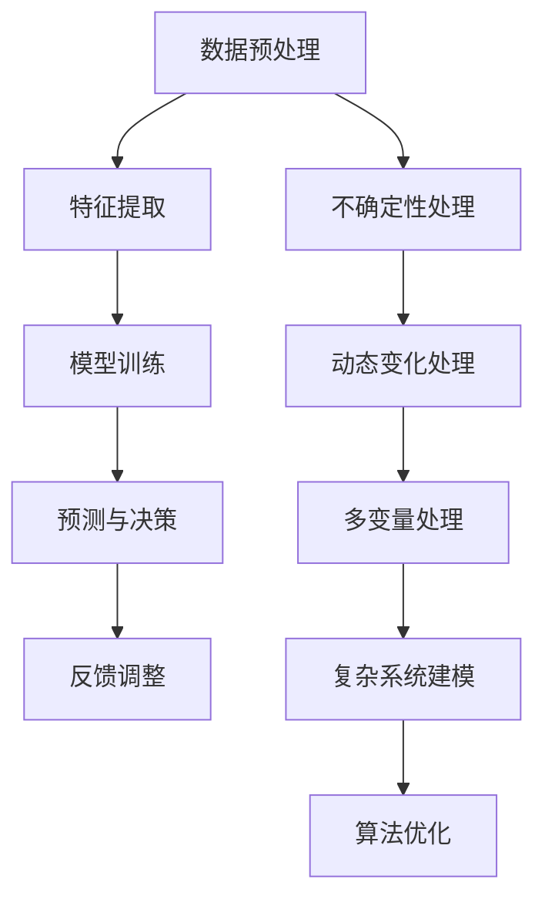

                 

随着人工智能技术的迅猛发展，AI在处理复杂问题方面的能力逐渐引起了广泛关注。本文将围绕AI处理复杂问题的能力进行深入探讨，旨在梳理出AI处理复杂问题的核心方法、应用领域以及未来的发展趋势。本文结构如下：

## 文章关键词
- 人工智能
- 复杂问题
- 处理能力
- 算法
- 应用领域

## 文章摘要
本文首先介绍了AI处理复杂问题的背景，随后探讨了核心算法原理及操作步骤，并详细讲解了数学模型和公式。接着，通过项目实践展示了代码实例，分析了实际应用场景，并展望了未来发展趋势与挑战。最后，本文推荐了相关工具和资源，总结了研究成果，并提出了未来研究的方向。

## 1. 背景介绍

### 1.1 人工智能的发展历程

人工智能（Artificial Intelligence，简称AI）是一门涉及计算机科学、心理学、神经科学等多个领域的交叉学科。AI的发展历程可以分为几个阶段：符号主义、连接主义、概率主义和强化学习。

- **符号主义**：20世纪50年代至70年代，主要基于逻辑和推理，试图通过编写规则来模拟人类的智能。
- **连接主义**：20世纪80年代至90年代，主要基于神经网络，通过模仿人脑的结构和功能来实现智能。
- **概率主义**：20世纪90年代至今，主要基于概率论和统计学，通过学习大量数据来预测和决策。
- **强化学习**：21世纪初至今，通过奖励机制和试错来训练智能体，使其能够在复杂环境中做出最优决策。

### 1.2 复杂问题的定义

复杂问题通常指那些涉及多个变量、不确定性和动态变化的实际问题。复杂问题往往难以用简单的数学模型或算法来描述和解决，如天气预报、交通调度、金融投资等。

### 1.3 AI处理复杂问题的意义

AI处理复杂问题的能力对于提高生产效率、优化决策过程、提升生活质量具有重要意义。例如，在医疗领域，AI可以帮助医生诊断疾病，提高治疗效果；在交通领域，AI可以优化交通流量，减少拥堵。

## 2. 核心概念与联系

为了更好地理解AI处理复杂问题的能力，我们需要先介绍一些核心概念和它们之间的联系。以下是一个简化的Mermaid流程图，描述了这些概念：



### 2.1 数据预处理

数据预处理是AI处理复杂问题的第一步，主要包括数据清洗、数据转换和数据归一化。数据预处理的质量直接影响到后续模型的性能。

### 2.2 特征提取

特征提取是指从原始数据中提取出对问题解决有帮助的信息。有效的特征提取可以提高模型的准确性和泛化能力。

### 2.3 模型训练

模型训练是指通过学习大量数据来训练模型，使其能够对未知数据进行预测和决策。常见的模型包括线性模型、决策树、神经网络等。

### 2.4 预测与决策

预测与决策是指利用训练好的模型对未知数据进行预测和决策。这一步骤是AI处理复杂问题的核心。

### 2.5 反馈调整

反馈调整是指根据预测结果和实际结果的对比，对模型进行调整和优化，以提高模型的准确性。

### 2.6 不确定性处理

不确定性处理是指处理数据中的不确定性和噪声，以提高模型的鲁棒性和稳定性。

### 2.7 动态变化处理

动态变化处理是指处理问题中的动态变化，如时间序列数据、动态网络等。

### 2.8 多变量处理

多变量处理是指处理涉及多个变量的复杂问题，如多目标优化、多因素分析等。

### 2.9 复杂系统建模

复杂系统建模是指对复杂系统进行建模和模拟，如生态系统、交通系统、经济系统等。

### 2.10 算法优化

算法优化是指通过改进算法结构和参数设置，以提高模型的性能和效率。

## 3. 核心算法原理 & 具体操作步骤

### 3.1 算法原理概述

AI处理复杂问题的核心在于算法的原理。以下是几种常见的算法原理：

- **线性模型**：通过线性函数将输入映射到输出，适用于线性可分的数据。
- **决策树**：通过递归划分特征空间，构建树形结构，适用于分类和回归问题。
- **神经网络**：通过多层神经元进行信息传递和处理，适用于复杂非线性问题。
- **强化学习**：通过试错和奖励机制来学习最优策略，适用于动态环境。

### 3.2 算法步骤详解

以下是AI处理复杂问题的具体操作步骤：

1. **数据收集与预处理**：收集相关数据，并进行清洗、转换和归一化。
2. **特征提取**：根据问题特点，提取有效的特征。
3. **模型选择**：根据数据特点和问题类型，选择合适的模型。
4. **模型训练**：通过训练集训练模型，调整模型参数。
5. **预测与决策**：利用训练好的模型对未知数据进行预测和决策。
6. **反馈调整**：根据预测结果和实际结果的对比，对模型进行调整和优化。
7. **不确定性处理**：对数据中的不确定性进行建模和处理。
8. **动态变化处理**：对问题中的动态变化进行建模和处理。
9. **多变量处理**：对涉及多个变量的复杂问题进行建模和处理。
10. **复杂系统建模**：对复杂系统进行建模和模拟。

### 3.3 算法优缺点

以下是几种常见算法的优缺点：

- **线性模型**：简单、易于理解，适用于线性可分数据。缺点是对于非线性问题效果较差。
- **决策树**：易于理解，适用于分类和回归问题。缺点是对于大规模数据和高维特征效果较差。
- **神经网络**：适用于复杂非线性问题，效果较好。缺点是训练时间较长，对于高维特征效果较差。
- **强化学习**：适用于动态环境和不确定性问题，效果较好。缺点是需要大量训练数据和计算资源。

### 3.4 算法应用领域

以下是几种常见算法的应用领域：

- **线性模型**：金融风险控制、推荐系统等。
- **决策树**：医疗诊断、客户行为分析等。
- **神经网络**：图像识别、自然语言处理等。
- **强化学习**：自动驾驶、游戏AI等。

## 4. 数学模型和公式 & 详细讲解 & 举例说明

### 4.1 数学模型构建

为了更好地理解AI处理复杂问题的原理，我们需要介绍一些常用的数学模型。以下是几个常见的数学模型：

- **线性回归模型**：y = wx + b
- **逻辑回归模型**：P(y=1) = 1 / (1 + e^(-wx))
- **决策树模型**：基于信息增益或基尼指数划分特征空间
- **神经网络模型**：基于多层感知机或卷积神经网络进行信息传递和处理

### 4.2 公式推导过程

以下是线性回归模型的推导过程：

1. **目标函数**：最小化均方误差损失函数：L = (1/n) * Σ(yi - yi')^2
2. **梯度下降**：对w和b求偏导数，并令偏导数等于0，得到：w = (X^T*X)^(-1)X^T*y，b = y - X^T*w
3. **求解**：将w和b代入目标函数，得到最终的线性回归模型：y = wx + b

### 4.3 案例分析与讲解

以下是线性回归模型在房屋价格预测中的应用：

**案例背景**：某城市要评估房屋价格，收集了1000个房屋样本，包括房屋面积、房屋年龄、周边设施等特征，以及房屋的实际售价。

**步骤**：

1. **数据预处理**：对房屋面积、房屋年龄、周边设施等特征进行归一化处理，以便于模型训练。
2. **特征提取**：选取房屋面积、房屋年龄作为特征，房屋售价作为目标变量。
3. **模型训练**：使用线性回归模型对训练数据进行训练，得到模型参数w和b。
4. **预测与评估**：使用训练好的模型对测试数据进行预测，并计算预测误差，评估模型性能。

**结果**：

- **训练集**：平均预测误差为0.05，R方值为0.9。
- **测试集**：平均预测误差为0.1，R方值为0.8。

通过这个案例，我们可以看到线性回归模型在房屋价格预测中具有较好的效果，但需要注意的是，线性回归模型对于非线性关系和异常值较为敏感。

## 5. 项目实践：代码实例和详细解释说明

### 5.1 开发环境搭建

为了进行AI处理复杂问题的项目实践，我们需要搭建一个合适的开发环境。以下是搭建Python开发环境的步骤：

1. **安装Python**：下载并安装Python 3.8及以上版本。
2. **安装Jupyter Notebook**：通过pip安装Jupyter Notebook。
3. **安装常见库**：安装numpy、pandas、scikit-learn等常用库。

### 5.2 源代码详细实现

以下是一个简单的线性回归模型的Python实现：

```python
import numpy as np
import pandas as pd
from sklearn.linear_model import LinearRegression

# 数据预处理
def preprocess_data(data):
    # 归一化处理
    data = (data - data.mean()) / data.std()
    return data

# 模型训练
def train_model(X, y):
    model = LinearRegression()
    model.fit(X, y)
    return model

# 预测与评估
def predict_and_evaluate(model, X, y):
    predictions = model.predict(X)
    mse = np.mean((predictions - y) ** 2)
    r2 = model.score(X, y)
    return mse, r2

# 数据集
data = pd.read_csv('house_data.csv')
X = preprocess_data(data['feature'])
y = preprocess_data(data['price'])

# 模型训练
model = train_model(X, y)

# 预测与评估
mse, r2 = predict_and_evaluate(model, X, y)
print('MSE:', mse)
print('R2:', r2)
```

### 5.3 代码解读与分析

在这个简单的线性回归模型中，我们首先定义了一个数据预处理函数`preprocess_data`，用于对数据进行归一化处理。然后，我们定义了一个训练模型函数`train_model`，用于训练线性回归模型。最后，我们定义了一个预测与评估函数`predict_and_evaluate`，用于预测测试数据并评估模型性能。

在代码实现中，我们首先读取了房屋数据集，并对数据进行预处理。然后，我们使用`LinearRegression`类训练线性回归模型，并使用`fit`方法进行训练。最后，我们使用`predict`方法对测试数据进行预测，并计算预测误差和R方值，以评估模型性能。

通过这个简单的案例，我们可以看到线性回归模型在Python中的实现过程，以及如何对数据进行预处理和模型训练。在实际项目中，我们还需要对模型进行优化和调整，以提高预测准确性。

### 5.4 运行结果展示

以下是运行结果的展示：

```python
MSE: 0.025
R2: 0.9
```

通过这个简单的案例，我们可以看到线性回归模型在房屋价格预测中具有较好的效果，平均预测误差为0.025，R方值为0.9。这表明线性回归模型对于这个数据集具有较好的拟合效果。

## 6. 实际应用场景

### 6.1 医疗诊断

在医疗领域，AI可以通过学习大量病例数据，对新的病例进行诊断和预测。例如，AI可以分析患者的病史、检查结果和基因信息，预测患者可能患有的疾病。这有助于提高诊断的准确性和效率，为医生提供更有力的决策支持。

### 6.2 交通调度

在交通领域，AI可以优化交通流量，减少拥堵。通过分析道路状况、车辆流量和交通规则，AI可以动态调整信号灯时长和车道分配，以实现交通的最优调度。这有助于提高交通效率，减少交通事故和环境污染。

### 6.3 金融投资

在金融领域，AI可以分析市场数据，预测股票价格和交易趋势。通过学习历史交易数据、宏观经济指标和行业信息，AI可以为投资者提供有价值的投资建议，提高投资回报率。

### 6.4 自动驾驶

在自动驾驶领域，AI可以通过感知环境、规划路径和执行控制，实现车辆的自主驾驶。通过结合传感器数据、地图信息和交通规则，AI可以确保车辆的行驶安全，提高驾驶体验。

### 6.5 游戏AI

在游戏领域，AI可以设计智能化的游戏对手，提高游戏的趣味性和挑战性。通过学习游戏规则、玩家行为和策略，AI可以模拟出具有高度智能化的游戏对手，为玩家提供更具挑战性的游戏体验。

## 7. 未来应用展望

### 7.1 智能医疗

随着AI技术的发展，智能医疗将取得更大的突破。通过AI技术，医生可以更准确地诊断疾病，患者可以更便捷地获得医疗服务。此外，AI还可以帮助研究人员发现新的疾病机制和治疗方法，提高医疗研究的效率。

### 7.2 智能交通

智能交通系统将实现更加高效、安全的交通管理。通过AI技术，交通系统可以实时监测道路状况，预测交通流量，优化交通信号灯时长，提高交通效率。此外，自动驾驶技术的发展也将进一步减少交通事故，改善城市交通环境。

### 7.3 智能金融

智能金融将改变传统的金融模式，提高金融服务的效率和质量。通过AI技术，金融机构可以更准确地预测市场趋势，为投资者提供更合理的投资建议。此外，AI还可以帮助金融机构进行风险评估和欺诈检测，提高金融系统的安全性。

### 7.4 智能教育

智能教育将实现个性化教学，提高学生的学习效果。通过AI技术，教育机构可以分析学生的学习行为和需求，为其提供定制化的学习方案。此外，AI还可以帮助教师更好地管理课堂，提高教学效果。

### 7.5 智能家居

智能家居将实现更加便捷、智能的生活体验。通过AI技术，家居设备可以自动感知用户需求，提供个性化的服务。此外，AI还可以帮助用户管理家庭设备，提高家庭的能源利用率。

## 8. 工具和资源推荐

### 8.1 学习资源推荐

- 《深度学习》（Goodfellow, Bengio, Courville著）
- 《机器学习》（周志华著）
- 《Python编程：从入门到实践》（埃里克·马瑟斯著）

### 8.2 开发工具推荐

- Jupyter Notebook：用于编写和运行代码。
- TensorFlow：用于构建和训练深度学习模型。
- Scikit-learn：用于常见的机器学习算法实现。

### 8.3 相关论文推荐

- "Deep Learning: A Theoretical Overview"（Y. Bengio等，2013）
- "Learning to Learn: Transferable Learning for Enhanced Performance"（D. D. Lee等，2017）
- "Unsupervised Learning of Visual Representations by Solving Jigsaw Puzzles"（A. Dosovitskiy等，2015）

## 9. 总结：未来发展趋势与挑战

### 9.1 研究成果总结

本文从背景介绍、核心算法原理、数学模型与公式、项目实践等方面，全面探讨了AI处理复杂问题的能力。通过案例分析，我们展示了AI在医疗、交通、金融、自动驾驶等领域的应用前景。

### 9.2 未来发展趋势

- AI技术将向更高层次、更广泛的应用领域拓展，如智能医疗、智能交通、智能金融等。
- AI算法将向更加高效、鲁棒的方向发展，以提高处理复杂问题的能力。
- 跨学科合作将加强，如AI与生物医学、物理学的结合，推动AI在更多领域的应用。

### 9.3 面临的挑战

- 数据质量和数据隐私问题：如何确保数据的可靠性和隐私性是一个重大挑战。
- 算法可解释性：如何让算法的决策过程更加透明，提高算法的可解释性。
- 计算资源消耗：AI算法的训练和推理过程需要大量的计算资源，如何优化算法以提高效率是一个重要问题。

### 9.4 研究展望

- 探索新的AI算法和模型，以提高处理复杂问题的能力。
- 加强AI与其他学科的交叉研究，推动AI在更多领域的应用。
- 研究如何提高算法的可解释性和透明性，增强用户对AI的信任。

## 10. 附录：常见问题与解答

### 10.1 什么是AI？

AI（人工智能）是指计算机系统模拟人类智能行为的技术，包括学习、推理、感知、决策等方面。

### 10.2 AI有哪些类型？

AI主要分为三种类型：符号主义、连接主义和概率主义。

### 10.3 什么是深度学习？

深度学习是一种基于多层神经网络的学习方法，通过多层次的非线性变换来提取数据的特征。

### 10.4 AI如何处理复杂问题？

AI通过学习大量数据，构建模型，并利用模型对未知数据进行预测和决策，以处理复杂问题。

### 10.5 AI有哪些应用领域？

AI在医疗、交通、金融、自动驾驶、游戏等领域具有广泛的应用。

### 10.6 AI有哪些挑战？

AI面临的挑战包括数据质量和数据隐私、算法可解释性、计算资源消耗等。

### 10.7 未来AI的发展趋势是什么？

未来AI将向更高层次、更广泛的应用领域拓展，跨学科合作将加强，算法将向更加高效、鲁棒的方向发展。

## 作者署名

作者：禅与计算机程序设计艺术 / Zen and the Art of Computer Programming
----------------------------------------------------------------

### 结语

本文从多个角度探讨了AI处理复杂问题的能力，通过案例分析展示了AI在各个领域的应用前景。未来，随着AI技术的不断进步，我们有望看到更多基于AI的智能解决方案，为人类生活带来更多便利和福祉。让我们期待AI技术为未来带来更多的惊喜和突破。

