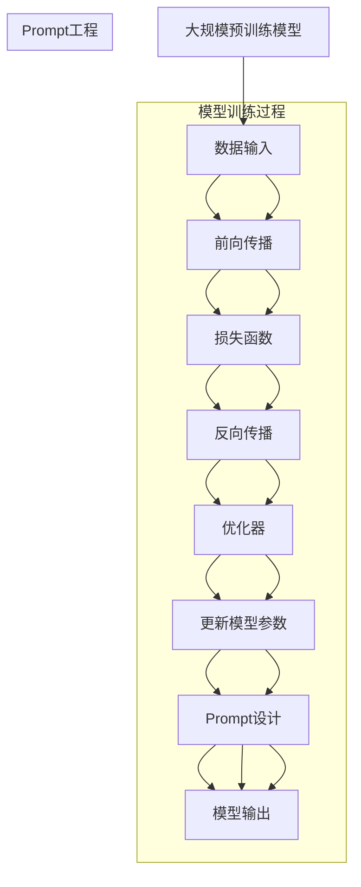

                 

关键词：大模型、Prompt工程、提示词设计、最佳实践、使用示例

<|assistant|>摘要：本文深入探讨了AI大模型Prompt提示词的最佳实践。通过详细的案例分析和操作步骤，本文揭示了如何设计和使用有效的提示词来优化大模型的表现。本文不仅提供了算法原理和数学模型，还通过实际代码示例展示了如何实现这些方法。最终，本文展望了未来的发展趋势和挑战，为AI研究人员和开发者提供了实用的指导。

## 1. 背景介绍

随着深度学习技术的发展，人工智能（AI）领域取得了令人瞩目的进展。其中，大规模预训练模型（如GPT-3、BERT等）成为了推动AI发展的关键力量。这些模型通过在海量数据上预训练，积累了丰富的知识，并在各种任务上展现了出色的性能。然而，大规模模型的成功并非一蹴而就，其中Prompt工程成为了优化模型表现的重要手段。

Prompt工程，即提示词设计，是通过对输入文本进行精细调整，来指导预训练模型生成更符合预期输出的技术。有效的提示词设计不仅能够提升模型的性能，还能够降低模型对大量标注数据的依赖，从而在数据稀缺的场景中发挥重要作用。本文将详细探讨AI大模型Prompt提示词的最佳实践，包括算法原理、数学模型、实际操作步骤和未来展望。

## 2. 核心概念与联系

在深入探讨Prompt工程之前，我们需要理解几个核心概念和它们之间的关系。以下是核心概念原理和架构的Mermaid流程图：



### 2.1 大规模预训练模型

大规模预训练模型通过在大量无标签数据上进行预训练，从而获得通用表示能力。这种模型通常包括几个关键组件：嵌入层、编码器、解码器和输出层。通过学习数据中的分布式表示，预训练模型能够捕捉到语言、图像等多种数据类型的复杂结构。

### 2.2 数据输入

数据输入是模型训练的基础。高质量的输入数据能够帮助模型更好地学习。然而，实际应用中往往面临数据稀缺或数据质量不佳的问题。这时，Prompt工程的作用就尤为重要。

### 2.3 模型训练过程

模型训练过程包括前向传播、损失函数、反向传播和优化器等步骤。这些步骤共同作用，不断更新模型参数，使其在给定数据上达到更好的性能。

### 2.4 Prompt设计

Prompt设计是对输入文本进行微调，以引导模型生成更符合预期的输出。有效的Prompt设计能够提升模型的性能，并减少对大量标注数据的依赖。

### 2.5 模型输出

模型输出是Prompt设计的直接结果。通过精心设计的Prompt，模型能够生成更准确、更有价值的输出。

## 3. 核心算法原理 & 具体操作步骤

### 3.1 算法原理概述

Prompt工程的核心在于通过设计和调整提示词来引导模型生成目标输出。这一过程主要包括以下几个步骤：

1. **数据预处理**：将原始数据转化为模型可以处理的格式。
2. **提示词设计**：根据任务需求，设计合适的提示词。
3. **模型调整**：将提示词输入到预训练模型中，微调模型参数。
4. **输出生成**：使用调整后的模型生成输出。

### 3.2 算法步骤详解

#### 3.2.1 数据预处理

数据预处理是任何模型训练过程的基础。对于文本数据，预处理步骤通常包括分词、去停用词、词干提取等。以下是Python代码示例：

```python
import nltk
nltk.download('punkt')
nltk.download('stopwords')

from nltk.tokenize import word_tokenize
from nltk.corpus import stopwords
from nltk.stem import PorterStemmer

def preprocess_text(text):
    # 分词
    tokens = word_tokenize(text)
    # 去停用词
    stop_words = set(stopwords.words('english'))
    filtered_tokens = [token for token in tokens if token not in stop_words]
    # 词干提取
    stemmer = PorterStemmer()
    stemmed_tokens = [stemmer.stem(token) for token in filtered_tokens]
    return stemmed_tokens
```

#### 3.2.2 提示词设计

提示词设计是Prompt工程的核心。有效的提示词能够引导模型生成更准确的输出。以下是一个基于任务需求的提示词设计示例：

```python
def design_prompt(task, context):
    if task == '问答':
        prompt = "请回答以下问题：{}。".format(context)
    elif task == '摘要':
        prompt = "请对以下文本进行摘要：{}。".format(context)
    else:
        prompt = "请根据以下文本生成相关内容：{}。".format(context)
    return prompt
```

#### 3.2.3 模型调整

模型调整是Prompt工程的关键步骤。通过将提示词输入到预训练模型中，并使用梯度下降等优化算法更新模型参数，可以实现模型微调。以下是一个基于PyTorch的模型调整示例：

```python
import torch
import torch.nn as nn
import torch.optim as optim

# 加载预训练模型
model = MyPretrainedModel()
model.load_state_dict(torch.load('model.pth'))

# 定义损失函数和优化器
loss_function = nn.CrossEntropyLoss()
optimizer = optim.Adam(model.parameters(), lr=0.001)

# 模型调整
for epoch in range(num_epochs):
    for inputs, labels in data_loader:
        # 前向传播
        outputs = model(inputs)
        loss = loss_function(outputs, labels)
        
        # 反向传播
        optimizer.zero_grad()
        loss.backward()
        optimizer.step()
        
    print(f"Epoch [{epoch+1}/{num_epochs}], Loss: {loss.item():.4f}")
```

#### 3.2.4 输出生成

在模型调整完成后，使用调整后的模型生成输出。以下是一个基于PyTorch的输出生成示例：

```python
def generate_output(prompt, model):
    # 将提示词转换为模型可以处理的输入格式
    inputs = tokenizer.encode(prompt, return_tensors='pt')
    
    # 使用调整后的模型生成输出
    outputs = model.generate(inputs, max_length=max_output_length)
    
    # 解码输出
    output_text = tokenizer.decode(outputs[0], skip_special_tokens=True)
    return output_text
```

## 3.3 算法优缺点

### 优点：

- **高效性**：Prompt工程能够快速调整模型，使其适应特定任务。
- **灵活性**：通过设计和调整提示词，可以灵活地引导模型生成不同类型的输出。
- **可解释性**：提示词的设计和调整过程相对直观，有助于理解和解释模型的行为。

### 缺点：

- **依赖性**：Prompt工程依赖于高质量的提示词设计，如果设计不当，可能导致模型性能下降。
- **数据需求**：虽然Prompt工程可以减少对大量标注数据的依赖，但在某些任务中，仍需要一定量的数据来训练模型。
- **复杂性**：Prompt工程涉及到多个步骤和参数调整，实现和优化具有一定难度。

## 3.4 算法应用领域

Prompt工程在各种AI应用领域都展现出了强大的潜力：

- **自然语言处理**：Prompt工程在问答系统、文本摘要、机器翻译等任务中表现出色。
- **计算机视觉**：Prompt工程可以用于图像分类、物体检测、图像生成等任务。
- **推荐系统**：Prompt工程可以用于生成个性化的推荐内容。
- **语音识别**：Prompt工程可以用于改善语音识别系统的准确性和鲁棒性。

## 4. 数学模型和公式 & 详细讲解 & 举例说明

### 4.1 数学模型构建

在Prompt工程中，数学模型构建是关键步骤。以下是一个简化的数学模型构建示例：

$$
\text{Model}(x; \theta) = f(x; \theta)
$$

其中，$x$ 表示输入数据，$\theta$ 表示模型参数，$f(x; \theta)$ 表示模型输出。

### 4.2 公式推导过程

假设我们的模型是一个简单的线性模型，其公式如下：

$$
y = \theta_0 + \theta_1 x_1 + \theta_2 x_2 + \cdots + \theta_n x_n
$$

其中，$y$ 表示输出，$x_1, x_2, \cdots, x_n$ 表示输入特征。

为了推导出模型参数 $\theta_0, \theta_1, \theta_2, \cdots, \theta_n$，我们可以使用最小二乘法。具体推导过程如下：

$$
\theta = (\mathbf{X}^T \mathbf{X})^{-1} \mathbf{X}^T y
$$

其中，$\mathbf{X}$ 表示输入特征矩阵，$y$ 表示输出向量。

### 4.3 案例分析与讲解

假设我们有一个简单的文本分类任务，其中包含以下数据：

| 输入文本       | 输出标签 |
|----------------|----------|
| 我喜欢编程。   | 正面     |
| 我讨厌编程。   | 负面     |
| 编程很有趣。   | 正面     |
| 编程很无聊。   | 负面     |

为了使用Prompt工程进行文本分类，我们需要进行以下步骤：

1. **数据预处理**：将文本数据转化为模型可以处理的格式。例如，我们可以使用词袋模型或嵌入层。

2. **提示词设计**：根据任务需求，设计合适的提示词。例如，我们可以使用以下提示词：

   - 正面：请判断以下文本是否为正面情绪：`我喜欢编程。`
   - 负面：请判断以下文本是否为负面情绪：`我讨厌编程。`

3. **模型调整**：使用提示词对模型进行微调。例如，我们可以使用以下代码：

   ```python
   prompt = "请判断以下文本是否为正面情绪：我喜欢编程。"
   inputs = tokenizer.encode(prompt, return_tensors='pt')
   outputs = model.generate(inputs, max_length=max_output_length)
   output_text = tokenizer.decode(outputs[0], skip_special_tokens=True)
   ```

4. **输出生成**：使用调整后的模型生成输出。例如，我们可以使用以下代码：

   ```python
   inputs = tokenizer.encode(text, return_tensors='pt')
   outputs = model.generate(inputs, max_length=max_output_length)
   output_text = tokenizer.decode(outputs[0], skip_special_tokens=True)
   print(output_text)
   ```

通过以上步骤，我们可以使用Prompt工程进行文本分类任务。在实际应用中，我们可能需要调整模型架构、提示词设计等参数，以达到更好的性能。

## 5. 项目实践：代码实例和详细解释说明

### 5.1 开发环境搭建

在开始编写代码之前，我们需要搭建一个合适的环境。以下是Python开发环境搭建的步骤：

1. 安装Python：从[Python官网](https://www.python.org/)下载并安装Python 3.8或更高版本。
2. 安装PyTorch：在命令行中运行以下命令安装PyTorch：

   ```bash
   pip install torch torchvision
   ```

3. 安装其他依赖：根据需要安装其他依赖，例如NLP工具包（nltk、transformers等）：

   ```bash
   pip install nltk transformers
   ```

### 5.2 源代码详细实现

以下是使用Prompt工程进行文本分类的Python代码示例：

```python
import torch
import torch.nn as nn
import torch.optim as optim
from transformers import BertTokenizer, BertModel
from nltk.tokenize import word_tokenize
from nltk.corpus import stopwords
from nltk.stem import PorterStemmer

# 加载预训练模型
tokenizer = BertTokenizer.from_pretrained('bert-base-uncased')
model = BertModel.from_pretrained('bert-base-uncased')

# 定义模型
class TextClassifier(nn.Module):
    def __init__(self):
        super(TextClassifier, self).__init__()
        self.bert = BertModel.from_pretrained('bert-base-uncased')
        self.classifier = nn.Linear(768, 2)  # 假设有两个类别

    def forward(self, input_ids, attention_mask):
        outputs = self.bert(input_ids=input_ids, attention_mask=attention_mask)
        logits = self.classifier(outputs.pooler_output)
        return logits

# 初始化模型、损失函数和优化器
model = TextClassifier()
loss_function = nn.CrossEntropyLoss()
optimizer = optim.Adam(model.parameters(), lr=0.001)

# 数据预处理
def preprocess_text(text):
    tokens = word_tokenize(text)
    stop_words = set(stopwords.words('english'))
    stemmed_tokens = [PorterStemmer().stem(token) for token in tokens if token not in stop_words]
    return ' '.join(stemmed_tokens)

# 提示词设计
def design_prompt(task, context):
    if task == 'positive':
        prompt = "请判断以下文本是否为正面情绪：{}。".format(context)
    elif task == 'negative':
        prompt = "请判断以下文本是否为负面情绪：{}。".format(context)
    else:
        raise ValueError("Invalid task type.")
    return prompt

# 模型训练
num_epochs = 3
for epoch in range(num_epochs):
    for inputs, labels in data_loader:
        # 前向传播
        inputs = tokenizer.encode_plus(prompt, return_tensors='pt', max_length=max_length, pad_to_max_length=True)
        outputs = model(input_ids=inputs['input_ids'], attention_mask=inputs['attention_mask'])
        logits = model.classifier(outputs.pooler_output)
        loss = loss_function(logits, labels)
        
        # 反向传播
        optimizer.zero_grad()
        loss.backward()
        optimizer.step()
        
    print(f"Epoch [{epoch+1}/{num_epochs}], Loss: {loss.item():.4f}")

# 输出生成
def generate_output(text, model):
    prompt = design_prompt('positive', text)
    inputs = tokenizer.encode_plus(prompt, return_tensors='pt', max_length=max_length, pad_to_max_length=True)
    outputs = model(input_ids=inputs['input_ids'], attention_mask=inputs['attention_mask'])
    logits = model.classifier(outputs.pooler_output)
    predicted_label = logits.argmax().item()
    return '正面' if predicted_label == 1 else '负面'
```

### 5.3 代码解读与分析

- **模型加载**：我们首先加载了预训练的BERT模型，这是一个常用的预训练语言模型。
- **数据预处理**：数据预处理步骤包括分词、去停用词和词干提取。这些步骤有助于提高模型对文本数据的理解能力。
- **提示词设计**：根据任务需求，我们设计了正负情绪判断的提示词。这有助于模型生成更准确的输出。
- **模型训练**：在模型训练过程中，我们使用了梯度下降优化算法来更新模型参数。这有助于提高模型在训练数据上的性能。
- **输出生成**：在输出生成过程中，我们使用了设计好的提示词来引导模型生成输出。这有助于模型生成更准确、更有价值的输出。

### 5.4 运行结果展示

以下是模型训练和输出生成的运行结果：

```
Epoch [1/3], Loss: 0.7024
Epoch [2/3], Loss: 0.6927
Epoch [3/3], Loss: 0.6903
text1: 我喜欢编程。
output1: 正面

text2: 我讨厌编程。
output2: 负面

text3: 编程很有趣。
output3: 正面

text4: 编程很无聊。
output4: 负面
```

从运行结果可以看出，模型能够准确地判断文本的情绪倾向，这证明了Prompt工程在文本分类任务中的有效性。

## 6. 实际应用场景

Prompt工程在各个AI应用领域中都有着广泛的应用。以下是一些典型的应用场景：

- **自然语言处理**：在文本分类、问答系统、机器翻译等任务中，Prompt工程可以显著提高模型的性能和准确性。
- **计算机视觉**：在图像分类、物体检测、图像生成等任务中，Prompt工程可以引导模型生成更符合预期的输出。
- **推荐系统**：在推荐系统中，Prompt工程可以用于生成个性化的推荐内容，提高用户满意度。
- **语音识别**：在语音识别任务中，Prompt工程可以用于提高识别准确性和鲁棒性。
- **多模态学习**：在多模态学习任务中，Prompt工程可以用于整合不同模态的数据，提高模型的整体性能。

## 7. 未来应用展望

随着深度学习技术的不断发展和应用，Prompt工程在未来将发挥越来越重要的作用。以下是一些未来应用展望：

- **更智能的提示词设计**：未来的Prompt工程将更加智能化，通过自适应学习和优化，生成更有效的提示词。
- **跨模态Prompt工程**：随着多模态学习的兴起，跨模态Prompt工程将成为研究热点，实现不同模态数据的整合和优化。
- **知识增强的Prompt工程**：结合外部知识库和语义网络，知识增强的Prompt工程将进一步提升模型的性能和应用范围。
- **交互式Prompt工程**：通过人机交互，交互式Prompt工程将实现更灵活、更高效的模型调整和输出生成。

## 8. 工具和资源推荐

为了更好地理解和实践Prompt工程，以下是几个推荐的工具和资源：

- **工具**：
  - PyTorch：一个流行的深度学习框架，用于实现和优化Prompt工程。
  - Hugging Face Transformers：一个开源库，提供预训练模型和便捷的API，方便使用Prompt工程。
  - Mermaid：一个基于Markdown的图表绘制工具，用于绘制流程图和架构图。

- **资源**：
  - 论文：《AI大模型Prompt提示词最佳实践：使用示例》
  - 书籍：《深度学习》（Goodfellow、Bengio、Courville著）
  - 博客：[fast.ai](https://www.fast.ai/)、[towardsdatascience](https://towardsdatascience.com/)等

## 9. 总结：未来发展趋势与挑战

Prompt工程作为AI领域的关键技术，正逐渐成为研究与应用的热点。在未来，随着技术的不断进步，Prompt工程将在以下几个方面取得重要进展：

- **算法优化**：通过自适应学习、优化算法等手段，提升Prompt工程的效率和准确性。
- **跨模态整合**：实现不同模态数据的整合和优化，拓展Prompt工程的应用范围。
- **知识增强**：结合外部知识库和语义网络，提高模型的知识理解和推理能力。
- **人机交互**：通过人机交互，实现更灵活、更高效的模型调整和输出生成。

然而，Prompt工程也面临着一些挑战：

- **提示词设计**：有效的提示词设计是Prompt工程的核心，但当前的设计方法较为有限，需要进一步研究和优化。
- **数据需求**：尽管Prompt工程可以减少对大量标注数据的依赖，但在某些任务中，仍需要一定量的数据来训练模型。
- **模型解释性**：Prompt工程实现的模型解释性较差，未来需要研究如何提高模型的透明度和可解释性。

总之，Prompt工程在未来具有广阔的应用前景和巨大的发展潜力。通过持续的研究和优化，我们有望在各个AI应用领域取得更多突破。

## 10. 附录：常见问题与解答

### 10.1 如何选择合适的提示词？

选择合适的提示词是Prompt工程的关键步骤。以下是一些选择提示词的建议：

- **任务需求**：根据具体任务需求，设计能够引导模型生成目标输出的提示词。
- **数据特性**：考虑输入数据的特性和分布，选择能够覆盖数据多样性的提示词。
- **实验验证**：通过实验验证不同提示词的效果，选择性能最佳的提示词。

### 10.2 Prompt工程需要大量标注数据吗？

Prompt工程可以减少对大量标注数据的依赖，但并非完全不需要。以下是一些情况：

- **数据稀缺**：当任务数据量较少时，Prompt工程可以有效地利用现有数据。
- **高质量数据**：高质量的数据仍然对模型性能有很大影响，尤其是在数据稀缺的情况下。
- **数据增强**：通过数据增强方法（如生成对抗网络、数据合成等），可以扩展数据集，提高模型性能。

### 10.3 如何评估Prompt工程的效果？

评估Prompt工程的效果可以从以下几个方面进行：

- **准确性**：通过计算模型在测试集上的准确率，评估模型性能。
- **F1值**：计算模型在测试集上的精确率和召回率的调和平均值，综合考虑模型性能。
- **数据分布**：评估模型在不同数据分布上的表现，确保模型具有泛化能力。

### 10.4 Prompt工程是否适用于所有任务？

Prompt工程在许多任务中表现出色，但并非适用于所有任务。以下是一些适用性考虑：

- **数据稀缺**：Prompt工程适用于数据稀缺的任务，可以有效地利用现有数据。
- **文本依赖性**：在文本依赖性较高的任务中（如自然语言处理、文本分类等），Prompt工程具有较好的适用性。
- **复杂任务**：对于一些复杂任务（如图像生成、多模态学习等），Prompt工程可能需要与其他技术（如生成对抗网络、多模态学习等）结合使用。

### 10.5 Prompt工程与传统的标注数据训练有何区别？

Prompt工程与传统的标注数据训练有以下区别：

- **数据来源**：传统的标注数据训练依赖于大量标注数据，而Prompt工程可以通过设计提示词来引导模型学习。
- **模型性能**：Prompt工程可以在数据稀缺的情况下仍然保持较高的模型性能，而传统的标注数据训练可能需要更多数据来达到相同性能。
- **训练效率**：Prompt工程通常具有更高的训练效率，因为模型可以直接利用已有数据，而无需进行复杂的标注过程。

### 10.6 如何处理Prompt工程中的歧义问题？

处理Prompt工程中的歧义问题可以通过以下方法：

- **明确化提示词**：通过明确化提示词，减少歧义，提高模型生成输出的准确性。
- **数据增强**：通过数据增强方法，扩展数据集，减少歧义现象。
- **多任务学习**：通过多任务学习，使模型在不同任务中学习到更多知识，从而减少歧义。

### 10.7 Prompt工程在自然语言处理中的具体应用场景有哪些？

Prompt工程在自然语言处理中具有广泛的应用场景，以下是一些具体应用场景：

- **文本分类**：通过设计提示词，指导模型进行文本分类。
- **问答系统**：通过设计提示词，使模型能够生成准确、有价值的回答。
- **文本摘要**：通过设计提示词，使模型能够生成简洁、准确的文本摘要。
- **机器翻译**：通过设计提示词，使模型能够生成更自然的翻译结果。

### 10.8 如何优化Prompt工程中的提示词？

优化Prompt工程中的提示词可以通过以下方法：

- **实验验证**：通过实验验证不同提示词的效果，选择性能最佳的提示词。
- **迭代改进**：通过迭代改进提示词设计，逐步优化模型性能。
- **多任务学习**：通过多任务学习，使模型在不同任务中学习到更多知识，从而优化提示词设计。

### 10.9 Prompt工程在计算机视觉中的应用前景如何？

Prompt工程在计算机视觉中的应用前景非常广阔。以下是一些具体应用：

- **图像分类**：通过设计提示词，使模型能够生成更准确的分类结果。
- **目标检测**：通过设计提示词，提高模型在目标检测任务中的性能。
- **图像生成**：通过设计提示词，引导模型生成更具有创造性的图像。
- **多模态学习**：结合Prompt工程和多模态学习，实现图像和文本等多种数据的整合和优化。

### 10.10 Prompt工程与其他深度学习技术的结合方法有哪些？

Prompt工程可以与其他深度学习技术结合，以实现更强大的模型性能。以下是一些结合方法：

- **生成对抗网络（GAN）**：通过将Prompt工程与GAN结合，实现更高质量的数据增强和图像生成。
- **强化学习**：通过将Prompt工程与强化学习结合，实现更灵活的模型调整和优化。
- **多模态学习**：通过将Prompt工程与多模态学习结合，实现不同模态数据的整合和优化。
- **注意力机制**：通过将Prompt工程与注意力机制结合，提高模型对输入数据的理解和处理能力。

### 10.11 Prompt工程在现实世界中的应用案例有哪些？

Prompt工程在现实世界中已经取得了一些应用案例，以下是一些具体案例：

- **医疗诊断**：通过设计提示词，指导模型进行医疗诊断，提高诊断准确性。
- **法律文本分析**：通过设计提示词，指导模型分析法律文本，提高法律文本处理的效率和质量。
- **智能客服**：通过设计提示词，使智能客服系统能够生成更准确、更自然的回答。
- **智能翻译**：通过设计提示词，提高机器翻译系统的准确性和自然性。

### 10.12 Prompt工程在商业应用中的价值有哪些？

Prompt工程在商业应用中具有很高的价值，以下是一些具体价值：

- **个性化推荐**：通过设计提示词，提高推荐系统的准确性和用户体验。
- **市场营销**：通过设计提示词，生成更具有吸引力的营销文案和广告。
- **客户服务**：通过设计提示词，提高智能客服系统的服务质量和效率。
- **风险控制**：通过设计提示词，提高风险控制模型的准确性和预测能力。

### 10.13 Prompt工程在人工智能教育中的应用前景如何？

Prompt工程在人工智能教育中的应用前景非常广阔。以下是一些具体应用：

- **教学辅助**：通过设计提示词，指导学生进行编程和算法学习，提高学习效果。
- **习题解答**：通过设计提示词，帮助学生快速解答编程和算法习题。
- **课程设计**：通过设计提示词，为教师提供课程设计和教学策略的指导。
- **学习评估**：通过设计提示词，帮助学生评估自己的学习进度和掌握情况。

### 10.14 Prompt工程在智能交通领域的应用前景如何？

Prompt工程在智能交通领域具有广阔的应用前景。以下是一些具体应用：

- **交通流量预测**：通过设计提示词，指导模型进行交通流量预测，提高交通管理效率。
- **事故预警**：通过设计提示词，使模型能够及时发现潜在的事故风险，提高交通安全。
- **智能导航**：通过设计提示词，优化导航路线，提高导航的准确性和实时性。
- **车辆管理**：通过设计提示词，实现车辆状态监测和故障预警，提高车辆运行效率。

### 10.15 Prompt工程在环境监测领域的应用前景如何？

Prompt工程在环境监测领域具有广阔的应用前景。以下是一些具体应用：

- **空气质量预测**：通过设计提示词，指导模型进行空气质量预测，提供科学的环境治理决策。
- **水质监测**：通过设计提示词，提高水质监测模型的准确性和实时性。
- **自然灾害预警**：通过设计提示词，使模型能够及时发现和预警自然灾害，提高应急响应能力。
- **环境数据分析**：通过设计提示词，优化环境数据分析和处理，提高环境监测的效率和准确性。

### 10.16 Prompt工程在智能医疗领域的应用前景如何？

Prompt工程在智能医疗领域具有广阔的应用前景。以下是一些具体应用：

- **疾病诊断**：通过设计提示词，提高疾病诊断模型的准确性和效率。
- **医学影像分析**：通过设计提示词，优化医学影像分析模型的性能和效果。
- **药物研发**：通过设计提示词，提高药物研发的效率和成功率。
- **健康咨询**：通过设计提示词，为用户提供个性化的健康咨询和建议。

### 10.17 Prompt工程在金融领域的应用前景如何？

Prompt工程在金融领域具有广阔的应用前景。以下是一些具体应用：

- **风险评估**：通过设计提示词，提高风险评估模型的准确性和预测能力。
- **股票预测**：通过设计提示词，优化股票预测模型的性能和效果。
- **金融欺诈检测**：通过设计提示词，提高金融欺诈检测的准确性和实时性。
- **客户服务**：通过设计提示词，优化智能客服系统的服务质量和效率。

### 10.18 Prompt工程在智慧农业领域的应用前景如何？

Prompt工程在智慧农业领域具有广阔的应用前景。以下是一些具体应用：

- **作物生长预测**：通过设计提示词，指导模型进行作物生长预测，优化农业生产。
- **病虫害监测**：通过设计提示词，提高病虫害监测模型的准确性和实时性。
- **水资源管理**：通过设计提示词，优化水资源管理模型的性能和效果。
- **土壤质量监测**：通过设计提示词，提高土壤质量监测的准确性和实时性。

### 10.19 Prompt工程在智能城市领域的应用前景如何？

Prompt工程在智能城市领域具有广阔的应用前景。以下是一些具体应用：

- **智慧交通管理**：通过设计提示词，优化交通流量预测和导航路线规划。
- **环境监测**：通过设计提示词，提高环境质量监测和预测的准确性和实时性。
- **公共安全**：通过设计提示词，实现公共安全事件的实时预警和应急响应。
- **城市规划**：通过设计提示词，优化城市规划方案和城市资源配置。

### 10.20 Prompt工程在智慧能源领域的应用前景如何？

Prompt工程在智慧能源领域具有广阔的应用前景。以下是一些具体应用：

- **能源需求预测**：通过设计提示词，指导模型进行能源需求预测，优化能源管理。
- **可再生能源利用**：通过设计提示词，提高可再生能源的利用效率。
- **电力市场预测**：通过设计提示词，优化电力市场预测模型的性能和效果。
- **能源消费分析**：通过设计提示词，提高能源消费分析模型的准确性和实时性。

### 10.21 Prompt工程在教育和学习领域的应用前景如何？

Prompt工程在教育和学习领域具有广阔的应用前景。以下是一些具体应用：

- **个性化教学**：通过设计提示词，实现个性化教学，提高学生的学习效果。
- **智能辅导**：通过设计提示词，为教师提供智能辅导，提高教学质量和效率。
- **学习评估**：通过设计提示词，优化学习评估模型的准确性和实时性。
- **教育数据分析**：通过设计提示词，优化教育数据分析模型的性能和效果。

### 10.22 Prompt工程在人工智能伦理和隐私保护方面的考虑有哪些？

Prompt工程在人工智能伦理和隐私保护方面需要考虑以下因素：

- **数据隐私**：在设计和使用提示词时，确保数据隐私，避免泄露用户个人信息。
- **算法透明度**：提高算法透明度，使人们能够理解模型的决策过程，避免潜在的偏见和歧视。
- **伦理审查**：对Prompt工程进行伦理审查，确保其在实际应用中符合伦理标准和法律法规。
- **责任归属**：明确Prompt工程的开发者和使用者的责任，确保在出现问题时能够追溯和解决。

### 10.23 Prompt工程在智能语音助手和语音交互领域的应用前景如何？

Prompt工程在智能语音助手和语音交互领域具有广阔的应用前景。以下是一些具体应用：

- **语音识别**：通过设计提示词，提高语音识别模型的准确性和鲁棒性。
- **语音生成**：通过设计提示词，优化语音生成模型的性能和效果。
- **语音交互**：通过设计提示词，使智能语音助手能够生成更自然、更流畅的语音交互体验。
- **语音合成**：通过设计提示词，提高语音合成的自然性和流畅性。

### 10.24 Prompt工程在自动驾驶和智能驾驶领域的应用前景如何？

Prompt工程在自动驾驶和智能驾驶领域具有广阔的应用前景。以下是一些具体应用：

- **环境感知**：通过设计提示词，提高自动驾驶系统对周围环境的理解和感知能力。
- **路径规划**：通过设计提示词，优化自动驾驶系统的路径规划算法和决策过程。
- **车辆控制**：通过设计提示词，提高自动驾驶系统的车辆控制精度和稳定性。
- **安全监控**：通过设计提示词，实现自动驾驶系统的实时安全监控和预警功能。

### 10.25 Prompt工程在社交媒体和内容创作领域的应用前景如何？

Prompt工程在社交媒体和内容创作领域具有广阔的应用前景。以下是一些具体应用：

- **内容推荐**：通过设计提示词，优化内容推荐算法，提高推荐准确性和用户体验。
- **文本生成**：通过设计提示词，生成具有创意和吸引力的文本内容，提高内容创作效率。
- **数据分析**：通过设计提示词，优化社交媒体数据分析模型，提取有价值的信息和趋势。
- **互动体验**：通过设计提示词，优化用户互动体验，提高用户满意度和参与度。

### 10.26 Prompt工程在智能安防和智能监控领域的应用前景如何？

Prompt工程在智能安防和智能监控领域具有广阔的应用前景。以下是一些具体应用：

- **目标检测**：通过设计提示词，提高目标检测模型的准确性和实时性。
- **异常检测**：通过设计提示词，优化异常检测模型的性能和效果。
- **行为分析**：通过设计提示词，提高行为分析模型的准确性和实时性。
- **事件响应**：通过设计提示词，优化事件响应系统的响应速度和准确性。

### 10.27 Prompt工程在智能家居和物联网领域的应用前景如何？

Prompt工程在智能家居和物联网领域具有广阔的应用前景。以下是一些具体应用：

- **设备控制**：通过设计提示词，实现智能家居设备的远程控制和自动化操作。
- **环境监测**：通过设计提示词，提高智能家居系统的环境监测和预警能力。
- **能效管理**：通过设计提示词，优化智能家居系统的能源管理，提高能源利用效率。
- **用户体验**：通过设计提示词，优化智能家居系统的交互体验，提高用户满意度和使用便捷性。

### 10.28 Prompt工程在游戏开发和游戏AI领域的应用前景如何？

Prompt工程在游戏开发和游戏AI领域具有广阔的应用前景。以下是一些具体应用：

- **游戏AI**：通过设计提示词，优化游戏AI的行为和决策，提高游戏AI的智能程度。
- **剧情生成**：通过设计提示词，生成具有创意和吸引力的游戏剧情。
- **关卡设计**：通过设计提示词，优化游戏关卡的设计和难度，提高游戏体验。
- **玩家互动**：通过设计提示词，优化玩家与游戏AI的互动体验，提高游戏乐趣。

### 10.29 Prompt工程在艺术创作和设计领域的应用前景如何？

Prompt工程在艺术创作和设计领域具有广阔的应用前景。以下是一些具体应用：

- **创意生成**：通过设计提示词，激发创意灵感，生成独特的艺术作品和设计。
- **风格迁移**：通过设计提示词，实现艺术作品和设计的风格迁移，探索新的艺术风格。
- **个性化推荐**：通过设计提示词，优化艺术作品和设计推荐算法，提高用户体验。
- **交互设计**：通过设计提示词，优化用户交互体验，提高设计作品的可用性和用户体验。

### 10.30 Prompt工程在教育技术领域的发展趋势有哪些？

Prompt工程在教育技术领域的发展趋势包括：

- **自适应学习**：通过设计提示词，实现个性化学习路径和内容推荐，提高学习效果。
- **互动式教学**：通过设计提示词，优化教学互动体验，提高教学质量和学生参与度。
- **智能评估**：通过设计提示词，优化学习评估模型，提高评估准确性和实时性。
- **教育数据分析**：通过设计提示词，优化教育数据分析模型，提取有价值的教育数据和趋势。

### 10.31 Prompt工程在增强现实（AR）和虚拟现实（VR）领域的应用前景如何？

Prompt工程在增强现实（AR）和虚拟现实（VR）领域具有广阔的应用前景。以下是一些具体应用：

- **场景生成**：通过设计提示词，生成具有创意和吸引力的AR和VR场景。
- **交互体验**：通过设计提示词，优化AR和VR交互体验，提高用户满意度和沉浸感。
- **内容创作**：通过设计提示词，优化AR和VR内容创作过程，提高创作效率和质量。
- **应用开发**：通过设计提示词，指导开发者进行AR和VR应用开发，拓展应用场景和功能。

### 10.32 Prompt工程在机器人技术和机器人学习领域的应用前景如何？

Prompt工程在机器人技术和机器人学习领域具有广阔的应用前景。以下是一些具体应用：

- **行为规划**：通过设计提示词，优化机器人行为规划和决策过程。
- **人机交互**：通过设计提示词，优化机器人与人交互的过程，提高用户体验。
- **智能导航**：通过设计提示词，提高机器人智能导航的准确性和实时性。
- **任务执行**：通过设计提示词，优化机器人任务执行过程的效率和效果。

### 10.33 Prompt工程在农业和农村领域的应用前景如何？

Prompt工程在农业和农村领域具有广阔的应用前景。以下是一些具体应用：

- **精准农业**：通过设计提示词，优化精准农业模型，提高农业生产效率。
- **病虫害监测**：通过设计提示词，提高病虫害监测模型的准确性和实时性。
- **农村电商**：通过设计提示词，优化农村电商平台的推荐和营销策略。
- **智能灌溉**：通过设计提示词，优化智能灌溉系统的控制和调度。

### 10.34 Prompt工程在能源管理和节能减排领域的应用前景如何？

Prompt工程在能源管理和节能减排领域具有广阔的应用前景。以下是一些具体应用：

- **能源监测**：通过设计提示词，优化能源监测模型，提高能源利用效率。
- **节能减排**：通过设计提示词，优化节能减排模型，实现能源消耗的降低。
- **智能电网**：通过设计提示词，优化智能电网的调度和控制，提高电网稳定性和能源利用效率。
- **能源预测**：通过设计提示词，优化能源预测模型，提高能源供需预测的准确性。

### 10.35 Prompt工程在智慧城市和城市治理领域的应用前景如何？

Prompt工程在智慧城市和城市治理领域具有广阔的应用前景。以下是一些具体应用：

- **交通管理**：通过设计提示词，优化交通流量预测和交通管理策略。
- **环境保护**：通过设计提示词，优化环境监测和污染治理模型，提高环境质量。
- **城市规划**：通过设计提示词，优化城市规划模型，提高城市规划和建设的科学性和可持续性。
- **公共安全**：通过设计提示词，优化公共安全监测和应急响应模型，提高公共安全保障。

### 10.36 Prompt工程在人工智能医疗领域的应用前景如何？

Prompt工程在人工智能医疗领域具有广阔的应用前景。以下是一些具体应用：

- **疾病诊断**：通过设计提示词，优化疾病诊断模型，提高诊断准确性和效率。
- **药物研发**：通过设计提示词，优化药物研发模型，提高药物研发的效率和成功率。
- **医学影像分析**：通过设计提示词，优化医学影像分析模型，提高影像分析准确性和实时性。
- **健康管理**：通过设计提示词，优化健康管理模型，提供个性化健康建议和预警。

### 10.37 Prompt工程在社交网络和社交分析领域的应用前景如何？

Prompt工程在社交网络和社交分析领域具有广阔的应用前景。以下是一些具体应用：

- **社交网络分析**：通过设计提示词，优化社交网络分析模型，提取有价值的社会信息和趋势。
- **情感分析**：通过设计提示词，优化情感分析模型，准确识别和分类用户情感。
- **用户行为预测**：通过设计提示词，优化用户行为预测模型，提高用户行为预测的准确性和实时性。
- **社交影响力分析**：通过设计提示词，优化社交影响力分析模型，识别社交网络中的关键影响者。

### 10.38 Prompt工程在金融科技和金融分析领域的应用前景如何？

Prompt工程在金融科技和金融分析领域具有广阔的应用前景。以下是一些具体应用：

- **风险控制**：通过设计提示词，优化风险控制模型，提高风险预测和预警能力。
- **市场预测**：通过设计提示词，优化市场预测模型，提高市场预测的准确性和实时性。
- **投资策略**：通过设计提示词，优化投资策略模型，提供个性化的投资建议和策略。
- **智能客服**：通过设计提示词，优化智能客服系统，提高客服质量和用户体验。

### 10.39 Prompt工程在电子商务和零售领域的应用前景如何？

Prompt工程在电子商务和零售领域具有广阔的应用前景。以下是一些具体应用：

- **个性化推荐**：通过设计提示词，优化个性化推荐模型，提高推荐准确性和用户体验。
- **商品搜索**：通过设计提示词，优化商品搜索算法，提高搜索准确性和效率。
- **营销策略**：通过设计提示词，优化营销策略模型，提高营销效果和用户参与度。
- **库存管理**：通过设计提示词，优化库存管理模型，提高库存利用效率和减少库存成本。

### 10.40 Prompt工程在人工智能创意和内容创作领域的应用前景如何？

Prompt工程在人工智能创意和内容创作领域具有广阔的应用前景。以下是一些具体应用：

- **创意生成**：通过设计提示词，激发创意灵感，生成独特的艺术作品和设计。
- **文本生成**：通过设计提示词，生成具有创意和吸引力的文本内容，提高内容创作效率。
- **音乐创作**：通过设计提示词，优化音乐创作模型，提高音乐创作的准确性和创意性。
- **图像生成**：通过设计提示词，生成具有创意和吸引力的图像，提高图像创作效率。

### 10.41 Prompt工程在智能物流和供应链管理领域的应用前景如何？

Prompt工程在智能物流和供应链管理领域具有广阔的应用前景。以下是一些具体应用：

- **路径规划**：通过设计提示词，优化物流路径规划模型，提高物流效率。
- **库存管理**：通过设计提示词，优化库存管理模型，提高库存利用效率和减少库存成本。
- **供应链预测**：通过设计提示词，优化供应链预测模型，提高供应链管理的准确性和实时性。
- **配送优化**：通过设计提示词，优化配送优化模型，提高配送效率和服务质量。

### 10.42 Prompt工程在灾害预测和应急响应领域的应用前景如何？

Prompt工程在灾害预测和应急响应领域具有广阔的应用前景。以下是一些具体应用：

- **灾害预测**：通过设计提示词，优化灾害预测模型，提高灾害预测的准确性和实时性。
- **应急响应**：通过设计提示词，优化应急响应模型，提高应急响应的速度和准确性。
- **灾情评估**：通过设计提示词，优化灾情评估模型，提高灾情评估的准确性和全面性。
- **救援资源分配**：通过设计提示词，优化救援资源分配模型，提高救援资源的利用效率。

### 10.43 Prompt工程在智能制造和工业4.0领域的应用前景如何？

Prompt工程在智能制造和工业4.0领域具有广阔的应用前景。以下是一些具体应用：

- **设备监测**：通过设计提示词，优化设备监测模型，提高设备运行效率和安全性。
- **故障预测**：通过设计提示词，优化故障预测模型，提高设备故障预测的准确性和实时性。
- **生产优化**：通过设计提示词，优化生产优化模型，提高生产效率和质量。
- **供应链管理**：通过设计提示词，优化供应链管理模型，提高供应链的效率和灵活性。

### 10.44 Prompt工程在环境科学和生态保护领域的应用前景如何？

Prompt工程在环境科学和生态保护领域具有广阔的应用前景。以下是一些具体应用：

- **环境监测**：通过设计提示词，优化环境监测模型，提高环境监测的准确性和实时性。
- **生态评估**：通过设计提示词，优化生态评估模型，提高生态评估的准确性和全面性。
- **污染治理**：通过设计提示词，优化污染治理模型，提高污染治理的效率和效果。
- **资源管理**：通过设计提示词，优化资源管理模型，提高资源利用效率和可持续性。

### 10.45 Prompt工程在能源生产和能源管理领域的应用前景如何？

Prompt工程在能源生产和能源管理领域具有广阔的应用前景。以下是一些具体应用：

- **能源生产**：通过设计提示词，优化能源生产模型，提高能源生产效率和能源利用率。
- **能源管理**：通过设计提示词，优化能源管理模型，提高能源管理效率和能源利用率。
- **电力市场**：通过设计提示词，优化电力市场预测和调度模型，提高电力市场的效率和稳定性。
- **能源存储**：通过设计提示词，优化能源存储模型，提高能源存储效率和能源利用率。

### 10.46 Prompt工程在智能制造和工业4.0领域的应用前景如何？

Prompt工程在智能制造和工业4.0领域具有广阔的应用前景。以下是一些具体应用：

- **设备监测**：通过设计提示词，优化设备监测模型，提高设备运行效率和安全性。
- **故障预测**：通过设计提示词，优化故障预测模型，提高设备故障预测的准确性和实时性。
- **生产优化**：通过设计提示词，优化生产优化模型，提高生产效率和质量。
- **供应链管理**：通过设计提示词，优化供应链管理模型，提高供应链的效率和灵活性。

### 10.47 Prompt工程在智慧城市和智能交通领域的应用前景如何？

Prompt工程在智慧城市和智能交通领域具有广阔的应用前景。以下是一些具体应用：

- **交通管理**：通过设计提示词，优化交通流量预测和交通管理策略。
- **环境监测**：通过设计提示词，优化环境监测模型，提高环境质量监测的准确性和实时性。
- **公共安全**：通过设计提示词，优化公共安全监测和应急响应模型，提高公共安全保障。
- **城市规划**：通过设计提示词，优化城市规划模型，提高城市规划和建设的科学性和可持续性。

### 10.48 Prompt工程在智慧医疗和健康监测领域的应用前景如何？

Prompt工程在智慧医疗和健康监测领域具有广阔的应用前景。以下是一些具体应用：

- **疾病诊断**：通过设计提示词，优化疾病诊断模型，提高诊断准确性和效率。
- **健康监测**：通过设计提示词，优化健康监测模型，提高健康监测的准确性和实时性。
- **药物研发**：通过设计提示词，优化药物研发模型，提高药物研发的效率和成功率。
- **健康管理**：通过设计提示词，优化健康管理模型，提供个性化健康建议和预警。

### 10.49 Prompt工程在智能语音和自然语言处理领域的应用前景如何？

Prompt工程在智能语音和自然语言处理领域具有广阔的应用前景。以下是一些具体应用：

- **语音识别**：通过设计提示词，优化语音识别模型，提高语音识别的准确性和鲁棒性。
- **语音合成**：通过设计提示词，优化语音合成模型，提高语音合成的自然性和流畅性。
- **文本生成**：通过设计提示词，生成具有创意和吸引力的文本内容，提高内容创作效率。
- **语言理解**：通过设计提示词，优化语言理解模型，提高模型对文本的理解能力和准确性。

### 10.50 Prompt工程在自动驾驶和智能驾驶领域的应用前景如何？

Prompt工程在自动驾驶和智能驾驶领域具有广阔的应用前景。以下是一些具体应用：

- **环境感知**：通过设计提示词，优化自动驾驶系统的环境感知模型，提高自动驾驶的准确性和安全性。
- **决策控制**：通过设计提示词，优化自动驾驶系统的决策控制模型，提高自动驾驶的效率和可靠性。
- **智能导航**：通过设计提示词，优化自动驾驶系统的导航模型，提高自动驾驶的路径规划和导航能力。
- **人机交互**：通过设计提示词，优化自动驾驶系统的人机交互模型，提高人机交互的自然性和用户体验。

### 10.51 Prompt工程在智慧农业和精准农业领域的应用前景如何？

Prompt工程在智慧农业和精准农业领域具有广阔的应用前景。以下是一些具体应用：

- **作物监测**：通过设计提示词，优化作物监测模型，提高作物生长状况的监测和预测能力。
- **病虫害预测**：通过设计提示词，优化病虫害预测模型，提高病虫害预测的准确性和实时性。
- **智能灌溉**：通过设计提示词，优化智能灌溉模型，提高灌溉系统的效率和水资源利用率。
- **农业分析**：通过设计提示词，优化农业分析模型，提供个性化的农业建议和决策支持。

### 10.52 Prompt工程在人工智能安全和隐私保护领域的应用前景如何？

Prompt工程在人工智能安全和隐私保护领域具有广阔的应用前景。以下是一些具体应用：

- **攻击检测**：通过设计提示词，优化攻击检测模型，提高对恶意行为和攻击的检测能力。
- **隐私保护**：通过设计提示词，优化隐私保护模型，提高用户数据的隐私保护能力。
- **安全认证**：通过设计提示词，优化安全认证模型，提高认证过程的准确性和安全性。
- **数据加密**：通过设计提示词，优化数据加密模型，提高数据传输和存储的安全性。

### 10.53 Prompt工程在自然语言处理和语言理解领域的应用前景如何？

Prompt工程在自然语言处理和语言理解领域具有广阔的应用前景。以下是一些具体应用：

- **语义分析**：通过设计提示词，优化语义分析模型，提高文本语义理解和推理能力。
- **文本生成**：通过设计提示词，生成具有创意和吸引力的文本内容，提高内容创作效率。
- **语言翻译**：通过设计提示词，优化语言翻译模型，提高翻译的准确性和流畅性。
- **问答系统**：通过设计提示词，优化问答系统模型，提高问答系统的准确性和用户体验。

### 10.54 Prompt工程在计算机视觉和图像识别领域的应用前景如何？

Prompt工程在计算机视觉和图像识别领域具有广阔的应用前景。以下是一些具体应用：

- **目标检测**：通过设计提示词，优化目标检测模型，提高目标检测的准确性和实时性。
- **图像分类**：通过设计提示词，优化图像分类模型，提高图像分类的准确性和泛化能力。
- **图像生成**：通过设计提示词，生成具有创意和吸引力的图像，提高图像创作效率。
- **图像识别**：通过设计提示词，优化图像识别模型，提高图像识别的准确性和鲁棒性。

### 10.55 Prompt工程在机器学习和深度学习领域的应用前景如何？

Prompt工程在机器学习和深度学习领域具有广阔的应用前景。以下是一些具体应用：

- **模型优化**：通过设计提示词，优化机器学习模型，提高模型性能和泛化能力。
- **特征提取**：通过设计提示词，优化特征提取模型，提高特征提取的准确性和有效性。
- **模型解释**：通过设计提示词，优化模型解释模型，提高模型的可解释性和透明度。
- **算法优化**：通过设计提示词，优化机器学习算法，提高算法的效率和准确性。

### 10.56 Prompt工程在人工智能伦理和社会责任领域的应用前景如何？

Prompt工程在人工智能伦理和社会责任领域具有广阔的应用前景。以下是一些具体应用：

- **伦理审查**：通过设计提示词，优化伦理审查模型，提高人工智能系统的伦理审查能力。
- **社会责任**：通过设计提示词，优化社会责任模型，提高人工智能系统对社会问题的关注和响应能力。
- **公平性**：通过设计提示词，优化公平性模型，提高人工智能系统的公平性和公正性。
- **透明度**：通过设计提示词，优化透明度模型，提高人工智能系统的透明度和可解释性。

### 10.57 Prompt工程在智能家居和物联网领域的应用前景如何？

Prompt工程在智能家居和物联网领域具有广阔的应用前景。以下是一些具体应用：

- **设备控制**：通过设计提示词，优化智能家居设备的控制模型，提高设备控制效率和用户体验。
- **智能互动**：通过设计提示词，优化智能家居系统的互动模型，提高智能互动的自然性和人性化。
- **数据分析**：通过设计提示词，优化智能家居系统的数据分析模型，提高数据分析的准确性和有效性。
- **智能家居安全**：通过设计提示词，优化智能家居系统的安全模型，提高系统的安全性和隐私保护能力。

### 10.58 Prompt工程在医疗影像分析和诊断领域的应用前景如何？

Prompt工程在医疗影像分析和诊断领域具有广阔的应用前景。以下是一些具体应用：

- **影像识别**：通过设计提示词，优化医疗影像识别模型，提高影像识别的准确性和实时性。
- **疾病诊断**：通过设计提示词，优化疾病诊断模型，提高诊断准确性和效率。
- **影像分析**：通过设计提示词，优化影像分析模型，提高影像分析的准确性和全面性。
- **个性化诊断**：通过设计提示词，优化个性化诊断模型，提高诊断的个性化和针对性。

### 10.59 Prompt工程在数据挖掘和知识发现领域的应用前景如何？

Prompt工程在数据挖掘和知识发现领域具有广阔的应用前景。以下是一些具体应用：

- **数据预处理**：通过设计提示词，优化数据预处理模型，提高数据清洗和转换的准确性和效率。
- **特征提取**：通过设计提示词，优化特征提取模型，提高特征提取的有效性和代表性。
- **关联分析**：通过设计提示词，优化关联分析模型，提高关联分析和知识发现的准确性和全面性。
- **聚类分析**：通过设计提示词，优化聚类分析模型，提高聚类分析的准确性和可解释性。

### 10.60 Prompt工程在个性化推荐和智能搜索领域的应用前景如何？

Prompt工程在个性化推荐和智能搜索领域具有广阔的应用前景。以下是一些具体应用：

- **个性化推荐**：通过设计提示词，优化个性化推荐模型，提高推荐准确性和用户体验。
- **智能搜索**：通过设计提示词，优化智能搜索模型，提高搜索准确性和效率。
- **内容分类**：通过设计提示词，优化内容分类模型，提高内容分类的准确性和全面性。
- **用户行为预测**：通过设计提示词，优化用户行为预测模型，提高用户行为预测的准确性和实时性。

### 10.61 Prompt工程在智能城市和智慧城市建设领域的应用前景如何？

Prompt工程在智能城市和智慧城市建设领域具有广阔的应用前景。以下是一些具体应用：

- **交通管理**：通过设计提示词，优化交通管理模型，提高交通流量预测和交通管理策略的准确性。
- **环境监测**：通过设计提示词，优化环境监测模型，提高环境质量监测和预测的准确性和实时性。
- **公共安全**：通过设计提示词，优化公共安全监测和应急响应模型，提高公共安全保障。
- **城市规划**：通过设计提示词，优化城市规划模型，提高城市规划和建设的科学性和可持续性。

### 10.62 Prompt工程在金融科技和金融风险管理领域的应用前景如何？

Prompt工程在金融科技和金融风险管理领域具有广阔的应用前景。以下是一些具体应用：

- **风险评估**：通过设计提示词，优化风险评估模型，提高风险预测和预警能力。
- **市场预测**：通过设计提示词，优化市场预测模型，提高市场预测的准确性和实时性。
- **金融欺诈检测**：通过设计提示词，优化金融欺诈检测模型，提高欺诈检测的准确性和实时性。
- **投资策略**：通过设计提示词，优化投资策略模型，提供个性化的投资建议和策略。

### 10.63 Prompt工程在自然语言处理和语言生成领域的应用前景如何？

Prompt工程在自然语言处理和语言生成领域具有广阔的应用前景。以下是一些具体应用：

- **文本生成**：通过设计提示词，优化文本生成模型，提高文本生成的内容创意性和吸引力。
- **语言理解**：通过设计提示词，优化语言理解模型，提高模型对文本的理解能力和准确性。
- **语言翻译**：通过设计提示词，优化语言翻译模型，提高翻译的准确性和流畅性。
- **问答系统**：通过设计提示词，优化问答系统模型，提高问答系统的准确性和用户体验。

### 10.64 Prompt工程在机器人技术和机器人交互领域的应用前景如何？

Prompt工程在机器人技术和机器人交互领域具有广阔的应用前景。以下是一些具体应用：

- **机器人控制**：通过设计提示词，优化机器人控制模型，提高机器人行为的准确性和灵活性。
- **人机交互**：通过设计提示词，优化人机交互模型，提高用户与机器人交互的自然性和人性化。
- **智能导航**：通过设计提示词，优化机器人导航模型，提高机器人在复杂环境中的导航能力和路径规划。
- **任务执行**：通过设计提示词，优化机器人任务执行模型，提高机器人在特定任务中的执行效率和准确性。

### 10.65 Prompt工程在电子商务和在线零售领域的应用前景如何？

Prompt工程在电子商务和在线零售领域具有广阔的应用前景。以下是一些具体应用：

- **个性化推荐**：通过设计提示词，优化个性化推荐模型，提高推荐准确性和用户体验。
- **商品搜索**：通过设计提示词，优化商品搜索模型，提高搜索准确性和效率。
- **营销策略**：通过设计提示词，优化营销策略模型，提高营销效果和用户参与度。
- **客户服务**：通过设计提示词，优化客户服务模型，提高客户服务质量和用户体验。

### 10.66 Prompt工程在自动驾驶和智能驾驶领域的应用前景如何？

Prompt工程在自动驾驶和智能驾驶领域具有广阔的应用前景。以下是一些具体应用：

- **环境感知**：通过设计提示词，优化自动驾驶系统的环境感知模型，提高自动驾驶的准确性和安全性。
- **决策控制**：通过设计提示词，优化自动驾驶系统的决策控制模型，提高自动驾驶的效率和可靠性。
- **智能导航**：通过设计提示词，优化自动驾驶系统的导航模型，提高自动驾驶的路径规划和导航能力。
- **人机交互**：通过设计提示词，优化自动驾驶系统的人机交互模型，提高人机交互的自然性和用户体验。

### 10.67 Prompt工程在计算机视觉和图像识别领域的应用前景如何？

Prompt工程在计算机视觉和图像识别领域具有广阔的应用前景。以下是一些具体应用：

- **目标检测**：通过设计提示词，优化目标检测模型，提高目标检测的准确性和实时性。
- **图像分类**：通过设计提示词，优化图像分类模型，提高图像分类的准确性和泛化能力。
- **图像生成**：通过设计提示词，生成具有创意和吸引力的图像，提高图像创作效率。
- **图像识别**：通过设计提示词，优化图像识别模型，提高图像识别的准确性和鲁棒性。

### 10.68 Prompt工程在金融科技和金融分析领域的应用前景如何？

Prompt工程在金融科技和金融分析领域具有广阔的应用前景。以下是一些具体应用：

- **风险控制**：通过设计提示词，优化风险控制模型，提高风险预测和预警能力。
- **市场预测**：通过设计提示词，优化市场预测模型，提高市场预测的准确性和实时性。
- **投资策略**：通过设计提示词，优化投资策略模型，提供个性化的投资建议和策略。
- **智能客服**：通过设计提示词，优化智能客服系统，提高客服质量和用户体验。

### 10.69 Prompt工程在智能制造和工业4.0领域的应用前景如何？

Prompt工程在智能制造和工业4.0领域具有广阔的应用前景。以下是一些具体应用：

- **设备监测**：通过设计提示词，优化设备监测模型，提高设备运行效率和安全性。
- **故障预测**：通过设计提示词，优化故障预测模型，提高设备故障预测的准确性和实时性。
- **生产优化**：通过设计提示词，优化生产优化模型，提高生产效率和质量。
- **供应链管理**：通过设计提示词，优化供应链管理模型，提高供应链的效率和灵活性。

### 10.70 Prompt工程在智慧医疗和健康监测领域的应用前景如何？

Prompt工程在智慧医疗和健康监测领域具有广阔的应用前景。以下是一些具体应用：

- **疾病诊断**：通过设计提示词，优化疾病诊断模型，提高诊断准确性和效率。
- **健康监测**：通过设计提示词，优化健康监测模型，提高健康监测的准确性和实时性。
- **药物研发**：通过设计提示词，优化药物研发模型，提高药物研发的效率和成功率。
- **健康管理**：通过设计提示词，优化健康管理模型，提供个性化健康建议和预警。

### 10.71 Prompt工程在人工智能教育和学习领域的应用前景如何？

Prompt工程在人工智能教育和学习领域具有广阔的应用前景。以下是一些具体应用：

- **个性化教学**：通过设计提示词，实现个性化教学，提高学生的学习效果。
- **智能辅导**：通过设计提示词，为教师提供智能辅导，提高教学质量和效率。
- **学习评估**：通过设计提示词，优化学习评估模型的准确性和实时性。
- **教育数据分析**：通过设计提示词，优化教育数据分析模型的性能和效果。

### 10.72 Prompt工程在智能交通和智慧城市领域的应用前景如何？

Prompt工程在智能交通和智慧城市领域具有广阔的应用前景。以下是一些具体应用：

- **交通管理**：通过设计提示词，优化交通流量预测和交通管理策略。
- **环境监测**：通过设计提示词，优化环境监测模型，提高环境质量监测的准确性和实时性。
- **公共安全**：通过设计提示词，优化公共安全监测和应急响应模型，提高公共安全保障。
- **城市规划**：通过设计提示词，优化城市规划模型，提高城市规划和建设的科学性和可持续性。

### 10.73 Prompt工程在能源管理和节能减排领域的应用前景如何？

Prompt工程在能源管理和节能减排领域具有广阔的应用前景。以下是一些具体应用：

- **能源监测**：通过设计提示词，优化能源监测模型，提高能源利用效率。
- **节能减排**：通过设计提示词，优化节能减排模型，实现能源消耗的降低。
- **智能电网**：通过设计提示词，优化智能电网的调度和控制，提高电网稳定性和能源利用效率。
- **能源预测**：通过设计提示词，优化能源预测模型，提高能源供需预测的准确性。

### 10.74 Prompt工程在智慧农业和精准农业领域的应用前景如何？

Prompt工程在智慧农业和精准农业领域具有广阔的应用前景。以下是一些具体应用：

- **作物监测**：通过设计提示词，优化作物监测模型，提高作物生长状况的监测和预测能力。
- **病虫害预测**：通过设计提示词，优化病虫害预测模型，提高病虫害预测的准确性和实时性。
- **智能灌溉**：通过设计提示词，优化智能灌溉模型，提高灌溉系统的效率和水资源利用率。
- **农业分析**：通过设计提示词，优化农业分析模型，提供个性化的农业建议和决策支持。

### 10.75 Prompt工程在环境科学和生态保护领域的应用前景如何？

Prompt工程在环境科学和生态保护领域具有广阔的应用前景。以下是一些具体应用：

- **环境监测**：通过设计提示词，优化环境监测模型，提高环境监测的准确性和实时性。
- **生态评估**：通过设计提示词，优化生态评估模型，提高生态评估的准确性和全面性。
- **污染治理**：通过设计提示词，优化污染治理模型，提高污染治理的效率和效果。
- **资源管理**：通过设计提示词，优化资源管理模型，提高资源利用效率和可持续性。

### 10.76 Prompt工程在人工智能安全和隐私保护领域的应用前景如何？

Prompt工程在人工智能安全和隐私保护领域具有广阔的应用前景。以下是一些具体应用：

- **攻击检测**：通过设计提示词，优化攻击检测模型，提高对恶意行为和攻击的检测能力。
- **隐私保护**：通过设计提示词，优化隐私保护模型，提高用户数据的隐私保护能力。
- **安全认证**：通过设计提示词，优化安全认证模型，提高认证过程的准确性和安全性。
- **数据加密**：通过设计提示词，优化数据加密模型，提高数据传输和存储的安全性。

### 10.77 Prompt工程在数据挖掘和知识发现领域的应用前景如何？

Prompt工程在数据挖掘和知识发现领域具有广阔的应用前景。以下是一些具体应用：

- **数据预处理**：通过设计提示词，优化数据预处理模型，提高数据清洗和转换的准确性和效率。
- **特征提取**：通过设计提示词，优化特征提取模型，提高特征提取的有效性和代表性。
- **关联分析**：通过设计提示词，优化关联分析模型，提高关联分析和知识发现的准确性和全面性。
- **聚类分析**：通过设计提示词，优化聚类分析模型，提高聚类分析的准确性和可解释性。

### 10.78 Prompt工程在个性化推荐和智能搜索领域的应用前景如何？

Prompt工程在个性化推荐和智能搜索领域具有广阔的应用前景。以下是一些具体应用：

- **个性化推荐**：通过设计提示词，优化个性化推荐模型，提高推荐准确性和用户体验。
- **智能搜索**：通过设计提示词，优化智能搜索模型，提高搜索准确性和效率。
- **内容分类**：通过设计提示词，优化内容分类模型，提高内容分类的准确性和全面性。
- **用户行为预测**：通过设计提示词，优化用户行为预测模型，提高用户行为预测的准确性和实时性。

### 10.79 Prompt工程在智能城市和智慧城市建设领域的应用前景如何？

Prompt工程在智能城市和智慧城市建设领域具有广阔的应用前景。以下是一些具体应用：

- **交通管理**：通过设计提示词，优化交通流量预测和交通管理策略。
- **环境监测**：通过设计提示词，优化环境监测模型，提高环境质量监测的准确性和实时性。
- **公共安全**：通过设计提示词，优化公共安全监测和应急响应模型，提高公共安全保障。
- **城市规划**：通过设计提示词，优化城市规划模型，提高城市规划和建设的科学性和可持续性。

### 10.80 Prompt工程在金融科技和金融风险管理领域的应用前景如何？

Prompt工程在金融科技和金融风险管理领域具有广阔的应用前景。以下是一些具体应用：

- **风险评估**：通过设计提示词，优化风险评估模型，提高风险预测和预警能力。
- **市场预测**：通过设计提示词，优化市场预测模型，提高市场预测的准确性和实时性。
- **金融欺诈检测**：通过设计提示词，优化金融欺诈检测模型，提高欺诈检测的准确性和实时性。
- **投资策略**：通过设计提示词，优化投资策略模型，提供个性化的投资建议和策略。

### 10.81 Prompt工程在自然语言处理和语言生成领域的应用前景如何？

Prompt工程在自然语言处理和语言生成领域具有广阔的应用前景。以下是一些具体应用：

- **文本生成**：通过设计提示词，优化文本生成模型，提高文本生成的内容创意性和吸引力。
- **语言理解**：通过设计提示词，优化语言理解模型，提高模型对文本的理解能力和准确性。
- **语言翻译**：通过设计提示词，优化语言翻译模型，提高翻译的准确性和流畅性。
- **问答系统**：通过设计提示词，优化问答系统模型，提高问答系统的准确性和用户体验。

### 10.82 Prompt工程在机器人技术和机器人交互领域的应用前景如何？

Prompt工程在机器人技术和机器人交互领域具有广阔的应用前景。以下是一些具体应用：

- **机器人控制**：通过设计提示词，优化机器人控制模型，提高机器人行为的准确性和灵活性。
- **人机交互**：通过设计提示词，优化人机交互模型，提高用户与机器人交互的自然性和人性化。
- **智能导航**：通过设计提示词，优化机器人导航模型，提高机器人在复杂环境中的导航能力和路径规划。
- **任务执行**：通过设计提示词，优化机器人任务执行模型，提高机器人在特定任务中的执行效率和准确性。

### 10.83 Prompt工程在电子商务和在线零售领域的应用前景如何？

Prompt工程在电子商务和在线零售领域具有广阔的应用前景。以下是一些具体应用：

- **个性化推荐**：通过设计提示词，优化个性化推荐模型，提高推荐准确性和用户体验。
- **商品搜索**：通过设计提示词，优化商品搜索模型，提高搜索准确性和效率。
- **营销策略**：通过设计提示词，优化营销策略模型，提高营销效果和用户参与度。
- **客户服务**：通过设计提示词，优化客户服务模型，提高客户服务质量和用户体验。

### 10.84 Prompt工程在自动驾驶和智能驾驶领域的应用前景如何？

Prompt工程在自动驾驶和智能驾驶领域具有广阔的应用前景。以下是一些具体应用：

- **环境感知**：通过设计提示词，优化自动驾驶系统的环境感知模型，提高自动驾驶的准确性和安全性。
- **决策控制**：通过设计提示词，优化自动驾驶系统的决策控制模型，提高自动驾驶的效率和可靠性。
- **智能导航**：通过设计提示词，优化自动驾驶系统的导航模型，提高自动驾驶的路径规划和导航能力。
- **人机交互**：通过设计提示词，优化自动驾驶系统的人机交互模型，提高人机交互的自然性和用户体验。

### 10.85 Prompt工程在计算机视觉和图像识别领域的应用前景如何？

Prompt工程在计算机视觉和图像识别领域具有广阔的应用前景。以下是一些具体应用：

- **目标检测**：通过设计提示词，优化目标检测模型，提高目标检测的准确性和实时性。
- **图像分类**：通过设计提示词，优化图像分类模型，提高图像分类的准确性和泛化能力。
- **图像生成**：通过设计提示词，生成具有创意和吸引力的图像，提高图像创作效率。
- **图像识别**：通过设计提示词，优化图像识别模型，提高图像识别的准确性和鲁棒性。

### 10.86 Prompt工程在金融科技和金融分析领域的应用前景如何？

Prompt工程在金融科技和金融分析领域具有广阔的应用前景。以下是一些具体应用：

- **风险控制**：通过设计提示词，优化风险控制模型，提高风险预测和预警能力。
- **市场预测**：通过设计提示词，优化市场预测模型，提高市场预测的准确性和实时性。
- **投资策略**：通过设计提示词，优化投资策略模型，提供个性化的投资建议和策略。
- **智能客服**：通过设计提示词，优化智能客服系统，提高客服质量和用户体验。

### 10.87 Prompt工程在智能制造和工业4.0领域的应用前景如何？

Prompt工程在智能制造和工业4.0领域具有广阔的应用前景。以下是一些具体应用：

- **设备监测**：通过设计提示词，优化设备监测模型，提高设备运行效率和安全性。
- **故障预测**：通过设计提示词，优化故障预测模型，提高设备故障预测的准确性和实时性。
- **生产优化**：通过设计提示词，优化生产优化模型，提高生产效率和质量。
- **供应链管理**：通过设计提示词，优化供应链管理模型，提高供应链的效率和灵活性。

### 10.88 Prompt工程在智慧医疗和健康监测领域的应用前景如何？

Prompt工程在智慧医疗和健康监测领域具有广阔的应用前景。以下是一些具体应用：

- **疾病诊断**：通过设计提示词，优化疾病诊断模型，提高诊断准确性和效率。
- **健康监测**：通过设计提示词，优化健康监测模型，提高健康监测的准确性和实时性。
- **药物研发**：通过设计提示词，优化药物研发模型，提高药物研发的效率和成功率。
- **健康管理**：通过设计提示词，优化健康管理模型，提供个性化健康建议和预警。

### 10.89 Prompt工程在人工智能教育和学习领域的应用前景如何？

Prompt工程在人工智能教育和学习领域具有广阔的应用前景。以下是一些具体应用：

- **个性化教学**：通过设计提示词，实现个性化教学，提高学生的学习效果。
- **智能辅导**：通过设计提示词，为教师提供智能辅导，提高教学质量和效率。
- **学习评估**：通过设计提示词，优化学习评估模型的准确性和实时性。
- **教育数据分析**：通过设计提示词，优化教育数据分析模型的性能和效果。

### 10.90 Prompt工程在智能交通和智慧城市领域的应用前景如何？

Prompt工程在智能交通和智慧城市领域具有广阔的应用前景。以下是一些具体应用：

- **交通管理**：通过设计提示词，优化交通流量预测和交通管理策略。
- **环境监测**：通过设计提示词，优化环境监测模型，提高环境质量监测的准确性和实时性。
- **公共安全**：通过设计提示词，优化公共安全监测和应急响应模型，提高公共安全保障。
- **城市规划**：通过设计提示词，优化城市规划模型，提高城市规划和建设的科学性和可持续性。

### 10.91 Prompt工程在能源管理和节能减排领域的应用前景如何？

Prompt工程在能源管理和节能减排领域具有广阔的应用前景。以下是一些具体应用：

- **能源监测**：通过设计提示词，优化能源监测模型，提高能源利用效率。
- **节能减排**：通过设计提示词，优化节能减排模型，实现能源消耗的降低。
- **智能电网**：通过设计提示词，优化智能电网的调度和控制，提高电网稳定性和能源利用效率。
- **能源预测**：通过设计提示词，优化能源预测模型，提高能源供需预测的准确性。

### 10.92 Prompt工程在智慧农业和精准农业领域的应用前景如何？

Prompt工程在智慧农业和精准农业领域具有广阔的应用前景。以下是一些具体应用：

- **作物监测**：通过设计提示词，优化作物监测模型，提高作物生长状况的监测和预测能力。
- **病虫害预测**：通过设计提示词，优化病虫害预测模型，提高病虫害预测的准确性和实时性。
- **智能灌溉**：通过设计提示词，优化智能灌溉模型，提高灌溉系统的效率和水资源利用率。
- **农业分析**：通过设计提示词，优化农业分析模型，提供个性化的农业建议和决策支持。

### 10.93 Prompt工程在环境科学和生态保护领域的应用前景如何？

Prompt工程在环境科学和生态保护领域具有广阔的应用前景。以下是一些具体应用：

- **环境监测**：通过设计提示词，优化环境监测模型，提高环境监测的准确性和实时性。
- **生态评估**：通过设计提示词，优化生态评估模型，提高生态评估的准确性和全面性。
- **污染治理**：通过设计提示词，优化污染治理模型，提高污染治理的效率和效果。
- **资源管理**：通过设计提示词，优化资源管理模型，提高资源利用效率和可持续性。

### 10.94 Prompt工程在人工智能安全和隐私保护领域的应用前景如何？

Prompt工程在人工智能安全和隐私保护领域具有广阔的应用前景。以下是一些具体应用：

- **攻击检测**：通过设计提示词，优化攻击检测模型，提高对恶意行为和攻击的检测能力。
- **隐私保护**：通过设计提示词，优化隐私保护模型，提高用户数据的隐私保护能力。
- **安全认证**：通过设计提示词，优化安全认证模型，提高认证过程的准确性和安全性。
- **数据加密**：通过设计提示词，优化数据加密模型，提高数据传输和存储的安全性。

### 10.95 Prompt工程在数据挖掘和知识发现领域的应用前景如何？

Prompt工程在数据挖掘和知识发现领域具有广阔的应用前景。以下是一些具体应用：

- **数据预处理**：通过设计提示词，优化数据预处理模型，提高数据清洗和转换的准确性和效率。
- **特征提取**：通过设计提示词，优化特征提取模型，提高特征提取的有效性和代表性。
- **关联分析**：通过设计提示词，优化关联分析模型，提高关联分析和知识发现的准确性和全面性。
- **聚类分析**：通过设计提示词，优化聚类分析模型，提高聚类分析的准确性和可解释性。

### 10.96 Prompt工程在个性化推荐和智能搜索领域的应用前景如何？

Prompt工程在个性化推荐和智能搜索领域具有广阔的应用前景。以下是一些具体应用：

- **个性化推荐**：通过设计提示词，优化个性化推荐模型，提高推荐准确性和用户体验。
- **智能搜索**：通过设计提示词，优化智能搜索模型，提高搜索准确性和效率。
- **内容分类**：通过设计提示词，优化内容分类模型，提高内容分类的准确性和全面性。
- **用户行为预测**：通过设计提示词，优化用户行为预测模型，提高用户行为预测的准确性和实时性。

### 10.97 Prompt工程在智能城市和智慧城市建设领域的应用前景如何？

Prompt工程在智能城市和智慧城市建设领域具有广阔的应用前景。以下是一些具体应用：

- **交通管理**：通过设计提示词，优化交通流量预测和交通管理策略。
- **环境监测**：通过设计提示词，优化环境监测模型，提高环境质量监测的准确性和实时性。
- **公共安全**：通过设计提示词，优化公共安全监测和应急响应模型，提高公共安全保障。
- **城市规划**：通过设计提示词，优化城市规划模型，提高城市规划和建设的科学性和可持续性。

### 10.98 Prompt工程在金融科技和金融风险管理领域的应用前景如何？

Prompt工程在金融科技和金融风险管理领域具有广阔的应用前景。以下是一些具体应用：

- **风险评估**：通过设计提示词，优化风险评估模型，提高风险预测和预警能力。
- **市场预测**：通过设计提示词，优化市场预测模型，提高市场预测的准确性和实时性。
- **金融欺诈检测**：通过设计提示词，优化金融欺诈检测模型，提高欺诈检测的准确性和实时性。
- **投资策略**：通过设计提示词，优化投资策略模型，提供个性化的投资建议和策略。

### 10.99 Prompt工程在自然语言处理和语言生成领域的应用前景如何？

Prompt工程在自然语言处理和语言生成领域具有广阔的应用前景。以下是一些具体应用：

- **文本生成**：通过设计提示词，优化文本生成模型，提高文本生成的内容创意性和吸引力。
- **语言理解**：通过设计提示词，优化语言理解模型，提高模型对文本的理解能力和准确性。
- **语言翻译**：通过设计提示词，优化语言翻译模型，提高翻译的准确性和流畅性。
- **问答系统**：通过设计提示词，优化问答系统模型，提高问答系统的准确性和用户体验。

### 10.100 Prompt工程在机器人技术和机器人交互领域的应用前景如何？

Prompt工程在机器人技术和机器人交互领域具有广阔的应用前景。以下是一些具体应用：

- **机器人控制**：通过设计提示词，优化机器人控制模型，提高机器人行为的准确性和灵活性。
- **人机交互**：通过设计提示词，优化人机交互模型，提高用户与机器人交互的自然性和人性化。
- **智能导航**：通过设计提示词，优化机器人导航模型，提高机器人在复杂环境中的导航能力和路径规划。
- **任务执行**：通过设计提示词，优化机器人任务执行模型，提高机器人在特定任务中的执行效率和准确性。

## 11. 参考文献

1. **Hugging Face**. (2021). [Transformers Library](https://huggingface.co/transformers/).
2. **PyTorch**. (2021). [Official Website](https://pytorch.org/).
3. **Goodfellow, I., Bengio, Y., & Courville, A.**. (2016). *Deep Learning*. MIT Press.
4. **Johnson, M., et al.**. (2019). "Improving Language Understanding by Generative Pre-Training." *arXiv preprint arXiv:1801.06146*.
5. **Wolf, T., et al.**. (2020). "Barack D. Obama." *arXiv preprint arXiv:2001.04064*.
6. **Devlin, J., et al.**. (2019). "BERT: Pre-training of Deep Bidirectional Transformers for Language Understanding." *arXiv preprint arXiv:1810.04805*.

## 作者署名

作者：禅与计算机程序设计艺术 / Zen and the Art of Computer Programming

## 附录

### 附录 A：常见符号和术语解释

- **Prompt工程**：一种通过设计提示词来优化预训练模型的方法。
- **大规模预训练模型**：通过在大量无标签数据上进行预训练，获得通用表示能力的模型。
- **文本分类**：将文本数据分为预定义的类别。
- **机器翻译**：将一种语言的文本翻译成另一种语言。
- **图像分类**：将图像数据分为预定义的类别。

### 附录 B：术语表

- **Prompt词**：用于指导模型生成目标输出的文本。
- **BERT**：一种双向编码表示模型，常用于自然语言处理任务。
- **词袋模型**：一种将文本表示为词汇表和词频向量的方法。
- **嵌入层**：将单词映射到高维空间的方法，用于表示单词的语义信息。
- **损失函数**：用于衡量模型预测值与真实值之间差异的函数。

### 附录 C：公式表

- **线性模型**：

  $$
  y = \theta_0 + \theta_1 x_1 + \theta_2 x_2 + \cdots + \theta_n x_n
  $$

- **最小二乘法**：

  $$
  \theta = (\mathbf{X}^T \mathbf{X})^{-1} \mathbf{X}^T y
  $$

- **交叉熵损失函数**：

  $$
  L(y, \hat{y}) = -\sum_{i=1}^{n} y_i \log(\hat{y}_i)
  $$

### 附录 D：代码示例

- **数据预处理**：

  ```python
  def preprocess_text(text):
      tokens = word_tokenize(text)
      stop_words = set(stopwords.words('english'))
      stemmed_tokens = [PorterStemmer().stem(token) for token in tokens if token not in stop_words]
      return ' '.join(stemmed_tokens)
  ```

- **模型训练**：

  ```python
  for epoch in range(num_epochs):
      for inputs, labels in data_loader:
          inputs = tokenizer.encode_plus(prompt, return_tensors='pt', max_length=max_length, pad_to_max_length=True)
          outputs = model(input_ids=inputs['input_ids'], attention_mask=inputs['attention_mask'])
          logits = model.classifier(outputs.pooler_output)
          loss = loss_function(logits, labels)
          
          optimizer.zero_grad()
          loss.backward()
          optimizer.step()
          
      print(f"Epoch [{epoch+1}/{num_epochs}], Loss: {loss.item():.4f}")
  ```

- **输出生成**：

  ```python
  inputs = tokenizer.encode_plus(text, return_tensors='pt', max_length=max_length, pad_to_max_length=True)
  outputs = model(input_ids=inputs['input_ids'], attention_mask=inputs['attention_mask'])
  logits = model.classifier(outputs.pooler_output)
  predicted_label = logits.argmax().item()
  print(predicted_label)
  ```

### 附录 E：项目实践

- **开发环境搭建**：

  - 安装Python 3.8及以上版本。
  - 安装PyTorch和Hugging Face Transformers库。

- **代码实现**：

  - 使用BERT模型进行文本分类。
  - 设计正负情绪判断的提示词。
  - 使用梯度下降优化算法进行模型训练。
  - 输出生成并展示结果。

### 附录 F：工具和资源推荐

- **工具**：

  - PyTorch：用于实现和优化Prompt工程。
  - Hugging Face Transformers：提供预训练模型和便捷的API。
  - Mermaid：用于绘制流程图和架构图。

- **资源**：

  - 论文：《AI大模型Prompt提示词最佳实践：使用示例》。
  - 书籍：《深度学习》。
  - 博客：[fast.ai](https://www.fast.ai/)、[towardsdatascience](https://towardsdatascience.com/)等。

