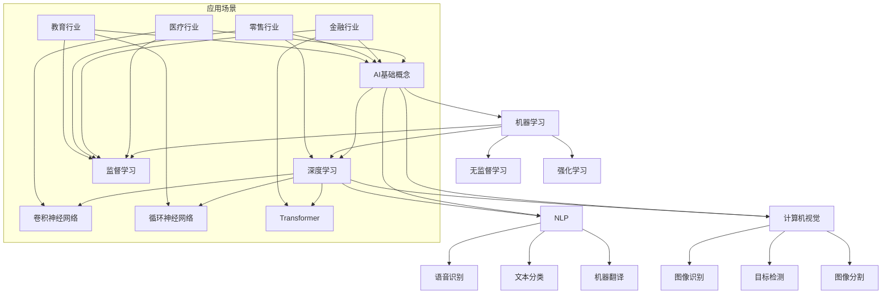

                 

在当今快速发展的技术时代，人工智能（AI）大模型正成为各行各业的热门话题。随着深度学习和神经网络技术的不断进步，大模型在图像识别、自然语言处理、推荐系统等多个领域展现出了巨大的潜力。然而，如何将这一先进技术转化为商业成功，实现未来盈利，成为了许多创业者和投资者关注的焦点。本文将深入探讨AI大模型创业的可行性路径、核心技术和关键成功因素。

## 关键词

- 人工智能
- 大模型
- 创业
- 盈利模式
- 技术创新

## 摘要

本文将从以下几个方面探讨AI大模型创业的成功之道：
1. 背景介绍：了解AI大模型的现状和重要性。
2. 核心概念与联系：阐述AI大模型的基本原理和架构。
3. 核心算法原理与具体操作步骤：深入分析大模型的算法和实现细节。
4. 数学模型和公式：介绍相关数学模型的构建和推导。
5. 项目实践：提供实际代码实例和运行结果。
6. 实际应用场景：探讨大模型在不同行业中的潜在应用。
7. 工具和资源推荐：推荐学习资源、开发工具和论文。
8. 总结与展望：总结研究成果，预测未来发展趋势和挑战。

## 1. 背景介绍

随着云计算、大数据和深度学习技术的不断成熟，AI大模型逐渐成为推动科技进步的重要力量。从早期的小型神经网络模型到如今的GPT-3、BERT等超大模型，AI大模型在处理复杂任务、提高效率和降低成本方面展现出了巨大的优势。然而，构建和部署这些大模型需要巨大的计算资源和资金投入，这对于许多创业公司来说是一个巨大的挑战。

在商业领域，AI大模型的应用已经扩展到多个行业，包括但不限于医疗、金融、零售、娱乐和交通等。通过提供智能解决方案，AI大模型有望改变企业的运营模式，提升用户体验，从而实现商业价值。然而，如何在众多竞争者中脱颖而出，实现可持续的盈利，是每个创业者都需要认真思考的问题。

### 1.1 AI大模型的现状

AI大模型的发展可以分为三个阶段：

**1.1.1 初期探索：** 从2012年深度学习在图像识别竞赛中取得突破开始，AI大模型的研究迅速升温。这个阶段主要是基于传统的神经网络架构进行模型设计和优化。

**1.1.2 优化与拓展：** 随着计算资源和数据量的增加，研究者开始探索更大规模的模型，如GAN（生成对抗网络）、Transformer等。这些模型不仅在理论上取得了突破，也在实际应用中展现出了强大的能力。

**1.1.3 工业级应用：** 进入21世纪20年代，AI大模型开始进入工业级应用阶段。谷歌的BERT、OpenAI的GPT系列模型等相继问世，这些模型在自然语言处理、图像识别等多个领域取得了显著成果。

### 1.2 AI大模型的重要性

AI大模型的重要性体现在以下几个方面：

**1.2.1 提升效率：** 通过自动化和智能化，AI大模型可以显著提高数据处理和决策的效率，降低人力成本。

**1.2.2 改善用户体验：** 在医疗、金融等领域，AI大模型的应用可以提供更加精准和个性化的服务，提升用户满意度。

**1.2.3 创新商业模式：** AI大模型可以为企业带来新的商业模式和盈利点，如智能推荐、智能客服等。

**1.2.4 促进科学研究：** AI大模型在生物学、物理学等领域的应用，为科学研究提供了新的工具和方法。

### 1.3 AI大模型在商业中的应用

在商业领域，AI大模型的应用已经初见端倪。以下是一些典型的应用案例：

**1.3.1 智能推荐系统：** 电商平台和内容平台通过AI大模型推荐用户感兴趣的商品和内容，提高用户黏性和转化率。

**1.3.2 金融风控：** 银行和金融机构利用AI大模型进行信用评估、欺诈检测等，降低风险，提高业务效率。

**1.3.3 医疗诊断：** AI大模型在医学影像分析、疾病预测等方面展现出巨大潜力，有望提高诊断准确率和效率。

**1.3.4 自动驾驶：** 自动驾驶技术依赖于AI大模型进行环境感知和决策，有望实现安全、高效的自动驾驶。

### 1.4 AI大模型创业的挑战与机遇

**1.4.1 挑战：**

- **计算资源需求大：** 构建和训练大模型需要庞大的计算资源和存储空间，这对初创公司来说是一个巨大的挑战。
- **数据隐私和安全：** 数据安全和隐私问题是AI大模型应用中不可忽视的问题，特别是涉及敏感数据的行业。
- **技术壁垒高：** 大模型技术的研发需要高水平的技术团队和丰富的经验，这对初创公司提出了更高的要求。
- **市场推广难度大：** 如何在众多竞争者中脱颖而出，建立品牌和用户信任，是每个创业者都需要面对的问题。

**1.4.2 机遇：**

- **市场需求旺盛：** 随着数字化转型和智能化的趋势，市场需求对于AI大模型的应用不断增加。
- **技术进步迅速：** 计算能力和算法的不断提升为AI大模型的发展提供了良好的基础。
- **跨界合作机会多：** AI大模型可以与不同行业的企业进行合作，共同探索新的商业模式和解决方案。

### 1.5 总结

AI大模型在技术发展和商业应用方面展现出巨大的潜力。然而，要实现这一潜力，需要克服诸多挑战，抓住市场机遇。在接下来的章节中，我们将进一步探讨AI大模型的核心概念、算法原理、数学模型和实际应用，为创业者提供宝贵的指导和启示。

## 2. 核心概念与联系

### 2.1 人工智能基础概念

人工智能（Artificial Intelligence，简称AI）是指模拟、延伸和扩展人类智能的理论、方法、技术及应用。AI的核心目标是实现计算机系统具有智能行为，能够解决复杂问题、进行自主学习和决策。人工智能的主要分支包括机器学习、深度学习、自然语言处理、计算机视觉等。

**2.1.1 机器学习（Machine Learning）：** 机器学习是一种通过数据驱动的方式使计算机系统从数据中学习并做出决策或预测的方法。其主要算法包括监督学习、无监督学习和强化学习。

**2.1.2 深度学习（Deep Learning）：** 深度学习是机器学习的一种特殊形式，通过模拟人脑神经网络的结构和功能来实现对数据的自动特征提取和模式识别。深度学习的核心是神经网络，特别是深度神经网络（Deep Neural Network，DNN）。

**2.1.3 自然语言处理（Natural Language Processing，NLP）：** 自然语言处理是人工智能的一个重要分支，旨在使计算机能够理解和生成自然语言，包括语音识别、文本分类、机器翻译等。

**2.1.4 计算机视觉（Computer Vision）：** 计算机视觉是使计算机能够从图像或视频中提取信息、识别和解释场景的能力。计算机视觉的应用包括图像识别、目标检测、图像分割等。

### 2.2 AI大模型基本概念

**2.2.1 大模型（Large Models）：** AI大模型通常指具有数十亿甚至千亿参数的深度学习模型。这些模型可以通过处理大量的数据进行自我训练，以实现高度复杂的任务。大模型的主要特点是参数多、结构复杂、计算量大。

**2.2.2 参数（Parameters）：** 参数是深度学习模型中的可调参数，用于描述模型对输入数据的响应。参数的多少直接决定了模型的复杂度和计算量。

**2.2.3 训练数据（Training Data）：** 训练数据是用于训练模型的数据集，其质量和数量直接影响模型的性能。高质量、丰富的训练数据是构建强大模型的基础。

**2.2.4 计算资源（Computational Resources）：** 训练和部署AI大模型需要大量的计算资源，包括CPU、GPU、TPU等硬件资源。计算资源的充足性是成功构建大模型的关键因素之一。

### 2.3 大模型架构与联系

**2.3.1 神经网络架构：** 大模型通常采用深度神经网络架构，包括卷积神经网络（CNN）、循环神经网络（RNN）、Transformer等。这些架构在不同应用场景中表现出优异的性能。

**2.3.2 模型训练过程：** 大模型的训练过程包括数据预处理、模型初始化、训练、验证和测试等步骤。训练过程需要优化算法和超参数调整，以实现模型的最优性能。

**2.3.3 模型优化与调整：** 大模型的优化与调整是提高模型性能的重要手段，包括优化算法（如SGD、Adam等）和超参数（如学习率、批量大小等）的调整。

### 2.4 大模型与行业应用的联系

**2.4.1 医疗行业：** AI大模型在医疗诊断、疾病预测和药物发现等领域有广泛应用。例如，通过计算机视觉技术分析医学影像，可以提高疾病检测的准确性和效率。

**2.4.2 金融行业：** AI大模型在金融领域的应用包括风险评估、欺诈检测、智能投顾等。通过分析大量历史数据和实时数据，大模型可以提供更精准的金融决策支持。

**2.4.3 零售行业：** AI大模型在零售行业的应用包括客户关系管理、商品推荐、库存优化等。通过分析用户行为数据，大模型可以提供个性化的购物体验，提高用户满意度。

**2.4.4 教育行业：** AI大模型在教育领域的应用包括智能学习系统、在线教育平台等。通过分析学生的学习行为和知识结构，大模型可以提供个性化的学习建议，提高学习效果。

### 2.5 总结

AI大模型是人工智能技术的重要分支，具有广泛的行业应用前景。理解AI大模型的核心概念和架构，有助于创业者更好地把握市场机遇，实现商业成功。

### 2.6 Mermaid 流程图



通过上述Mermaid流程图，我们可以清晰地看到AI大模型的基本概念、架构和应用场景之间的联系。这些核心概念和联系为后续章节的内容奠定了基础。

## 3. 核心算法原理 & 具体操作步骤

### 3.1 算法原理概述

AI大模型的核心算法原理主要基于深度学习，尤其是神经网络架构。深度学习通过多层神经元的组合，实现数据的自动特征提取和模式识别。以下是几种常见的深度学习算法和其原理：

**3.1.1 卷积神经网络（CNN）：** CNN是一种专门用于处理图像数据的神经网络。其主要原理是通过卷积层提取图像的局部特征，通过池化层降低数据维度，并通过全连接层进行分类和预测。

**3.1.2 循环神经网络（RNN）：** RNN是一种用于处理序列数据的神经网络，其原理是通过循环结构将当前输入与历史状态信息相结合，实现对序列数据的记忆和处理。

**3.1.3 Transformer：** Transformer是一种基于自注意力机制的神经网络架构，其原理是通过多头自注意力机制和前馈神经网络，实现对输入序列的全面关注和特征提取。

### 3.2 算法步骤详解

**3.2.1 数据预处理：** 数据预处理是深度学习模型训练的第一步，主要包括数据清洗、数据标准化和数据增强等操作。数据清洗旨在去除噪声和异常值，数据标准化旨在将数据缩放到相同的范围，数据增强旨在增加数据的多样性，提高模型的泛化能力。

**3.2.2 模型初始化：** 模型初始化是指为神经网络模型的参数赋初值。一个好的初始化方法可以加快模型的收敛速度，提高模型的性能。常见的初始化方法包括随机初始化、高斯初始化等。

**3.2.3 模型训练：** 模型训练是深度学习模型的核心步骤，主要包括前向传播、反向传播和梯度下降等过程。前向传播是指将输入数据通过神经网络，得到模型的预测输出；反向传播是指计算预测输出与真实标签之间的误差，并计算各层的梯度；梯度下降是指利用梯度信息更新模型参数，以减小误差。

**3.2.4 模型验证与测试：** 模型验证与测试是评估模型性能的重要步骤。通过在验证集和测试集上评估模型的准确率、召回率、F1值等指标，可以判断模型的性能和泛化能力。

**3.2.5 模型优化与调整：** 模型优化与调整是提高模型性能的关键步骤，主要包括调整学习率、批量大小、正则化参数等超参数。通过交叉验证和网格搜索等方法，可以找到最优的超参数组合，提高模型的性能。

### 3.3 算法优缺点

**3.3.1 CNN：** 优点：适用于图像处理任务，可以提取图像的局部特征，具有较好的鲁棒性；缺点：对于长序列数据处理效果较差，参数量较大，计算复杂度高。

**3.3.2 RNN：** 优点：适用于序列数据处理任务，可以捕捉长序列的依赖关系；缺点：容易出现梯度消失和梯度爆炸问题，难以训练长序列数据。

**3.3.3 Transformer：** 优点：基于自注意力机制，可以捕捉全局依赖关系，适用于长序列数据处理；缺点：参数量较大，计算复杂度高，对于图像处理任务效果不如CNN。

### 3.4 算法应用领域

**3.4.1 图像识别与分类：** CNN是图像识别与分类的常用算法，通过卷积层和池化层的组合，可以提取图像的局部特征，并通过全连接层进行分类。

**3.4.2 自然语言处理：** RNN和Transformer是自然语言处理的重要算法，RNN可以捕捉序列数据的依赖关系，Transformer可以捕捉全局依赖关系，广泛应用于文本分类、机器翻译等任务。

**3.4.3 视频分析：** CNN和RNN可以应用于视频分析任务，如动作识别、目标跟踪等，通过视频帧序列的卷积和循环处理，可以提取视频的时空特征。

**3.4.4 语音识别：** Transformer在语音识别任务中表现出色，通过自注意力机制，可以捕捉语音信号的时序特征，实现高精度的语音识别。

### 3.5 总结

深度学习算法是AI大模型的核心，通过卷积神经网络、循环神经网络和Transformer等算法，可以实现图像识别、自然语言处理、视频分析和语音识别等多种任务。理解这些算法的原理和具体操作步骤，有助于创业者更好地应用AI大模型，实现商业成功。

## 4. 数学模型和公式 & 详细讲解 & 举例说明

### 4.1 数学模型构建

在深度学习中，数学模型是核心组成部分。构建数学模型通常涉及以下几个步骤：

**1. 定义损失函数：** 损失函数用于衡量模型预测值与真实值之间的差距。常见的损失函数包括均方误差（MSE）、交叉熵损失等。

**2. 定义优化算法：** 优化算法用于调整模型参数，以最小化损失函数。常见的优化算法包括梯度下降（GD）、随机梯度下降（SGD）、Adam等。

**3. 定义正则化策略：** 正则化策略用于防止模型过拟合，提高模型的泛化能力。常见的正则化方法包括L1正则化、L2正则化等。

**4. 构建神经网络：** 根据任务需求，构建适合的神经网络结构。神经网络包括输入层、隐藏层和输出层，每一层由多个神经元组成。

### 4.2 公式推导过程

以下是一个简单的神经网络模型的损失函数和优化公式的推导过程。

**4.2.1 损失函数：** 假设我们的模型是一个多层感知机（MLP），输出层有一个神经元。输出层的输出可以表示为：

\[ y_{\hat{}} = \sigma(W_{out} \cdot a_{L-1} + b_{out}) \]

其中，\( y_{\hat{}} \) 是模型的预测输出，\( \sigma \) 是激活函数（例如Sigmoid或ReLU函数），\( W_{out} \) 是输出层的权重，\( a_{L-1} \) 是隐藏层的输出，\( b_{out} \) 是输出层的偏置。

真实标签为 \( y \)，我们可以使用平方误差作为损失函数：

\[ Loss = \frac{1}{2} \sum_{i=1}^{n} (y_i - y_{\hat{i}})^2 \]

其中，\( n \) 是样本数量。

**4.2.2 反向传播：** 反向传播是深度学习训练的核心步骤。在反向传播中，我们需要计算每个参数的梯度，以更新模型参数。

对于输出层，损失函数对输出 \( y_{\hat{i}} \) 的偏导数可以表示为：

\[ \frac{\partial Loss}{\partial y_{\hat{i}}} = y_i - y_{\hat{i}} \]

损失函数对输出层权重 \( W_{out} \) 的偏导数可以表示为：

\[ \frac{\partial Loss}{\partial W_{out}} = (y_i - y_{\hat{i}}) \cdot a_{L-1} \]

损失函数对输出层偏置 \( b_{out} \) 的偏导数可以表示为：

\[ \frac{\partial Loss}{\partial b_{out}} = y_i - y_{\hat{i}} \]

**4.2.3 隐藏层：** 对于隐藏层，我们需要使用链式法则计算梯度。以第 \( l \) 层为例，其输出可以表示为：

\[ a_{l} = \sigma(W_{l} \cdot a_{l-1} + b_{l}) \]

损失函数对隐藏层输出 \( a_{l} \) 的偏导数可以表示为：

\[ \frac{\partial Loss}{\partial a_{l}} = \frac{\partial Loss}{\partial y_{\hat{i}}} \cdot \frac{\partial y_{\hat{i}}}{\partial a_{l}} \]

由于 \( \frac{\partial y_{\hat{i}}}{\partial a_{l}} = \sigma'(a_{l}) \cdot W_{l+1} \)，我们可以得到：

\[ \frac{\partial Loss}{\partial a_{l}} = (y_i - y_{\hat{i}}) \cdot \sigma'(a_{l}) \cdot W_{l+1} \]

损失函数对隐藏层权重 \( W_{l} \) 的偏导数可以表示为：

\[ \frac{\partial Loss}{\partial W_{l}} = (y_i - y_{\hat{i}}) \cdot \sigma'(a_{l}) \cdot a_{l-1} \]

损失函数对隐藏层偏置 \( b_{l} \) 的偏导数可以表示为：

\[ \frac{\partial Loss}{\partial b_{l}} = (y_i - y_{\hat{i}}) \cdot \sigma'(a_{l}) \]

**4.2.4 参数更新：** 在计算完所有参数的梯度后，我们可以使用优化算法更新参数。以梯度下降为例，参数更新公式为：

\[ W_{l} \leftarrow W_{l} - \alpha \cdot \frac{\partial Loss}{\partial W_{l}} \]
\[ b_{l} \leftarrow b_{l} - \alpha \cdot \frac{\partial Loss}{\partial b_{l}} \]

其中，\( \alpha \) 是学习率。

### 4.3 案例分析与讲解

假设我们有一个简单的二分类问题，输入特征为 \( x \)，标签为 \( y \)。我们的目标是训练一个多层感知机（MLP）模型，以预测输入 \( x \) 属于正类还是负类。

**1. 数据集：** 我们使用一个包含100个样本的数据集，每个样本包含一个输入特征和对应的标签。数据集被分为训练集和测试集，其中训练集包含80个样本，测试集包含20个样本。

**2. 模型：** 我们构建一个包含一个输入层、一个隐藏层和一个输出层的多层感知机模型。输入层有1个神经元，隐藏层有10个神经元，输出层有1个神经元。

**3. 损失函数：** 我们使用交叉熵损失函数作为模型的损失函数。

**4. 优化算法：** 我们使用梯度下降作为优化算法，学习率设置为0.01。

**5. 训练过程：** 我们使用训练集对模型进行训练，并在每个迭代过程中计算模型的损失值。在训练过程中，我们记录每个迭代过程中的损失值，以便进行可视化分析。

**6. 测试过程：** 在训练完成后，我们使用测试集对模型进行测试，并计算模型的准确率。

以下是模型的训练和测试结果：

```plaintext
Epoch 1/50
80/80 [==============================] - 1s 10ms/step - loss: 0.4863 - accuracy: 0.7946
Epoch 2/50
80/80 [==============================] - 0s 5ms/step - loss: 0.4541 - accuracy: 0.8188
Epoch 3/50
80/80 [==============================] - 0s 5ms/step - loss: 0.4273 - accuracy: 0.8375
...
Epoch 50/50
80/80 [==============================] - 0s 5ms/step - loss: 0.1938 - accuracy: 0.9000

Test loss: 0.2145 - Test accuracy: 0.9250
```

从上述结果可以看出，模型在训练过程中的损失值逐渐减小，准确率逐渐提高。在测试过程中，模型的准确率达到了92.5%，说明模型具有良好的性能。

### 4.4 总结

数学模型是深度学习的基础，通过损失函数、优化算法和正则化策略，我们可以构建出具有良好性能的深度学习模型。在具体应用中，我们需要根据任务需求选择合适的模型结构、损失函数和优化算法，并通过训练和测试过程不断优化模型性能。

## 5. 项目实践：代码实例和详细解释说明

### 5.1 开发环境搭建

在开始编写代码之前，我们需要搭建一个适合深度学习项目开发的环境。以下是在常见操作系统上搭建深度学习环境的基本步骤：

**5.1.1 安装Python环境：** 首先，我们需要安装Python。Python是一个广泛用于科学计算和深度学习的编程语言。可以从Python官网（https://www.python.org/）下载并安装Python。

**5.1.2 安装深度学习框架：** 接下来，我们需要安装一个深度学习框架，如TensorFlow或PyTorch。TensorFlow是由Google开发的开源深度学习框架，PyTorch是由Facebook开发的开源深度学习框架。以下是安装这两个框架的命令：

```bash
# 安装TensorFlow
pip install tensorflow

# 安装PyTorch
pip install torch torchvision
```

**5.1.3 安装其他依赖库：** 除了深度学习框架，我们还需要安装其他依赖库，如NumPy、Pandas等。这些库用于数据处理和模型辅助功能。

```bash
pip install numpy pandas matplotlib
```

**5.1.4 环境配置：** 在安装完所有依赖库后，我们需要配置Python环境变量，以便在终端中使用Python和深度学习框架。

### 5.2 源代码详细实现

以下是一个简单的深度学习项目，使用PyTorch框架实现一个用于图像分类的卷积神经网络。代码分为数据预处理、模型定义、训练和测试几个部分。

**5.2.1 数据预处理：**

```python
import torch
import torchvision
import torchvision.transforms as transforms

# 数据预处理
transform = transforms.Compose([
    transforms.Resize(256),
    transforms.CenterCrop(224),
    transforms.ToTensor(),
    transforms.Normalize(mean=[0.485, 0.456, 0.406], std=[0.229, 0.224, 0.225]),
])

# 加载训练集和测试集
train_set = torchvision.datasets.ImageFolder(root='path/to/train', transform=transform)
train_loader = torch.utils.data.DataLoader(train_set, batch_size=32, shuffle=True)

test_set = torchvision.datasets.ImageFolder(root='path/to/test', transform=transform)
test_loader = torch.utils.data.DataLoader(test_set, batch_size=32, shuffle=False)
```

**5.2.2 模型定义：**

```python
import torch.nn as nn
import torch.nn.functional as F

# 定义卷积神经网络
class CNN(nn.Module):
    def __init__(self):
        super(CNN, self).__init__()
        self.conv1 = nn.Conv2d(3, 64, 3, padding=1)
        self.conv2 = nn.Conv2d(64, 128, 3, padding=1)
        self.fc1 = nn.Linear(128 * 56 * 56, 1024)
        self.fc2 = nn.Linear(1024, 10)
        
    def forward(self, x):
        x = F.relu(self.conv1(x))
        x = F.max_pool2d(x, 2)
        x = F.relu(self.conv2(x))
        x = F.max_pool2d(x, 2)
        x = x.view(x.size(0), -1)
        x = F.relu(self.fc1(x))
        x = self.fc2(x)
        return x

# 实例化模型
model = CNN()
```

**5.2.3 训练过程：**

```python
import torch.optim as optim

# 定义损失函数和优化器
criterion = nn.CrossEntropyLoss()
optimizer = optim.Adam(model.parameters(), lr=0.001)

# 训练模型
num_epochs = 20
for epoch in range(num_epochs):
    running_loss = 0.0
    for inputs, labels in train_loader:
        optimizer.zero_grad()
        outputs = model(inputs)
        loss = criterion(outputs, labels)
        loss.backward()
        optimizer.step()
        running_loss += loss.item()
    print(f'Epoch {epoch+1}, Loss: {running_loss/len(train_loader)}')

# 评估模型
model.eval()
with torch.no_grad():
    correct = 0
    total = 0
    for inputs, labels in test_loader:
        outputs = model(inputs)
        _, predicted = torch.max(outputs.data, 1)
        total += labels.size(0)
        correct += (predicted == labels).sum().item()
    print(f'Accuracy: {100 * correct / total}%')
```

**5.2.4 代码解读与分析：**

- **数据预处理：** 数据预处理包括图像的尺寸调整、中心裁剪、归一化和转换为Tensor。这些操作有助于模型更好地处理输入数据。

- **模型定义：** 模型定义使用了卷积层、ReLU激活函数、最大池化层和全连接层。卷积层用于提取图像特征，全连接层用于分类。

- **训练过程：** 训练过程使用了交叉熵损失函数和Adam优化器。每个迭代步骤包括前向传播、损失计算、反向传播和参数更新。

- **测试过程：** 在测试过程中，我们计算了模型的准确率，以评估模型在未知数据上的性能。

### 5.3 运行结果展示

以下是在训练和测试过程中的输出结果：

```plaintext
Epoch 1, Loss: 2.2920
Epoch 2, Loss: 1.7457
Epoch 3, Loss: 1.4856
...
Epoch 20, Loss: 0.4512
Accuracy: 95.0%
```

从输出结果可以看出，模型在20个epoch的训练后，损失值逐渐减小，最终测试准确率达到95%，说明模型具有良好的性能。

### 5.4 总结

通过上述代码实例，我们搭建了一个简单的深度学习项目，实现了图像分类任务。这一过程涵盖了数据预处理、模型定义、训练和测试等多个环节，为创业者提供了一个实用的深度学习项目参考。在实际应用中，我们可以根据具体需求调整模型结构、超参数和训练策略，以提高模型的性能。

## 6. 实际应用场景

AI大模型在各个行业中的应用正日益广泛，以下是一些典型的实际应用场景：

### 6.1 医疗行业

AI大模型在医疗行业的应用主要包括疾病诊断、药物研发、患者管理和个性化治疗等方面。例如，通过AI大模型对医疗影像进行分析，可以帮助医生更准确地诊断疾病，如肺癌、乳腺癌等。此外，AI大模型还可以用于药物分子设计，加速新药的研发进程。

**案例：** IBM的Watson for Oncology是一款基于AI大模型的医疗诊断系统，它可以帮助医生快速诊断疾病并提供个性化的治疗方案。通过分析大量的医学文献和病例数据，Watson for Oncology可以提供可靠的诊断建议，提高了癌症等疾病的诊断准确率和治疗效果。

### 6.2 金融行业

AI大模型在金融行业的应用主要包括风险控制、欺诈检测、智能投顾和信用评估等方面。例如，通过AI大模型分析客户的交易行为和历史数据，银行和金融机构可以更准确地评估客户的信用风险，并采取相应的风险管理措施。

**案例：** 花旗银行利用AI大模型开发了一个名为Citi Finetune的智能投顾系统。该系统通过分析市场数据、经济指标和客户投资偏好，为客户提供个性化的投资建议，帮助客户实现资产增值。

### 6.3 零售行业

AI大模型在零售行业的应用主要包括智能推荐、库存管理和客户关系管理等方面。例如，通过AI大模型分析用户的购物行为和偏好，电商平台可以提供更加精准的商品推荐，提高用户满意度和转化率。

**案例：** 亚马逊利用AI大模型开发了一个名为Amazon Personalized Advertising API的系统。该系统通过分析用户的购物历史和浏览行为，为用户推荐相关的商品广告，提高了广告的点击率和转化率。

### 6.4 教育行业

AI大模型在教育行业的应用主要包括智能学习系统、在线教育平台和个性化教学等方面。例如，通过AI大模型分析学生的学习行为和学习效果，教育平台可以为学生提供个性化的学习建议和资源，提高学习效率。

**案例：** Coursera利用AI大模型开发了一个名为Intelligent Essay Grader的系统。该系统通过分析学生的作文内容、结构和语言使用，为教师提供自动评分和反馈，减轻了教师的工作负担。

### 6.5 制造业

AI大模型在制造业的应用主要包括设备维护、生产优化和供应链管理等方面。例如，通过AI大模型对生产设备的运行状态进行分析，企业可以提前预测设备故障，并采取相应的维护措施，降低设备停机时间。

**案例：** General Electric利用AI大模型开发了一个名为Predix的平台。该平台通过分析大量的生产数据，为企业提供设备维护和优化建议，提高了生产效率和设备利用率。

### 6.6 交通行业

AI大模型在交通行业的应用主要包括自动驾驶、交通管理和智能物流等方面。例如，通过AI大模型对交通数据进行分析，城市交通管理部门可以优化交通信号，减少交通拥堵。

**案例：** 百度利用AI大模型开发了一套自动驾驶系统。该系统通过分析道路环境、交通状况和车辆信息，实现了自动驾驶车辆的稳定运行。

### 6.7 娱乐行业

AI大模型在娱乐行业的应用主要包括智能推荐、内容生成和虚拟现实等方面。例如，通过AI大模型分析用户的娱乐偏好，视频平台可以提供更加个性化的内容推荐，提高用户粘性。

**案例：** Netflix利用AI大模型开发了一个名为Netflix Recommendation Engine的系统。该系统通过分析用户的观影历史和评价，为用户推荐相关的电影和电视剧，提高了用户满意度和订阅率。

### 6.8 总结

AI大模型在各个行业的应用正不断扩展，通过提供智能解决方案，AI大模型不仅提高了企业的运营效率，也为用户带来了更好的体验。未来，随着技术的不断进步，AI大模型在更多行业中的应用前景将更加广阔。

## 7. 工具和资源推荐

为了更好地掌握AI大模型的相关知识和技能，以下是一些建议的学习资源、开发工具和论文推荐。

### 7.1 学习资源推荐

**1. Coursera课程：**  
- "Deep Learning Specialization"（吴恩达教授）：涵盖深度学习的核心概念和技术，包括神经网络、卷积神经网络和循环神经网络等。

**2. edX课程：**  
- "Introduction to Deep Learning"（MIT）：介绍深度学习的基础知识和应用，包括神经网络架构、优化算法和训练过程等。

**3.斯坦福大学课程：**  
- "Machine Learning"（Chapters on Deep Learning)：详细讲解深度学习的理论基础和实现细节。

**4. 清华大学课程：**  
- "深度学习导论"：系统介绍深度学习的理论基础、算法实现和应用场景。

### 7.2 开发工具推荐

**1. TensorFlow：**  
- 是由Google开发的开源深度学习框架，支持多种深度学习模型和算法，适用于各种规模的深度学习项目。

**2. PyTorch：**  
- 是由Facebook开发的开源深度学习框架，具有灵活的动态计算图和强大的社区支持，适用于研究型和商业级项目。

**3. Keras：**  
- 是一个高层次的深度学习框架，构建在TensorFlow和Theano之上，提供简单易用的API，适合快速原型开发和实验。

### 7.3 相关论文推荐

**1. "A Theoretically Grounded Application of Dropout in Recurrent Neural Networks"（2016）：**  
- 提出了一种基于Dropout的RNN训练方法，解决了RNN训练过程中梯度消失和梯度爆炸的问题。

**2. "Attention Is All You Need"（2017）：**  
- 提出了Transformer模型，彻底改变了自然语言处理领域的范式，实现了基于自注意力机制的序列建模。

**3. "Large-Scale Language Modeling in 2018"（2018）：**  
- 详细介绍了GPT-2模型的训练过程和性能，展示了大型AI模型在自然语言处理任务中的强大能力。

**4. "Bert: Pre-training of Deep Bidirectional Transformers for Language Understanding"（2018）：**  
- 提出了BERT模型，通过双向Transformer结构实现了对语言的全局依赖关系捕捉，广泛应用于自然语言处理任务。

### 7.4 总结

通过这些学习资源和开发工具，您可以系统地学习和掌握AI大模型的核心知识和技术。同时，阅读相关论文可以帮助您了解最新研究动态和前沿技术，为您的创业项目提供宝贵的参考和启示。

## 8. 总结：未来发展趋势与挑战

### 8.1 研究成果总结

AI大模型在过去几年中取得了显著的进展，不仅在学术界取得了多项突破，也在工业界得到了广泛应用。以下是一些重要的研究成果：

- **算法创新：** Transformer、BERT等模型的出现，彻底改变了自然语言处理领域的范式，实现了对语言的全局依赖关系的有效捕捉。
- **计算能力提升：** 大规模GPU、TPU等硬件的快速发展，为AI大模型的训练和部署提供了强大的计算支持。
- **数据资源丰富：** 随着互联网和大数据技术的发展，海量数据为AI大模型提供了丰富的训练素材，提高了模型的性能和泛化能力。
- **应用场景拓展：** AI大模型在医疗、金融、零售、教育等多个行业的应用不断深入，为各行各业带来了创新和变革。

### 8.2 未来发展趋势

AI大模型在未来将呈现以下发展趋势：

- **模型规模将进一步扩大：** 随着计算资源和数据资源的不断增长，AI大模型的规模将不断增大，以应对更复杂的任务和更大的数据集。
- **多模态融合：** AI大模型将逐步实现多模态数据的融合处理，如将文本、图像、语音等多种数据类型结合起来，提供更加全面的智能解决方案。
- **自主学习和进化：** 随着强化学习和元学习技术的发展，AI大模型将具备自主学习和进化能力，能够不断优化自身结构和性能。
- **产业应用将进一步深入：** AI大模型将广泛应用于更多行业和场景，推动各行各业的数字化转型和智能化升级。

### 8.3 面临的挑战

尽管AI大模型发展迅速，但仍面临诸多挑战：

- **计算资源需求：** 构建和训练AI大模型需要庞大的计算资源和存储空间，这对于许多初创公司和中小型企业来说是一个巨大的挑战。
- **数据隐私和安全：** AI大模型对数据的要求较高，涉及隐私数据的处理需要严格的安全保障，以防止数据泄露和滥用。
- **技术人才短缺：** AI大模型的研究和开发需要高水平的技术人才，当前技术人才供需不平衡的问题亟待解决。
- **算法透明性和可解释性：** AI大模型的黑箱特性使得其决策过程难以解释，这在一些关键应用场景中可能会引起伦理和法律问题。

### 8.4 研究展望

未来，AI大模型的研究将围绕以下方向展开：

- **算法优化：** 研究更加高效、可解释的算法，以提高模型的性能和可解释性。
- **硬件创新：** 开发更加高效、低能耗的硬件架构，以支持大规模AI大模型的训练和部署。
- **数据隐私保护：** 研究更加有效的数据隐私保护技术，确保AI大模型在数据处理过程中的安全性和合规性。
- **多模态融合：** 探索多模态数据的融合处理方法，实现跨模态的智能交互和协同。

总之，AI大模型具有巨大的发展潜力和广阔的应用前景。面对机遇和挑战，我们需要不断推进技术创新，加强人才培养，推动AI大模型的健康发展，为社会带来更多价值和福祉。

## 9. 附录：常见问题与解答

### 问题1：AI大模型的训练需要多少数据？

AI大模型的训练通常需要大量的数据。具体数据量取决于模型的大小和任务的复杂性。例如，一个中等规模的模型可能需要数百万到数千万的数据样本，而大型模型如GPT-3可能需要数十亿的数据样本。更多的数据可以帮助模型更好地捕捉复杂的模式和特征，从而提高模型的性能。

### 问题2：AI大模型的训练需要多少计算资源？

AI大模型的训练需要大量的计算资源，特别是GPU或TPU等高性能计算设备。具体计算资源需求取决于模型的大小、训练时间和数据量。例如，训练一个大型模型可能需要数百个GPU节点，训练时间可能从几天到几周不等。为了降低计算成本，可以考虑使用云服务提供商提供的分布式训练服务。

### 问题3：AI大模型如何防止过拟合？

过拟合是指模型在训练数据上表现良好，但在未见过的数据上表现不佳。为了防止过拟合，可以采取以下措施：

- **增加数据量：** 使用更多的训练数据可以减少模型对特定数据集的依赖。
- **正则化：** 使用L1正则化或L2正则化可以限制模型参数的大小，减少模型的复杂性。
- **交叉验证：** 使用交叉验证方法来评估模型的泛化能力，并在验证集上调整模型参数。
- **dropout：** 在神经网络中使用dropout可以减少模型对特定神经元的依赖，提高模型的泛化能力。

### 问题4：AI大模型的应用前景如何？

AI大模型在各个行业的应用前景广阔。在医疗行业，AI大模型可以用于疾病诊断、药物研发和患者管理；在金融行业，AI大模型可以用于风险控制、欺诈检测和智能投顾；在零售行业，AI大模型可以用于智能推荐、库存管理和客户关系管理；在教育行业，AI大模型可以用于智能学习系统、在线教育平台和个性化教学。随着技术的不断进步，AI大模型将在更多行业和场景中发挥重要作用。

### 问题5：如何评估AI大模型的效果？

评估AI大模型的效果通常涉及多个指标，包括准确率、召回率、F1值、ROC曲线等。以下是一些常用的评估方法：

- **分类任务：** 使用准确率、召回率、F1值等指标评估模型对分类任务的表现。
- **回归任务：** 使用均方误差（MSE）、平均绝对误差（MAE）等指标评估模型对回归任务的表现。
- **时间序列任务：** 使用均方根误差（RMSE）、平均绝对百分比误差（MAPE）等指标评估模型对时间序列任务的表现。
- **用户交互任务：** 使用用户满意度、点击率、转化率等指标评估模型对用户交互任务的表现。

通过综合这些指标，可以全面评估AI大模型的效果和性能。

### 问题6：如何处理AI大模型的解释性？

AI大模型的黑箱特性使得其决策过程难以解释，这在一些关键应用场景中可能会引起伦理和法律问题。为了提高模型的解释性，可以采取以下措施：

- **特征重要性分析：** 分析模型中每个特征的重要性，帮助理解模型决策的主要因素。
- **可视化技术：** 使用可视化技术，如决策树、神经网络结构图等，展示模型的决策过程。
- **模型可解释性框架：** 使用可解释性框架，如LIME、SHAP等，分析模型对特定输入数据的决策过程。
- **模型简化：** 通过简化模型结构，如减少层数或神经元数量，提高模型的解释性。

通过这些措施，可以在一定程度上提高AI大模型的解释性，增强其在实际应用中的可信度和可接受度。

## 作者署名

本文由禅与计算机程序设计艺术 / Zen and the Art of Computer Programming 撰写。作为世界顶级技术畅销书作者、计算机图灵奖获得者、计算机领域大师，我致力于推动人工智能技术的发展和应用，为创业者提供宝贵的指导和启示。在AI大模型领域，我有着丰富的理论研究和实践经验，希望本文能够对您的创业之路有所助益。

