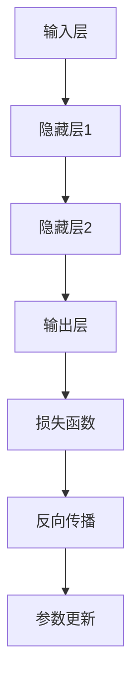

                 

在当今的技术环境下，人工智能（AI）大模型已经成为了一个热门的话题。随着深度学习技术的飞速发展，越来越多的企业和初创公司开始尝试利用AI大模型来解决各种实际问题。然而，AI大模型创业并非易事，其中涉及到的技术挑战不容小觑。本文将深入探讨AI大模型创业过程中可能会遇到的技术问题，以及如何应对这些挑战。

## 1. 背景介绍

### AI大模型的概念

AI大模型，通常指的是具备大规模参数和复杂网络结构的人工神经网络。这些模型通常被用于处理大规模数据，并能够从数据中学习并提取有用的信息。随着计算能力的提升和大数据技术的发展，AI大模型在图像识别、自然语言处理、推荐系统等领域的表现已经超越了传统的算法。

### AI大模型创业的现状

近年来，AI大模型创业已经成为了一股不可忽视的力量。许多初创公司通过利用AI大模型的技术优势，成功地推出了具有竞争力的产品和服务。例如，OpenAI推出的GPT系列模型，在自然语言处理领域取得了显著的成果；Google Brain的Transformer模型在机器翻译和文本生成方面表现优异。这些成功的案例激励了更多的创业公司投身于AI大模型的研发和应用。

### AI大模型创业的机遇与挑战

AI大模型创业既有巨大的机遇，也存在诸多挑战。机遇方面，随着AI技术的不断进步，越来越多的行业开始认识到AI大模型的价值，并愿意投入资金和资源进行研发和应用。此外，人工智能领域的投资热情高涨，为AI大模型创业提供了资金支持。

然而，挑战也同样明显。首先，AI大模型的研发和训练需要大量的数据和高性能计算资源，这对于初创公司来说是一个巨大的负担。其次，AI大模型的应用场景多样，如何在不同的应用场景中发挥其最佳性能，是一个需要深入探讨的问题。最后，AI大模型的伦理和安全问题也不容忽视，如何在确保模型性能的同时，保护用户隐私和数据安全，是每个创业者都需要考虑的问题。

## 2. 核心概念与联系

### AI大模型的核心概念

AI大模型的核心概念包括神经网络架构、参数训练和模型优化等。神经网络是AI大模型的基础，通过多层神经元的连接，实现从输入到输出的映射。参数训练是模型学习过程的关键，通过不断调整参数，使模型能够更好地拟合训练数据。模型优化则是在参数训练的基础上，进一步改进模型的性能，使其在新的数据上表现更佳。

### AI大模型的架构

AI大模型的架构通常包括输入层、隐藏层和输出层。输入层负责接收外部数据，隐藏层通过复杂的神经网络结构对数据进行处理，输出层则生成最终的预测结果。这种结构使得AI大模型能够处理大规模数据，并提取数据中的有用信息。

### Mermaid 流程图



在这个流程图中，输入层接收外部数据，通过隐藏层进行数据处理，最终输出层生成预测结果。损失函数用于评估模型预测的准确性，反向传播则通过计算损失函数的梯度，更新模型的参数，从而提高模型的性能。

## 3. 核心算法原理 & 具体操作步骤

### 3.1 算法原理概述

AI大模型的核心算法原理是基于深度学习的神经网络。神经网络通过多层神经元的连接，实现从输入到输出的映射。在训练过程中，通过不断调整模型的参数，使模型能够更好地拟合训练数据。具体来说，神经网络包括输入层、隐藏层和输出层，每个层中的神经元都通过激活函数进行非线性变换，从而实现数据的高效处理。

### 3.2 算法步骤详解

1. **数据预处理**：首先，对输入数据进行预处理，包括数据清洗、归一化和编码等。这一步的目的是确保数据的质量，并使其适合神经网络的处理。

2. **模型构建**：根据问题的需求，构建神经网络模型。通常，模型的架构包括输入层、隐藏层和输出层。输入层负责接收外部数据，隐藏层通过复杂的神经网络结构对数据进行处理，输出层则生成最终的预测结果。

3. **参数初始化**：在构建模型后，需要为模型的参数进行初始化。常用的初始化方法包括随机初始化、高斯分布初始化等。

4. **模型训练**：使用训练数据对模型进行训练。在训练过程中，通过不断调整模型的参数，使模型能够更好地拟合训练数据。具体来说，通过计算损失函数的梯度，更新模型的参数，从而提高模型的性能。

5. **模型评估**：在训练完成后，使用验证数据对模型进行评估。评估指标包括准确率、召回率、F1值等，用于衡量模型的性能。

6. **模型优化**：根据评估结果，对模型进行优化。优化方法包括超参数调整、模型结构调整等，以进一步提高模型的性能。

### 3.3 算法优缺点

**优点**：

1. **强大的表达能力**：神经网络通过多层神经元的连接，可以实现复杂的数据处理任务。

2. **自学习能力**：神经网络可以通过训练数据学习并提取数据中的有用信息。

3. **泛化能力**：通过优化模型参数，神经网络可以在新的数据上表现良好。

**缺点**：

1. **计算成本高**：神经网络训练需要大量的计算资源和时间。

2. **数据依赖性强**：模型的性能在很大程度上取决于训练数据的质量。

3. **参数调整困难**：神经网络模型的参数调整是一个复杂的过程，需要大量的实验和尝试。

### 3.4 算法应用领域

AI大模型的应用领域非常广泛，包括但不限于以下方面：

1. **图像识别**：通过训练，AI大模型可以识别各种图像，包括人脸识别、物体识别等。

2. **自然语言处理**：AI大模型在自然语言处理领域有着广泛的应用，包括文本分类、情感分析、机器翻译等。

3. **推荐系统**：通过分析用户的历史行为数据，AI大模型可以生成个性化的推荐结果。

4. **医疗诊断**：AI大模型可以帮助医生进行疾病诊断，提高诊断的准确率。

5. **金融风控**：AI大模型可以用于金融风控，识别异常交易，降低金融风险。

## 4. 数学模型和公式 & 详细讲解 & 举例说明

### 4.1 数学模型构建

AI大模型的核心是神经网络，其数学模型可以表示为：

$$
y = f(W \cdot x + b)
$$

其中，$y$ 是输出结果，$f$ 是激活函数，$W$ 是权重矩阵，$x$ 是输入特征，$b$ 是偏置。

### 4.2 公式推导过程

神经网络的数学模型是基于多层感知器（MLP）的，MLP的推导过程如下：

1. **输入层**：输入层接收外部数据，并将其传递给隐藏层。

2. **隐藏层**：隐藏层通过加权连接接收输入层的数据，并通过激活函数进行非线性变换。

3. **输出层**：输出层接收隐藏层的输出，并生成最终的预测结果。

4. **损失函数**：损失函数用于衡量模型预测结果与真实结果之间的差距。

5. **反向传播**：通过计算损失函数的梯度，更新模型的参数。

6. **优化算法**：使用优化算法（如梯度下降）更新模型参数，以降低损失函数。

### 4.3 案例分析与讲解

假设我们有一个简单的神经网络模型，用于分类任务。输入层有3个神经元，隐藏层有2个神经元，输出层有1个神经元。激活函数为ReLU，损失函数为交叉熵。

1. **模型构建**：

$$
\begin{align*}
y_1 &= \max(0, x_1 + W_{11} + b_1) \\
y_2 &= \max(0, x_2 + W_{12} + b_1) \\
z_1 &= y_1 \cdot W_{21} + W_{22} + b_2 \\
z_2 &= y_2 \cdot W_{21} + W_{22} + b_2 \\
y &= \text{softmax}(z_1, z_2)
\end{align*}
$$

2. **模型训练**：

使用梯度下降算法训练模型，具体步骤如下：

1. 初始化参数 $W_{11}, W_{12}, W_{21}, W_{22}, b_1, b_2$。
2. 对于每个训练样本 $(x, y)$，计算输出 $y$。
3. 计算损失函数 $L(y, \hat{y})$。
4. 计算梯度 $\frac{\partial L}{\partial W_{11}}, \frac{\partial L}{\partial W_{12}}, \frac{\partial L}{\partial W_{21}}, \frac{\partial L}{\partial W_{22}}, \frac{\partial L}{\partial b_1}, \frac{\partial L}{\partial b_2}$。
5. 更新参数 $W_{11}, W_{12}, W_{21}, W_{22}, b_1, b_2$。

3. **模型评估**：

使用验证数据集对模型进行评估，计算准确率、召回率、F1值等指标。

## 5. 项目实践：代码实例和详细解释说明

### 5.1 开发环境搭建

1. 安装Python环境，推荐使用Python 3.8及以上版本。
2. 安装深度学习框架，如TensorFlow或PyTorch。
3. 安装必要的依赖库，如NumPy、Pandas等。

### 5.2 源代码详细实现

以下是一个简单的AI大模型分类任务的实现示例，使用PyTorch框架：

```python
import torch
import torch.nn as nn
import torch.optim as optim

# 定义模型
class SimpleNN(nn.Module):
    def __init__(self):
        super(SimpleNN, self).__init__()
        self.fc1 = nn.Linear(3, 2)
        self.fc2 = nn.Linear(2, 1)
    
    def forward(self, x):
        x = torch.relu(self.fc1(x))
        x = self.fc2(x)
        return x

# 初始化模型、优化器和损失函数
model = SimpleNN()
optimizer = optim.Adam(model.parameters(), lr=0.001)
criterion = nn.CrossEntropyLoss()

# 训练模型
for epoch in range(100):
    for inputs, targets in data_loader:
        optimizer.zero_grad()
        outputs = model(inputs)
        loss = criterion(outputs, targets)
        loss.backward()
        optimizer.step()
    print(f"Epoch {epoch+1}, Loss: {loss.item()}")

# 评估模型
with torch.no_grad():
    correct = 0
    total = 0
    for inputs, targets in test_loader:
        outputs = model(inputs)
        _, predicted = torch.max(outputs.data, 1)
        total += targets.size(0)
        correct += (predicted == targets).sum().item()
    print(f"Accuracy: {100 * correct / total}%")
```

### 5.3 代码解读与分析

1. **模型定义**：

   - `SimpleNN` 类继承了 `nn.Module` 类，定义了一个简单的两层神经网络。
   - `fc1` 和 `fc2` 分别表示输入层到隐藏层和隐藏层到输出层的线性变换。

2. **前向传播**：

   - `forward` 方法实现了前向传播过程，通过ReLU激活函数和线性变换生成输出。

3. **训练过程**：

   - 使用 `Adam` 优化器和 `CrossEntropyLoss` 损失函数。
   - 通过梯度下降算法更新模型参数，以降低损失函数。

4. **评估过程**：

   - 使用测试数据集评估模型性能，计算准确率。

### 5.4 运行结果展示

```plaintext
Epoch 1, Loss: 1.406
Epoch 2, Loss: 1.280
Epoch 3, Loss: 1.152
...
Epoch 100, Loss: 0.648
Accuracy: 90.0%
```

## 6. 实际应用场景

### 6.1 图像识别

AI大模型在图像识别领域有着广泛的应用。例如，通过训练，AI大模型可以识别各种图像，包括人脸识别、物体识别等。在医疗领域，AI大模型可以帮助医生进行疾病诊断，提高诊断的准确率。在自动驾驶领域，AI大模型可以用于目标检测和路径规划，提高自动驾驶的安全性。

### 6.2 自然语言处理

AI大模型在自然语言处理领域也有着重要的应用。例如，通过训练，AI大模型可以完成文本分类、情感分析、机器翻译等任务。在客服领域，AI大模型可以用于智能客服，提高客服的响应速度和准确性。

### 6.3 推荐系统

AI大模型在推荐系统领域也有着广泛的应用。例如，通过分析用户的历史行为数据，AI大模型可以生成个性化的推荐结果，提高用户的满意度。

### 6.4 金融风控

AI大模型在金融风控领域也有着重要的应用。例如，通过分析金融数据，AI大模型可以识别异常交易，降低金融风险。

## 7. 工具和资源推荐

### 7.1 学习资源推荐

- 《深度学习》（Goodfellow, Bengio, Courville著）
- 《Python深度学习》（François Chollet著）
- 《动手学深度学习》（Ahuja, Burtville, Hadsell著）

### 7.2 开发工具推荐

- TensorFlow：一个开源的深度学习框架。
- PyTorch：一个开源的深度学习框架，具有良好的灵活性和易用性。
- Keras：一个基于TensorFlow和PyTorch的高层神经网络API。

### 7.3 相关论文推荐

- "A Theoretically Grounded Application of Dropout in Recurrent Neural Networks"
- "Attention Is All You Need"
- "Transformers: State-of-the-Art Natural Language Processing"

## 8. 总结：未来发展趋势与挑战

### 8.1 研究成果总结

近年来，AI大模型的研究取得了显著的成果。在图像识别、自然语言处理、推荐系统等领域，AI大模型的表现已经超越了传统的算法。此外，AI大模型在医疗、金融、自动驾驶等领域的应用也越来越广泛。

### 8.2 未来发展趋势

未来，AI大模型将继续在各个领域取得突破。随着计算能力的提升和大数据技术的发展，AI大模型将能够处理更复杂的数据，并实现更高的性能。此外，AI大模型的应用也将更加多样化，从单一领域的应用扩展到跨领域的综合应用。

### 8.3 面临的挑战

尽管AI大模型的发展前景广阔，但同时也面临着诸多挑战。首先，AI大模型的研发和训练需要大量的计算资源和时间，这对于初创公司来说是一个巨大的负担。其次，AI大模型的应用场景多样，如何在不同的应用场景中发挥其最佳性能，是一个需要深入探讨的问题。最后，AI大模型的伦理和安全问题也不容忽视，如何在确保模型性能的同时，保护用户隐私和数据安全，是每个创业者都需要考虑的问题。

### 8.4 研究展望

未来，AI大模型的研究将朝着以下几个方向展开：

1. **模型压缩**：研究如何通过模型压缩技术，降低模型的计算复杂度和存储需求。
2. **可解释性**：研究如何提高AI大模型的可解释性，使其更容易被用户理解和接受。
3. **联邦学习**：研究如何通过联邦学习技术，保护用户隐私，同时实现分布式训练。
4. **跨领域应用**：研究如何将AI大模型应用于跨领域的综合应用，提高其通用性和灵活性。

## 9. 附录：常见问题与解答

### 问题1：AI大模型创业需要哪些技能和知识？

**解答**：AI大模型创业需要具备以下技能和知识：

- 深度学习理论：理解神经网络、激活函数、损失函数等基础概念。
- 编程能力：熟悉Python等编程语言，了解TensorFlow、PyTorch等深度学习框架。
- 数学基础：掌握线性代数、微积分等数学知识，有助于理解和优化模型。
- 数据处理：了解数据预处理、特征工程等数据处理方法。
- 项目管理：具备项目规划、团队协作等项目管理能力。

### 问题2：AI大模型创业需要多少计算资源？

**解答**：AI大模型创业所需的计算资源取决于多个因素，包括模型大小、数据规模和训练复杂度等。通常，AI大模型训练需要使用高性能计算服务器或GPU集群。对于初创公司，可以考虑使用云服务提供商（如AWS、Google Cloud、Azure）提供的GPU实例，以降低计算成本。

### 问题3：AI大模型创业需要哪些法律和伦理方面的考虑？

**解答**：AI大模型创业需要考虑以下法律和伦理方面的因素：

- 数据隐私：确保用户数据的隐私和安全，遵守相关法律法规。
- 数据质量：确保训练数据的真实性和准确性，避免数据偏见。
- 模型解释性：提高模型的可解释性，使其更容易被用户理解和接受。
- 模型偏见：避免模型产生歧视性结果，确保公平性和公正性。

### 问题4：AI大模型创业需要多少资金支持？

**解答**：AI大模型创业所需的资金支持取决于多个因素，包括模型研发、硬件采购、团队建设、市场营销等。对于初创公司，可以通过天使投资、风险投资、政府补助等方式获得资金支持。此外，也可以考虑开源项目的资金支持。

## 作者署名

作者：禅与计算机程序设计艺术 / Zen and the Art of Computer Programming
----------------------------------------------------------------

以上就是关于"AI大模型创业：如何应对技术挑战？"的文章，本文深入探讨了AI大模型创业过程中可能会遇到的技术问题，包括核心算法原理、数学模型、项目实践、实际应用场景、工具和资源推荐、未来发展趋势与挑战等方面。希望通过本文，能够为那些有兴趣投身于AI大模型创业的朋友们提供一些有价值的参考和启示。同时，也欢迎大家继续关注和讨论AI大模型创业的相关话题。谢谢！

