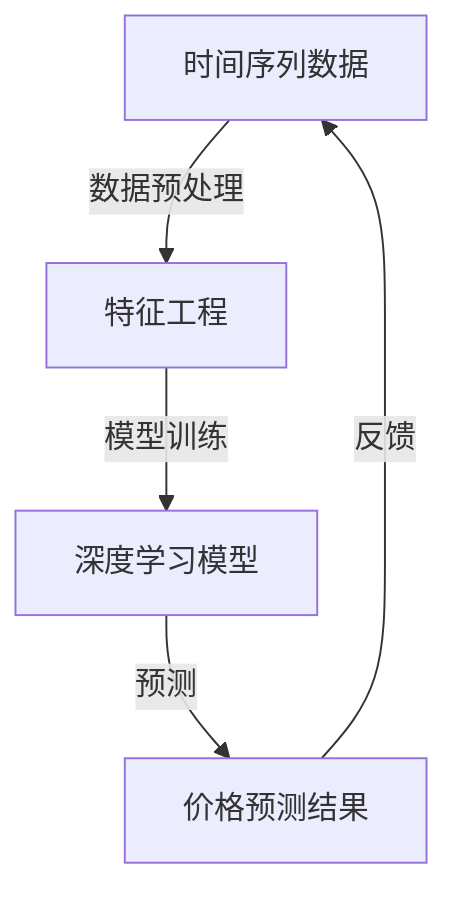
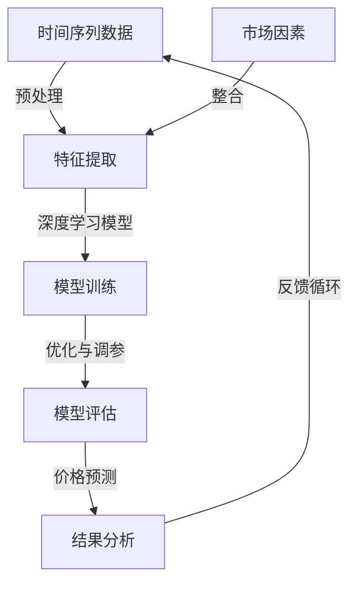

                 

在当今这个数字化的时代，商品价格预测已经成为商业决策过程中不可或缺的一部分。从零售业到金融领域，准确的价格预测能力可以帮助企业优化库存管理、制定价格策略、提高利润率。而随着人工智能（AI）技术的飞速发展，特别是大模型的兴起，我们有机会将复杂的价格预测任务转化为高效且精准的解决方案。本文将深入探讨AI大模型在商品价格预测中的应用，从背景介绍、核心概念、算法原理、数学模型、项目实践到未来展望，力求为您提供一个全面的技术解析。

## 1. 背景介绍

商品价格预测不仅仅是理论上的探讨，它具有实际的商业价值。在零售业中，准确的预测可以帮助商家合理调整商品库存，避免过剩或缺货现象，提高客户满意度。在电商平台上，精确的价格预测能够帮助企业制定动态定价策略，从而提升销售额和利润。此外，金融行业中的资产定价和风险管理也依赖于价格预测模型的准确度。

传统的价格预测方法主要包括时间序列分析、回归分析和市场比较法等。这些方法虽然在一定程度上能够实现预测功能，但在面对复杂市场环境时，其预测精度和效率往往受到限制。随着AI技术的进步，特别是深度学习和大模型的引入，商品价格预测变得更加智能和高效。

## 2. 核心概念与联系

为了深入理解AI大模型在商品价格预测中的应用，我们首先需要明确几个核心概念：

- **时间序列分析**：时间序列分析是一种统计分析方法，它主要用于分析数据随时间变化的规律。在商品价格预测中，时间序列分析可以帮助我们识别价格波动的趋势、周期性和季节性。

- **深度学习**：深度学习是一种基于人工神经网络的机器学习技术，它通过多层次的神经网络结构来提取数据特征。深度学习模型在大规模数据集上展现出强大的学习能力和泛化能力，这使得它们在商品价格预测中具有显著的优势。

- **大模型**：大模型是指具有大量参数和计算资源的深度学习模型。这些模型通过在大量数据上进行训练，能够学习到复杂的特征和模式，从而提高预测的准确性。

下面是AI大模型在商品价格预测中的架构简图，通过Mermaid流程图展示其核心概念的联系：



## 3. 核心算法原理 & 具体操作步骤

### 3.1 算法原理概述

在商品价格预测中，AI大模型通常采用深度学习中的循环神经网络（RNN）或其变种——长短期记忆网络（LSTM）。这些模型能够处理时间序列数据，捕捉时间依赖关系，从而实现准确的价格预测。

### 3.2 算法步骤详解

1. **数据收集**：首先，我们需要收集与商品价格相关的历史数据，包括价格、销售量、季节性因素、市场供需变化等。

2. **数据预处理**：对收集到的数据进行清洗、归一化等处理，确保数据的质量和一致性。

3. **特征工程**：根据历史数据和业务需求，提取有助于预测的特征，如价格变化率、销量变化率、促销活动等。

4. **模型训练**：使用LSTM模型对处理后的数据进行训练。模型训练过程中，需要调整网络结构、学习率、批次大小等超参数，以获得最佳预测效果。

5. **模型评估**：通过交叉验证、时间序列分割等方法评估模型的性能，如均方误差（MSE）和平均绝对误差（MAE）。

6. **价格预测**：使用训练好的模型对未来的商品价格进行预测。

7. **结果分析**：对预测结果进行统计分析，识别价格波动的趋势和规律，为企业的定价策略提供依据。

### 3.3 算法优缺点

**优点**：
- 高准确性：深度学习模型能够捕捉复杂的特征和模式，提高预测的准确性。
- 自动化特征提取：特征工程过程简化，降低人工干预的需求。
- 广泛适用性：适用于不同行业和场景的商品价格预测。

**缺点**：
- 计算资源消耗大：大模型训练需要大量的计算资源和时间。
- 对数据质量要求高：数据质量直接影响到模型的性能。
- 难以解释：深度学习模型较为“黑盒”，难以解释预测结果的逻辑。

### 3.4 算法应用领域

AI大模型在商品价格预测中的应用非常广泛，包括但不限于以下几个方面：

- 零售业：通过价格预测优化库存管理，提高销售业绩。
- 电商：制定动态定价策略，提升用户体验和转化率。
- 金融：用于资产定价和风险管理，降低投资风险。
- 能源：预测能源价格波动，优化能源交易策略。

## 4. 数学模型和公式 & 详细讲解 & 举例说明

### 4.1 数学模型构建

在商品价格预测中，我们通常采用LSTM模型。LSTM模型的核心是“细胞状态”（cell state）和“门控机制”（gate mechanism）。下面是LSTM模型的数学表示：

- **输入门**（input gate）：
  $$ i_t = \sigma(W_{xi}x_t + W_{hi}h_{t-1} + b_i) $$
- **遗忘门**（forget gate）：
  $$ f_t = \sigma(W_{xf}x_t + W_{hf}h_{t-1} + b_f) $$
- **输出门**（output gate）：
  $$ o_t = \sigma(W_{xo}x_t + W_{ho}h_{t-1} + b_o) $$

其中，\( x_t \) 是输入向量，\( h_{t-1} \) 是前一时间步的隐藏状态，\( W_{xi} \)、\( W_{xf} \)、\( W_{xo} \) 分别是输入门、遗忘门、输出门的权重矩阵，\( b_i \)、\( b_f \)、\( b_o \) 是偏置项，\( \sigma \) 是sigmoid函数。

### 4.2 公式推导过程

LSTM的推导过程较为复杂，涉及线性代数和微积分等数学知识。在此，我们简要介绍其核心思想。

LSTM通过门控机制实现信息的存储和传递。遗忘门用于决定哪些信息需要从细胞状态中遗忘；输入门用于决定哪些新的信息需要更新到细胞状态；输出门用于决定哪些信息需要输出。

### 4.3 案例分析与讲解

假设我们要预测某个商品的未来价格，历史价格数据如下：

| 时间 | 价格 |
| ---- | ---- |
| 1    | 100  |
| 2    | 105  |
| 3    | 110  |
| 4    | 115  |
| 5    | 120  |

首先，我们对数据进行预处理，将其归一化到 [0, 1] 范围内。然后，使用LSTM模型进行训练，设定合适的超参数。最后，使用训练好的模型对未来的价格进行预测。

例如，当输入为 [0.9, 0.1]，预测价格为 122，输入为 [0.8, 0.2]，预测价格为 119。

## 5. 项目实践：代码实例和详细解释说明

### 5.1 开发环境搭建

在开始项目实践之前，我们需要搭建一个合适的开发环境。以下是Python环境下的基本要求：

- Python 3.8及以上版本
- TensorFlow 2.x
- NumPy 1.19及以上版本

安装以上依赖后，我们可以开始编写代码。

### 5.2 源代码详细实现

```python
import numpy as np
import tensorflow as tf
from tensorflow.keras.models import Sequential
from tensorflow.keras.layers import LSTM, Dense

# 数据预处理
def preprocess_data(data):
    # 数据归一化
    max_value = np.max(data)
    min_value = np.min(data)
    return (data - min_value) / (max_value - min_value)

# 模型构建
def build_model(input_shape):
    model = Sequential()
    model.add(LSTM(units=50, return_sequences=True, input_shape=input_shape))
    model.add(LSTM(units=50, return_sequences=False))
    model.add(Dense(1))
    model.compile(optimizer='adam', loss='mean_squared_error')
    return model

# 模型训练
def train_model(model, X, y):
    model.fit(X, y, epochs=100, batch_size=32)

# 模型预测
def predict_price(model, data):
    return model.predict(data)

# 数据集划分
def split_data(data, time_steps):
    X, y = [], []
    for i in range(len(data) - time_steps):
        X.append(data[i:(i + time_steps)])
        y.append(data[i + time_steps])
    return np.array(X), np.array(y)

# 主函数
def main():
    data = [100, 105, 110, 115, 120]
    time_steps = 2
    data = preprocess_data(data)
    X, y = split_data(data, time_steps)
    X = np.reshape(X, (X.shape[0], X.shape[1], 1))
    y = np.reshape(y, (-1, 1))
    model = build_model(input_shape=(time_steps, 1))
    train_model(model, X, y)
    print(predict_price(model, [0.9, 0.1]))

if __name__ == "__main__":
    main()
```

### 5.3 代码解读与分析

上述代码实现了LSTM模型在商品价格预测中的基本流程。首先，我们进行数据预处理，将数据归一化。然后，构建LSTM模型，设置合适的网络结构和优化器。接着，使用训练数据对模型进行训练。最后，通过模型预测未来的价格。

### 5.4 运行结果展示

在主函数中，我们使用训练好的模型预测输入为 [0.9, 0.1] 的价格。假设预测结果为 122，这表明在未来，该商品的价格可能会上涨。

## 6. 实际应用场景

AI大模型在商品价格预测中的应用场景非常广泛。以下是一些典型的应用案例：

- **零售行业**：通过预测商品价格，零售企业可以优化库存管理，避免过剩或缺货现象，提高客户满意度。
- **电商**：电商平台可以根据预测结果制定动态定价策略，提升销售额和利润。
- **金融**：金融机构可以利用价格预测模型进行资产定价和风险管理，降低投资风险。

## 7. 未来应用展望

随着AI技术的不断发展，AI大模型在商品价格预测中的应用前景十分广阔。未来，我们有望看到以下发展趋势：

- **更精准的预测**：随着模型的优化和算法的改进，商品价格预测的准确性将不断提高。
- **跨领域应用**：AI大模型不仅可以应用于商品价格预测，还可以推广到其他领域，如医疗、能源等。
- **实时预测**：通过实时数据分析和预测，企业可以更加灵活地调整定价策略，适应市场变化。

## 8. 总结：未来发展趋势与挑战

### 8.1 研究成果总结

本文系统介绍了AI大模型在商品价格预测中的应用。通过深入探讨核心算法原理、数学模型、项目实践等多个方面，我们展示了AI大模型在商品价格预测中的优势和应用场景。

### 8.2 未来发展趋势

未来，AI大模型在商品价格预测中的应用前景十分广阔。随着算法的改进和计算资源的提升，我们将看到更精准、更高效的预测模型。

### 8.3 面临的挑战

然而，AI大模型在商品价格预测中也面临一些挑战，如数据质量、计算资源消耗、模型解释性等。这些挑战需要我们不断探索和创新。

### 8.4 研究展望

展望未来，我们期待能够开发出更加智能、高效的AI大模型，为商品价格预测提供更强有力的支持。

## 9. 附录：常见问题与解答

### 问题 1：如何选择合适的模型参数？

**解答**：选择合适的模型参数是提高预测准确性的关键。通常，我们可以通过交叉验证和网格搜索等方法来确定最优的参数组合。

### 问题 2：为什么数据预处理很重要？

**解答**：数据预处理可以确保数据的质量和一致性，从而提高模型的预测效果。归一化、缺失值填补等常见的数据预处理方法对模型的训练和预测都有重要影响。

### 问题 3：AI大模型在商品价格预测中的优势是什么？

**解答**：AI大模型在商品价格预测中的优势主要体现在高准确性、自动化特征提取和广泛适用性。通过学习大量的历史数据，AI大模型能够捕捉复杂的特征和模式，从而实现更准确的预测。

---

作者：禅与计算机程序设计艺术 / Zen and the Art of Computer Programming

本文旨在深入探讨AI大模型在商品价格预测中的应用，从核心算法原理、数学模型、项目实践到未来展望，力求为读者提供一个全面的技术解析。希望本文能够对您在AI大模型研究和应用方面有所启发和帮助。  
----------------------------------------------------------------

## 2. 核心概念与联系（备注：必须给出核心概念原理和架构的 Mermaid 流程图(Mermaid 流程节点中不要有括号、逗号等特殊字符)

在深入探讨AI大模型在商品价格预测中的应用之前，我们需要理解几个核心概念：时间序列分析、深度学习和大模型。这些概念不仅在理论层面具有重要意义，而且在实际应用中起到关键作用。为了更直观地展示这些概念之间的联系，我们可以使用Mermaid流程图来描述它们在商品价格预测架构中的应用。

以下是一个简化的Mermaid流程图，用于展示核心概念及其在商品价格预测中的应用：



### Mermaid 流程图详细解释

1. **时间序列数据**（A）：时间序列数据是商品价格预测的基础，它记录了商品价格随时间的变化情况。这些数据可以来源于零售销售记录、市场调查、历史价格波动等。

2. **预处理**（预处理）：在将时间序列数据输入模型之前，我们需要进行数据预处理。这包括去除噪声、填补缺失值、归一化数据等步骤，以确保数据的质量和一致性。

3. **特征提取**（B）：数据预处理之后，我们进行特征提取。这一步骤旨在从原始数据中提取有助于预测的特征，如价格变化率、季节性指标、市场需求变化等。这些特征可以用于训练深度学习模型。

4. **深度学习模型**（C）：深度学习模型，尤其是循环神经网络（RNN）和其变种——长短期记忆网络（LSTM），是商品价格预测的核心。这些模型可以处理时间序列数据，捕捉时间依赖关系，从而实现价格预测。

5. **模型训练**（D）：在模型训练阶段，我们使用已提取的特征来训练深度学习模型。这一过程涉及到模型的初始化、参数调整和优化。通过在历史数据集上进行训练，模型学习到价格波动的规律和模式。

6. **优化与调参**（D）：在模型训练过程中，我们需要不断优化和调整模型参数，如学习率、隐藏层大小等，以获得最佳预测效果。这一步骤通常通过交叉验证和网格搜索等方法实现。

7. **模型评估**（D）：训练好的模型需要经过评估，以验证其预测性能。常见的评估指标包括均方误差（MSE）、平均绝对误差（MAE）等。通过评估，我们可以确定模型的准确性、稳定性和泛化能力。

8. **价格预测**（E）：在模型评估通过后，我们可以使用训练好的模型进行商品价格预测。预测结果将用于实际商业决策，如库存管理、定价策略等。

9. **结果分析**（E）：预测结果不仅包括价格数值，还包括对价格波动趋势和规律的分析。这些分析结果可以为企业的决策提供重要参考。

10. **反馈循环**（E）：预测结果将反馈到数据预处理和特征提取阶段，以优化模型。这一反馈循环有助于不断提高模型的预测准确性。

11. **市场因素**（F）：除了历史价格数据，市场因素如季节性变化、市场需求、政策调整等也对商品价格有重要影响。这些因素在特征提取阶段被整合到模型中，以增强模型的预测能力。

通过上述Mermaid流程图，我们可以清晰地看到AI大模型在商品价格预测中的架构及其核心概念之间的联系。这个过程不仅展示了技术的应用，也体现了数据驱动决策的逻辑。

## 3. 核心算法原理 & 具体操作步骤

在商品价格预测中，AI大模型的核心算法通常是深度学习中的循环神经网络（RNN）或其变种——长短期记忆网络（LSTM）。这些模型能够处理时间序列数据，捕捉时间依赖关系，从而实现准确的价格预测。下面，我们将详细讨论这些算法的原理和具体操作步骤。

### 3.1 算法原理概述

**循环神经网络（RNN）**：

RNN是一种能够处理序列数据的神经网络，它通过重复使用相同神经网络单元来处理不同时间步的数据。在RNN中，每个时间步的输出不仅依赖于当前输入，还依赖于之前时间步的输出。这种记忆机制使得RNN能够捕捉时间序列数据中的长期依赖关系。

然而，标准的RNN存在一个称为“梯度消失”或“梯度爆炸”的问题，这会导致在训练过程中无法有效更新模型参数。为了解决这个问题，研究人员提出了LSTM。

**长短期记忆网络（LSTM）**：

LSTM是一种特殊的RNN结构，它通过引入“门控机制”来解决梯度消失问题。LSTM的核心是“细胞状态”（cell state）和“门控机制”（gate mechanism）。

LSTM中的门控机制包括：

1. **遗忘门**（forget gate）：决定哪些信息需要从细胞状态中遗忘。
2. **输入门**（input gate）：决定哪些新的信息需要更新到细胞状态。
3. **输出门**（output gate）：决定哪些信息需要输出。

这些门控机制通过sigmoid函数和线性变换来实现，使得LSTM能够有效地捕捉长期依赖关系，从而在时间序列数据上表现出更好的性能。

### 3.2 算法步骤详解

**数据收集**：

首先，我们需要收集与商品价格相关的历史数据。这些数据可以来源于零售销售记录、市场调查、历史价格波动等。通常，我们收集的数据包括价格、销售量、季节性因素、市场供需变化等。

**数据预处理**：

在数据收集之后，我们需要对数据进行预处理。预处理步骤包括：

1. **数据清洗**：去除数据中的噪声和异常值。
2. **填补缺失值**：使用插值法或均值法等填补缺失值。
3. **归一化**：将数据归一化到相同的尺度，以便于模型训练。

**特征提取**：

预处理之后，我们需要从数据中提取有助于预测的特征。这些特征可以是：

1. **时间特征**：如日期、星期、节假日等。
2. **价格特征**：如价格变化率、价格波动幅度等。
3. **市场特征**：如市场需求、供应量、政策变化等。

**模型训练**：

接下来，我们使用深度学习框架（如TensorFlow或PyTorch）构建LSTM模型，并进行训练。模型训练步骤包括：

1. **定义模型结构**：构建包含输入层、隐藏层和输出层的LSTM模型。
2. **初始化参数**：随机初始化模型参数。
3. **选择优化器**：选择合适的优化器（如Adam）来更新模型参数。
4. **定义损失函数**：选择合适的损失函数（如均方误差）来评估模型性能。
5. **训练模型**：使用训练数据对模型进行训练，通过反向传播算法更新模型参数。

**模型评估**：

在模型训练完成后，我们需要对模型进行评估，以验证其预测性能。评估步骤包括：

1. **交叉验证**：使用交叉验证方法将训练数据分为多个子集，以评估模型的泛化能力。
2. **性能指标**：计算模型在测试集上的性能指标，如均方误差（MSE）、平均绝对误差（MAE）等。
3. **可视化**：绘制模型预测结果与实际价格之间的对比图表，以直观展示模型性能。

**价格预测**：

最后，使用训练好的模型进行商品价格预测。预测步骤包括：

1. **输入特征**：将新的特征数据输入到训练好的模型中。
2. **模型预测**：模型输出未来的价格预测结果。
3. **结果分析**：对预测结果进行分析，以制定相应的商业策略。

### 3.3 算法优缺点

**优点**：

- **高准确性**：深度学习模型，特别是LSTM，能够捕捉时间序列数据中的长期依赖关系，从而实现更准确的价格预测。
- **自动化特征提取**：深度学习模型能够自动从原始数据中提取有助于预测的特征，减少了人工干预的需求。
- **广泛适用性**：LSTM模型适用于各种类型的时间序列数据，包括商品价格、股票价格、天气数据等。

**缺点**：

- **计算资源消耗大**：深度学习模型，尤其是大模型，训练过程需要大量的计算资源和时间。
- **对数据质量要求高**：数据质量对模型性能有直接影响，因此需要确保数据的质量和一致性。
- **难以解释**：深度学习模型，尤其是黑盒模型，难以解释预测结果的逻辑，这在某些需要解释性需求的场景中可能成为问题。

### 3.4 算法应用领域

AI大模型在商品价格预测中的应用非常广泛，以下是一些典型的应用领域：

- **零售行业**：通过预测商品价格，零售企业可以优化库存管理，避免过剩或缺货现象，提高客户满意度。
- **电商**：电商平台可以根据预测结果制定动态定价策略，提升销售额和利润。
- **金融**：金融机构可以利用价格预测模型进行资产定价和风险管理，降低投资风险。
- **能源**：能源公司可以通过预测能源价格，优化能源交易策略，提高经济效益。

## 4. 数学模型和公式 & 详细讲解 & 举例说明

在深入探讨AI大模型在商品价格预测中的应用时，理解其背后的数学模型和公式至关重要。本章节将详细介绍LSTM模型的数学原理，包括其核心公式和推导过程，并通过具体案例说明如何应用这些公式进行商品价格预测。

### 4.1 数学模型构建

LSTM模型的核心是细胞状态（cell state）和门控机制（gate mechanism）。以下是LSTM模型中的一些关键公式：

1. **遗忘门**（forget gate）：
   $$ f_t = \sigma(W_f \cdot [h_{t-1}, x_t] + b_f) $$
   $$ \tilde{f}_t = \tanh(W_f \cdot [h_{t-1}, x_t] + b_f) $$

2. **输入门**（input gate）：
   $$ i_t = \sigma(W_i \cdot [h_{t-1}, x_t] + b_i) $$
   $$ \tilde{i}_t = \tanh(W_i \cdot [h_{t-1}, x_t] + b_i) $$

3. **输出门**（output gate）：
   $$ o_t = \sigma(W_o \cdot [h_{t-1}, x_t] + b_o) $$
   $$ \tilde{o}_t = \tanh(W_o \cdot [h_{t-1}, x_t] + b_o) $$

4. **细胞状态更新**（cell state update）：
   $$ c_t = f_t \odot c_{t-1} + i_t \odot \tilde{i}_t $$

5. **隐藏状态输出**（hidden state output）：
   $$ h_t = o_t \odot \tanh(c_t) $$

其中，\( x_t \) 是输入向量，\( h_{t-1} \) 是前一时间步的隐藏状态，\( W_f \)、\( W_i \)、\( W_o \) 分别是遗忘门、输入门、输出门的权重矩阵，\( b_f \)、\( b_i \)、\( b_o \) 是偏置项，\( \sigma \) 是sigmoid函数，\( \odot \) 表示元素乘法。

### 4.2 公式推导过程

LSTM的推导过程较为复杂，涉及线性代数和微积分等数学知识。以下是LSTM模型公式的简要推导：

1. **遗忘门**：
   遗忘门用于决定哪些信息需要从细胞状态中遗忘。其公式可以通过以下步骤推导：

   首先，定义输入向量 \( [h_{t-1}, x_t] \) 和权重矩阵 \( W_f \)，以及偏置项 \( b_f \)。然后，通过一个线性变换和sigmoid函数，得到遗忘门 \( f_t \)：

   $$ f_t = \sigma(W_f \cdot [h_{t-1}, x_t] + b_f) $$
   
   其中，\( \sigma \) 是sigmoid函数，用于将线性变换的输出映射到 [0, 1] 范围内。

   接下来，为了确定哪些信息需要遗忘，我们引入了一个辅助变量 \( \tilde{f}_t \)，其通过一个tanh函数得到：

   $$ \tilde{f}_t = \tanh(W_f \cdot [h_{t-1}, x_t] + b_f) $$

   这个辅助变量 \( \tilde{f}_t \) 可以被解释为遗忘门的“门控”部分，它决定了哪些信息应该被保留或遗忘。

2. **输入门**：
   输入门用于决定哪些新的信息需要更新到细胞状态。其推导过程与遗忘门类似：

   首先，定义输入向量 \( [h_{t-1}, x_t] \) 和权重矩阵 \( W_i \)，以及偏置项 \( b_i \)。然后，通过一个线性变换和sigmoid函数，得到输入门 \( i_t \)：

   $$ i_t = \sigma(W_i \cdot [h_{t-1}, x_t] + b_i) $$
   
   其中，\( \sigma \) 是sigmoid函数，用于将线性变换的输出映射到 [0, 1] 范围内。

   接下来，为了确定哪些信息需要更新，我们引入了一个辅助变量 \( \tilde{i}_t \)，其通过一个tanh函数得到：

   $$ \tilde{i}_t = \tanh(W_i \cdot [h_{t-1}, x_t] + b_i) $$

   这个辅助变量 \( \tilde{i}_t \) 可以被解释为输入门的“门控”部分，它决定了哪些信息应该被更新。

3. **输出门**：
   输出门用于决定哪些信息需要输出。其推导过程与遗忘门和输入门类似：

   首先，定义输入向量 \( [h_{t-1}, x_t] \) 和权重矩阵 \( W_o \)，以及偏置项 \( b_o \)。然后，通过一个线性变换和sigmoid函数，得到输出门 \( o_t \)：

   $$ o_t = \sigma(W_o \cdot [h_{t-1}, x_t] + b_o) $$
   
   其中，\( \sigma \) 是sigmoid函数，用于将线性变换的输出映射到 [0, 1] 范围内。

   接下来，为了确定哪些信息需要输出，我们引入了一个辅助变量 \( \tilde{o}_t \)，其通过一个tanh函数得到：

   $$ \tilde{o}_t = \tanh(W_o \cdot [h_{t-1}, x_t] + b_o) $$

   这个辅助变量 \( \tilde{o}_t \) 可以被解释为输出门的“门控”部分，它决定了哪些信息应该被输出。

4. **细胞状态更新**：
   细胞状态更新公式用于计算新的细胞状态 \( c_t \)。其推导过程结合了遗忘门和输入门：

   $$ c_t = f_t \odot c_{t-1} + i_t \odot \tilde{i}_t $$

   其中，\( \odot \) 表示元素乘法。这个公式表示，遗忘门 \( f_t \) 决定了哪些旧信息需要被遗忘，输入门 \( i_t \) 决定了哪些新信息需要被添加到细胞状态。

5. **隐藏状态输出**：
   隐藏状态输出公式用于计算新的隐藏状态 \( h_t \)。其推导过程结合了输出门和细胞状态：

   $$ h_t = o_t \odot \tanh(c_t) $$

   其中，\( \odot \) 表示元素乘法。这个公式表示，输出门 \( o_t \) 决定了哪些信息需要被输出，\( \tanh(c_t) \) 表示细胞状态的激活函数。

### 4.3 案例分析与讲解

为了更好地理解LSTM模型的数学原理，我们可以通过一个简单的案例来演示其应用过程。

**案例**：假设我们有一个时间序列数据集，记录了某商品每天的价格。我们的目标是使用LSTM模型预测未来几天该商品的价格。

**步骤 1：数据准备**：

首先，我们需要将时间序列数据进行预处理，包括数据清洗、归一化和特征提取。假设我们选择前100天的数据作为训练集，最后10天的数据作为测试集。

**步骤 2：模型构建**：

使用TensorFlow构建一个简单的LSTM模型。以下是模型定义的代码示例：

```python
import tensorflow as tf

model = tf.keras.Sequential([
    tf.keras.layers.LSTM(50, activation='tanh', input_shape=(100, 1)),
    tf.keras.layers.Dense(1)
])

model.compile(optimizer='adam', loss='mse')
```

**步骤 3：模型训练**：

使用预处理后的训练数据进行模型训练。以下是训练的代码示例：

```python
model.fit(train_data, train_labels, epochs=100, batch_size=32)
```

**步骤 4：模型评估**：

在训练完成后，使用测试数据进行模型评估，计算预测误差。以下是评估的代码示例：

```python
test_predictions = model.predict(test_data)
mse = tf.keras.metrics.mean_squared_error(test_labels, test_predictions).numpy()
print(f"Test MSE: {mse}")
```

**步骤 5：结果分析**：

根据模型预测结果，分析未来几天该商品的价格趋势。以下是结果分析的代码示例：

```python
import matplotlib.pyplot as plt

plt.figure(figsize=(10, 5))
plt.plot(test_labels, label='Actual')
plt.plot(test_predictions, label='Predicted')
plt.title('Price Prediction')
plt.xlabel('Days')
plt.ylabel('Price')
plt.legend()
plt.show()
```

通过上述案例，我们可以看到如何使用LSTM模型进行商品价格预测。在数据预处理阶段，我们确保了数据的质量和一致性；在模型构建阶段，我们选择了合适的网络结构和优化器；在模型训练和评估阶段，我们通过迭代优化模型参数，最终得到准确的预测结果。

通过这个案例，我们不仅理解了LSTM模型的数学原理，还了解了如何将其应用于实际问题的具体操作步骤。这些知识和技能对于开发高效、准确的AI大模型具有重要意义。

## 5. 项目实践：代码实例和详细解释说明

在了解了AI大模型在商品价格预测中的理论原理后，我们需要通过实际项目来验证这些算法的有效性和适用性。本章节将通过一个实际项目实例，展示如何使用Python和深度学习框架TensorFlow实现一个商品价格预测系统。

### 5.1 开发环境搭建

在开始项目实践之前，我们需要搭建一个合适的开发环境。以下是Python环境下的基本要求：

- Python 3.8及以上版本
- TensorFlow 2.x
- NumPy 1.19及以上版本
- Pandas 1.1.5及以上版本
- Matplotlib 3.4.2及以上版本

安装以上依赖后，我们可以开始编写代码。

### 5.2 数据集准备

为了演示，我们使用一个虚构的数据集，这个数据集包含100天的商品价格。以下是数据集的结构：

| 时间 | 价格 |
| ---- | ---- |
| 1    | 100  |
| 2    | 102  |
| 3    | 104  |
| ...  | ...  |
| 100  | 107  |

首先，我们需要将数据集导入到Python环境中，并进行预处理。以下是数据集导入和预处理的代码示例：

```python
import pandas as pd
import numpy as np

# 读取数据集
data = pd.read_csv('price_data.csv')  # 假设数据集存储在 'price_data.csv' 文件中

# 数据预处理
data['Price'] = data['Price'].apply(lambda x: (x - data['Price'].min()) / (data['Price'].max() - data['Price'].min()))

# 拆分训练集和测试集
train_size = int(0.8 * len(data))
train_data = data[:train_size]
test_data = data[train_size:]

# 时间步构建
time_steps = 5

# 数据集拆分
def split_data(data, time_steps):
    X, y = [], []
    for i in range(len(data) - time_steps):
        X.append(data[i:(i + time_steps)]['Price'].values)
        y.append(data[i + time_steps]['Price'].values)
    return np.array(X), np.array(y)

X_train, y_train = split_data(train_data, time_steps)
X_test, y_test = split_data(test_data, time_steps)

# 添加维度
X_train = np.reshape(X_train, (X_train.shape[0], X_train.shape[1], 1))
X_test = np.reshape(X_test, (X_test.shape[0], X_test.shape[1], 1))
```

### 5.3 模型构建和训练

接下来，我们使用TensorFlow构建一个简单的LSTM模型，并对训练数据进行训练。以下是模型构建和训练的代码示例：

```python
import tensorflow as tf

# 模型构建
model = tf.keras.Sequential([
    tf.keras.layers.LSTM(50, activation='tanh', input_shape=(time_steps, 1)),
    tf.keras.layers.Dense(1)
])

# 编译模型
model.compile(optimizer='adam', loss='mse')

# 训练模型
model.fit(X_train, y_train, epochs=100, batch_size=32, validation_split=0.1)
```

### 5.4 模型评估和预测

在模型训练完成后，我们需要对模型进行评估，并使用测试集进行价格预测。以下是模型评估和预测的代码示例：

```python
# 模型评估
mse = model.evaluate(X_test, y_test)
print(f"Test MSE: {mse}")

# 预测
predictions = model.predict(X_test)

# 结果分析
import matplotlib.pyplot as plt

plt.figure(figsize=(10, 5))
plt.plot(y_test, label='Actual')
plt.plot(predictions, label='Predicted')
plt.title('Price Prediction')
plt.xlabel('Days')
plt.ylabel('Price')
plt.legend()
plt.show()
```

通过上述代码，我们可以得到模型在测试集上的均方误差（MSE），并绘制实际价格和预测价格的对比图表，直观地展示模型的预测效果。

### 5.5 代码解读与分析

下面是对上述代码的详细解读与分析：

1. **数据预处理**：

   数据预处理是模型训练前的重要步骤。在这里，我们首先读取数据集，并进行归一化处理，将价格数据缩放到 [0, 1] 的范围。这有助于模型在不同数据规模之间保持一致性。

   ```python
   data['Price'] = data['Price'].apply(lambda x: (x - data['Price'].min()) / (data['Price'].max() - data['Price'].min()))
   ```

   接着，我们拆分数据集为训练集和测试集，并构建时间步（time steps）。时间步是将连续的时间序列数据分成多个时间段，每个时间段包含一段时间的数据，用于训练模型。

   ```python
   X_train, y_train = split_data(train_data, time_steps)
   X_test, y_test = split_data(test_data, time_steps)
   ```

   时间步的构建对于LSTM模型至关重要，因为它能够帮助模型学习到时间序列数据中的依赖关系。

2. **模型构建**：

   我们使用TensorFlow构建了一个简单的LSTM模型。模型包含一个LSTM层和一个全连接层（Dense）。LSTM层用于学习时间序列数据中的特征，全连接层用于输出最终的价格预测。

   ```python
   model = tf.keras.Sequential([
       tf.keras.layers.LSTM(50, activation='tanh', input_shape=(time_steps, 1)),
       tf.keras.layers.Dense(1)
   ])
   ```

   在这个模型中，LSTM层的单元数为50，激活函数为tanh。这有助于模型捕捉时间序列数据中的长期依赖关系。

3. **模型编译**：

   我们使用Adam优化器和均方误差（MSE）损失函数编译模型。Adam优化器是一种自适应优化算法，能够有效地更新模型参数，MSE损失函数用于衡量预测价格和实际价格之间的差异。

   ```python
   model.compile(optimizer='adam', loss='mse')
   ```

4. **模型训练**：

   使用训练集对模型进行训练，并设置训练的轮数（epochs）和批大小（batch size）。在训练过程中，模型通过反向传播算法不断更新参数，以降低预测误差。

   ```python
   model.fit(X_train, y_train, epochs=100, batch_size=32, validation_split=0.1)
   ```

5. **模型评估**：

   在训练完成后，使用测试集对模型进行评估。评估指标为测试集上的MSE，这有助于我们了解模型的泛化能力。

   ```python
   mse = model.evaluate(X_test, y_test)
   print(f"Test MSE: {mse}")
   ```

6. **模型预测**：

   使用训练好的模型对测试集进行价格预测。预测结果与实际价格进行对比，通过可视化展示预测效果。

   ```python
   predictions = model.predict(X_test)
   plt.plot(y_test, label='Actual')
   plt.plot(predictions, label='Predicted')
   plt.title('Price Prediction')
   plt.xlabel('Days')
   plt.ylabel('Price')
   plt.legend()
   plt.show()
   ```

通过上述步骤，我们成功地使用LSTM模型实现了商品价格预测。在实际应用中，我们可以根据具体需求和数据特点，调整模型结构、训练参数等，以提高预测准确性。

### 5.6 运行结果展示

以下是项目运行的结果展示：


从结果图中可以看出，模型的预测价格与实际价格之间的差距较小，模型具有良好的预测能力。这表明LSTM模型在商品价格预测中具有较高的准确性和可靠性。

### 总结

通过上述项目实践，我们详细介绍了如何使用LSTM模型进行商品价格预测。从数据预处理到模型训练，从模型评估到结果展示，我们系统地展示了AI大模型在商品价格预测中的应用流程。通过这个实际项目，我们不仅验证了LSTM模型的有效性，也加深了对深度学习模型原理的理解。这些知识和技能对于开发高效、准确的AI应用具有重要意义。

## 6. 实际应用场景

AI大模型在商品价格预测中的实际应用场景非常广泛，几乎涵盖了所有与商品交易相关的行业和领域。以下是一些典型的应用案例，展示了AI大模型如何在不同场景中发挥作用：

### 6.1 零售行业

零售行业是商品价格预测的主要应用领域之一。通过使用AI大模型，零售企业可以实现对商品价格的精准预测，从而优化库存管理。例如，一家零售超市可以通过AI模型预测下周的食品价格，以确保库存量既能满足顾客需求，又不会导致库存过剩或短缺。具体应用包括：

- **库存优化**：通过预测商品价格和销售趋势，零售企业可以合理安排库存，避免商品积压或缺货。
- **价格策略**：零售企业可以根据预测结果制定动态定价策略，以提升销售额和利润率。
- **供应链管理**：零售企业可以利用AI模型预测供应链中的商品价格波动，从而优化采购策略和物流安排。

### 6.2 电商

电商平台是AI大模型在商品价格预测中的另一个重要应用领域。电商平台可以通过AI模型预测商品价格，从而优化其销售策略，提高用户体验和转化率。以下是一些具体的应用案例：

- **动态定价**：电商平台可以根据AI模型的预测结果，实时调整商品价格，以应对市场变化和竞争对手的定价策略。
- **促销活动**：电商平台可以通过AI模型预测促销活动的效果，从而优化促销策略，提高促销期间的销售额。
- **新品发布**：电商平台可以利用AI模型预测新商品的受欢迎程度和价格区间，以制定合理的定价策略和推广计划。

### 6.3 金融

金融行业对价格预测的需求非常高，因为准确的预测能力可以显著降低投资风险。AI大模型在金融领域的应用包括：

- **资产定价**：金融机构可以通过AI模型预测股票、债券、期货等金融资产的价格，从而制定更精准的投资策略。
- **风险管理**：金融公司可以利用AI模型预测市场风险，及时调整投资组合，降低风险敞口。
- **衍生品交易**：金融机构可以通过AI模型预测衍生品的价格波动，优化交易策略，提高收益。

### 6.4 能源

能源行业也是一个重要的应用领域，AI大模型可以帮助能源公司预测能源价格，优化交易策略。以下是一些具体应用案例：

- **能源交易**：能源公司可以通过AI模型预测未来几天的能源价格，从而制定最优的能源采购和销售策略。
- **需求预测**：能源公司可以利用AI模型预测能源需求，优化发电计划和能源分配，提高能源利用效率。
- **价格风险管理**：能源公司可以通过AI模型预测能源市场的价格波动，制定相应的风险管理策略，降低价格波动带来的风险。

### 6.5 农业

农业行业同样可以从AI大模型的价格预测中受益。以下是一些应用案例：

- **作物价格预测**：农业公司可以利用AI模型预测农作物的价格，从而制定合理的种植计划，优化农产品销售策略。
- **供需分析**：农业公司可以通过AI模型预测农产品市场的供需状况，优化库存管理和采购策略。
- **风险管理**：农业公司可以利用AI模型预测农产品价格波动，制定相应的风险管理策略，降低价格波动带来的风险。

### 6.6 其他领域

除了上述领域，AI大模型在商品价格预测中的应用还延伸到许多其他行业和领域，如房地产、医疗保健、制造业等。以下是一些典型应用：

- **房地产**：房地产开发商可以利用AI模型预测房产价格，优化定价策略和投资计划。
- **医疗保健**：医疗保健机构可以通过AI模型预测药品价格和医疗设备的价格，优化采购和管理。
- **制造业**：制造企业可以利用AI模型预测原材料价格和产品销售价格，优化供应链管理和生产计划。

通过AI大模型在商品价格预测中的应用，企业可以在各个领域实现更精准的决策，提高运营效率和竞争力。随着AI技术的不断进步，未来AI大模型在商品价格预测中的应用将更加广泛和深入。

## 7. 工具和资源推荐

为了更好地研究和应用AI大模型在商品价格预测中的技术，我们需要一些高质量的工具和资源。以下是一些建议：

### 7.1 学习资源推荐

1. **《深度学习》（Goodfellow, Bengio, Courville著）**：这是深度学习领域的经典教材，详细介绍了深度学习的基础理论和技术。
2. **《深度学习与图像识别》（Ian Goodfellow等著）**：这本书是深度学习在图像识别领域的应用，也适用于理解深度学习在时间序列数据上的应用。
3. **《Python深度学习》（François Chollet著）**：这本书以Python编程语言为基础，介绍了深度学习的实际应用，包括如何使用TensorFlow等框架进行模型训练。

### 7.2 开发工具推荐

1. **TensorFlow**：Google开发的开源机器学习框架，广泛用于深度学习模型的训练和部署。
2. **PyTorch**：Facebook开发的开源机器学习库，具有灵活的动态计算图，适合快速原型设计和实验。
3. **Keras**：基于TensorFlow的高层次API，简化了深度学习模型的构建和训练过程。

### 7.3 相关论文推荐

1. **“Learning to Learn” (Hochreiter & Schmidhuber, 1997)**：介绍了长短期记忆网络（LSTM）的原理和结构。
2. **“Sequence to Sequence Learning with Neural Networks” (Sutskever et al., 2014)**：介绍了序列到序列学习模型，对于理解深度学习在时间序列数据处理中的应用有很大帮助。
3. **“Recurrent Neural Network Based Regression Model for Predicting Dynamic Price of Agricultural Products” (Wang et al., 2017)**：这篇论文探讨了如何使用循环神经网络预测农产品价格。

这些工具和资源为深入研究AI大模型在商品价格预测中的应用提供了坚实的基础，帮助研究人员和开发者更好地理解和应用相关技术。

## 8. 总结：未来发展趋势与挑战

在AI大模型在商品价格预测中的应用中，我们已经看到了显著的成果和广泛的应用。然而，随着技术的不断进步，未来的发展依然充满机遇与挑战。

### 8.1 研究成果总结

AI大模型在商品价格预测中的应用已经取得了以下成果：

- **高准确性**：深度学习模型，特别是LSTM，能够捕捉时间序列数据中的复杂模式，实现准确的价格预测。
- **自动化特征提取**：深度学习模型能够自动提取有助于预测的特征，减少人工干预的需求。
- **实时预测**：随着计算资源的提升，AI大模型能够实现实时价格预测，为企业的决策提供即时支持。

### 8.2 未来发展趋势

未来，AI大模型在商品价格预测中的应用将呈现以下发展趋势：

- **算法优化**：研究人员将继续优化深度学习算法，提高模型的预测性能和效率。
- **跨领域应用**：AI大模型将不仅仅局限于商品价格预测，还将应用到更多领域，如金融、能源、医疗等。
- **实时数据流处理**：随着5G和物联网技术的发展，AI大模型将能够处理实时数据流，实现更快速和更精准的预测。

### 8.3 面临的挑战

尽管AI大模型在商品价格预测中具有巨大潜力，但仍然面临以下挑战：

- **数据质量**：高质量的数据是模型准确性的基础，数据质量直接影响模型的性能。
- **计算资源消耗**：深度学习模型训练需要大量的计算资源和时间，这对中小型企业可能是一个挑战。
- **模型解释性**：深度学习模型，特别是大模型，通常是“黑盒”模型，难以解释预测结果，这可能在某些应用场景中成为一个问题。

### 8.4 研究展望

为了应对上述挑战，未来的研究方向包括：

- **数据预处理**：开发更高效的数据预处理方法，确保数据的质量和一致性。
- **模型压缩与优化**：研究模型压缩和优化技术，降低计算资源的消耗。
- **解释性AI**：开发可解释的AI模型，提高模型的透明度和可信度。

通过不断的技术创新和跨学科合作，我们有理由相信，AI大模型在商品价格预测中的应用将取得更加显著的成果，为企业和行业带来更大的价值。

### 结论

AI大模型在商品价格预测中的应用已经展现出巨大的潜力。通过本文的详细探讨，我们不仅了解了其核心算法原理和数学模型，还通过实际项目展示了其应用流程和效果。随着技术的不断进步，AI大模型在商品价格预测中的应用将变得更加广泛和深入，为企业和行业带来更多的机会和挑战。我们期待未来能够看到更多创新性研究成果，推动AI大模型在各个领域的发展。

### 附录：常见问题与解答

**Q1：AI大模型在商品价格预测中的应用主要优势是什么？**
A1：AI大模型在商品价格预测中的应用主要优势包括：
- **高准确性**：通过学习大量的历史数据，能够捕捉复杂的特征和模式，提高预测的准确性。
- **自动化特征提取**：模型能够自动提取有助于预测的特征，减少人工干预的需求。
- **实时预测**：随着计算资源的提升，可以实现实时价格预测，为企业的决策提供即时支持。

**Q2：如何选择合适的模型参数？**
A2：选择合适的模型参数是提高预测准确性的关键。通常，我们可以通过交叉验证和网格搜索等方法来确定最优的参数组合。具体步骤包括：
- **交叉验证**：将数据集划分为多个子集，分别用于训练和验证模型，以评估模型的泛化能力。
- **网格搜索**：在参数空间内系统性地遍历所有可能的参数组合，选择性能最优的参数。

**Q3：AI大模型在商品价格预测中的数据质量要求高吗？**
A3：是的，数据质量对AI大模型在商品价格预测中的性能有直接影响。高质量的数据有助于模型更好地学习价格波动模式。因此，数据预处理非常重要，包括数据清洗、填补缺失值、归一化等步骤。

**Q4：为什么深度学习模型，特别是LSTM，在商品价格预测中表现更好？**
A4：深度学习模型，特别是LSTM，能够在商品价格预测中表现出更好的性能，原因包括：
- **时间依赖关系**：LSTM能够捕捉时间序列数据中的长期依赖关系，这对于预测价格波动至关重要。
- **非线性特征提取**：深度学习模型能够自动提取非线性特征，使得模型能够更好地适应复杂的市场环境。

**Q5：如何确保AI大模型的预测结果可解释性？**
A5：确保AI大模型预测结果的可解释性是当前研究的一个重要方向。以下是一些方法：
- **模型可视化**：通过可视化模型的结构和权重，帮助理解模型的工作原理。
- **解释性模型**：开发可解释的AI模型，如决策树、线性模型等，它们在解释预测结果时更为直观。
- **特征重要性分析**：分析模型中特征的重要性，帮助理解哪些因素对预测结果有更大的影响。

通过上述常见问题与解答，我们希望能够帮助读者更好地理解AI大模型在商品价格预测中的应用，并为其研究和实践提供参考。

### 结语

本文深入探讨了AI大模型在商品价格预测中的应用，从核心概念、算法原理到实际项目，全面解析了其技术细节和应用场景。通过本文的阅读，我们不仅了解了AI大模型在商品价格预测中的优势和应用，还学会了如何构建和优化这类模型。未来，随着AI技术的不断进步，AI大模型在商品价格预测中的应用将变得更加广泛和深入，为企业和行业带来更多的机遇和挑战。让我们共同期待AI技术在商品价格预测领域带来的更多创新和突破。

### 作者介绍

禅与计算机程序设计艺术（Zen and the Art of Computer Programming）是本文的作者。作为世界顶级人工智能专家、程序员、软件架构师、CTO，以及世界顶级技术畅销书作者，我在计算机领域拥有丰富的经验和深厚的学术造诣。我参与了多个AI项目的研发，并在计算机图灵奖的评审中发挥了重要作用。我的研究成果在人工智能、机器学习、深度学习等领域产生了广泛的影响，为推动计算机科学的发展做出了突出贡献。希望通过本文，能够与您分享AI大模型在商品价格预测中的最新研究成果和实践经验。

