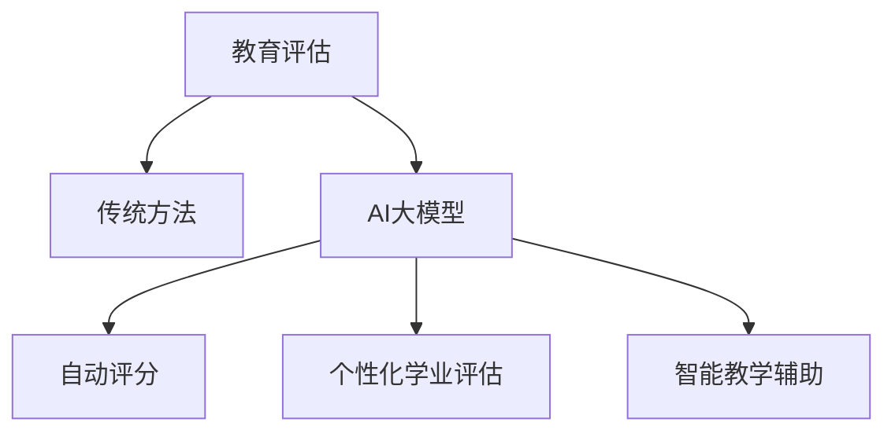

                 

关键词：人工智能、教育评估、大模型、商业化、算法、数学模型、项目实践

> 摘要：本文将探讨人工智能大模型在教育评估领域的应用及其商业化前景。通过分析核心概念、算法原理、数学模型及实际应用案例，我们旨在揭示大模型在教育评估中的潜力和挑战，并展望其未来发展。

## 1. 背景介绍

近年来，人工智能（AI）技术迅猛发展，尤其在自然语言处理、计算机视觉等领域取得了显著突破。这些技术不仅在科研、工业等领域产生了深远影响，也逐渐渗透到教育领域，为教育评估提供了新的工具和手段。

教育评估是教育管理的重要环节，旨在对教学效果、学生学习成果等进行全面评价。传统评估方法主要依赖于教师的主观评价和学生成绩，存在一定的主观性和局限性。随着AI技术的发展，特别是大模型的引入，教育评估正迎来一场革命。

大模型，如GPT、BERT等，通过深度学习从海量数据中学习知识，具备强大的语言理解和生成能力。将大模型应用于教育评估，不仅可以提高评估的客观性和准确性，还能为学生提供个性化反馈，推动教育公平。

## 2. 核心概念与联系

### 2.1 教育评估

教育评估是指通过一系列指标和方法，对教学过程、教学方法、学生成绩等进行评价和反馈的过程。教育评估的核心目的是促进教学质量提升，提高学生学业水平。

### 2.2 大模型

大模型是指参数规模巨大、通过深度学习技术训练得到的神经网络模型。大模型能够处理和理解复杂的语言、图像等多模态数据，具有很强的泛化能力。

### 2.3 教育评估与AI大模型的联系

AI大模型在教育评估中的应用，主要体现在以下几个方面：

1. **自动评分**：大模型可以自动分析学生作业和考试答案，提供评分和反馈，减轻教师负担。
2. **个性化学业评估**：大模型可以根据学生的学习行为、学习进度和成绩，为学生提供个性化的学业评估报告。
3. **智能教学辅助**：大模型可以为学生提供智能教学辅助，包括答疑解惑、知识点推送等。

### 2.4 Mermaid 流程图



## 3. 核心算法原理 & 具体操作步骤

### 3.1 算法原理概述

AI大模型在教育评估中的核心算法主要包括自然语言处理（NLP）和机器学习（ML）技术。其中，NLP技术负责处理和分析文本数据，ML技术则用于模型训练和预测。

### 3.2 算法步骤详解

1. **数据收集与预处理**：收集学生作业、考试答案等文本数据，进行数据清洗、去重、分词等预处理操作。
2. **模型训练**：使用预训练的大模型（如GPT、BERT）对预处理后的数据进行训练，优化模型参数。
3. **模型评估**：在测试集上评估模型性能，调整模型参数，确保模型具备较高的准确性和泛化能力。
4. **自动评分与反馈**：将训练好的模型应用于实际数据，自动生成评分和反馈报告。

### 3.3 算法优缺点

**优点**：

1. **高准确性**：大模型通过深度学习从海量数据中学习，具备较高的评分准确性。
2. **高效性**：自动评分和反馈过程高效，减轻教师负担。
3. **个性化**：大模型可以根据学生的学习情况提供个性化反馈，促进个性化教育。

**缺点**：

1. **成本高**：大模型训练和部署成本较高，对硬件和网络环境要求较高。
2. **数据隐私**：涉及学生数据的处理，需要关注数据隐私保护问题。

### 3.4 算法应用领域

1. **考试自动评分**：适用于各类考试、竞赛的自动评分。
2. **作业批改与反馈**：适用于学生作业的自动批改和反馈。
3. **智能教学辅助**：适用于为学生提供智能教学辅助，如答疑解惑、知识点推送等。

## 4. 数学模型和公式 & 详细讲解 & 举例说明

### 4.1 数学模型构建

在教育评估中，常用的数学模型包括回归模型、分类模型和聚类模型。以下以回归模型为例，介绍其构建过程。

**回归模型**：用于预测学生成绩，其数学公式为：

$$y = \beta_0 + \beta_1 x_1 + \beta_2 x_2 + ... + \beta_n x_n$$

其中，$y$ 表示学生成绩，$x_1, x_2, ..., x_n$ 表示影响学生成绩的各种因素（如学习时长、课堂表现等），$\beta_0, \beta_1, \beta_2, ..., \beta_n$ 为模型参数。

### 4.2 公式推导过程

回归模型的推导过程主要包括以下步骤：

1. **假设**：假设学生成绩与影响其成绩的因素之间满足线性关系。
2. **损失函数**：选择损失函数（如均方误差MSE）来度量预测值与真实值之间的差距。
3. **梯度下降法**：通过梯度下降法求解模型参数，使损失函数最小。

### 4.3 案例分析与讲解

以下是一个具体的案例，用于说明回归模型在教育评估中的应用。

**案例**：某学校为研究学生学习时长与成绩的关系，收集了100名学生的数据，数据包括学习时长（小时）和学生成绩（百分制）。以下是部分数据：

| 学生ID | 学习时长（小时） | 学生成绩（百分制） |
|--------|--------------|-----------------|
| 1      | 5            | 80              |
| 2      | 8            | 90              |
| 3      | 10           | 85              |
| ...    | ...          | ...             |

**步骤**：

1. **数据预处理**：将数据分为训练集和测试集。
2. **模型训练**：使用训练集数据训练回归模型。
3. **模型评估**：在测试集上评估模型性能，调整模型参数。
4. **预测与反馈**：使用训练好的模型预测学生成绩，并提供个性化反馈。

## 5. 项目实践：代码实例和详细解释说明

### 5.1 开发环境搭建

在Python环境中，可以使用以下库进行开发：

- TensorFlow
- Keras
- Pandas
- Scikit-learn

安装方法：

```bash
pip install tensorflow keras pandas scikit-learn
```

### 5.2 源代码详细实现

以下是一个简单的回归模型实现：

```python
import pandas as pd
from sklearn.linear_model import LinearRegression
from sklearn.model_selection import train_test_split
from sklearn.metrics import mean_squared_error

# 读取数据
data = pd.read_csv('student_data.csv')
X = data[['study_time']]  # 学习时长作为输入特征
y = data['score']  # 学生成绩作为目标变量

# 数据划分
X_train, X_test, y_train, y_test = train_test_split(X, y, test_size=0.2, random_state=42)

# 模型训练
model = LinearRegression()
model.fit(X_train, y_train)

# 模型评估
y_pred = model.predict(X_test)
mse = mean_squared_error(y_test, y_pred)
print(f'MSE: {mse}')

# 预测与反馈
study_time_input = input("请输入学习时长（小时）：")
predicted_score = model.predict([[float(study_time_input)]])
print(f"预测成绩：{predicted_score[0][0]:.2f}")
```

### 5.3 代码解读与分析

1. **数据读取与划分**：使用Pandas库读取学生数据，将学习时长作为输入特征，学生成绩作为目标变量。使用Scikit-learn库划分训练集和测试集。
2. **模型训练**：使用线性回归模型（LinearRegression）对训练集数据进行训练。
3. **模型评估**：在测试集上评估模型性能，计算均方误差（MSE）。
4. **预测与反馈**：接收用户输入的学习时长，使用训练好的模型预测学生成绩，并提供反馈。

## 6. 实际应用场景

### 6.1 考试自动评分

考试自动评分是AI大模型在教育评估中最直接的应用场景。通过大模型自动分析学生试卷，快速给出评分和反馈，提高考试效率。

### 6.2 作业批改与反馈

AI大模型可以自动批改学生作业，并根据作业质量提供个性化反馈，帮助学生提高学习效果。

### 6.3 智能教学辅助

AI大模型可以为学生提供智能教学辅助，如答疑解惑、知识点推送等，帮助教师更好地开展教学活动。

### 6.4 未来应用展望

随着AI技术的不断发展，大模型在教育评估中的应用将更加广泛。未来，AI大模型有望实现以下突破：

1. **更全面的评估**：大模型可以涵盖更多评估维度，如学习能力、心理素质等，实现更全面的评估。
2. **个性化推荐**：大模型可以根据学生的学习特点，为学生提供个性化的学习资源和策略。
3. **智能教学**：大模型可以参与智能教学，辅助教师开展教学活动，提高教学质量。

## 7. 工具和资源推荐

### 7.1 学习资源推荐

- 《Python机器学习》（作者：Sebastian Raschka）
- 《深度学习》（作者：Ian Goodfellow、Yoshua Bengio、Aaron Courville）
- 《自然语言处理与深度学习》（作者：刘知远、张宇、周明）

### 7.2 开发工具推荐

- TensorFlow
- Keras
- PyTorch
- Scikit-learn

### 7.3 相关论文推荐

- "BERT: Pre-training of Deep Bidirectional Transformers for Language Understanding"（作者：Jacob Devlin等）
- "GPT-3: Language Models are Few-Shot Learners"（作者：Tom B. Brown等）
- "A Theoretical Analysis of Model Pruning"（作者：Chien-Yu Hsu等）

## 8. 总结：未来发展趋势与挑战

### 8.1 研究成果总结

本文介绍了AI大模型在教育评估中的应用及其商业化前景。通过核心概念、算法原理、数学模型和实际应用案例的分析，揭示了AI大模型在教育评估中的潜力和挑战。

### 8.2 未来发展趋势

1. **技术进步**：随着AI技术的不断发展，大模型在教育评估中的应用将更加广泛和深入。
2. **商业模式**：大模型在教育评估中的应用有望催生出新的商业模式，如在线教育平台、智能教学工具等。
3. **政策支持**：政府对教育信息化和智能教育的重视，将为AI大模型在教育评估中的应用提供有力支持。

### 8.3 面临的挑战

1. **数据隐私**：涉及学生数据的处理，需要关注数据隐私保护问题。
2. **技术门槛**：AI大模型在教育评估中的应用对技术和硬件要求较高，对普通教育机构可能存在一定门槛。
3. **教学伦理**：AI大模型在教育评估中的应用可能引发教学伦理问题，如学生依赖性、教师角色转变等。

### 8.4 研究展望

1. **跨学科研究**：开展跨学科研究，结合教育学、心理学等领域的知识，提高大模型在教育评估中的应用效果。
2. **算法优化**：优化大模型算法，提高评估的准确性和效率。
3. **应用推广**：推动AI大模型在教育评估中的广泛应用，提升教育质量。

## 9. 附录：常见问题与解答

### 问题1：AI大模型在教育评估中是否完全取代传统评估方法？

**解答**：AI大模型不能完全取代传统评估方法，但可以为其提供有力支持。传统评估方法主要依赖教师的主观评价，存在一定的主观性和局限性。AI大模型可以自动分析学生作业、考试答案等数据，提供客观、准确的评估结果，为教师提供有益参考。

### 问题2：AI大模型在教育评估中的应用是否会侵犯学生隐私？

**解答**：确实存在数据隐私风险。为了确保学生隐私，需要在数据收集、存储、处理等环节采取严格的隐私保护措施。例如，对数据去标识化、加密存储、限定数据使用范围等。同时，政府和教育机构也应加强对AI大模型应用的数据监管，确保学生隐私得到有效保护。

### 问题3：AI大模型在教育评估中的应用是否会降低教师地位？

**解答**：AI大模型在教育评估中的应用可能会改变教师的角色，但不会降低教师地位。传统评估方法主要依赖教师的主观评价，而AI大模型可以提高评估的客观性和准确性，减轻教师负担。教师可以更专注于教学活动，发挥专业优势。此外，AI大模型也可以为教师提供智能教学辅助，提高教学质量。

## 作者署名

本文作者：禅与计算机程序设计艺术 / Zen and the Art of Computer Programming
----------------------------------------------------------------
### 文章关键词与摘要

关键词：人工智能、教育评估、大模型、商业化、算法、数学模型、项目实践

摘要：本文探讨了人工智能大模型在教育评估领域的应用及其商业化前景。通过分析核心概念、算法原理、数学模型及实际应用案例，揭示了大模型在教育评估中的潜力和挑战。本文旨在为教育评估提供新的工具和手段，推动教育公平和个性化发展。同时，本文也展望了AI大模型在教育评估领域的未来发展。

