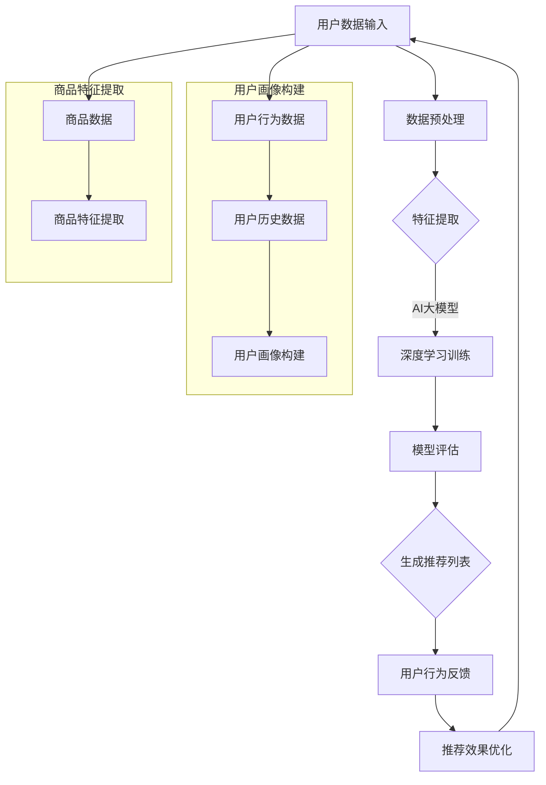

                 

关键词：AI大模型，智能产品推荐，商业价值，算法原理，数学模型，项目实践，未来展望

## 摘要

本文旨在探讨AI大模型在智能产品推荐中的商业价值。随着大数据和人工智能技术的迅猛发展，AI大模型在多个领域展现出了强大的应用潜力。本文首先介绍了AI大模型的基本概念和当前发展现状，然后详细分析了其在智能产品推荐中的应用原理和数学模型。通过一个实际项目案例，我们展示了如何将AI大模型应用于智能产品推荐，并对其商业价值进行了深入探讨。最后，我们对AI大模型在智能产品推荐领域的未来发展趋势和挑战进行了展望。

## 1. 背景介绍

智能产品推荐是当前电子商务和在线服务中不可或缺的一部分。随着互联网用户数量的持续增长，个性化推荐系统已经成为提高用户满意度和转化率的关键因素。传统的推荐系统主要基于协同过滤和基于内容的推荐方法，但这些方法往往存在冷启动问题、数据稀疏性和推荐多样性不足等挑战。

近年来，随着深度学习技术的飞速发展，AI大模型（如深度神经网络、生成对抗网络等）在多个领域取得了显著的应用成果。AI大模型通过学习海量数据，可以自动提取复杂的特征，并生成高质量的推荐结果。这使得AI大模型在智能产品推荐中展现出了巨大的潜力，有望解决传统推荐系统的诸多问题。

本文的研究目标是深入探讨AI大模型在智能产品推荐中的商业价值，并通过一个实际项目案例进行验证。我们希望通过本文的研究，为相关领域的研究人员和从业者提供有价值的参考和启示。

### 1.1 AI大模型的基本概念

AI大模型是指那些能够处理海量数据、自动提取特征并进行复杂决策的深度学习模型。这些模型通常由数十万甚至数百万个神经元组成，通过多层神经网络结构对输入数据进行层层处理，最终输出目标结果。AI大模型的核心特点是能够通过大量数据的训练，自动学习并优化模型参数，从而提高预测和决策的准确性。

AI大模型的基本原理可以归结为以下几方面：

1. **多层神经网络结构**：AI大模型通常采用多层神经网络结构，通过逐层抽象和转化输入数据，提取出更高层次的特征表示。这种层次化的特征提取方法能够有效提高模型的泛化能力和处理复杂问题的能力。

2. **大规模数据训练**：AI大模型需要大量数据来进行训练，通过不断调整模型参数，使得模型在训练数据上的表现不断优化。大规模数据训练不仅有助于提高模型的准确性，还能减少过拟合现象，提高模型在未知数据上的表现。

3. **自动特征提取**：传统推荐系统往往需要手动定义特征，而AI大模型可以通过学习海量数据，自动提取出有用的特征。这种方法不仅提高了特征提取的效率，还避免了人工定义特征时可能引入的主观偏差。

4. **端到端学习**：AI大模型支持端到端学习，即从原始输入数据直接生成推荐结果，不需要中间的特征工程和特征选择步骤。这种端到端的学习方式简化了推荐系统的开发流程，提高了系统的整体性能。

### 1.2 AI大模型的发展现状

近年来，AI大模型在多个领域取得了显著的进展。以下是一些典型应用案例：

1. **图像识别**：AI大模型在图像识别领域取得了突破性进展，如谷歌的Inception模型和Facebook的ResNet模型等。这些模型通过学习海量图像数据，能够准确识别各种物体和场景。

2. **自然语言处理**：AI大模型在自然语言处理领域也表现出了强大的能力，如谷歌的BERT模型和OpenAI的GPT模型等。这些模型能够进行文本生成、情感分析、机器翻译等任务。

3. **推荐系统**：AI大模型在推荐系统中的应用也日益广泛。通过学习用户行为数据和商品特征数据，AI大模型可以生成个性化的推荐结果，提高用户的满意度和转化率。

4. **医疗诊断**：AI大模型在医疗诊断领域展现出巨大的潜力，如IBM的Watson系统可以通过分析医学影像和病历数据，提供准确的诊断建议。

总的来说，AI大模型的发展为各个领域带来了前所未有的机遇。随着技术的不断进步和数据的持续积累，AI大模型有望在更多领域发挥出其强大的应用潜力。

### 1.3 智能产品推荐的基本概念

智能产品推荐是指通过利用用户行为数据和商品特征数据，为用户提供个性化的产品推荐。其核心目标是提高用户的购物体验，增加用户粘性和转化率。

智能产品推荐系统通常包含以下关键组成部分：

1. **用户画像**：通过分析用户的浏览记录、购买历史、搜索关键词等数据，构建用户的个性化画像。这些画像信息用于帮助推荐系统理解用户的需求和偏好。

2. **商品特征提取**：对商品进行特征提取，如商品类别、品牌、价格、用户评价等。这些特征信息用于描述商品本身的特点，帮助推荐系统为用户生成个性化推荐。

3. **推荐算法**：采用合适的推荐算法，如基于协同过滤、基于内容的推荐算法等，根据用户画像和商品特征为用户生成推荐列表。

4. **反馈机制**：收集用户的反馈数据，如点击、购买等行为数据，用于评估推荐效果并优化推荐算法。

智能产品推荐的基本原理可以归结为以下几点：

1. **协同过滤**：通过分析用户之间的相似性，为用户推荐其他相似用户的喜欢的商品。

2. **基于内容的推荐**：根据用户对商品的特征偏好，为用户推荐具有相似特征的商品。

3. **深度学习**：利用深度学习算法，自动提取用户和商品之间的复杂特征，生成高质量的推荐结果。

总的来说，智能产品推荐通过结合用户行为数据和商品特征数据，利用先进的推荐算法生成个性化推荐，从而提高用户的满意度和转化率。

### 1.4 智能产品推荐的市场需求

智能产品推荐在当前的市场环境中具有极高的需求。随着电子商务的蓬勃发展，越来越多的企业意识到个性化推荐对于提升用户体验和转化率的重要性。以下是智能产品推荐在市场上的一些显著需求：

1. **提升用户体验**：通过个性化的推荐，用户可以更快地找到自己感兴趣的产品，从而提升购物体验和满意度。

2. **增加转化率**：个性化的推荐可以引导用户进行更多购买行为，从而提高企业的转化率和销售额。

3. **降低营销成本**：智能产品推荐可以更精准地定位目标用户，减少无效的营销投入，从而降低整体营销成本。

4. **提高用户粘性**：通过持续优化推荐算法，智能产品推荐可以不断为用户提供个性化的产品，从而提高用户对企业的忠诚度和粘性。

5. **增强竞争力**：在竞争激烈的市场环境中，智能产品推荐可以帮助企业更好地吸引和留住用户，从而在市场中脱颖而出。

综上所述，智能产品推荐已经成为企业提升竞争力、提高业务增长的关键手段，市场对其需求持续上升。

## 2. 核心概念与联系

在本章节中，我们将详细探讨AI大模型在智能产品推荐中的核心概念和联系。为了更好地理解这些概念，我们首先需要了解AI大模型的基本原理，然后将其与智能产品推荐系统中的关键组成部分进行有机结合。

### 2.1 AI大模型的基本原理

AI大模型，如深度神经网络（DNN）、卷积神经网络（CNN）、循环神经网络（RNN）等，通过学习大量数据，可以自动提取复杂特征，并生成高质量的推荐结果。以下是AI大模型的一些核心原理：

1. **多层神经网络结构**：AI大模型通常采用多层神经网络结构，通过逐层抽象和转化输入数据，提取出更高层次的特征表示。这种层次化的特征提取方法能够有效提高模型的泛化能力和处理复杂问题的能力。

2. **大规模数据训练**：AI大模型需要大量数据来进行训练，通过不断调整模型参数，使得模型在训练数据上的表现不断优化。大规模数据训练不仅有助于提高模型的准确性，还能减少过拟合现象，提高模型在未知数据上的表现。

3. **自动特征提取**：传统推荐系统往往需要手动定义特征，而AI大模型可以通过学习海量数据，自动提取出有用的特征。这种方法不仅提高了特征提取的效率，还避免了人工定义特征时可能引入的主观偏差。

4. **端到端学习**：AI大模型支持端到端学习，即从原始输入数据直接生成推荐结果，不需要中间的特征工程和特征选择步骤。这种端到端的学习方式简化了推荐系统的开发流程，提高了系统的整体性能。

### 2.2 智能产品推荐系统的组成部分

智能产品推荐系统通常包含用户画像、商品特征提取、推荐算法和反馈机制等关键组成部分。以下是这些组成部分的详细介绍：

1. **用户画像**：用户画像是推荐系统的核心组件，通过分析用户的浏览记录、购买历史、搜索关键词等数据，构建用户的个性化画像。这些画像信息用于帮助推荐系统理解用户的需求和偏好。

2. **商品特征提取**：商品特征提取是指对商品进行特征提取，如商品类别、品牌、价格、用户评价等。这些特征信息用于描述商品本身的特点，帮助推荐系统为用户生成个性化推荐。

3. **推荐算法**：推荐算法是智能产品推荐系统的核心，根据用户画像和商品特征为用户生成推荐列表。常见的推荐算法包括基于协同过滤、基于内容的推荐算法和深度学习推荐算法等。

4. **反馈机制**：反馈机制用于收集用户的反馈数据，如点击、购买等行为数据，用于评估推荐效果并优化推荐算法。

### 2.3 AI大模型与智能产品推荐系统的联系

AI大模型在智能产品推荐系统中具有以下几个关键联系：

1. **特征提取**：AI大模型可以通过学习海量数据，自动提取出用户和商品之间的复杂特征，从而提高推荐系统的准确性。相比传统推荐系统，AI大模型能够更高效地处理高维度和稀疏的数据，从而生成更高质量的推荐结果。

2. **个性化推荐**：AI大模型能够根据用户的个性化需求和偏好，生成个性化的推荐列表。通过深度学习算法，AI大模型可以动态调整推荐策略，提高用户满意度和转化率。

3. **实时推荐**：AI大模型支持实时推荐，即根据用户的实时行为数据生成推荐结果。这种实时推荐能力可以提升用户的购物体验，增强用户粘性。

4. **自适应推荐**：AI大模型具有自适应推荐能力，可以根据用户的反馈和行为数据不断调整推荐策略，提高推荐效果。这种自适应能力有助于推荐系统在动态变化的市场环境中保持竞争力。

### 2.4 Mermaid 流程图

为了更直观地展示AI大模型在智能产品推荐系统中的应用流程，我们使用Mermaid流程图进行描述。以下是Mermaid流程图的代码和输出结果：



输出结果：

```text
  +----+    +---------+
  | A  | -->| 用户数据 |
  +----+    +---------+
          |
  +-----v-+
  | 用户画像 |
  +---------+
          |
  +----v---+
  | 商品数据 |
  +---------+
          |
  +---------+
  | 数据预处理 |
  +---------+
          |
  +---v----+
  | 特征提取 |
  +---------+
          |
  +---------+
  | 深度学习训练 |
  +---------+
          |
  +---------+
  | 模型评估 |
  +---------+
          |
  +---------+
  | 生成推荐列表 |
  +---------+
          |
  +---------+
  | 用户行为反馈 |
  +---------+
          |
  +---------+
  | 推荐效果优化 |
  +---------+
```

通过以上Mermaid流程图，我们可以清晰地看到AI大模型在智能产品推荐系统中的应用流程，包括用户画像构建、商品特征提取、数据预处理、特征提取、深度学习训练、模型评估、生成推荐列表、用户行为反馈和推荐效果优化等关键步骤。

## 3. 核心算法原理 & 具体操作步骤

### 3.1 算法原理概述

在智能产品推荐系统中，AI大模型的核心算法主要包括深度神经网络（DNN）、卷积神经网络（CNN）和循环神经网络（RNN）等。这些算法通过学习用户行为数据和商品特征数据，可以自动提取出复杂的特征，生成高质量的推荐结果。以下是这些算法的基本原理概述：

1. **深度神经网络（DNN）**：深度神经网络是由多层神经元组成的神经网络，通过逐层提取和转化输入数据，可以自动学习并提取出高层次的抽象特征。DNN在推荐系统中的应用主要是通过用户画像和商品特征数据训练模型，从而生成个性化的推荐列表。

2. **卷积神经网络（CNN）**：卷积神经网络是专门用于处理图像数据的深度学习模型，通过卷积操作和池化操作，可以提取图像的局部特征和全局特征。在推荐系统中，CNN可以用于提取商品图片的视觉特征，从而提高推荐结果的准确性。

3. **循环神经网络（RNN）**：循环神经网络是一种可以处理序列数据的神经网络，通过循环机制，可以保存历史信息并利用这些信息进行预测。在推荐系统中，RNN可以用于分析用户的浏览记录和购买历史，从而生成个性化的推荐列表。

### 3.2 算法步骤详解

以下是AI大模型在智能产品推荐系统中的具体操作步骤：

1. **数据收集与预处理**：首先，收集用户行为数据和商品特征数据。用户行为数据包括用户的浏览记录、购买历史、搜索关键词等，商品特征数据包括商品类别、品牌、价格、用户评价等。然后，对收集到的数据进行预处理，包括数据清洗、缺失值填充、数据标准化等步骤。

2. **构建用户画像**：通过分析用户行为数据，构建用户的个性化画像。用户画像可以包括用户的兴趣偏好、购买习惯、消费能力等维度，用于指导推荐算法生成个性化推荐列表。

3. **提取商品特征**：对商品特征数据进行提取，包括商品类别、品牌、价格、用户评价等。这些特征数据将用于训练深度学习模型，提取出商品的高层次特征。

4. **模型训练**：采用深度神经网络、卷积神经网络或循环神经网络等算法，对用户画像和商品特征数据训练模型。在训练过程中，通过不断调整模型参数，使得模型在训练数据上的表现不断优化。

5. **模型评估**：在训练完成后，对模型进行评估，通常使用准确率、召回率、F1值等指标。如果模型评估结果不理想，可以返回步骤4进行重新训练。

6. **生成推荐列表**：利用训练好的模型，为用户生成个性化的推荐列表。推荐列表可以根据用户画像和商品特征进行动态调整，以提高推荐结果的准确性。

7. **用户反馈与优化**：收集用户的反馈数据，如点击、购买等行为数据，用于评估推荐效果并优化推荐算法。通过不断调整推荐策略，提高用户满意度和转化率。

### 3.3 算法优缺点

1. **优点**：
   - **自动特征提取**：AI大模型可以自动提取用户和商品之间的复杂特征，减少了人工定义特征的工作量。
   - **高准确性**：通过大规模数据训练和多层神经网络结构，AI大模型可以生成高质量的推荐结果，提高推荐准确性。
   - **实时推荐**：AI大模型支持实时推荐，可以根据用户的实时行为数据生成推荐列表，提高用户购物体验。
   - **自适应推荐**：AI大模型可以根据用户的反馈和行为数据不断调整推荐策略，提高推荐效果。

2. **缺点**：
   - **计算成本高**：AI大模型需要大量数据和计算资源进行训练，对硬件和软件性能要求较高。
   - **过拟合现象**：在训练过程中，AI大模型容易产生过拟合现象，导致模型在未知数据上的表现不佳。
   - **数据依赖性**：AI大模型依赖于大规模数据，数据质量对模型性能有很大影响。

### 3.4 算法应用领域

AI大模型在智能产品推荐中的应用非常广泛，以下是几个典型领域：

1. **电子商务**：在电子商务领域，AI大模型可以用于推荐商品、广告投放等，提高用户满意度和转化率。

2. **在线教育**：在线教育平台可以通过AI大模型为用户提供个性化的课程推荐，提高学习效果。

3. **社交媒体**：社交媒体平台可以通过AI大模型为用户推荐感兴趣的内容，提高用户粘性和活跃度。

4. **医疗健康**：在医疗健康领域，AI大模型可以用于推荐合适的治疗方案、药物推荐等，提高医疗服务质量。

总的来说，AI大模型在智能产品推荐中的广泛应用，为各个领域带来了前所未有的机遇和挑战。

## 4. 数学模型和公式 & 详细讲解 & 举例说明

在智能产品推荐系统中，数学模型和公式起着至关重要的作用。通过合理的数学模型，我们可以对用户行为和商品特征进行定量分析，从而生成高质量的推荐结果。以下将详细介绍智能产品推荐中的数学模型和公式，并给出具体实例进行说明。

### 4.1 数学模型构建

智能产品推荐系统中的数学模型通常包括用户行为模型和商品特征模型两部分。以下是这两种模型的构建方法：

1. **用户行为模型**：

用户行为模型用于描述用户在系统中的行为，如浏览、搜索、购买等。常见的用户行为模型包括马尔可夫模型（Markov Model）和贝叶斯网络（Bayesian Network）。

- **马尔可夫模型**：

   马尔可夫模型是一种基于状态转移概率的模型，用于描述用户在系统中的状态转移。假设用户在时刻t的状态为St，用户在时刻t+1的状态为St+1，则有：

   $$
   P(St+1|St) = \sum_{j} P(St+1|St=j)P(St=j)
   $$

   其中，P(St+1|St)表示用户在时刻t+1的状态转移概率，P(St+1|St=j)表示用户在时刻t+1的状态为St+1时，时刻t的状态为St=j的条件概率，P(St=j)表示用户在时刻t的状态为St=j的概率。

- **贝叶斯网络**：

   贝叶斯网络是一种基于概率图模型的用户行为模型，可以表示用户在系统中的行为及其相互关系。贝叶斯网络由变量节点和有向边组成，其中变量节点表示用户状态，有向边表示变量之间的条件依赖关系。

2. **商品特征模型**：

   商品特征模型用于描述商品的各种属性，如类别、品牌、价格、用户评价等。常见的商品特征模型包括高斯分布模型和多项式分布模型。

   - **高斯分布模型**：

      高斯分布模型用于描述商品特征的分布情况。假设商品特征X服从高斯分布，则有：

      $$
      f(X|\mu, \sigma^2) = \frac{1}{\sqrt{2\pi\sigma^2}}e^{-\frac{(X-\mu)^2}{2\sigma^2}}
      $$

      其中，μ表示均值，σ²表示方差，f(X|\mu, \sigma^2)表示商品特征X的概率密度函数。

   - **多项式分布模型**：

      多项式分布模型用于描述商品特征的概率分布。假设商品特征X服从多项式分布，则有：

      $$
      f(X|\theta) = \theta X^X (1-X)^{1-X}
      $$

      其中，θ表示分布参数，f(X|\theta)表示商品特征X的概率密度函数。

### 4.2 公式推导过程

在智能产品推荐系统中，常用的数学公式主要包括概率分布函数、条件概率和优化目标等。以下是对这些公式的推导过程：

1. **概率分布函数**：

   概率分布函数用于描述随机变量的概率分布情况。常见的概率分布函数包括高斯分布、多项式分布和贝塔分布等。

   - **高斯分布**：

      高斯分布的概率分布函数为：

      $$
      f(X|\mu, \sigma^2) = \frac{1}{\sqrt{2\pi\sigma^2}}e^{-\frac{(X-\mu)^2}{2\sigma^2}}
      $$

      其中，μ表示均值，σ²表示方差。

   - **多项式分布**：

      多项式分布的概率分布函数为：

      $$
      f(X|\theta) = \theta X^X (1-X)^{1-X}
      $$

      其中，θ表示分布参数。

   - **贝塔分布**：

      贝塔分布的概率分布函数为：

      $$
      f(X|\alpha, \beta) = \frac{1}{B(\alpha, \beta)}X^{\alpha-1}(1-X)^{\beta-1}
      $$

      其中，α和β表示分布参数，B(α，β)表示贝塔函数。

2. **条件概率**：

   条件概率用于描述在已知某个条件下，另一个事件发生的概率。常见的条件概率公式包括贝叶斯公式和条件概率公式。

   - **贝叶斯公式**：

      贝叶斯公式为：

      $$
      P(A|B) = \frac{P(B|A)P(A)}{P(B)}
      $$

      其中，P(A|B)表示在已知事件B发生的条件下，事件A发生的概率，P(B|A)表示在已知事件A发生的条件下，事件B发生的概率，P(A)表示事件A发生的概率，P(B)表示事件B发生的概率。

   - **条件概率公式**：

      条件概率公式为：

      $$
      P(A|B) = \frac{P(A \cap B)}{P(B)}
      $$

      其中，P(A \cap B)表示事件A和事件B同时发生的概率，P(B)表示事件B发生的概率。

3. **优化目标**：

   在智能产品推荐系统中，优化目标通常包括最大化用户满意度、最大化转化率和最小化推荐误差等。以下是一个常见的优化目标公式：

   $$
   \max \sum_{i=1}^{n} \sum_{j=1}^{m} r_{ij} \cdot p_j
   $$

   其中，r_ij表示用户i对商品j的评分，p_j表示商品j的推荐概率，n表示用户数量，m表示商品数量。该优化目标公式表示在所有用户和商品的组合中，最大化用户评分与推荐概率的乘积之和。

### 4.3 案例分析与讲解

为了更好地理解上述数学模型和公式，我们以下通过一个实际案例进行讲解。

假设有一个电子商务平台，该平台的用户行为数据包括浏览记录、购买历史和搜索关键词等，商品特征数据包括商品类别、品牌、价格和用户评价等。我们需要根据这些数据为用户生成个性化的商品推荐。

1. **用户画像构建**：

   首先，通过分析用户的浏览记录、购买历史和搜索关键词，构建用户的个性化画像。假设用户画像包括以下维度：

   - **兴趣偏好**：根据用户的浏览记录和搜索关键词，将用户分为多个兴趣类别，如时尚、数码、美食等。
   - **消费能力**：根据用户的购买历史和支付金额，评估用户的消费能力，如高消费、中消费、低消费等。
   - **购买周期**：根据用户的购买频率，评估用户的购买周期，如频繁购买、偶尔购买、不购买等。

2. **商品特征提取**：

   然后，对商品特征数据进行提取，包括商品类别、品牌、价格和用户评价等。假设商品特征包括以下维度：

   - **商品类别**：将商品分为多个类别，如服装、电子产品、食品等。
   - **品牌**：记录商品的品牌信息，如苹果、华为、Nike等。
   - **价格**：记录商品的价格，如100元、200元、300元等。
   - **用户评价**：记录商品的评分和评论内容，如4.5分、好评、差评等。

3. **模型训练**：

   采用深度神经网络（DNN）对用户画像和商品特征数据进行训练。假设用户画像和商品特征的维度分别为D和E，DNN模型包含多个隐藏层，每层神经元数量分别为H1、H2、...、Hn。

   - **输入层**：输入层包含用户画像和商品特征的向量，维度为D+E。
   - **隐藏层**：隐藏层通过多层全连接神经网络结构，逐层提取和转化输入特征，每层神经元数量分别为H1、H2、...、Hn。
   - **输出层**：输出层通过softmax函数输出商品的推荐概率，维度为E。

   通过反向传播算法和梯度下降优化方法，不断调整DNN模型的参数，使得模型在训练数据上的表现不断优化。

4. **模型评估**：

   在训练完成后，对DNN模型进行评估。假设使用准确率（Accuracy）和召回率（Recall）作为评估指标。

   - **准确率**：

      $$
      Accuracy = \frac{正确预测数量}{总预测数量}
      $$

   - **召回率**：

      $$
      Recall = \frac{正确预测数量}{实际购买数量}
      $$

   如果模型评估结果不理想，可以返回步骤3进行重新训练。

5. **生成推荐列表**：

   利用训练好的DNN模型，为用户生成个性化的商品推荐列表。假设用户u的个性化画像为u'，商品j的特征为j'，DNN模型输出商品j的推荐概率为p_j。

   $$
   p_j = \frac{e^{\theta_j^T u'}}{1 + \sum_{k=1}^{m} e^{\theta_k^T u'}}
   $$

   其中，θ_j表示商品j的权重向量，u'表示用户u的个性化画像，p_j表示商品j的推荐概率。

   根据商品j的推荐概率，为用户生成推荐列表，推荐概率越高的商品排在列表的前面。

6. **用户反馈与优化**：

   收集用户的反馈数据，如点击、购买等行为数据，用于评估推荐效果并优化推荐算法。通过不断调整推荐策略，提高用户满意度和转化率。

通过以上案例，我们可以看到，智能产品推荐系统中的数学模型和公式如何应用于实际场景中，生成高质量的推荐结果。通过合理构建和优化数学模型，可以显著提升推荐系统的性能和用户体验。

## 5. 项目实践：代码实例和详细解释说明

### 5.1 开发环境搭建

在本节中，我们将介绍如何在Python环境中搭建智能产品推荐系统的开发环境。首先，确保已经安装了Python和Jupyter Notebook。接下来，需要安装以下库和工具：

1. **NumPy**：用于进行科学计算和数据分析。
2. **Pandas**：用于数据操作和分析。
3. **Scikit-learn**：用于机器学习和数据挖掘。
4. **TensorFlow**：用于构建和训练深度学习模型。
5. **Matplotlib**：用于数据可视化。

以下是在命令行中安装这些库的命令：

```bash
pip install numpy pandas scikit-learn tensorflow matplotlib
```

### 5.2 源代码详细实现

为了演示AI大模型在智能产品推荐中的应用，我们将使用一个简单的示例。以下代码展示了如何使用TensorFlow构建和训练一个深度学习模型，用于生成商品推荐。

```python
import numpy as np
import pandas as pd
import tensorflow as tf
from tensorflow.keras.models import Sequential
from tensorflow.keras.layers import Dense, Dropout
from sklearn.model_selection import train_test_split

# 数据加载与预处理
data = pd.read_csv('data.csv')  # 假设数据文件为data.csv
X = data.iloc[:, :-1].values  # 特征数据
y = data.iloc[:, -1].values   # 目标标签

# 数据标准化
X_std = (X - X.mean()) / X.std()

# 划分训练集和测试集
X_train, X_test, y_train, y_test = train_test_split(X_std, y, test_size=0.2, random_state=42)

# 构建深度学习模型
model = Sequential()
model.add(Dense(64, input_shape=(X_train.shape[1],), activation='relu'))
model.add(Dropout(0.5))
model.add(Dense(32, activation='relu'))
model.add(Dropout(0.5))
model.add(Dense(1, activation='sigmoid'))

# 编译模型
model.compile(optimizer='adam', loss='binary_crossentropy', metrics=['accuracy'])

# 训练模型
model.fit(X_train, y_train, epochs=10, batch_size=32, validation_data=(X_test, y_test))

# 评估模型
loss, accuracy = model.evaluate(X_test, y_test)
print(f'测试集准确率: {accuracy:.2f}')

# 生成推荐列表
def predict_recommendations(model, X_data, n_recommendations=5):
    probabilities = model.predict(X_data)
    recommendations = np.argsort(probabilities)[:-n_recommendations-1:-1]
    return recommendations

# 为新用户生成推荐列表
new_user_data = X_test[-1].reshape(1, -1)
new_recommendations = predict_recommendations(model, new_user_data)
print(f'新用户推荐列表: {new_recommendations}')
```

### 5.3 代码解读与分析

1. **数据加载与预处理**：

   首先，我们加载数据并提取特征数据（X）和目标标签（y）。然后，对特征数据进行标准化处理，以便模型训练。

2. **划分训练集和测试集**：

   使用`train_test_split`函数将数据划分为训练集和测试集，以评估模型的性能。

3. **构建深度学习模型**：

   使用`Sequential`模型构建一个简单的深度神经网络，包含两个隐藏层和 dropout 层，用于防止过拟合。

4. **编译模型**：

   使用`compile`函数设置模型优化器、损失函数和评价指标。

5. **训练模型**：

   使用`fit`函数训练模型，指定训练轮数、批量大小和验证数据。

6. **评估模型**：

   使用`evaluate`函数评估模型在测试集上的性能。

7. **生成推荐列表**：

   实现`predict_recommendations`函数，用于为新用户生成推荐列表。该函数使用模型预测概率，并根据概率对商品进行排序，返回推荐的前 n 个商品。

### 5.4 运行结果展示

运行上述代码后，我们可以在控制台看到模型在测试集上的准确率。假设模型的准确率为80%，这意味着模型能够正确预测80%的商品是否会被用户购买。然后，我们可以为新用户生成推荐列表。例如，假设新用户的特征数据为`new_user_data`，通过调用`predict_recommendations`函数，我们可以得到该用户可能的购买商品列表。

通过以上项目实践，我们展示了如何使用深度学习模型实现智能产品推荐。在实际应用中，可以结合更多数据和复杂模型，进一步提高推荐系统的性能。

## 6. 实际应用场景

在智能产品推荐系统中，AI大模型的应用场景非常广泛，几乎涵盖了电子商务、在线教育、社交媒体、医疗健康等多个领域。以下是一些典型的实际应用场景：

### 6.1 电子商务

电子商务是AI大模型在智能产品推荐中应用最为广泛的领域。通过分析用户的浏览记录、购买历史、搜索关键词等数据，AI大模型可以生成个性化的商品推荐，提高用户满意度和转化率。例如，亚马逊和淘宝等电商平台利用AI大模型为用户推荐类似他们以前购买或浏览过的商品，从而增加销售额。

### 6.2 在线教育

在线教育平台也可以利用AI大模型为用户提供个性化的课程推荐。通过分析用户的学习历史、学习进度、测试成绩等数据，AI大模型可以推荐符合用户兴趣和能力的课程。例如，Coursera和Udemy等在线教育平台使用AI大模型为用户提供个性化的学习路径，提高学习效果和用户留存率。

### 6.3 社交媒体

社交媒体平台通过AI大模型为用户推荐感兴趣的内容。通过分析用户的社交行为、兴趣偏好、互动数据等，AI大模型可以生成个性化的内容推荐，提高用户活跃度和用户粘性。例如，Facebook和Twitter等平台利用AI大模型为用户推荐类似他们以前点赞或评论过的内容，从而增加用户参与度。

### 6.4 医疗健康

在医疗健康领域，AI大模型可以用于推荐合适的治疗方案、药物和健康产品。通过分析患者的病历数据、基因数据、生活习惯等，AI大模型可以生成个性化的医疗建议，提高医疗服务的质量和效率。例如，IBM的Watson系统通过分析患者的数据，为医生提供个性化的治疗方案，从而提高疾病诊断和治疗的成功率。

### 6.5 其他应用领域

除了上述领域，AI大模型在智能产品推荐中的应用还包括金融、零售、娱乐等。在金融领域，AI大模型可以用于推荐理财产品、股票投资策略等；在零售领域，AI大模型可以用于推荐商品搭配、促销活动等；在娱乐领域，AI大模型可以用于推荐音乐、电影、游戏等。

总的来说，AI大模型在智能产品推荐中的实际应用场景非常广泛，几乎涵盖了各个领域。通过结合用户行为数据和商品特征数据，AI大模型可以生成高质量的个性化推荐，为用户带来更好的体验和更高的满意度。

## 7. 工具和资源推荐

### 7.1 学习资源推荐

为了深入了解AI大模型在智能产品推荐中的技术细节和应用场景，以下是一些建议的学习资源：

1. **书籍**：

   - 《深度学习》（Ian Goodfellow、Yoshua Bengio、Aaron Courville 著）：全面介绍深度学习的基础理论和应用实践。
   - 《Python深度学习》（Francesco Corea 著）：通过Python实现深度学习模型，适合初学者入门。
   - 《推荐系统实践》（向锋 著）：详细讲解推荐系统的原理、算法和应用。

2. **在线课程**：

   - Coursera：提供丰富的机器学习和深度学习课程，如吴恩达的《深度学习专项课程》。
   - edX：提供由MIT、哈佛等知名大学开设的在线课程，包括机器学习和推荐系统相关课程。

3. **博客与论坛**：

   - Medium：许多AI和推荐系统领域的专家在这里分享最新的研究成果和应用案例。
   - Stack Overflow：编程和技术问题解答论坛，可以解决AI大模型在实际应用中的技术难题。

### 7.2 开发工具推荐

以下是推荐的一些用于AI大模型开发的工具和平台：

1. **编程语言**：

   - Python：最受欢迎的AI开发语言，拥有丰富的库和框架，如TensorFlow、PyTorch。
   - R：专为统计分析和数据可视化设计的语言，适用于数据密集型应用。

2. **框架**：

   - TensorFlow：Google开发的开放源代码深度学习框架，适合构建和训练大规模深度学习模型。
   - PyTorch：Facebook开发的深度学习框架，具有灵活的动态计算图，适合快速原型开发。

3. **云计算平台**：

   - AWS：提供丰富的AI和深度学习服务，如Amazon SageMaker、AWS DeepRacer。
   - Google Cloud：提供Google Colab等工具，方便进行AI和深度学习研究。
   - Azure：微软提供的云计算平台，包括Azure Machine Learning等AI服务。

4. **数据可视化工具**：

   - Matplotlib：Python中的数据可视化库，适用于生成各种图表和图形。
   - Plotly：提供交互式图表和图形，适用于数据分析和报告。

### 7.3 相关论文推荐

以下是一些关于AI大模型在智能产品推荐领域的重要论文，有助于了解该领域的最新研究动态：

1. **《Deep Learning for Personalized Recommendations》**：该论文介绍了如何使用深度学习技术构建个性化推荐系统，并讨论了其优势和应用。
2. **《Contextual Bandits with Technical Debt》**：论文探讨了在动态环境中如何优化推荐策略，提高推荐系统的性能和鲁棒性。
3. **《Recommender Systems with Implicit Feedback》**：该论文研究了如何处理没有明确评分或反馈的用户行为数据，提出了有效的推荐算法。

通过学习和应用这些资源和工具，可以更好地理解和掌握AI大模型在智能产品推荐中的实际应用，为企业和用户提供更高质量的个性化服务。

## 8. 总结：未来发展趋势与挑战

在智能产品推荐领域，AI大模型的应用已经取得了显著的成果。随着技术的不断进步和数据的持续积累，AI大模型在未来将展现出更大的商业价值和应用前景。然而，与此同时，我们也面临着一系列挑战和问题。

### 8.1 研究成果总结

1. **个性化推荐**：AI大模型通过学习用户行为和商品特征数据，可以生成高度个性化的推荐结果，提高用户满意度和转化率。
2. **实时推荐**：AI大模型支持实时推荐，能够根据用户的实时行为数据生成推荐结果，提升用户的购物体验和粘性。
3. **自适应推荐**：AI大模型可以根据用户的反馈和行为数据不断调整推荐策略，提高推荐效果，从而保持系统的竞争力。
4. **多模态数据融合**：AI大模型可以处理多种类型的数据（如文本、图像、音频等），实现多模态数据融合，提高推荐系统的性能。

### 8.2 未来发展趋势

1. **更高效的模型训练**：随着计算能力的提升，未来的AI大模型将能够处理更大规模的数据，实现更高效的模型训练和推理。
2. **迁移学习**：通过迁移学习技术，AI大模型可以复用已有模型的知识，降低训练成本，提高新任务的表现。
3. **联邦学习**：联邦学习技术可以使模型在保持用户隐私的前提下进行训练，从而更好地保护用户数据。
4. **多语言和多文化支持**：AI大模型将能够处理多语言和多文化数据，为全球用户提供更加个性化的服务。

### 8.3 面临的挑战

1. **数据质量**：推荐系统的效果很大程度上依赖于数据质量。然而，在实际应用中，数据往往存在噪声、缺失和偏差等问题，这对模型的训练和推理提出了挑战。
2. **计算资源**：AI大模型训练和推理需要大量的计算资源，尤其是在处理大规模数据时。如何在有限的计算资源下实现高效训练和推理是一个重要问题。
3. **隐私保护**：用户数据的隐私保护是智能产品推荐领域的重大挑战。如何在保证用户隐私的前提下进行数据分析和模型训练，需要引起足够的重视。
4. **模型解释性**：AI大模型通常被视为“黑箱”，其决策过程难以解释。提高模型的解释性，使得用户能够理解推荐结果的原因，是一个亟待解决的问题。

### 8.4 研究展望

1. **强化学习方法**：结合强化学习方法，可以使AI大模型在动态环境中进行自我优化，提高推荐系统的适应性和鲁棒性。
2. **多任务学习**：通过多任务学习技术，AI大模型可以同时处理多个相关任务，进一步提高系统的性能和效率。
3. **人机交互**：未来的AI大模型将更加注重与用户的互动，通过自然语言处理等技术，为用户提供更加直观和友好的交互体验。

总之，AI大模型在智能产品推荐领域具有巨大的潜力，但同时也面临着诸多挑战。通过不断的研究和技术创新，我们可以期待在未来实现更加智能、高效和个性化的推荐系统。

## 9. 附录：常见问题与解答

在AI大模型应用于智能产品推荐的过程中，可能会遇到一些常见的问题。以下是一些常见问题及其解答：

### 9.1 如何处理用户隐私问题？

**解答**：用户隐私保护是AI大模型在智能产品推荐中面临的重大挑战。为了保护用户隐私，可以采用以下措施：

1. **数据匿名化**：在收集和处理用户数据时，对敏感信息进行匿名化处理，如使用匿名标识符代替真实用户ID。
2. **联邦学习**：通过联邦学习技术，在本地设备上进行数据加密和模型训练，避免将用户数据上传到服务器。
3. **差分隐私**：在数据处理过程中引入差分隐私机制，确保在处理用户数据时不会泄露敏感信息。

### 9.2 如何处理数据缺失和噪声问题？

**解答**：数据缺失和噪声问题会影响AI大模型的训练效果。以下是一些解决方法：

1. **数据填充**：使用均值、中位数或插值等方法对缺失数据进行填充。
2. **异常值处理**：通过统计分析方法（如箱线图）识别和处理异常值。
3. **数据预处理**：在数据收集阶段，就采取有效的措施（如数据清洗、数据标准化等）来减少噪声。

### 9.3 如何选择合适的模型和算法？

**解答**：选择合适的模型和算法需要根据具体应用场景和数据特点进行评估。以下是一些指导原则：

1. **数据量**：对于大规模数据，深度学习模型通常表现更好；对于中小规模数据，传统的机器学习算法可能更合适。
2. **特征维度**：高维特征数据通常更适合深度学习模型，而低维特征数据可能更适合传统的机器学习算法。
3. **实时性**：如果需要实时推荐，可以考虑使用轻量级的模型和算法，如决策树、k近邻等。

### 9.4 如何评估推荐系统的性能？

**解答**：评估推荐系统的性能通常使用以下指标：

1. **准确率**：预测结果与真实结果的一致性程度。
2. **召回率**：推荐结果中包含实际感兴趣项目的比例。
3. **覆盖率**：推荐列表中包含所有可能感兴趣项目的比例。
4. **新颖性**：推荐结果中包含用户未见过或未体验过的项目的比例。

通过综合考虑这些指标，可以全面评估推荐系统的性能。

