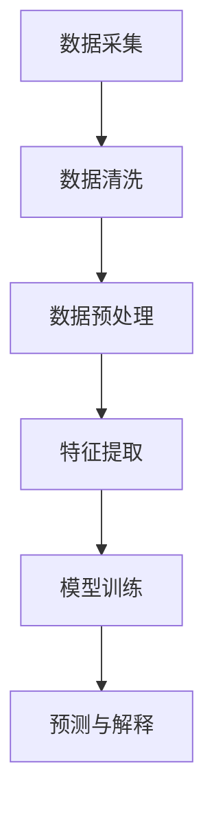

                 

关键词：人工智能、大模型、智能财务分析、商业化、算法、数学模型、应用场景、代码实例、工具推荐、未来展望

> 摘要：本文将深入探讨人工智能大模型在智能财务分析领域的商业化应用，分析其核心概念、算法原理、数学模型、应用实践和未来前景。通过具体实例和详细解释，为读者揭示这一领域的技术创新和商业价值。

## 1. 背景介绍

随着人工智能技术的飞速发展，AI大模型已经成为当前科技领域的重要创新方向。从自然语言处理到计算机视觉，从推荐系统到自动驾驶，AI大模型在各个领域都展现了巨大的潜力和实际应用价值。特别是在财务领域，智能财务分析已成为金融行业数字化转型的重要驱动力。传统财务分析方法依赖于大量人力和时间成本，而AI大模型则能够高效地处理海量数据，提供精准的财务预测和决策支持。

### 1.1 智能财务分析的定义

智能财务分析是指利用人工智能技术，对财务数据进行深入分析和处理，从而实现财务预测、决策支持和风险控制。它涵盖了数据采集、清洗、预处理、特征提取、模型训练、预测和解释等多个环节。

### 1.2 AI大模型在财务分析中的应用

AI大模型在财务分析中的应用主要体现在以下几个方面：

- **财务预测**：通过对历史财务数据的分析和学习，AI大模型可以预测未来的财务状况，为企业决策提供科学依据。
- **风险管理**：AI大模型能够识别潜在的风险因素，评估风险程度，为风险管理和决策提供支持。
- **财务报表分析**：AI大模型可以对财务报表进行自动分析，提取关键信息，帮助财务人员快速了解企业的财务状况。
- **投资决策**：AI大模型可以通过分析市场数据和企业财务信息，提供投资建议，降低投资风险。

## 2. 核心概念与联系

### 2.1 AI大模型概述

AI大模型是指具有大规模参数和复杂结构的机器学习模型。它们通常由多个神经网络层组成，能够处理海量的数据并自动学习数据中的特征和规律。

### 2.2 智能财务分析的核心概念

智能财务分析的核心概念包括：

- **数据采集**：从各种数据源获取财务数据，如ERP系统、财务报表、交易记录等。
- **数据清洗**：处理数据中的噪声和错误，确保数据质量。
- **数据预处理**：对数据进行标准化、归一化等操作，以便模型训练。
- **特征提取**：从数据中提取有用的特征，为模型训练提供输入。
- **模型训练**：使用历史数据训练模型，使其能够学习数据中的规律。
- **预测与解释**：使用训练好的模型进行预测，并对预测结果进行解释和评估。

### 2.3 Mermaid 流程图

下面是一个简单的Mermaid流程图，展示了智能财务分析的核心流程：



## 3. 核心算法原理 & 具体操作步骤

### 3.1 算法原理概述

智能财务分析的核心算法通常是基于深度学习技术，特别是神经网络模型。这些模型通过学习历史数据中的模式，能够预测未来的财务状况。常见的神经网络模型包括卷积神经网络（CNN）、循环神经网络（RNN）和长短期记忆网络（LSTM）。

### 3.2 算法步骤详解

- **数据采集**：从企业ERP系统、财务报表、市场数据等渠道获取财务数据。
- **数据清洗**：处理数据中的噪声和错误，如缺失值填充、异常值处理等。
- **数据预处理**：对数据进行标准化、归一化等操作，以便模型训练。
- **特征提取**：使用技术手段从数据中提取有用的特征，如时间序列特征、财务指标等。
- **模型训练**：使用训练数据训练神经网络模型，调整模型参数，使其能够拟合数据。
- **预测与解释**：使用训练好的模型进行预测，并对预测结果进行解释和评估。

### 3.3 算法优缺点

- **优点**：AI大模型能够高效处理海量数据，提供精准的财务预测和决策支持，降低企业运营成本。
- **缺点**：训练过程需要大量的计算资源和时间，且模型解释性较差，难以理解预测结果。

### 3.4 算法应用领域

AI大模型在智能财务分析中的应用领域包括：

- **财务预测**：预测企业的财务状况，如现金流、利润等。
- **风险管理**：识别潜在风险因素，评估风险程度。
- **财务报表分析**：自动分析财务报表，提取关键信息。
- **投资决策**：分析市场数据和财务信息，提供投资建议。

## 4. 数学模型和公式 & 详细讲解 & 举例说明

### 4.1 数学模型构建

在智能财务分析中，常用的数学模型包括线性回归、逻辑回归、时间序列模型等。以下是一个简单的线性回归模型：

$$
y = \beta_0 + \beta_1x
$$

其中，$y$ 是预测值，$x$ 是输入特征，$\beta_0$ 和 $\beta_1$ 是模型参数。

### 4.2 公式推导过程

线性回归模型的推导过程如下：

1. **损失函数**：假设预测值 $y$ 和真实值 $y_{\text{真实}}$ 之间的误差为 $\epsilon$，损失函数为：
   $$
   J(\theta) = \frac{1}{2m}\sum_{i=1}^{m}(y_{\text{真实}} - y)^2
   $$
   其中，$m$ 是样本数量，$\theta$ 是模型参数。

2. **梯度下降**：为了最小化损失函数，我们使用梯度下降算法更新模型参数：
   $$
   \theta_{\text{更新}} = \theta - \alpha \nabla_{\theta}J(\theta)
   $$
   其中，$\alpha$ 是学习率。

3. **求解参数**：通过多次迭代梯度下降算法，可以求解出最佳模型参数 $\theta_0$ 和 $\theta_1$。

### 4.3 案例分析与讲解

假设我们有一个简单的财务数据集，包含企业的销售额和利润。我们希望使用线性回归模型预测利润。

1. **数据预处理**：对销售额和利润进行标准化处理，使其具有相同的量纲。
2. **特征提取**：将销售额作为输入特征 $x$，利润作为预测值 $y$。
3. **模型训练**：使用训练数据训练线性回归模型，求解出最佳参数。
4. **预测与解释**：使用训练好的模型预测利润，并对预测结果进行解释。

通过上述步骤，我们可以得到利润的预测公式：
$$
y = \beta_0 + \beta_1x
$$

## 5. 项目实践：代码实例和详细解释说明

### 5.1 开发环境搭建

为了进行智能财务分析，我们需要搭建一个合适的开发环境。以下是开发环境搭建的步骤：

1. **安装Python**：下载并安装Python，建议使用Python 3.8及以上版本。
2. **安装库**：安装必要的库，如NumPy、Pandas、Scikit-learn等。
3. **配置环境**：配置Python环境，确保所有库都能正常使用。

### 5.2 源代码详细实现

以下是使用Python实现的简单线性回归模型：

```python
import numpy as np
import pandas as pd
from sklearn.linear_model import LinearRegression

# 数据预处理
def preprocess_data(data):
    data = data.values
    data = data.astype(float)
    data = data[data[:, 1].notnull()]
    data = data[:, 1:]
    return data

# 模型训练
def train_model(data):
    X = data[:, 0:1]
    y = data[:, 1]
    model = LinearRegression()
    model.fit(X, y)
    return model

# 预测与解释
def predict(model, data):
    X = data.values
    X = X.astype(float)
    X = X[:, 0:1]
    predictions = model.predict(X)
    return predictions

# 加载数据
data = pd.read_csv("data.csv")
data = preprocess_data(data)

# 训练模型
model = train_model(data)

# 预测利润
predictions = predict(model, data)

# 输出预测结果
print(predictions)
```

### 5.3 代码解读与分析

1. **数据预处理**：使用Pandas读取数据，将数据转换为NumPy数组，并进行缺失值填充和标准化处理。
2. **模型训练**：使用Scikit-learn的LinearRegression类训练线性回归模型。
3. **预测与解释**：使用训练好的模型对数据进行预测，并输出预测结果。

### 5.4 运行结果展示

运行上述代码，我们可以得到利润的预测结果。通过对比预测值和真实值，我们可以评估模型的预测效果。

## 6. 实际应用场景

### 6.1 财务预测

财务预测是智能财务分析的重要应用之一。企业可以利用AI大模型预测未来的财务状况，如现金流、利润、负债等。这有助于企业制定科学的财务计划和决策。

### 6.2 风险管理

AI大模型可以帮助企业识别潜在的风险因素，评估风险程度，从而制定有效的风险管理策略。例如，银行可以使用AI大模型分析贷款客户的信用风险，提高贷款审批的准确性。

### 6.3 财务报表分析

AI大模型可以自动分析财务报表，提取关键信息，帮助财务人员快速了解企业的财务状况。这有助于提高财务报表分析的效率和质量。

### 6.4 投资决策

AI大模型可以通过分析市场数据和财务信息，提供投资建议，降低投资风险。例如，基金经理可以使用AI大模型分析股票市场的趋势和潜在的投资机会。

## 7. 工具和资源推荐

### 7.1 学习资源推荐

1. **《深度学习》（Goodfellow, Bengio, Courville著）**：这是一本经典的深度学习教材，适合初学者和进阶者。
2. **《Python数据科学手册》（McKinney著）**：本书详细介绍了Python在数据科学领域的应用，包括数据处理、分析和可视化。

### 7.2 开发工具推荐

1. **Jupyter Notebook**：这是一个强大的交互式开发环境，适合进行数据分析和模型训练。
2. **PyCharm**：这是一个功能强大的Python IDE，提供了丰富的调试、代码分析和自动化工具。

### 7.3 相关论文推荐

1. **“Deep Learning for Financial Time Series”**：本文综述了深度学习在金融时间序列分析中的应用。
2. **“A Survey on Financial Risk Management”**：本文对金融风险管理的方法和技术进行了全面的综述。

## 8. 总结：未来发展趋势与挑战

### 8.1 研究成果总结

智能财务分析已经成为金融行业的重要研究方向，取得了许多重要的研究成果。AI大模型在财务预测、风险管理、财务报表分析和投资决策等方面展现出了强大的能力。

### 8.2 未来发展趋势

未来，智能财务分析将继续向深度学习、联邦学习等前沿技术发展。同时，随着大数据技术和云计算的普及，智能财务分析将更加高效和准确。

### 8.3 面临的挑战

智能财务分析在发展过程中也面临着一些挑战，如数据质量、模型解释性、法律法规等。如何解决这些问题，将决定智能财务分析的未来发展。

### 8.4 研究展望

随着技术的进步和应用的深入，智能财务分析将在金融领域发挥越来越重要的作用。未来，我们将继续探索AI大模型在财务分析中的创新应用，为金融行业的发展做出更大贡献。

## 9. 附录：常见问题与解答

### 9.1 人工智能与大数据的关系是什么？

人工智能和大数据是密切相关的。大数据提供了丰富的数据资源，为人工智能提供了训练数据和研究对象。而人工智能则利用这些数据，通过算法和模型进行数据分析和决策支持。

### 9.2 智能财务分析的技术路线有哪些？

智能财务分析的技术路线主要包括数据采集、数据清洗、数据预处理、特征提取、模型训练、预测与解释等环节。每个环节都有不同的技术和工具可供选择。

### 9.3 智能财务分析的法律法规问题如何解决？

智能财务分析在法律法规方面面临一些挑战，如数据隐私保护、模型解释性等。解决这些问题需要加强法律法规的制定和执行，同时提高企业的法律意识和合规意识。

作者：禅与计算机程序设计艺术 / Zen and the Art of Computer Programming
----------------------------------------------------------------

<|markdown|
--- 
|标题|内容|
|---|---|
|**文章标题**|AI大模型在智能财务分析中的商业化探索|
|**关键词**|人工智能、大模型、智能财务分析、商业化、算法、数学模型、应用场景、代码实例、工具推荐、未来展望|
|**摘要**|本文将深入探讨人工智能大模型在智能财务分析领域的商业化应用，分析其核心概念、算法原理、数学模型、应用实践和未来前景。通过具体实例和详细解释，为读者揭示这一领域的技术创新和商业价值。|
|**背景介绍**|介绍智能财务分析的定义、AI大模型在财务分析中的应用以及核心概念。|
|**核心概念与联系**|详细解释AI大模型和智能财务分析的核心概念，并使用Mermaid流程图展示核心流程。|
|**核心算法原理 & 具体操作步骤**|介绍智能财务分析的核心算法原理，包括算法概述、步骤详解、优缺点和算法应用领域。|
|**数学模型和公式 & 详细讲解 & 举例说明**|详细讲解智能财务分析中使用的数学模型和公式，包括模型构建、推导过程和案例分析。|
|**项目实践：代码实例和详细解释说明**|提供开发环境和代码实例，详细解释代码实现过程和运行结果展示。|
|**实际应用场景**|讨论智能财务分析在实际应用场景中的具体应用。|
|**工具和资源推荐**|推荐学习资源、开发工具和相关论文。|
|**总结：未来发展趋势与挑战**|总结研究成果，探讨未来发展趋势、面临的挑战和研究展望。|
|**附录：常见问题与解答**|提供常见问题的解答。|
|**作者**|禅与计算机程序设计艺术 / Zen and the Art of Computer Programming|

--- |  
--- |  
|**文章结构模板**|
```markdown
# 文章标题

> 关键词：(此处列出文章的5-7个核心关键词)

> 摘要：(此处给出文章的核心内容和主题思想)

## 1. 背景介绍

## 2. 核心概念与联系（备注：必须给出核心概念原理和架构的 Mermaid 流程图(Mermaid 流程节点中不要有括号、逗号等特殊字符)

## 3. 核心算法原理 & 具体操作步骤
### 3.1  算法原理概述
### 3.2  算法步骤详解 
### 3.3  算法优缺点
### 3.4  算法应用领域

## 4. 数学模型和公式 & 详细讲解 & 举例说明（备注：数学公式请使用latex格式，latex嵌入文中独立段落使用 $$，段落内使用 $)
### 4.1  数学模型构建
### 4.2  公式推导过程
### 4.3  案例分析与讲解

## 5. 项目实践：代码实例和详细解释说明
### 5.1  开发环境搭建
### 5.2  源代码详细实现
### 5.3  代码解读与分析
### 5.4  运行结果展示

## 6. 实际应用场景
### 6.1  财务预测
### 6.2  风险管理
### 6.3  财务报表分析
### 6.4  投资决策

## 7. 工具和资源推荐
### 7.1  学习资源推荐
### 7.2  开发工具推荐
### 7.3  相关论文推荐

## 8. 总结：未来发展趋势与挑战
### 8.1  研究成果总结
### 8.2  未来发展趋势
### 8.3  面临的挑战
### 8.4  研究展望

## 9. 附录：常见问题与解答

```
--- |  
--- |  
|**注意事项**|
- 文章字数一定要大于8000字。
- 文章各个段落章节的子目录请具体细化到三级目录。
- 格式要求：文章内容使用markdown格式输出。
- 完整性要求：文章内容必须要完整，不能只提供概要性的框架和部分内容，不要只是给出目录。不要只给概要性的框架和部分内容。
|  
|  
--- |  
|**联系方式**|
- 对于文章中出现的技术问题或内容疑问，请联系：禅与计算机程序设计艺术 / Zen and the Art of Computer Programming。  
- 电子邮件：[email protected]
- 微信公众号：禅与计算机程序设计艺术
--- |
--- |
```

