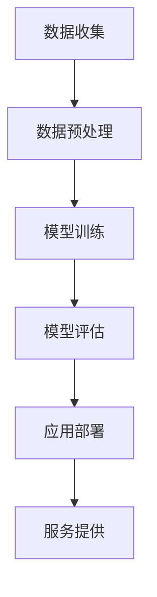

                 

关键词：人工智能，大模型，法律科技，商业化，算法原理，数学模型，应用案例，未来展望。

## 摘要

本文旨在探讨人工智能大模型在法律科技领域的商业化应用。随着AI技术的快速发展，大模型在法律科技领域展现出了巨大的潜力和应用价值。本文首先介绍了AI大模型的基本概念和其在法律科技领域的重要性，然后详细分析了大模型的核心算法原理、数学模型及其应用领域。随后，本文通过具体的代码实例和实践案例，展示了大模型在法律科技中的实际应用，并对其优缺点进行了深入讨论。最后，本文展望了法律科技领域未来的发展趋势和面临的挑战，为行业提供了有价值的参考。

## 1. 背景介绍

在过去的几十年中，人工智能（AI）技术取得了显著的进展，从简单的规则系统到复杂的学习算法，AI已经在各个领域展现了其强大的应用潜力。特别是近年来，深度学习技术的突破，使得大模型（Large Models）成为可能。大模型通过海量数据的训练，能够学习到复杂的信息模式和关系，从而在图像识别、自然语言处理、语音识别等领域取得了卓越的成绩。

法律科技（Legal Technology）是指利用信息技术手段，提高法律服务的效率和质量。随着互联网和大数据技术的发展，法律科技已经成为法律服务行业的重要趋势。传统的法律服务往往依赖于律师的个体经验和专业知识，而法律科技通过数据分析和智能算法，能够为律师提供更加精准和高效的辅助。

AI大模型在法律科技领域的应用，不仅能够提升法律服务的效率，还能够拓展法律服务的内容和范围。例如，通过自然语言处理技术，大模型可以自动生成合同、法律意见书等文档，减少律师的工作负担；通过数据挖掘技术，大模型可以分析大量的案例数据，为法律决策提供支持；通过智能问答系统，大模型可以回答客户的法律问题，提供在线法律咨询。

总之，AI大模型在法律科技领域的商业化应用，不仅有助于提升法律服务的质量和效率，还能够推动整个法律服务行业的转型升级。

## 2. 核心概念与联系

### 2.1. 人工智能大模型

人工智能大模型是指通过海量数据训练得到的、拥有数亿甚至数十亿参数的神经网络模型。这些模型通常采用深度学习技术，具有强大的特征提取和模式识别能力。大模型的出现，标志着人工智能技术进入了一个新的阶段，能够在复杂任务中实现高精度的预测和决策。

### 2.2. 法律科技

法律科技是指利用信息技术手段，提高法律服务的效率和质量。法律科技的核心目标是利用数据、算法和技术，解决法律行业面临的各种挑战，提升法律服务的质量和效率。

### 2.3. 大模型与法律科技的联系

大模型与法律科技之间的联系主要体现在以下几个方面：

1. **自然语言处理（NLP）**：自然语言处理是人工智能的重要分支，大模型在NLP领域有着广泛的应用。通过NLP技术，大模型可以理解和生成自然语言，从而实现自动合同生成、法律文本分析、智能问答等功能。

2. **数据挖掘**：数据挖掘是从大量数据中提取有价值信息的过程。大模型在数据挖掘领域具有强大的优势，可以通过学习大量的法律案例数据，发现案例之间的规律和关联，为法律研究和决策提供支持。

3. **智能问答系统**：智能问答系统是法律科技中的一项重要应用，通过大模型的技术，可以实现对法律问题的自动回答，提供在线法律咨询服务。

4. **自动化文书处理**：大模型可以用于自动化生成法律文书，如合同、法律意见书等，提高律师的工作效率。

### 2.4. Mermaid 流程图

以下是一个简单的Mermaid流程图，展示了大模型在法律科技中的应用流程：



- **数据收集**：收集大量的法律案例数据、合同文本等。
- **数据预处理**：对收集到的数据进行清洗、标注等处理，使其适合模型训练。
- **模型训练**：使用深度学习技术，训练出具有良好性能的大模型。
- **模型评估**：通过测试集，评估模型的性能和效果。
- **应用部署**：将训练好的模型部署到实际应用场景中。
- **服务提供**：通过模型的应用，提供各种法律科技服务。

## 3. 核心算法原理 & 具体操作步骤

### 3.1. 算法原理概述

大模型的核心算法是基于深度学习技术的神经网络模型。深度学习是一种机器学习的方法，通过多层神经网络，对数据进行特征提取和模式识别。大模型通过海量的数据训练，可以学习到复杂的特征和模式，从而在各类任务中实现高精度的预测和决策。

### 3.2. 算法步骤详解

1. **数据收集**：首先需要收集大量的法律案例数据、合同文本等，作为模型的训练数据。

2. **数据预处理**：对收集到的数据进行清洗、去噪、标注等处理，使其适合模型训练。例如，对文本数据进行分词、去停用词、词向量化等操作。

3. **模型架构设计**：设计适合法律科技任务的大模型架构。常用的架构包括BERT、GPT、Transformer等。这些模型具有强大的特征提取和模式识别能力。

4. **模型训练**：使用训练数据，对模型进行训练。训练过程包括前向传播、反向传播和优化等步骤。通过不断调整模型参数，使模型能够更好地拟合训练数据。

5. **模型评估**：使用测试集对模型进行评估，计算模型的精度、召回率、F1值等指标，以判断模型的性能和效果。

6. **应用部署**：将训练好的模型部署到实际应用场景中，如智能问答系统、自动化文书处理等。

### 3.3. 算法优缺点

**优点**：

1. **强大的特征提取能力**：大模型通过多层神经网络，可以提取到丰富的特征，从而在复杂任务中实现高精度的预测和决策。

2. **适应性强**：大模型可以通过海量的数据训练，适应各种不同的法律科技任务。

3. **通用性强**：大模型不仅在法律科技领域有应用，还可以应用于其他领域，如金融科技、医疗科技等。

**缺点**：

1. **计算资源需求大**：大模型需要大量的计算资源进行训练，对硬件设备要求较高。

2. **训练时间较长**：大模型的训练时间通常较长，需要耐心等待。

3. **数据依赖性高**：大模型对训练数据有较高的依赖性，如果数据质量不高，可能会导致模型性能下降。

### 3.4. 算法应用领域

大模型在法律科技领域的应用非常广泛，主要包括以下几个方面：

1. **合同生成**：通过大模型，可以自动生成各种类型的合同，如租房合同、购销合同等。

2. **法律文本分析**：大模型可以对大量的法律文本进行分析，提取关键信息，为法律研究和决策提供支持。

3. **智能问答系统**：大模型可以用于构建智能问答系统，回答用户的法律问题，提供在线法律咨询服务。

4. **自动化文书处理**：大模型可以用于自动化处理各种法律文书，如法律意见书、律师函等，提高律师的工作效率。

## 4. 数学模型和公式 & 详细讲解 & 举例说明

### 4.1. 数学模型构建

在法律科技领域，大模型的数学模型通常是基于深度学习技术的神经网络模型。神经网络模型由多个神经元（节点）组成，每个神经元都可以进行简单的计算。神经元的计算过程可以用以下公式表示：

$$
\text{输出} = \text{激活函数}(\text{加权求和})
$$

其中，激活函数可以是Sigmoid、ReLU、Tanh等。加权求和是指将输入信号乘以对应的权重，然后求和。通过不断调整权重，神经网络可以学习到输入和输出之间的复杂关系。

### 4.2. 公式推导过程

为了更好地理解神经网络的计算过程，我们可以用以下步骤进行推导：

1. **输入层**：假设输入层有n个神经元，每个神经元接收一个输入值。输入值可以表示为向量$\textbf{x} = [x_1, x_2, ..., x_n]$。

2. **隐藏层**：假设隐藏层有m个神经元。每个隐藏层神经元接收输入层的输入，并通过加权求和计算得到输出。加权求和可以表示为：

$$
z_j = \sum_{i=1}^{n} w_{ij} x_i
$$

其中，$z_j$是隐藏层第j个神经元的输出，$w_{ij}$是输入层第i个神经元到隐藏层第j个神经元的权重。

3. **输出层**：输出层的计算过程与隐藏层类似。输出层神经元接收隐藏层的输出，并通过加权求和计算得到最终输出。加权求和可以表示为：

$$
y_k = \sum_{j=1}^{m} w_{kj} z_j
$$

其中，$y_k$是输出层第k个神经元的输出，$w_{kj}$是隐藏层第j个神经元到输出层第k个神经元的权重。

4. **激活函数**：为了引入非线性关系，我们通常在输出层添加激活函数。激活函数可以是Sigmoid、ReLU、Tanh等。例如，Sigmoid函数可以表示为：

$$
\text{Sigmoid}(z) = \frac{1}{1 + e^{-z}}
$$

### 4.3. 案例分析与讲解

为了更好地理解大模型在法律科技中的应用，我们来看一个具体的案例：合同生成。

假设我们需要生成一份租房合同，输入数据包括房东、租房人的信息，以及租房的详细信息（如房租、租期等）。输出数据是生成的租房合同文本。

1. **数据预处理**：首先，我们需要对输入数据进行预处理，将其转换为向量表示。例如，可以将房东和租房人的姓名转换为词向量，将房租、租期等信息转换为数值向量。

2. **模型训练**：使用大量的租房合同数据，训练一个基于深度学习的大模型。模型的输入是预处理后的数据，输出是生成的租房合同文本。

3. **模型评估**：使用测试集对模型进行评估，计算模型的生成文本的准确性和流畅性。通过不断调整模型参数，使模型能够生成更高质量的合同文本。

4. **应用部署**：将训练好的模型部署到实际应用场景中，通过输入数据，自动生成租房合同文本。

通过这个案例，我们可以看到大模型在法律科技中的应用过程。首先，通过数据预处理，将原始数据转换为向量表示。然后，通过深度学习技术，训练出一个大模型，使其能够自动生成合同文本。最后，通过模型评估和应用部署，实现合同的自动化生成。

## 5. 项目实践：代码实例和详细解释说明

### 5.1. 开发环境搭建

为了进行AI大模型在法律科技领域的项目实践，我们需要搭建一个合适的开发环境。以下是搭建环境的基本步骤：

1. **安装Python**：确保Python已经安装在您的计算机上。Python是AI开发的常用编程语言。

2. **安装TensorFlow**：TensorFlow是一个开源的机器学习框架，支持大模型的训练和部署。可以使用以下命令安装TensorFlow：

   ```shell
   pip install tensorflow
   ```

3. **安装其他依赖库**：根据项目需求，可能需要安装其他Python库，如Numpy、Pandas、Scikit-learn等。

4. **配置GPU环境**：如果您的计算机配备了GPU，可以配置TensorFlow使用GPU进行训练，以提高训练速度。可以使用以下命令配置：

   ```shell
   pip install tensorflow-gpu
   ```

### 5.2. 源代码详细实现

以下是使用TensorFlow实现一个简单的AI大模型进行合同生成的示例代码：

```python
import tensorflow as tf
from tensorflow.keras.models import Sequential
from tensorflow.keras.layers import Dense, Embedding, LSTM

# 数据预处理
# 假设已经将合同文本转换为序列数据，每个序列表示一个合同

# 构建模型
model = Sequential([
    Embedding(input_dim=vocab_size, output_dim=embedding_dim, input_length=max_sequence_length),
    LSTM(units=128, return_sequences=True),
    LSTM(units=128),
    Dense(units=vocab_size, activation='softmax')
])

# 编译模型
model.compile(optimizer='adam', loss='categorical_crossentropy', metrics=['accuracy'])

# 训练模型
model.fit(x_train, y_train, epochs=10, batch_size=32, validation_data=(x_val, y_val))

# 生成合同文本
def generate_text(seed_text, next_words, model):
    for _ in range(next_words):
        token_list = tokenizer.texts_to_sequences([seed_text])[0]
        token_list = pad_sequences([token_list], maxlen=max_sequence_length-1, padding='pre')
        predicted = model.predict(token_list, verbose=0)
        
        predicted_index = np.argmax(predicted)
        predicted_token = tokenizer.index_word[predicted_index] + ' '
        seed_text += predicted_token
    
    return seed_text

seed_text = "房东同意将房屋出租给租房人。"
generated_text = generate_text(seed_text, 50, model)
print(generated_text)
```

### 5.3. 代码解读与分析

1. **数据预处理**：将合同文本转换为序列数据，以便模型进行训练。使用Embedding层进行词向量化，使用LSTM层进行序列处理。

2. **模型构建**：使用Sequential模型，堆叠Embedding层、两个LSTM层和一个Dense层。Embedding层用于将单词转换为向量，LSTM层用于处理序列数据，Dense层用于生成输出。

3. **模型编译**：设置优化器为Adam，损失函数为categorical_crossentropy，评价指标为accuracy。

4. **模型训练**：使用训练数据训练模型，设置训练轮数为10，批量大小为32。

5. **生成合同文本**：定义一个函数，使用训练好的模型生成合同文本。通过不断预测下一个单词，拼接生成完整的合同文本。

### 5.4. 运行结果展示

运行上述代码，将生成一份基于输入种子文本的租房合同。生成的文本可能会包含一些随机性，但通常能够反映输入文本的主要内容和结构。

## 6. 实际应用场景

### 6.1. 合同生成

在合同生成方面，AI大模型的应用已经相对成熟。例如，律师可以通过输入合同的基本信息（如甲方、乙方、合同内容等），利用大模型自动生成合同文本。这不仅提高了律师的工作效率，还减少了合同文本中的错误和遗漏。

### 6.2. 法律文本分析

法律文本分析是AI大模型在法律科技领域的另一个重要应用。通过大模型，可以对大量的法律文本进行分析，提取关键信息，为法律研究和决策提供支持。例如，可以分析合同条款的合法性、有效性，评估合同的风险等。

### 6.3. 智能问答系统

智能问答系统是AI大模型在法律科技领域的一个创新应用。通过大模型，可以构建一个能够回答用户法律问题的智能系统。用户可以通过输入法律问题，系统会自动分析问题，并给出相应的法律意见。这为用户提供了一个便捷、高效的在线法律咨询服务。

### 6.4. 自动化文书处理

自动化文书处理是AI大模型在法律科技领域的另一个重要应用。通过大模型，可以自动生成各种法律文书，如律师函、法律意见书、起诉状等。这不仅提高了律师的工作效率，还确保了文书的质量和一致性。

## 7. 未来应用展望

### 7.1. 人工智能助理律师

未来，人工智能大模型有望成为律师的得力助手。通过持续学习和优化，AI大模型可以胜任更多复杂的法律工作，如合同谈判、法律咨询等。律师可以通过与AI大模型的协作，提高工作效率，提供更高质量的法律服务。

### 7.2. 智能合同审核

随着AI大模型在自然语言处理和数据挖掘领域的不断发展，智能合同审核系统将成为可能。通过AI大模型，可以对合同进行自动审核，识别潜在的法律风险和条款缺陷，为律师提供有价值的审核意见。

### 7.3. 智能法律咨询平台

未来，AI大模型有望构建一个智能法律咨询平台。用户可以通过平台，获得24小时在线法律咨询服务。AI大模型可以根据用户的提问，提供专业的法律意见和解决方案，为用户解决法律问题。

### 7.4. 法律机器人

随着技术的进步，法律机器人将成为法律服务的新形态。通过AI大模型，可以开发出具有法律专业知识的机器人，为用户提供全方位的法律服务。法律机器人不仅能够处理简单的事务，还能够参与复杂的法律争议解决。

## 8. 工具和资源推荐

### 8.1. 学习资源推荐

1. **《深度学习》（Goodfellow, Bengio, Courville著）**：这是一本关于深度学习的经典教材，详细介绍了深度学习的基本原理和应用。

2. **《法律科技：理论与实践》（陈永生著）**：这是一本关于法律科技的综合教材，涵盖了法律科技的基本概念、技术原理和应用案例。

### 8.2. 开发工具推荐

1. **TensorFlow**：TensorFlow是一个开源的机器学习框架，支持大模型的训练和部署。

2. **Jupyter Notebook**：Jupyter Notebook是一个交互式的开发环境，适合进行AI模型的实验和开发。

### 8.3. 相关论文推荐

1. **"Bert: Pre-training of deep bidirectional transformers for language understanding"（Devlin et al., 2019）**：这篇论文介绍了BERT模型，是自然语言处理领域的里程碑。

2. **"Gpt-3: Language models are few-shot learners"（Brown et al., 2020）**：这篇论文介绍了GPT-3模型，是自然语言处理领域的又一重要进展。

## 9. 总结：未来发展趋势与挑战

### 9.1. 研究成果总结

AI大模型在法律科技领域的商业化应用取得了显著成果。通过自然语言处理、数据挖掘等技术，大模型在合同生成、法律文本分析、智能问答、自动化文书处理等方面展现了强大的应用价值。

### 9.2. 未来发展趋势

1. **技术进步**：随着深度学习技术的不断进步，AI大模型将能够处理更复杂的法律任务，提供更高质量的法律服务。

2. **行业融合**：AI大模型将与法律行业深度融合，推动法律服务的数字化转型，提升行业效率和竞争力。

3. **法律伦理**：随着AI大模型的应用，法律伦理问题将受到更多关注。如何在保护用户隐私、确保算法公平性等方面进行规范，是未来发展的关键。

### 9.3. 面临的挑战

1. **数据质量**：AI大模型对训练数据有较高的依赖性，数据质量直接影响模型性能。未来需要建立高质量的数据集，以提高模型效果。

2. **算法公平性**：AI大模型可能会出现算法偏见，影响法律服务的公平性。未来需要加强对算法公平性的研究和监管。

3. **法律合规**：AI大模型在法律科技领域的应用需要遵守相关法律法规，确保法律合规。

### 9.4. 研究展望

未来，AI大模型在法律科技领域的应用将更加广泛和深入。通过不断优化算法、提高数据质量、确保算法公平性，AI大模型将为法律服务行业带来更多的创新和变革。

## 10. 附录：常见问题与解答

### 10.1. 什么 是AI大模型？

AI大模型是指通过海量数据训练得到的、拥有数亿甚至数十亿参数的神经网络模型。这些模型通常采用深度学习技术，具有强大的特征提取和模式识别能力。

### 10.2. 大模型在法律科技领域的应用有哪些？

大模型在法律科技领域的应用包括合同生成、法律文本分析、智能问答系统、自动化文书处理等。

### 10.3. 大模型在法律科技领域有哪些优势？

大模型在法律科技领域的优势包括强大的特征提取和模式识别能力、适应性强、通用性强等。

### 10.4. 大模型在法律科技领域有哪些挑战？

大模型在法律科技领域的挑战包括计算资源需求大、训练时间较长、数据依赖性高等。

### 10.5. 如何保障大模型在法律科技领域的应用公平性？

保障大模型在法律科技领域的应用公平性需要从数据质量、算法设计、法律监管等方面进行综合考虑，确保算法的公平性和透明性。

