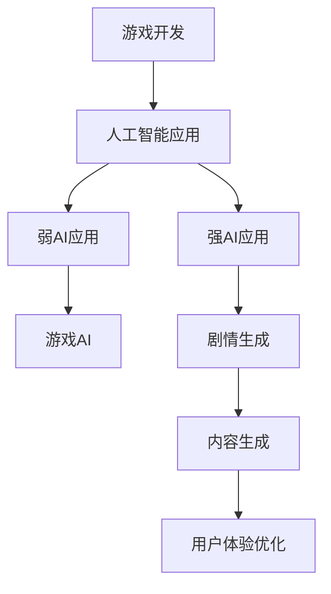

                 

关键词：人工智能，游戏开发，大模型，应用案例，算法优化，数学模型

> 摘要：随着人工智能技术的飞速发展，大模型在游戏开发中的应用越来越广泛。本文将探讨大模型在游戏开发中的核心作用、应用案例、算法优化以及未来发展趋势，旨在为游戏开发者提供有益的技术参考。

## 1. 背景介绍

游戏开发作为计算机科学和娱乐产业的交叉领域，一直以来都处于技术革新的前沿。从最早的文本冒险游戏到如今的3D虚拟现实游戏，游戏技术经历了翻天覆地的变化。近年来，随着人工智能（AI）技术的快速发展，特别是大模型（如GPT、BERT等）的突破性进展，游戏开发领域迎来了新的机遇。

大模型具备强大的学习能力和数据处理能力，能够在游戏世界中模拟复杂的行为和交互，为游戏开发者提供了前所未有的创作工具。例如，AI可以自动生成游戏关卡、优化游戏AI对手、提升游戏剧情的连贯性和沉浸感等。因此，探讨大模型在游戏开发中的应用具有重要意义。

## 2. 核心概念与联系

### 2.1 人工智能的基本概念

人工智能（Artificial Intelligence，简称AI）是一门研究、开发和应用使计算机模拟、扩展和辅助人类智能的科学。它涉及计算机科学、心理学、认知科学等多个学科领域。AI可以分为两类：弱AI和强AI。

- **弱AI（Narrow AI）**：专注于特定任务，如语音识别、图像处理、游戏AI等。弱AI在大规模数据处理和复杂决策方面表现出色。
- **强AI（General AI）**：具备人类智能的全面性，能够理解、学习和适应各种复杂情境。目前，强AI尚未实现。

### 2.2 大模型的概念

大模型是指那些参数量巨大、能够处理海量数据并从中学习复杂模式的神经网络模型。这些模型通常由数十亿甚至数万亿个参数组成，例如GPT-3、BERT等。大模型的显著特点是：

- **强大的学习能力**：通过大量数据进行训练，能够快速学习和适应新的任务。
- **广泛的适用性**：可以在多个领域（如自然语言处理、计算机视觉、游戏开发等）发挥作用。

### 2.3 大模型与游戏开发的联系

大模型在游戏开发中的应用主要体现在以下几个方面：

- **游戏AI**：利用大模型可以生成更加智能、反应更迅速的游戏AI，提高游戏难度和乐趣。
- **游戏剧情**：大模型可以帮助自动生成游戏剧情，提高剧情的连贯性和丰富性。
- **游戏内容生成**：大模型可以自动生成游戏关卡、角色、场景等，减少开发者工作量。
- **用户体验优化**：大模型可以分析用户行为，优化游戏设计和体验。

### 2.4 Mermaid 流程图



## 3. 核心算法原理 & 具体操作步骤

### 3.1 算法原理概述

大模型在游戏开发中的应用主要基于深度学习技术，特别是基于Transformer架构的预训练模型。以下是一个典型的操作步骤：

1. **数据收集**：收集游戏相关的数据，如游戏剧情文本、角色描述、游戏关卡等。
2. **模型训练**：使用预训练模型对收集到的数据进行训练，使其能够理解和生成游戏相关的内容。
3. **模型部署**：将训练好的模型部署到游戏服务器，实时生成和优化游戏内容。

### 3.2 算法步骤详解

1. **数据收集**：

   - 文本数据：收集游戏剧情文本、角色描述等。
   - 图像数据：收集游戏场景、角色图像等。
   - 游戏行为数据：收集玩家行为数据，如游戏进度、操作记录等。

2. **模型训练**：

   - 使用预训练模型（如GPT-3、BERT等）对收集到的数据进行训练。
   - 训练过程中，模型会学习到游戏相关的知识和模式。
   - 训练完成后，模型可以生成和优化游戏内容。

3. **模型部署**：

   - 将训练好的模型部署到游戏服务器。
   - 在游戏运行过程中，模型会实时分析玩家行为，生成和优化游戏内容。

### 3.3 算法优缺点

- **优点**：

  - 强大的生成能力：大模型可以生成丰富多样的游戏内容，提高游戏的可玩性和趣味性。
  - 实时优化：模型可以实时分析玩家行为，优化游戏设计和体验。

- **缺点**：

  - 计算资源消耗大：大模型训练和部署需要大量的计算资源。
  - 需要大量数据：模型训练需要大量的数据支持，数据质量对模型效果有重要影响。

### 3.4 算法应用领域

- **游戏AI**：生成智能游戏AI，提高游戏难度和乐趣。
- **游戏剧情**：自动生成游戏剧情，提高剧情的连贯性和丰富性。
- **游戏内容生成**：自动生成游戏关卡、角色、场景等，减少开发者工作量。
- **用户体验优化**：分析用户行为，优化游戏设计和体验。

## 4. 数学模型和公式 & 详细讲解 & 举例说明

### 4.1 数学模型构建

在游戏开发中，大模型的数学模型主要基于深度学习和概率统计理论。以下是一个简化的数学模型构建过程：

1. **输入层**：接收游戏相关的数据，如文本、图像、行为等。
2. **隐藏层**：通过神经网络结构对输入数据进行处理，提取特征。
3. **输出层**：根据隐藏层提取的特征生成游戏内容，如剧情、角色、场景等。

### 4.2 公式推导过程

假设输入数据为 \( X \)，隐藏层提取的特征为 \( H \)，输出层生成的游戏内容为 \( Y \)。则数学模型可以表示为：

\[ Y = f(H) \]

其中，\( f \) 为神经网络函数，通常为非线性函数，如ReLU、Sigmoid等。

### 4.3 案例分析与讲解

以下是一个简单的案例，说明如何使用大模型生成游戏剧情。

1. **输入数据**：

   - 游戏剧情文本：玩家进入一个神秘的森林，发现了一座古老的城堡。

2. **模型训练**：

   - 使用GPT-3模型对游戏剧情文本进行训练，使其学会生成游戏剧情。

3. **模型部署**：

   - 在游戏运行过程中，输入当前游戏状态，模型生成后续游戏剧情。

4. **输出结果**：

   - 模型生成：玩家走进城堡，发现城堡内部空无一人，但却弥漫着一股神秘的气息。

## 5. 项目实践：代码实例和详细解释说明

### 5.1 开发环境搭建

在游戏开发中，搭建开发环境是第一步。以下是一个简单的Python开发环境搭建过程：

1. 安装Python：在官网下载Python安装包，安装Python和pip工具。
2. 安装依赖库：使用pip安装游戏开发相关的依赖库，如Pygame、TensorFlow等。

### 5.2 源代码详细实现

以下是一个简单的使用GPT-3生成游戏剧情的Python代码实例：

```python
import openai

# 设置API密钥
openai.api_key = "your-api-key"

# 生成游戏剧情
def generate_game_story(prompt):
    response = openai.Completion.create(
        engine="text-davinci-002",
        prompt=prompt,
        max_tokens=100
    )
    return response.choices[0].text.strip()

# 输入初始剧情
initial_prompt = "玩家进入一个神秘的森林，发现了一座古老的城堡。"
# 生成后续剧情
game_story = generate_game_story(initial_prompt)
print(game_story)
```

### 5.3 代码解读与分析

- **导入模块**：引入openai库，用于与OpenAI API进行交互。
- **设置API密钥**：使用API密钥进行认证。
- **生成游戏剧情**：定义`generate_game_story`函数，使用OpenAI的GPT-3模型生成游戏剧情。
- **输入初始剧情**：定义初始剧情作为输入。
- **生成后续剧情**：调用`generate_game_story`函数生成后续游戏剧情，并打印输出。

### 5.4 运行结果展示

运行代码后，输出结果可能如下：

```
玩家走进城堡，发现城堡内部空无一人，但却弥漫着一股神秘的气息。他小心翼翼地走进城堡的内部，发现了一扇紧闭的大门。大门上有一把古老的锁，锁芯已经生锈。玩家试图打开大门，但却无法打开。他突然听到了一阵低沉的声音，声音来自城堡的深处。声音逐渐变得清晰，仿佛在说：“你来晚了，宝藏已经被取走了。”
```

这个结果是一个生动有趣的游戏剧情，展示了大模型在游戏开发中的应用潜力。

## 6. 实际应用场景

### 6.1 游戏AI

大模型在游戏AI中的应用主要体现在以下几个方面：

- **动态生成游戏关卡**：大模型可以根据玩家的游戏进度和偏好动态生成关卡，提高游戏的可玩性和挑战性。
- **智能游戏对手**：大模型可以生成具有复杂策略和反应速度的游戏对手，增加游戏的乐趣和难度。
- **个性化推荐**：大模型可以分析玩家的行为和偏好，为玩家推荐符合其喜好的游戏内容。

### 6.2 游戏剧情

大模型在游戏剧情中的应用主要体现在以下几个方面：

- **自动生成剧情**：大模型可以自动生成游戏剧情，提高剧情的连贯性和丰富性。
- **剧情优化**：大模型可以分析玩家对剧情的反馈，优化剧情的设计和表达方式。
- **剧情个性化**：大模型可以根据玩家的行为和偏好为玩家提供个性化的剧情体验。

### 6.3 游戏内容生成

大模型在游戏内容生成中的应用主要体现在以下几个方面：

- **自动生成角色**：大模型可以自动生成游戏角色，包括外观、性格、技能等。
- **自动生成场景**：大模型可以自动生成游戏场景，包括地形、建筑、环境等。
- **自动生成道具**：大模型可以自动生成游戏道具，包括武器、装备、消耗品等。

### 6.4 用户体验优化

大模型在用户体验优化中的应用主要体现在以下几个方面：

- **行为分析**：大模型可以分析玩家的行为和偏好，为玩家提供个性化的游戏体验。
- **反馈优化**：大模型可以分析玩家的反馈，优化游戏的设计和表现。
- **实时调整**：大模型可以实时分析玩家的行为，调整游戏设置和内容，以提供更好的用户体验。

## 7. 工具和资源推荐

### 7.1 学习资源推荐

- **书籍**：
  - 《深度学习》（Goodfellow, I., Bengio, Y., & Courville, A.）
  - 《人工智能：一种现代方法》（Manning, C. D., & Schutze, H.）
- **在线课程**：
  - Coursera上的“深度学习”课程
  - edX上的“人工智能导论”课程
- **博客和论坛**：
  - ArXiv：https://arxiv.org/
  - AI博客：https://blog.keras.io/
  - Stack Overflow：https://stackoverflow.com/

### 7.2 开发工具推荐

- **深度学习框架**：
  - TensorFlow：https://www.tensorflow.org/
  - PyTorch：https://pytorch.org/
- **游戏开发框架**：
  - Pygame：https://pygame.org/
  - Unity：https://unity.com/
- **文本生成模型**：
  - OpenAI GPT-3：https://openai.com/blog/better-future-gpt/

### 7.3 相关论文推荐

- **《Attention Is All You Need》**：https://arxiv.org/abs/1706.03762
- **《BERT: Pre-training of Deep Bidirectional Transformers for Language Understanding》**：https://arxiv.org/abs/1810.04805
- **《Generative Adversarial Networks》**：https://arxiv.org/abs/1406.2661

## 8. 总结：未来发展趋势与挑战

### 8.1 研究成果总结

随着人工智能技术的不断进步，大模型在游戏开发中的应用已经取得了显著成果。主要表现在：

- 游戏AI的智能化程度显著提升，为游戏开发者提供了丰富的创作工具。
- 游戏剧情的生成和优化更加丰富和多样化，提高了游戏的可玩性和沉浸感。
- 游戏内容生成和用户体验优化为游戏开发者节省了大量时间和资源。

### 8.2 未来发展趋势

- **大模型的性能将继续提升**：随着计算资源的增加，大模型的参数量和训练数据将不断增长，性能将得到进一步提升。
- **应用领域的拓展**：大模型将在更多游戏开发领域（如虚拟现实、增强现实等）得到应用。
- **开源和商业模型的融合**：开源模型和商业模型的融合将推动大模型在游戏开发中的应用。

### 8.3 面临的挑战

- **计算资源消耗**：大模型训练和部署需要大量的计算资源，对硬件设施和运维提出了更高要求。
- **数据质量和隐私**：游戏开发中涉及大量的用户数据，数据质量和隐私保护是重要挑战。
- **道德和社会影响**：大模型在游戏开发中的应用可能会引发道德和社会问题，需要加以关注和规范。

### 8.4 研究展望

- **多模态学习**：未来研究将更加关注多模态学习，结合文本、图像、音频等多种数据类型，提升大模型在游戏开发中的应用效果。
- **个性化推荐**：通过个性化推荐技术，为玩家提供更加贴合其喜好的游戏内容和体验。
- **道德和社会责任**：加强大模型在游戏开发中的应用规范，确保其符合道德和社会责任。

## 9. 附录：常见问题与解答

### 9.1 如何选择合适的大模型？

- 根据应用场景选择：游戏AI、游戏剧情、游戏内容生成等场景需要不同类型的大模型。
- 考虑模型性能：选择参数量适中、性能稳定的大模型。
- 考虑计算资源：选择计算资源消耗适中的大模型，以确保训练和部署的可行性。

### 9.2 大模型训练需要哪些数据？

- 文本数据：包括游戏剧情、角色描述、游戏说明等。
- 图像数据：包括游戏场景、角色图像、道具图像等。
- 行为数据：包括玩家操作记录、游戏进度、游戏评价等。

### 9.3 如何优化大模型在游戏开发中的应用效果？

- **数据质量**：提高训练数据的质量，包括数据的多样性、真实性和完整性。
- **模型优化**：通过调整模型参数、优化训练过程，提高模型性能。
- **应用策略**：根据游戏特点和玩家需求，制定合适的模型应用策略。

### 9.4 大模型在游戏开发中的应用前景如何？

大模型在游戏开发中的应用前景非常广阔，有望在游戏AI、游戏剧情、游戏内容生成和用户体验优化等多个方面取得突破性进展。然而，也需要关注计算资源、数据质量和道德等问题。

----------------------------------------------------------------

### 作者署名

作者：禅与计算机程序设计艺术 / Zen and the Art of Computer Programming
----------------------------------------------------------------

以上是关于“AI大模型在游戏开发中的应用”的完整文章。希望对您有所帮助。如果需要进一步的信息或讨论，请随时提问。

