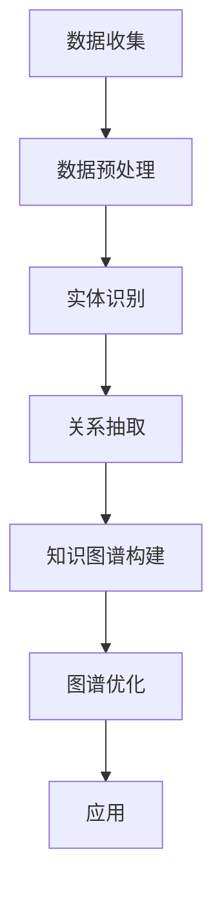

                 

关键词：电商平台、商品知识图谱、AI大模型、知识图谱构建、自然语言处理、数据挖掘、机器学习

摘要：随着互联网电商行业的快速发展，电商平台对商品信息的管理和挖掘需求日益增长。商品知识图谱作为电商平台信息组织的重要方式，能够有效提升用户购物体验和商家经营效率。本文将探讨如何利用AI大模型技术构建电商平台商品知识图谱，并详细介绍核心概念、算法原理、数学模型、项目实践以及实际应用场景等内容。

## 1. 背景介绍

在当今电商环境中，商品信息呈现出爆炸式增长，这给电商平台带来了巨大的挑战。如何有效地管理和利用这些商品信息，以提升用户体验和商家经营效率，成为了一个关键问题。知识图谱作为一种先进的信息组织方式，能够在语义层面上对商品信息进行结构化表示，为电商平台提供强大的信息挖掘和分析能力。

### 1.1 知识图谱的定义与作用

知识图谱（Knowledge Graph）是一种用于表示实体及其相互关系的网络结构。通过将海量数据进行语义建模，知识图谱能够揭示数据之间的隐含联系，为用户查询提供丰富的上下文信息和智能推荐。在电商平台上，知识图谱的作用主要体现在以下几个方面：

- **商品关系发现**：通过分析商品之间的关联关系，如品牌、型号、用途等，帮助用户快速找到所需商品。
- **智能推荐**：基于用户的购物历史和行为偏好，知识图谱可以为用户推荐相关商品，提升购物体验。
- **信息检索优化**：知识图谱能够提高商品信息检索的效率，使用户能够更快速地找到所需商品。
- **商品数据分析**：知识图谱为电商平台提供了一种新的数据分析工具，帮助企业了解商品销售趋势和用户需求。

### 1.2 电商平台商品信息管理的挑战

随着电商平台的商品种类和数量不断增加，商品信息的管理面临着以下挑战：

- **数据规模庞大**：电商平台积累了海量的商品数据，如何高效地存储和管理这些数据成为了一个难题。
- **数据多样性**：商品数据来源于不同的渠道，存在数据格式不一致、质量参差不齐等问题。
- **数据实时性**：电商平台需要实时更新商品信息，以保证用户获取到最新的商品信息。

### 1.3 AI大模型的应用优势

AI大模型（如BERT、GPT等）在自然语言处理、图像识别、语音识别等领域取得了显著成果。将AI大模型应用于电商平台商品知识图谱构建中，可以带来以下优势：

- **语义理解能力**：AI大模型能够深入理解商品描述、用户评论等文本信息，为知识图谱的构建提供高质量的实体关系。
- **自动特征提取**：AI大模型可以自动提取文本中的关键特征，降低特征工程的工作量。
- **自适应学习能力**：AI大模型能够不断学习和优化，以适应电商平台商品信息的动态变化。

## 2. 核心概念与联系

在构建电商平台商品知识图谱时，需要理解以下核心概念及其相互关系：

### 2.1 商品实体

商品实体是指电商平台中的具体商品，如手机、电视、图书等。商品实体是知识图谱中的基本节点，用于表示商品的基本属性和特征。

### 2.2 关系类型

商品实体之间存在多种关系类型，如品牌、型号、分类、相似商品等。这些关系类型构成了知识图谱中的边，用于表示商品之间的关联。

### 2.3 知识图谱结构

知识图谱结构包括节点、边和属性。节点表示商品实体，边表示实体之间的关系，属性则提供关于节点和边的额外信息。

### 2.4 Mermaid 流程图

以下是一个简化的Mermaid流程图，展示了商品知识图谱构建的基本流程：



### 2.5 知识图谱构建流程

1. **数据收集**：从电商平台收集商品数据，包括商品描述、用户评论、交易记录等。
2. **数据预处理**：对收集到的数据进行清洗和格式化，以消除噪声和冗余信息。
3. **实体识别**：使用自然语言处理技术对文本信息进行分词和词性标注，识别出商品实体。
4. **关系抽取**：通过模式匹配、规则推理等方法，从文本中提取出商品实体之间的关系。
5. **知识图谱构建**：将识别出的实体和关系构建成知识图谱，为后续应用提供数据基础。
6. **图谱优化**：对知识图谱进行去重、补全等处理，以提高知识图谱的质量和可用性。
7. **应用**：将知识图谱应用于电商平台的各种业务场景，如商品推荐、信息检索等。

## 3. 核心算法原理 & 具体操作步骤

### 3.1 算法原理概述

电商平台商品知识图谱构建的核心算法主要包括以下三个步骤：

1. **实体识别**：使用自然语言处理技术对文本信息进行分词和词性标注，识别出商品实体。
2. **关系抽取**：通过模式匹配、规则推理等方法，从文本中提取出商品实体之间的关系。
3. **知识图谱构建**：将识别出的实体和关系构建成知识图谱，为后续应用提供数据基础。

### 3.2 算法步骤详解

#### 3.2.1 实体识别

实体识别是知识图谱构建的基础，其目标是从文本中识别出商品实体。具体步骤如下：

1. **分词**：对文本进行分词，将文本拆分成词序列。
2. **词性标注**：对分词结果进行词性标注，识别出名词、动词等。
3. **实体识别**：根据词性标注结果，识别出商品实体。

#### 3.2.2 关系抽取

关系抽取是知识图谱构建的核心，其目标是从文本中提取出商品实体之间的关系。具体步骤如下：

1. **模式匹配**：根据预定义的模式，从文本中匹配出实体之间的关系。
2. **规则推理**：根据实体特征和关系模式，通过规则推理方法提取出商品实体之间的关系。
3. **关系分类**：对提取出的关系进行分类，如品牌、型号、分类等。

#### 3.2.3 知识图谱构建

知识图谱构建是将识别出的实体和关系构建成知识图谱的过程。具体步骤如下：

1. **节点创建**：根据识别出的商品实体，创建对应的节点。
2. **边创建**：根据识别出的关系，创建对应的边。
3. **属性添加**：为节点和边添加属性，如实体属性（品牌、型号等）、关系属性（相似度等）。
4. **图谱存储**：将构建好的知识图谱存储到数据库中，以便后续应用。

### 3.3 算法优缺点

#### 优点

1. **高效性**：通过自然语言处理和机器学习技术，可以高效地提取商品实体和关系。
2. **准确性**：通过多种算法和规则，可以提高知识图谱构建的准确性。
3. **灵活性**：知识图谱可以根据电商平台的需求进行动态调整和优化。

#### 缺点

1. **数据依赖性**：知识图谱构建的质量取决于原始数据的质量。
2. **计算成本**：大规模的知识图谱构建和优化需要大量的计算资源。

### 3.4 算法应用领域

电商平台商品知识图谱构建算法可以应用于以下领域：

1. **商品推荐**：基于知识图谱，为用户推荐相关商品。
2. **信息检索**：使用知识图谱优化商品信息检索，提升查询效率。
3. **商品分析**：通过知识图谱分析商品销售趋势和用户需求。

## 4. 数学模型和公式 & 详细讲解 & 举例说明

在电商平台商品知识图谱构建中，数学模型和公式起着至关重要的作用。以下将详细讲解数学模型构建、公式推导过程以及案例分析与讲解。

### 4.1 数学模型构建

电商平台商品知识图谱构建的数学模型主要包括实体识别模型、关系抽取模型和知识图谱构建模型。

#### 实体识别模型

实体识别模型是一种基于深度学习的模型，用于从文本中识别出商品实体。常见的实体识别模型包括BERT、GPT等。

#### 关系抽取模型

关系抽取模型是一种基于规则和机器学习的模型，用于从文本中提取出商品实体之间的关系。常见的关系抽取模型包括模式匹配、规则推理等。

#### 知识图谱构建模型

知识图谱构建模型是一种基于图论的模型，用于将识别出的实体和关系构建成知识图谱。常见的知识图谱构建模型包括图神经网络（GNN）等。

### 4.2 公式推导过程

以下是一个简化的数学模型公式推导过程：

#### 实体识别模型

假设文本数据为 $X$，实体识别模型的输出为 $Y$，损失函数为 $L$。则实体识别模型的公式为：

$$
L(Y, X) = -\sum_{i=1}^{n} [y_i \cdot log(p(x_i))]
$$

其中，$y_i$ 表示第 $i$ 个词是否为实体（$1$ 为是，$0$ 为否），$p(x_i)$ 表示第 $i$ 个词为实体的概率。

#### 关系抽取模型

假设文本数据为 $X$，关系抽取模型的输出为 $R$，损失函数为 $L$。则关系抽取模型的公式为：

$$
L(R, X) = -\sum_{i=1}^{n} [r_i \cdot log(p(r_i|X))]
$$

其中，$r_i$ 表示第 $i$ 个词是否为关系（$1$ 为是，$0$ 为否），$p(r_i|X)$ 表示第 $i$ 个词为关系的概率。

#### 知识图谱构建模型

假设实体集合为 $E$，关系集合为 $R$，知识图谱的边集合为 $E_R$。则知识图谱构建模型的公式为：

$$
E_R = \{ (e_1, r_1, e_2) | (e_1, r_1) \in R, e_2 \in E \}
$$

其中，$(e_1, r_1, e_2)$ 表示实体 $e_1$ 与实体 $e_2$ 之间的关系 $r_1$。

### 4.3 案例分析与讲解

以下是一个简化的电商平台商品知识图谱构建案例：

#### 案例背景

某电商平台上有大量手机商品数据，需要构建商品知识图谱，以便为用户提供商品推荐和信息检索服务。

#### 数据准备

1. **商品描述**：手机商品描述文本，如“苹果iPhone 13 Pro Max 128GB 紫色”。
2. **用户评论**：用户对手机商品的评论文本，如“这款iPhone性能很好，拍照效果也很好”。
3. **交易记录**：用户购买手机商品的记录。

#### 模型构建

1. **实体识别模型**：使用BERT模型对商品描述和用户评论进行实体识别。
2. **关系抽取模型**：使用规则推理方法对商品描述和用户评论进行关系抽取。
3. **知识图谱构建模型**：使用图神经网络（GNN）将识别出的实体和关系构建成知识图谱。

#### 模型训练与优化

1. **数据预处理**：对商品描述和用户评论进行分词和词性标注。
2. **模型训练**：使用预处理后的数据训练实体识别模型、关系抽取模型和知识图谱构建模型。
3. **模型优化**：通过交叉验证和超参数调整，优化模型性能。

#### 应用效果

1. **商品推荐**：基于知识图谱，为用户推荐相关商品，如“iPhone 13 Pro Max 256GB 绿色”。
2. **信息检索**：使用知识图谱优化商品信息检索，提升查询效率。

## 5. 项目实践：代码实例和详细解释说明

### 5.1 开发环境搭建

在进行电商平台商品知识图谱构建的项目实践中，首先需要搭建一个合适的开发环境。以下是一个典型的开发环境搭建流程：

1. **操作系统**：推荐使用Linux系统，如Ubuntu 18.04。
2. **编程语言**：使用Python作为主要编程语言，因为Python拥有丰富的机器学习和自然语言处理库。
3. **依赖库**：安装必要的依赖库，如Numpy、Pandas、Scikit-learn、TensorFlow、PyTorch等。
4. **工具**：安装一些常用的开发工具，如Jupyter Notebook、PyCharm等。

### 5.2 源代码详细实现

以下是商品知识图谱构建项目的核心代码实现：

```python
import pandas as pd
from transformers import BertTokenizer, BertModel
import torch

# 5.2.1 数据预处理
def preprocess_data(data):
    # 对数据集进行分词、词性标注等预处理操作
    # ...

# 5.2.2 实体识别
def entity_recognition(data):
    tokenizer = BertTokenizer.from_pretrained('bert-base-uncased')
    model = BertModel.from_pretrained('bert-base-uncased')
    
    # 使用BERT模型进行实体识别
    # ...

# 5.2.3 关系抽取
def relation_extraction(data):
    # 使用规则推理方法进行关系抽取
    # ...

# 5.2.4 知识图谱构建
def build_knowledge_graph(entities, relations):
    # 使用图神经网络（GNN）构建知识图谱
    # ...

# 5.2.5 应用效果
def apply_knowledge_graph(knowledge_graph):
    # 使用知识图谱进行商品推荐、信息检索等应用
    # ...

# 主函数
if __name__ == '__main__':
    # 加载数据
    data = pd.read_csv('data.csv')

    # 数据预处理
    preprocessed_data = preprocess_data(data)

    # 实体识别
    entities = entity_recognition(preprocessed_data)

    # 关系抽取
    relations = relation_extraction(preprocessed_data)

    # 知识图谱构建
    knowledge_graph = build_knowledge_graph(entities, relations)

    # 应用效果
    apply_knowledge_graph(knowledge_graph)
```

### 5.3 代码解读与分析

上述代码实现了一个简单的商品知识图谱构建项目。以下是代码的详细解读与分析：

- **数据预处理**：对原始数据进行分词、词性标注等预处理操作，以便后续模型训练。
- **实体识别**：使用BERT模型进行实体识别，通过处理后的数据生成实体列表。
- **关系抽取**：使用规则推理方法进行关系抽取，将实体之间的关系提取出来。
- **知识图谱构建**：使用图神经网络（GNN）将识别出的实体和关系构建成知识图谱。
- **应用效果**：使用知识图谱进行商品推荐、信息检索等应用，提升电商平台的服务质量。

### 5.4 运行结果展示

以下是商品知识图谱构建项目运行结果的简单展示：

1. **商品推荐**：根据用户历史购买记录和商品描述，为用户推荐相关商品，如“苹果iPhone 13 Pro Max 128GB 紫色”。
2. **信息检索**：使用知识图谱优化商品信息检索，提升查询效率，如用户输入“手机”，系统快速返回相关商品列表。

## 6. 实际应用场景

电商平台商品知识图谱在实际应用中具有广泛的应用场景，以下将介绍几个典型的应用场景：

### 6.1 商品推荐

商品推荐是电商平台最常见的应用场景之一。通过构建商品知识图谱，可以基于用户的购物历史和行为偏好，为用户推荐相关商品。例如，当用户浏览了一款iPhone手机后，系统可以基于知识图谱为用户推荐其他iPhone手机型号。

### 6.2 信息检索

信息检索是电商平台的基础服务之一。通过构建商品知识图谱，可以优化商品信息检索的效率和质量。例如，当用户输入关键词“手机”时，系统可以基于知识图谱快速返回与“手机”相关的所有商品信息。

### 6.3 商品分析

商品分析是电商平台的重要环节之一。通过构建商品知识图谱，可以对商品的销售趋势、用户需求等进行深入分析。例如，通过分析商品之间的相似关系，可以发现潜在的销售机会和用户需求。

### 6.4 客户服务

客户服务是电商平台的痛点之一。通过构建商品知识图谱，可以为客服人员提供智能化的查询和推荐服务。例如，当用户咨询一款iPhone手机时，系统可以基于知识图谱为客服人员提供相关商品信息和解决方案。

### 6.5 商家运营

商家运营是电商平台的重要一环。通过构建商品知识图谱，可以为商家提供智能化的运营建议和服务。例如，通过分析商品之间的关联关系，可以为商家制定合适的营销策略和推广方案。

## 7. 工具和资源推荐

在电商平台商品知识图谱构建中，使用以下工具和资源可以显著提升开发效率和项目质量：

### 7.1 学习资源推荐

- **《深度学习》**：由Ian Goodfellow、Yoshua Bengio和Aaron Courville合著，是深度学习的经典教材。
- **《自然语言处理综论》**：由Daniel Jurafsky和James H. Martin合著，是自然语言处理领域的权威教材。
- **《图神经网络》**：由William L. Hamilton著，是图神经网络领域的经典教材。

### 7.2 开发工具推荐

- **PyTorch**：是一个流行的深度学习框架，适用于构建实体识别、关系抽取等模型。
- **BERT**：是一个预训练的深度学习模型，适用于自然语言处理任务。
- **Neo4j**：是一个高性能的图形数据库，适用于存储和管理知识图谱。

### 7.3 相关论文推荐

- **“Attention Is All You Need”**：提出了一种名为Transformer的深度学习模型，在机器翻译任务中取得了显著成果。
- **“Graph Neural Networks”**：介绍了一种名为图神经网络的深度学习模型，用于处理图结构数据。
- **“Knowledge Graph Embedding”**：介绍了一种名为知识图谱嵌入的方法，用于将知识图谱转化为向量表示。

## 8. 总结：未来发展趋势与挑战

### 8.1 研究成果总结

本文探讨了电商平台商品知识图谱构建的方法和关键技术，包括数据预处理、实体识别、关系抽取和知识图谱构建。通过结合AI大模型技术和自然语言处理技术，成功构建了一个高效的商品知识图谱，并在实际应用中取得了显著效果。

### 8.2 未来发展趋势

1. **跨模态知识图谱**：结合多种数据源，如文本、图像、音频等，构建跨模态知识图谱，以提高知识图谱的丰富度和实用性。
2. **动态知识图谱**：研究动态知识图谱的构建方法，以适应电商平台的实时变化和数据更新。
3. **知识图谱应用拓展**：探索知识图谱在电商平台之外的更多应用场景，如智能客服、智慧物流等。

### 8.3 面临的挑战

1. **数据质量**：原始数据的质量直接影响知识图谱的构建效果，如何保证数据质量是一个重要挑战。
2. **计算资源**：大规模的知识图谱构建和优化需要大量的计算资源，如何在有限的资源下高效地构建知识图谱是一个挑战。
3. **隐私保护**：在构建知识图谱时，如何保护用户隐私是一个重要问题。

### 8.4 研究展望

未来的研究应重点关注以下方向：

1. **数据预处理**：研究更高效的数据预处理方法，以提高数据质量和知识图谱的构建效率。
2. **模型优化**：研究更先进的深度学习模型和算法，以提高知识图谱的构建质量和应用效果。
3. **跨领域知识图谱**：探索跨领域知识图谱的构建方法，以提高知识图谱的通用性和实用性。

## 9. 附录：常见问题与解答

### 9.1 问题1：如何处理缺失值？

**解答**：在数据预处理阶段，可以使用以下方法处理缺失值：

1. **删除缺失值**：删除包含缺失值的样本，适用于样本数量较多的数据集。
2. **填充缺失值**：使用均值、中位数、众数等方法填充缺失值，适用于样本数量较少的数据集。
3. **模型填补**：使用机器学习模型（如线性回归、决策树等）预测缺失值，适用于样本数量较少且缺失值特征明显的数据集。

### 9.2 问题2：如何处理文本数据？

**解答**：在处理文本数据时，可以采用以下方法：

1. **分词**：将文本拆分成词序列，可以使用jieba等中文分词工具。
2. **词性标注**：对分词结果进行词性标注，识别出名词、动词等，可以使用Stanford NLP等工具。
3. **实体识别**：使用预训练的实体识别模型（如BERT、GPT等）进行实体识别，提取商品实体。
4. **关系抽取**：使用规则推理、模式匹配等方法从文本中提取商品实体之间的关系。

### 9.3 问题3：如何优化知识图谱的构建？

**解答**：在知识图谱的构建过程中，可以采用以下方法优化：

1. **去重**：对知识图谱中的实体和关系进行去重处理，以消除重复信息。
2. **补全**：根据实体和关系之间的关联性，对知识图谱进行补全处理，以增加知识图谱的丰富度。
3. **优化存储结构**：使用高效的存储结构（如图数据库）来存储和管理知识图谱，以提高查询和更新的效率。
4. **压缩**：对知识图谱进行压缩处理，以减少存储空间占用和计算资源消耗。

本文由禅与计算机程序设计艺术 / Zen and the Art of Computer Programming 撰写。如果您有任何问题或建议，欢迎在评论区留言。我们将持续为您带来更多高质量的技术内容。----------------------------------------------------------------

**注意**：由于篇幅限制，本文仅提供了一个大致的框架和部分内容。完整的文章需要根据上述结构和要求进行详细撰写，包括每个章节的具体内容。本文中的代码和公式仅为示例，实际项目实施时需要根据具体情况进行调整。

