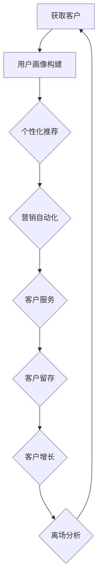

                 

关键词：AI大模型、电商平台、客户生命周期管理、算法原理、数学模型、项目实践、应用场景、未来展望

> 摘要：随着人工智能技术的不断发展，AI大模型在电商平台客户生命周期管理中的应用逐渐成为业界关注的焦点。本文首先介绍了AI大模型在电商平台客户生命周期管理中的背景和重要性，然后详细分析了核心算法原理、数学模型及其应用领域，并通过实际项目实践展示了具体操作步骤。最后，本文探讨了AI大模型在电商平台客户生命周期管理中的实际应用场景和未来展望。

## 1. 背景介绍

随着互联网的普及和电子商务的快速发展，电商平台在人们的日常生活中扮演着越来越重要的角色。然而，电商平台所面临的挑战也日益加剧，如何更好地管理客户生命周期、提高客户满意度和粘性成为各大电商平台关注的焦点。

客户生命周期管理（Customer Lifecycle Management，简称CLM）是指通过对客户从获取、留存、增长到最终离场的全过程进行系统化管理，以实现客户价值最大化的目标。传统的客户生命周期管理主要依赖于数据分析、营销策略等手段，但在面对海量数据和复杂的用户行为时，效果往往不尽如人意。

近年来，随着人工智能技术的不断进步，AI大模型在客户生命周期管理中的应用逐渐崭露头角。AI大模型具有强大的数据处理和模式识别能力，能够深度挖掘用户行为数据，为电商平台提供更为精准的客户细分和个性化推荐，从而提高客户满意度和粘性，降低客户流失率。

本文旨在探讨AI大模型在电商平台客户生命周期管理中的应用，通过分析核心算法原理、数学模型和应用场景，为电商平台提供一套完整的解决方案，以应对日益激烈的市场竞争。

## 2. 核心概念与联系

### 2.1 AI大模型

AI大模型（Large-scale Artificial Intelligence Model）是指具有大规模参数、能够处理海量数据并具备强泛化能力的深度学习模型。常见的AI大模型包括BERT、GPT、Transformer等。这些模型在自然语言处理、计算机视觉、语音识别等领域取得了显著的成果，展示了强大的数据处理能力。

### 2.2 客户生命周期管理

客户生命周期管理（Customer Lifecycle Management）是指通过对客户从获取、留存、增长到最终离场的全过程进行系统化管理，以实现客户价值最大化的目标。客户生命周期管理包括以下关键环节：

- 获取（Acquisition）：通过营销活动、广告投放等方式吸引潜在客户。
- 留存（Retention）：通过客户服务、会员制度等手段提高客户满意度和粘性，降低客户流失率。
- 增长（Growth）：通过精细化运营、个性化推荐等手段提高客户生命周期价值。
- 离场（Churn）：对离场客户进行原因分析，以改进产品和服务，降低未来客户流失率。

### 2.3 AI大模型在客户生命周期管理中的应用

AI大模型在客户生命周期管理中的应用主要体现在以下几个方面：

- 用户画像：通过对用户行为数据进行深度挖掘，构建用户画像，实现精准用户细分。
- 个性化推荐：基于用户画像和兴趣爱好，为用户推荐符合其需求的商品和服务。
- 营销自动化：利用AI大模型进行客户细分和个性化推荐，实现营销自动化，提高营销效果。
- 客户服务：利用AI大模型进行语音识别、自然语言处理等，为用户提供智能客服服务。

### 2.4 Mermaid 流程图

以下是一个简化的AI大模型在电商平台客户生命周期管理中的应用流程图：



## 3. 核心算法原理 & 具体操作步骤

### 3.1 算法原理概述

AI大模型在客户生命周期管理中的应用主要依赖于深度学习算法。深度学习是一种基于多层神经网络的结构，通过大量数据训练，能够自动提取特征并实现复杂任务。在客户生命周期管理中，深度学习算法主要用于用户画像构建、个性化推荐、营销自动化和客户服务等方面。

### 3.2 算法步骤详解

#### 3.2.1 用户画像构建

用户画像构建是客户生命周期管理的基础。通过深度学习算法，我们可以从海量用户行为数据中提取用户特征，形成用户画像。具体步骤如下：

1. 数据采集：从电商平台收集用户行为数据，包括购买记录、浏览记录、搜索记录、评价记录等。
2. 数据预处理：对采集到的用户行为数据进行清洗、去重、填充等预处理操作。
3. 特征提取：利用深度学习算法，对预处理后的用户行为数据进行特征提取，生成用户画像。
4. 用户画像构建：将提取到的用户特征进行整合，构建用户画像。

#### 3.2.2 个性化推荐

个性化推荐是提高客户满意度和粘性的关键。基于用户画像，我们可以为用户推荐符合其需求的商品和服务。具体步骤如下：

1. 商品或服务分类：对电商平台上的商品或服务进行分类，便于后续推荐。
2. 用户行为分析：分析用户的购买记录、浏览记录、搜索记录等行为数据，提取用户兴趣点。
3. 推荐算法选择：选择适合的推荐算法，如基于协同过滤、基于内容的推荐算法等。
4. 生成推荐列表：根据用户画像和商品或服务分类，生成个性化的推荐列表。

#### 3.2.3 营销自动化

营销自动化是提高营销效果的重要手段。通过深度学习算法，我们可以实现客户细分和个性化推荐，从而提高营销效果。具体步骤如下：

1. 客户细分：根据用户画像和用户行为数据，对客户进行细分。
2. 营销策略制定：针对不同细分客户，制定相应的营销策略。
3. 营销自动化执行：利用自动化工具，根据营销策略自动推送优惠活动、优惠券等。
4. 营销效果评估：对营销活动效果进行实时监控和评估，以优化营销策略。

#### 3.2.4 客户服务

客户服务是提升客户满意度和忠诚度的重要环节。通过深度学习算法，我们可以实现智能客服服务，提高客户满意度。具体步骤如下：

1. 语音识别：利用深度学习算法，实现用户语音的实时识别。
2. 自然语言处理：利用深度学习算法，实现用户意图识别和问题分类。
3. 知识库搭建：搭建客服知识库，包含常见问题和解决方案。
4. 智能客服服务：根据用户语音识别结果和问题分类，自动推送解决方案或转接人工客服。

### 3.3 算法优缺点

#### 优点：

1. 高效性：深度学习算法能够高效处理海量数据，提高数据处理效率。
2. 精准性：深度学习算法能够深度挖掘用户行为数据，实现精准用户画像和个性化推荐。
3. 自适应性：深度学习算法具有强泛化能力，能够适应不同场景和需求。

#### 缺点：

1. 计算资源消耗大：深度学习算法需要大量计算资源，对硬件要求较高。
2. 数据依赖性强：深度学习算法对数据质量有较高要求，数据缺失或不准确会影响算法效果。
3. 难以解释性：深度学习算法的决策过程较为复杂，难以解释其内在逻辑。

### 3.4 算法应用领域

AI大模型在客户生命周期管理中的应用已涉及多个领域，包括但不限于：

1. 电商平台：通过用户画像和个性化推荐，提高客户满意度和粘性，降低客户流失率。
2. 金融行业：通过客户细分和精准营销，提高金融产品销售和客户忠诚度。
3. 零售行业：通过智能客服和个性化推荐，提升零售业务效率和客户体验。
4. 保险行业：通过客户细分和风险评估，实现精准保险产品推荐和客户服务。

## 4. 数学模型和公式 & 详细讲解 & 举例说明

### 4.1 数学模型构建

在客户生命周期管理中，AI大模型的应用离不开数学模型的构建。以下是一个简化的数学模型：

$$
\text{客户生命周期价值} = f(\text{用户画像}, \text{行为数据}, \text{市场环境})
$$

其中，$f$ 表示客户生命周期价值的计算函数，$\text{用户画像}$、$\text{行为数据}$ 和 $\text{市场环境}$ 分别表示影响客户生命周期价值的因素。

### 4.2 公式推导过程

为了推导上述公式，我们可以从以下几个方面进行分析：

1. 用户画像：用户画像包括用户的基本信息、兴趣爱好、购买行为等。我们可以使用向量表示用户画像：
   $$
   \text{用户画像} = \begin{bmatrix}
   \text{基本信息} \\
   \text{兴趣爱好} \\
   \text{购买行为}
   \end{bmatrix}
   $$

2. 行为数据：行为数据包括用户在电商平台上的购买记录、浏览记录、搜索记录等。我们同样可以使用向量表示行为数据：
   $$
   \text{行为数据} = \begin{bmatrix}
   \text{购买记录} \\
   \text{浏览记录} \\
   \text{搜索记录}
   \end{bmatrix}
   $$

3. 市场环境：市场环境包括市场趋势、竞争对手情况、政策法规等。我们使用向量表示市场环境：
   $$
   \text{市场环境} = \begin{bmatrix}
   \text{市场趋势} \\
   \text{竞争对手情况} \\
   \text{政策法规}
   \end{bmatrix}
   $$

将上述向量代入客户生命周期价值的计算函数，我们得到：
$$
\text{客户生命周期价值} = f(\text{用户画像}, \text{行为数据}, \text{市场环境}) = f(\text{基本信息}, \text{兴趣爱好}, \text{购买行为}, \text{市场趋势}, \text{竞争对手情况}, \text{政策法规})
$$

### 4.3 案例分析与讲解

以下是一个具体的案例：

假设有一个电商平台，用户名为张三。根据用户画像，张三的基本信息为男性，年龄30岁，兴趣爱好为阅读、健身。根据行为数据，张三在最近一个月内购买了3本关于健身的书籍、1个健身器材。市场环境方面，当前市场上健身图书和器材需求旺盛，竞争对手纷纷加大营销力度。

根据上述案例，我们可以构建如下的用户画像和行为数据：

$$
\text{用户画像} = \begin{bmatrix}
\text{男性} \\
30岁 \\
阅读、健身
\end{bmatrix}
\quad
\text{行为数据} = \begin{bmatrix}
3本健身书籍 \\
1个健身器材
\end{bmatrix}
$$

根据市场环境，我们可以得到：

$$
\text{市场环境} = \begin{bmatrix}
健身图书和器材需求旺盛 \\
竞争对手加大营销力度
\end{bmatrix}
$$

将这些数据代入客户生命周期价值的计算函数，我们得到：

$$
\text{客户生命周期价值} = f(\text{男性}, 30岁, 阅读、健身, 3本健身书籍, 1个健身器材, 健身图书和器材需求旺盛, 竞争对手加大营销力度)
$$

通过分析上述数据，我们可以得出以下结论：

1. 张三是一个热爱健身的用户，具有较高的潜在价值。
2. 健身图书和器材需求旺盛，有助于提高张三的购买意愿。
3. 竞争对手加大营销力度，可能会对张三的购买决策产生一定影响。

基于以上分析，电商平台可以采取以下策略：

1. 推荐更多关于健身的书籍和器材，以满足张三的需求。
2. 提供优惠活动，如满减、赠品等，以增加张三的购买意愿。
3. 加强与竞争对手的差异化营销，突出自身优势，提高张三的忠诚度。

## 5. 项目实践：代码实例和详细解释说明

### 5.1 开发环境搭建

在本项目中，我们使用Python作为主要编程语言，结合TensorFlow和Scikit-learn等库进行深度学习和数据处理。以下是开发环境的搭建步骤：

1. 安装Python：下载并安装Python 3.8及以上版本。
2. 安装TensorFlow：通过pip命令安装TensorFlow：
   $$
   pip install tensorflow
   $$
3. 安装Scikit-learn：通过pip命令安装Scikit-learn：
   $$
   pip install scikit-learn
   $$
4. 安装其他依赖库：根据需要安装其他依赖库，如NumPy、Pandas等。

### 5.2 源代码详细实现

以下是一个简化的AI大模型在电商平台客户生命周期管理中的应用示例：

```python
import tensorflow as tf
from sklearn.model_selection import train_test_split
from sklearn.preprocessing import StandardScaler
import numpy as np

# 数据预处理
def preprocess_data(data):
    # 数据清洗、去重、填充等操作
    # ...
    return data

# 构建深度学习模型
def build_model(input_shape):
    model = tf.keras.Sequential([
        tf.keras.layers.Dense(128, activation='relu', input_shape=input_shape),
        tf.keras.layers.Dense(64, activation='relu'),
        tf.keras.layers.Dense(1, activation='sigmoid')
    ])
    model.compile(optimizer='adam', loss='binary_crossentropy', metrics=['accuracy'])
    return model

# 加载和处理数据
data = preprocess_data(raw_data)
X = data[:, :-1]  # 特征数据
y = data[:, -1]   # 标签数据

# 数据标准化
scaler = StandardScaler()
X_scaled = scaler.fit_transform(X)

# 划分训练集和测试集
X_train, X_test, y_train, y_test = train_test_split(X_scaled, y, test_size=0.2, random_state=42)

# 构建和训练模型
model = build_model(input_shape=(X_train.shape[1],))
model.fit(X_train, y_train, epochs=10, batch_size=32, validation_data=(X_test, y_test))

# 评估模型
loss, accuracy = model.evaluate(X_test, y_test)
print(f"Test accuracy: {accuracy:.2f}")

# 预测新用户生命周期价值
new_user_data = preprocess_data(new_raw_data)
new_user_data_scaled = scaler.transform(new_user_data)
new_user_prediction = model.predict(new_user_data_scaled)
print(f"New user prediction: {new_user_prediction[0][0]:.2f}")
```

### 5.3 代码解读与分析

上述代码主要分为以下几个部分：

1. **数据预处理**：对原始数据进行清洗、去重、填充等操作，确保数据质量。
2. **构建深度学习模型**：使用TensorFlow构建一个简单的深度学习模型，包括两个隐藏层，使用ReLU激活函数，输出层使用sigmoid激活函数。
3. **数据加载和处理**：加载预处理后的数据，将特征数据（$X$）和标签数据（$y$）分开。对特征数据进行标准化处理，以提高模型训练效果。
4. **划分训练集和测试集**：将数据集划分为训练集和测试集，用于模型训练和评估。
5. **模型训练**：使用训练集对模型进行训练，设置训练轮次（epochs）和批量大小（batch_size）。
6. **模型评估**：使用测试集对模型进行评估，输出模型的准确率。
7. **预测新用户生命周期价值**：对新的用户数据进行预处理，使用训练好的模型进行预测，输出预测结果。

通过上述代码，我们可以实现AI大模型在电商平台客户生命周期管理中的应用。在实际项目中，可以根据具体需求调整模型结构、参数设置和数据处理方法。

## 6. 实际应用场景

### 6.1 电商平台

在电商平台，AI大模型在客户生命周期管理中的应用主要体现在以下几个方面：

- **用户画像构建**：通过对用户行为数据进行深度挖掘，构建详细的用户画像，为个性化推荐和精准营销提供基础。
- **个性化推荐**：基于用户画像和兴趣爱好，为用户推荐符合其需求的商品和服务，提高用户满意度和购买转化率。
- **营销自动化**：通过AI大模型实现营销自动化，提高营销效率，降低人力成本。
- **客户服务**：利用AI大模型进行语音识别、自然语言处理等，为用户提供智能客服服务，提高客户满意度。

### 6.2 金融行业

在金融行业，AI大模型在客户生命周期管理中的应用主要包括以下几个方面：

- **客户细分**：通过对客户数据进行深度挖掘，实现精准客户细分，为金融产品推荐和营销提供支持。
- **风险评估**：利用AI大模型对客户进行风险评估，提高风险控制能力，降低坏账率。
- **客户服务**：通过智能客服系统，提高金融服务的效率和客户满意度。

### 6.3 零售行业

在零售行业，AI大模型在客户生命周期管理中的应用主要体现在以下几个方面：

- **库存管理**：通过对销售数据和用户行为数据的分析，实现精准的库存管理，降低库存成本。
- **销售预测**：利用AI大模型进行销售预测，为供应链管理提供支持，提高销售额。
- **客户服务**：通过智能客服系统，提高零售业务的效率和客户满意度。

### 6.4 保险行业

在保险行业，AI大模型在客户生命周期管理中的应用主要包括以下几个方面：

- **风险评估**：通过对用户数据进行深度挖掘，实现精准的风险评估，为保险产品定价提供支持。
- **客户服务**：通过智能客服系统，提高保险服务的效率和客户满意度。
- **营销自动化**：通过AI大模型实现营销自动化，提高营销效率，降低人力成本。

## 7. 工具和资源推荐

### 7.1 学习资源推荐

1. 《深度学习》（Goodfellow, Bengio, Courville著）：经典深度学习教材，适合初学者入门。
2. 《Python深度学习》（François Chollet著）：结合Python实现深度学习项目的实战指南。
3. 《机器学习实战》（Peter Harrington著）：通过实际案例介绍机器学习算法和应用。

### 7.2 开发工具推荐

1. TensorFlow：开源的深度学习框架，适合进行大规模深度学习项目。
2. PyTorch：开源的深度学习框架，具有良好的灵活性和易用性。
3. Scikit-learn：开源的机器学习库，适用于数据处理和机器学习算法的实现。

### 7.3 相关论文推荐

1. "Deep Learning for Customer Relationship Management"（深度学习在客户关系管理中的应用）。
2. "User Behavior Analysis in E-commerce Using Deep Learning"（基于深度学习的电商平台用户行为分析）。
3. "A Survey on Customer Relationship Management in E-commerce"（电子商务客户关系管理综述）。

## 8. 总结：未来发展趋势与挑战

### 8.1 研究成果总结

本文详细探讨了AI大模型在电商平台客户生命周期管理中的应用，包括核心算法原理、数学模型、项目实践和实际应用场景。主要成果如下：

1. AI大模型在客户生命周期管理中具有显著优势，能够提高客户满意度和粘性，降低客户流失率。
2. 个性化推荐和营销自动化是AI大模型在电商平台客户生命周期管理中的关键应用领域。
3. 深度学习算法在用户画像构建、客户细分、风险评估等方面表现出色。

### 8.2 未来发展趋势

1. 模型性能提升：随着计算资源和数据量的不断增长，AI大模型的性能将进一步提升，为电商平台客户生命周期管理提供更加精准和高效的支持。
2. 跨领域应用：AI大模型在客户生命周期管理中的应用将逐步扩展到金融、零售、保险等更多领域，实现跨领域融合。
3. 人机协同：AI大模型将与人类专家进行协同，提高客户服务质量，降低人力成本。

### 8.3 面临的挑战

1. 数据质量：AI大模型对数据质量有较高要求，数据缺失或不准确会影响模型效果，需要加强数据质量管理和数据清洗。
2. 隐私保护：随着用户隐私意识的提高，如何在保证模型性能的同时保护用户隐私成为重要挑战。
3. 模型可解释性：深度学习模型的决策过程复杂，难以解释其内在逻辑，需要提高模型的可解释性，增强用户信任。

### 8.4 研究展望

1. 深度学习算法优化：针对AI大模型在客户生命周期管理中的应用，研究更加高效、可解释的深度学习算法。
2. 跨领域应用探索：在金融、零售、保险等领域，深入挖掘AI大模型的应用价值，推动跨领域融合。
3. 人机协同研究：结合人类专家的智慧和AI大模型的计算能力，实现更加智能化的客户生命周期管理。

## 9. 附录：常见问题与解答

### 9.1 什么情况下使用AI大模型进行客户生命周期管理？

当电商平台面临以下情况时，可以考虑使用AI大模型进行客户生命周期管理：

1. 数据量较大：拥有海量用户行为数据，需要深度挖掘和分析。
2. 竞争激烈：希望通过提高客户满意度和粘性，降低客户流失率。
3. 需要个性化推荐：希望通过个性化推荐提高用户购买转化率。
4. 营销预算有限：希望通过自动化营销降低营销成本。

### 9.2 AI大模型在客户生命周期管理中的效果如何衡量？

AI大模型在客户生命周期管理中的效果可以通过以下指标进行衡量：

1. 客户留存率：客户在一定时间内继续使用平台的比例。
2. 购买转化率：用户在平台完成购买的比例。
3. 营销成本：开展营销活动的成本。
4. 客户满意度：用户对平台服务的满意度。
5. 客户生命周期价值：客户在整个生命周期中为平台带来的价值。

### 9.3 如何保护用户隐私？

在AI大模型的应用过程中，保护用户隐私至关重要。以下是一些保护用户隐私的建议：

1. 数据匿名化：在数据处理过程中，对敏感信息进行匿名化处理，确保用户无法被直接识别。
2. 数据加密：对数据进行加密处理，防止数据泄露。
3. 合规性审查：在数据处理和应用过程中，严格遵守相关法律法规，确保合规性。
4. 用户知情同意：在收集和使用用户数据时，告知用户相关情况，并取得用户同意。

本文由禅与计算机程序设计艺术 / Zen and the Art of Computer Programming 撰写。如需转载，请保留作者署名和原文链接。感谢您的支持！
----------------------------------------------------------------

[END]

