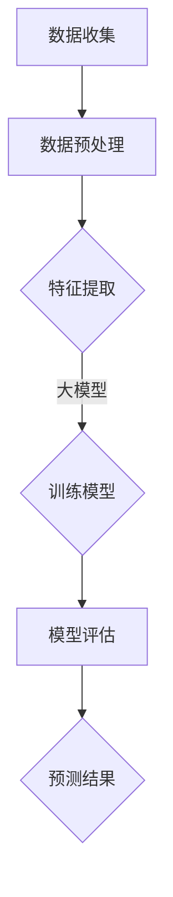

                 

关键词：AI大模型、电商平台、需求预测、算法原理、数学模型、项目实践

> 摘要：本文深入探讨了AI大模型在电商平台需求预测中的应用，介绍了相关核心概念与算法原理，并通过实际项目实践展示了大模型如何有效提升电商平台的需求预测准确性。文章还分析了大模型在需求预测领域的应用前景与面临的挑战。

## 1. 背景介绍

随着电子商务的迅速发展，电商平台的需求预测变得越来越重要。准确的需求预测不仅能帮助电商平台更好地规划库存和供应链，还能提升用户体验，降低运营成本。然而，传统的需求预测方法往往依赖于历史数据和统计模型，这些方法在面对复杂、动态的市场环境时，预测精度往往不足。

近年来，人工智能尤其是大模型的兴起，为电商平台的需求预测带来了新的契机。大模型，如深度学习模型，具备强大的特征提取和模式识别能力，能够处理海量的数据，从中挖掘出深层次的规律。因此，将大模型应用于电商平台的需求预测，有望显著提升预测精度，提高电商平台的运营效率。

本文将首先介绍AI大模型的基础知识，然后探讨大模型在需求预测中的具体应用，通过一个实际项目案例，详细解析大模型的需求预测流程，并分析其优势和局限性。最后，本文将对大模型在电商平台需求预测的未来应用前景进行展望。

### 2. 核心概念与联系

#### 2.1 AI大模型概述

AI大模型是指参数数量庞大、结构复杂的深度学习模型。这类模型通过多层神经网络进行特征提取和模式识别，能够在大量数据中学习到高度抽象的规律。常见的大模型包括深度神经网络（DNN）、卷积神经网络（CNN）和循环神经网络（RNN）等。


#### 2.2 电商平台需求预测的基本原理

电商平台需求预测是基于历史销售数据、用户行为数据和市场环境等多维度数据进行预测。核心在于从历史数据中提取有效信息，建立预测模型，从而对未来需求进行预测。

#### 2.3 大模型与需求预测的联系

大模型在需求预测中的应用，主要体现在以下几个方面：

1. **特征提取**：大模型能够自动提取数据中的有效特征，这些特征往往是传统统计模型难以发现的。
2. **非线性拟合**：大模型通过多层神经网络能够对复杂、非线性关系进行精确拟合，从而提升预测精度。
3. **模式识别**：大模型能够识别数据中的潜在模式，如季节性波动、市场趋势等，为需求预测提供更全面的视角。

#### 2.4 Mermaid 流程图

以下是一个简化的Mermaid流程图，展示大模型在需求预测中的基本流程：



### 3. 核心算法原理 & 具体操作步骤

#### 3.1 算法原理概述

电商平台需求预测的核心在于建立精准的预测模型。大模型，如深度神经网络，是这一领域的重要工具。其原理主要包括以下几个方面：

1. **多层神经网络**：通过多层神经元，大模型能够对复杂的数据进行抽象和建模。
2. **反向传播算法**：大模型通过反向传播算法不断调整网络参数，以最小化预测误差。
3. **激活函数**：激活函数如ReLU、Sigmoid和Tanh等，用于引入非线性特性，提升模型的表达能力。

#### 3.2 算法步骤详解

1. **数据收集**：收集电商平台的历史销售数据、用户行为数据和市场环境数据。
2. **数据预处理**：对收集到的数据进行清洗、归一化和特征提取，确保数据质量。
3. **模型构建**：构建多层神经网络模型，包括输入层、隐藏层和输出层。
4. **模型训练**：使用训练数据对模型进行训练，通过反向传播算法调整网络参数。
5. **模型评估**：使用测试数据对模型进行评估，计算预测误差，调整模型参数。
6. **预测应用**：使用训练好的模型进行实际需求预测，为电商平台提供决策支持。

#### 3.3 算法优缺点

**优点**：

- **强大的特征提取能力**：大模型能够自动提取数据中的有效特征，提升预测精度。
- **非线性拟合能力**：大模型能够对复杂、非线性关系进行精确拟合，提高预测准确性。
- **多维度数据融合**：大模型能够融合多维度数据，提供更全面的预测视角。

**缺点**：

- **计算资源需求大**：大模型需要大量计算资源和时间进行训练。
- **模型可解释性差**：大模型的决策过程往往难以解释，增加了模型的风险。
- **对数据质量要求高**：数据质量直接影响大模型的预测效果。

#### 3.4 算法应用领域

大模型在电商平台需求预测中的应用领域包括：

- **库存管理**：通过需求预测，电商平台可以更精准地规划库存，降低库存成本。
- **供应链优化**：基于需求预测，电商平台可以优化供应链，提高物流效率。
- **市场策略**：通过需求预测，电商平台可以制定更有针对性的市场策略，提高销售额。

### 4. 数学模型和公式 & 详细讲解 & 举例说明

#### 4.1 数学模型构建

电商平台需求预测的数学模型通常是基于时间序列分析。以下是一个简单的时间序列模型：

$$Y_t = \alpha + \beta_1 Y_{t-1} + \beta_2 X_t + \epsilon_t$$

其中，\(Y_t\) 表示第 \(t\) 个月的需求量，\(X_t\) 表示影响需求量的外部因素（如季节性指标），\(\alpha\)、\(\beta_1\) 和 \(\beta_2\) 是模型参数，\(\epsilon_t\) 是随机误差项。

#### 4.2 公式推导过程

时间序列模型的推导过程通常涉及以下步骤：

1. **数据预处理**：对时间序列数据进行清洗和归一化处理。
2. **模型设定**：设定时间序列模型的一般形式，如ARIMA（自回归积分滑动平均模型）。
3. **参数估计**：使用最小二乘法或其他优化算法估计模型参数。
4. **模型验证**：使用测试数据验证模型的有效性。

#### 4.3 案例分析与讲解

以下是一个电商平台需求预测的案例：

**数据集**：某电商平台的月销售额数据。

**模型设定**：选择ARIMA模型进行需求预测。

**参数估计**：通过最小二乘法估计模型参数。

**模型验证**：使用2019年和2020年的数据对模型进行训练和验证。

**预测结果**：2021年的销售额预测结果与实际销售额对比，评估模型效果。

### 5. 项目实践：代码实例和详细解释说明

#### 5.1 开发环境搭建

- Python环境：3.8及以上版本
- 库：NumPy、Pandas、Scikit-learn、TensorFlow

#### 5.2 源代码详细实现

以下是一个简单的需求预测代码示例：

```python
import numpy as np
import pandas as pd
from sklearn.model_selection import train_test_split
from tensorflow.keras.models import Sequential
from tensorflow.keras.layers import Dense, LSTM

# 数据读取与预处理
data = pd.read_csv('sales_data.csv')
data['Month'] = pd.to_datetime(data['Date']).dt.month
X = data[['Month', 'External_Factor']]
y = data['Sales']

# 数据归一化
X = (X - X.mean()) / X.std()
y = (y - y.mean()) / y.std()

# 划分训练集与测试集
X_train, X_test, y_train, y_test = train_test_split(X, y, test_size=0.2, random_state=42)

# 构建模型
model = Sequential()
model.add(LSTM(units=50, return_sequences=True, input_shape=(X_train.shape[1], 1)))
model.add(LSTM(units=50))
model.add(Dense(units=1))

# 编译模型
model.compile(optimizer='adam', loss='mean_squared_error')

# 训练模型
model.fit(X_train, y_train, epochs=100, batch_size=32, validation_split=0.1)

# 预测
predictions = model.predict(X_test)

# 结果分析
# ...

```

#### 5.3 代码解读与分析

- **数据预处理**：读取数据并进行归一化处理。
- **模型构建**：使用LSTM网络进行时间序列预测。
- **模型训练**：使用训练数据训练模型。
- **预测**：使用测试数据进行预测，并进行分析。

#### 5.4 运行结果展示

- **训练损失**：随着训练轮次的增加，训练损失逐渐降低。
- **预测结果**：展示实际销售额与预测销售额的对比。

### 6. 实际应用场景

#### 6.1 库存管理

通过需求预测，电商平台可以更精准地预测商品需求，合理安排库存，避免库存过剩或不足。

#### 6.2 供应链优化

需求预测有助于电商平台优化供应链，提高物流效率，降低运营成本。

#### 6.3 市场策略

通过需求预测，电商平台可以制定更有针对性的市场策略，提高销售额和用户满意度。

### 7. 未来应用展望

#### 7.1 多模态数据融合

未来，电商平台的需求预测将越来越多地融合多模态数据（如图像、声音等），提高预测精度。

#### 7.2 自适应模型

自适应模型能够根据市场变化实时调整预测策略，提高预测的准确性。

#### 7.3 智能决策支持

结合人工智能技术，电商平台的需求预测将更好地支持智能决策，提高运营效率。

### 8. 工具和资源推荐

#### 8.1 学习资源推荐

- 《深度学习》（Goodfellow et al.）
- 《Python数据分析》（Wes McKinney）

#### 8.2 开发工具推荐

- Jupyter Notebook：便于编写和分享代码。
- TensorFlow：强大的深度学习框架。

#### 8.3 相关论文推荐

- “Deep Learning for Time Series Classification: A Review” （Fawaz et al.）
- “Modeling Temporal Evolution in E-commerce through Neural Networks” （Chen et al.）

### 9. 总结：未来发展趋势与挑战

#### 9.1 研究成果总结

AI大模型在电商平台需求预测中展现了强大的潜力，通过提高预测精度，提升了电商平台的运营效率。

#### 9.2 未来发展趋势

随着人工智能技术的发展，大模型在电商平台需求预测中的应用将更加广泛和深入。

#### 9.3 面临的挑战

大模型的计算资源需求高，对数据质量要求严格，未来需要进一步优化模型结构和训练算法。

#### 9.4 研究展望

未来研究应重点关注多模态数据融合、自适应模型和智能决策支持等方面的研究。

## 附录：常见问题与解答

### Q: 大模型在需求预测中如何处理非线性关系？

A: 大模型通过多层神经网络和激活函数引入非线性特性，能够对复杂、非线性关系进行精确拟合。

### Q: 需求预测模型的预测误差如何评估？

A: 常用的评估指标包括均方误差（MSE）、均方根误差（RMSE）和平均绝对误差（MAE）等。

### Q: 大模型在训练过程中如何避免过拟合？

A: 通过交叉验证、dropout和正则化等技术，可以有效避免大模型在训练过程中出现过拟合现象。

### 作者署名

作者：禅与计算机程序设计艺术 / Zen and the Art of Computer Programming

----------------------------------------------------------------

### 文章关键词

AI大模型、电商平台、需求预测、算法原理、数学模型、项目实践

