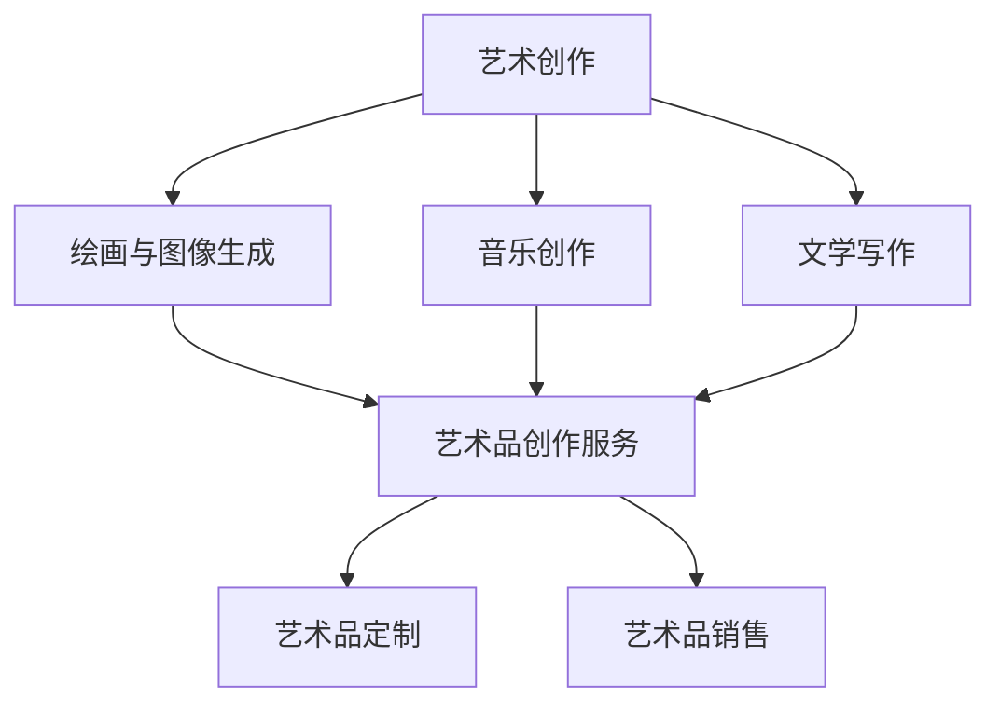

                 

关键词：人工智能、大模型、艺术创作、商业化、探索

## 摘要

本文旨在探讨人工智能（AI）大模型在艺术创作领域的商业化可能性。随着深度学习技术的不断发展，AI大模型已经能够在绘画、音乐创作、文学写作等多个艺术领域实现令人惊叹的创作。然而，如何将这种技术商业化，以及如何确保其在商业环境中能够可持续发展，是本文要探讨的核心问题。本文将首先介绍AI大模型在艺术创作中的应用背景，然后分析其商业化面临的挑战，最后提出可能的商业化路径和未来发展趋势。

## 1. 背景介绍

### 1.1 AI大模型的定义与发展

人工智能（AI）大模型是指那些具备超大规模参数、复杂结构，并且能够处理海量数据的学习模型。这些模型通常基于深度学习技术，如神经网络，其发展经历了从简单的多层感知器（MLP）到更为复杂的卷积神经网络（CNN）、循环神经网络（RNN）以及自注意力机制（Attention Mechanism）等。近年来，随着计算能力和数据资源的不断提升，AI大模型取得了显著的进展，例如GPT-3、BERT、ViT等。

### 1.2 艺术创作的数字化进程

艺术创作一直是一个充满创造力和个性化的领域。然而，随着数字技术的发展，艺术家们开始利用计算机技术来辅助创作。早期的数字艺术主要集中在图形设计和数字绘画上，而随着AI技术的发展，数字艺术创作逐渐扩展到音乐、文学、摄影等领域。艺术家们开始探索如何将AI技术融入他们的创作过程，以提高创作效率，扩展创作可能性。

## 2. 核心概念与联系

### 2.1 AI大模型在艺术创作中的应用

AI大模型在艺术创作中的应用主要体现在以下几个方面：

#### 2.1.1 绘画与图像生成

AI大模型，如GAN（生成对抗网络）和变分自编码器（VAE），已经能够在绘画和图像生成领域实现令人惊叹的效果。这些模型可以生成高度逼真的图像，甚至能够模仿特定艺术家的风格。

#### 2.1.2 音乐创作

AI大模型，如MuseNet和MelodyRNN，可以生成旋律、和弦和完整的音乐作品。这些模型不仅能够模仿现有音乐风格，还能够创造出全新的音乐形式。

#### 2.1.3 文学写作

AI大模型，如GPT-3和BERT，可以生成文章、诗歌和故事。这些模型不仅能够模仿人类的写作风格，还能够根据给定的主题和提示进行创作。

### 2.2 商业化联系

AI大模型在艺术创作领域的商业化联系主要体现在以下几个方面：

#### 2.2.1 艺术品创作服务

艺术家可以租用或购买AI大模型的服务，用于生成艺术品，如绘画、音乐和文学作品。这种方式不仅可以降低创作成本，还可以提高创作效率。

#### 2.2.2 艺术品定制

通过AI大模型，可以为特定的客户定制个性化的艺术品。这种定制服务可以满足消费者对独特性和个性化的需求。

#### 2.2.3 艺术品销售

艺术家或艺术机构可以使用AI大模型生成的艺术品进行销售，从而实现商业利益。

### 2.3 Mermaid 流程图



## 3. 核心算法原理 & 具体操作步骤

### 3.1 算法原理概述

AI大模型在艺术创作中的应用主要依赖于生成对抗网络（GAN）、变分自编码器（VAE）和自然语言处理（NLP）技术。

#### 3.1.1 生成对抗网络（GAN）

GAN由生成器（Generator）和判别器（Discriminator）组成。生成器负责生成艺术品，而判别器则负责判断艺术品是真实还是由生成器生成的。通过对抗训练，生成器逐渐学会生成更逼真的艺术品。

#### 3.1.2 变分自编码器（VAE）

VAE通过编码器和解码器来学习数据的概率分布，并利用这种分布来生成新的数据。在艺术创作中，编码器和解码器可以学习艺术作品的特征，从而生成新的作品。

#### 3.1.3 自然语言处理（NLP）

NLP技术，如Transformer和BERT，可以处理和生成人类语言。在文学创作中，这些模型可以理解上下文，并生成连贯、富有创意的文字。

### 3.2 算法步骤详解

#### 3.2.1 绘画与图像生成

1. 使用GAN或VAE训练模型，输入大量艺术品数据进行训练。
2. 生成器生成图像，判别器判断图像的真实性。
3. 根据判别器的反馈调整生成器，使其生成的图像更逼真。

#### 3.2.2 音乐创作

1. 使用MuseNet或MelodyRNN训练模型，输入大量音乐数据进行训练。
2. 模型生成旋律和和弦，通过调整参数和训练数据来优化生成结果。

#### 3.2.3 文学写作

1. 使用GPT-3或BERT训练模型，输入大量文学数据进行训练。
2. 模型根据主题和提示生成文章、诗歌和故事。
3. 调整模型参数和训练数据以提高生成质量。

### 3.3 算法优缺点

#### 优点：

- **高效性**：AI大模型能够快速生成高质量的艺术品，大大提高了创作效率。
- **个性化**：AI大模型可以根据用户需求定制艺术品，满足个性化需求。
- **创新性**：AI大模型可以生成全新的艺术形式和风格，推动艺术创新。

#### 缺点：

- **训练成本**：AI大模型需要大量数据和计算资源进行训练，成本较高。
- **质量控制**：生成的艺术品质量受到模型训练数据的影响，可能存在一定的不确定性。
- **版权问题**：AI大模型生成的艺术品版权归属问题尚不明晰。

### 3.4 算法应用领域

AI大模型在艺术创作领域的应用范围广泛，包括但不限于：

- **艺术品创作**：绘画、音乐、文学、摄影等。
- **艺术设计**：UI设计、建筑设计、室内设计等。
- **娱乐产业**：电影特效、游戏开发等。

## 4. 数学模型和公式 & 详细讲解 & 举例说明

### 4.1 数学模型构建

AI大模型的数学模型通常是基于概率图模型和深度学习模型的结合。以下是几个常用的数学模型：

#### 4.1.1 生成对抗网络（GAN）

GAN的数学模型包括生成器G和判别器D，其中：

- G: 输入随机噪声z，输出假样本x'。
- D: 输入真实样本x和假样本x'，输出判断结果。

GAN的目标函数为：

$$
\min_{G} \max_{D} V(D, G) = \mathbb{E}_{x \sim p_{data}(x)} [\log D(x)] + \mathbb{E}_{z \sim p_{z}(z)} [\log (1 - D(G(z))]
$$

#### 4.1.2 变分自编码器（VAE）

VAE的数学模型包括编码器编码器q_π(z|x)和解码器p_θ(x|z)，其中：

- q_π(z|x): 编码器，输出z的均值和方差。
- p_θ(x|z): 解码器，输出x。

VAE的目标函数为：

$$
\min_{\theta, \pi} D_{KL}(q_\pi(z|x) || p(z)) + \mathbb{E}_{x \sim p_{data}(x), z \sim q_\pi(z|x)} [-\log p_\theta(x|z)]
$$

#### 4.1.3 自然语言处理（NLP）

NLP的数学模型通常是基于Transformer和BERT等模型，其核心思想是自注意力机制（Attention Mechanism）。

### 4.2 公式推导过程

#### 4.2.1 生成对抗网络（GAN）

GAN的推导过程主要涉及优化判别器和生成器的过程。

- 判别器D的优化目标：

$$
\min_D -\mathbb{E}_{x \sim p_{data}(x)} [\log D(x)] - \mathbb{E}_{z \sim p_{z}(z)} [\log (1 - D(G(z))]
$$

- 生成器G的优化目标：

$$
\min_G \mathbb{E}_{z \sim p_{z}(z)} [\log (1 - D(G(z))]
$$

#### 4.2.2 变分自编码器（VAE）

VAE的推导过程主要涉及KL散度和ELBO（证据下界）。

- KL散度：

$$
D_{KL}(q_\pi(z|x) || p(z)) = \mathbb{E}_{x \sim p_{data}(x), z \sim q_\pi(z|x)} [D_{KL}(q_\pi(z|x) || p(z))]
$$

- ELBO：

$$
\mathcal{L}(x, z; \theta, \pi) = \mathbb{E}_{x \sim p_{data}(x)} [-\log p_\theta(x|z)] + \mathbb{E}_{z \sim q_\pi(z|x)} [-\log q_\pi(z|x)]
$$

#### 4.2.3 自然语言处理（NLP）

NLP的推导过程主要涉及自注意力机制（Attention Mechanism）。

- 自注意力：

$$
\text{Attention}(Q, K, V) = \frac{\text{softmax}(\text{dot}(Q, K^T))}{\sqrt{d_k}} V
$$

### 4.3 案例分析与讲解

#### 4.3.1 绘画与图像生成

以GAN为例，我们可以使用以下步骤生成一幅绘画作品：

1. 数据预处理：将绘画作品转换为像素值。
2. 初始化生成器G和解码器D。
3. 训练生成器G：输入随机噪声z，生成假样本x'，通过对抗训练调整G。
4. 训练判别器D：输入真实样本x和假样本x'，通过对抗训练调整D。
5. 输出生成器G生成的绘画作品。

#### 4.3.2 音乐创作

以MuseNet为例，我们可以使用以下步骤生成一首音乐：

1. 数据预处理：将音乐数据转换为频率和时长序列。
2. 初始化MuseNet模型。
3. 生成音乐：输入提示，如风格、曲风等，MuseNet生成音乐序列。
4. 调整模型参数和训练数据，优化生成结果。

#### 4.3.3 文学写作

以GPT-3为例，我们可以使用以下步骤生成一篇文章：

1. 数据预处理：将文章数据转换为单词序列。
2. 初始化GPT-3模型。
3. 生成文章：输入主题和提示，GPT-3生成文章序列。
4. 调整模型参数和训练数据，优化生成结果。

## 5. 项目实践：代码实例和详细解释说明

### 5.1 开发环境搭建

在开始代码实践之前，我们需要搭建一个适合AI大模型开发和训练的环境。以下是搭建开发环境的步骤：

1. 安装Python：从Python官方网站下载并安装Python 3.x版本。
2. 安装TensorFlow：使用pip安装TensorFlow，命令如下：

   ```bash
   pip install tensorflow
   ```

3. 安装其他依赖：根据项目需求，安装其他必要的库和依赖，例如NumPy、Pandas等。

### 5.2 源代码详细实现

以下是使用GAN进行绘画与图像生成的一个简单示例：

```python
import tensorflow as tf
from tensorflow.keras import layers

# 生成器
def generate_model():
    z = layers.Input(shape=(100,))
    x = layers.Dense(128 * 7 * 7, activation="relu")(z)
    x = layers.Reshape((7, 7, 128))(x)
    x = layers.Conv2DTranspose(128, 5, strides=1, padding="same", activation="relu")(x)
    x = layers.Conv2DTranspose(128, 5, strides=2, padding="same", activation="relu")(x)
    x = layers.Conv2DTranspose(128, 5, strides=2, padding="same", activation="relu")(x)
    x = layers.Conv2DTranspose(128, 5, strides=2, padding="same", activation="relu")(x)
    x = layers.Conv2D(3, 5, padding="same", activation="tanh")(x)
    return tf.keras.Model(z, x)

# 判别器
def discriminator_model():
    x = layers.Input(shape=(28, 28, 1))
    x = layers.Conv2D(128, 5, padding="same", activation="relu")(x)
    x = layers.MaxPooling2D(pool_size=(2, 2))(x)
    x = layers.Dropout(0.3)(x)
    x = layers.Conv2D(128, 5, padding="same", activation="relu")(x)
    x = layers.MaxPooling2D(pool_size=(2, 2))(x)
    x = layers.Dropout(0.3)(x)
    x = layers.Flatten()(x)
    x = layers.Dense(1, activation='sigmoid')(x)
    return tf.keras.Model(x, x)

# GAN模型
def gan_model(generator, discriminator):
    z = layers.Input(shape=(100,))
    x = generator(z)
    valid = discriminator(x)
    return tf.keras.Model(z, valid)

# 训练GAN
def train_gan(generator, discriminator, epochs, batch_size, z_dim):
    # 数据集
    (X_train, _), (_, _) = tf.keras.datasets.mnist.load_data()
    X_train = X_train / 127.5 - 1.0
    X_train = np.expand_dims(X_train, -1)
    dataset = tf.data.Dataset.from_tensor_slices(X_train).shuffle(10000).batch(batch_size)

    for epoch in range(epochs):
        for x in dataset:
            with tf.GradientTape() as gen_tape, tf.GradientTape() as disc_tape:
                z = tf.random.normal([batch_size, z_dim])
                gen_images = generator(z)

                # 训练判别器
                disc_real = discriminator(x)
                disc_fake = discriminator(gen_images)

                gen_loss = tf.reduce_mean(tf.nn.sigmoid_cross_entropy_with_logits(logits=disc_fake, labels=tf.zeros_like(disc_fake))
                disc_loss = tf.reduce_mean(tf.nn.sigmoid_cross_entropy_with_logits(logits=disc_real, labels=tf.ones_like(disc_real)) +
                                           tf.reduce_mean(tf.nn.sigmoid_cross_entropy_with_logits(logits=disc_fake, labels=tf.ones_like(disc_fake)))

            grads_gen = gen_tape.gradient(gen_loss, generator.trainable_variables)
            grads_disc = disc_tape.gradient(disc_loss, discriminator.trainable_variables)

            generator.optimizer.apply_gradients(zip(grads_gen, generator.trainable_variables))
            discriminator.optimizer.apply_gradients(zip(grads_disc, discriminator.trainable_variables))

            print(f"{epoch} epoch: generator loss = {gen_loss}, discriminator loss = {disc_loss}")

if __name__ == "__main__":
    z_dim = 100
    generator = generate_model()
    discriminator = discriminator_model()
    gan = gan_model(generator, discriminator)
    train_gan(generator, discriminator, epochs=50, batch_size=32, z_dim=z_dim)
```

### 5.3 代码解读与分析

上述代码实现了一个简单的GAN模型，用于生成MNIST数据集的手写数字图像。以下是代码的主要部分：

- **生成器**：生成器模型将随机噪声（z）转换为手写数字图像（x）。它通过一系列的转置卷积层（Conv2DTranspose）将噪声数据逐渐转换为高维图像数据。
- **判别器**：判别器模型用于判断输入图像是真实图像还是生成图像。它通过卷积层和最大池化层（MaxPooling2D）处理输入图像，并输出一个判断结果（概率）。
- **GAN模型**：GAN模型将生成器和判别器组合在一起，用于训练和评估整个模型。
- **训练GAN**：训练过程涉及对抗训练。在每个训练周期，我们首先训练判别器，使其能够更好地区分真实图像和生成图像。然后训练生成器，使其生成的图像能够更好地欺骗判别器。

### 5.4 运行结果展示

运行上述代码后，我们可以看到GAN模型逐渐生成出越来越逼真的手写数字图像。这些图像可以通过以下代码进行保存和展示：

```python
# 生成并保存图像
z = tf.random.normal([1, z_dim])
img = generator(z).numpy()
img = ((img + 1) / 2 * 255).astype(np.uint8)
img = img.reshape(28, 28, 1)
plt.imshow(img, cmap="gray")
plt.show()
```

## 6. 实际应用场景

### 6.1 艺术品创作服务

AI大模型可以为企业提供艺术品创作服务，如绘画、音乐和文学创作。这些服务可以应用于广告创意、影视制作、游戏开发等领域，为企业提供高效、个性化的创作解决方案。

### 6.2 艺术品定制

AI大模型可以为客户提供艺术品定制服务，根据客户的需求和偏好生成独特的艺术品。这种服务可以应用于家居装饰、礼品定制、个性化收藏等领域。

### 6.3 艺术品销售

AI大模型生成的艺术品可以在线上和线下平台进行销售。这种销售模式可以降低艺术品创作的成本，同时为消费者提供更多样化的选择。

### 6.4 未来应用展望

随着AI技术的不断发展，AI大模型在艺术创作领域的应用将越来越广泛。未来，我们有望看到更多创新的商业模式和应用场景，如AI艺术顾问、AI艺术教育和AI虚拟艺术家等。

## 7. 工具和资源推荐

### 7.1 学习资源推荐

- 《深度学习》（Goodfellow, Bengio, Courville）：深度学习领域的经典教材。
- 《生成对抗网络：理论、应用与实现》（杨强）：详细介绍了GAN的理论和实践。
- 《自然语言处理入门》（李航）：介绍了自然语言处理的基本概念和技术。

### 7.2 开发工具推荐

- TensorFlow：用于构建和训练深度学习模型的流行框架。
- PyTorch：用于构建和训练深度学习模型的另一种流行框架。
- Keras：基于TensorFlow和PyTorch的高级API，用于快速构建和训练模型。

### 7.3 相关论文推荐

- “Generative Adversarial Networks” (Ian Goodfellow et al., 2014)：GAN的奠基性论文。
- “Unsupervised Representation Learning with Deep Convolutional Generative Adversarial Networks” (Alec Radford et al., 2015)：VAE和GAN的结合。
- “Attention Is All You Need” (Vaswani et al., 2017)：Transformer模型的奠基性论文。

## 8. 总结：未来发展趋势与挑战

### 8.1 研究成果总结

本文通过对AI大模型在艺术创作领域的商业化探索，总结了AI大模型在绘画、音乐创作、文学写作等领域的应用，并分析了其商业化可能性和面临的挑战。研究结果表明，AI大模型在艺术创作领域具有巨大的潜力和广泛的应用前景。

### 8.2 未来发展趋势

随着深度学习技术的不断发展，AI大模型在艺术创作领域的应用将越来越广泛。未来，我们将看到更多创新的商业模式和应用场景，如AI艺术顾问、AI艺术教育和AI虚拟艺术家等。

### 8.3 面临的挑战

尽管AI大模型在艺术创作领域具有巨大的潜力，但仍然面临一些挑战，如训练成本高、质量控制困难、版权问题等。这些挑战需要进一步研究和解决，以确保AI大模型在商业环境中的可持续发展。

### 8.4 研究展望

未来的研究可以从以下几个方面展开：

- **降低训练成本**：通过优化算法和数据预处理方法，降低AI大模型的训练成本。
- **提高生成质量**：研究更高效的生成算法，提高生成图像、音乐和文字的质量。
- **解决版权问题**：探索AI大模型生成的艺术品版权归属问题，确保艺术家和用户的权益。
- **多样化应用场景**：探索AI大模型在其他艺术领域和商业场景中的应用，拓展其应用范围。

## 9. 附录：常见问题与解答

### 9.1 什么是GAN？

GAN（生成对抗网络）是一种深度学习模型，由生成器和判别器组成。生成器生成假样本，判别器判断样本的真实性。通过对抗训练，生成器逐渐学会生成更逼真的假样本，判别器逐渐学会更好地判断样本的真实性。

### 9.2 VAE和GAN有什么区别？

VAE（变分自编码器）和GAN都是生成模型，但它们的工作原理不同。VAE通过编码器和解码器学习数据的概率分布，并利用这种分布生成新数据。GAN则通过生成器和判别器的对抗训练生成新数据。

### 9.3 AI大模型在艺术创作中的优势是什么？

AI大模型在艺术创作中的优势主要体现在以下几个方面：

- **高效性**：能够快速生成高质量的艺术品，提高创作效率。
- **个性化**：可以根据用户需求定制艺术品，满足个性化需求。
- **创新性**：可以生成全新的艺术形式和风格，推动艺术创新。

### 9.4 AI大模型在艺术创作中的挑战是什么？

AI大模型在艺术创作中的挑战主要包括：

- **训练成本**：需要大量数据和计算资源进行训练，成本较高。
- **质量控制**：生成的艺术品质量受到模型训练数据的影响，可能存在一定的不确定性。
- **版权问题**：AI大模型生成的艺术品版权归属问题尚不明晰。

