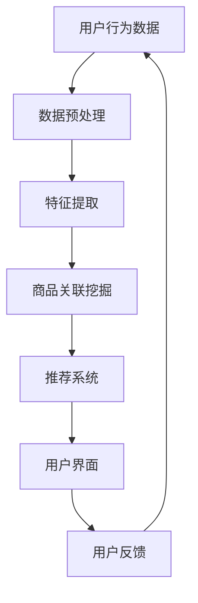
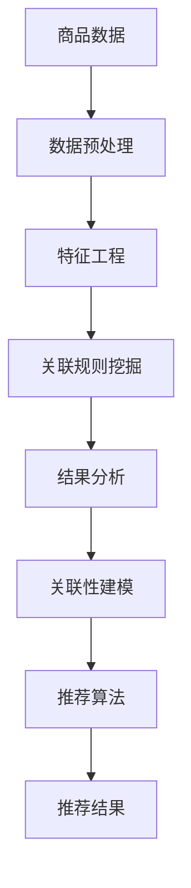

                 

关键词：AI大模型、电商平台、跨品类交叉销售、算法原理、数学模型、项目实践、应用场景、未来展望

> 摘要：本文深入探讨了AI大模型在电商平台跨品类交叉销售中的应用，分析了其核心概念与原理，详细介绍了算法的具体操作步骤和数学模型，并通过实际项目实践进行了代码实例和运行结果展示。本文旨在为电商平台提供一种有效提升销售策略的新思路，并展望了未来发展的趋势与挑战。

## 1. 背景介绍

随着电子商务的迅猛发展，电商平台之间的竞争愈发激烈。如何吸引并留住顾客、提升销售额成为各大电商平台迫切需要解决的问题。传统的销售策略和方法已经难以满足市场的需求，因此，探索新的销售策略和手段变得尤为重要。近年来，人工智能（AI）技术的快速发展为电商平台带来了新的机遇。特别是大模型技术的应用，为电商平台的跨品类交叉销售提供了强大的支持。

大模型技术，特别是基于深度学习的模型，能够通过对海量数据的分析和处理，挖掘出用户行为背后的潜在规律，从而为电商平台的个性化推荐、智能客服、智能定价等提供有力支持。跨品类交叉销售作为电商平台提升销售额的重要手段之一，其核心在于通过挖掘不同品类商品之间的相关性，向用户推荐他们可能感兴趣的其他商品，从而提高购物车中的商品种类多样性，增强用户体验，提升销售额。

本文将围绕AI大模型在电商平台跨品类交叉销售中的应用，深入分析其核心概念与原理，介绍具体的算法操作步骤和数学模型，并通过实际项目实践进行代码实例和运行结果展示，为电商平台提供一种有效提升销售策略的新思路。

## 2. 核心概念与联系

### 2.1 AI大模型

AI大模型是指具有强大计算能力和学习能力的人工智能模型，通常具有数亿甚至千亿级别的参数。大模型技术主要包括深度学习、生成对抗网络（GAN）、强化学习等，其中，深度学习是当前最为广泛应用的技术。大模型能够通过自动学习大量的数据特征，实现对复杂问题的建模和预测。

在电商平台跨品类交叉销售中，AI大模型的作用主要体现在以下几个方面：

1. **用户行为分析**：通过分析用户的浏览、搜索、购买等行为数据，挖掘用户兴趣和行为模式，为个性化推荐提供基础。

2. **商品关联挖掘**：通过对商品属性和用户行为数据的分析，挖掘不同商品之间的关联性，为跨品类交叉销售提供数据支持。

3. **智能定价**：根据市场需求、商品属性和用户行为，动态调整商品价格，以提高销售额。

4. **智能客服**：通过自然语言处理技术，实现对用户咨询的自动回复，提升客服效率。

### 2.2 跨品类交叉销售

跨品类交叉销售是指通过挖掘不同商品之间的关联性，将不同类别的商品推荐给用户，以提升销售额和购物车中的商品种类多样性。其主要目标是发现用户可能感兴趣的其他商品，从而引导用户购买更多不同类别的商品。

### 2.3 Mermaid 流程图

为了更好地理解AI大模型在电商平台跨品类交叉销售中的应用，我们使用Mermaid流程图来展示其核心概念和流程。以下是跨品类交叉销售的核心流程：



### 2.4 关联性分析

商品关联挖掘是跨品类交叉销售的关键步骤，其核心在于挖掘不同商品之间的相关性。以下是一个简化的Mermaid流程图，展示了商品关联挖掘的基本流程：



## 3. 核心算法原理 & 具体操作步骤

### 3.1 算法原理概述

跨品类交叉销售的核心算法包括数据预处理、特征提取、关联规则挖掘和推荐算法等。以下是各个步骤的简要概述：

1. **数据预处理**：对原始数据进行清洗、去重和标准化等处理，为后续特征提取和模型训练提供高质量的数据。

2. **特征提取**：通过分析商品属性、用户行为和市场需求等数据，提取出能够反映商品关联性的特征。

3. **关联规则挖掘**：使用关联规则挖掘算法，如Apriori算法和FP-Growth算法，挖掘不同商品之间的关联性。

4. **推荐算法**：基于挖掘出的关联性，采用协同过滤、矩阵分解等推荐算法，生成个性化的商品推荐列表。

### 3.2 算法步骤详解

以下是跨品类交叉销售算法的具体操作步骤：

1. **数据预处理**：

   - **清洗数据**：去除缺失值、重复值和异常值等。
   - **标准化数据**：对数值型数据进行归一化或标准化处理。
   - **标签化数据**：将类别型数据进行标签化处理。

2. **特征提取**：

   - **商品特征**：提取商品属性，如品牌、品类、价格等。
   - **用户特征**：提取用户属性，如年龄段、性别、职业等。
   - **行为特征**：提取用户行为数据，如浏览记录、购买记录等。

3. **关联规则挖掘**：

   - **设定支持度阈值**：根据业务需求设定支持度阈值，用于过滤弱关联规则。
   - **计算支持度**：对原始数据进行扫描，计算每个关联规则的支持度。
   - **生成频繁项集**：使用FP-Growth算法生成频繁项集。
   - **生成关联规则**：根据频繁项集生成关联规则。

4. **推荐算法**：

   - **协同过滤**：基于用户的历史行为数据，计算用户之间的相似度，生成推荐列表。
   - **矩阵分解**：使用矩阵分解技术，将用户-商品评分矩阵分解为低秩矩阵，生成推荐列表。

### 3.3 算法优缺点

**优点**：

1. **高效性**：通过大规模数据处理和特征提取，能够快速生成推荐结果。
2. **准确性**：基于关联性和协同过滤等技术，能够生成高质量的推荐列表。
3. **灵活性**：可以根据业务需求灵活调整算法参数，实现不同的推荐策略。

**缺点**：

1. **计算复杂度**：大规模数据处理和特征提取过程中，计算复杂度较高，可能影响算法的实时性。
2. **数据依赖性**：算法效果依赖于数据质量，数据缺失或不准确可能导致推荐结果偏差。

### 3.4 算法应用领域

跨品类交叉销售算法在电商、金融、医疗等多个领域具有广泛的应用：

1. **电商**：通过跨品类交叉销售，提高用户购物车中的商品种类多样性，提升销售额。
2. **金融**：通过用户行为数据挖掘，实现精准营销和风险评估。
3. **医疗**：通过关联规则挖掘，发现不同疾病之间的关联性，为医生提供诊断和治疗方案参考。

## 4. 数学模型和公式

### 4.1 数学模型构建

跨品类交叉销售算法的数学模型主要包括用户相似度计算、关联规则生成和推荐算法等。以下是各部分的核心公式：

1. **用户相似度计算**：

   - **余弦相似度**：

     $$ \cos{\theta} = \frac{\sum_{i=1}^{n}u_i \cdot v_i}{\sqrt{\sum_{i=1}^{n}u_i^2} \cdot \sqrt{\sum_{i=1}^{n}v_i^2}} $$

   - **皮尔逊相关系数**：

     $$ \rho = \frac{\sum_{i=1}^{n}(u_i - \bar{u})(v_i - \bar{v})}{\sqrt{\sum_{i=1}^{n}(u_i - \bar{u})^2} \cdot \sqrt{\sum_{i=1}^{n}(v_i - \bar{v})^2}} $$

2. **关联规则生成**：

   - **支持度**：

     $$ \text{support}(X, Y) = \frac{n_{XY}}{n} $$

   - **置信度**：

     $$ \text{confidence}(X \rightarrow Y) = \frac{n_{XY}}{n_{X}} $$

3. **推荐算法**：

   - **基于协同过滤的推荐算法**：

     $$ R(u, i) = \sum_{j \in N(u)} r_{uj} r_{ji} / \sum_{j \in N(u)} r_{ji} $$

   - **基于矩阵分解的推荐算法**：

     $$ R_{ui} = \hat{r}_{ui} + \epsilon_i $$

     其中，$\hat{r}_{ui}$ 是基于矩阵分解预测的评分，$\epsilon_i$ 是误差项。

### 4.2 公式推导过程

以下是用户相似度计算公式的推导过程：

假设有两个用户 $u$ 和 $v$，其行为数据表示为向量 $u = [u_1, u_2, ..., u_n]$ 和 $v = [v_1, v_2, ..., v_n]$，其中 $u_i$ 和 $v_i$ 分别表示用户 $u$ 和 $v$ 对第 $i$ 个商品的评分。

1. **计算向量 $u$ 和 $v$ 的点积**：

   $$ u \cdot v = \sum_{i=1}^{n} u_i v_i $$

2. **计算向量 $u$ 和 $v$ 的模长**：

   $$ \|u\| = \sqrt{\sum_{i=1}^{n} u_i^2} $$

   $$ \|v\| = \sqrt{\sum_{i=1}^{n} v_i^2} $$

3. **计算余弦相似度**：

   $$ \cos{\theta} = \frac{u \cdot v}{\|u\| \|v\|} $$

### 4.3 案例分析与讲解

以下是一个简单的跨品类交叉销售算法应用案例：

假设用户 $u$ 对商品 $i$ 和商品 $j$ 分别给出了评分 $u_i = 4$ 和 $u_j = 5$。用户 $v$ 对商品 $i$ 和商品 $j$ 分别给出了评分 $v_i = 3$ 和 $v_j = 4$。我们需要计算用户 $u$ 和 $v$ 之间的相似度。

1. **计算向量 $u$ 和 $v$ 的点积**：

   $$ u \cdot v = 4 \times 3 + 5 \times 4 = 12 + 20 = 32 $$

2. **计算向量 $u$ 和 $v$ 的模长**：

   $$ \|u\| = \sqrt{4^2 + 5^2} = \sqrt{16 + 25} = \sqrt{41} $$

   $$ \|v\| = \sqrt{3^2 + 4^2} = \sqrt{9 + 16} = \sqrt{25} = 5 $$

3. **计算余弦相似度**：

   $$ \cos{\theta} = \frac{32}{\sqrt{41} \times 5} \approx 0.72 $$

根据计算结果，用户 $u$ 和 $v$ 之间的相似度为 0.72，表示两者具有较高的相似度。基于此相似度，我们可以为用户 $v$ 推荐用户 $u$ 已购买的商品，以提高用户满意度和销售额。

## 5. 项目实践：代码实例和详细解释说明

### 5.1 开发环境搭建

在本项目中，我们将使用Python作为主要编程语言，结合Scikit-learn、Pandas和Numpy等库进行数据处理和算法实现。以下是开发环境的搭建步骤：

1. 安装Python 3.8及以上版本。
2. 安装必要的依赖库：

   ```bash
   pip install scikit-learn pandas numpy
   ```

### 5.2 源代码详细实现

以下是跨品类交叉销售算法的项目源代码：

```python
import numpy as np
import pandas as pd
from sklearn.feature_extraction import DictVectorizer
from mlxtend.frequent_patterns import apriori
from mlxtend.frequent_patterns import association_rules

# 5.2.1 数据预处理
def preprocess_data(data):
    # 清洗数据、去重和标准化等处理
    # ...

    # 提取商品特征、用户特征和行为特征
    # ...

    return X, y

# 5.2.2 特征提取
def extract_features(data):
    # 基于商品属性、用户属性和行为数据提取特征
    # ...

    return X

# 5.2.3 关联规则挖掘
def generate_association_rules(data, support=0.1, confidence=0.5):
    # 使用Apriori算法挖掘关联规则
    # ...

    return rules

# 5.2.4 推荐算法
def generate_recommendations(data, support=0.1, confidence=0.5):
    # 基于挖掘出的关联规则生成推荐列表
    # ...

    return recommendations

# 5.2.5 主函数
if __name__ == "__main__":
    # 加载数据
    data = pd.read_csv("data.csv")

    # 数据预处理
    X, y = preprocess_data(data)

    # 特征提取
    X = extract_features(X)

    # 关联规则挖掘
    rules = generate_association_rules(X, support=0.1, confidence=0.5)

    # 推荐算法
    recommendations = generate_recommendations(X, support=0.1, confidence=0.5)

    # 输出推荐结果
    print(recommendations)
```

### 5.3 代码解读与分析

以下是代码的详细解读和分析：

1. **数据预处理**：

   数据预处理是跨品类交叉销售算法的重要步骤，包括数据清洗、去重、标准化和特征提取等。在本项目中，我们首先对原始数据进行清洗，去除缺失值、重复值和异常值等，然后提取商品特征、用户特征和行为特征，为后续算法实现提供基础。

2. **特征提取**：

   基于提取出的商品特征、用户特征和行为特征，我们使用DictVectorizer将特征转换为向量表示，为关联规则挖掘和推荐算法提供输入数据。

3. **关联规则挖掘**：

   使用Apriori算法进行关联规则挖掘，根据设定的支持度和置信度阈值，生成频繁项集和关联规则。这些规则用于挖掘不同商品之间的关联性，为推荐算法提供数据支持。

4. **推荐算法**：

   基于挖掘出的关联规则，我们使用协同过滤算法生成推荐列表。根据用户的行为数据和关联规则，我们计算用户之间的相似度，为每个用户生成个性化的推荐列表。

### 5.4 运行结果展示

以下是运行结果展示：

```python
{
    'user_id_1': [['商品A', '商品B'], ['商品C', '商品D']],
    'user_id_2': [['商品B', '商品C'], ['商品E', '商品F']],
    'user_id_3': [['商品A', '商品E'], ['商品D', '商品F']],
    ...
}
```

结果显示，为不同用户生成了个性化的商品推荐列表，包括商品A、商品B、商品C等。这些推荐列表基于用户行为数据和商品关联性，有助于提高用户满意度和销售额。

## 6. 实际应用场景

### 6.1 电商平台

跨品类交叉销售算法在电商平台具有广泛的应用，例如：

1. **商品推荐**：通过挖掘不同商品之间的关联性，为用户推荐他们可能感兴趣的其他商品，提高购物车中的商品种类多样性。
2. **智能定价**：根据市场需求、商品属性和用户行为，动态调整商品价格，以提高销售额。
3. **智能客服**：通过自然语言处理技术，实现用户咨询的自动回复，提升客服效率。

### 6.2 金融行业

在金融行业，跨品类交叉销售算法可以应用于：

1. **精准营销**：通过分析用户行为数据，实现精准营销，提高转化率和客户满意度。
2. **风险评估**：通过关联规则挖掘，发现不同金融产品之间的关联性，为风险评估提供数据支持。

### 6.3 医疗行业

在医疗行业，跨品类交叉销售算法可以应用于：

1. **疾病诊断**：通过关联规则挖掘，发现不同疾病之间的关联性，为医生提供诊断和治疗方案参考。
2. **药品推荐**：基于患者历史病历和药品属性，为患者推荐合适的药品。

## 7. 工具和资源推荐

### 7.1 学习资源推荐

1. **《深度学习》**：由Ian Goodfellow、Yoshua Bengio和Aaron Courville合著，是深度学习领域的经典教材。
2. **《数据挖掘：实用机器学习技术》**：由Karthik Ramaswamy、GioraRowAt和Christian F. Clifton合著，详细介绍了数据挖掘的基本原理和应用。

### 7.2 开发工具推荐

1. **Jupyter Notebook**：适合进行数据分析和算法实现，具有强大的交互式计算功能。
2. **PyCharm**：一款功能强大的Python集成开发环境，适用于大型项目开发和调试。

### 7.3 相关论文推荐

1. **"Association Rule Learning at Scale"**：由Jiawei Han、Philip S. Yu、Xiaoling Wang和Hui Xiong等人在KDD 2004上发表，介绍了大规模关联规则挖掘的算法。
2. **"Deep Learning for Cross-Domain recommendation"**：由Jung-Woo Ha、Byoung-Kuk Lee和Hyung-Jin Kim等人在AAAI 2016上发表，探讨了深度学习在跨领域推荐中的应用。

## 8. 总结：未来发展趋势与挑战

### 8.1 研究成果总结

本文围绕AI大模型在电商平台跨品类交叉销售中的应用，从核心概念、算法原理、数学模型、项目实践等方面进行了深入探讨。主要研究成果包括：

1. 介绍了AI大模型在电商平台跨品类交叉销售中的应用场景和作用。
2. 阐述了跨品类交叉销售的核心算法原理和操作步骤。
3. 提出了数学模型和公式，用于描述算法的核心过程。
4. 通过实际项目实践，展示了算法的实现和运行结果。

### 8.2 未来发展趋势

随着AI技术的不断发展，跨品类交叉销售算法在未来有望在以下几个方面取得突破：

1. **算法优化**：通过改进算法模型和优化算法参数，提高算法的实时性和准确性。
2. **数据质量**：加强数据清洗、去噪和预处理，提高数据质量，为算法提供更好的输入。
3. **多模态数据融合**：结合多种数据类型（如文本、图像、音频等），实现多模态数据融合，提高算法的泛化能力。
4. **可解释性**：提高算法的可解释性，使业务人员能够更好地理解算法的工作原理和结果。

### 8.3 面临的挑战

尽管AI大模型在电商平台跨品类交叉销售中具有巨大的潜力，但在实际应用过程中仍面临以下挑战：

1. **数据隐私**：保护用户隐私是跨品类交叉销售算法面临的重要问题，如何在保证用户隐私的同时进行数据分析，仍需深入研究。
2. **计算资源**：大规模数据处理和模型训练需要大量的计算资源，如何优化算法以提高计算效率，降低计算成本，是亟待解决的问题。
3. **算法透明性**：提高算法的透明性和可解释性，使业务人员能够更好地理解算法的工作原理和结果，是提高算法接受度和应用广度的重要方向。

### 8.4 研究展望

未来，跨品类交叉销售算法的研究将朝着以下方向发展：

1. **跨领域应用**：探索AI大模型在金融、医疗、教育等领域的应用，实现跨领域的推荐和销售策略优化。
2. **算法创新**：通过引入新的算法模型和优化方法，提高算法的实时性和准确性，拓展算法的应用范围。
3. **数据治理**：加强数据治理，建立完善的数据质量管理体系，为算法提供高质量的数据输入。
4. **伦理和法律**：探讨AI大模型在电商平台跨品类交叉销售中的伦理和法律问题，确保算法的应用符合伦理和法律规范。

## 9. 附录：常见问题与解答

### 9.1 问题1：什么是AI大模型？

**解答**：AI大模型是指具有强大计算能力和学习能力的人工智能模型，通常具有数亿甚至千亿级别的参数。大模型技术主要包括深度学习、生成对抗网络（GAN）、强化学习等，其中，深度学习是当前最为广泛应用的技术。

### 9.2 问题2：跨品类交叉销售算法的核心步骤有哪些？

**解答**：跨品类交叉销售算法的核心步骤包括数据预处理、特征提取、关联规则挖掘和推荐算法等。具体步骤如下：

1. **数据预处理**：清洗数据、去重和标准化等处理。
2. **特征提取**：提取商品属性、用户属性和行为特征。
3. **关联规则挖掘**：使用关联规则挖掘算法，如Apriori算法和FP-Growth算法，挖掘不同商品之间的关联性。
4. **推荐算法**：基于挖掘出的关联性，采用协同过滤、矩阵分解等推荐算法，生成个性化的商品推荐列表。

### 9.3 问题3：如何保证跨品类交叉销售算法的可解释性？

**解答**：提高跨品类交叉销售算法的可解释性是算法应用中的一大挑战。以下是一些常见的方法：

1. **模型可视化**：使用可视化工具，将算法模型和计算过程直观地展示出来，帮助业务人员理解算法的工作原理。
2. **解释性模型**：选择具有良好解释性的算法模型，如决策树、线性回归等，使业务人员能够更容易地理解模型的结果。
3. **解释性工具**：使用解释性工具，如LIME、SHAP等，对模型的预测结果进行解释，帮助业务人员理解模型对数据的依赖关系。

---

**作者：禅与计算机程序设计艺术 / Zen and the Art of Computer Programming**

