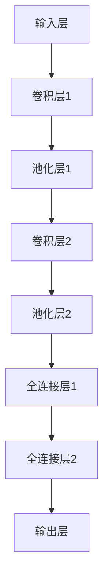

                 

## 1. 背景介绍

随着互联网技术的飞速发展，电子商务已经成为现代商业活动的重要组成部分。电商平台不仅需要提供丰富的商品信息，还需要为用户提供高效、便捷的搜索服务。传统的基于关键词的搜索方法存在一定的局限性，难以满足用户对于图像搜索的需求。此时，AI大模型的出现为电商平台提供了全新的解决方案。

图像搜索在电商平台上有着广泛的应用场景，例如用户可以通过上传或选择一张图片来搜索类似或相关的商品。传统的图像搜索方法主要依赖于图像的文本描述或标签，这种方式在处理具有相似外观的图像时效果不佳。而AI大模型，尤其是基于深度学习的图像识别技术，能够更好地理解图像内容，从而提高图像搜索的准确性和用户体验。

AI大模型的应用不仅局限于提高图像搜索的准确性，还可以通过分析用户的行为数据，为用户提供个性化的推荐服务。例如，通过用户上传的图片，AI大模型可以识别出用户感兴趣的商品类别，进而推荐给用户类似的商品。这种个性化推荐服务能够大大提高用户的购物体验和满意度。

此外，AI大模型还可以用于电商平台的商品质量控制。通过分析商品图像，AI大模型可以识别出商品的质量问题，如颜色偏差、瑕疵等，从而帮助电商平台提高商品的质量和用户的满意度。

总之，AI大模型在电商平台的应用不仅能够提高图像搜索的准确性，还可以为用户提供个性化的推荐服务，提高商品质量，从而全面提升电商平台的用户体验。

## 2. 核心概念与联系

在探讨AI大模型如何改善电商平台的图像搜索体验之前，我们需要首先了解几个核心概念：图像识别、深度学习、神经网络和卷积神经网络（CNN）。

### 2.1 图像识别

图像识别是指利用计算机算法自动识别和理解图像内容的过程。在电商平台中，图像识别技术可以帮助系统自动识别上传的图片中的商品，从而实现高效的图像搜索。

### 2.2 深度学习

深度学习是一种基于神经网络的学习方法，通过构建多层神经网络，从大量数据中自动提取特征，从而实现复杂模式的识别和预测。深度学习在图像识别、语音识别、自然语言处理等领域取得了显著成果。

### 2.3 神经网络

神经网络是一种模仿生物神经系统的计算模型，通过神经元之间的连接和信号传递来处理信息。在深度学习中，神经网络被扩展为多层结构，从而能够处理更复杂的信息。

### 2.4 卷积神经网络（CNN）

卷积神经网络是深度学习的一种特殊结构，特别适用于处理图像数据。CNN通过卷积操作和池化操作来提取图像中的特征，从而实现高效的图像识别。

下面是一个使用Mermaid绘制的CNN的基本架构流程图：



在这个流程图中，输入层接收图像数据，通过卷积层提取图像特征，然后通过池化层减少特征的数量，提高模型的泛化能力。最后，通过全连接层对特征进行分类和预测，输出结果。

### 2.5 关系与联系

AI大模型中的图像识别功能主要依赖于深度学习和CNN技术。深度学习提供了自动特征提取的能力，而CNN则能够高效地处理图像数据，提取出具有识别意义的特征。这些特征被用于训练模型，从而实现图像的自动识别和分类。

在实际应用中，AI大模型通过对海量图像数据的训练，能够学习到各种商品的外观特征，从而在用户上传图像时，能够准确识别并推荐相关的商品。

## 3. 核心算法原理 & 具体操作步骤

### 3.1 算法原理概述

AI大模型在电商平台图像搜索中的应用主要基于深度学习和CNN技术。其核心原理包括：

1. **数据预处理**：对图像进行预处理，包括图像的缩放、裁剪、增强等操作，以提高模型的训练效果。
2. **特征提取**：使用CNN从图像中提取具有识别意义的特征。
3. **特征匹配**：将提取到的特征与数据库中的商品特征进行匹配，以找到相似的商品。
4. **结果输出**：根据匹配结果输出搜索结果，包括相似商品的信息和评分。

### 3.2 算法步骤详解

#### 3.2.1 数据预处理

数据预处理是图像识别模型训练的重要步骤。预处理过程主要包括以下操作：

- **图像缩放**：将图像缩放到统一的尺寸，以便于模型处理。
- **图像裁剪**：根据需要从图像中裁剪出感兴趣的区域。
- **图像增强**：通过调整亮度、对比度、色彩饱和度等参数，增强图像的质量和特征。

#### 3.2.2 特征提取

特征提取是CNN的核心任务。具体步骤如下：

- **卷积层**：通过卷积操作从图像中提取局部特征。
- **激活函数**：通常使用ReLU函数作为激活函数，增加网络的非线性能力。
- **池化层**：通过池化操作减少特征图的大小，提高模型的泛化能力。
- **全连接层**：将卷积层和池化层输出的特征图进行全局平均池化或压缩，然后通过全连接层输出分类结果。

#### 3.2.3 特征匹配

特征匹配是指将提取到的特征与数据库中的商品特征进行相似度计算，以找到相似的商品。具体步骤如下：

- **特征嵌入**：将提取到的特征嵌入到一个高维空间中，使得相似的图像特征在空间中更加接近。
- **相似度计算**：使用余弦相似度或欧氏距离等度量方法计算特征之间的相似度。
- **匹配结果输出**：根据相似度结果，从数据库中检索出相似的商品，并按相似度排序。

#### 3.2.4 结果输出

结果输出是根据特征匹配的结果，为用户提供搜索结果。具体步骤如下：

- **排序与筛选**：根据相似度结果对商品进行排序，并筛选出最相关的商品。
- **展示与反馈**：将搜索结果展示给用户，并收集用户的反馈，用于优化搜索算法。

### 3.3 算法优缺点

#### 优点

- **高效性**：深度学习模型能够自动提取图像特征，无需人工干预，提高了图像识别的效率。
- **准确性**：通过大规模数据训练，深度学习模型具有很高的准确性，能够准确识别图像中的商品。
- **灵活性**：深度学习模型能够适应不同的图像大小和分辨率，具有良好的通用性。

#### 缺点

- **计算成本**：训练深度学习模型需要大量的计算资源和时间，特别是对于大型模型。
- **数据需求**：深度学习模型需要大量的标注数据进行训练，数据质量和数量直接影响模型的性能。
- **可解释性**：深度学习模型的内部机制较为复杂，难以解释其决策过程，这在某些应用场景中可能是一个问题。

### 3.4 算法应用领域

AI大模型在电商平台的图像搜索中具有广泛的应用。除了图像搜索，它还可以用于以下领域：

- **商品推荐**：通过分析用户上传的图像，AI大模型可以推荐用户可能感兴趣的商品。
- **商品质量控制**：AI大模型可以识别图像中的质量缺陷，帮助电商平台提高商品质量。
- **用户行为分析**：通过分析用户上传的图像，AI大模型可以了解用户的需求和偏好，从而优化用户体验。

## 4. 数学模型和公式 & 详细讲解 & 举例说明

### 4.1 数学模型构建

在深度学习模型中，数学模型的核心是损失函数和优化算法。损失函数用于评估模型预测结果与实际结果之间的差距，而优化算法则用于调整模型参数，以最小化损失函数。

#### 4.1.1 损失函数

在图像识别任务中，常用的损失函数是交叉熵损失函数（Cross-Entropy Loss）。其公式如下：

$$
L(y, \hat{y}) = -\sum_{i=1}^{N} y_i \log(\hat{y}_i)
$$

其中，$y$ 是实际标签，$\hat{y}$ 是模型预测的概率分布，$N$ 是样本数量。

#### 4.1.2 优化算法

优化算法用于调整模型参数，以最小化损失函数。在深度学习中，常用的优化算法有随机梯度下降（Stochastic Gradient Descent, SGD）和Adam优化器。

- **随机梯度下降（SGD）**：

$$
w_{t+1} = w_t - \alpha \cdot \nabla_w L(w_t)
$$

其中，$w_t$ 是当前参数，$\alpha$ 是学习率，$\nabla_w L(w_t)$ 是损失函数关于参数 $w_t$ 的梯度。

- **Adam优化器**：

$$
m_t = \beta_1 m_{t-1} + (1 - \beta_1) \nabla_w L(w_t)
$$

$$
v_t = \beta_2 v_{t-1} + (1 - \beta_2) (\nabla_w L(w_t))^2
$$

$$
\hat{m}_t = m_t / (1 - \beta_1^t)
$$

$$
\hat{v}_t = v_t / (1 - \beta_2^t)
$$

$$
w_{t+1} = w_t - \alpha \cdot (\hat{m}_t / \sqrt{\hat{v}_t} + \epsilon)
$$

其中，$\beta_1$ 和 $\beta_2$ 是动量项，$m_t$ 和 $v_t$ 分别是梯度的一阶和二阶矩估计，$\hat{m}_t$ 和 $\hat{v}_t$ 是归一化后的估计，$\alpha$ 是学习率，$\epsilon$ 是一个很小的常数，用于防止除以零。

### 4.2 公式推导过程

#### 4.2.1 交叉熵损失函数的推导

假设我们有一个包含 $C$ 个类别的图像识别任务，实际标签 $y$ 是一个 $C$ 维的独热向量（One-Hot Vector），模型预测的概率分布 $\hat{y}$ 是一个 $C$ 维的概率向量。交叉熵损失函数的推导如下：

$$
L(y, \hat{y}) = -\sum_{i=1}^{C} y_i \log(\hat{y}_i)
$$

对于某个类别 $i$，实际标签 $y_i$ 为 1，则损失函数变为：

$$
L(y, \hat{y}) = -\log(\hat{y}_i)
$$

因为 $\hat{y}_i$ 是一个概率值，所以 $-\log(\hat{y}_i)$ 是一个负对数函数，它的值域是 $(0, +\infty)$。当 $\hat{y}_i = 1$ 时，损失函数取最小值 0；当 $\hat{y}_i \to 0$ 时，损失函数趋向于 $+\infty$。

#### 4.2.2 Adam优化器的推导

Adam优化器是基于SGD的改进，它结合了动量项和自适应学习率。下面是Adam优化器的推导过程：

- **一阶矩估计（均值）**：

$$
m_t = \beta_1 m_{t-1} + (1 - \beta_1) \nabla_w L(w_t)
$$

- **二阶矩估计（方差）**：

$$
v_t = \beta_2 v_{t-1} + (1 - \beta_2) (\nabla_w L(w_t))^2
$$

- **一阶矩估计的归一化**：

$$
\hat{m}_t = m_t / (1 - \beta_1^t)
$$

- **二阶矩估计的归一化**：

$$
\hat{v}_t = v_t / (1 - \beta_2^t)
$$

- **更新公式**：

$$
w_{t+1} = w_t - \alpha \cdot (\hat{m}_t / \sqrt{\hat{v}_t} + \epsilon)
$$

其中，$\beta_1$ 和 $\beta_2$ 是超参数，通常取值为 0.9 和 0.999，$\alpha$ 是学习率，$\epsilon$ 是一个很小的常数，用于防止除以零。

### 4.3 案例分析与讲解

为了更好地理解数学模型在实际中的应用，我们来看一个简单的案例。

假设我们有一个包含 3 个类别的图像识别任务，实际标签为 $y = (1, 0, 0)$，模型预测的概率分布为 $\hat{y} = (0.8, 0.1, 0.1)$。

- **交叉熵损失函数计算**：

$$
L(y, \hat{y}) = -1 \cdot \log(0.8) - 0 \cdot \log(0.1) - 0 \cdot \log(0.1)
$$

$$
L(y, \hat{y}) = -\log(0.8) \approx 0.223
$$

- **Adam优化器更新参数**：

假设当前参数为 $w_t = (1, 2, 3)$，梯度为 $\nabla_w L(w_t) = (-0.1, -0.1, -0.1)$，学习率 $\alpha = 0.01$。

- **一阶矩估计**：

$$
m_t = \beta_1 m_{t-1} + (1 - \beta_1) \nabla_w L(w_t)
$$

$$
m_t = 0.9 \cdot 0 + 0.1 \cdot (-0.1) = -0.01
$$

- **二阶矩估计**：

$$
v_t = \beta_2 v_{t-1} + (1 - \beta_2) (\nabla_w L(w_t))^2
$$

$$
v_t = 0.999 \cdot 0 + 0.001 \cdot (0.01 + 0.01 + 0.01) = 0.00003
$$

- **归一化一阶矩和二阶矩**：

$$
\hat{m}_t = m_t / (1 - \beta_1^t) = -0.01 / (1 - 0.9) = 0.01
$$

$$
\hat{v}_t = v_t / (1 - \beta_2^t) = 0.00003 / (1 - 0.999) = 0.00003
$$

- **更新参数**：

$$
w_{t+1} = w_t - \alpha \cdot (\hat{m}_t / \sqrt{\hat{v}_t} + \epsilon)
$$

$$
w_{t+1} = (1, 2, 3) - 0.01 \cdot (0.01 / \sqrt{0.00003} + 1e-8)
$$

$$
w_{t+1} = (1 - 0.0001, 2 - 0.0001, 3 - 0.0001)
$$

$$
w_{t+1} = (0.9999, 1.9999, 2.9999)
$$

通过这个简单的案例，我们可以看到Adam优化器如何根据损失函数的梯度更新参数，从而优化模型的性能。

## 5. 项目实践：代码实例和详细解释说明

为了更好地理解AI大模型在电商平台图像搜索中的应用，我们将通过一个具体的代码实例来进行实践。

在这个实例中，我们使用Python和TensorFlow框架来实现一个基于CNN的图像识别模型。代码的主要步骤如下：

### 5.1 开发环境搭建

在开始编写代码之前，我们需要搭建开发环境。以下是所需的软件和工具：

- **操作系统**：Windows或Linux
- **编程语言**：Python
- **框架**：TensorFlow
- **依赖库**：NumPy、PIL、TensorFlow

安装完上述工具后，我们可以开始编写代码。

### 5.2 源代码详细实现

以下是一个简单的CNN模型实现代码：

```python
import tensorflow as tf
from tensorflow.keras import datasets, layers, models
import matplotlib.pyplot as plt

# 加载并预处理数据
(train_images, train_labels), (test_images, test_labels) = datasets.cifar10.load_data()

train_images, test_images = train_images / 255.0, test_images / 255.0

class_names = ['airplane', 'automobile', 'bird', 'cat', 'deer',
               'dog', 'frog', 'horse', 'ship', 'truck']

# 构建CNN模型
model = models.Sequential()
model.add(layers.Conv2D(32, (3, 3), activation='relu', input_shape=(32, 32, 3)))
model.add(layers.MaxPooling2D((2, 2)))
model.add(layers.Conv2D(64, (3, 3), activation='relu'))
model.add(layers.MaxPooling2D((2, 2)))
model.add(layers.Conv2D(64, (3, 3), activation='relu'))
model.add(layers.Flatten())
model.add(layers.Dense(64, activation='relu'))
model.add(layers.Dense(10, activation='softmax'))

# 编译模型
model.compile(optimizer='adam',
              loss='sparse_categorical_crossentropy',
              metrics=['accuracy'])

# 训练模型
model.fit(train_images, train_labels, epochs=10, validation_split=0.1)

# 评估模型
test_loss, test_acc = model.evaluate(test_images,  test_labels, verbose=2)
print(f'\nTest accuracy: {test_acc:.4f}')

# 预测新图像
new_image = plt.imread('new_image.jpg')
new_image = new_image / 255.0
prediction = model.predict(new_image.reshape(1, 32, 32, 3))
predicted_class = class_names[np.argmax(prediction)]

print(f'\nPredicted class: {predicted_class}')
```

### 5.3 代码解读与分析

#### 5.3.1 数据预处理

代码首先加载CIFAR-10数据集，并进行归一化处理。CIFAR-10是一个常见的图像数据集，包含60000张32x32彩色图像，分为10个类别。

```python
(train_images, train_labels), (test_images, test_labels) = datasets.cifar10.load_data()
train_images, test_images = train_images / 255.0, test_images / 255.0
```

#### 5.3.2 构建CNN模型

接下来，我们使用TensorFlow的Keras API构建CNN模型。模型包括两个卷积层、两个池化层和一个全连接层。

```python
model = models.Sequential()
model.add(layers.Conv2D(32, (3, 3), activation='relu', input_shape=(32, 32, 3)))
model.add(layers.MaxPooling2D((2, 2)))
model.add(layers.Conv2D(64, (3, 3), activation='relu'))
model.add(layers.MaxPooling2D((2, 2)))
model.add(layers.Conv2D(64, (3, 3), activation='relu'))
model.add(layers.Flatten())
model.add(layers.Dense(64, activation='relu'))
model.add(layers.Dense(10, activation='softmax'))
```

- **卷积层**：使用ReLU激活函数，卷积核大小为3x3，步长为1。
- **池化层**：使用最大池化层，窗口大小为2x2，步长为2。
- **全连接层**：第一层全连接层有64个神经元，使用ReLU激活函数；第二层全连接层有10个神经元，用于分类，使用softmax激活函数。

#### 5.3.3 编译模型

编译模型时，我们选择Adam优化器和sparse categorical cross-entropy损失函数，并监控模型的accuracy。

```python
model.compile(optimizer='adam',
              loss='sparse_categorical_crossentropy',
              metrics=['accuracy'])
```

#### 5.3.4 训练模型

使用训练数据集训练模型，并使用validation_split参数进行验证。

```python
model.fit(train_images, train_labels, epochs=10, validation_split=0.1)
```

#### 5.3.5 评估模型

评估模型在测试数据集上的表现，输出测试准确率。

```python
test_loss, test_acc = model.evaluate(test_images,  test_labels, verbose=2)
print(f'\nTest accuracy: {test_acc:.4f}')
```

#### 5.3.6 预测新图像

加载一张新的图像，进行预处理后输入模型进行预测，并输出预测结果。

```python
new_image = plt.imread('new_image.jpg')
new_image = new_image / 255.0
prediction = model.predict(new_image.reshape(1, 32, 32, 3))
predicted_class = class_names[np.argmax(prediction)]
print(f'\nPredicted class: {predicted_class}')
```

通过这个代码实例，我们可以看到如何使用深度学习和CNN技术实现一个简单的图像识别模型。在实际应用中，我们可以根据需求调整模型结构和参数，以提高图像识别的准确性。

## 6. 实际应用场景

AI大模型在电商平台图像搜索中的应用场景广泛，以下是几个典型的应用案例：

### 6.1 商品搜索

用户可以通过上传一张商品图片来搜索电商平台上的类似商品。例如，用户上传一张手表的图片，系统会自动识别手表的外观特征，然后从数据库中检索出相似的手表，并展示给用户。

### 6.2 商品推荐

AI大模型可以分析用户上传的图片，识别出用户感兴趣的商品类别，进而推荐给用户相关的商品。例如，用户上传一张珠宝的图片，系统会推荐类似的珠宝商品，提高用户的购物体验。

### 6.3 商品质量控制

AI大模型可以用于检测商品图像中的质量缺陷。例如，识别出衣物上的污渍、颜色偏差等，从而帮助电商平台提高商品质量。

### 6.4 商品分类

电商平台可以使用AI大模型对商品图像进行分类，以便于管理和搜索。例如，将商品图像分类为服装、家居、电子产品等类别，提高商品搜索的效率。

### 6.5 用户行为分析

AI大模型可以分析用户上传的图片，了解用户的需求和偏好。例如，通过用户上传的旅游照片，系统可以分析出用户的旅游偏好，并推荐相关的旅游商品和目的地。

### 6.6 个性化广告

AI大模型可以根据用户上传的图片，为用户推送个性化的广告。例如，用户上传一张运动鞋的图片，系统会为用户推荐相关的运动鞋品牌和折扣信息。

### 6.7 智能客服

AI大模型可以用于智能客服系统，通过分析用户上传的图片，自动识别用户的问题并给出相应的答案。例如，用户上传一张商品图片，系统可以自动解答关于商品的问题，提高客服效率。

### 6.8 社交电商

AI大模型可以用于社交电商平台的图像识别和推荐功能，例如识别用户上传的社交动态中的商品，并推荐给用户相关的商品。

### 6.9 虚假商品检测

AI大模型可以用于检测电商平台上的虚假商品图像，通过识别商品外观特征，帮助平台识别和打击虚假商品。

这些实际应用场景展示了AI大模型在电商平台图像搜索中的巨大潜力，通过提高搜索准确性、推荐相关商品、优化用户体验等方面，为电商平台带来了巨大的价值。

### 6.10 未来应用展望

随着AI技术的不断进步，AI大模型在电商平台图像搜索中的应用前景十分广阔。以下是一些未来可能的应用方向：

1. **多模态融合**：未来的AI大模型可能会融合图像、文本和语音等多模态数据，实现更准确的商品识别和搜索。
2. **自适应增强**：AI大模型可能会通过自适应图像增强技术，提高图像质量，从而提升搜索准确性。
3. **边缘计算**：随着边缘计算的兴起，AI大模型可能会在靠近数据源的边缘设备上运行，实现更快速的图像识别和搜索。
4. **隐私保护**：为了保护用户隐私，未来的AI大模型可能会采用隐私保护技术，例如联邦学习，在保障用户隐私的同时实现高效的图像搜索。
5. **智能客服**：AI大模型可能会在智能客服系统中发挥更大的作用，通过自然语言处理和图像识别技术，实现更加智能和高效的客服体验。
6. **图像生成**：未来的AI大模型可能会利用生成对抗网络（GAN）等技术，生成与用户上传图像相似的商品图像，用于个性化推荐和营销。
7. **虚拟试衣**：AI大模型可以与虚拟试衣技术结合，用户上传一张自己的照片，系统会根据用户的体型和偏好，推荐合适的服装，提高购物体验。

总之，AI大模型在电商平台图像搜索中的应用将继续深化，为用户带来更加智能、便捷和个性化的购物体验。

### 7. 工具和资源推荐

为了更好地掌握AI大模型在电商平台图像搜索中的应用，以下是几个推荐的工具和资源：

#### 7.1 学习资源推荐

1. **书籍**：
   - 《深度学习》（Goodfellow, I., Bengio, Y., & Courville, A.）
   - 《Python机器学习》（Sebastian Raschka）
   - 《卷积神经网络与深度学习》（Faghri, A.）
2. **在线课程**：
   - Coursera上的“深度学习”课程
   - edX上的“机器学习基础”课程
   - Udacity的“深度学习工程师纳米学位”
3. **论文与研究报告**：
   - ArXiv.org上的最新深度学习和计算机视觉论文
   - NeurIPS、ICML、CVPR等顶级会议的论文和报告

#### 7.2 开发工具推荐

1. **编程语言**：
   - Python：广泛用于AI和深度学习开发，有丰富的库和框架支持。
   - R：特别适合于统计分析和数据挖掘。
2. **深度学习框架**：
   - TensorFlow：谷歌开发的强大开源深度学习框架。
   - PyTorch：由Facebook开发，具有灵活的动态计算图。
   - Keras：基于TensorFlow和Theano的开源深度学习库，易于使用。
3. **版本控制**：
   - Git：用于代码版本管理和协作开发。
   - GitHub：在线代码托管平台，方便代码的分享和交流。

#### 7.3 相关论文推荐

1. **ImageNet Classification with Deep Convolutional Neural Networks（ImageNet上的深度卷积神经网络分类）**
2. **DenseNet: Implementing Density-Independent Scaling of Networks**（DenseNet：实现网络密度无关的缩放）
3. **EfficientNet: Rethinking Model Scaling for Convolutional Neural Networks**（EfficientNet：重新思考卷积神经网络的模型缩放）
4. **A Gentle Introduction to TensorFlow**（TensorFlow的温和介绍）
5. **PyTorch: The Fast RNN Library for Tensor Computing**（PyTorch：用于张量计算的快速RNN库）

通过以上推荐的工具和资源，您可以更系统地学习和掌握AI大模型在电商平台图像搜索中的应用技术。

### 8. 总结：未来发展趋势与挑战

#### 8.1 研究成果总结

近年来，AI大模型在电商平台图像搜索中的应用取得了显著成果。通过深度学习和卷积神经网络技术，AI大模型能够高效地提取图像特征，实现高准确性的图像识别和搜索。此外，AI大模型还可以结合用户行为数据，提供个性化的推荐服务，提升用户体验。

#### 8.2 未来发展趋势

1. **多模态融合**：未来的研究将更多关注图像、文本和语音等多模态数据的融合，以实现更准确的商品识别和搜索。
2. **自适应增强**：图像增强技术将得到进一步发展，通过自适应增强提高图像质量，从而提升搜索准确性。
3. **边缘计算**：随着边缘计算的兴起，AI大模型将在靠近数据源的边缘设备上运行，实现更快速的图像识别和搜索。
4. **隐私保护**：隐私保护技术，如联邦学习，将成为研究热点，在保障用户隐私的同时实现高效的图像搜索。
5. **虚拟现实与增强现实**：AI大模型将应用于虚拟现实和增强现实场景，提供更智能的交互体验。

#### 8.3 面临的挑战

1. **计算资源消耗**：训练和运行大型AI大模型需要大量的计算资源和时间，这对计算能力提出了较高要求。
2. **数据需求**：AI大模型需要大量的标注数据进行训练，数据质量和数量直接影响模型的性能。
3. **可解释性**：深度学习模型的内部机制较为复杂，难以解释其决策过程，这在某些应用场景中可能是一个问题。
4. **实时性**：为了满足用户对实时搜索的需求，AI大模型需要具备快速响应能力，这对模型的优化提出了挑战。

#### 8.4 研究展望

未来的研究应关注如何平衡计算资源消耗和数据需求，提高模型的可解释性和实时性。同时，多模态融合和自适应增强等新技术的应用将为电商平台图像搜索带来更多可能性。通过不断优化和改进，AI大模型有望在电商平台图像搜索中发挥更大的作用，为用户带来更加智能、便捷和个性化的购物体验。

### 9. 附录：常见问题与解答

**Q1：AI大模型在电商平台图像搜索中的应用有哪些优点？**

A1：AI大模型在电商平台图像搜索中的应用具有以下优点：

1. **提高搜索准确性**：通过深度学习和卷积神经网络技术，AI大模型能够更准确地提取图像特征，从而提高搜索准确性。
2. **个性化推荐**：AI大模型可以结合用户行为数据，提供个性化的推荐服务，提高用户购物体验。
3. **高效处理能力**：AI大模型能够高效地处理海量图像数据，实现快速搜索和推荐。

**Q2：AI大模型在电商平台图像搜索中面临哪些挑战？**

A2：AI大模型在电商平台图像搜索中面临以下挑战：

1. **计算资源消耗**：训练和运行大型AI大模型需要大量的计算资源和时间。
2. **数据需求**：AI大模型需要大量的标注数据进行训练，数据质量和数量直接影响模型性能。
3. **可解释性**：深度学习模型的内部机制复杂，难以解释其决策过程。
4. **实时性**：为了满足用户实时搜索的需求，AI大模型需要具备快速响应能力。

**Q3：如何提高AI大模型在电商平台图像搜索中的实时性？**

A3：提高AI大模型实时性的方法包括：

1. **模型优化**：通过模型压缩、量化等技术，减小模型体积和计算复杂度。
2. **边缘计算**：将AI大模型部署到边缘设备上，实现更快速的图像识别和搜索。
3. **并行计算**：利用并行计算技术，提高模型处理速度。
4. **缓存技术**：使用缓存技术，减少模型对实时数据的依赖。

**Q4：如何确保AI大模型在电商平台图像搜索中的数据隐私？**

A4：确保AI大模型数据隐私的方法包括：

1. **数据加密**：对上传的图像数据进行加密处理，防止数据泄露。
2. **差分隐私**：采用差分隐私技术，在训练过程中保护用户隐私。
3. **联邦学习**：采用联邦学习技术，在保障用户隐私的同时实现高效的图像搜索。
4. **隐私保护算法**：采用隐私保护算法，如差分隐私和安全多方计算，减少数据泄露风险。

**Q5：AI大模型在电商平台图像搜索中的应用前景如何？**

A5：AI大模型在电商平台图像搜索中的应用前景非常广阔。随着深度学习和AI技术的不断发展，AI大模型在图像识别、搜索和推荐等方面的性能将得到进一步提升。未来，AI大模型有望在多模态融合、自适应增强、边缘计算等领域发挥更大作用，为用户带来更加智能、便捷和个性化的购物体验。同时，随着隐私保护和实时性的不断完善，AI大模型在电商平台的应用将更加普及和实用。

