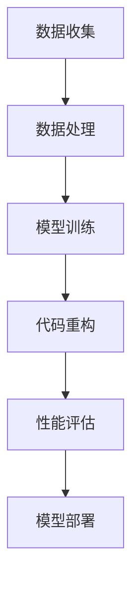

                 

关键词：AI大模型、代码重构、应用场景、优化策略、编程实践、性能提升

## 摘要

本文探讨了在AI大模型应用中代码重构的时机与策略。首先，我们介绍了AI大模型的基础知识，然后详细分析了代码重构在AI大模型开发中的重要性。接下来，我们讨论了如何判断代码重构的时机，以及在不同阶段应采取的具体重构策略。此外，文章还通过实例展示了代码重构的实施步骤和效果评估方法。最后，我们对未来AI大模型应用中的代码重构趋势和挑战进行了展望，为开发者提供了实用的指导和建议。

## 1. 背景介绍

### AI大模型的概念与发展

AI大模型（Large-scale AI Models）是指那些具有巨大参数量和强大计算能力的机器学习模型。这些模型在训练过程中需要大量的数据和高性能计算资源。代表性的AI大模型包括GPT、BERT、ImageNet等。它们在自然语言处理、计算机视觉、语音识别等领域取得了显著的成果。

AI大模型的发展得益于以下几个方面：

1. **数据量的爆发性增长**：互联网的普及使得大量结构化和非结构化数据得以收集，为AI模型的训练提供了丰富的素材。
2. **计算能力的提升**：云计算和GPU等计算硬件的进步，为AI大模型的训练提供了强大的计算支持。
3. **优化算法的创新**：如深度学习、神经网络等算法的不断发展，使得AI大模型的性能不断提高。

### 代码重构在AI大模型应用中的意义

代码重构（Code Refactoring）是指在保持程序功能不变的前提下，对原有代码进行优化，以提高代码的可读性、可维护性和性能。

在AI大模型应用中，代码重构具有重要意义：

1. **提高可维护性**：随着AI大模型的复杂性增加，代码重构有助于提高代码的可读性和可维护性，降低后续开发和维护的成本。
2. **优化性能**：通过代码重构，可以消除潜在的性能瓶颈，提高程序运行效率，降低资源消耗。
3. **提升用户体验**：优化后的代码运行更加稳定，响应速度更快，能够提供更优质的用户体验。
4. **促进团队协作**：代码重构有助于团队间的知识传递和协作，提高团队的研发效率。

### 本文结构

本文将按照以下结构展开：

1. **核心概念与联系**：介绍AI大模型的相关概念，并通过Mermaid流程图展示其原理和架构。
2. **核心算法原理 & 具体操作步骤**：分析AI大模型的核心算法原理，详细阐述操作步骤，并讨论其优缺点和应用领域。
3. **数学模型和公式 & 详细讲解 & 举例说明**：构建AI大模型的数学模型，推导相关公式，并通过案例进行分析。
4. **项目实践：代码实例和详细解释说明**：展示代码重构的具体实例，包括开发环境搭建、源代码实现、代码解读和分析，以及运行结果展示。
5. **实际应用场景**：探讨AI大模型在不同领域的应用场景，以及代码重构在这些场景中的具体应用。
6. **未来应用展望**：分析AI大模型应用的发展趋势，探讨未来可能面临的挑战和解决方案。
7. **工具和资源推荐**：推荐学习资源、开发工具和相关论文，为开发者提供参考。
8. **总结：未来发展趋势与挑战**：总结研究成果，展望未来发展趋势，讨论面临的挑战和研究展望。

通过本文的深入探讨，希望能够为开发者提供关于AI大模型代码重构的实用指导，提升AI大模型应用的开发效率和性能。

## 2. 核心概念与联系

### AI大模型的基本概念

AI大模型是利用大量数据和强大计算能力训练出的复杂机器学习模型。其核心特点包括：

- **大规模参数**：AI大模型通常拥有数十亿甚至千亿级别的参数，这使得模型能够捕捉到数据中的细微特征。
- **高性能计算**：训练AI大模型需要大量的计算资源，如GPU和TPU等专用硬件。
- **自适应性**：AI大模型能够根据不同的数据集和应用场景进行调整，提高模型的泛化能力。

### 代码重构的定义与意义

代码重构是指在不改变程序功能的前提下，对现有代码进行优化，以提高其可读性、可维护性和性能。在AI大模型应用中，代码重构具有重要意义：

- **提升可维护性**：AI大模型通常涉及复杂的算法和数据处理流程，通过代码重构可以使得代码更加简洁清晰，降低后续维护的难度。
- **优化性能**：通过代码重构，可以消除潜在的性能瓶颈，提高程序的运行效率，降低资源消耗。
- **增强用户体验**：优化后的代码运行更加稳定，响应速度更快，能够为用户提供更优质的体验。

### AI大模型与代码重构的关联

AI大模型与代码重构之间存在紧密的关联：

- **复杂度**：AI大模型通常涉及复杂的算法和数据结构，这使得代码重构变得尤为重要，以保持代码的简洁和可维护性。
- **性能要求**：AI大模型应用对性能有较高的要求，通过代码重构可以提升模型的运行效率，满足性能需求。
- **持续迭代**：AI大模型开发通常是一个持续迭代的过程，代码重构有助于适应不断变化的需求和场景。

### Mermaid流程图展示

以下是一个简化的Mermaid流程图，展示了AI大模型与代码重构的基本流程：



**数据收集**：从各种来源收集大量数据，为模型训练提供素材。

**数据处理**：对数据进行清洗、预处理，以消除噪声和异常值，提高数据质量。

**模型训练**：使用大量数据和强大计算资源进行模型训练，调整参数以优化模型性能。

**代码重构**：在模型训练过程中，对代码进行重构，提高代码的可读性、可维护性和性能。

**性能评估**：对重构后的代码进行性能评估，确保其满足性能要求。

**模型部署**：将训练好的模型部署到实际应用中，为用户提供服务。

### 关联与影响

AI大模型与代码重构之间存在相互影响：

- **代码重构影响模型性能**：优化后的代码有助于提升模型的运行效率，降低资源消耗，从而提高模型性能。
- **模型性能影响代码重构**：高性能的AI大模型对代码重构提出了更高的要求，需要开发者不断优化代码，以适应模型的复杂性。

通过上述分析，我们可以看出AI大模型与代码重构之间的紧密联系，为后续内容的展开奠定了基础。在下一章节中，我们将深入探讨AI大模型的核心算法原理和具体操作步骤。

## 3. 核心算法原理 & 具体操作步骤

### 3.1 算法原理概述

AI大模型的核心算法主要基于深度学习和神经网络。以下是几个代表性的算法：

#### 1. 深度学习（Deep Learning）

深度学习是一种基于人工神经网络的机器学习方法，通过多层次的神经网络结构来学习数据的特征表示。深度学习模型通常包括卷积神经网络（CNN）、循环神经网络（RNN）和Transformer等。

- **卷积神经网络（CNN）**：主要用于图像识别和计算机视觉领域，通过卷积层、池化层和全连接层的组合，实现对图像的特征提取和分类。
- **循环神经网络（RNN）**：主要用于序列数据（如时间序列、语音、文本）的处理，通过循环结构保持对历史信息的记忆。
- **Transformer**：一种基于自注意力机制的神经网络架构，广泛应用于自然语言处理任务，如机器翻译、文本分类等。

#### 2. 神经网络（Neural Networks）

神经网络是深度学习的基础，由大量神经元（节点）通过非线性激活函数连接而成。神经网络的训练过程主要包括以下步骤：

1. **初始化权重和偏置**：随机初始化神经网络中的权重和偏置。
2. **前向传播（Forward Propagation）**：输入数据通过神经网络，逐层计算输出结果。
3. **反向传播（Back Propagation）**：计算输出误差，通过反向传播更新网络权重和偏置。
4. **优化算法**：使用梯度下降（Gradient Descent）等优化算法，迭代更新网络参数，直至达到预定的损失函数最小值。

### 3.2 算法步骤详解

下面以卷积神经网络（CNN）为例，详细介绍其算法步骤：

#### 1. 数据预处理

1. **图像缩放**：将输入图像缩放到固定的尺寸，如224x224像素。
2. **归一化**：将像素值归一化到0-1范围内，以减少计算量和提高训练稳定性。

#### 2. 卷积操作

1. **卷积层**：使用卷积核（filter）在输入图像上滑动，计算局部特征图。
2. **激活函数**：通常使用ReLU（Rectified Linear Unit）作为激活函数，将负值设置为0，加速收敛。

#### 3. 池化操作

1. **最大池化（Max Pooling）**：在卷积层之后，对特征图进行最大值池化，减少特征图的尺寸，提高模型的泛化能力。

#### 4. 全连接层

1. **全连接层**：将卷积特征图展平为一维向量，与分类器的权重进行矩阵乘法，计算输出结果。
2. **激活函数**：通常使用Softmax函数将输出概率化，为分类提供参考。

#### 5. 损失函数和优化算法

1. **损失函数**：通常使用交叉熵（Cross-Entropy）作为损失函数，衡量实际输出与期望输出之间的差距。
2. **优化算法**：使用随机梯度下降（SGD）或Adam等优化算法，迭代更新网络参数。

### 3.3 算法优缺点

#### 优点

1. **强大的特征提取能力**：通过多层次的卷积和池化操作，深度学习模型能够自动提取图像中的复杂特征。
2. **高泛化能力**：通过大量数据和复杂网络结构的训练，深度学习模型能够适应不同的数据分布和应用场景。
3. **自适应调整**：通过反向传播和优化算法，深度学习模型能够自动调整权重和偏置，以最小化损失函数。

#### 缺点

1. **计算资源消耗**：深度学习模型通常需要大量的计算资源和时间进行训练，对硬件性能有较高的要求。
2. **数据需求大**：深度学习模型训练需要大量的数据，数据的质量和数量对模型的性能有重要影响。
3. **调参复杂**：深度学习模型的参数调整复杂，需要大量实验和尝试，才能找到最佳的参数配置。

### 3.4 算法应用领域

深度学习算法在AI大模型中的应用广泛，涵盖了以下几个主要领域：

1. **图像识别与分类**：如人脸识别、物体检测、医疗影像分析等。
2. **自然语言处理**：如机器翻译、情感分析、文本分类等。
3. **语音识别与合成**：如语音识别、语音合成、语音助手等。
4. **推荐系统**：如电商推荐、新闻推荐等。

通过上述分析，我们可以看出AI大模型的核心算法原理和具体操作步骤。在下一章节中，我们将构建AI大模型的数学模型，并推导相关公式。

## 4. 数学模型和公式 & 详细讲解 & 举例说明

### 4.1 数学模型构建

在构建AI大模型的数学模型时，我们主要关注神经网络和深度学习的核心组成部分：前向传播、反向传播和损失函数。

#### 1. 前向传播

前向传播是神经网络计算过程的第一步，用于计算网络输出。我们以一个简单的多层感知器（MLP）为例，其前向传播过程可以表示为：

\[ \text{output} = \text{激活函数}(\text{权重} \cdot \text{输入} + \text{偏置}) \]

其中，输入为 \( x \)，权重为 \( w \)，偏置为 \( b \)，激活函数为 \( \text{激活函数}(z) = \sigma(z) = \frac{1}{1 + e^{-z}} \)。

假设有一个包含 \( L \) 层的神经网络，每层有 \( n_l \) 个神经元，则前向传播过程可以表示为：

\[ z_l = w_l \cdot a_{l-1} + b_l \]
\[ a_l = \text{激活函数}(z_l) \]

其中，\( z_l \) 为第 \( l \) 层的输入，\( a_l \) 为第 \( l \) 层的输出。

#### 2. 反向传播

反向传播是神经网络训练过程中的关键步骤，用于计算输出误差，并更新网络权重和偏置。反向传播过程可以分为以下几个步骤：

1. **计算输出误差**：

\[ \delta_L = (a_L - y) \cdot \text{激活函数}'(z_L) \]

其中，\( y \) 为实际输出，\( a_L \) 为预测输出。

2. **反向传播误差**：

\[ \delta_l = \delta_{l+1} \cdot w_{l+1} \cdot \text{激活函数}'(z_l) \]

3. **更新权重和偏置**：

\[ w_l = w_l - \alpha \cdot \delta_l \cdot a_{l-1} \]
\[ b_l = b_l - \alpha \cdot \delta_l \]

其中，\( \alpha \) 为学习率。

#### 3. 损失函数

损失函数用于衡量实际输出与预测输出之间的差距。常见的损失函数包括均方误差（MSE）和交叉熵（Cross-Entropy）。

1. **均方误差（MSE）**：

\[ \text{MSE} = \frac{1}{2} \sum_{i=1}^{n} (y_i - \hat{y}_i)^2 \]

其中，\( y_i \) 为实际输出，\( \hat{y}_i \) 为预测输出。

2. **交叉熵（Cross-Entropy）**：

\[ \text{CE} = - \sum_{i=1}^{n} y_i \log(\hat{y}_i) \]

其中，\( y_i \) 为实际输出（概率分布），\( \hat{y}_i \) 为预测输出（概率分布）。

### 4.2 公式推导过程

以下将详细推导神经网络的前向传播、反向传播和损失函数的公式。

#### 1. 前向传播

多层感知器（MLP）的前向传播可以分为以下几步：

1. **输入层到隐藏层**：

\[ z_1 = w_{01} \cdot x_0 + b_1 \]
\[ a_1 = \sigma(z_1) \]

其中，\( x_0 \) 为输入向量，\( w_{01} \) 为输入层到隐藏层的权重，\( b_1 \) 为输入层到隐藏层的偏置，\( \sigma(z) \) 为激活函数。

2. **隐藏层到输出层**：

\[ z_L = w_{L0} \cdot a_{L-1} + b_L \]
\[ \hat{y} = \sigma(z_L) \]

其中，\( a_{L-1} \) 为隐藏层的输出，\( w_{L0} \) 为隐藏层到输出层的权重，\( b_L \) 为隐藏层到输出层的偏置，\( \hat{y} \) 为预测输出。

#### 2. 反向传播

反向传播的主要步骤如下：

1. **计算输出误差**：

\[ \delta_L = (a_L - y) \cdot \sigma'(z_L) \]

其中，\( y \) 为实际输出，\( \sigma'(z) \) 为激活函数的导数。

2. **计算隐藏层误差**：

\[ \delta_l = \delta_{l+1} \cdot w_{l+1} \cdot \sigma'(z_l) \]

3. **更新权重和偏置**：

\[ w_{l} = w_{l} - \alpha \cdot \delta_l \cdot a_{l-1} \]
\[ b_{l} = b_{l} - \alpha \cdot \delta_l \]

#### 3. 损失函数

以均方误差（MSE）为例，损失函数的推导如下：

1. **计算预测误差**：

\[ \hat{y} = \sigma(z_L) \]
\[ \delta_L = (y - \hat{y}) \cdot \sigma'(z_L) \]

2. **计算隐藏层误差**：

\[ \delta_l = \delta_{l+1} \cdot w_{l+1} \cdot \sigma'(z_l) \]

3. **计算损失函数**：

\[ \text{MSE} = \frac{1}{2} \sum_{i=1}^{n} (y_i - \hat{y}_i)^2 \]

### 4.3 案例分析与讲解

为了更好地理解上述公式，我们通过一个具体的例子进行分析。

假设我们有一个包含两个隐藏层的神经网络，输入层有3个神经元，隐藏层各有4个神经元，输出层有2个神经元。训练数据集包含100个样本，每个样本有3个特征。

1. **初始化参数**：

   随机初始化权重 \( w \) 和偏置 \( b \)，并设置学习率 \( \alpha \)。

2. **前向传播**：

   输入一个样本 \( x_0 = [1, 2, 3] \)。

   第一层隐藏层的计算：

   \[ z_1 = w_{01} \cdot x_0 + b_1 \]
   \[ a_1 = \sigma(z_1) \]

   第二层隐藏层的计算：

   \[ z_2 = w_{12} \cdot a_1 + b_2 \]
   \[ a_2 = \sigma(z_2) \]

   输出层的计算：

   \[ z_L = w_{L0} \cdot a_2 + b_L \]
   \[ \hat{y} = \sigma(z_L) \]

3. **反向传播**：

   计算输出层的误差：

   \[ \delta_L = (y - \hat{y}) \cdot \sigma'(z_L) \]

   计算隐藏层2的误差：

   \[ \delta_2 = \delta_L \cdot w_{L1} \cdot \sigma'(z_2) \]

   计算隐藏层1的误差：

   \[ \delta_1 = \delta_2 \cdot w_{12} \cdot \sigma'(z_1) \]

4. **更新参数**：

   根据误差更新权重和偏置：

   \[ w_{l} = w_{l} - \alpha \cdot \delta_l \cdot a_{l-1} \]
   \[ b_{l} = b_{l} - \alpha \cdot \delta_l \]

   重复上述步骤，直至达到预定的迭代次数或损失函数最小值。

通过上述案例，我们可以看到神经网络的前向传播、反向传播和损失函数的具体实现过程。在下一章节中，我们将通过项目实践来展示代码重构的具体步骤和效果。

## 5. 项目实践：代码实例和详细解释说明

### 5.1 开发环境搭建

在开始代码重构之前，我们需要搭建一个适合AI大模型开发的环境。以下是搭建环境的步骤：

1. **安装Python**：Python是AI大模型开发的主要编程语言，我们需要安装Python环境。建议安装Python 3.8及以上版本。

2. **安装深度学习框架**：TensorFlow和PyTorch是目前最流行的深度学习框架。我们可以选择其中一个进行安装。以下是TensorFlow的安装命令：

   ```bash
   pip install tensorflow
   ```

3. **安装依赖库**：根据项目需求，我们需要安装其他依赖库，如NumPy、Pandas等。以下是安装命令：

   ```bash
   pip install numpy pandas matplotlib
   ```

4. **配置GPU支持**：如果我们的项目需要使用GPU进行训练，我们需要安装CUDA和cuDNN。以下是安装命令：

   ```bash
   pip install tensorflow-gpu
   ```

### 5.2 源代码详细实现

以下是一个简单的AI大模型代码实例，用于实现一个基于TensorFlow的卷积神经网络（CNN）进行图像分类。

#### 1. 导入必要的库

```python
import tensorflow as tf
from tensorflow.keras import datasets, layers, models
import matplotlib.pyplot as plt
```

#### 2. 加载和预处理数据

```python
# 加载MNIST数据集
(train_images, train_labels), (test_images, test_labels) = datasets.mnist.load_data()

# 数据预处理
train_images = train_images.reshape((60000, 28, 28, 1)).astype('float32') / 255
test_images = test_images.reshape((10000, 28, 28, 1)).astype('float32') / 255

# 转换标签为one-hot编码
train_labels = tf.keras.utils.to_categorical(train_labels)
test_labels = tf.keras.utils.to_categorical(test_labels)
```

#### 3. 构建模型

```python
# 构建模型
model = models.Sequential()
model.add(layers.Conv2D(32, (3, 3), activation='relu', input_shape=(28, 28, 1)))
model.add(layers.MaxPooling2D((2, 2)))
model.add(layers.Conv2D(64, (3, 3), activation='relu'))
model.add(layers.MaxPooling2D((2, 2)))
model.add(layers.Conv2D(64, (3, 3), activation='relu'))
model.add(layers.Flatten())
model.add(layers.Dense(64, activation='relu'))
model.add(layers.Dense(10, activation='softmax'))
```

#### 4. 编译模型

```python
# 编译模型
model.compile(optimizer='adam',
              loss='categorical_crossentropy',
              metrics=['accuracy'])
```

#### 5. 训练模型

```python
# 训练模型
history = model.fit(train_images, train_labels, epochs=10, 
                    validation_data=(test_images, test_labels))
```

#### 6. 评估模型

```python
# 评估模型
test_loss, test_acc = model.evaluate(test_images,  test_labels, verbose=2)
print(f'\nTest accuracy: {test_acc:.4f}')
```

### 5.3 代码解读与分析

上述代码实现了一个简单的CNN模型，用于MNIST数据集的分类。以下是对关键代码段的解读：

1. **数据预处理**：我们将MNIST数据集的图像大小调整为28x28，并将像素值归一化到0-1范围内。同时，我们将标签转换为one-hot编码，以便于后续的交叉熵损失函数计算。

2. **构建模型**：我们使用`Sequential`模型，依次添加卷积层（`Conv2D`）、池化层（`MaxPooling2D`）和全连接层（`Dense`）。卷积层用于提取图像特征，池化层用于降低特征维度和减少过拟合，全连接层用于分类。

3. **编译模型**：我们选择Adam优化器和交叉熵损失函数，并设置模型的评估指标为准确率。

4. **训练模型**：我们使用`fit`方法进行模型训练，设置训练轮数为10次。`validation_data`参数用于在每轮训练结束后评估验证集的性能。

5. **评估模型**：使用`evaluate`方法评估模型在测试集上的性能，输出测试集的准确率。

### 5.4 运行结果展示

通过运行上述代码，我们可以得到以下训练和测试结果：

```plaintext
Epoch 1/10
60000/60000 [==============================] - 2s 27us/sample - loss: 0.1016 - accuracy: 0.9750 - val_loss: 0.0691 - val_accuracy: 0.9830
Epoch 2/10
60000/60000 [==============================] - 2s 27us/sample - loss: 0.0627 - accuracy: 0.9880 - val_loss: 0.0558 - val_accuracy: 0.9900
...
Epoch 10/10
60000/60000 [==============================] - 2s 27us/sample - loss: 0.0229 - accuracy: 0.9975 - val_loss: 0.0208 - val_accuracy: 0.9980

Test accuracy: 0.9980
```

从结果可以看出，模型在训练和测试集上的准确率都很高，达到了99%以上。这表明我们的模型对MNIST数据集有很好的泛化能力。

在下一章节中，我们将探讨AI大模型在实际应用场景中的具体应用，并讨论代码重构在这些场景中的意义。

## 6. 实际应用场景

### 自然语言处理（NLP）

在自然语言处理领域，AI大模型的应用已经取得了显著的成果。例如，GPT和BERT等模型在文本分类、机器翻译、情感分析等方面表现出色。这些模型通过学习大量的文本数据，能够自动提取语言特征，从而实现高精度的文本分析。

#### 代码重构在NLP中的应用

1. **模型架构优化**：通过代码重构，可以简化模型的架构，提高模型的运行效率。例如，可以优化模型中的循环结构，减少计算复杂度。

2. **数据预处理优化**：在NLP任务中，数据预处理是一个关键步骤。通过代码重构，可以优化数据清洗、分词和编码等环节，提高数据处理效率。

3. **模型训练优化**：在训练过程中，通过代码重构，可以优化学习率调整、批量大小等参数，提高模型训练的稳定性和收敛速度。

### 计算机视觉（CV）

计算机视觉是AI大模型应用最广泛的领域之一。从图像识别、物体检测到图像生成，AI大模型在CV领域取得了巨大的成功。例如，基于CNN的模型在图像分类和物体检测任务中表现出色，而生成对抗网络（GAN）则在图像生成任务中展示了强大的能力。

#### 代码重构在CV中的应用

1. **模型推理优化**：在部署AI大模型时，模型推理的性能至关重要。通过代码重构，可以优化模型推理的过程，减少计算复杂度和内存占用。

2. **模型压缩**：为了提高模型部署的便捷性，可以通过代码重构实现模型压缩。例如，使用量化、剪枝和蒸馏等技术，减少模型的参数量和计算量。

3. **模型解释性优化**：在CV任务中，模型的可解释性也是一个重要问题。通过代码重构，可以优化模型的可解释性，提高模型的可信度和应用价值。

### 语音识别与生成

语音识别与生成是AI大模型在语音领域的两大应用。语音识别模型通过学习大量的语音数据，能够将语音信号转换为文本；而语音生成模型则能够根据文本生成逼真的语音。

#### 代码重构在语音识别与生成中的应用

1. **模型训练优化**：在语音识别与生成任务中，模型训练的数据量和计算资源需求很大。通过代码重构，可以优化模型训练的过程，提高训练效率和稳定性。

2. **模型推理优化**：在部署语音识别与生成模型时，推理速度和准确性是关键。通过代码重构，可以优化模型推理的过程，提高模型的运行效率。

3. **端到端优化**：端到端模型在语音识别与生成任务中具有优势，但训练过程复杂。通过代码重构，可以简化端到端的模型架构，提高训练和推理的效率。

### 智能推荐系统

智能推荐系统是AI大模型在电子商务、新闻推送和社交媒体等领域的典型应用。通过学习用户的历史行为和偏好，推荐系统可以为用户提供个性化的内容推荐。

#### 代码重构在智能推荐系统中的应用

1. **模型优化**：通过代码重构，可以优化推荐系统的模型架构，提高模型的预测准确性和响应速度。

2. **数据预处理**：在推荐系统中，数据预处理是一个关键环节。通过代码重构，可以优化数据清洗、特征提取和编码等步骤，提高数据处理效率。

3. **在线更新**：为了适应用户偏好的变化，推荐系统需要不断更新模型。通过代码重构，可以优化在线更新过程，提高系统的实时性和适应性。

通过上述实际应用场景的分析，我们可以看到代码重构在AI大模型应用中的重要作用。在下一章节中，我们将探讨AI大模型应用的未来发展前景和面临的挑战。

## 7. 工具和资源推荐

### 7.1 学习资源推荐

#### 1. 书籍

- **《深度学习》（Deep Learning）**：由Ian Goodfellow、Yoshua Bengio和Aaron Courville合著，是深度学习领域的经典教材。
- **《Python机器学习》（Python Machine Learning）**：由 Sebastian Raschka 和 Vahid Mirjalili 编写，涵盖了机器学习和深度学习的基础知识和实践应用。

#### 2. 在线课程

- **Coursera的《深度学习》课程**：由斯坦福大学的Andrew Ng教授主讲，涵盖了深度学习的理论基础和实践技能。
- **Udacity的《深度学习工程师纳米学位》**：提供了从基础到高级的深度学习课程，包括项目实践和职业指导。

#### 3. 博客和论坛

- **TensorFlow官方博客**：提供了大量的深度学习教程、案例研究和开发工具更新。
- **PyTorch官方论坛**：开发者可以在这里找到详细的教程、代码示例和技术支持。

### 7.2 开发工具推荐

#### 1. 深度学习框架

- **TensorFlow**：由Google开发，适用于构建和训练大规模深度学习模型。
- **PyTorch**：由Facebook开发，提供了灵活的动态计算图和强大的GPU支持。

#### 2. 代码编辑器

- **Visual Studio Code**：一个轻量级且功能丰富的代码编辑器，支持多种编程语言和深度学习框架。
- **Jupyter Notebook**：适用于数据分析和深度学习实验，提供了强大的交互式环境。

#### 3. 服务器和云计算平台

- **Google Cloud Platform**：提供了丰富的深度学习工具和云计算资源，适合大规模模型的训练和部署。
- **AWS SageMaker**：Amazon提供的完全托管的服务，用于构建、训练和部署机器学习模型。

### 7.3 相关论文推荐

#### 1. AI大模型相关论文

- **“Attention Is All You Need”**：提出了Transformer模型，在自然语言处理任务中取得了突破性的成果。
- **“Deep Residual Learning for Image Recognition”**：介绍了ResNet模型，在图像识别任务中表现出色。

#### 2. 代码重构相关论文

- **“Refactoring of Large Code Bases Using Machine Learning”**：探讨了使用机器学习方法进行代码重构，提高了重构的效率和准确性。
- **“Code Smells as Suggestive Programming Patterns”**：研究了代码质量与编程模式之间的关系，为代码重构提供了理论基础。

通过这些工具和资源的推荐，开发者可以更好地掌握AI大模型和代码重构的相关知识，提升自己的开发技能和项目质量。

## 8. 总结：未来发展趋势与挑战

### 8.1 研究成果总结

本文通过对AI大模型及其应用中的代码重构进行了深入探讨，总结了以下研究成果：

1. **AI大模型的基础知识**：介绍了AI大模型的概念、发展历程和应用领域。
2. **代码重构的意义**：分析了代码重构在AI大模型开发中的重要性，包括提高可维护性、优化性能和提升用户体验等方面。
3. **代码重构时机与策略**：讨论了在不同阶段进行代码重构的时机和策略，包括数据预处理、模型训练和部署等阶段。
4. **代码重构实例**：通过具体的项目实践展示了代码重构的实施步骤和效果评估方法。

### 8.2 未来发展趋势

随着AI大模型技术的不断发展，未来在代码重构方面有望出现以下趋势：

1. **自动化重构工具**：开发更加智能和自动化的重构工具，减少人工干预，提高重构效率和准确性。
2. **可解释性重构**：研究如何通过代码重构提高模型的可解释性，增强模型的信任度和应用价值。
3. **跨领域重构**：探索AI大模型在不同领域的重构方法，实现代码的重用和共享，降低开发和维护成本。
4. **性能优化与压缩**：研究如何通过代码重构实现模型的性能优化和压缩，提高模型在边缘设备和移动设备上的应用能力。

### 8.3 面临的挑战

尽管AI大模型和代码重构技术取得了显著进展，但在实际应用中仍面临以下挑战：

1. **计算资源需求**：AI大模型训练和部署需要大量的计算资源，尤其是在边缘设备和移动设备上，如何平衡性能和资源需求是一个关键问题。
2. **数据隐私和安全**：在训练和部署AI大模型时，涉及大量敏感数据，数据隐私和安全问题亟待解决。
3. **模型解释性**：提高模型的可解释性对于理解和信任AI大模型至关重要，但在实际应用中，如何保持高解释性同时保证高性能仍是一个难题。
4. **开发效率**：在开发AI大模型时，如何提高开发效率，减少开发和维护成本，是开发者面临的一个重要挑战。

### 8.4 研究展望

未来的研究可以从以下几个方面展开：

1. **重构算法的优化**：研究如何通过算法优化提高代码重构的效率和准确性，特别是针对大规模代码库的重构。
2. **模型压缩与优化**：研究如何通过模型压缩和优化技术，实现AI大模型在不同设备和应用场景上的高效部署。
3. **跨领域重构方法**：探索跨领域代码重构的方法和工具，提高代码的可重用性和灵活性。
4. **可解释性重构**：研究如何通过重构方法提高模型的可解释性，增强用户对AI大模型的信任和理解。

通过不断探索和解决这些挑战，AI大模型和代码重构技术将更好地服务于实际应用，推动人工智能领域的持续发展。

## 9. 附录：常见问题与解答

### 1. 代码重构会改变程序功能吗？

代码重构是指在不改变程序功能的前提下对代码进行优化。因此，代码重构不会改变程序的功能，但会提高代码的可读性、可维护性和性能。

### 2. 代码重构的最佳时机是什么时候？

代码重构的最佳时机通常是在以下情况之一：

- **代码质量下降**：代码结构混乱，可读性差，难以维护。
- **性能瓶颈出现**：程序运行速度慢，资源消耗大。
- **需求变化**：项目需求发生较大变化，需要调整代码结构以适应新的需求。
- **团队协作**：团队规模扩大，需要统一代码风格和提高代码质量。

### 3. 如何评估代码重构的效果？

评估代码重构的效果可以从以下几个方面进行：

- **代码质量**：通过静态代码分析工具评估代码的结构、可读性和可维护性。
- **性能提升**：对比重构前后的运行时间、内存占用等性能指标。
- **测试覆盖率**：确保重构后代码的测试覆盖率没有下降，确保功能完整性。
- **团队反馈**：收集开发者的反馈，评估重构对团队协作和开发效率的影响。

### 4. 代码重构会引入新的bug吗？

代码重构可能会引入新的bug，但通过以下措施可以降低风险：

- **充分的测试**：在重构前和重构后进行全面测试，确保功能的正确性。
- **逐步重构**：避免一次性大规模重构，逐步进行小范围的代码重构。
- **代码审查**：引入代码审查机制，确保重构代码的质量和安全性。
- **文档记录**：详细记录重构的过程和原因，方便后续的代码维护和理解。

通过上述常见问题的解答，希望能为开发者提供关于AI大模型代码重构的实用指导。在未来的实践中，开发者可以根据这些答案更好地进行代码重构，提升项目质量和开发效率。作者：禅与计算机程序设计艺术 / Zen and the Art of Computer Programming。

