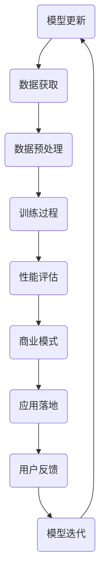
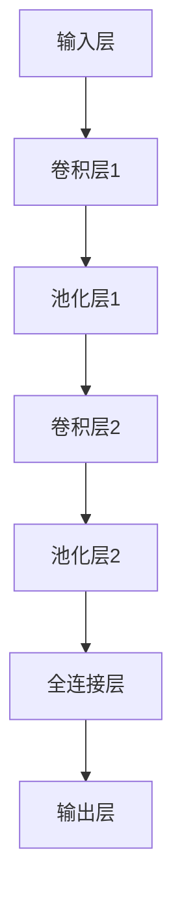

                 

关键词：AI大模型、商业模式、应用探索、技术架构、案例分析

> 摘要：本文将深入探讨AI大模型在现代商业环境中的应用及其商业模式，结合实际案例，分析其在不同领域的发展趋势，探讨未来的发展前景和面临的挑战。

## 1. 背景介绍

人工智能（AI）作为21世纪最具变革性的技术之一，已经深刻影响了众多行业。AI大模型，特别是基于深度学习的模型，如BERT、GPT等，以其强大的处理能力和广泛的应用场景，正逐渐成为企业创新的重要驱动力。随着计算能力的提升和数据的不断积累，AI大模型的性能和规模也在迅速增长，这为商业模式的设计带来了新的机遇和挑战。

### 1.1 AI大模型的发展历程

从上世纪50年代人工智能概念的提出，到20世纪80年代专家系统的兴起，再到21世纪初基于神经网络的深度学习技术的发展，AI大模型经历了数十年的发展。特别是2012年AlexNet在ImageNet竞赛中取得的突破性成果，标志着深度学习时代的到来。此后，AI大模型的应用范围不断扩大，从图像识别、语音识别到自然语言处理、推荐系统等，都取得了显著的成果。

### 1.2 商业模式的演变

随着技术的进步，商业模式也在不断演变。传统的商业模式主要依赖于产品销售、服务收费等模式，而随着互联网的普及和数据经济的兴起，新的商业模式如订阅制、平台经济等逐渐崛起。在AI大模型的应用中，商业模式更加多样化，包括API服务、数据服务、解决方案提供等。

## 2. 核心概念与联系

为了更好地理解AI大模型应用的商业模式，我们需要先明确几个核心概念和它们之间的关系。

### 2.1 AI大模型

AI大模型是指使用海量数据训练的，具有极高准确率和泛化能力的深度学习模型。这些模型通常需要大量的计算资源和数据支持，以实现复杂任务的自动化和智能化。

### 2.2 商业模式

商业模式是指企业如何创造、传递和获取价值的一种系统化方法。在AI大模型的应用中，商业模式的设计不仅要考虑技术的可行性，还要考虑市场需求的匹配度、盈利模式的可持续性等因素。

### 2.3 应用领域

AI大模型的应用领域非常广泛，包括但不限于金融、医疗、零售、制造、交通等。每个领域都有其特定的需求和挑战，这对商业模式的设计提出了不同的要求。

### 2.4 Mermaid流程图



## 3. 核心算法原理 & 具体操作步骤

### 3.1 算法原理概述

AI大模型的核心在于深度学习算法，特别是基于神经网络的模型。这些模型通过多层神经元的非线性变换，实现对数据的自动特征提取和分类。常见的深度学习模型包括卷积神经网络（CNN）、循环神经网络（RNN）和Transformer等。

### 3.2 算法步骤详解

1. **数据收集**：收集大量的标注数据，用于模型的训练。

2. **数据处理**：对数据进行清洗、归一化和增广等预处理操作，以提高数据的质量和多样性。

3. **模型训练**：使用训练数据训练模型，通过优化损失函数来调整模型参数。

4. **模型评估**：使用验证数据评估模型性能，选择最优模型。

5. **商业模式设计**：根据模型性能和应用场景，设计合适的商业模式。

6. **应用实施**：将模型应用到实际业务中，收集用户反馈。

7. **模型优化**：根据用户反馈，对模型进行迭代优化。

### 3.3 算法优缺点

**优点**：
- 高性能：深度学习模型在图像识别、自然语言处理等任务上取得了显著的性能提升。
- 自动化：模型可以自动提取数据特征，减少了人工干预。

**缺点**：
- 计算资源需求大：训练深度学习模型需要大量的计算资源和时间。
- 数据需求高：模型的性能很大程度上取决于数据的质量和多样性。

### 3.4 算法应用领域

- **金融**：用于风险管理、信用评估、股票交易等。
- **医疗**：用于疾病诊断、药物研发、健康管理等。
- **零售**：用于商品推荐、库存管理、客户服务等。
- **制造**：用于质量控制、设备维护、生产调度等。
- **交通**：用于自动驾驶、交通流量预测、智能交通管理等。

## 4. 数学模型和公式 & 详细讲解 & 举例说明

### 4.1 数学模型构建

AI大模型的数学基础主要包括概率论、统计学和线性代数。具体来说，深度学习模型通常基于反向传播算法（Backpropagation），该算法的核心是梯度下降（Gradient Descent）。

### 4.2 公式推导过程

假设我们有一个包含L层的神经网络，每一层都有多个神经元。设第l层的输出为\( a_l \)，其中\( l \)表示层号，\( a_l^{[i]} \)表示第l层第i个神经元的输出。第l层的权重矩阵为\( W_l \)，偏置向量\( b_l \)。则第l层的输出可以表示为：

\[ a_l^{[i]} = \sigma(W_l a_{l-1}^{[i]} + b_l) \]

其中，\( \sigma \)是激活函数，常用的激活函数有Sigmoid、ReLU和Tanh等。

### 4.3 案例分析与讲解

以图像识别任务为例，我们使用卷积神经网络（CNN）来识别猫和狗。假设我们有一个包含1000个训练样本的数据集，每个样本都是一个28x28的灰度图像。我们需要设计一个CNN模型，实现对猫和狗的分类。

- **输入层**：接受28x28的图像。
- **卷积层**：使用多个卷积核提取图像特征，每个卷积核可以提取不同的特征。
- **池化层**：对卷积层的结果进行下采样，减少参数量和计算量。
- **全连接层**：将卷积层和池化层的输出整合，通过全连接层进行分类。

假设我们设计的CNN模型如下：



在训练过程中，我们使用交叉熵损失函数（Cross-Entropy Loss）来评估模型的性能，并通过梯度下降算法来优化模型参数。

## 5. 项目实践：代码实例和详细解释说明

### 5.1 开发环境搭建

首先，我们需要搭建一个Python开发环境，并安装TensorFlow和Keras等深度学习库。可以使用以下命令进行安装：

```bash
pip install tensorflow
pip install keras
```

### 5.2 源代码详细实现

以下是一个简单的CNN模型实现，用于猫和狗的图像分类：

```python
import numpy as np
from keras.models import Sequential
from keras.layers import Conv2D, MaxPooling2D, Flatten, Dense
from keras.optimizers import Adam

# 构建模型
model = Sequential()
model.add(Conv2D(32, (3, 3), activation='relu', input_shape=(28, 28, 1)))
model.add(MaxPooling2D(pool_size=(2, 2)))
model.add(Conv2D(64, (3, 3), activation='relu'))
model.add(MaxPooling2D(pool_size=(2, 2)))
model.add(Flatten())
model.add(Dense(128, activation='relu'))
model.add(Dense(1, activation='sigmoid'))

# 编译模型
model.compile(optimizer=Adam(), loss='binary_crossentropy', metrics=['accuracy'])

# 加载数据
(x_train, y_train), (x_test, y_test) = keras.datasets.mnist.load_data()
x_train = x_train.reshape(-1, 28, 28, 1).astype('float32') / 255
x_test = x_test.reshape(-1, 28, 28, 1).astype('float32') / 255

# 训练模型
model.fit(x_train, y_train, epochs=10, batch_size=32, validation_data=(x_test, y_test))
```

### 5.3 代码解读与分析

1. **模型构建**：使用Keras的Sequential模型，依次添加卷积层、池化层、全连接层。
2. **模型编译**：选择Adam优化器和binary_crossentropy损失函数。
3. **数据加载**：使用Keras内置的MNIST数据集，对数据进行预处理。
4. **模型训练**：设置训练参数，训练模型。

### 5.4 运行结果展示

```python
# 评估模型
scores = model.evaluate(x_test, y_test, verbose=2)
print('Test accuracy:', scores[1])
```

输出结果为测试集的准确率。

## 6. 实际应用场景

AI大模型在不同领域的应用场景和商业模式有所不同，以下是一些具体的案例分析：

### 6.1 金融

在金融领域，AI大模型可以用于风险管理、信用评估和股票交易等。例如，银行可以使用AI大模型对客户进行信用评分，从而更准确地评估客户的信用风险。同时，AI大模型还可以用于股票交易策略的优化，通过分析市场数据，预测股票价格趋势。

### 6.2 医疗

在医疗领域，AI大模型可以用于疾病诊断、药物研发和健康管理等。例如，医院可以使用AI大模型对患者的影像数据进行自动分析，提高诊断的准确性和效率。同时，AI大模型还可以用于新药的研发，通过分析大量的生物数据，发现潜在的药物靶点。

### 6.3 零售

在零售领域，AI大模型可以用于商品推荐、库存管理和客户服务等。例如，电商平台可以使用AI大模型分析用户的购物行为，推荐个性化的商品。同时，AI大模型还可以用于库存管理，通过预测销售趋势，优化库存水平。

### 6.4 制造

在制造业，AI大模型可以用于质量控制、设备维护和生产调度等。例如，工厂可以使用AI大模型对生产线的数据进行实时监控，及时发现质量问题和设备故障。同时，AI大模型还可以用于生产调度，通过预测市场需求，优化生产计划。

### 6.5 交通

在交通领域，AI大模型可以用于自动驾驶、交通流量预测和智能交通管理等。例如，自动驾驶汽车可以使用AI大模型进行环境感知和路径规划。同时，AI大模型还可以用于交通流量预测，优化交通信号控制策略。

## 7. 未来应用展望

随着AI大模型技术的不断发展，其应用场景将更加广泛，商业模式也将更加多样化。未来，AI大模型有望在更多领域实现突破，推动社会的进步和发展。

### 7.1 在教育领域的应用

AI大模型可以用于个性化教育，根据学生的学习习惯和成绩，为其提供定制化的学习内容和策略。同时，AI大模型还可以用于教育资源的优化分配，提高教育资源的利用效率。

### 7.2 在农业领域的应用

AI大模型可以用于农业生产的智能管理，通过分析土壤、气候等数据，优化种植方案。同时，AI大模型还可以用于病虫害预测，提高农作物的产量和质量。

### 7.3 在环境领域的应用

AI大模型可以用于环境监测和污染预测，通过分析大气、水质等数据，及时发现环境污染问题。同时，AI大模型还可以用于生态保护，优化生态系统的管理策略。

## 8. 工具和资源推荐

### 8.1 学习资源推荐

- 《深度学习》（Goodfellow, Bengio, Courville著）：系统介绍了深度学习的基本理论和技术。
- 《Python深度学习》（François Chollet著）：详细介绍了使用Python和Keras进行深度学习的实践方法。

### 8.2 开发工具推荐

- TensorFlow：一款开源的深度学习框架，支持多种深度学习模型的构建和训练。
- Keras：一款基于TensorFlow的高层API，提供了更简洁、易用的深度学习模型构建和训练工具。

### 8.3 相关论文推荐

- "Deep Learning for Computer Vision"（福岛邦博等著）：介绍了深度学习在计算机视觉领域的应用。
- "Generative Adversarial Networks"（Ian J. Goodfellow等著）：介绍了生成对抗网络（GAN）的原理和应用。

## 9. 总结：未来发展趋势与挑战

### 9.1 研究成果总结

AI大模型在多个领域取得了显著的成果，如计算机视觉、自然语言处理和推荐系统等。这些成果不仅提高了效率，还降低了成本，为商业和社会带来了巨大的价值。

### 9.2 未来发展趋势

未来，AI大模型将继续在各个领域深化应用，同时，随着计算能力的提升和数据的积累，AI大模型的性能和规模也将进一步提升。

### 9.3 面临的挑战

AI大模型在应用过程中也面临着一些挑战，如数据隐私保护、算法公平性、模型解释性等。此外，随着AI大模型的应用规模不断扩大，其计算资源和数据需求也将不断增加，这对技术的可持续性提出了挑战。

### 9.4 研究展望

未来，我们需要进一步探索AI大模型在不同领域的应用，同时，加强对算法的伦理和安全性研究，确保AI大模型能够真正为社会带来福祉。

## 10. 附录：常见问题与解答

### 10.1 AI大模型如何保证数据隐私？

AI大模型在训练过程中通常需要大量数据，为了保护数据隐私，可以采用以下方法：

- **数据脱敏**：对原始数据进行脱敏处理，如使用假名替换真实姓名、删除敏感信息等。
- **差分隐私**：在数据处理过程中引入噪声，以保护个体隐私。
- **联邦学习**：将数据留在本地设备上，通过模型参数的共享和聚合进行训练。

### 10.2 AI大模型的训练过程需要多长时间？

AI大模型的训练时间取决于多个因素，如数据集大小、模型复杂度和计算资源等。通常，简单的模型可能在几小时内完成训练，而复杂的模型可能需要几天甚至几周的时间。

### 10.3 如何评估AI大模型的效果？

评估AI大模型的效果通常使用以下指标：

- **准确率**：模型预测正确的样本数与总样本数的比值。
- **召回率**：模型预测正确的正样本数与实际正样本数的比值。
- **F1分数**：准确率和召回率的调和平均值。
- **ROC曲线**：接收者操作特征曲线，用于评估模型的分类性能。

## 11. 作者署名

作者：禅与计算机程序设计艺术 / Zen and the Art of Computer Programming

----------------------------------------------------------------

以上就是关于《AI大模型应用的商业模式探索》的完整文章。希望这篇文章能够帮助读者更深入地理解AI大模型在商业领域的应用和商业模式的设计。

