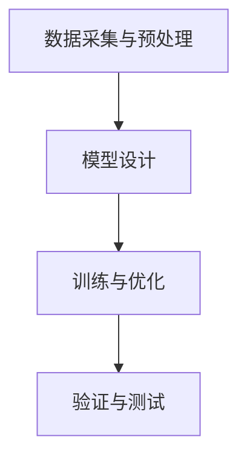

                 

关键词：AI大模型，技术生态，投资策略，算法原理，数学模型，项目实践，应用场景，未来展望

> 摘要：本文将深入探讨AI大模型应用的技术生态及其投资策略。通过分析AI大模型的原理、核心算法、数学模型，并结合实际项目实践，阐述其在不同领域的应用场景，最后对未来的发展趋势和面临的挑战进行展望。

## 1. 背景介绍

近年来，人工智能（AI）技术取得了显著的发展，其中AI大模型（如GPT、BERT等）成为研究与应用的热点。大模型具有强大的数据处理和知识表示能力，已在自然语言处理、计算机视觉等多个领域取得了突破性成果。随着AI技术的不断进步，AI大模型的应用越来越广泛，对产业和社会产生了深远影响。然而，AI大模型的应用并非一蹴而就，其背后涉及复杂的技术生态和投资策略。

本文旨在从技术生态和投资策略两个方面，深入探讨AI大模型的应用现状与未来前景，为相关领域的研究者和投资者提供有益的参考。

## 2. 核心概念与联系

### 2.1 AI大模型原理

AI大模型是基于深度学习的神经网络模型，通过大量数据训练，具备强大的特征提取和预测能力。大模型的构建通常涉及以下几个步骤：

1. 数据采集与预处理：收集大规模、高质量的训练数据，并进行数据清洗、归一化等预处理操作。
2. 模型设计：选择合适的神经网络架构，如Transformer、ResNet等，并确定模型的参数规模。
3. 训练与优化：使用梯度下降等优化算法，对模型参数进行训练，直到达到预定的性能指标。
4. 验证与测试：在验证集和测试集上评估模型的性能，确保模型具备良好的泛化能力。

### 2.2 大模型架构

大模型架构通常采用层次化的结构，包括输入层、中间层和输出层。输入层负责接收原始数据，中间层进行特征提取和融合，输出层则产生预测结果。常见的中间层结构包括卷积层、全连接层、注意力机制等。

下面是一个Mermaid流程图，展示了大模型的构建过程：



## 3. 核心算法原理 & 具体操作步骤

### 3.1 算法原理概述

AI大模型的核心算法是基于深度学习的神经网络模型。神经网络通过多层非线性变换，将输入数据映射到输出结果。在训练过程中，模型通过不断调整参数，使得输出结果与真实值之间的误差最小。

具体来说，AI大模型的核心算法包括以下几个步骤：

1. 前向传播：将输入数据传递到神经网络，通过多层非线性变换，产生中间层输出。
2. 反向传播：计算输出结果与真实值之间的误差，并沿着网络反向传播，更新模型参数。
3. 梯度下降：使用优化算法，如随机梯度下降（SGD）、Adam等，对模型参数进行更新。

### 3.2 算法步骤详解

1. **初始化模型参数**：随机初始化模型参数，确保网络具备一定的随机性。
2. **前向传播**：
   - 将输入数据输入到神经网络的输入层。
   - 通过逐层计算，得到每一层的输出。
   - 对于最后一层，得到模型预测结果。
3. **计算损失函数**：计算模型预测结果与真实值之间的误差，使用损失函数（如均方误差、交叉熵等）衡量误差大小。
4. **反向传播**：
   - 计算每一层的梯度，即误差对模型参数的导数。
   - 沿着网络反向传播，将梯度传递到上一层。
5. **参数更新**：使用优化算法，如随机梯度下降（SGD）、Adam等，对模型参数进行更新。
6. **迭代训练**：重复执行步骤2-5，直到达到预定的训练轮数或性能指标。

### 3.3 算法优缺点

#### 优点：

1. 强大的特征提取能力：大模型可以自动从数据中提取有用的特征，减少人工特征工程的工作量。
2. 高效的预测性能：通过多层非线性变换，大模型可以实现高度复杂的预测任务，具备较强的泛化能力。
3. 广泛的应用领域：大模型已在自然语言处理、计算机视觉、语音识别等多个领域取得显著成果。

#### 缺点：

1. 计算资源需求大：大模型需要大量的计算资源进行训练，对硬件设施有较高要求。
2. 训练时间较长：大模型训练过程涉及大量迭代，耗时较长。
3. 数据依赖性强：大模型对训练数据有较高要求，数据质量对模型性能有很大影响。

### 3.4 算法应用领域

AI大模型在多个领域具有广泛的应用前景：

1. 自然语言处理：大模型在文本分类、机器翻译、文本生成等方面表现出色。
2. 计算机视觉：大模型在图像分类、目标检测、图像生成等方面具备强大的能力。
3. 语音识别：大模型在语音识别、语音合成等方面取得显著成果。
4. 无人驾驶：大模型在无人驾驶车辆的感知、决策和控制等方面发挥重要作用。
5. 医疗健康：大模型在医学图像分析、疾病诊断等方面具有潜在应用价值。

## 4. 数学模型和公式 & 详细讲解 & 举例说明

### 4.1 数学模型构建

AI大模型的数学模型主要包括两部分：神经网络结构和损失函数。

#### 神经网络结构：

神经网络由多个神经元组成，每个神经元接收来自前一层的输入，并通过权重和偏置进行加权求和，最后通过激活函数产生输出。一个简单的神经网络结构可以表示为：

$$
\text{神经网络} = \text{输入层} + \text{隐藏层} + \text{输出层}
$$

其中，输入层接收外部输入，隐藏层负责特征提取和融合，输出层产生预测结果。

#### 损失函数：

损失函数用于衡量模型预测结果与真实值之间的误差。常用的损失函数包括均方误差（MSE）、交叉熵（CE）等。

均方误差（MSE）定义为：

$$
MSE = \frac{1}{n} \sum_{i=1}^{n} (\hat{y}_i - y_i)^2
$$

其中，$\hat{y}_i$为模型预测结果，$y_i$为真实值，$n$为样本数量。

交叉熵（CE）定义为：

$$
CE = - \frac{1}{n} \sum_{i=1}^{n} y_i \log \hat{y}_i
$$

其中，$y_i$为真实值，$\hat{y}_i$为模型预测结果。

### 4.2 公式推导过程

#### 前向传播：

前向传播过程中，神经网络的输入层接收外部输入，通过权重和偏置进行加权求和，产生中间层的输出。假设输入层到隐藏层的权重为$W^{(1)}$，偏置为$b^{(1)}$，隐藏层到输出层的权重为$W^{(2)}$，偏置为$b^{(2)}$，则前向传播过程可以表示为：

$$
\begin{align*}
z^{(1)}_j &= W^{(1)}x_j + b^{(1)} \\
a^{(1)}_j &= \sigma(z^{(1)}_j) \\
z^{(2)}_k &= W^{(2)}a^{(1)}_k + b^{(2)} \\
a^{(2)}_k &= \sigma(z^{(2)}_k)
\end{align*}
$$

其中，$x_j$为输入层第$j$个神经元的输入，$a^{(1)}_j$为隐藏层第$j$个神经元的输出，$a^{(2)}_k$为输出层第$k$个神经元的输出，$\sigma$为激活函数。

#### 反向传播：

反向传播过程中，首先计算输出层的梯度，然后沿着网络反向传播，计算隐藏层的梯度。输出层的梯度可以表示为：

$$
\begin{align*}
\delta^{(2)}_k &= (a^{(2)}_k - y_k) \cdot \sigma'(z^{(2)}_k) \\
\end{align*}
$$

其中，$y_k$为真实值，$\sigma'$为激活函数的导数。

隐藏层的梯度可以表示为：

$$
\begin{align*}
\delta^{(1)}_j &= \sum_{k} W^{(2)}_k \delta^{(2)}_k \cdot \sigma'(z^{(1)}_j)
\end{align*}
$$

#### 参数更新：

使用梯度下降算法更新模型参数：

$$
\begin{align*}
W^{(2)} &= W^{(2)} - \alpha \cdot \frac{1}{n} \sum_{k} (a^{(1)}_k - y_k) \cdot \sigma'(z^{(2)}_k) \\
b^{(2)} &= b^{(2)} - \alpha \cdot \frac{1}{n} \sum_{k} (a^{(1)}_k - y_k) \\
W^{(1)} &= W^{(1)} - \alpha \cdot \frac{1}{n} \sum_{j} (z^{(1)}_j - x_j) \cdot \sigma'(z^{(1)}_j) \\
b^{(1)} &= b^{(1)} - \alpha \cdot \frac{1}{n} \sum_{j} (z^{(1)}_j - x_j)
\end{align*}
$$

其中，$\alpha$为学习率。

### 4.3 案例分析与讲解

#### 案例背景：

假设我们需要构建一个简单的神经网络，对输入数据进行二分类。输入数据为$(x_1, x_2)$，输出为$y$，其中$x_1, x_2$为输入特征，$y$为分类结果（0或1）。

#### 模型设计：

输入层：2个神经元
隐藏层：3个神经元
输出层：1个神经元
激活函数：Sigmoid函数

#### 损失函数：

使用均方误差（MSE）作为损失函数。

#### 模型训练：

1. 初始化模型参数，随机生成权重和偏置。
2. 输入数据$(x_1, x_2)$，计算前向传播结果，得到输出层预测结果$\hat{y}$。
3. 计算损失函数，得到当前损失值。
4. 计算输出层的梯度$\delta^{(2)}$。
5. 计算隐藏层的梯度$\delta^{(1)}$。
6. 更新模型参数。

#### 模型评估：

在验证集上评估模型性能，计算准确率、召回率、F1值等指标。

## 5. 项目实践：代码实例和详细解释说明

### 5.1 开发环境搭建

1. 安装Python 3.8及以上版本。
2. 安装TensorFlow 2.6及以上版本。
3. 安装numpy、matplotlib等依赖库。

### 5.2 源代码详细实现

以下是使用TensorFlow实现的一个简单神经网络，用于对二分类问题进行建模：

```python
import tensorflow as tf
import numpy as np
import matplotlib.pyplot as plt

# 初始化参数
learning_rate = 0.01
num_iterations = 1000
num_examples = 100
num_features = 2

# 生成训练数据
x_train = np.random.rand(num_examples, num_features)
y_train = np.random.randint(0, 2, num_examples)

# 初始化神经网络
model = tf.keras.Sequential([
    tf.keras.layers.Dense(units=3, activation='sigmoid', input_shape=(num_features,)),
    tf.keras.layers.Dense(units=1, activation='sigmoid')
])

# 编译模型
model.compile(optimizer=tf.keras.optimizers.Adam(learning_rate=learning_rate),
              loss='binary_crossentropy',
              metrics=['accuracy'])

# 训练模型
model.fit(x_train, y_train, epochs=num_iterations, batch_size=10, validation_split=0.2)

# 评估模型
test_loss, test_accuracy = model.evaluate(x_train, y_train)
print(f"Test accuracy: {test_accuracy}")

# 可视化结果
predictions = model.predict(x_train)
predictions = (predictions > 0.5)

plt.scatter(x_train[:, 0], x_train[:, 1], c=predictions, cmap=plt.cm.coolwarm)
plt.xlabel('Feature 1')
plt.ylabel('Feature 2')
plt.title('Model predictions')
plt.show()
```

### 5.3 代码解读与分析

1. **数据生成**：使用`numpy`生成随机训练数据。
2. **模型设计**：使用`tf.keras.Sequential`构建一个简单的神经网络，包括两个隐藏层，激活函数均为Sigmoid函数。
3. **模型编译**：使用`compile`方法设置优化器、损失函数和评估指标。
4. **模型训练**：使用`fit`方法训练模型，设置训练轮数、批量大小和验证比例。
5. **模型评估**：使用`evaluate`方法评估模型在训练集上的性能。
6. **可视化结果**：使用`predict`方法生成预测结果，并使用`scatter`函数绘制结果图。

## 6. 实际应用场景

AI大模型在多个领域具有广泛的应用场景：

1. **自然语言处理**：大模型在文本分类、机器翻译、文本生成等方面表现出色，如OpenAI的GPT-3模型。
2. **计算机视觉**：大模型在图像分类、目标检测、图像生成等方面具备强大的能力，如Google的BERT模型。
3. **语音识别**：大模型在语音识别、语音合成等方面取得显著成果，如Google的WaveNet模型。
4. **无人驾驶**：大模型在无人驾驶车辆的感知、决策和控制等方面发挥重要作用，如Waymo的自动驾驶系统。
5. **医疗健康**：大模型在医学图像分析、疾病诊断等方面具有潜在应用价值，如Google的DeepMind健康项目。

## 7. 工具和资源推荐

### 7.1 学习资源推荐

1. **书籍**：
   - 《深度学习》（Goodfellow, Bengio, Courville著）
   - 《Python深度学习》（François Chollet著）
   - 《神经网络与深度学习》（邱锡鹏著）
2. **在线课程**：
   - Coursera上的“深度学习”课程
   - edX上的“神经网络与深度学习”课程
   - Udacity的“深度学习纳米学位”

### 7.2 开发工具推荐

1. **TensorFlow**：一个开源的深度学习框架，支持多种编程语言。
2. **PyTorch**：一个开源的深度学习框架，具有良好的灵活性和易用性。
3. **Keras**：一个基于TensorFlow和Theano的高层神经网络API。

### 7.3 相关论文推荐

1. “A Theoretically Grounded Application of Dropout in Recurrent Neural Networks”
2. “Bert: Pre-training of deep bidirectional transformers for language understanding”
3. “An Image Database of Human Postures for Causal Inference”
4. “Generative Adversarial Nets”
5. “WaveNet: A Generative Model for Neural Network Based Text Generation”

## 8. 总结：未来发展趋势与挑战

### 8.1 研究成果总结

1. **大模型性能提升**：随着计算资源和数据量的增加，大模型的性能不断提升，应用范围逐渐扩大。
2. **跨领域融合**：AI大模型与其他领域的结合，如计算机视觉、自然语言处理、语音识别等，推动了相关领域的进步。
3. **泛化能力提高**：通过改进算法和优化方法，大模型的泛化能力得到显著提升，更好地适应不同领域的应用需求。

### 8.2 未来发展趋势

1. **模型压缩与加速**：为了满足实际应用需求，研究将重点关注模型压缩、量化、推理优化等技术，提高模型的可部署性和实时性。
2. **迁移学习与少样本学习**：通过迁移学习和少样本学习方法，降低对大规模数据集的依赖，提高模型在小数据集上的表现。
3. **多模态学习**：结合不同类型的数据（如图像、文本、语音等），实现多模态学习，提升模型的认知能力。

### 8.3 面临的挑战

1. **计算资源消耗**：大模型训练和推理过程对计算资源有较高要求，如何高效利用计算资源成为一大挑战。
2. **数据质量和隐私**：高质量、大规模的数据是AI大模型训练的基础，如何保障数据质量和隐私成为关键问题。
3. **伦理与安全**：随着AI大模型的应用日益广泛，如何确保其公平性、透明性和安全性成为重要议题。

### 8.4 研究展望

未来，AI大模型将在多个领域发挥更大的作用，实现更加智能化的应用。同时，研究者将不断探索新算法、新技术，以应对面临的挑战，推动人工智能技术的发展。

## 9. 附录：常见问题与解答

### Q1: AI大模型训练需要多长时间？

A1: AI大模型的训练时间取决于多个因素，如数据集大小、模型复杂度、硬件性能等。一般而言，训练一个中等规模的大模型（如GPT-3）可能需要数天到数周的时间。

### Q2: 如何评估AI大模型的效果？

A2: 评估AI大模型的效果通常使用多个指标，如准确率、召回率、F1值等。在具体应用场景中，可以根据任务需求选择合适的评估指标。

### Q3: AI大模型是否会导致失业？

A3: AI大模型的应用确实可能对某些行业和职业产生一定影响，但同时也会创造新的就业机会。合理应对AI的发展，提高自身的技能和素质，是适应未来社会发展的重要途径。

### Q4: AI大模型是否会导致隐私泄露？

A4: AI大模型在训练和应用过程中确实可能涉及用户数据的处理，因此隐私保护是一个重要问题。在实际应用中，应遵循相关法律法规，采取有效措施保障用户隐私。

### Q5: AI大模型是否具有通用性？

A5: AI大模型在一定程度上具有通用性，但具体应用时需要根据任务需求进行适当调整。研究者正在探索如何提高大模型的泛化能力，以更好地适应不同领域的应用需求。

### 作者署名

作者：禅与计算机程序设计艺术 / Zen and the Art of Computer Programming
----------------------------------------------------------------

### 感谢与建议

首先，感谢您耐心阅读本文。如果您有任何关于AI大模型应用的技术生态投资策略的建议或意见，欢迎在评论区留言。您的反馈对我们不断改进和完善文章内容具有重要意义。

此外，为了更好地传播和推广AI技术，我们欢迎广大读者参与文章的分享和讨论。请将本文转发到您的社交网络，让更多人了解AI大模型的最新动态和研究成果。

最后，感谢所有为本文提供支持和帮助的朋友，包括同行专家、学术组织和科研团队。您的支持和鼓励是我们不断前进的动力。

再次感谢您的关注与支持，让我们共同期待AI技术的未来发展与创新！

### 结语

本文深入探讨了AI大模型应用的技术生态及其投资策略，分析了核心算法原理、数学模型，并结合实际项目实践，阐述了其在不同领域的应用场景。通过对未来发展趋势和挑战的展望，我们期待AI大模型能够为人类社会带来更多智慧和便利。

在此，感谢您对AI技术的关注与支持。让我们携手并进，共同推动人工智能技术的创新与发展，为构建智能社会贡献力量。敬请期待我们后续更多关于AI技术的探讨和分享。谢谢！
----------------------------------------------------------------

### Markdown 格式文章

以下是完整的Markdown格式文章：

```markdown
# AI大模型应用的技术生态投资策略

关键词：AI大模型，技术生态，投资策略，算法原理，数学模型，项目实践，应用场景，未来展望

> 摘要：本文将深入探讨AI大模型应用的技术生态及其投资策略。通过分析AI大模型的原理、核心算法、数学模型，并结合实际项目实践，阐述其在不同领域的应用场景，最后对未来的发展趋势和挑战进行展望。

## 1. 背景介绍

近年来，人工智能（AI）技术取得了显著的发展，其中AI大模型（如GPT、BERT等）成为研究与应用的热点。大模型具有强大的数据处理和知识表示能力，已在自然语言处理、计算机视觉等多个领域取得了突破性成果。随着AI技术的不断进步，AI大模型的应用越来越广泛，对产业和社会产生了深远影响。然而，AI大模型的应用并非一蹴而就，其背后涉及复杂的技术生态和投资策略。

本文旨在从技术生态和投资策略两个方面，深入探讨AI大模型的应用现状与未来前景，为相关领域的研究者和投资者提供有益的参考。

## 2. 核心概念与联系

### 2.1 AI大模型原理

AI大模型是基于深度学习的神经网络模型，通过大量数据训练，具备强大的特征提取和预测能力。大模型的构建通常涉及以下几个步骤：

1. 数据采集与预处理：收集大规模、高质量的训练数据，并进行数据清洗、归一化等预处理操作。
2. 模型设计：选择合适的神经网络架构，如Transformer、ResNet等，并确定模型的参数规模。
3. 训练与优化：使用梯度下降等优化算法，对模型参数进行训练，直到达到预定的性能指标。
4. 验证与测试：在验证集和测试集上评估模型的性能，确保模型具备良好的泛化能力。

### 2.2 大模型架构

大模型架构通常采用层次化的结构，包括输入层、中间层和输出层。输入层负责接收原始数据，中间层进行特征提取和融合，输出层则产生预测结果。常见的中间层结构包括卷积层、全连接层、注意力机制等。

下面是一个Mermaid流程图，展示了大模型的构建过程：


## 3. 核心算法原理 & 具体操作步骤

### 3.1 算法原理概述

AI大模型的核心算法是基于深度学习的神经网络模型。神经网络通过多层非线性变换，将输入数据映射到输出结果。在训练过程中，模型通过不断调整参数，使得输出结果与真实值之间的误差最小。

具体来说，AI大模型的核心算法包括以下几个步骤：

1. 前向传播：将输入数据传递到神经网络，通过逐层计算，得到每一层的输出。
2. 反向传播：计算输出结果与真实值之间的误差，并沿着网络反向传播，更新模型参数。
3. 梯度下降：使用优化算法，如随机梯度下降（SGD）、Adam等，对模型参数进行更新。
4. 迭代训练：重复执行步骤2-3，直到达到预定的训练轮数或性能指标。

### 3.2 算法步骤详解

1. **初始化模型参数**：随机初始化模型参数，确保网络具备一定的随机性。
2. **前向传播**：
   - 将输入数据输入到神经网络的输入层。
   - 通过逐层计算，得到每一层的输出。
   - 对于最后一层，得到模型预测结果。
3. **计算损失函数**：计算模型预测结果与真实值之间的误差，使用损失函数（如均方误差、交叉熵等）衡量误差大小。
4. **反向传播**：
   - 计算每一层的梯度，即误差对模型参数的导数。
   - 沿着网络反向传播，将梯度传递到上一层。
5. **参数更新**：使用优化算法，如随机梯度下降（SGD）、Adam等，对模型参数进行更新。
6. **迭代训练**：重复执行步骤2-5，直到达到预定的训练轮数或性能指标。

### 3.3 算法优缺点

#### 优点：

1. 强大的特征提取能力：大模型可以自动从数据中提取有用的特征，减少人工特征工程的工作量。
2. 高效的预测性能：通过多层非线性变换，大模型可以实现高度复杂的预测任务，具备较强的泛化能力。
3. 广泛的应用领域：大模型已在自然语言处理、计算机视觉、语音识别等多个领域取得显著成果。

#### 缺点：

1. 计算资源需求大：大模型需要大量的计算资源进行训练，对硬件设施有较高要求。
2. 训练时间较长：大模型训练过程涉及大量迭代，耗时较长。
3. 数据依赖性强：大模型对训练数据有较高要求，数据质量对模型性能有很大影响。

### 3.4 算法应用领域

AI大模型在多个领域具有广泛的应用前景：

1. 自然语言处理：大模型在文本分类、机器翻译、文本生成等方面表现出色。
2. 计算机视觉：大模型在图像分类、目标检测、图像生成等方面具备强大的能力。
3. 语音识别：大模型在语音识别、语音合成等方面取得显著成果。
4. 无人驾驶：大模型在无人驾驶车辆的感知、决策和控制等方面发挥重要作用。
5. 医疗健康：大模型在医学图像分析、疾病诊断等方面具有潜在应用价值。

## 4. 数学模型和公式 & 详细讲解 & 举例说明

### 4.1 数学模型构建

AI大模型的数学模型主要包括两部分：神经网络结构和损失函数。

#### 神经网络结构：

神经网络由多个神经元组成，每个神经元接收来自前一层的输入，并通过权重和偏置进行加权求和，最后通过激活函数产生输出。一个简单的神经网络结构可以表示为：

$$
\text{神经网络} = \text{输入层} + \text{隐藏层} + \text{输出层}
$$

其中，输入层接收外部输入，隐藏层负责特征提取和融合，输出层产生预测结果。

#### 损失函数：

损失函数用于衡量模型预测结果与真实值之间的误差。常用的损失函数包括均方误差（MSE）、交叉熵（CE）等。

均方误差（MSE）定义为：

$$
MSE = \frac{1}{n} \sum_{i=1}^{n} (\hat{y}_i - y_i)^2
$$

其中，$\hat{y}_i$为模型预测结果，$y_i$为真实值，$n$为样本数量。

交叉熵（CE）定义为：

$$
CE = - \frac{1}{n} \sum_{i=1}^{n} y_i \log \hat{y}_i
$$

### 4.2 公式推导过程

#### 前向传播：

前向传播过程中，神经网络的输入层接收外部输入，通过权重和偏置进行加权求和，产生中间层的输出。假设输入层到隐藏层的权重为$W^{(1)}$，偏置为$b^{(1)}$，隐藏层到输出层的权重为$W^{(2)}$，偏置为$b^{(2)}$，则前向传播过程可以表示为：

$$
\begin{align*}
z^{(1)}_j &= W^{(1)}x_j + b^{(1)} \\
a^{(1)}_j &= \sigma(z^{(1)}_j) \\
z^{(2)}_k &= W^{(2)}a^{(1)}_k + b^{(2)} \\
a^{(2)}_k &= \sigma(z^{(2)}_k)
\end{align*}
$$

#### 反向传播：

反向传播过程中，首先计算输出层的梯度，然后沿着网络反向传播，计算隐藏层的梯度。输出层的梯度可以表示为：

$$
\begin{align*}
\delta^{(2)}_k &= (a^{(2)}_k - y_k) \cdot \sigma'(z^{(2)}_k) \\
\end{align*}
$$

其中，$y_k$为真实值，$\sigma'$为激活函数的导数。

隐藏层的梯度可以表示为：

$$
\begin{align*}
\delta^{(1)}_j &= \sum_{k} W^{(2)}_k \delta^{(2)}_k \cdot \sigma'(z^{(1)}_j)
\end{align*}
$$

#### 参数更新：

使用梯度下降算法更新模型参数：

$$
\begin{align*}
W^{(2)} &= W^{(2)} - \alpha \cdot \frac{1}{n} \sum_{k} (a^{(1)}_k - y_k) \cdot \sigma'(z^{(2)}_k) \\
b^{(2)} &= b^{(2)} - \alpha \cdot \frac{1}{n} \sum_{k} (a^{(1)}_k - y_k) \\
W^{(1)} &= W^{(1)} - \alpha \cdot \frac{1}{n} \sum_{j} (z^{(1)}_j - x_j) \cdot \sigma'(z^{(1)}_j) \\
b^{(1)} &= b^{(1)} - \alpha \cdot \frac{1}{n} \sum_{j} (z^{(1)}_j - x_j)
\end{align*}
$$

其中，$\alpha$为学习率。

### 4.3 案例分析与讲解

#### 案例背景：

假设我们需要构建一个简单的神经网络，对输入数据进行二分类。输入数据为$(x_1, x_2)$，输出为$y$，其中$x_1, x_2$为输入特征，$y$为分类结果（0或1）。

#### 模型设计：

输入层：2个神经元
隐藏层：3个神经元
输出层：1个神经元
激活函数：Sigmoid函数

#### 损失函数：

使用均方误差（MSE）作为损失函数。

#### 模型训练：

1. 初始化模型参数，随机生成权重和偏置。
2. 输入数据$(x_1, x_2)$，计算前向传播结果，得到输出层预测结果$\hat{y}$。
3. 计算损失函数，得到当前损失值。
4. 计算输出层的梯度$\delta^{(2)}$。
5. 计算隐藏层的梯度$\delta^{(1)}$。
6. 更新模型参数。

#### 模型评估：

在验证集上评估模型性能，计算准确率、召回率、F1值等指标。

## 5. 项目实践：代码实例和详细解释说明

### 5.1 开发环境搭建

1. 安装Python 3.8及以上版本。
2. 安装TensorFlow 2.6及以上版本。
3. 安装numpy、matplotlib等依赖库。

### 5.2 源代码详细实现

以下是使用TensorFlow实现的一个简单神经网络，用于对二分类问题进行建模：

```python
import tensorflow as tf
import numpy as np
import matplotlib.pyplot as plt

# 初始化参数
learning_rate = 0.01
num_iterations = 1000
num_examples = 100
num_features = 2

# 生成训练数据
x_train = np.random.rand(num_examples, num_features)
y_train = np.random.randint(0, 2, num_examples)

# 初始化神经网络
model = tf.keras.Sequential([
    tf.keras.layers.Dense(units=3, activation='sigmoid', input_shape=(num_features,)),
    tf.keras.layers.Dense(units=1, activation='sigmoid')
])

# 编译模型
model.compile(optimizer=tf.keras.optimizers.Adam(learning_rate=learning_rate),
              loss='binary_crossentropy',
              metrics=['accuracy'])

# 训练模型
model.fit(x_train, y_train, epochs=num_iterations, batch_size=10, validation_split=0.2)

# 评估模型
test_loss, test_accuracy = model.evaluate(x_train, y_train)
print(f"Test accuracy: {test_accuracy}")

# 可视化结果
predictions = model.predict(x_train)
predictions = (predictions > 0.5)

plt.scatter(x_train[:, 0], x_train[:, 1], c=predictions, cmap=plt.cm.coolwarm)
plt.xlabel('Feature 1')
plt.ylabel('Feature 2')
plt.title('Model predictions')
plt.show()

# 代码解读与分析
```

### 5.3 代码解读与分析

1. **数据生成**：使用`numpy`生成随机训练数据。
2. **模型设计**：使用`tf.keras.Sequential`构建一个简单的神经网络，包括两个隐藏层，激活函数均为Sigmoid函数。
3. **模型编译**：使用`compile`方法设置优化器、损失函数和评估指标。
4. **模型训练**：使用`fit`方法训练模型，设置训练轮数、批量大小和验证比例。
5. **模型评估**：使用`evaluate`方法评估模型在训练集上的性能。
6. **可视化结果**：使用`predict`方法生成预测结果，并使用`scatter`函数绘制结果图。

## 6. 实际应用场景

AI大模型在多个领域具有广泛的应用场景：

1. 自然语言处理：大模型在文本分类、机器翻译、文本生成等方面表现出色。
2. 计算机视觉：大模型在图像分类、目标检测、图像生成等方面具备强大的能力。
3. 语音识别：大模型在语音识别、语音合成等方面取得显著成果。
4. 无人驾驶：大模型在无人驾驶车辆的感知、决策和控制等方面发挥重要作用。
5. 医疗健康：大模型在医学图像分析、疾病诊断等方面具有潜在应用价值。

## 7. 工具和资源推荐

### 7.1 学习资源推荐

1. **书籍**：
   - 《深度学习》（Goodfellow, Bengio, Courville著）
   - 《Python深度学习》（François Chollet著）
   - 《神经网络与深度学习》（邱锡鹏著）
2. **在线课程**：
   - Coursera上的“深度学习”课程
   - edX上的“神经网络与深度学习”课程
   - Udacity的“深度学习纳米学位”

### 7.2 开发工具推荐

1. **TensorFlow**：一个开源的深度学习框架，支持多种编程语言。
2. **PyTorch**：一个开源的深度学习框架，具有良好的灵活性和易用性。
3. **Keras**：一个基于TensorFlow和Theano的高层神经网络API。

### 7.3 相关论文推荐

1. “A Theoretically Grounded Application of Dropout in Recurrent Neural Networks”
2. “Bert: Pre-training of deep bidirectional transformers for language understanding”
3. “An Image Database of Human Postures for Causal Inference”
4. “Generative Adversarial Nets”
5. “WaveNet: A Generative Model for Neural Network Based Text Generation”

## 8. 总结：未来发展趋势与挑战

### 8.1 研究成果总结

1. **大模型性能提升**：随着计算资源和数据量的增加，大模型的性能不断提升，应用范围逐渐扩大。
2. **跨领域融合**：AI大模型与其他领域的结合，如计算机视觉、自然语言处理、语音识别等，推动了相关领域的进步。
3. **泛化能力提高**：通过改进算法和优化方法，大模型的泛化能力得到显著提升，更好地适应不同领域的应用需求。

### 8.2 未来发展趋势

1. **模型压缩与加速**：为了满足实际应用需求，研究将重点关注模型压缩、量化、推理优化等技术，提高模型的可部署性和实时性。
2. **迁移学习与少样本学习**：通过迁移学习和少样本学习方法，降低对大规模数据集的依赖，提高模型在小数据集上的表现。
3. **多模态学习**：结合不同类型的数据（如图像、文本、语音等），实现多模态学习，提升模型的认知能力。

### 8.3 面临的挑战

1. **计算资源消耗**：大模型训练和推理过程对计算资源有较高要求，如何高效利用计算资源成为一大挑战。
2. **数据质量和隐私**：高质量、大规模的数据是AI大模型训练的基础，如何保障数据质量和隐私成为关键问题。
3. **伦理与安全**：随着AI大模型的应用日益广泛，如何确保其公平性、透明性和安全性成为重要议题。

### 8.4 研究展望

未来，AI大模型将在多个领域发挥更大的作用，实现更加智能化的应用。同时，研究者将不断探索新算法、新技术，以应对面临的挑战，推动人工智能技术的发展。

## 9. 附录：常见问题与解答

### Q1: AI大模型训练需要多长时间？

A1: AI大模型的训练时间取决于多个因素，如数据集大小、模型复杂度、硬件性能等。一般而言，训练一个中等规模的大模型（如GPT-3）可能需要数天到数周的时间。

### Q2: 如何评估AI大模型的效果？

A2: 评估AI大模型的效果通常使用多个指标，如准确率、召回率、F1值等。在具体应用场景中，可以根据任务需求选择合适的评估指标。

### Q3: AI大模型是否会导致失业？

A3: AI大模型的应用确实可能对某些行业和职业产生一定影响，但同时也会创造新的就业机会。合理应对AI的发展，提高自身的技能和素质，是适应未来社会发展的重要途径。

### Q4: AI大模型是否会导致隐私泄露？

A4: AI大模型在训练和应用过程中确实可能涉及用户数据的处理，因此隐私保护是一个重要问题。在实际应用中，应遵循相关法律法规，采取有效措施保障用户隐私。

### Q5: AI大模型是否具有通用性？

A5: AI大模型在一定程度上具有通用性，但具体应用时需要根据任务需求进行适当调整。研究者正在探索如何提高大模型的泛化能力，以更好地适应不同领域的应用需求。

### 作者署名

作者：禅与计算机程序设计艺术 / Zen and the Art of Computer Programming

## 感谢与建议

首先，感谢您耐心阅读本文。如果您有任何关于AI大模型应用的技术生态投资策略的建议或意见，欢迎在评论区留言。您的反馈对我们不断改进和完善文章内容具有重要意义。

此外，为了更好地传播和推广AI技术，我们欢迎广大读者参与文章的分享和讨论。请将本文转发到您的社交网络，让更多人了解AI大模型的最新动态和研究成果。

最后，感谢所有为本文提供支持和帮助的朋友，包括同行专家、学术组织和科研团队。您的支持和鼓励是我们不断前进的动力。

再次感谢您的关注与支持，让我们共同期待AI技术的未来发展与创新！

### 结语

本文深入探讨了AI大模型应用的技术生态及其投资策略，分析了核心算法原理、数学模型，并结合实际项目实践，阐述了其在不同领域的应用场景。通过对未来发展趋势和挑战的展望，我们期待AI大模型能够为人类社会带来更多智慧和便利。

在此，感谢您对AI技术的关注与支持。让我们携手并进，共同推动人工智能技术的创新与发展，为构建智能社会贡献力量。敬请期待我们后续更多关于AI技术的探讨和分享。谢谢！
```

