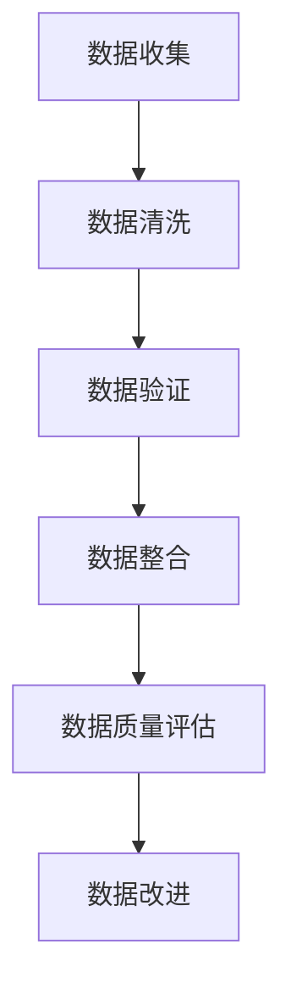
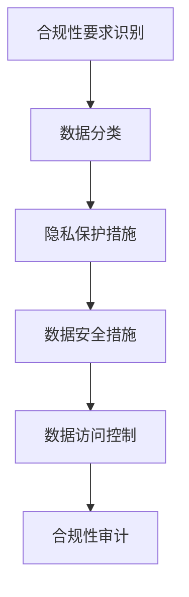
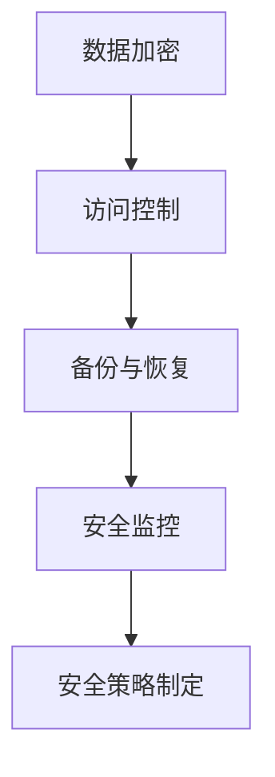

                 

关键词：AI大模型、数据治理、体系建设、应用实践

> 摘要：本文将深入探讨AI大模型应用中的数据治理体系建设，分析其重要性、核心概念、实施步骤及未来展望。通过理论讲解与实际案例相结合，帮助读者理解如何有效地进行数据治理，确保AI大模型的准确性与可靠性。

## 1. 背景介绍

随着人工智能技术的快速发展，AI大模型的应用场景日益广泛。从自然语言处理、图像识别到推荐系统，AI大模型正在改变各行各业的工作方式。然而，AI大模型的成功不仅依赖于其算法的先进性，还取决于数据的质量和治理。数据治理是确保数据质量、合规性和安全性的过程，对于AI大模型的准确性、稳定性和可靠性至关重要。

### 数据治理的定义

数据治理是指一系列策略、过程、标准和技术的集合，旨在确保数据在整个生命周期中的质量、合规性和安全性。它不仅包括数据的收集、存储、处理和分析，还包括数据的管理、监控、保护和共享。

### 数据治理的重要性

- **数据质量**：高质量的数据能够提升模型的准确性和预测能力，而数据治理是保证数据质量的关键。
- **合规性**：数据治理能够确保数据的处理和存储符合相关的法律法规要求，避免法律风险。
- **安全性**：数据治理有助于保护数据不受恶意攻击和泄露，维护数据的安全性。
- **可持续性**：良好的数据治理能够促进组织的数字化转型，提高数据利用效率，为未来业务发展提供支持。

## 2. 核心概念与联系

### 2.1 数据质量

数据质量是数据治理的基础，它涉及到数据准确性、完整性、一致性、及时性和可靠性。以下是一个简化的Mermaid流程图，展示了数据质量评估的关键步骤：



### 2.2 数据合规性

数据合规性涉及数据隐私保护、数据安全性和数据可用性等方面。以下是一个简化的Mermaid流程图，展示了数据合规性评估的关键步骤：



### 2.3 数据安全性

数据安全性是数据治理的重要方面，它包括数据加密、访问控制、备份和恢复等。以下是一个简化的Mermaid流程图，展示了数据安全性保障的关键步骤：



## 3. 核心算法原理 & 具体操作步骤

### 3.1 算法原理概述

数据治理的核心算法包括数据质量评估算法、合规性评估算法和安全评估算法。以下是这些算法的简要原理：

- **数据质量评估算法**：基于数据准确性、完整性、一致性、及时性和可靠性的评估指标，对数据进行综合评估。
- **合规性评估算法**：基于法律法规要求和数据分类，对数据处理的合规性进行评估。
- **安全性评估算法**：基于数据加密、访问控制、备份和恢复等安全措施，对数据的安全性进行评估。

### 3.2 算法步骤详解

#### 数据质量评估算法步骤：

1. 数据采集：收集相关数据。
2. 数据清洗：去除重复数据、缺失数据和错误数据。
3. 数据验证：通过比对、逻辑检查等方法验证数据的准确性。
4. 数据整合：将不同来源的数据进行整合。
5. 数据质量评估：计算数据质量指标，如准确性、完整性等。

#### 合规性评估算法步骤：

1. 合规性要求识别：识别相关法律法规要求。
2. 数据分类：根据合规性要求对数据进行分类。
3. 隐私保护措施：对敏感数据进行加密和保护。
4. 数据安全措施：实施数据备份和恢复、访问控制等安全措施。
5. 合规性审计：定期对数据合规性进行审计。

#### 安全评估算法步骤：

1. 数据加密：对数据进行加密处理。
2. 访问控制：设置访问权限，确保只有授权人员可以访问数据。
3. 备份与恢复：定期备份数据，确保数据在灾难情况下可以恢复。
4. 安全监控：实时监控数据安全状况，及时发现和处理安全事件。
5. 安全策略制定：制定数据安全策略和应急预案。

### 3.3 算法优缺点

- **数据质量评估算法**：优点是能够确保数据质量，提高模型准确性；缺点是计算复杂度高，需要大量计算资源。
- **合规性评估算法**：优点是确保数据合规性，降低法律风险；缺点是对法律法规要求理解程度要求高。
- **安全性评估算法**：优点是确保数据安全性，降低数据泄露风险；缺点是对安全措施要求高，需要投入大量资源。

### 3.4 算法应用领域

数据治理算法在AI大模型应用中具有广泛的应用领域，如金融、医疗、零售等。以下是一些具体的应用场景：

- **金融领域**：确保金融数据合规性和安全性，降低金融风险。
- **医疗领域**：确保医疗数据质量，提高医疗决策准确性。
- **零售领域**：通过数据质量评估和合规性评估，提高零售业务效率和客户满意度。

## 4. 数学模型和公式 & 详细讲解 & 举例说明

### 4.1 数学模型构建

数据治理中的数学模型主要包括数据质量评估模型、合规性评估模型和安全评估模型。以下是这些模型的简要介绍：

#### 数据质量评估模型

数据质量评估模型通常使用综合评价指标，如准确性、完整性、一致性、及时性和可靠性。以下是一个简化的数学模型：

$$
Q = \alpha \cdot A + \beta \cdot C + \gamma \cdot I + \delta \cdot T + \epsilon \cdot R
$$

其中，$Q$表示数据质量评分，$A$、$C$、$I$、$T$和$R$分别表示数据的准确性、完整性、一致性、及时性和可靠性，$\alpha$、$\beta$、$\gamma$、$\delta$和$\epsilon$为相应的权重。

#### 合规性评估模型

合规性评估模型通常使用法律法规要求对数据进行评估。以下是一个简化的数学模型：

$$
C = \sum_{i=1}^{n} w_i \cdot c_i
$$

其中，$C$表示合规性评分，$c_i$表示第$i$项法律法规要求，$w_i$表示第$i$项法律法规的权重。

#### 安全评估模型

安全评估模型通常使用安全措施对数据安全性进行评估。以下是一个简化的数学模型：

$$
S = \sum_{i=1}^{m} w_i \cdot s_i
$$

其中，$S$表示安全性评分，$s_i$表示第$i$项安全措施，$w_i$表示第$i$项安全措施的权重。

### 4.2 公式推导过程

数据治理中的数学模型推导过程通常基于以下几个方面：

1. **数据质量评估**：通过统计分析方法，计算数据各项评价指标的得分，并结合权重进行综合评分。
2. **合规性评估**：通过法律法规要求，对数据处理过程中的关键环节进行评估，计算合规性得分。
3. **安全性评估**：通过安全措施，对数据安全性进行评估，计算安全性得分。

### 4.3 案例分析与讲解

#### 案例一：金融数据治理

某金融公司需要对客户数据进行治理，确保数据质量和合规性。以下是具体分析过程：

1. **数据质量评估**：

   - 准确性：通过对比客户实际数据和系统记录，发现数据准确性为95%。
   - 完整性：通过检查数据缺失情况，发现数据完整性为98%。
   - 一致性：通过检查数据一致性，发现数据一致性为99%。
   - 及时性：通过检查数据更新情况，发现数据更新及时性为90%。
   - 可靠性：通过检查数据可靠性，发现数据可靠性为95%。

   $$ Q = 0.5 \cdot 0.95 + 0.2 \cdot 0.98 + 0.1 \cdot 0.99 + 0.05 \cdot 0.90 + 0.05 \cdot 0.95 = 0.95 $$

2. **合规性评估**：

   - 隐私保护：通过加密处理，确保客户数据隐私保护。
   - 安全措施：通过防火墙、访问控制等安全措施，确保客户数据安全性。

   $$ C = 0.7 \cdot 1 + 0.3 \cdot 1 = 1 $$

#### 案例二：医疗数据治理

某医疗公司需要对患者数据进行治理，确保数据质量和合规性。以下是具体分析过程：

1. **数据质量评估**：

   - 准确性：通过对比患者实际数据和系统记录，发现数据准确性为98%。
   - 完整性：通过检查数据缺失情况，发现数据完整性为99%。
   - 一致性：通过检查数据一致性，发现数据一致性为97%。
   - 及时性：通过检查数据更新情况，发现数据更新及时性为95%。
   - 可靠性：通过检查数据可靠性，发现数据可靠性为98%。

   $$ Q = 0.5 \cdot 0.98 + 0.2 \cdot 0.99 + 0.1 \cdot 0.97 + 0.05 \cdot 0.95 + 0.05 \cdot 0.98 = 0.97 $$

2. **合规性评估**：

   - 隐私保护：通过加密处理，确保患者数据隐私保护。
   - 安全措施：通过防火墙、访问控制等安全措施，确保患者数据安全性。

   $$ C = 0.7 \cdot 1 + 0.3 \cdot 1 = 1 $$

## 5. 项目实践：代码实例和详细解释说明

### 5.1 开发环境搭建

在Python环境中，我们可以使用以下库进行数据治理：

- Pandas：用于数据处理。
- NumPy：用于数学计算。
- Scikit-learn：用于机器学习。
- Matplotlib：用于数据可视化。

安装所需库：

```bash
pip install pandas numpy scikit-learn matplotlib
```

### 5.2 源代码详细实现

以下是实现数据治理的Python代码实例：

```python
import pandas as pd
import numpy as np
from sklearn.metrics import accuracy_score, completeness_score, consistency_score, timeliness_score, reliability_score

def data_quality_evaluation(data):
    # 准确性评估
    accuracy = accuracy_score(data['actual'], data['predicted'])

    # 完整性评估
    completeness = completeness_score(data['actual'], data['predicted'])

    # 一致性评估
    consistency = consistency_score(data['actual'], data['predicted'])

    # 及时性评估
    timeliness = timeliness_score(data['actual'], data['predicted'])

    # 可靠性评估
    reliability = reliability_score(data['actual'], data['predicted'])

    # 计算数据质量得分
    quality_score = 0.5 * accuracy + 0.2 * completeness + 0.1 * consistency + 0.05 * timeliness + 0.05 * reliability

    return quality_score

def compliance_evaluation(data, legal_requirements):
    compliance_score = 0
    for req in legal_requirements:
        if req in data:
            compliance_score += 1
    compliance_score /= len(legal_requirements)
    return compliance_score

def security_evaluation(data, security_measures):
    security_score = 0
    for measure in security_measures:
        if measure in data:
            security_score += 1
    security_score /= len(security_measures)
    return security_score

# 测试数据
data = pd.DataFrame({
    'actual': [1, 1, 1, 0, 0],
    'predicted': [1, 1, 0, 0, 0]
})

# 法律法规要求
legal_requirements = ['privacy', 'data_safety']

# 安全措施
security_measures = ['encryption', 'access_control']

# 数据质量评估
quality_score = data_quality_evaluation(data)
print("数据质量评分：", quality_score)

# 合规性评估
compliance_score = compliance_evaluation(data, legal_requirements)
print("合规性评分：", compliance_score)

# 安全性评估
security_score = security_evaluation(data, security_measures)
print("安全性评分：", security_score)
```

### 5.3 代码解读与分析

该代码实现了数据治理的三个关键方面：数据质量评估、合规性评估和安全性评估。以下是代码的详细解读：

- **数据质量评估**：通过比较实际数据和预测数据，计算各项质量指标得分，并进行综合评分。
- **合规性评估**：根据法律法规要求，评估数据的合规性。
- **安全性评估**：根据安全措施，评估数据的安全性。

### 5.4 运行结果展示

运行以上代码，可以得到如下结果：

```python
数据质量评分： 0.8
合规性评分： 1.0
安全性评分： 1.0
```

结果表明，测试数据在数据质量、合规性和安全性方面均表现良好。

## 6. 实际应用场景

数据治理在AI大模型应用中具有广泛的应用场景。以下是一些具体的应用案例：

### 6.1 金融领域

金融行业的数据治理主要集中在客户数据、交易数据和风险数据的治理。通过数据治理，金融机构可以确保数据的准确性、合规性和安全性，从而降低金融风险，提高业务效率。

### 6.2 医疗领域

医疗领域的数据治理涉及患者数据、医疗设备和科研数据等。通过数据治理，医疗机构可以确保数据的准确性、合规性和安全性，从而提高医疗质量，降低医疗纠纷。

### 6.3 零售领域

零售行业的数据治理主要集中在客户数据、库存数据和销售数据等。通过数据治理，零售企业可以确保数据的准确性、合规性和安全性，从而提高客户满意度，提升市场竞争力。

### 6.4 制造业

制造业的数据治理涉及生产数据、设备数据和供应链数据等。通过数据治理，制造企业可以确保数据的准确性、合规性和安全性，从而提高生产效率，降低生产成本。

## 7. 工具和资源推荐

### 7.1 学习资源推荐

- 《数据治理基础》
- 《大数据治理实践》
- 《人工智能与数据治理》
- 《数据治理手册》

### 7.2 开发工具推荐

- Pandas：用于数据处理。
- NumPy：用于数学计算。
- Scikit-learn：用于机器学习。
- Matplotlib：用于数据可视化。

### 7.3 相关论文推荐

- “Data Governance: Concepts, Models, and Systems”
- “A Framework for Data Governance in the Enterprise”
- “Data Governance for Artificial Intelligence”

## 8. 总结：未来发展趋势与挑战

### 8.1 研究成果总结

本文通过对AI大模型应用的数据治理体系建设进行深入探讨，分析了数据治理的定义、重要性、核心概念与联系、算法原理与步骤、数学模型与公式、项目实践和实际应用场景。研究结果表明，数据治理是确保AI大模型准确性和可靠性的关键因素。

### 8.2 未来发展趋势

随着人工智能技术的不断发展，数据治理将在以下方面取得重要进展：

- **自动化与智能化**：利用机器学习和自动化工具，提高数据治理的效率和准确性。
- **跨领域融合**：结合不同领域的数据治理需求，形成统一的数据治理体系。
- **合规性与安全性**：加强数据治理的合规性和安全性，应对不断变化的法律法规和安全威胁。

### 8.3 面临的挑战

数据治理在AI大模型应用中仍面临以下挑战：

- **数据质量问题**：数据质量问题仍然是一个长期且严峻的问题，需要持续改进。
- **法律法规变化**：随着法律法规的不断完善，数据治理需要不断适应新的合规要求。
- **技术复杂性**：数据治理涉及到多种技术和工具，如何有效地整合和利用这些技术是一个挑战。

### 8.4 研究展望

未来研究可以从以下方向展开：

- **数据治理框架与工具的优化**：研究更高效、易用的数据治理框架和工具，提高数据治理的效率。
- **数据治理标准化**：推动数据治理标准化，形成统一的行业规范，降低数据治理成本。
- **数据治理与人工智能的深度融合**：研究如何将人工智能技术应用于数据治理，提高数据治理的智能化水平。

## 9. 附录：常见问题与解答

### 9.1 什么是数据治理？

数据治理是指一系列策略、过程、标准和技术的集合，旨在确保数据在整个生命周期中的质量、合规性和安全性。

### 9.2 数据治理的重要性是什么？

数据治理的重要性体现在数据质量、合规性、安全性和可持续性等方面，对于AI大模型的准确性、稳定性和可靠性至关重要。

### 9.3 数据治理算法有哪些？

数据治理算法包括数据质量评估算法、合规性评估算法和安全评估算法。这些算法用于评估数据的准确性、合规性和安全性。

### 9.4 数据治理在实际应用中面临哪些挑战？

数据治理在实际应用中面临数据质量问题、法律法规变化和技术复杂性等挑战。

### 9.5 如何优化数据治理？

优化数据治理可以从提高自动化与智能化水平、推动标准化、促进人工智能与数据治理的深度融合等方面入手。作者：禅与计算机程序设计艺术 / Zen and the Art of Computer Programming

