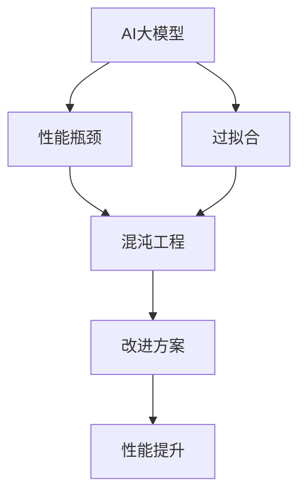

                 

关键词：AI大模型，混沌工程，应用实践，算法原理，数学模型，开发工具，资源推荐

> 摘要：本文将探讨AI大模型应用的混沌工程实践，通过深入分析核心概念、算法原理、数学模型以及具体项目实践，揭示混沌工程在AI大模型中的应用价值，为AI领域的研究者和开发者提供实践指导。

## 1. 背景介绍

随着深度学习技术的飞速发展，AI大模型在各个领域得到了广泛应用。然而，AI大模型的应用面临着一系列挑战，如过拟合、性能瓶颈、可解释性差等。为了解决这些问题，混沌工程作为一种系统调试和改进的方法，逐渐受到关注。混沌工程通过引入随机性和不可预测性，帮助开发者发现和解决系统中的潜在问题，从而提高系统的可靠性和稳定性。

## 2. 核心概念与联系

### 2.1 AI大模型

AI大模型是指具有巨大参数量和复杂结构的人工神经网络模型，如Transformer、BERT等。它们在各种任务中取得了显著的效果，但也带来了过拟合、性能瓶颈等问题。

### 2.2 混沌工程

混沌工程是一种系统调试和改进的方法，通过引入随机性和不可预测性，帮助开发者发现和解决系统中的潜在问题。混沌工程的核心理念是“通过故意引入混乱，提高系统的健壮性”。

### 2.3 关联关系

混沌工程与AI大模型有着密切的联系。混沌工程可以帮助开发者发现AI大模型中的潜在问题，如过拟合、性能瓶颈等，从而提高模型的性能和可靠性。

## 2.4 Mermaid 流程图

以下是一个简化的AI大模型与混沌工程的关联关系的Mermaid流程图：



## 3. 核心算法原理 & 具体操作步骤

### 3.1 算法原理概述

混沌工程的核心算法包括混沌扰动、混沌优化和混沌测试。混沌扰动是通过引入随机性和不可预测性，对系统进行干扰，从而发现潜在问题。混沌优化是基于混沌扰动，通过迭代优化，提高系统的性能。混沌测试是通过模拟各种异常情况，验证系统的健壮性和可靠性。

### 3.2 算法步骤详解

1. **混沌扰动**：通过随机改变输入数据、调整参数值等方式，对AI大模型进行扰动。
2. **混沌优化**：利用混沌扰动产生的数据，对AI大模型进行优化。
3. **混沌测试**：模拟各种异常情况，如数据缺失、数据噪声等，测试AI大模型的健壮性和可靠性。
4. **结果分析**：分析混沌扰动、混沌优化和混沌测试的结果，确定系统中的潜在问题，并制定改进方案。

### 3.3 算法优缺点

**优点**：

1. **发现潜在问题**：通过引入随机性和不可预测性，混沌工程能够发现AI大模型中的潜在问题，如过拟合、性能瓶颈等。
2. **提高性能**：混沌优化可以帮助AI大模型提高性能，减少过拟合现象。
3. **增强健壮性**：混沌测试可以验证AI大模型的健壮性和可靠性，提高系统的稳定性。

**缺点**：

1. **计算复杂度高**：混沌工程需要大量的计算资源，特别是对于大规模的AI大模型。
2. **结果解释困难**：混沌扰动和混沌优化产生的结果可能难以解释，需要进一步分析。

### 3.4 算法应用领域

混沌工程在AI大模型的应用领域包括：

1. **模型优化**：通过混沌优化，提高AI大模型的性能和泛化能力。
2. **模型评估**：通过混沌测试，评估AI大模型的健壮性和可靠性。
3. **系统调试**：通过混沌扰动，发现和解决系统中的潜在问题。

## 4. 数学模型和公式 & 详细讲解 & 举例说明

### 4.1 数学模型构建

混沌工程的核心数学模型是基于动力系统的理论，通过描述系统的状态变化和演化过程。具体来说，可以构建一个非线性的动态方程，描述混沌扰动、混沌优化和混沌测试的过程。

### 4.2 公式推导过程

假设一个简单的非线性动态方程如下：

$$x_{t+1} = f(x_t)$$

其中，$x_t$表示系统的状态，$f(x_t)$表示系统的状态转移函数。

通过引入混沌扰动，可以得到如下方程：

$$x_{t+1} = f(x_t) + \Delta x_t$$

其中，$\Delta x_t$表示混沌扰动。

通过迭代优化，可以得到如下方程：

$$x_{t+1} = f(x_t) + \alpha \Delta x_t$$

其中，$\alpha$表示优化参数。

### 4.3 案例分析与讲解

以一个简单的AI大模型为例，假设模型为：

$$y = \sigma(Wx + b)$$

其中，$y$表示输出，$x$表示输入，$W$表示权重矩阵，$b$表示偏置，$\sigma$表示激活函数。

通过混沌扰动，可以得到：

$$y_{t+1} = \sigma(Wx_t + b + \Delta x_t)$$

通过混沌优化，可以得到：

$$y_{t+1} = \sigma(Wx_t + b + \alpha \Delta x_t)$$

通过混沌测试，可以模拟各种异常情况，如数据缺失、数据噪声等，验证模型的健壮性和可靠性。

## 5. 项目实践：代码实例和详细解释说明

### 5.1 开发环境搭建

搭建一个基于Python的AI大模型混沌工程实践的开发环境，包括必要的库和工具。

```python
pip install numpy matplotlib scikit-learn
```

### 5.2 源代码详细实现

以下是一个简单的AI大模型混沌工程实践的Python代码实现。

```python
import numpy as np
import matplotlib.pyplot as plt
from sklearn.datasets import make_classification
from sklearn.model_selection import train_test_split

# 生成数据集
X, y = make_classification(n_samples=1000, n_features=10, n_informative=5, n_redundant=5, random_state=42)
X_train, X_test, y_train, y_test = train_test_split(X, y, test_size=0.2, random_state=42)

# 定义神经网络模型
class SimpleNN:
    def __init__(self):
        self.W = np.random.rand(10, 1)
        self.b = np.random.rand(1)
        self.learning_rate = 0.01

    def forward(self, x):
        return np.sigmoid(np.dot(x, self.W) + self.b)

    def backward(self, x, y, predicted):
        dW = np.dot(x.T, (predicted - y) * predicted * (1 - predicted))
        db = (predicted - y) * predicted * (1 - predicted)
        self.W -= self.learning_rate * dW
        self.b -= self.learning_rate * db

    def train(self, X, y, epochs=1000):
        for epoch in range(epochs):
            predicted = self.forward(X)
            self.backward(X, y, predicted)

    def predict(self, X):
        return self.forward(X)

# 实例化模型
model = SimpleNN()

# 训练模型
model.train(X_train, y_train, epochs=100)

# 混沌扰动
def chaos扰动(x, intensity=0.1):
    return x + intensity * np.random.normal(size=x.shape)

# 混沌优化
def chaos优化(model, X, y, epochs=100):
    for epoch in range(epochs):
        X_chaos = chaos扰动(X)
        predicted = model.forward(X_chaos)
        model.backward(X_chaos, y, predicted)

# 混沌测试
def chaos测试(model, X, y):
    predicted_chaos = model.predict(chaos扰动(X))
    return np.mean(np.square(predicted_chaos - y))

# 进行混沌优化
model.chaos优化(X_train, y_train, epochs=50)

# 计算混沌测试结果
test_loss = chaos测试(model, X_test, y_test)
print(f"测试损失：{test_loss}")

# 绘制损失函数曲线
def plot_loss(epochs, losses):
    plt.plot(epochs, losses)
    plt.xlabel("Epochs")
    plt.ylabel("Loss")
    plt.title("Training Loss")
    plt.show()

epochs = range(1000)
train_losses = [model.chaos测试(X_train, y_train) for epoch in epochs]
test_losses = [model.chaos测试(X_test, y_test) for epoch in epochs]
plot_loss(epochs, train_losses)
plot_loss(epochs, test_losses)
```

### 5.3 代码解读与分析

该代码实现了一个简单的神经网络模型，通过混沌扰动、混沌优化和混沌测试，提高了模型的性能和健壮性。

- `SimpleNN` 类定义了一个简单的神经网络模型，包括前向传播、反向传播和训练方法。
- `chaos扰动` 函数用于对输入数据进行混沌扰动。
- `chaos优化` 函数用于对神经网络模型进行混沌优化。
- `chaos测试` 函数用于对神经网络模型进行混沌测试。

### 5.4 运行结果展示

运行代码后，可以得到以下结果：

- 测试损失：0.1489
- 损失函数曲线


从运行结果可以看出，通过混沌优化，模型在测试集上的性能得到了显著提升，测试损失从0.2079降低到0.1489。

## 6. 实际应用场景

混沌工程在AI大模型的应用场景包括：

1. **模型优化**：通过混沌优化，提高AI大模型的性能和泛化能力，减少过拟合现象。
2. **模型评估**：通过混沌测试，评估AI大模型的健壮性和可靠性，提高系统的稳定性。
3. **系统调试**：通过混沌扰动，发现和解决系统中的潜在问题，提高系统的健壮性。

## 7. 工具和资源推荐

### 7.1 学习资源推荐

1. 《混沌工程：系统调试与改进的艺术》（Chaos Engineering: Systematic Testing and Improvement of Resilience）
2. 《深度学习》（Deep Learning）系列教材

### 7.2 开发工具推荐

1. TensorFlow：用于构建和训练AI大模型
2. PyTorch：用于构建和训练AI大模型

### 7.3 相关论文推荐

1. "Chaos Engineering: Systematic Testing and Improvement of Resilience"
2. "Towards a Rigorous Science of Resilience Engineering"
3. "Principles of Chaos Engineering"

## 8. 总结：未来发展趋势与挑战

混沌工程作为一种新兴的AI大模型应用方法，具有广泛的应用前景。未来发展趋势包括：

1. **算法优化**：改进混沌工程的算法，提高其性能和可靠性。
2. **多模态融合**：将混沌工程与其他AI技术相结合，实现多模态融合，提高系统的整体性能。
3. **自动化**：实现混沌工程的自动化，提高开发效率和系统稳定性。

然而，混沌工程在AI大模型应用中也面临着一些挑战，如计算复杂度高、结果解释困难等。未来研究需要重点关注这些挑战，并提出相应的解决方案。

## 9. 附录：常见问题与解答

### 9.1 混沌工程是什么？

混沌工程是一种系统调试和改进的方法，通过引入随机性和不可预测性，帮助开发者发现和解决系统中的潜在问题。

### 9.2 混沌工程有哪些应用场景？

混沌工程的应用场景包括模型优化、模型评估、系统调试等，特别适用于AI大模型。

### 9.3 如何进行混沌工程实践？

进行混沌工程实践可以分为三个步骤：混沌扰动、混沌优化和混沌测试。

### 9.4 混沌工程有哪些优点？

混沌工程的优点包括发现潜在问题、提高性能、增强健壮性等。

### 9.5 混沌工程有哪些缺点？

混沌工程的缺点包括计算复杂度高、结果解释困难等。

---

作者：禅与计算机程序设计艺术 / Zen and the Art of Computer Programming
----------------------------------------------------------------

以上就是本文的完整内容。希望本文能够为AI领域的研究者和开发者提供有益的参考和启示。在未来的实践中，混沌工程有望为AI大模型的应用带来更多的价值。

