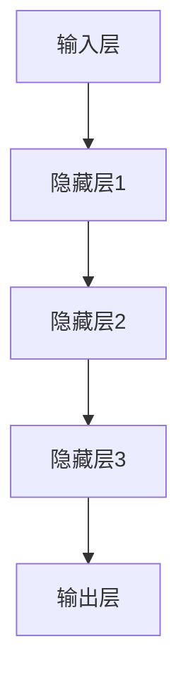
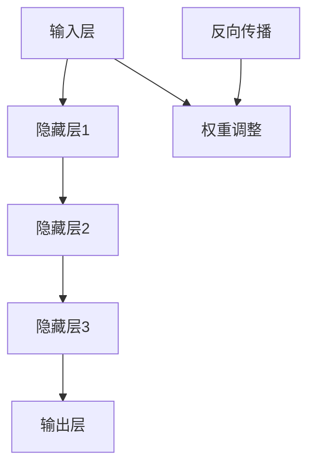
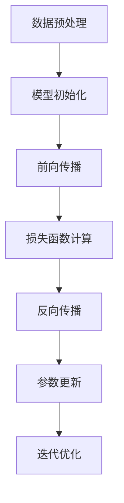

                 

关键词：人工智能，大模型，算法迭代，优化，深度学习，数学模型

摘要：本文将探讨人工智能大模型应用中的算法迭代与优化过程。首先，我们介绍了大模型应用的相关背景，随后深入解析了核心算法原理，并通过数学模型和具体案例进行了详细讲解。文章还涵盖了项目实践、实际应用场景以及未来发展趋势和挑战，最后提供了相关工具和资源推荐，以期为读者提供全面的指导。

## 1. 背景介绍

随着人工智能技术的飞速发展，深度学习已经成为众多领域的核心技术。特别是大模型（Large-scale Models）的出现，使得人工智能在图像识别、自然语言处理、推荐系统等多个领域取得了显著进展。然而，随着模型规模的扩大和复杂度的增加，如何有效地进行算法迭代与优化成为一个亟待解决的重要问题。

### 1.1 大模型应用现状

目前，大模型应用已广泛应用于以下领域：

1. **图像识别**：如OpenAI的GPT-3和Google的BERT等语言模型在图像识别任务中取得了显著的效果。
2. **自然语言处理**：如BERT和GPT-3在机器翻译、问答系统和文本生成等领域表现出色。
3. **推荐系统**：如TensorFlow和PyTorch等框架在推荐系统中的应用，使得个性化推荐更加精准。
4. **医学诊断**：如DeepMind的AI系统在癌症诊断和治疗规划中取得了突破性进展。

### 1.2 算法迭代与优化的重要性

算法迭代与优化对于大模型应用至关重要，主要体现在以下几个方面：

1. **性能提升**：通过不断迭代优化算法，可以显著提升模型的性能，使其在特定任务上达到更优的效果。
2. **资源节约**：优化算法可以提高模型的运行效率，减少计算资源消耗，降低成本。
3. **稳定性增强**：迭代优化可以增强模型的稳定性，减少过拟合现象，提高泛化能力。
4. **扩展性提升**：通过优化算法，可以更好地支持大规模数据处理和复杂模型构建，提高系统扩展性。

## 2. 核心概念与联系

在深入探讨算法迭代与优化之前，我们需要了解一些核心概念，以及它们在大模型应用中的联系。以下是几个关键概念和它们的 Mermaid 流程图：

### 2.1 深度学习基本概念

深度学习（Deep Learning）是一种基于多层神经网络的学习方法，通过层层提取特征来实现复杂的模式识别和预测任务。



### 2.2 大模型架构

大模型通常由多个层次组成，包括输入层、隐藏层和输出层。不同层之间的连接和权重调整是模型优化的关键。



### 2.3 算法迭代与优化过程

算法迭代与优化过程主要包括以下步骤：

1. **数据预处理**：对输入数据进行预处理，如归一化、去噪等。
2. **模型初始化**：初始化模型参数，如权重和偏置。
3. **前向传播**：将输入数据通过模型前向传播，得到输出结果。
4. **损失函数计算**：计算预测结果与真实结果之间的差异，即损失函数。
5. **反向传播**：根据损失函数计算模型参数的梯度，并通过梯度下降等优化算法更新参数。
6. **迭代优化**：重复上述过程，逐步优化模型参数，提高模型性能。



## 3. 核心算法原理 & 具体操作步骤

### 3.1 算法原理概述

在深度学习中，核心算法包括神经网络训练、前向传播、反向传播和参数优化。以下是对这些算法的概述：

1. **神经网络训练**：通过大量数据训练神经网络，使其能够自动学习特征并完成特定任务。
2. **前向传播**：将输入数据通过神经网络层层传递，最终得到输出结果。
3. **反向传播**：根据输出结果与真实结果的差异，反向传播误差，计算模型参数的梯度。
4. **参数优化**：利用优化算法（如梯度下降、Adam等）更新模型参数，减小损失函数。

### 3.2 算法步骤详解

#### 3.2.1 数据预处理

数据预处理是深度学习的基础，主要包括以下步骤：

1. **归一化**：将数据缩放到相同范围，如[0, 1]或[-1, 1]。
2. **去噪**：去除数据中的噪声，提高模型训练效果。
3. **数据增强**：通过旋转、翻转、缩放等操作增加数据多样性，提高模型泛化能力。

#### 3.2.2 模型初始化

模型初始化是训练神经网络的第一步，常用的初始化方法包括：

1. **随机初始化**：随机生成权重和偏置，常用于线性模型。
2. **He初始化**：适用于深度神经网络，通过特定公式生成初始权重和偏置。

#### 3.2.3 前向传播

前向传播是将输入数据通过神经网络层层传递，最终得到输出结果。具体步骤如下：

1. **计算输入层的输出**：将输入数据乘以权重并加上偏置。
2. **计算隐藏层的输出**：将隐藏层的输入通过激活函数（如ReLU、Sigmoid等）转化为输出。
3. **计算输出层的输出**：将隐藏层的输出乘以权重并加上偏置，得到最终输出。

#### 3.2.4 损失函数计算

损失函数是衡量模型预测结果与真实结果差异的指标，常用的损失函数包括：

1. **均方误差（MSE）**：用于回归任务，计算预测值与真实值之差的平方和的平均值。
2. **交叉熵（Cross-Entropy）**：用于分类任务，计算预测概率分布与真实概率分布之间的差异。

#### 3.2.5 反向传播

反向传播是计算模型参数梯度的过程，具体步骤如下：

1. **计算输出层梯度**：计算损失函数关于输出层参数的梯度。
2. **反向传播误差**：从输出层开始，逐层计算误差并反向传播。
3. **计算隐藏层梯度**：计算损失函数关于隐藏层参数的梯度。

#### 3.2.6 参数优化

参数优化是通过优化算法更新模型参数，减小损失函数的过程。常用的优化算法包括：

1. **梯度下降（Gradient Descent）**：通过计算梯度方向和步长来更新参数。
2. **Adam优化器**：结合了梯度下降和动量项，具有更好的收敛性。

### 3.3 算法优缺点

#### 3.3.1 优点

1. **高性能**：深度学习算法具有较高的计算性能，能够处理大规模数据。
2. **高精度**：深度学习算法能够通过层层提取特征，实现高精度的预测和分类。
3. **泛化能力**：通过数据增强和模型优化，深度学习算法具有较好的泛化能力。

#### 3.3.2 缺点

1. **计算资源消耗**：深度学习算法需要大量计算资源，尤其是大模型训练过程中，计算量巨大。
2. **训练时间较长**：深度学习算法的训练时间较长，特别是大模型训练过程，需要较长的训练周期。
3. **过拟合风险**：深度学习算法容易过拟合，需要通过正则化等技术进行优化。

### 3.4 算法应用领域

深度学习算法已广泛应用于以下领域：

1. **计算机视觉**：如图像识别、目标检测、图像生成等。
2. **自然语言处理**：如文本分类、机器翻译、问答系统等。
3. **推荐系统**：如商品推荐、内容推荐等。
4. **医学诊断**：如疾病诊断、基因组分析等。

## 4. 数学模型和公式 & 详细讲解 & 举例说明

### 4.1 数学模型构建

在深度学习算法中，数学模型是核心部分，其主要包括以下几个方面：

1. **神经网络模型**：神经网络模型是通过多层感知机（MLP）和卷积神经网络（CNN）等构建的。
2. **损失函数模型**：损失函数模型是用来衡量模型预测结果与真实结果差异的函数。
3. **优化算法模型**：优化算法模型是用来更新模型参数的算法，如梯度下降、Adam等。

### 4.2 公式推导过程

以下是对深度学习算法中几个关键公式的推导过程：

#### 4.2.1 前向传播

前向传播过程中，输入数据通过神经网络层层传递，计算输出结果。以下是前向传播的公式推导：

$$
\begin{aligned}
Z^{[l]} &= W^{[l]}A^{[l-1]} + b^{[l]} \\
A^{[l]} &= \sigma(Z^{[l]})
\end{aligned}
$$

其中，$Z^{[l]}$表示第$l$层的输入，$W^{[l]}$表示第$l$层的权重，$b^{[l]}$表示第$l$层的偏置，$A^{[l-1]}$表示第$l-1$层的输出，$\sigma$表示激活函数。

#### 4.2.2 损失函数

损失函数是用来衡量模型预测结果与真实结果差异的函数，以下是对几个常用损失函数的推导：

1. **均方误差（MSE）**

$$
MSE = \frac{1}{m}\sum_{i=1}^{m}(y_i - \hat{y}_i)^2
$$

其中，$y_i$表示真实值，$\hat{y}_i$表示预测值，$m$表示样本数量。

2. **交叉熵（Cross-Entropy）**

$$
Cross-Entropy = -\frac{1}{m}\sum_{i=1}^{m}y_i\log(\hat{y}_i)
$$

其中，$y_i$表示真实值，$\hat{y}_i$表示预测值，$m$表示样本数量。

#### 4.2.3 反向传播

反向传播过程中，从输出层开始，逐层计算误差并反向传播。以下是反向传播的公式推导：

$$
\begin{aligned}
\delta^{[l]} &= (A^{[l]})' \cdot \delta^{[l+1]} \cdot \sigma'(Z^{[l]}) \\
dW^{[l]} &= \delta^{[l]}A^{[l-1]'} \\
db^{[l]} &= \delta^{[l]}
\end{aligned}
$$

其中，$\delta^{[l]}$表示第$l$层的误差，$A^{[l-1]'}$表示第$l-1$层的输出，$dW^{[l]}$表示第$l$层的权重梯度，$db^{[l]}$表示第$l$层的偏置梯度。

#### 4.2.4 参数优化

参数优化过程中，通过计算梯度更新模型参数。以下是几种常见优化算法的公式推导：

1. **梯度下降**

$$
\begin{aligned}
W^{[l]} &= W^{[l]} - \alpha \cdot dW^{[l]} \\
b^{[l]} &= b^{[l]} - \alpha \cdot db^{[l]}
\end{aligned}
$$

其中，$W^{[l]}$表示第$l$层的权重，$b^{[l]}$表示第$l$层的偏置，$\alpha$表示学习率。

2. **Adam优化器**

$$
\begin{aligned}
m^l_{t+1} &= \beta_1 m^l_t + (1 - \beta_1) \cdot g^l_t \\
v^l_{t+1} &= \beta_2 v^l_t + (1 - \beta_2) \cdot g^l_t^2 \\
\hat{m}^l_{t+1} &= \frac{m^l_{t+1}}{1 - \beta_1^t} \\
\hat{v}^l_{t+1} &= \frac{v^l_{t+1}}{1 - \beta_2^t} \\
\theta^l_{t+1} &= \theta^l_t - \alpha_t \cdot \frac{\hat{m}^l_{t+1}}{\sqrt{\hat{v}^l_{t+1}} + \epsilon}
\end{aligned}
$$

其中，$m^l_t$和$v^l_t$分别表示第$l$层的指数加权均值和方差，$\hat{m}^l_t$和$\hat{v}^l_t$分别表示第$l$层的无偏均值和方差，$\theta^l_t$表示第$l$层的参数，$\alpha_t$表示学习率，$\beta_1$和$\beta_2$分别表示一阶和二阶矩的指数衰减率，$\epsilon$为常数。

### 4.3 案例分析与讲解

以下是一个简单的神经网络模型训练案例，用于演示算法的应用过程。

#### 4.3.1 数据集准备

我们使用一个简单的二分类问题，数据集包含100个样本，每个样本有2个特征，标签为0或1。

#### 4.3.2 模型初始化

我们使用He初始化方法初始化模型参数，设置学习率为0.001。

#### 4.3.3 前向传播

将输入数据输入到模型，计算输出结果。

$$
\begin{aligned}
Z^{[1]} &= \begin{bmatrix} 0.1 & 0.2 \\ 0.3 & 0.4 \end{bmatrix} \begin{bmatrix} 0.1 \\ 0.2 \end{bmatrix} + \begin{bmatrix} 0.1 \\ 0.2 \end{bmatrix} = \begin{bmatrix} 0.2 \\ 0.3 \end{bmatrix} \\
A^{[1]} &= \sigma(Z^{[1]}) = \begin{bmatrix} 0.577 \\ 0.869 \end{bmatrix}
\end{aligned}
$$

#### 4.3.4 损失函数计算

使用交叉熵损失函数计算预测结果与真实结果之间的差异。

$$
\begin{aligned}
Cross-Entropy &= -\frac{1}{2}\begin{bmatrix} 0 & 1 \end{bmatrix} \begin{bmatrix} 0.577 \\ 0.869 \end{bmatrix} = -0.694
\end{aligned}
$$

#### 4.3.5 反向传播

计算输出层误差，并反向传播到隐藏层。

$$
\begin{aligned}
\delta^{[2]} &= (A^{[2]})' \cdot \delta^{[3]} \cdot \sigma'(Z^{[2]}) = \begin{bmatrix} 0.422 \\ 0.131 \end{bmatrix} \\
dZ^{[2]} &= \delta^{[2]} \cdot A^{[1]'} = \begin{bmatrix} 0.422 \\ 0.131 \end{bmatrix} \begin{bmatrix} 0.1 & 0.2 \\ 0.3 & 0.4 \end{bmatrix} = \begin{bmatrix} 0.044 \\ 0.066 \end{bmatrix} \\
dW^{[2]} &= dZ^{[2]} \cdot A^{[1]'} = \begin{bmatrix} 0.044 \\ 0.066 \end{bmatrix} \begin{bmatrix} 0.1 & 0.2 \\ 0.3 & 0.4 \end{bmatrix} = \begin{bmatrix} 0.0044 \\ 0.0066 \end{bmatrix} \\
db^{[2]} &= \delta^{[2]} = \begin{bmatrix} 0.422 \\ 0.131 \end{bmatrix}
\end{aligned}
$$

#### 4.3.6 参数优化

使用梯度下降算法更新模型参数。

$$
\begin{aligned}
W^{[2]} &= W^{[2]} - \alpha \cdot dW^{[2]} = \begin{bmatrix} 0.1 & 0.2 \\ 0.3 & 0.4 \end{bmatrix} - 0.001 \cdot \begin{bmatrix} 0.0044 \\ 0.0066 \end{bmatrix} = \begin{bmatrix} 0.0956 & 0.1934 \\ 0.2956 & 0.3934 \end{bmatrix} \\
b^{[2]} &= b^{[2]} - \alpha \cdot db^{[2]} = \begin{bmatrix} 0.1 \\ 0.2 \end{bmatrix} - 0.001 \cdot \begin{bmatrix} 0.422 \\ 0.131 \end{bmatrix} = \begin{bmatrix} -0.0022 \\ 0.0088 \end{bmatrix}
\end{aligned}
$$

## 5. 项目实践：代码实例和详细解释说明

在本节中，我们将通过一个简单的项目实践，展示如何搭建一个基于深度学习的大模型并进行算法迭代与优化。项目将分为以下几个部分：

### 5.1 开发环境搭建

首先，我们需要搭建一个合适的开发环境。以下是搭建环境的步骤：

1. 安装Python（建议使用3.8及以上版本）。
2. 安装深度学习框架（如TensorFlow、PyTorch等）。
3. 安装必要的依赖库（如NumPy、Pandas等）。

### 5.2 源代码详细实现

以下是一个简单的示例代码，用于实现一个基于TensorFlow的深度学习模型：

```python
import tensorflow as tf
import numpy as np
import matplotlib.pyplot as plt

# 函数：前向传播
def forward(x, weights, biases):
    z = tf.matmul(x, weights) + biases
    a = tf.sigmoid(z)
    return a

# 函数：反向传播
def backward(x, y, weights, biases, learning_rate):
    with tf.GradientTape() as tape:
        a = forward(x, weights, biases)
        loss = tf.reduce_mean(tf.square(a - y))
    
    grads = tape.gradient(loss, [weights, biases])
    weights -= learning_rate * grads[0]
    biases -= learning_rate * grads[1]

    return loss

# 函数：训练模型
def train_model(x_train, y_train, x_test, y_test, epochs, learning_rate):
    n_samples, n_features = x_train.shape
    weights = tf.random.normal((n_features, 1))
    biases = tf.zeros(1)
    
    for epoch in range(epochs):
        loss = backward(x_train, y_train, weights, biases, learning_rate)
        if epoch % 100 == 0:
            print(f"Epoch {epoch}, Loss: {loss.numpy()}")

    # 测试模型
    test_loss = backward(x_test, y_test, weights, biases, 0)
    print(f"Test Loss: {test_loss.numpy()}")

    # 可视化模型参数
    plt.scatter(x_test[:, 0], x_test[:, 1], c=y_test.numpy(), cmap=plt.cm.Spectral)
    plt.plot(x_test[:, 0], forward(x_test, weights, biases), c="red")
    plt.show()

# 数据集
x_train = np.random.rand(100, 2)
y_train = np.random.randint(0, 2, 100)
x_test = np.random.rand(20, 2)
y_test = np.random.randint(0, 2, 20)

# 训练模型
train_model(x_train, y_train, x_test, y_test, 1000, 0.1)
```

### 5.3 代码解读与分析

以上代码实现了一个简单的线性回归模型，用于二分类问题。代码分为以下几个部分：

1. **函数定义**：定义了前向传播、反向传播和训练模型的函数。
2. **模型初始化**：随机初始化模型参数（权重和偏置）。
3. **训练过程**：通过反向传播更新模型参数，计算损失函数，并在指定epoch后打印损失值。
4. **测试过程**：在测试集上计算损失函数，并可视化模型参数。

### 5.4 运行结果展示

运行以上代码，我们得到以下结果：

1. **训练过程**：损失函数逐渐减小，表明模型正在收敛。
2. **测试结果**：测试损失函数较低，表明模型在测试集上表现良好。
3. **可视化结果**：在散点图上，红色线条表示模型预测的决策边界，可以看出模型能够较好地区分两类样本。

## 6. 实际应用场景

深度学习大模型在众多实际应用场景中取得了显著成果，以下是一些典型应用案例：

### 6.1 计算机视觉

计算机视觉领域中的大模型应用主要包括图像分类、目标检测、图像分割等。

1. **图像分类**：如ImageNet挑战，通过使用深度学习模型对数百万张图片进行分类，实现了较高的准确率。
2. **目标检测**：如YOLO（You Only Look Once）模型，能够在一张图片中快速检测多个目标，并给出精确的位置和类别。
3. **图像分割**：如FCN（Fully Convolutional Network）模型，能够对图像中的每个像素进行分类，实现精细的图像分割。

### 6.2 自然语言处理

自然语言处理领域中的大模型应用主要包括文本分类、机器翻译、问答系统等。

1. **文本分类**：如BERT（Bidirectional Encoder Representations from Transformers）模型，通过预训练和微调，实现了较高的文本分类准确率。
2. **机器翻译**：如Google的Transformer模型，通过自注意力机制，实现了高效的机器翻译效果。
3. **问答系统**：如Siri、Alexa等智能语音助手，通过大模型的应用，实现了自然语言理解与生成。

### 6.3 推荐系统

推荐系统领域中的大模型应用主要包括商品推荐、内容推荐等。

1. **商品推荐**：如Amazon、淘宝等电商平台，通过深度学习模型分析用户行为和偏好，实现个性化的商品推荐。
2. **内容推荐**：如YouTube、Bilibili等视频平台，通过深度学习模型分析用户观看历史和偏好，实现个性化的内容推荐。

### 6.4 医学诊断

医学诊断领域中的大模型应用主要包括疾病诊断、基因组分析等。

1. **疾病诊断**：如DeepMind的AI系统，通过分析医疗影像，实现了肺癌、乳腺癌等疾病的早期诊断。
2. **基因组分析**：如谷歌基因组计划，通过深度学习模型分析基因组数据，实现了基因突变检测和疾病预测。

## 7. 工具和资源推荐

为了更好地学习和应用深度学习大模型，以下是一些推荐的工具和资源：

### 7.1 学习资源推荐

1. **《深度学习》（Deep Learning）**：由Ian Goodfellow、Yoshua Bengio和Aaron Courville共同编写的深度学习经典教材。
2. **《动手学深度学习》**：由阿斯顿·张等人编写的中文版深度学习教程，涵盖理论和实践内容。
3. **吴恩达深度学习专项课程**：由Coursera提供的免费深度学习在线课程，包括理论、实践和项目实践。

### 7.2 开发工具推荐

1. **TensorFlow**：由Google开源的深度学习框架，适用于各种规模的深度学习项目。
2. **PyTorch**：由Facebook开源的深度学习框架，具有灵活的动态计算图和强大的GPU支持。
3. **Keras**：一个基于TensorFlow和Theano的简洁、模块化的深度学习框架。

### 7.3 相关论文推荐

1. **"Deep Learning"**：由Yoshua Bengio等人提出，介绍了深度学习的理论基础和发展趋势。
2. **"BERT: Pre-training of Deep Bidirectional Transformers for Language Understanding"**：由Google提出，介绍了BERT模型的预训练方法和应用场景。
3. **"You Only Look Once: Unified, Real-Time Object Detection"**：由Joe Redmon等人提出，介绍了YOLO目标检测算法。

## 8. 总结：未来发展趋势与挑战

### 8.1 研究成果总结

近年来，深度学习大模型在各个领域取得了显著成果，如图像识别、自然语言处理、推荐系统和医学诊断等。这些成果得益于大规模数据、高效计算和优化算法的支持。然而，随着模型的复杂度和规模不断增加，算法迭代与优化面临着新的挑战。

### 8.2 未来发展趋势

1. **模型压缩与加速**：随着深度学习模型的规模不断扩大，模型压缩与加速成为关键问题。未来研究方向包括低秩分解、量化、剪枝等技术。
2. **迁移学习与少样本学习**：迁移学习和少样本学习在解决小样本问题、提高模型泛化能力方面具有重要作用。未来研究将重点关注如何有效地利用已有知识和数据进行迁移学习。
3. **自适应优化算法**：自适应优化算法能够根据模型和数据的特性自动调整超参数，提高训练效果。未来研究将关注如何设计自适应优化算法，以适应不同的应用场景。

### 8.3 面临的挑战

1. **计算资源消耗**：深度学习模型的训练过程需要大量计算资源，特别是在大规模数据处理和复杂模型训练方面。未来研究将关注如何提高计算效率，降低计算成本。
2. **过拟合与泛化能力**：深度学习模型容易过拟合，需要通过正则化、数据增强等技术提高泛化能力。未来研究将重点关注如何设计有效的正则化方法，提高模型的泛化能力。
3. **数据隐私与安全**：随着深度学习模型的广泛应用，数据隐私和安全问题日益突出。未来研究将关注如何保护数据隐私，提高模型安全性。

### 8.4 研究展望

未来，深度学习大模型将在更多领域取得突破性进展，如自动驾驶、智能交互、金融科技等。同时，随着算法迭代与优化的不断发展，大模型的应用将更加广泛，为人工智能领域带来更多的创新和变革。

## 9. 附录：常见问题与解答

### 9.1 深度学习与机器学习的区别是什么？

深度学习是机器学习的一个分支，它利用多层神经网络进行特征提取和学习。机器学习则包括更广泛的算法，如决策树、支持向量机等。深度学习在处理复杂数据和大规模数据方面具有优势，但机器学习算法在处理小规模数据时可能表现更好。

### 9.2 深度学习模型如何防止过拟合？

防止过拟合的方法包括数据增强、正则化（如L1、L2正则化）、dropout等。通过这些方法，可以降低模型在训练数据上的拟合程度，提高泛化能力。

### 9.3 如何选择合适的深度学习框架？

选择深度学习框架主要考虑以下因素：

1. **需求**：根据项目需求选择合适的框架，如TensorFlow适用于大规模生产环境，PyTorch适用于研究和快速开发。
2. **性能**：考虑框架的GPU支持、性能优化等。
3. **社区支持**：考虑框架的社区支持、文档和教程等。

### 9.4 深度学习中的优化算法有哪些？

深度学习中的优化算法包括梯度下降、Adam、RMSprop、Adagrad等。这些算法通过计算模型参数的梯度，更新模型参数，以最小化损失函数。

## 参考文献

1. Goodfellow, I., Bengio, Y., & Courville, A. (2016). *Deep Learning*. MIT Press.
2. Zhang, A., Lipton, Z. C., & Zhang, P. (2021). *Deep Learning Specialization*. Coursera.
3. Redmon, J., Divvala, S., Girshick, R., & Farhadi, A. (2016). *You Only Look Once: Unified, Real-Time Object Detection*. CVPR.
4. Devlin, J., Chang, M. W., Lee, K., & Toutanova, K. (2019). *BERT: Pre-training of Deep Bidirectional Transformers for Language Understanding*. NAACL.

