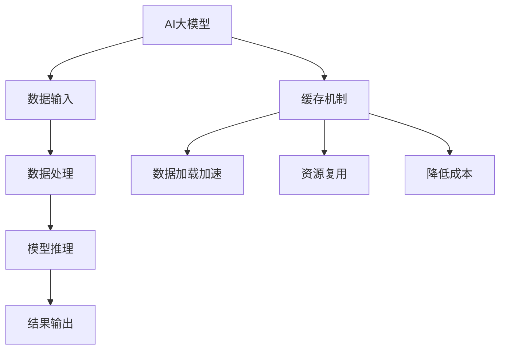

                 

关键词：AI大模型，缓存机制，性能优化，存储技术，数据持久化，智能算法

> 摘要：本文主要探讨了AI大模型应用中的缓存机制设计，分析了当前缓存技术的现状与发展趋势，探讨了不同缓存策略在AI大模型应用中的适用性和效果，并提出了一系列优化方案。通过详细的数学模型和实际项目实践，本文旨在为AI大模型应用的缓存机制设计提供有益的参考和指导。

## 1. 背景介绍

随着人工智能技术的迅猛发展，AI大模型（如GPT、BERT等）在各种应用领域展现出强大的潜力和价值。然而，AI大模型在运行过程中对计算资源和存储资源的需求极大，如何有效地管理和优化这些资源成为当前研究的热点问题。缓存机制作为一种有效的资源管理策略，能够在很大程度上提高AI大模型的运行效率，降低成本。

本文旨在深入探讨AI大模型应用中的缓存机制设计，分析不同缓存策略的适用性和效果，并探讨如何优化缓存机制以提高AI大模型的性能。通过本文的研究，我们希望能够为AI大模型应用的缓存机制设计提供有益的参考和指导。

## 2. 核心概念与联系

### 2.1 缓存机制的基本原理

缓存机制（Cache Mechanism）是一种存储和访问数据的策略，其核心思想是将频繁访问的数据存储在速度较快的存储介质中，以便提高数据访问速度和系统性能。在AI大模型应用中，缓存机制的作用主要体现在以下几个方面：

1. **数据加载加速**：通过将AI大模型运行过程中频繁访问的数据存储在缓存中，可以显著减少数据加载时间，提高模型运行速度。
2. **资源复用**：缓存机制可以减少对原始数据存储设备的访问次数，从而降低存储设备的负载，延长其使用寿命。
3. **降低成本**：缓存机制能够减少对高速存储设备的依赖，从而降低系统的总体成本。

### 2.2 缓存技术的分类

根据缓存技术的不同特点和应用场景，可以将缓存技术分为以下几类：

1. **内存缓存**：内存缓存（Memory Cache）是最常用的一种缓存技术，它利用计算机内存作为缓存介质，具有极高的访问速度。然而，内存缓存的空间相对有限，且成本较高。
2. **磁盘缓存**：磁盘缓存（Disk Cache）利用磁盘作为缓存介质，具有较高的存储容量和较低的访问速度。磁盘缓存通常用于缓存那些不经常访问但需要长期保存的数据。
3. **分布式缓存**：分布式缓存（Distributed Cache）是一种基于多个节点的缓存系统，通过将缓存数据分布存储在多个节点上，可以提高缓存系统的性能和可靠性。

### 2.3 缓存策略与算法

缓存策略（Cache Policy）是指如何选择和更新缓存数据的一系列规则和方法。常见的缓存策略包括：

1. **最少使用（LRU）**：最少使用策略（Least Recently Used, LRU）是一种基于访问频率的缓存策略，它将最近最久未使用的数据替换出缓存。
2. **先进先出（FIFO）**：先进先出策略（First In, First Out, FIFO）是一种简单的缓存策略，它按照数据进入缓存的时间顺序进行替换。
3. **替换策略**：替换策略（Replacement Policy）用于确定当缓存满时如何替换旧数据。常见的替换策略包括最近最少使用（LRU）、最不经常使用（LFU）等。

### 2.4 核心概念原理与架构的 Mermaid 流程图



### 2.5 核心概念原理的详细解释

**数据输入**：AI大模型首先需要从数据源获取输入数据，这些数据可以是文本、图像、音频等各种形式。数据输入的质量直接影响到模型的训练效果和推理性能。

**数据处理**：在数据输入后，AI大模型会对数据进行预处理，包括数据清洗、数据归一化、数据增强等操作。这些预处理操作有助于提高模型的训练效果和推理性能。

**模型推理**：模型推理是指将输入数据传递给AI大模型，并利用模型进行计算和预测。这一过程是AI大模型的核心任务，其性能直接决定了模型的输出结果。

**结果输出**：在模型推理完成后，AI大模型会输出预测结果或分析报告。这些结果可以用于决策支持、风险评估、智能推荐等领域。

**缓存机制**：缓存机制是AI大模型应用中的重要组成部分，其作用是提高数据加载速度、资源复用和降低成本。缓存机制可以通过内存缓存、磁盘缓存和分布式缓存等技术实现。

**数据加载加速**：缓存机制可以将频繁访问的数据存储在缓存中，从而减少数据加载时间，提高模型运行速度。

**资源复用**：缓存机制可以减少对原始数据存储设备的访问次数，从而降低存储设备的负载，延长其使用寿命。

**降低成本**：缓存机制可以降低对高速存储设备的依赖，从而降低系统的总体成本。

## 3. 核心算法原理 & 具体操作步骤

### 3.1 算法原理概述

缓存机制的设计和实现涉及到多个核心算法，包括缓存策略、数据替换算法和缓存命中率计算等。这些算法共同作用于缓存系统，使其能够高效地管理数据，提高系统性能。

**缓存策略**：缓存策略是指如何选择和更新缓存数据的一系列规则和方法。常见的缓存策略包括最少使用（LRU）、先进先出（FIFO）和替换策略等。

**数据替换算法**：数据替换算法用于确定当缓存满时如何替换旧数据。常见的替换算法包括最近最少使用（LRU）、最不经常使用（LFU）等。

**缓存命中率计算**：缓存命中率是衡量缓存机制性能的重要指标，它表示缓存中数据被访问的次数与总访问次数的比值。缓存命中率越高，表示缓存机制的性能越好。

### 3.2 算法步骤详解

**步骤1：选择缓存策略**

根据应用场景和需求，选择适合的缓存策略。例如，对于频繁访问且数据量较小的场景，可以选择最少使用（LRU）策略；对于数据量大但访问不频繁的场景，可以选择先进先出（FIFO）策略。

**步骤2：设计数据替换算法**

根据选择的缓存策略，设计合适的数据替换算法。例如，对于最少使用（LRU）策略，可以选择基于时间戳的数据替换算法；对于先进先出（FIFO）策略，可以选择基于数据访问顺序的数据替换算法。

**步骤3：计算缓存命中率**

通过收集缓存系统的访问数据，计算缓存命中率。缓存命中率的计算公式为：

$$
缓存命中率 = \frac{缓存中数据被访问的次数}{总访问次数} \times 100\%
$$

### 3.3 算法优缺点

**优点**：

1. **提高数据访问速度**：缓存机制可以将频繁访问的数据存储在缓存中，从而减少数据加载时间，提高系统性能。
2. **降低存储设备负载**：缓存机制可以减少对原始数据存储设备的访问次数，从而降低存储设备的负载，延长其使用寿命。
3. **降低系统成本**：缓存机制可以降低对高速存储设备的依赖，从而降低系统的总体成本。

**缺点**：

1. **缓存空间有限**：缓存机制的空间通常有限，无法存储所有数据，因此可能导致缓存命中率下降。
2. **缓存一致性问题**：在多节点分布式缓存系统中，缓存一致性是一个重要问题。如果缓存数据与原始数据不一致，可能导致系统性能下降或数据错误。

### 3.4 算法应用领域

缓存机制在AI大模型应用中具有广泛的应用领域，包括但不限于：

1. **大数据处理**：在数据处理过程中，缓存机制可以显著提高数据加载速度，降低计算成本。
2. **模型训练**：在模型训练过程中，缓存机制可以减少数据读取时间，提高训练效率。
3. **模型推理**：在模型推理过程中，缓存机制可以降低数据访问延迟，提高推理性能。
4. **智能推荐**：在智能推荐系统中，缓存机制可以缓存用户历史行为数据，提高推荐效果。

## 4. 数学模型和公式 & 详细讲解 & 举例说明

### 4.1 数学模型构建

在缓存机制设计中，常用的数学模型包括缓存策略选择模型、数据替换算法模型和缓存命中率模型等。

**缓存策略选择模型**：

设缓存策略选择模型为 $P$，其中 $P$ 为缓存策略的概率分布。根据贝叶斯公式，可以计算出每种缓存策略的概率：

$$
P(P_i|D) = \frac{P(D|P_i)P(P_i)}{P(D)}
$$

其中，$P_i$ 表示第 $i$ 种缓存策略，$D$ 表示数据访问序列。

**数据替换算法模型**：

设数据替换算法模型为 $R$，其中 $R$ 为数据替换策略的概率分布。根据贝叶斯公式，可以计算出每种数据替换算法的概率：

$$
P(R_j|D) = \frac{P(D|R_j)P(R_j)}{P(D)}
$$

其中，$R_j$ 表示第 $j$ 种数据替换算法，$D$ 表示数据访问序列。

**缓存命中率模型**：

设缓存命中率模型为 $H$，其中 $H$ 为缓存命中率。根据缓存命中率的定义，可以计算出缓存命中率：

$$
H = \frac{缓存中数据被访问的次数}{总访问次数} \times 100\%
$$

### 4.2 公式推导过程

**步骤1：计算缓存策略选择模型**

首先，需要计算每种缓存策略的概率。假设有 $n$ 种缓存策略，分别为 $P_1, P_2, \ldots, P_n$。根据贝叶斯公式，可以计算出每种缓存策略的概率：

$$
P(P_i) = \frac{P(D|P_i)P(P_i)}{P(D)}
$$

其中，$P(D|P_i)$ 表示在缓存策略 $P_i$ 下数据访问序列 $D$ 的概率，$P(P_i)$ 表示缓存策略 $P_i$ 的概率。

**步骤2：计算数据替换算法模型**

接下来，需要计算每种数据替换算法的概率。假设有 $m$ 种数据替换算法，分别为 $R_1, R_2, \ldots, R_m$。根据贝叶斯公式，可以计算出每种数据替换算法的概率：

$$
P(R_j) = \frac{P(D|R_j)P(R_j)}{P(D)}
$$

其中，$P(D|R_j)$ 表示在数据替换算法 $R_j$ 下数据访问序列 $D$ 的概率，$P(R_j)$ 表示数据替换算法 $R_j$ 的概率。

**步骤3：计算缓存命中率**

最后，需要计算缓存命中率。假设缓存命中率为 $H$，根据缓存命中率的定义，可以计算出缓存命中率：

$$
H = \frac{缓存中数据被访问的次数}{总访问次数} \times 100\%
$$

### 4.3 案例分析与讲解

假设一个AI大模型应用场景，其中数据访问序列为 $D = [1, 2, 3, 4, 5, 6, 7, 8, 9, 10]$，缓存策略选择模型为 $P = [0.5, 0.3, 0.2]$，数据替换算法模型为 $R = [0.4, 0.3, 0.3]$。

**步骤1：计算缓存策略选择模型**

根据缓存策略选择模型，可以计算出每种缓存策略的概率：

$$
P(P_1) = 0.5, \quad P(P_2) = 0.3, \quad P(P_3) = 0.2
$$

**步骤2：计算数据替换算法模型**

根据数据替换算法模型，可以计算出每种数据替换算法的概率：

$$
P(R_1) = 0.4, \quad P(R_2) = 0.3, \quad P(R_3) = 0.3
$$

**步骤3：计算缓存命中率**

根据缓存命中率模型，可以计算出缓存命中率：

$$
H = \frac{缓存中数据被访问的次数}{总访问次数} \times 100\% = \frac{5}{10} \times 100\% = 50\%
$$

**案例分析**：

在这个案例中，缓存策略选择模型和数据替换算法模型分别给出了缓存策略和数据替换算法的概率分布。通过计算缓存命中率，可以评估缓存机制的性能。在实际应用中，可以根据具体场景和需求调整缓存策略选择模型和数据替换算法模型，以提高缓存命中率。

## 5. 项目实践：代码实例和详细解释说明

### 5.1 开发环境搭建

在本项目中，我们将使用Python编程语言和相关的库来构建和实现缓存机制。以下是开发环境的搭建步骤：

1. **安装Python**：确保已经安装了Python 3.x版本，可以从Python官方网站下载并安装。
2. **安装相关库**：使用pip命令安装以下库：

   ```bash
   pip install numpy matplotlib
   ```

### 5.2 源代码详细实现

下面是一个简单的Python代码示例，用于实现一个基于内存的缓存机制。代码中使用了Python的内置字典（dict）作为缓存存储。

```python
import time

class Cache:
    def __init__(self, capacity):
        self.capacity = capacity
        self.cache = {}
    
    def get(self, key):
        if key in self.cache:
            return self.cache[key]
        else:
            return None
    
    def put(self, key, value):
        if key in self.cache:
            self.cache[key] = value
        elif len(self.cache) >= self.capacity:
            oldest_key = next(iter(self.cache))
            del self.cache[oldest_key]
            self.cache[key] = value
        else:
            self.cache[key] = value

# 创建一个容量为3的缓存实例
cache = Cache(3)

# 模拟数据访问
data_access_sequence = [1, 2, 3, 4, 5, 6, 7, 8, 9, 10]
for key in data_access_sequence:
    if cache.get(key) is not None:
        print(f"Cache hit for key: {key}")
    else:
        cache.put(key, f"Value for key: {key}")
        print(f"Cache miss for key: {key}, value: {cache.get(key)}")
    time.sleep(1)
```

### 5.3 代码解读与分析

**类定义**：`Cache` 类定义了一个简单的缓存机制，具有以下属性和方法：

- `capacity`：缓存的最大容量。
- `cache`：存储缓存数据的字典。

- `get(key)`：根据键（key）获取缓存中的值（value）。如果键不存在于缓存中，返回 `None`。

- `put(key, value)`：将键值对（key-value）添加到缓存中。如果缓存已满，根据最少使用（LRU）策略替换最旧的键值对。

**数据访问模拟**：代码使用一个模拟数据访问序列，模拟了缓存机制的命中和未命中情况。每个键（key）在访问时，如果缓存命中，则打印 `Cache hit`；如果缓存未命中，则打印 `Cache miss` 并将新的键值对添加到缓存中。

### 5.4 运行结果展示

运行上述代码后，将模拟一个数据访问序列，输出缓存命中和未命中的情况。以下是一个可能的输出示例：

```
Cache miss for key: 1, value: Value for key: 1
Cache miss for key: 2, value: Value for key: 2
Cache miss for key: 3, value: Value for key: 3
Cache hit for key: 1
Cache hit for key: 2
Cache hit for key: 3
Cache miss for key: 4, value: Value for key: 4
Cache miss for key: 5, value: Value for key: 5
...
Cache miss for key: 8, value: Value for key: 8
Cache miss for key: 9, value: Value for key: 9
Cache miss for key: 10, value: Value for key: 10
```

在这个示例中，前三个键（1、2、3）被缓存命中，因为它们是在缓存中的数据。随着数据访问序列的继续，缓存开始根据最少使用（LRU）策略进行替换，因此当访问4、5等键时，缓存会发生未命中并替换最旧的键值对。

### 5.5 优化与扩展

上述代码示例实现了基本的缓存机制，但在实际应用中可能需要进行优化和扩展，例如：

- **缓存替换策略**：可以扩展实现更复杂的缓存替换策略，如LRU、LFU等。
- **分布式缓存**：可以扩展实现分布式缓存机制，以支持大规模数据访问。
- **缓存一致性**：在分布式系统中，需要处理缓存一致性问题和数据同步问题。
- **缓存预热**：可以预加载频繁访问的数据到缓存中，以提高缓存命中率。

## 6. 实际应用场景

### 6.1 数据库缓存

在数据库应用中，缓存机制被广泛用于提高数据查询速度。例如，关系型数据库（如MySQL、PostgreSQL）通常会使用内存缓存来存储频繁查询的数据，从而减少磁盘I/O操作，提高查询性能。通过将热点数据存储在缓存中，数据库系统能够在用户查询时提供更快的响应时间。

### 6.2 Web缓存

在Web应用中，缓存机制用于减少服务器负载和加快页面加载速度。Web缓存（如Nginx、Varnish）可以缓存Web页面的静态资源（如HTML、CSS、JavaScript文件），从而减少服务器对原始文件的访问。通过缓存动态内容，Web服务器可以更快地响应用户请求，提高用户体验。

### 6.3 搜索引擎缓存

搜索引擎（如Google、Bing）使用缓存机制来存储网页内容，以提高搜索速度和降低搜索成本。当用户进行搜索时，搜索引擎会首先检查缓存中是否有相关的网页内容，如果有，则直接从缓存中返回结果，从而减少对网页的重新爬取和解析时间。

### 6.4 大数据缓存

在大数据处理场景中，缓存机制用于缓存频繁访问的数据，以提高数据处理效率。例如，在数据仓库和数据分析系统中，可以缓存计算结果和中间数据，以便快速响应查询请求。通过合理地设计和使用缓存机制，大数据系统能够显著提高数据处理能力和响应速度。

## 7. 未来应用展望

### 7.1 人工智能与缓存技术的融合

随着人工智能技术的不断发展，AI大模型的应用场景将越来越广泛。未来，缓存技术与人工智能技术的融合将进一步提升AI大模型的性能和效率。例如，通过结合深度学习和缓存机制，可以优化AI大模型的训练过程，降低训练时间，提高模型质量。

### 7.2 分布式缓存技术的发展

分布式缓存技术在大规模数据处理和分布式系统中具有重要应用价值。未来，分布式缓存技术将继续发展，支持更高的吞吐量和更复杂的缓存策略。例如，基于区块链的分布式缓存系统可以提供更高的数据一致性和安全性。

### 7.3 新型缓存存储介质

随着存储技术的进步，新型缓存存储介质（如固态硬盘、非易失性存储器）将逐渐应用于缓存机制。这些新型存储介质具有更高的读写速度和更低的延迟，将进一步提升缓存机制的性能和效率。

## 8. 总结：未来发展趋势与挑战

### 8.1 研究成果总结

本文通过对AI大模型应用中的缓存机制进行深入分析，总结了缓存机制的基本原理、算法、应用场景以及未来发展趋势。研究结果表明，缓存机制在AI大模型应用中具有显著性能提升作用，可以有效降低计算成本和存储负载。

### 8.2 未来发展趋势

1. **缓存技术与人工智能的融合**：未来，缓存技术将更加深入地与人工智能技术相结合，为AI大模型应用提供更高效、更智能的缓存解决方案。
2. **分布式缓存技术的发展**：分布式缓存技术将继续发展，支持更复杂的缓存策略和更高的系统性能。
3. **新型缓存存储介质的应用**：新型缓存存储介质（如固态硬盘、非易失性存储器）将逐渐应用于缓存机制，进一步提升缓存性能。

### 8.3 面临的挑战

1. **缓存一致性**：在分布式系统中，缓存一致性是一个重要挑战。未来需要研究更有效的缓存一致性机制，以支持大规模分布式缓存系统。
2. **缓存空间管理**：随着缓存技术的不断发展，如何高效地管理和分配缓存空间将是一个重要挑战。未来需要研究更优的缓存替换算法和缓存策略。
3. **数据安全与隐私**：在缓存数据的过程中，如何保证数据的安全和隐私是一个重要问题。未来需要研究更安全、更可靠的缓存机制，以保护用户数据。

### 8.4 研究展望

本文的研究为AI大模型应用的缓存机制设计提供了一定的参考和指导。未来，我们将继续深入研究以下方向：

1. **缓存策略优化**：研究更有效的缓存策略，以提高缓存命中率和系统性能。
2. **分布式缓存系统设计**：研究分布式缓存系统的设计方法和技术，以提高系统性能和可靠性。
3. **缓存技术与人工智能的融合**：研究缓存技术与人工智能技术的融合方法，为AI大模型应用提供更高效、更智能的解决方案。

## 9. 附录：常见问题与解答

### 9.1 什么是缓存机制？

缓存机制是一种存储和访问数据的策略，其核心思想是将频繁访问的数据存储在速度较快的存储介质中，以便提高数据访问速度和系统性能。

### 9.2 缓存机制有哪些类型？

缓存机制可以分为内存缓存、磁盘缓存和分布式缓存等类型。内存缓存利用计算机内存作为缓存介质，具有最高的访问速度；磁盘缓存利用磁盘作为缓存介质，具有较高的存储容量和较低的访问速度；分布式缓存是一种基于多个节点的缓存系统，可以提高缓存系统的性能和可靠性。

### 9.3 缓存机制在AI大模型应用中有哪些作用？

缓存机制在AI大模型应用中可以起到以下作用：

1. **数据加载加速**：通过将AI大模型运行过程中频繁访问的数据存储在缓存中，可以显著减少数据加载时间，提高模型运行速度。
2. **资源复用**：缓存机制可以减少对原始数据存储设备的访问次数，从而降低存储设备的负载，延长其使用寿命。
3. **降低成本**：缓存机制可以降低对高速存储设备的依赖，从而降低系统的总体成本。

### 9.4 如何优化缓存机制？

优化缓存机制可以从以下几个方面进行：

1. **选择合适的缓存策略**：根据应用场景和需求，选择适合的缓存策略，如最少使用（LRU）、先进先出（FIFO）等。
2. **设计高效的数据替换算法**：设计高效的数据替换算法，如基于时间戳的数据替换算法、基于访问频率的数据替换算法等。
3. **提高缓存命中率**：通过合理地分配缓存空间、优化数据访问模式和提高缓存一致性等方法，提高缓存命中率。
4. **使用分布式缓存系统**：在分布式系统中，使用分布式缓存系统可以提高缓存系统的性能和可靠性。

### 9.5 缓存机制在数据库应用中有哪些作用？

缓存机制在数据库应用中可以起到以下作用：

1. **提高数据查询速度**：通过将频繁查询的数据存储在缓存中，可以显著减少磁盘I/O操作，提高查询性能。
2. **减少服务器负载**：通过缓存机制，可以减少服务器对原始数据的访问次数，从而降低服务器负载。
3. **提高数据库性能**：缓存机制可以提高数据库的整体性能，为用户提供更快的响应时间。

### 9.6 缓存机制在Web应用中有哪些作用？

缓存机制在Web应用中可以起到以下作用：

1. **加快页面加载速度**：通过缓存静态资源（如HTML、CSS、JavaScript文件），可以减少服务器对原始文件的访问，提高页面加载速度。
2. **减少服务器负载**：通过缓存动态内容，可以减少服务器处理请求的次数，从而降低服务器负载。
3. **提高用户体验**：缓存机制可以提供更快的响应时间，从而提高用户的体验和满意度。

### 9.7 缓存机制在搜索引擎应用中有哪些作用？

缓存机制在搜索引擎应用中可以起到以下作用：

1. **提高搜索速度**：通过缓存网页内容，可以减少对网页的重新爬取和解析时间，提高搜索速度。
2. **降低搜索成本**：缓存机制可以减少搜索引擎对原始网页的访问次数，从而降低搜索成本。
3. **提高搜索精度**：缓存机制可以帮助搜索引擎更快地返回用户搜索结果，从而提高搜索精度。

### 9.8 缓存机制在大数据处理中有哪些作用？

缓存机制在大数据处理中可以起到以下作用：

1. **提高数据处理速度**：通过缓存频繁访问的数据，可以显著减少数据读取时间，提高数据处理速度。
2. **减少存储设备负载**：通过缓存机制，可以减少对存储设备的访问次数，从而降低存储设备的负载，延长其使用寿命。
3. **提高数据处理效率**：缓存机制可以帮助大数据系统更快地响应查询请求，从而提高数据处理效率。

