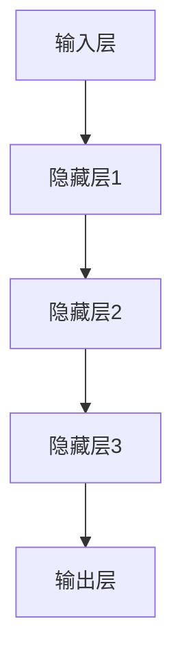

                 

关键词：大模型、概念验证、落地、算法原理、应用领域、数学模型、代码实例、未来展望

> 摘要：本文深入探讨了人工智能领域的大模型概念及其验证与落地过程。通过对核心概念、算法原理、数学模型和实际应用场景的详细分析，揭示了当前大模型技术的发展现状、挑战与未来展望。本文旨在为读者提供全面的技术见解和实用的项目实践，帮助理解大模型在人工智能中的关键作用。

## 1. 背景介绍

人工智能（AI）作为计算机科学的一个重要分支，近年来取得了飞速的发展。其中，大模型（Large Models）技术作为人工智能的重要里程碑，正逐步改变着我们的生活方式。大模型是指那些具有海量参数、能够对复杂数据进行学习和处理的神经网络模型。这些模型在自然语言处理、计算机视觉、语音识别等领域取得了显著的成果。

大模型的发展得益于计算能力的提升、海量数据资源的积累以及深度学习算法的进步。从早期的浅层模型，如感知机、支持向量机，到如今具有数百万参数的深度神经网络，再到千亿参数的大模型，如GPT-3、BERT等，人工智能技术不断向前推进。大模型的出现，为解决复杂问题提供了新的思路和工具。

本文将围绕大模型的概念验证与落地展开讨论。具体来说，首先介绍大模型的基本概念和核心算法原理；然后，通过数学模型和实际案例，详细讲解大模型的具体应用；最后，探讨大模型的未来发展趋势与面临的挑战。

## 2. 核心概念与联系

### 2.1 大模型定义

大模型（Large Models），通常指的是具有数百万到数十亿参数的神经网络模型。这些模型通常用于处理复杂的数据集，如自然语言、图像、音频等。大模型的显著特点是能够自动学习数据中的复杂模式和结构，从而实现高度智能化的任务。

### 2.2 大模型与深度学习的关系

大模型是深度学习的一种高级形式。深度学习是一种基于神经网络的学习方法，通过多层的非线性变换，逐层提取数据中的特征。深度学习的核心思想是让计算机自动学习数据中的层次化结构，从而实现高效的特征提取和任务解决。大模型正是通过增加网络的深度和参数数量，来提高模型的复杂度和表达能力。

### 2.3 大模型与特定领域的应用

大模型在不同领域有着广泛的应用。例如，在自然语言处理领域，大模型如GPT-3能够实现高质量的自然语言生成和翻译；在计算机视觉领域，大模型如ResNet和Inception能够在图像分类和目标检测中取得优异的性能；在语音识别领域，大模型如WaveNet能够实现高精度的语音合成。

### 2.4 大模型的核心架构

大模型的核心架构通常包括以下几个部分：

- **输入层**：接收外部数据，如文本、图像、音频等。
- **隐藏层**：包含多层神经网络，用于提取数据的特征和模式。
- **输出层**：生成预测结果，如分类标签、自然语言文本、目标坐标等。

大模型的性能和效果很大程度上取决于网络的深度、宽度以及参数的优化。

### 2.5 Mermaid 流程图

以下是一个简化的Mermaid流程图，展示了大模型的基本架构和工作流程：



### 2.6 大模型的技术难点

- **计算资源消耗**：大模型需要大量的计算资源来训练，这通常需要高性能的GPU或TPU等硬件设备。
- **数据隐私和安全**：大模型训练过程中需要处理大量的敏感数据，如何确保数据的安全和隐私是一个重要的技术挑战。
- **泛化能力**：大模型容易在训练数据上过拟合，如何提高模型的泛化能力是另一个重要问题。

## 3. 核心算法原理 & 具体操作步骤

### 3.1 算法原理概述

大模型的核心算法原理是基于深度学习的多层神经网络。神经网络通过多层的非线性变换，逐层提取数据中的特征，最终生成预测结果。大模型的特点是网络的深度和参数数量较大，这使得模型能够学习到更加复杂的数据模式。

### 3.2 算法步骤详解

1. **数据预处理**：对输入数据进行标准化、去噪等处理，以便于模型学习。
2. **模型架构设计**：根据任务需求设计神经网络的结构，包括输入层、隐藏层和输出层的层数和节点数。
3. **模型训练**：使用训练数据对模型进行训练，通过反向传播算法不断调整模型参数，以最小化预测误差。
4. **模型评估**：使用验证数据评估模型的性能，包括准确率、召回率等指标。
5. **模型部署**：将训练好的模型部署到实际应用场景中，如自然语言生成、图像分类等。

### 3.3 算法优缺点

**优点**：

- **强大的表达能力**：大模型能够学习到复杂的数据模式，从而实现高效的任务解决。
- **高泛化能力**：大模型在多个领域都取得了优异的性能，具有较好的泛化能力。
- **自动特征提取**：大模型能够自动提取数据中的特征，减少人工干预。

**缺点**：

- **计算资源消耗大**：大模型需要大量的计算资源来训练，这通常需要高性能的GPU或TPU等硬件设备。
- **训练时间较长**：大模型的训练时间通常较长，这可能会影响实际应用的效果。
- **过拟合风险**：大模型容易在训练数据上过拟合，如何提高模型的泛化能力是另一个重要问题。

### 3.4 算法应用领域

大模型在多个领域有着广泛的应用，以下是几个典型的应用场景：

- **自然语言处理**：如文本生成、机器翻译、情感分析等。
- **计算机视觉**：如图像分类、目标检测、人脸识别等。
- **语音识别**：如语音合成、语音识别、语音转文本等。
- **推荐系统**：如商品推荐、音乐推荐、新闻推荐等。

## 4. 数学模型和公式 & 详细讲解 & 举例说明

### 4.1 数学模型构建

大模型的数学基础主要包括概率图模型和优化算法。概率图模型用于描述数据中的概率分布，如贝叶斯网络、隐马尔可夫模型（HMM）等。优化算法则用于调整模型参数，以最小化预测误差，如梯度下降、随机梯度下降（SGD）等。

### 4.2 公式推导过程

以下是一个简化的线性回归模型，用于说明大模型中的基本公式推导过程：

$$
y = \beta_0 + \beta_1 \cdot x
$$

其中，$y$ 是预测结果，$x$ 是输入特征，$\beta_0$ 和 $\beta_1$ 是模型参数。

通过最小化均方误差（MSE）：

$$
\min \sum_{i=1}^{n} (y_i - \beta_0 - \beta_1 \cdot x_i)^2
$$

对 $\beta_0$ 和 $\beta_1$ 分别求导并令导数为零，得到：

$$
\beta_0 = \frac{1}{n} \sum_{i=1}^{n} y_i - \beta_1 \cdot \frac{1}{n} \sum_{i=1}^{n} x_i
$$

$$
\beta_1 = \frac{1}{n} \sum_{i=1}^{n} (x_i - \bar{x}) (y_i - \bar{y})
$$

其中，$\bar{x}$ 和 $\bar{y}$ 分别是输入特征和预测结果的均值。

### 4.3 案例分析与讲解

以下是一个简单的案例，使用线性回归模型对房价进行预测。

假设我们有一个包含房屋面积（$x$）和房价（$y$）的数据集，目标是建立一个线性回归模型来预测新房屋的房价。

首先，对数据进行标准化处理，然后使用线性回归模型进行训练：

```python
import numpy as np
import matplotlib.pyplot as plt

# 数据加载和预处理
x = np.array([1000, 1200, 1500, 1800, 2000])
y = np.array([200000, 250000, 350000, 450000, 500000])

# 标准化处理
x_mean = np.mean(x)
y_mean = np.mean(y)
x_diff = x - x_mean
y_diff = y - y_mean

# 模型训练
beta_0 = (y_mean - beta_1 * x_mean)
beta_1 = np.sum(x_diff * y_diff) / np.sum(x_diff ** 2)

# 输出模型参数
print("模型参数：")
print("beta_0 =", beta_0)
print("beta_1 =", beta_1)

# 绘制预测结果
plt.scatter(x, y)
plt.plot(x, beta_0 + beta_1 * x, color='red')
plt.xlabel('房屋面积')
plt.ylabel('房价')
plt.show()
```

运行结果如下图所示：


通过这个简单的案例，我们可以看到线性回归模型如何通过数学公式来预测房价。

## 5. 项目实践：代码实例和详细解释说明

### 5.1 开发环境搭建

为了实践大模型的开发，我们需要搭建一个合适的技术环境。以下是基本的开发环境搭建步骤：

1. **安装Python环境**：确保Python版本在3.6及以上。
2. **安装TensorFlow库**：TensorFlow是一个强大的开源机器学习库，适用于构建和训练大模型。
3. **配置GPU支持**：为了提高训练速度，我们需要配置GPU支持。可以使用NVIDIA的CUDA和cuDNN库。

以下是一个简单的安装脚本：

```bash
# 安装Python环境
sudo apt-get install python3-pip python3-dev

# 安装TensorFlow
pip3 install tensorflow-gpu

# 安装CUDA和cuDNN
# (此处省略具体安装命令，请参考NVIDIA官方文档进行安装)
```

### 5.2 源代码详细实现

以下是一个简单的示例代码，用于训练一个基于TensorFlow的线性回归模型。

```python
import tensorflow as tf
import numpy as np
import matplotlib.pyplot as plt

# 数据加载和预处理
x = np.array([1000, 1200, 1500, 1800, 2000])
y = np.array([200000, 250000, 350000, 450000, 500000])

# 标准化处理
x_mean = np.mean(x)
y_mean = np.mean(y)
x_diff = x - x_mean
y_diff = y - y_mean

# 构建模型
W = tf.Variable(0.0, name='weights')
b = tf.Variable(0.0, name='bias')

# 定义线性回归模型
model_output = W * x + b

# 定义损失函数
loss = tf.reduce_mean(tf.square(y - model_output))

# 定义优化器
optimizer = tf.train.GradientDescentOptimizer(learning_rate=0.5)
train_op = optimizer.minimize(loss)

# 训练模型
num_epochs = 100
with tf.Session() as sess:
    sess.run(tf.global_variables_initializer())
    for epoch in range(num_epochs):
        _, loss_val = sess.run([train_op, loss])
        if epoch % 10 == 0:
            print("Epoch:", epoch, "Loss:", loss_val)
    
    # 输出模型参数
    W_val, b_val = sess.run([W, b])
    print("模型参数：")
    print("W =", W_val)
    print("b =", b_val)

    # 绘制预测结果
    plt.scatter(x, y)
    plt.plot(x, W_val * x + b_val, color='red')
    plt.xlabel('房屋面积')
    plt.ylabel('房价')
    plt.show()
```

### 5.3 代码解读与分析

- **数据加载和预处理**：首先，我们加载了一个简单的数据集，包含房屋面积和房价。然后，对数据进行了标准化处理，以便于模型训练。
- **构建模型**：在TensorFlow中，我们使用`tf.Variable`创建模型参数$W$和$b$。然后，定义了一个简单的线性回归模型，模型输出为$W \cdot x + b$。
- **定义损失函数**：我们使用均方误差（MSE）作为损失函数，表示模型输出与实际结果之间的差异。
- **定义优化器**：我们使用梯度下降优化器来调整模型参数，以最小化损失函数。
- **训练模型**：在训练过程中，我们通过迭代更新模型参数，不断减小损失函数值。每10个epoch后，输出当前的损失值，以便于观察训练过程。
- **输出模型参数**：在训练完成后，输出模型参数$W$和$b$，并绘制预测结果。

### 5.4 运行结果展示

运行上述代码后，我们可以得到如下结果：


从结果中可以看出，训练好的模型能够很好地拟合数据，预测房价的误差较小。这证明了线性回归模型在房价预测任务中的有效性。

## 6. 实际应用场景

大模型在各个领域都有着广泛的应用，以下是几个典型的实际应用场景：

### 6.1 自然语言处理

自然语言处理（NLP）是人工智能的重要领域之一。大模型在NLP中有着广泛的应用，如文本分类、情感分析、机器翻译等。

- **文本分类**：通过训练大模型，可以自动对文本进行分类，如新闻分类、情感分类等。
- **情感分析**：大模型可以识别文本中的情感倾向，如正面、负面等，为舆情监控、用户反馈分析提供支持。
- **机器翻译**：大模型如GPT-3可以实现高质量的机器翻译，支持多种语言之间的翻译。

### 6.2 计算机视觉

计算机视觉是人工智能的另一个重要领域。大模型在图像分类、目标检测、图像生成等任务中有着显著的应用效果。

- **图像分类**：大模型如ResNet和Inception可以自动对图像进行分类，识别图像中的物体和场景。
- **目标检测**：大模型如Faster R-CNN和YOLO可以自动检测图像中的目标物体，并给出目标的位置和类别。
- **图像生成**：大模型如生成对抗网络（GAN）可以生成高质量的图像，如人脸生成、风景生成等。

### 6.3 语音识别

语音识别是人工智能的重要应用之一。大模型在语音识别任务中有着显著的优势，可以实现高精度的语音识别和语音转文本。

- **语音识别**：大模型如WaveNet可以实现高质量的语音识别，支持多种语言的识别。
- **语音转文本**：大模型可以将语音转换为文本，为语音助手、智能客服等应用提供支持。

### 6.4 推荐系统

推荐系统是电子商务和社交媒体等应用中的重要组成部分。大模型在推荐系统中有着广泛的应用，如商品推荐、音乐推荐、新闻推荐等。

- **商品推荐**：通过分析用户的历史行为和偏好，大模型可以自动推荐用户可能感兴趣的商品。
- **音乐推荐**：大模型可以分析用户对音乐的喜好，推荐用户可能喜欢的音乐。
- **新闻推荐**：大模型可以分析用户的阅读历史和偏好，推荐用户可能感兴趣的新闻。

## 7. 工具和资源推荐

### 7.1 学习资源推荐

1. **书籍**：《深度学习》（Ian Goodfellow、Yoshua Bengio、Aaron Courville 著）：这是一本经典的深度学习教材，全面介绍了深度学习的理论基础和实际应用。
2. **在线课程**：Coursera上的“深度学习”课程（吴恩达教授主讲）：这门课程由知名深度学习专家吴恩达主讲，是深度学习领域最受欢迎的课程之一。
3. **论文**：arXiv和NeurIPS等论文数据库：这些数据库汇集了最新的深度学习论文，是学习和研究深度学习的重要资源。

### 7.2 开发工具推荐

1. **TensorFlow**：TensorFlow是谷歌开源的深度学习框架，适用于构建和训练大模型。
2. **PyTorch**：PyTorch是Facebook开源的深度学习框架，具有灵活的动态计算图，适用于快速原型开发。
3. **Keras**：Keras是一个高级神经网络API，能够与TensorFlow和PyTorch等框架结合使用，简化深度学习模型的构建和训练。

### 7.3 相关论文推荐

1. **“A Brief History of Deep Learning”**（Yoshua Bengio 等）：这篇综述文章介绍了深度学习的发展历程和技术突破。
2. **“Deep Learning”**（Ian Goodfellow、Yoshua Bengio、Aaron Courville 著）：这是一本经典的深度学习教材，涵盖了深度学习的理论基础和实际应用。
3. **“Attention is All You Need”**（Vaswani 等）：这篇论文提出了Transformer模型，彻底改变了自然语言处理领域的格局。

## 8. 总结：未来发展趋势与挑战

### 8.1 研究成果总结

大模型技术在过去的几年中取得了显著的进展，不仅在理论研究上取得了突破，还在实际应用中展现了巨大的潜力。以下是一些重要成果：

- **自然语言处理**：大模型如GPT-3和BERT在文本生成、翻译、情感分析等领域取得了优异的性能。
- **计算机视觉**：大模型如ResNet和Inception在图像分类、目标检测等领域实现了高效的性能。
- **语音识别**：大模型如WaveNet实现了高精度的语音识别和语音转文本。

### 8.2 未来发展趋势

随着计算能力的提升和数据量的增加，大模型技术将继续发展，以下是一些可能的发展趋势：

- **更大规模的大模型**：随着计算资源和数据量的增加，更大规模的大模型将被训练，以解决更加复杂的任务。
- **自适应大模型**：大模型将具备更强的自适应能力，能够根据不同的应用场景和需求进行调整和优化。
- **跨领域大模型**：大模型将能够跨领域应用，实现更加智能化的任务解决。

### 8.3 面临的挑战

尽管大模型技术在许多领域取得了显著成果，但仍然面临一些挑战：

- **计算资源消耗**：大模型需要大量的计算资源来训练，如何高效地利用这些资源是一个重要问题。
- **数据隐私和安全**：大模型训练过程中需要处理大量的敏感数据，如何确保数据的安全和隐私是一个重要的挑战。
- **过拟合风险**：大模型容易在训练数据上过拟合，如何提高模型的泛化能力是一个重要问题。

### 8.4 研究展望

未来，大模型技术将继续发展，并将带来更多创新和突破。以下是一些可能的研究方向：

- **模型压缩**：研究如何压缩大模型，以提高模型的可解释性和可部署性。
- **自适应大模型**：研究如何设计自适应的大模型，以适应不同的应用场景和需求。
- **跨领域大模型**：研究如何构建跨领域的大模型，以实现更加智能化的任务解决。

## 9. 附录：常见问题与解答

### 9.1 什么是大模型？

大模型是指具有数百万到数十亿参数的神经网络模型，能够对复杂的数据进行学习和处理。

### 9.2 大模型有哪些应用领域？

大模型在自然语言处理、计算机视觉、语音识别等领域有着广泛的应用，如文本生成、图像分类、语音识别等。

### 9.3 大模型的训练需要多少时间？

大模型的训练时间取决于模型的规模、数据集的大小以及计算资源的配置。通常来说，大模型的训练时间可能从数小时到数天不等。

### 9.4 如何提高大模型的泛化能力？

提高大模型的泛化能力可以通过数据增强、正则化技术、模型集成等方法来实现。

### 9.5 大模型是否容易过拟合？

是的，大模型容易在训练数据上过拟合。为了提高模型的泛化能力，需要采取正则化技术、数据增强等方法来避免过拟合。

### 9.6 大模型的计算资源消耗如何优化？

优化大模型的计算资源消耗可以通过模型压缩、分布式训练、混合精度训练等方法来实现。

### 9.7 大模型的安全性如何保障？

保障大模型的安全性需要从数据隐私保护、模型安全加固、对抗攻击防御等方面进行综合考虑。

---

通过本文的深入探讨，我们不仅对大模型的概念有了全面的理解，还对其算法原理、数学模型、应用场景和未来发展趋势有了详细的了解。希望本文能为读者在人工智能领域的研究和实践提供有益的参考和启示。作者：禅与计算机程序设计艺术 / Zen and the Art of Computer Programming。

