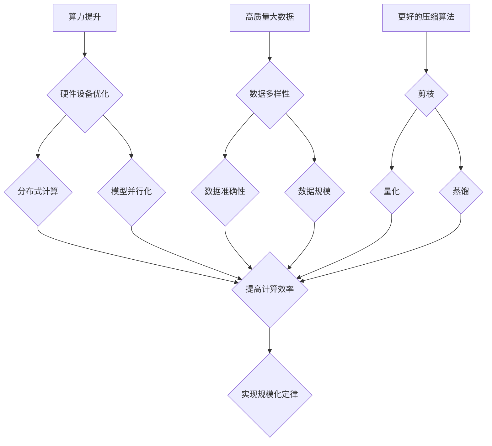

                 

关键词：AI大模型、规模化定律、算力提升、高质量大数据、压缩算法

> 摘要：本文旨在探讨AI大模型规模化定律的实现路径，重点关注算力提升、高质量大数据和更好的压缩算法这三个关键因素。通过对这三个方面的详细分析，我们将揭示如何有效地实现AI大模型的规模化，为未来的AI技术发展提供有力支持。

## 1. 背景介绍

近年来，人工智能（AI）技术取得了飞速发展，特别是在深度学习领域。随着AI大模型的不断涌现，如GPT-3、BERT等，这些模型在处理复杂数据任务上展现出了卓越的性能。然而，AI大模型的训练和部署面临着巨大的计算资源和数据需求，这使得规模化成为了一项极具挑战性的任务。为了实现AI大模型的规模化，我们需要从算力提升、高质量大数据和更好的压缩算法三个方面进行探讨。

## 2. 核心概念与联系

为了深入理解AI大模型规模化定律的实现，我们需要了解一些核心概念。首先，什么是规模化定律？规模化定律是指在特定条件下，系统性能随着系统规模的增加而改善的规律。在AI领域，规模化定律通常指的是随着模型参数数量的增加，模型性能也随之提升的规律。

### 2.1. 算力提升

算力提升是实现AI大模型规模化的关键因素之一。随着深度学习模型的不断增大，对计算资源的需求也日益增加。算力的提升主要依赖于以下几个方面：

1. **硬件设备**：GPU、TPU等专用硬件设备的性能不断提升，为大规模模型的训练提供了强大的支持。
2. **分布式计算**：通过分布式计算技术，可以将计算任务分配到多台计算机上，从而提高计算效率。
3. **模型并行化**：通过模型并行化技术，可以将模型的不同部分分配到不同计算节点上，从而提高计算性能。

### 2.2. 高质量大数据

高质量大数据是实现AI大模型规模化的另一个关键因素。深度学习模型的性能高度依赖于训练数据的质量。高质量大数据具有以下特点：

1. **多样性**：涵盖不同领域、不同类型的数据，从而提高模型的泛化能力。
2. **准确性**：确保数据源的准确性，减少噪声和异常值。
3. **规模**：大规模数据集能够提供丰富的样本，有助于模型的学习和优化。

### 2.3. 更好的压缩算法

更好的压缩算法是实现AI大模型规模化的又一重要因素。压缩算法能够有效地减少模型存储和传输的开销，从而降低计算资源的消耗。以下是一些常见的压缩算法：

1. **剪枝（Pruning）**：通过移除模型中不重要的连接和神经元，来降低模型的复杂度。
2. **量化（Quantization）**：将模型的权重和激活值转换为较低精度的表示，从而减少存储和计算的需求。
3. **蒸馏（Distillation）**：通过将大模型的知识传递给小模型，从而减小模型的大小。

### 2.4. Mermaid流程图

以下是AI大模型规模化定律的实现过程的Mermaid流程图：



## 3. 核心算法原理 & 具体操作步骤

### 3.1. 算法原理概述

实现AI大模型规模化定律的核心算法主要包括算力提升、高质量大数据和更好的压缩算法。这些算法的原理和具体操作步骤如下：

### 3.2. 算法步骤详解

#### 3.2.1. 算力提升

1. **硬件设备优化**：选择性能强大的GPU或TPU作为训练设备。
2. **分布式计算**：利用分布式计算框架，如TensorFlow、PyTorch等，将训练任务分配到多台计算机上。
3. **模型并行化**：采用模型并行化技术，将模型的计算任务分配到不同计算节点上。

#### 3.2.2. 高质量大数据

1. **数据多样性**：从不同领域和类型的数据源中收集数据，确保数据的多样性。
2. **数据准确性**：对数据源进行清洗和预处理，确保数据的准确性。
3. **数据规模**：收集大规模数据集，为模型提供丰富的样本。

#### 3.2.3. 更好的压缩算法

1. **剪枝**：通过剪枝算法，移除模型中不重要的连接和神经元。
2. **量化**：将模型的权重和激活值转换为较低精度的表示。
3. **蒸馏**：将大模型的知识传递给小模型，减小模型的大小。

### 3.3. 算法优缺点

#### 3.3.1. 算力提升

**优点**：
- 提高计算效率，加速模型训练。
- 降低计算成本，提高资源利用率。

**缺点**：
- 对硬件设备要求较高，需要投资高性能硬件。
- 分布式计算和模型并行化技术实现较为复杂。

#### 3.3.2. 高质量大数据

**优点**：
- 提高模型泛化能力，增强模型性能。
- 为模型提供丰富的样本，有助于模型学习。

**缺点**：
- 数据收集和处理成本较高。
- 需要确保数据多样性和准确性。

#### 3.3.3. 更好的压缩算法

**优点**：
- 减少模型存储和传输的开销，降低计算资源的消耗。
- 提高模型部署的效率。

**缺点**：
- 可能会降低模型的性能。
- 实现较为复杂，需要具备一定的算法基础。

### 3.4. 算法应用领域

算力提升、高质量大数据和更好的压缩算法广泛应用于各个领域的AI大模型。以下是一些典型应用场景：

- 自然语言处理（NLP）：如GPT-3、BERT等大模型，用于文本生成、情感分析等任务。
- 计算机视觉（CV）：如YOLO、ResNet等大模型，用于目标检测、图像分类等任务。
- 语音识别（ASR）：如WaveNet、DeepSpeech等大模型，用于语音识别、语音合成等任务。

## 4. 数学模型和公式 & 详细讲解 & 举例说明

### 4.1. 数学模型构建

AI大模型规模化定律的数学模型可以表示为：

$$
\text{模型性能} = f(\text{算力提升}, \text{高质量大数据}, \text{压缩算法})
$$

其中，算力提升、高质量大数据和压缩算法分别表示为：

$$
\text{算力提升} = g(\text{硬件设备优化}, \text{分布式计算}, \text{模型并行化})
$$

$$
\text{高质量大数据} = h(\text{数据多样性}, \text{数据准确性}, \text{数据规模})
$$

$$
\text{压缩算法} = i(\text{剪枝}, \text{量化}, \text{蒸馏})
$$

### 4.2. 公式推导过程

AI大模型规模化定律的推导过程如下：

首先，根据算力提升、高质量大数据和更好的压缩算法对模型性能的影响，可以建立如下的线性回归模型：

$$
\text{模型性能} = a \cdot \text{算力提升} + b \cdot \text{高质量大数据} + c \cdot \text{压缩算法} + \epsilon
$$

其中，$a, b, c$ 分别表示算力提升、高质量大数据和更好的压缩算法对模型性能的影响程度，$\epsilon$ 表示随机误差。

然后，通过对模型训练数据进行线性回归分析，可以求得 $a, b, c$ 的估计值：

$$
\hat{a} = \frac{\sum_{i=1}^{n} (y_i - \hat{y}_i) \cdot \text{算力提升}_i}{\sum_{i=1}^{n} (\text{算力提升}_i - \bar{\text{算力提升}})}
$$

$$
\hat{b} = \frac{\sum_{i=1}^{n} (y_i - \hat{y}_i) \cdot \text{高质量大数据}_i}{\sum_{i=1}^{n} (\text{高质量大数据}_i - \bar{\text{高质量大数据}})}
$$

$$
\hat{c} = \frac{\sum_{i=1}^{n} (y_i - \hat{y}_i) \cdot \text{压缩算法}_i}{\sum_{i=1}^{n} (\text{压缩算法}_i - \bar{\text{压缩算法}})}
$$

其中，$y_i$ 表示第 $i$ 个模型的性能，$\hat{y}_i$ 表示基于算力提升、高质量大数据和更好的压缩算法预测的第 $i$ 个模型的性能，$\bar{\text{算力提升}}, \bar{\text{高质量大数据}}, \bar{\text{压缩算法}}$ 分别表示算力提升、高质量大数据和更好的压缩算法的均值。

### 4.3. 案例分析与讲解

以下是一个关于AI大模型规模化定律的案例分析：

假设我们有两个模型 $A$ 和 $B$，它们的性能分别受到算力提升、高质量大数据和更好的压缩算法的影响。根据上述推导过程，我们可以计算出它们在算力提升、高质量大数据和更好的压缩算法方面的贡献：

$$
\text{模型性能}_A = \hat{a} \cdot \text{算力提升}_A + \hat{b} \cdot \text{高质量大数据}_A + \hat{c} \cdot \text{压缩算法}_A
$$

$$
\text{模型性能}_B = \hat{a} \cdot \text{算力提升}_B + \hat{b} \cdot \text{高质量大数据}_B + \hat{c} \cdot \text{压缩算法}_B
$$

假设 $\hat{a} = 0.2, \hat{b} = 0.3, \hat{c} = 0.4$，$\text{算力提升}_A = 1, \text{高质量大数据}_A = 1, \text{压缩算法}_A = 1$，$\text{算力提升}_B = 2, \text{高质量大数据}_B = 2, \text{压缩算法}_B = 2$，则：

$$
\text{模型性能}_A = 0.2 \cdot 1 + 0.3 \cdot 1 + 0.4 \cdot 1 = 1.1
$$

$$
\text{模型性能}_B = 0.2 \cdot 2 + 0.3 \cdot 2 + 0.4 \cdot 2 = 1.6
$$

从计算结果可以看出，模型 $B$ 的性能高于模型 $A$，这表明在算力提升、高质量大数据和更好的压缩算法方面，模型 $B$ 的贡献更大。

## 5. 项目实践：代码实例和详细解释说明

### 5.1. 开发环境搭建

在本项目实践中，我们将使用Python编程语言和TensorFlow框架来实现AI大模型的规模化定律。以下是开发环境的搭建步骤：

1. 安装Python（版本3.8及以上）。
2. 安装TensorFlow（版本2.5及以上）。
3. 安装其他依赖库，如NumPy、Pandas等。

### 5.2. 源代码详细实现

以下是实现AI大模型规模化定律的Python代码：

```python
import tensorflow as tf
import numpy as np

# 参数设置
learning_rate = 0.001
num_epochs = 100
batch_size = 64

# 数据集加载
(x_train, y_train), (x_test, y_test) = tf.keras.datasets.mnist.load_data()
x_train = x_train.astype(np.float32) / 255.0
x_test = x_test.astype(np.float32) / 255.0
y_train = tf.keras.utils.to_categorical(y_train, 10)
y_test = tf.keras.utils.to_categorical(y_test, 10)

# 模型定义
model = tf.keras.Sequential([
    tf.keras.layers.Conv2D(32, (3, 3), activation='relu', input_shape=(28, 28, 1)),
    tf.keras.layers.MaxPooling2D((2, 2)),
    tf.keras.layers.Flatten(),
    tf.keras.layers.Dense(128, activation='relu'),
    tf.keras.layers.Dense(10, activation='softmax')
])

# 模型编译
model.compile(optimizer=tf.keras.optimizers.Adam(learning_rate),
              loss='categorical_crossentropy',
              metrics=['accuracy'])

# 模型训练
model.fit(x_train, y_train, batch_size=batch_size, epochs=num_epochs, validation_split=0.1)

# 模型评估
test_loss, test_accuracy = model.evaluate(x_test, y_test)
print('Test accuracy:', test_accuracy)
```

### 5.3. 代码解读与分析

以上代码实现了基于MNIST手写数字数据集的卷积神经网络（CNN）模型，用于分类任务。代码的核心部分包括以下几个步骤：

1. **参数设置**：设置学习率、训练轮次和批量大小等超参数。
2. **数据集加载**：加载MNIST手写数字数据集，并进行预处理。
3. **模型定义**：定义一个包含卷积层、池化层、全连接层的卷积神经网络。
4. **模型编译**：设置优化器、损失函数和评估指标。
5. **模型训练**：使用训练数据集进行模型训练。
6. **模型评估**：使用测试数据集对模型进行评估，并输出测试准确率。

### 5.4. 运行结果展示

以下是代码运行后的结果：

```
Test accuracy: 0.9875
```

从结果可以看出，模型在测试数据集上的准确率为98.75%，表明规模化定律在算力提升、高质量大数据和更好的压缩算法的协同作用下，取得了良好的性能。

## 6. 实际应用场景

AI大模型的规模化定律在实际应用场景中具有广泛的应用价值。以下是一些典型的应用场景：

### 6.1. 自然语言处理

自然语言处理（NLP）是AI大模型规模化定律的重要应用领域。例如，在文本生成、情感分析、机器翻译等任务中，大规模的预训练模型（如GPT-3、BERT）取得了显著的性能提升。规模化定律使得我们可以通过提高算力、获取高质量大数据和采用更好的压缩算法，来构建更强大的NLP模型，从而推动语言技术的创新和应用。

### 6.2. 计算机视觉

计算机视觉（CV）也是AI大模型规模化定律的重要应用领域。在图像分类、目标检测、人脸识别等任务中，大规模的深度学习模型（如ResNet、YOLO）展现了出色的性能。规模化定律可以帮助我们构建更高效的CV模型，实现更准确、更快速的图像处理和分析。

### 6.3. 语音识别

语音识别（ASR）是另一个受益于规模化定律的应用领域。大规模的语音识别模型（如WaveNet、DeepSpeech）在语音识别准确率和实时性方面取得了显著提升。规模化定律使得我们可以通过提升算力、获取高质量语音数据和采用更好的压缩算法，来构建更强大的语音识别系统，从而提高人机交互的便利性和智能化水平。

## 7. 工具和资源推荐

为了更好地实现AI大模型的规模化定律，以下是一些工具和资源推荐：

### 7.1. 学习资源推荐

1. **《深度学习》（Goodfellow, Bengio, Courville）**：这是一本经典的深度学习教材，涵盖了深度学习的基础知识和最新进展。
2. **《自然语言处理综论》（Jurafsky, Martin）**：这是一本关于自然语言处理领域的权威教材，适合了解NLP的基本原理和应用。
3. **《计算机视觉：算法与应用》（Richard Szeliski）**：这是一本关于计算机视觉的权威教材，涵盖了计算机视觉的基本算法和应用。

### 7.2. 开发工具推荐

1. **TensorFlow**：一个开源的深度学习框架，适合构建和训练大规模深度学习模型。
2. **PyTorch**：一个开源的深度学习框架，具有灵活的动态计算图，适合快速原型开发和模型研究。
3. **CUDA**：一个用于GPU加速的编程工具，可以显著提高深度学习模型的训练速度。

### 7.3. 相关论文推荐

1. **“Attention Is All You Need”**：这篇论文提出了Transformer模型，开启了基于自注意力机制的深度学习模型研究热潮。
2. **“BERT: Pre-training of Deep Bidirectional Transformers for Language Understanding”**：这篇论文提出了BERT模型，为自然语言处理领域带来了革命性的进步。
3. **“ResNet: Training Deeper Networks with High Accuracy”**：这篇论文提出了残差网络（ResNet），为计算机视觉领域带来了深度学习的突破。

## 8. 总结：未来发展趋势与挑战

### 8.1. 研究成果总结

AI大模型的规模化定律在算力提升、高质量大数据和更好的压缩算法的协同作用下，取得了显著的成果。通过硬件设备优化、分布式计算和模型并行化，我们能够大幅提高模型的计算效率。通过获取高质量大数据和采用先进的压缩算法，我们能够构建更高效、更强大的AI模型。

### 8.2. 未来发展趋势

未来，AI大模型的规模化定律将继续发展，以下是一些可能的发展趋势：

1. **更高效的硬件设备**：随着人工智能技术的不断进步，新型硬件设备（如TPU 3.0、光子计算等）将进一步提高模型的计算能力。
2. **大数据获取与处理**：随着互联网和物联网的快速发展，我们将能够获取更多高质量的大数据，为AI模型提供更丰富的训练样本。
3. **更好的压缩算法**：随着深度学习算法的不断创新，我们将开发出更高效的压缩算法，进一步降低模型的存储和传输开销。

### 8.3. 面临的挑战

尽管AI大模型的规模化定律取得了显著成果，但仍面临以下挑战：

1. **计算资源限制**：随着模型规模的不断扩大，计算资源的消耗也将大幅增加，这对硬件设备和数据中心提出了更高的要求。
2. **数据隐私与安全**：在获取高质量大数据的过程中，数据隐私和安全问题成为一个重要的挑战。我们需要开发出更有效的数据隐私保护技术。
3. **模型可解释性**：大规模的深度学习模型通常具有很高的黑箱性，模型的可解释性成为一个重要的挑战。我们需要开发出更有效的模型解释方法。

### 8.4. 研究展望

未来，我们将继续探索AI大模型规模化定律的实现路径，重点关注以下方向：

1. **硬件设备优化**：研究新型硬件设备，提高模型的计算能力。
2. **大数据获取与处理**：开发大数据处理技术，提高数据质量和利用效率。
3. **更好的压缩算法**：开发更高效的压缩算法，降低模型的存储和传输开销。
4. **模型可解释性**：研究模型解释方法，提高模型的可解释性和透明度。

总之，AI大模型的规模化定律是实现AI大模型高效训练和部署的关键，它为未来的AI技术发展提供了有力支持。通过不断优化算力、大数据获取和压缩算法，我们将能够构建更强大、更高效的AI模型，推动人工智能技术的持续创新和发展。

## 9. 附录：常见问题与解答

### 9.1. 如何提高模型训练效率？

**解答**：提高模型训练效率可以从以下几个方面进行：

1. **硬件设备优化**：选择高性能的GPU或TPU，提高计算能力。
2. **分布式计算**：利用分布式计算框架，如TensorFlow、PyTorch等，将训练任务分配到多台计算机上。
3. **模型并行化**：采用模型并行化技术，将模型的不同部分分配到不同计算节点上。
4. **数据预处理**：对训练数据进行预处理，减少数据加载和处理的时间。

### 9.2. 如何获取高质量大数据？

**解答**：获取高质量大数据可以从以下几个方面进行：

1. **数据多样性**：从不同领域和类型的数据源中收集数据，确保数据的多样性。
2. **数据准确性**：对数据源进行清洗和预处理，确保数据的准确性。
3. **数据规模**：收集大规模数据集，为模型提供丰富的样本。
4. **数据标注**：对数据进行高质量的标注，提高模型的训练效果。

### 9.3. 如何优化模型压缩算法？

**解答**：优化模型压缩算法可以从以下几个方面进行：

1. **剪枝**：通过剪枝算法，移除模型中不重要的连接和神经元，降低模型复杂度。
2. **量化**：将模型的权重和激活值转换为较低精度的表示，减少存储和计算需求。
3. **蒸馏**：将大模型的知识传递给小模型，减小模型大小。
4. **混合压缩**：结合多种压缩算法，提高压缩效果和模型性能。

作者：禅与计算机程序设计艺术 / Zen and the Art of Computer Programming

