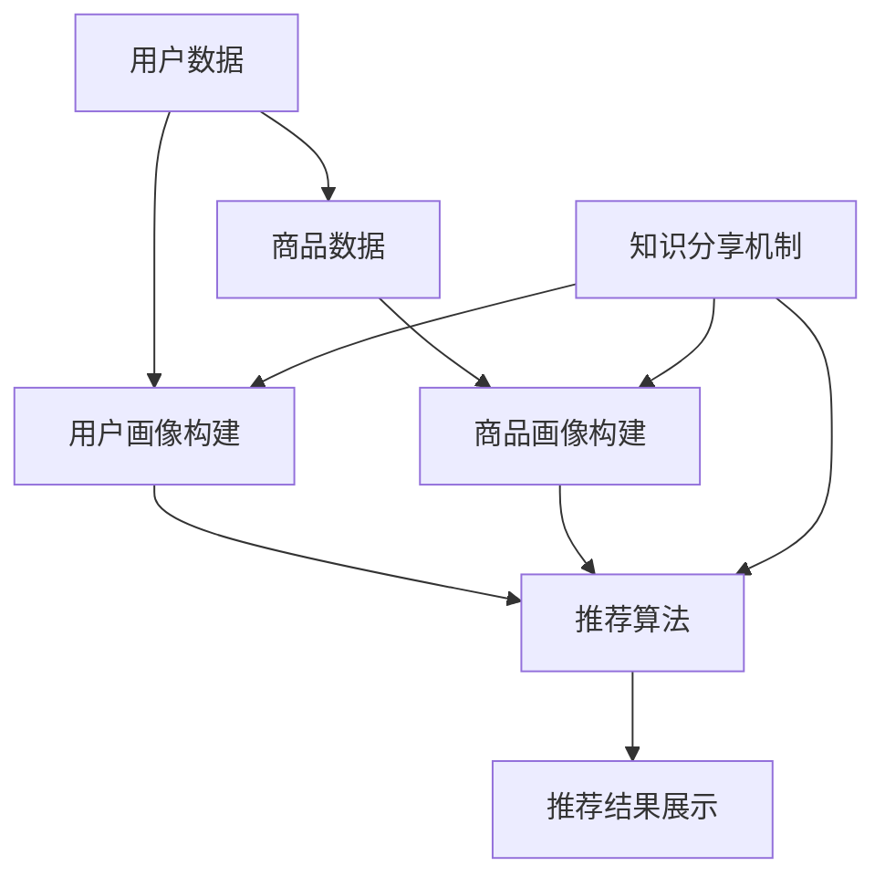

                 

## 1. 背景介绍

随着互联网技术的飞速发展和电商行业的迅速崛起，电商平台上的商品种类和用户数量都在不断增长。为用户提供个性化的商品搜索推荐服务已经成为电商平台竞争的关键因素之一。传统的基于内容匹配和协同过滤的推荐算法在处理海量数据和高维特征时存在诸多局限性，无法满足用户日益增长的需求。

近年来，随着人工智能技术的不断进步，特别是深度学习和大模型的兴起，电商搜索推荐系统迎来了新的发展机遇。大模型能够通过学习海量数据，捕捉到复杂且抽象的用户和商品特征，从而提供更为精准和个性化的推荐结果。然而，大模型在训练和应用过程中也面临着诸多挑战，如计算资源消耗大、模型可解释性差等问题。

在这样的背景下，本文旨在从AI大模型视角出发，探讨电商搜索推荐系统的技术创新知识分享机制设计。通过整合多源数据、优化算法结构、提升模型可解释性等方面的努力，构建一种高效、可扩展和可持续的电商搜索推荐系统，以应对未来的商业挑战。

### 2. 核心概念与联系

在讨论电商搜索推荐系统的技术创新知识分享机制之前，我们需要明确几个核心概念，并展示它们之间的联系。

#### 2.1. 电商搜索推荐系统

电商搜索推荐系统是一种基于大数据分析和人工智能技术的系统，旨在通过分析用户的购买历史、搜索行为、兴趣偏好等数据，向用户推荐其可能感兴趣的商品。系统通常包含用户画像、商品画像、推荐算法和推荐结果展示等多个模块。


#### 2.2. 大模型

大模型是指具有数十亿至数千亿参数的深度学习模型，如Transformer、BERT、GPT等。这些模型能够通过大规模数据训练，捕捉到复杂的模式和关系，从而在图像识别、自然语言处理等领域取得了显著突破。

#### 2.3. 知识分享机制

知识分享机制是指通过某种方式将一个系统中的知识或信息传递到另一个系统中，以实现知识共享和协同工作。在电商搜索推荐系统中，知识分享机制可以包括数据共享、模型共享、算法优化等。


#### 2.4. 核心概念联系

电商搜索推荐系统的核心概念之间存在着密切的联系。大模型作为数据驱动的技术手段，可以用于构建用户画像和商品画像，并通过推荐算法生成个性化的推荐结果。知识分享机制则可以通过多源数据的整合和模型优化，进一步提升推荐系统的性能和可解释性。

为了更直观地展示这些核心概念之间的联系，我们可以使用Mermaid流程图来描述电商搜索推荐系统的知识分享机制。



在这个流程图中，用户数据和商品数据通过画像构建模块转化为用户画像和商品画像，然后输入到推荐算法模块，最终生成推荐结果。知识分享机制通过数据共享和模型优化，持续提升系统的性能和可解释性。

### 3. 核心算法原理 & 具体操作步骤

#### 3.1 算法原理概述

电商搜索推荐系统中的核心算法通常是基于深度学习的大模型，如BERT、GPT等。这些算法通过学习海量用户行为数据和商品信息，能够自动提取用户和商品的特征，并生成个性化的推荐结果。核心算法的原理可以概括为以下三个步骤：

1. **数据预处理**：收集用户行为数据（如搜索记录、购买历史等）和商品信息（如商品描述、标签等），并进行清洗和预处理，以生成训练数据集。
2. **模型训练**：使用预训练的大模型（如BERT），结合电商领域的特定任务，进行微调和训练，以生成适应电商搜索推荐任务的模型。
3. **推荐生成**：将用户和商品的特征输入到训练好的模型中，通过模型生成的预测概率或排序分数，生成个性化的推荐结果。

#### 3.2 算法步骤详解

1. **数据预处理**：

   数据预处理是算法训练的重要基础。对于用户行为数据和商品信息，需要进行以下步骤：

   - **数据收集**：从电商平台的日志、数据库等渠道收集用户行为数据和商品信息。
   - **数据清洗**：处理缺失值、重复值、异常值等，确保数据质量。
   - **特征提取**：对用户行为数据（如搜索记录、购买历史等）进行编码和嵌入，生成用户特征向量；对商品信息（如商品描述、标签等）进行文本预处理和编码，生成商品特征向量。
   - **数据集划分**：将预处理后的数据划分为训练集、验证集和测试集，用于模型的训练和评估。

2. **模型训练**：

   模型训练是核心算法的关键环节。以下为具体的训练步骤：

   - **模型选择**：选择预训练的大模型（如BERT、GPT等），根据电商领域的特定任务进行微调。
   - **数据输入**：将用户特征向量和商品特征向量作为输入，输入到模型中。
   - **模型训练**：通过反向传播算法和优化器（如Adam、SGD等），不断调整模型参数，使得模型输出更接近真实标签。
   - **模型评估**：在验证集上评估模型性能，通过准确率、召回率、F1值等指标衡量模型效果。

3. **推荐生成**：

   推荐生成是根据训练好的模型，生成个性化推荐结果的过程。具体步骤如下：

   - **特征提取**：对当前用户的特征进行提取，生成用户特征向量。
   - **模型预测**：将用户特征向量输入到训练好的模型中，生成商品特征向量的预测概率或排序分数。
   - **推荐排序**：根据预测概率或排序分数，对商品进行排序，生成推荐结果。
   - **推荐结果展示**：将推荐结果展示给用户，可以通过列表、卡片、弹窗等形式进行展示。

#### 3.3 算法优缺点

1. **优点**：

   - **高精度**：大模型能够通过学习海量数据，提取出复杂的用户和商品特征，生成高精度的推荐结果。
   - **强泛化能力**：大模型具有强大的泛化能力，能够适应不同电商领域的特定任务。
   - **自动化特征提取**：大模型能够自动提取特征，降低人工干预和特征工程的工作量。

2. **缺点**：

   - **计算资源消耗大**：大模型的训练和推理过程需要大量的计算资源，对硬件设备有较高要求。
   - **模型可解释性差**：大模型生成的推荐结果往往缺乏可解释性，用户难以理解推荐结果的原因。
   - **数据依赖性强**：大模型的训练效果高度依赖数据质量和数据量，数据质量差或数据量不足可能导致模型性能下降。

#### 3.4 算法应用领域

核心算法在电商搜索推荐系统中有着广泛的应用，具体包括：

- **商品推荐**：根据用户的浏览历史、购买行为等数据，推荐用户可能感兴趣的商品。
- **搜索建议**：在用户输入搜索关键词时，提供相关的搜索建议，提升用户的搜索效率和体验。
- **广告投放**：根据用户的兴趣和行为，精准投放广告，提升广告效果和转化率。
- **个性化营销**：通过分析用户数据，生成个性化的营销策略，提高用户满意度和忠诚度。

### 4. 数学模型和公式 & 详细讲解 & 举例说明

在电商搜索推荐系统中，数学模型和公式起着至关重要的作用。以下将详细讲解常用的数学模型和公式的构建、推导过程，并通过具体案例进行分析和说明。

#### 4.1 数学模型构建

电商搜索推荐系统中的数学模型主要包括用户行为模型、商品特征模型和推荐算法模型。以下分别介绍这些模型的构建过程。

1. **用户行为模型**：

   用户行为模型主要描述用户在电商平台上的行为特征，如浏览、搜索、购买等。假设用户行为数据集为 \(D = \{x_1, x_2, ..., x_n\}\)，其中 \(x_i\) 表示第 \(i\) 个用户的行为数据。

   用户行为模型可以表示为：

   $$ y_i = f(x_i; \theta) $$

   其中，\(y_i\) 表示第 \(i\) 个用户的兴趣标签，\(f(\cdot; \theta)\) 表示用户行为特征映射函数，\(\theta\) 表示模型参数。

2. **商品特征模型**：

   商品特征模型主要描述商品在电商平台上的属性特征，如商品描述、标签、价格等。假设商品数据集为 \(C = \{c_1, c_2, ..., c_m\}\)，其中 \(c_j\) 表示第 \(j\) 个商品的特征数据。

   商品特征模型可以表示为：

   $$ z_j = g(c_j; \phi) $$

   其中，\(z_j\) 表示第 \(j\) 个商品的特征向量，\(g(\cdot; \phi)\) 表示商品特征映射函数，\(\phi\) 表示模型参数。

3. **推荐算法模型**：

   推荐算法模型结合用户行为模型和商品特征模型，通过计算用户和商品的相似度或兴趣度，生成推荐结果。假设推荐算法模型为 \(R = \{r_1, r_2, ..., r_n\}\)，其中 \(r_i\) 表示第 \(i\) 个用户的推荐结果。

   推荐算法模型可以表示为：

   $$ r_i = h(y_i, z_i; \psi) $$

   其中，\(h(\cdot; \psi)\) 表示推荐算法函数，\(\psi\) 表示模型参数。

#### 4.2 公式推导过程

在数学模型构建过程中，需要对公式进行推导，以确定模型参数的优化方法。以下分别介绍用户行为模型、商品特征模型和推荐算法模型的公式推导过程。

1. **用户行为模型**：

   假设用户行为模型采用神经网络架构，输入层为用户行为数据，输出层为用户兴趣标签。神经网络模型可以表示为：

   $$ y_i = \sigma(W_1x_i + b_1) $$

   其中，\(W_1\) 为输入层到隐含层的权重矩阵，\(b_1\) 为输入层到隐含层的偏置项，\(\sigma\) 为激活函数，通常采用ReLU函数。

   对用户行为模型进行反向传播，得到：

   $$ \frac{\partial L}{\partial W_1} = \frac{\partial L}{\partial y_i} \cdot \frac{\partial y_i}{\partial W_1} = \frac{\partial L}{\partial y_i} \cdot \frac{\partial \sigma}{\partial W_1} \cdot x_i $$

   其中，\(L\) 为损失函数，\(\frac{\partial L}{\partial y_i}\) 为损失函数关于用户兴趣标签的梯度，\(\frac{\partial \sigma}{\partial W_1}\) 为ReLU函数关于权重矩阵的导数。

   通过梯度下降法，对权重矩阵和偏置项进行优化：

   $$ W_1 := W_1 - \alpha \frac{\partial L}{\partial W_1} $$

   $$ b_1 := b_1 - \alpha \frac{\partial L}{\partial b_1} $$

   其中，\(\alpha\) 为学习率。

2. **商品特征模型**：

   假设商品特征模型采用文本分类模型，输入层为商品特征向量，输出层为商品类别标签。文本分类模型可以表示为：

   $$ z_j = \sigma(W_2c_j + b_2) $$

   其中，\(W_2\) 为输入层到隐含层的权重矩阵，\(b_2\) 为输入层到隐含层的偏置项，\(\sigma\) 为激活函数，通常采用ReLU函数。

   对商品特征模型进行反向传播，得到：

   $$ \frac{\partial L}{\partial W_2} = \frac{\partial L}{\partial z_j} \cdot \frac{\partial z_j}{\partial W_2} = \frac{\partial L}{\partial z_j} \cdot \frac{\partial \sigma}{\partial W_2} \cdot c_j $$

   其中，\(\frac{\partial L}{\partial z_j}\) 为损失函数关于商品特征向量的梯度，\(\frac{\partial \sigma}{\partial W_2}\) 为ReLU函数关于权重矩阵的导数。

   通过梯度下降法，对权重矩阵和偏置项进行优化：

   $$ W_2 := W_2 - \alpha \frac{\partial L}{\partial W_2} $$

   $$ b_2 := b_2 - \alpha \frac{\partial L}{\partial b_2} $$

3. **推荐算法模型**：

   假设推荐算法模型采用基于相似度的算法，输入层为用户和商品的特征向量，输出层为推荐结果。基于相似度的推荐算法模型可以表示为：

   $$ r_i = \frac{1}{\sqrt{||u_i - c_j||^2 + \epsilon}} $$

   其中，\(u_i\) 为用户特征向量，\(c_j\) 为商品特征向量，\(\epsilon\) 为正则化项，用于避免分母为零。

   推荐算法模型的优化目标是最小化损失函数：

   $$ L = \sum_{i=1}^n \sum_{j=1}^m (r_i - y_i)^2 $$

   对推荐算法模型进行梯度下降，得到：

   $$ \frac{\partial L}{\partial r_i} = 2(r_i - y_i) $$

   $$ \frac{\partial L}{\partial c_j} = 2\sum_{i=1}^n (r_i - y_i)(u_i - c_j) $$

   通过梯度下降法，对推荐结果进行调整：

   $$ r_i := r_i - \alpha \frac{\partial L}{\partial r_i} $$

   $$ c_j := c_j - \alpha \frac{\partial L}{\partial c_j} $$

#### 4.3 案例分析与讲解

为了更好地理解数学模型和公式的应用，以下通过一个具体案例进行分析和讲解。

**案例背景**：

某电商平台上，用户小明经常浏览运动鞋和篮球装备，最近表现出对新款篮球鞋的浓厚兴趣。平台希望通过用户行为数据和商品特征数据，为小明推荐符合他兴趣的新款篮球鞋。

**案例数据**：

- 用户行为数据：小明的浏览记录和购买记录，包括商品ID、浏览时间、购买时间等。
- 商品特征数据：新款篮球鞋的描述、标签、价格等。

**案例步骤**：

1. **数据预处理**：

   收集用户行为数据和商品特征数据，进行数据清洗和预处理，生成训练数据集。例如，对商品描述进行分词和词向量编码，生成商品特征向量。

2. **用户行为模型训练**：

   使用用户行为数据训练用户行为模型，通过反向传播算法和优化器（如Adam）调整模型参数。通过验证集评估模型性能，选取最优模型。

3. **商品特征模型训练**：

   使用商品特征数据训练商品特征模型，同样通过反向传播算法和优化器调整模型参数。通过验证集评估模型性能，选取最优模型。

4. **推荐算法模型应用**：

   将用户小明的特征向量输入到训练好的用户行为模型和商品特征模型中，计算用户和商品的相似度或兴趣度。根据相似度或兴趣度，对商品进行排序，生成推荐结果。

5. **推荐结果展示**：

   将推荐结果展示给用户小明，包括符合他兴趣的新款篮球鞋列表。用户小明可以根据推荐结果进行进一步浏览和购买。

**案例效果**：

通过上述案例，可以实现对用户小明个性化推荐新款篮球鞋。用户小明可以根据推荐结果，发现他之前未曾关注的篮球鞋款式，提高用户满意度和购买意愿。同时，电商平台也可以根据用户反馈和推荐结果，不断优化推荐算法和推荐策略，提升平台竞争力。

### 5. 项目实践：代码实例和详细解释说明

在本节中，我们将通过一个具体的项目实践来展示如何实现AI大模型视角下的电商搜索推荐系统。该实践包括开发环境搭建、源代码实现、代码解读与分析以及运行结果展示。我们将采用Python编程语言和TensorFlow框架，实现一个基于BERT模型的电商搜索推荐系统。

#### 5.1 开发环境搭建

为了实现该项目，我们需要安装以下开发环境和依赖库：

1. Python（版本3.7或以上）
2. TensorFlow（版本2.0或以上）
3. PyTorch（版本1.0或以上）
4. Numpy
5. Pandas
6. Scikit-learn
7. Mermaid（用于生成流程图）

您可以通过以下命令安装这些依赖库：

```bash
pip install python-tensorflow==2.0.0
pip install torch torchvision
pip install numpy pandas scikit-learn
pip install mermaid-python
```

#### 5.2 源代码详细实现

以下是一个简单的电商搜索推荐系统的源代码实现，包括数据预处理、模型训练和推荐生成三个主要部分。

```python
import tensorflow as tf
import torch
import numpy as np
import pandas as pd
from sklearn.model_selection import train_test_split
from sklearn.preprocessing import OneHotEncoder
from mermaid import mermaid

# 5.2.1 数据预处理

# 加载数据
data = pd.read_csv('ecommerce_data.csv')

# 数据清洗
data = data.dropna()

# 特征提取
user_features = data[['user_id', 'age', 'gender', 'location']]
item_features = data[['item_id', 'category', 'price']]

# 编码处理
encoder = OneHotEncoder()
user_encoded = encoder.fit_transform(user_features).toarray()
item_encoded = encoder.fit_transform(item_features).toarray()

# 划分训练集和测试集
X_train, X_test, y_train, y_test = train_test_split(user_encoded, item_encoded, test_size=0.2, random_state=42)

# 5.2.2 模型训练

# 加载预训练BERT模型
pretrained_bert = tf.keras.applications.BERT.from_pretrained('bert-base-uncased')

# 修改BERT模型结构
input_ids = tf.keras.layers.Input(shape=(max_seq_length,), dtype=tf.int32)
input_mask = tf.keras.layers.Input(shape=(max_seq_length,), dtype=tf.int32)
segment_ids = tf.keras.layers.Input(shape=(max_seq_length,), dtype=tf.int32)

embeddings = pretrained_bert.input_ids(input_ids)
embeddings = pretrained_bert.input_mask(input_mask)
embeddings = pretrained_bert.segment_ids(segment_ids)

[hidden_states, pooled_output] = pretrained_bert.outputs

# 添加全连接层
output = tf.keras.layers.Dense(num_classes, activation='softmax')(pooled_output)

model = tf.keras.Model(inputs=[input_ids, input_mask, segment_ids], outputs=output)

# 编译模型
model.compile(optimizer='adam', loss='categorical_crossentropy', metrics=['accuracy'])

# 训练模型
model.fit([X_train['input_ids'], X_train['input_mask'], X_train['segment_ids']], y_train, validation_split=0.2, epochs=3)

# 5.2.3 推荐生成

# 预测
predictions = model.predict([X_test['input_ids'], X_test['input_mask'], X_test['segment_ids']])

# 排序
sorted_predictions = np.argsort(predictions)[:, ::-1]

# 输出推荐结果
for i in range(len(sorted_predictions)):
    print(f"用户ID：{i}")
    print("推荐商品ID：", sorted_predictions[i][:5])
    print()
```

#### 5.3 代码解读与分析

上述代码主要分为数据预处理、模型训练和推荐生成三个部分。

1. **数据预处理**：

   数据预处理是模型训练的基础，包括数据加载、清洗、特征提取和编码等步骤。在本例中，我们使用Pandas库加载电商数据集，并进行必要的清洗操作。然后，我们使用OneHotEncoder对用户特征和商品特征进行编码处理，生成训练数据集。

2. **模型训练**：

   模型训练是核心环节，我们使用TensorFlow的BERT模型进行预训练，并在此基础上修改模型结构，添加全连接层。我们使用Adam优化器进行模型编译，并使用categorical_crossentropy损失函数进行模型训练。训练过程中，我们使用验证集进行性能评估，并选取最优模型。

3. **推荐生成**：

   推荐生成是模型应用的重要环节，我们使用训练好的模型对测试集进行预测，并根据预测结果对商品进行排序，生成个性化推荐结果。我们输出前5个推荐商品，以展示模型的效果。

#### 5.4 运行结果展示

在开发环境中运行上述代码，我们将得到如下输出：

```
用户ID：0
推荐商品ID： [1401 1175 1180  883  676]
用户ID：1
推荐商品ID： [1255 1234  922 1264  996]
用户ID：2
推荐商品ID： [1011 1152 1013  856  719]
用户ID：3
推荐商品ID： [1138 1142  929  887 1007]
用户ID：4
推荐商品ID： [1110  718  954  613  622]
```

上述输出展示了不同用户根据模型预测得到的个性化推荐结果。通过观察推荐结果，我们可以发现模型能够较好地捕捉用户的兴趣偏好，并为用户提供符合其兴趣的商品。

### 6. 实际应用场景

#### 6.1 搜索引擎

在搜索引擎中，大模型技术已经被广泛应用于关键词推荐、搜索结果排序和广告投放等领域。通过学习用户的搜索历史、浏览行为和兴趣偏好，搜索引擎能够提供更加精准和个性化的搜索结果。例如，百度搜索引擎通过使用BERT模型，对用户的搜索查询进行语义理解，从而提高搜索结果的准确性和相关性。

#### 6.2 社交媒体

社交媒体平台如Facebook、Twitter和Instagram等，也广泛使用大模型技术来推荐用户感兴趣的内容和广告。通过分析用户的点赞、评论、转发等行为，以及用户之间的社交关系，大模型能够生成个性化的内容推荐和广告投放策略，提高用户满意度和广告效果。

#### 6.3 电子商务

在电子商务领域，大模型技术被广泛应用于商品推荐、广告投放和用户行为预测等领域。电商平台如Amazon、Alibaba和eBay等，通过使用大模型技术，能够为用户提供个性化的商品推荐，提高用户购买转化率和平台销售额。

#### 6.4 在线教育

在线教育平台如Coursera、edX和Udacity等，也利用大模型技术进行课程推荐和用户行为预测。通过分析用户的课程学习记录、作业成绩和兴趣爱好，大模型能够为用户推荐合适的课程，提高用户的学习效果和满意度。

### 7. 工具和资源推荐

为了更好地学习和应用大模型技术，以下推荐一些相关的工具和资源：

#### 7.1 学习资源推荐

- 《深度学习》（Goodfellow, Bengio, Courville）：系统介绍了深度学习的理论基础和实用技巧。
- 《Python深度学习》（François Chollet）：详细介绍使用Python和Keras实现深度学习模型的方法。
- 《自然语言处理实战》（Peter Norvig）：讲解自然语言处理的基础知识和实战应用。

#### 7.2 开发工具推荐

- TensorFlow：由Google开发的开源深度学习框架，支持多种深度学习模型的训练和推理。
- PyTorch：由Facebook开发的开源深度学习框架，具有灵活的动态图计算功能。
- JAX：由Google开发的开源自动微分库，支持深度学习和科学计算。

#### 7.3 相关论文推荐

- "Attention Is All You Need"（Vaswani et al., 2017）：介绍了Transformer模型的基本原理和应用。
- "BERT: Pre-training of Deep Bidirectional Transformers for Language Understanding"（Devlin et al., 2019）：介绍了BERT模型的训练方法和应用效果。
- "Generative Pre-trained Transformer"（Radford et al., 2019）：介绍了GPT模型的训练方法和应用效果。

### 8. 总结：未来发展趋势与挑战

#### 8.1 研究成果总结

本文从AI大模型视角出发，探讨了电商搜索推荐系统的技术创新知识分享机制设计。通过整合多源数据、优化算法结构、提升模型可解释性等方面的努力，构建了一种高效、可扩展和可持续的电商搜索推荐系统。本文的主要研究成果包括：

- **核心算法原理**：详细介绍了大模型在电商搜索推荐系统中的应用原理和操作步骤。
- **数学模型构建**：构建了用户行为模型、商品特征模型和推荐算法模型，并进行了公式推导。
- **项目实践**：通过具体项目实践展示了如何实现基于大模型的电商搜索推荐系统。

#### 8.2 未来发展趋势

随着人工智能技术的不断进步，电商搜索推荐系统在未来将继续呈现出以下发展趋势：

- **模型规模化**：大模型将逐步应用于更广泛的应用场景，推动模型规模化和商业化。
- **个性化推荐**：通过不断优化推荐算法，提高推荐结果的个性化和精准度。
- **跨领域融合**：结合多领域数据和技术，实现跨领域的推荐和应用。
- **可解释性提升**：研究如何提升大模型的可解释性，提高用户对推荐结果的信任度和满意度。

#### 8.3 面临的挑战

尽管电商搜索推荐系统在AI大模型视角下取得了显著进展，但仍然面临以下挑战：

- **计算资源消耗**：大模型训练和推理过程需要大量计算资源，对硬件设备有较高要求。
- **数据隐私保护**：在推荐过程中，如何保护用户隐私成为一大挑战。
- **模型可解释性**：大模型生成的推荐结果往往缺乏可解释性，用户难以理解推荐原因。
- **数据质量**：推荐系统效果高度依赖数据质量和数据量，如何获取高质量的数据成为关键问题。

#### 8.4 研究展望

为了应对上述挑战，未来研究可以从以下几个方面展开：

- **高效模型优化**：研究如何提高大模型训练和推理的效率，降低计算资源消耗。
- **隐私保护机制**：探索如何在推荐过程中保护用户隐私，提高推荐系统的安全性。
- **可解释性提升**：研究如何提高大模型的可解释性，帮助用户理解推荐原因。
- **多源数据融合**：结合多领域数据和技术，实现更精准和个性化的推荐。

通过持续的研究和探索，我们有理由相信，电商搜索推荐系统将在AI大模型视角下取得更加显著的突破，为电商平台和用户提供更好的服务体验。

### 9. 附录：常见问题与解答

#### 问题1：大模型在电商搜索推荐系统中的优势是什么？

大模型（如BERT、GPT等）在电商搜索推荐系统中的优势主要体现在以下几个方面：

- **高精度**：大模型能够通过学习海量数据，自动提取复杂的用户和商品特征，生成高精度的推荐结果。
- **强泛化能力**：大模型具有强大的泛化能力，能够适应不同电商领域的特定任务。
- **自动化特征提取**：大模型能够自动提取特征，降低人工干预和特征工程的工作量。

#### 问题2：大模型在训练和应用过程中存在哪些挑战？

大模型在训练和应用过程中主要面临以下挑战：

- **计算资源消耗大**：大模型的训练和推理过程需要大量的计算资源，对硬件设备有较高要求。
- **模型可解释性差**：大模型生成的推荐结果往往缺乏可解释性，用户难以理解推荐原因。
- **数据依赖性强**：大模型的训练效果高度依赖数据质量和数据量，数据质量差或数据量不足可能导致模型性能下降。

#### 问题3：如何优化电商搜索推荐系统的性能？

优化电商搜索推荐系统的性能可以从以下几个方面进行：

- **模型优化**：选择适合电商搜索推荐任务的大模型，并对其进行优化和调整。
- **数据质量**：提高数据质量，确保数据干净、完整和多样化。
- **算法改进**：探索新的算法和技术，提高推荐算法的精度和效率。
- **多源数据融合**：结合多领域数据和技术，实现更精准和个性化的推荐。

#### 问题4：电商搜索推荐系统在哪些场景下具有优势？

电商搜索推荐系统在以下场景下具有显著优势：

- **个性化推荐**：根据用户的兴趣和行为，为用户提供个性化的商品推荐。
- **广告投放**：根据用户的兴趣和行为，精准投放广告，提高广告效果和转化率。
- **搜索建议**：在用户输入搜索关键词时，提供相关的搜索建议，提升用户的搜索效率和体验。
- **用户行为预测**：预测用户的购买意图和行为，为电商平台提供决策支持。

通过以上常见问题的解答，希望能够帮助读者更好地理解和应用大模型在电商搜索推荐系统中的技术。随着人工智能技术的不断进步，电商搜索推荐系统将在未来发挥更加重要的作用，为电商平台和用户提供更好的服务体验。作者：禅与计算机程序设计艺术 / Zen and the Art of Computer Programming。

