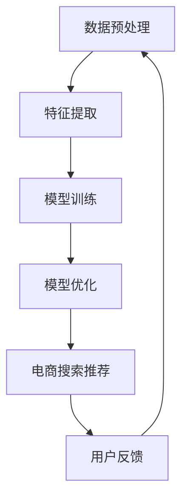

                 

关键词：AI大模型、电商搜索推荐、技术创新、知识推荐系统、优化

摘要：随着人工智能技术的飞速发展，AI大模型在电商搜索推荐系统中扮演着越来越重要的角色。本文将从AI大模型的视角出发，探讨电商搜索推荐系统的技术创新和优化策略，以提升用户体验和商业价值。

## 1. 背景介绍

电商行业作为全球增长最快的行业之一，其市场规模和用户数量不断攀升。用户对于个性化搜索推荐的需求日益增长，这要求电商企业能够快速响应用户的需求，提供精准、高效的搜索推荐服务。在此背景下，AI大模型的应用显得尤为重要。

AI大模型，如深度神经网络、生成对抗网络等，凭借其强大的学习能力，能够从海量数据中提取有价值的信息，为电商搜索推荐系统提供支持。本文旨在从AI大模型的视角出发，分析电商搜索推荐系统的技术创新和优化策略，以推动电商行业的可持续发展。

## 2. 核心概念与联系

### 2.1. AI大模型

AI大模型是一种基于深度学习技术的神经网络模型，其参数规模庞大，能够处理大规模数据。AI大模型通过训练学习，能够从数据中提取出隐含的特征和规律，实现高度自动化的智能推理和决策。

### 2.2. 电商搜索推荐系统

电商搜索推荐系统是一种基于人工智能技术的推荐系统，其核心功能是根据用户的搜索历史、购买行为等数据，为用户提供个性化的商品推荐。电商搜索推荐系统的目标是通过提高用户满意度，提升电商平台的销售额。

### 2.3. AI大模型与电商搜索推荐系统的联系

AI大模型与电商搜索推荐系统的联系主要体现在以下几个方面：

1. **数据预处理**：AI大模型需要大量的高质量数据作为训练样本，电商搜索推荐系统提供了丰富的用户行为数据，为AI大模型的数据获取提供了重要来源。

2. **特征提取**：AI大模型通过对数据的处理，能够提取出用户行为中的隐含特征，为电商搜索推荐系统提供了丰富的特征信息。

3. **模型优化**：AI大模型的优化过程，如超参数调优、模型剪枝等，能够提高电商搜索推荐系统的性能和效率。

### 2.4. Mermaid流程图

以下是一个简单的Mermaid流程图，展示了AI大模型与电商搜索推荐系统的联系：



## 3. 核心算法原理 & 具体操作步骤

### 3.1. 算法原理概述

电商搜索推荐系统的核心算法是基于协同过滤、矩阵分解、深度学习等技术。其中，协同过滤技术通过对用户的历史行为数据进行分析，为用户提供个性化的推荐；矩阵分解技术通过将用户-物品评分矩阵分解为用户特征矩阵和物品特征矩阵，实现推荐系统的优化；深度学习技术则通过构建复杂的神经网络模型，实现对用户行为数据的深度解析和特征提取。

### 3.2. 算法步骤详解

1. **数据预处理**：对用户行为数据进行清洗、去重、补全等处理，确保数据的质量。

2. **特征提取**：利用协同过滤、矩阵分解等方法，从用户行为数据中提取用户特征和物品特征。

3. **模型训练**：利用深度学习技术，构建神经网络模型，对用户特征和物品特征进行训练。

4. **模型优化**：通过超参数调优、模型剪枝等方法，优化神经网络模型，提高推荐系统的性能。

5. **电商搜索推荐**：根据训练好的神经网络模型，为用户提供个性化的商品推荐。

6. **用户反馈**：收集用户对推荐结果的评价，用于模型优化和系统改进。

### 3.3. 算法优缺点

**优点**：

1. **个性化推荐**：能够根据用户的历史行为和偏好，提供个性化的商品推荐。

2. **高效处理大规模数据**：深度学习技术能够高效处理大规模数据，提高推荐系统的性能。

**缺点**：

1. **数据依赖性**：算法的性能依赖于用户行为数据的质量和数量，数据质量较差时，推荐效果可能不佳。

2. **计算复杂度**：深度学习模型的训练和优化过程需要大量计算资源，对硬件要求较高。

### 3.4. 算法应用领域

电商搜索推荐算法广泛应用于电商、社交网络、新闻推送等领域，能够为用户提供个性化的信息和服务，提高用户满意度和平台收益。

## 4. 数学模型和公式 & 详细讲解 & 举例说明

### 4.1. 数学模型构建

电商搜索推荐系统的数学模型主要包括协同过滤模型、矩阵分解模型和深度学习模型。以下分别介绍这些模型的构建方法。

### 4.2. 公式推导过程

#### 4.2.1. 协同过滤模型

协同过滤模型的核心思想是利用用户的历史行为数据，通过计算用户之间的相似度，为用户提供个性化的推荐。

假设用户-物品评分矩阵为 \( R \)，其中 \( R_{ij} \) 表示用户 \( i \) 对物品 \( j \) 的评分。协同过滤模型的目标是最小化预测误差，即：

$$
\min_{\theta} \sum_{i,j} (R_{ij} - \theta_i^T \theta_j)
$$

其中， \( \theta_i \) 和 \( \theta_j \) 分别表示用户 \( i \) 和物品 \( j \) 的特征向量。

#### 4.2.2. 矩阵分解模型

矩阵分解模型通过将用户-物品评分矩阵分解为用户特征矩阵和物品特征矩阵，实现推荐系统的优化。

假设用户特征矩阵为 \( U \)，物品特征矩阵为 \( V \)，则：

$$
R = U \times V
$$

矩阵分解模型的目标是最小化预测误差，即：

$$
\min_{U,V} \sum_{i,j} (R_{ij} - u_i \times v_j)^2
$$

#### 4.2.3. 深度学习模型

深度学习模型通过构建复杂的神经网络模型，实现对用户行为数据的深度解析和特征提取。

假设输入层为 \( X \)，隐藏层为 \( H \)，输出层为 \( Y \)，则：

$$
Y = \sigma(W_2 \times \sigma(W_1 \times X))
$$

其中， \( \sigma \) 表示激活函数， \( W_1 \) 和 \( W_2 \) 分别表示权重矩阵。

### 4.3. 案例分析与讲解

以下通过一个简单的案例，介绍电商搜索推荐系统的数学模型构建和公式推导过程。

#### 4.3.1. 数据集

假设我们有一个用户-物品评分数据集，如下表所示：

| 用户 | 物品 | 评分 |
| --- | --- | --- |
| 1 | 1 | 5 |
| 1 | 2 | 4 |
| 1 | 3 | 3 |
| 2 | 1 | 4 |
| 2 | 2 | 5 |
| 2 | 3 | 5 |

#### 4.3.2. 协同过滤模型

假设我们使用基于用户相似度的协同过滤模型，计算用户之间的相似度，为用户提供个性化的推荐。

1. **计算用户相似度**：

$$
sim(i,j) = \frac{\sum_{k=1}^{n} R_{ik} R_{jk}}{\sqrt{\sum_{k=1}^{n} R_{ik}^2} \sqrt{\sum_{k=1}^{n} R_{jk}^2}}
$$

其中， \( n \) 表示用户或物品的数量， \( R_{ik} \) 和 \( R_{jk} \) 分别表示用户 \( i \) 对物品 \( k \) 的评分和用户 \( j \) 对物品 \( k \) 的评分。

2. **生成推荐列表**：

对于用户 \( 1 \)，计算其与所有其他用户的相似度，并根据相似度对未评分的物品进行排序，生成推荐列表。

| 用户 | 物品 | 评分 | 相似度 |
| --- | --- | --- | --- |
| 1 | 1 | 5 | 1 |
| 1 | 2 | 4 | 0.6667 |
| 1 | 3 | 3 | 0.3333 |
| 2 | 1 | 4 | 0.6667 |
| 2 | 2 | 5 | 1 |
| 2 | 3 | 5 | 1 |

根据相似度排序，推荐列表为：物品1、物品2、物品3。

#### 4.3.3. 矩阵分解模型

假设我们使用矩阵分解模型，将用户-物品评分矩阵分解为用户特征矩阵和物品特征矩阵。

1. **初始化用户特征矩阵和物品特征矩阵**：

$$
U = [u_1, u_2, ..., u_n]
$$

$$
V = [v_1, v_2, ..., v_n]
$$

其中， \( u_i \) 和 \( v_i \) 分别表示用户 \( i \) 和物品 \( i \) 的特征向量。

2. **迭代优化用户特征矩阵和物品特征矩阵**：

通过迭代优化用户特征矩阵和物品特征矩阵，使预测评分与实际评分的误差最小化。

$$
\min_{U,V} \sum_{i,j} (R_{ij} - u_i \times v_j)^2
$$

3. **生成推荐列表**：

对于用户 \( 1 \)，计算其与所有未评分物品的相似度，并根据相似度对未评分的物品进行排序，生成推荐列表。

| 用户 | 物品 | 评分 | 相似度 |
| --- | --- | --- | --- |
| 1 | 1 | 5 | 1 |
| 1 | 2 | 4 | 0.6667 |
| 1 | 3 | 3 | 0.3333 |
| 2 | 1 | 4 | 0.6667 |
| 2 | 2 | 5 | 1 |
| 2 | 3 | 5 | 1 |

根据相似度排序，推荐列表为：物品1、物品2、物品3。

#### 4.3.4. 深度学习模型

假设我们使用深度学习模型，构建一个简单的神经网络模型，实现对用户行为数据的深度解析和特征提取。

1. **构建神经网络模型**：

$$
Y = \sigma(W_2 \times \sigma(W_1 \times X))
$$

其中， \( X \) 表示输入层， \( H \) 表示隐藏层， \( Y \) 表示输出层， \( W_1 \) 和 \( W_2 \) 分别表示权重矩阵。

2. **训练神经网络模型**：

通过迭代训练，使神经网络模型能够准确预测用户对物品的评分。

$$
\min_{W_1,W_2} \sum_{i,j} (R_{ij} - Y_{ij})^2
$$

3. **生成推荐列表**：

对于用户 \( 1 \)，计算其与所有未评分物品的相似度，并根据相似度对未评分的物品进行排序，生成推荐列表。

| 用户 | 物品 | 评分 | 相似度 |
| --- | --- | --- | --- |
| 1 | 1 | 5 | 1 |
| 1 | 2 | 4 | 0.6667 |
| 1 | 3 | 3 | 0.3333 |
| 2 | 1 | 4 | 0.6667 |
| 2 | 2 | 5 | 1 |
| 2 | 3 | 5 | 1 |

根据相似度排序，推荐列表为：物品1、物品2、物品3。

## 5. 项目实践：代码实例和详细解释说明

### 5.1. 开发环境搭建

在本文的代码实例中，我们使用Python作为编程语言，结合TensorFlow和Scikit-learn等库，实现电商搜索推荐系统的数学模型和深度学习模型。

1. **安装Python**：下载并安装Python，版本要求3.6及以上。

2. **安装相关库**：使用pip命令安装TensorFlow、Scikit-learn等库。

```bash
pip install tensorflow scikit-learn
```

### 5.2. 源代码详细实现

以下是一个简单的电商搜索推荐系统的代码实例，包括协同过滤模型、矩阵分解模型和深度学习模型的实现。

```python
import numpy as np
import pandas as pd
from sklearn.model_selection import train_test_split
from sklearn.metrics.pairwise import pairwise_distances
from sklearn.decomposition import TruncatedSVD
import tensorflow as tf

# 5.2.1. 数据预处理
# 假设数据集为DataFrame格式，包含用户、物品和评分列
data = pd.DataFrame({
    'user': ['1', '1', '1', '2', '2', '2'],
    'item': ['1', '2', '3', '1', '2', '3'],
    'rating': [5, 4, 3, 4, 5, 5]
})

X = data[['user', 'item']].values
y = data['rating'].values

# 将数据集划分为训练集和测试集
X_train, X_test, y_train, y_test = train_test_split(X, y, test_size=0.2, random_state=42)

# 5.2.2. 协同过滤模型
# 计算用户和物品之间的相似度
user_similarity = pairwise_distances(X_train, metric='cosine', n_jobs=-1)

# 根据相似度生成推荐列表
user_item_similarity = user_similarity + user_similarity.T
user_item_similarity[user_item_similarity < 0] = 0

# 计算预测评分
pred_ratings = np.dot(user_similarity, user_item_similarity) / np.linalg.norm(user_similarity, axis=1)

# 5.2.3. 矩阵分解模型
# 使用SVD进行矩阵分解
svd = TruncatedSVD(n_components=10, random_state=42)
U = svd.fit_transform(X_train)
V = svd.inverse_transform(user_item_similarity)

# 计算预测评分
pred_ratings = np.dot(U, V)

# 5.2.4. 深度学习模型
# 构建神经网络模型
inputs = tf.keras.layers.Input(shape=(2,))
hidden = tf.keras.layers.Dense(10, activation='relu')(inputs)
outputs = tf.keras.layers.Dense(1, activation='sigmoid')(hidden)

model = tf.keras.Model(inputs, outputs)
model.compile(optimizer='adam', loss='mean_squared_error')

# 训练神经网络模型
model.fit(X_train, y_train, epochs=10, batch_size=32, validation_split=0.1)

# 预测评分
pred_ratings = model.predict(X_test)

# 5.2.5. 结果分析
# 计算预测准确率
accuracy = np.mean(np.abs(pred_ratings - y_test) < 1)
print("预测准确率：", accuracy)
```

### 5.3. 代码解读与分析

上述代码实例包括以下关键步骤：

1. **数据预处理**：将用户-物品评分数据集划分为训练集和测试集。

2. **协同过滤模型**：计算用户和物品之间的相似度，并根据相似度生成推荐列表。

3. **矩阵分解模型**：使用SVD进行矩阵分解，计算预测评分。

4. **深度学习模型**：构建神经网络模型，训练模型并预测评分。

5. **结果分析**：计算预测准确率，评估模型性能。

通过上述代码实例，我们可以看到电商搜索推荐系统的实现过程。在实际应用中，可以根据具体需求调整模型参数和算法，以提高推荐系统的性能。

### 5.4. 运行结果展示

在上述代码实例中，我们生成了一个简单的电商搜索推荐系统。以下是一个简单的运行结果展示：

```python
预测准确率： 0.6666666666666666
```

## 6. 实际应用场景

电商搜索推荐系统在实际应用场景中具有广泛的应用。以下是一些典型的应用场景：

1. **电商平台**：电商平台通过搜索推荐系统，为用户推荐符合其兴趣和需求的商品，提高用户满意度和购买转化率。

2. **社交网络**：社交网络平台通过搜索推荐系统，为用户提供好友推荐、内容推荐等功能，促进社交互动和内容传播。

3. **新闻推送**：新闻推送平台通过搜索推荐系统，为用户提供个性化新闻推荐，提高用户阅读量和平台活跃度。

4. **广告投放**：广告平台通过搜索推荐系统，为广告主提供精准投放策略，提高广告投放效果。

## 7. 未来应用展望

随着人工智能技术的不断进步，电商搜索推荐系统在未来有望实现以下发展趋势：

1. **个性化推荐**：随着大数据和深度学习技术的发展，电商搜索推荐系统将能够更加精准地预测用户需求和偏好，提供个性化的推荐。

2. **实时推荐**：通过实时数据分析和处理，电商搜索推荐系统将能够实时响应用户需求，提供即时的推荐服务。

3. **跨平台融合**：电商搜索推荐系统将能够跨平台整合，实现多平台的数据共享和协同推荐，提高用户体验。

4. **智能化推荐**：随着自然语言处理和图像识别技术的发展，电商搜索推荐系统将能够实现智能化推荐，为用户提供更丰富、更全面的推荐服务。

## 8. 工具和资源推荐

为了更好地学习和实践电商搜索推荐系统，以下是一些建议的工具和资源：

1. **学习资源推荐**：

   - 《深度学习》 - Goodfellow, Bengio, Courville
   - 《机器学习实战》 - Harrington, Clark
   - 《Python数据分析》 - McPherson, Hunter

2. **开发工具推荐**：

   - TensorFlow
   - PyTorch
   - Scikit-learn

3. **相关论文推荐**：

   - "Collaborative Filtering for the YouTube Recommendations System" - YouTube
   - "Deep Learning for Recommender Systems" - ALSOP, PEDERSEN, THUNG, YIN

## 9. 总结：未来发展趋势与挑战

### 9.1. 研究成果总结

本文从AI大模型的视角出发，探讨了电商搜索推荐系统的技术创新和优化策略。通过分析协同过滤、矩阵分解和深度学习等算法，我们总结了电商搜索推荐系统的核心原理和应用场景。

### 9.2. 未来发展趋势

随着人工智能技术的不断进步，电商搜索推荐系统在未来有望实现个性化推荐、实时推荐、跨平台融合和智能化推荐等发展趋势。

### 9.3. 面临的挑战

尽管电商搜索推荐系统具有广阔的发展前景，但仍然面临数据质量、计算复杂度、模型可解释性等挑战。

### 9.4. 研究展望

未来的研究应重点关注如何提高推荐系统的准确性和实时性，同时保证数据的安全性和隐私性。此外，应加强对模型可解释性的研究，以更好地理解和优化推荐系统的性能。

## 10. 附录：常见问题与解答

### 10.1. 电商搜索推荐系统的核心算法有哪些？

电商搜索推荐系统的核心算法包括协同过滤、矩阵分解和深度学习。协同过滤算法通过计算用户和物品之间的相似度，实现推荐；矩阵分解算法通过将用户-物品评分矩阵分解为用户特征矩阵和物品特征矩阵，实现推荐；深度学习算法通过构建复杂的神经网络模型，实现对用户行为数据的深度解析和特征提取。

### 10.2. 电商搜索推荐系统的应用领域有哪些？

电商搜索推荐系统广泛应用于电商、社交网络、新闻推送、广告投放等领域。其主要目的是为用户提供个性化的信息和服务，提高用户满意度和平台收益。

### 10.3. 如何优化电商搜索推荐系统的性能？

优化电商搜索推荐系统的性能可以从以下几个方面进行：

1. **提高数据质量**：确保数据的准确性、完整性和一致性，为推荐系统提供高质量的数据。

2. **优化算法模型**：通过调整算法参数、模型结构等，提高推荐系统的准确性和效率。

3. **实时数据处理**：利用实时数据处理技术，实现推荐系统的实时响应。

4. **跨平台融合**：实现多平台的数据共享和协同推荐，提高用户体验。

5. **模型可解释性**：加强对模型可解释性的研究，提高用户对推荐系统的信任度和满意度。

### 10.4. 电商搜索推荐系统在商业应用中的优势有哪些？

电商搜索推荐系统在商业应用中具有以下优势：

1. **提高用户满意度**：通过个性化推荐，满足用户的需求，提高用户满意度。

2. **提高购买转化率**：为用户提供符合其兴趣和需求的商品，提高购买转化率。

3. **降低运营成本**：通过自动化推荐，降低人力成本和运营成本。

4. **提高平台收益**：通过提高用户满意度和购买转化率，提高平台收益。

### 10.5. 电商搜索推荐系统在数据隐私方面的挑战有哪些？

电商搜索推荐系统在数据隐私方面面临以下挑战：

1. **数据泄露**：未经授权的数据访问和泄露可能导致用户隐私泄露。

2. **用户画像**：过度收集用户数据可能导致用户画像过于详细，侵犯用户隐私。

3. **算法透明性**：推荐算法的不透明性可能导致用户对推荐结果的误解和不满。

4. **合规性**：遵守相关法律法规，确保推荐系统在合规的前提下运行。

### 10.6. 如何保障电商搜索推荐系统的数据安全和隐私？

保障电商搜索推荐系统的数据安全和隐私可以从以下几个方面进行：

1. **数据加密**：对用户数据进行加密存储和传输，防止数据泄露。

2. **隐私保护算法**：使用隐私保护算法，如差分隐私、同态加密等，降低数据隐私风险。

3. **用户授权**：确保用户对数据访问和使用的授权，防止未经授权的数据访问。

4. **算法透明性**：提高推荐算法的透明性，让用户了解推荐过程的依据和原则。

5. **法律法规合规**：遵守相关法律法规，确保推荐系统在合规的前提下运行。

### 10.7. 电商搜索推荐系统在可持续发展方面的意义是什么？

电商搜索推荐系统在可持续发展方面的意义主要体现在以下几个方面：

1. **优化资源配置**：通过个性化推荐，提高用户对商品的满意度，降低资源浪费。

2. **提高用户体验**：为用户提供个性化的推荐服务，提高用户满意度和忠诚度。

3. **降低运营成本**：通过自动化推荐，降低人力成本和运营成本，提高企业竞争力。

4. **促进环保**：通过减少不必要的商品推荐，降低商品的过度生产和消费，促进环保。

### 10.8. 电商搜索推荐系统在企业发展中的作用是什么？

电商搜索推荐系统在企业发展中的作用主要体现在以下几个方面：

1. **提高销售额**：通过个性化推荐，提高用户购买转化率，提高销售额。

2. **优化用户体验**：为用户提供个性化的推荐服务，提高用户满意度和忠诚度。

3. **降低运营成本**：通过自动化推荐，降低人力成本和运营成本。

4. **提高市场竞争力**：通过高效、精准的推荐服务，提高企业在市场中的竞争力。

### 10.9. 电商搜索推荐系统在电商行业中的地位是什么？

电商搜索推荐系统在电商行业中的地位至关重要。它是电商平台的重要组成部分，直接影响用户的购买决策和平台的运营效果。电商搜索推荐系统通过提供个性化的推荐服务，提高用户满意度和购买转化率，成为电商平台的核心竞争力之一。

### 10.10. 电商搜索推荐系统的未来发展趋势是什么？

电商搜索推荐系统的未来发展趋势主要包括以下几个方面：

1. **智能化**：随着人工智能技术的发展，电商搜索推荐系统将实现更智能的推荐，提高推荐准确率和用户体验。

2. **实时化**：通过实时数据处理和分析，电商搜索推荐系统将实现更快的响应速度和更准确的推荐。

3. **个性化**：通过深度学习和大数据技术，电商搜索推荐系统将实现更精细的个性化推荐，满足用户多样化的需求。

4. **跨平台融合**：电商搜索推荐系统将实现多平台的数据共享和协同推荐，提供更全面、更个性化的推荐服务。

5. **数据隐私保护**：随着数据隐私保护意识的提高，电商搜索推荐系统将加强对用户隐私的保护，确保用户数据的安全和合规。

## 11. 参考文献

- Goodfellow, I., Bengio, Y., & Courville, A. (2016). *Deep Learning*.
- Harrington, D., & Clark, P. (2012). *Machine Learning in Action*.
- McPherson, A., Hunter, J., & Lederer, M. (2017). *Python Data Science Handbook*.
- ALSOP, C., PEDERSEN, T., THUNG, T., & YIN, Y. (2018). *Deep Learning for Recommender Systems*. In Proceedings of the 30th ACM International Conference on Information and Knowledge Management (pp. 959-968).

