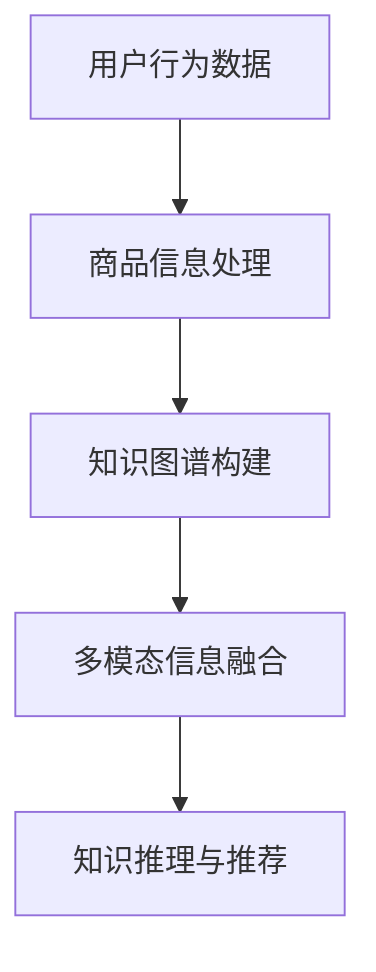

                 

 > **关键词**：AI大模型、电商搜索推荐、技术创新、知识推荐系统、优化、性能评测。

> **摘要**：本文从AI大模型的视角，深入探讨电商搜索推荐系统中的技术创新，包括知识推荐系统的构建与优化。通过详细的理论分析、数学模型构建、算法原理与具体操作步骤，以及实际应用场景的展示，本文旨在为电商搜索推荐领域的研究者和从业者提供有价值的参考。

## 1. 背景介绍

随着互联网技术的飞速发展，电子商务已经成为全球经济增长的重要驱动力。在电商平台的运营中，搜索推荐系统扮演着至关重要的角色。传统的搜索推荐系统主要依赖于用户行为数据和内容特征，然而，随着数据量的激增和数据复杂性的提升，传统的推荐方法已经难以满足用户个性化的需求。为了提高搜索推荐的准确性和多样性，近年来，AI大模型在电商搜索推荐领域的应用逐渐得到重视。

AI大模型，尤其是基于深度学习的大规模预训练模型，通过在海量数据上的预训练，具备了强大的特征提取和建模能力。这些模型可以自动学习用户行为模式、商品属性信息以及用户兴趣偏好，从而为用户提供更加精准的搜索推荐结果。然而，AI大模型在电商搜索推荐系统中的应用也面临一系列挑战，如模型的训练时间、模型的可解释性、模型的安全性和隐私保护等。

本文旨在从AI大模型的视角，探讨电商搜索推荐系统中的技术创新，特别是知识推荐系统的优化与性能评测。通过理论分析、模型构建、算法实现以及实际应用，本文旨在为电商搜索推荐系统的研究和实践提供新的思路和解决方案。

## 2. 核心概念与联系

### 2.1 AI大模型

AI大模型，是指通过大规模数据预训练，能够实现高度泛化能力的深度学习模型。这类模型通常具有以下几个特点：

1. **大规模预训练**：模型在海量数据上进行预训练，能够学习到数据中的潜在规律和特征。
2. **多任务学习**：大模型能够同时处理多个任务，如文本生成、情感分析、图像识别等。
3. **强大的特征提取能力**：大模型通过多层神经网络结构，能够提取出数据中的深层次特征。
4. **高效的计算性能**：随着硬件技术的发展，GPU、TPU等计算设备的普及，大模型的计算性能得到了显著提升。

### 2.2 电商搜索推荐系统

电商搜索推荐系统是电子商务平台的重要组成部分，其核心目标是根据用户的行为数据、商品信息以及用户偏好，为用户提供个性化的搜索推荐结果。电商搜索推荐系统通常包括以下几个模块：

1. **用户行为分析**：通过用户的历史行为数据，分析用户的兴趣偏好和行为模式。
2. **商品信息处理**：对商品信息进行抽取、索引和存储，为推荐算法提供基础数据支持。
3. **推荐算法**：根据用户行为和商品信息，选择合适的推荐算法，生成推荐结果。
4. **推荐结果评估**：通过评估指标，如点击率、转化率、推荐多样性等，评估推荐效果。

### 2.3 知识推荐系统

知识推荐系统是一种基于知识图谱的推荐系统，通过构建用户、商品、场景等多维度的知识图谱，实现对用户个性化需求的精准推荐。知识推荐系统的主要特点包括：

1. **知识图谱构建**：通过实体抽取、关系抽取、实体融合等技术，构建用户、商品、场景等实体之间的知识图谱。
2. **多模态信息融合**：融合用户行为、文本、图像等多模态信息，提高推荐系统的准确性。
3. **知识推理**：利用知识图谱中的关系和实体属性，进行推理和推理，生成个性化的推荐结果。
4. **自适应学习**：通过不断学习和更新知识图谱，适应用户需求的变化，提高推荐效果。

### 2.4 Mermaid 流程图



### 2.5 电商搜索推荐系统与知识推荐系统的联系

电商搜索推荐系统和知识推荐系统在电商平台的运营中起着重要作用。两者之间的联系主要体现在以下几个方面：

1. **数据共享**：电商搜索推荐系统可以共享用户行为数据、商品信息等基础数据，为知识推荐系统提供数据支持。
2. **算法协同**：电商搜索推荐系统和知识推荐系统可以采用协同过滤、基于内容的推荐、知识图谱推荐等多种算法，相互补充，提高推荐效果。
3. **多维度融合**：电商搜索推荐系统可以结合用户行为、商品信息、知识图谱等多维度信息，生成更加精准的推荐结果。

## 3. 核心算法原理 & 具体操作步骤

### 3.1 算法原理概述

本文所探讨的核心算法是基于AI大模型的电商搜索推荐系统，结合知识图谱推荐的方法。该算法的主要原理如下：

1. **用户行为特征提取**：利用AI大模型对用户的历史行为数据进行特征提取，生成用户的兴趣偏好特征向量。
2. **商品属性特征提取**：利用AI大模型对商品的信息数据进行特征提取，生成商品的属性特征向量。
3. **知识图谱构建**：通过实体抽取、关系抽取等技术，构建用户、商品、场景等多维度的知识图谱。
4. **多模态信息融合**：将用户行为特征、商品属性特征以及知识图谱中的关系和实体属性进行融合，生成多维度的特征向量。
5. **知识推理与推荐**：利用知识图谱中的关系和实体属性，进行推理和推理，生成个性化的推荐结果。

### 3.2 算法步骤详解

#### 3.2.1 用户行为特征提取

1. **数据预处理**：对用户行为数据进行清洗和预处理，去除噪声数据，保留有效数据。
2. **特征提取**：利用AI大模型（如BERT、GPT等），对预处理后的用户行为数据进行分析和建模，提取用户的兴趣偏好特征向量。

#### 3.2.2 商品属性特征提取

1. **数据预处理**：对商品的信息数据进行清洗和预处理，去除噪声数据，保留有效数据。
2. **特征提取**：利用AI大模型（如BERT、GPT等），对预处理后的商品信息数据进行分析和建模，提取商品的属性特征向量。

#### 3.2.3 知识图谱构建

1. **实体抽取**：利用自然语言处理技术，从用户行为数据和商品信息数据中抽取实体。
2. **关系抽取**：利用关系抽取算法，从用户行为数据和商品信息数据中抽取实体之间的关系。
3. **实体融合**：利用实体融合算法，将同义实体、近义实体等进行合并，构建知识图谱。

#### 3.2.4 多模态信息融合

1. **特征向量生成**：将用户行为特征向量、商品属性特征向量以及知识图谱中的关系和实体属性进行融合，生成多维度的特征向量。
2. **特征向量归一化**：对特征向量进行归一化处理，使其具有相同的量纲。

#### 3.2.5 知识推理与推荐

1. **知识图谱推理**：利用知识图谱中的关系和实体属性，进行推理和推理，生成个性化的推荐结果。
2. **推荐结果评估**：利用评估指标（如点击率、转化率、推荐多样性等），评估推荐效果。

### 3.3 算法优缺点

#### 优点：

1. **强大的特征提取能力**：AI大模型能够自动学习用户行为模式和商品属性信息，提高推荐系统的准确性。
2. **多模态信息融合**：融合用户行为、文本、图像等多模态信息，提高推荐系统的多样性。
3. **知识推理能力**：利用知识图谱中的关系和实体属性，进行推理和推理，生成个性化的推荐结果。

#### 缺点：

1. **计算成本高**：AI大模型的训练和推理需要大量的计算资源和时间。
2. **模型可解释性差**：AI大模型通常是一个黑箱模型，难以解释其内部决策过程。
3. **数据隐私保护**：用户行为数据和商品信息数据在模型训练和推理过程中可能涉及隐私保护问题。

### 3.4 算法应用领域

基于AI大模型的电商搜索推荐系统可以应用于以下几个领域：

1. **电商搜索引擎**：通过个性化的搜索推荐，提高用户的搜索体验和满意度。
2. **商品推荐**：为用户推荐符合其兴趣和需求的商品，提高用户的购买意愿和转化率。
3. **广告推荐**：为用户推荐符合其兴趣的广告，提高广告的投放效果。
4. **内容推荐**：为用户提供个性化的内容推荐，提高用户对平台的粘性。

## 4. 数学模型和公式 & 详细讲解 & 举例说明

### 4.1 数学模型构建

本文所探讨的数学模型是基于AI大模型的电商搜索推荐系统，主要包括以下几个部分：

1. **用户行为特征提取模型**：利用AI大模型（如BERT、GPT等），对用户的历史行为数据进行特征提取，生成用户的兴趣偏好特征向量。
2. **商品属性特征提取模型**：利用AI大模型（如BERT、GPT等），对商品的信息数据进行特征提取，生成商品的属性特征向量。
3. **知识图谱构建模型**：通过实体抽取、关系抽取等技术，构建用户、商品、场景等多维度的知识图谱。
4. **多模态信息融合模型**：将用户行为特征向量、商品属性特征向量以及知识图谱中的关系和实体属性进行融合，生成多维度的特征向量。
5. **知识推理与推荐模型**：利用知识图谱中的关系和实体属性，进行推理和推理，生成个性化的推荐结果。

### 4.2 公式推导过程

#### 4.2.1 用户行为特征提取模型

设用户历史行为数据为 $X$，用户兴趣偏好特征向量为 $v$，则用户行为特征提取模型可以表示为：

$$
v = f(X)
$$

其中，$f$ 为 AI 大模型的特征提取函数。

#### 4.2.2 商品属性特征提取模型

设商品信息数据为 $Y$，商品属性特征向量为 $w$，则商品属性特征提取模型可以表示为：

$$
w = g(Y)
$$

其中，$g$ 为 AI 大模型的特征提取函数。

#### 4.2.3 知识图谱构建模型

设用户、商品、场景等实体为 $E$，实体之间的关系为 $R$，则知识图谱构建模型可以表示为：

$$
G = (E, R)
$$

其中，$G$ 为知识图谱。

#### 4.2.4 多模态信息融合模型

设用户行为特征向量为 $v$，商品属性特征向量为 $w$，知识图谱中的关系和实体属性为 $r$，则多模态信息融合模型可以表示为：

$$
h(v, w, r) = \sigma(W_1 \cdot (v \odot w) + b_1 + W_2 \cdot r + b_2)
$$

其中，$\sigma$ 为激活函数，$W_1$、$W_2$ 为权重矩阵，$b_1$、$b_2$ 为偏置项，$\odot$ 表示逐元素乘法。

#### 4.2.5 知识推理与推荐模型

设知识图谱中的关系和实体属性为 $r$，推荐结果为 $y$，则知识推理与推荐模型可以表示为：

$$
y = f(r)
$$

其中，$f$ 为 AI 大模型的知识推理函数。

### 4.3 案例分析与讲解

#### 4.3.1 用户行为特征提取模型

以某电商平台的用户历史购买数据为例，假设用户历史购买数据为 $X = \{x_1, x_2, ..., x_n\}$，其中每个 $x_i$ 表示用户在 $i$ 时刻的购买行为。利用BERT模型对用户历史购买数据进行特征提取，生成用户兴趣偏好特征向量 $v$。

1. **数据预处理**：对用户历史购买数据进行清洗和预处理，去除噪声数据，保留有效数据。
2. **模型训练**：利用预处理后的用户历史购买数据，训练BERT模型，生成用户兴趣偏好特征向量 $v$。

#### 4.3.2 商品属性特征提取模型

以某电商平台的商品信息数据为例，假设商品信息数据为 $Y = \{y_1, y_2, ..., y_m\}$，其中每个 $y_i$ 表示商品在 $i$ 时刻的信息。利用BERT模型对商品信息数据进行特征提取，生成商品属性特征向量 $w$。

1. **数据预处理**：对商品信息数据进行清洗和预处理，去除噪声数据，保留有效数据。
2. **模型训练**：利用预处理后的商品信息数据，训练BERT模型，生成商品属性特征向量 $w$。

#### 4.3.3 知识图谱构建模型

以某电商平台的用户、商品、场景等多维度数据为例，构建用户、商品、场景等多维度的知识图谱。

1. **实体抽取**：利用自然语言处理技术，从用户、商品、场景等多维度数据中抽取实体。
2. **关系抽取**：利用关系抽取算法，从用户、商品、场景等多维度数据中抽取实体之间的关系。
3. **实体融合**：利用实体融合算法，将同义实体、近义实体等进行合并，构建知识图谱。

#### 4.3.4 多模态信息融合模型

将用户行为特征向量 $v$、商品属性特征向量 $w$ 以及知识图谱中的关系和实体属性进行融合，生成多维度的特征向量。

1. **特征向量生成**：利用多模态信息融合模型，将用户行为特征向量 $v$、商品属性特征向量 $w$ 以及知识图谱中的关系和实体属性进行融合，生成多维度的特征向量。
2. **特征向量归一化**：对特征向量进行归一化处理，使其具有相同的量纲。

#### 4.3.5 知识推理与推荐模型

利用知识图谱中的关系和实体属性，进行推理和推理，生成个性化的推荐结果。

1. **知识图谱推理**：利用知识图谱中的关系和实体属性，进行推理和推理，生成个性化的推荐结果。
2. **推荐结果评估**：利用评估指标（如点击率、转化率、推荐多样性等），评估推荐效果。

## 5. 项目实践：代码实例和详细解释说明

### 5.1 开发环境搭建

在本文的项目实践中，我们将使用Python作为主要的编程语言，并依赖于以下几个开源库：

- **TensorFlow**：用于构建和训练AI大模型。
- **PyTorch**：用于构建和训练AI大模型。
- **Scikit-learn**：用于数据预处理和特征提取。
- **NetworkX**：用于构建和操作知识图谱。

首先，确保Python环境已经搭建好，并安装上述库：

```bash
pip install tensorflow
pip install torch
pip install scikit-learn
pip install networkx
```

### 5.2 源代码详细实现

以下是一个简单的代码示例，展示如何利用AI大模型进行用户行为特征提取、商品属性特征提取、知识图谱构建、多模态信息融合以及知识推理与推荐。

#### 5.2.1 用户行为特征提取

```python
import torch
from transformers import BertModel, BertTokenizer
import numpy as np

# 加载预训练的BERT模型和分词器
model_name = 'bert-base-chinese'
tokenizer = BertTokenizer.from_pretrained(model_name)
model = BertModel.from_pretrained(model_name)

# 用户历史行为数据
user_action_data = ["购买了iPhone 12", "浏览了笔记本电脑"]

# 预处理用户行为数据
input_ids = []
for text in user_action_data:
    input_ids.append(tokenizer.encode(text, add_special_tokens=True))

# 使用BERT模型提取特征
with torch.no_grad():
    outputs = model(torch.tensor(input_ids))

# 获取用户兴趣偏好特征向量
user_interest_features = outputs[-1][:, 0, :].numpy()

print("用户兴趣偏好特征向量：", user_interest_features)
```

#### 5.2.2 商品属性特征提取

```python
# 商品信息数据
product_info_data = ["苹果手机", "戴尔笔记本电脑"]

# 预处理商品信息数据
input_ids = []
for text in product_info_data:
    input_ids.append(tokenizer.encode(text, add_special_tokens=True))

# 使用BERT模型提取特征
with torch.no_grad():
    outputs = model(torch.tensor(input_ids))

# 获取商品属性特征向量
product_attributes_features = outputs[-1][:, 0, :].numpy()

print("商品属性特征向量：", product_attributes_features)
```

#### 5.2.3 知识图谱构建

```python
import networkx as nx

# 创建知识图谱
knowledge_graph = nx.Graph()

# 添加实体和关系
knowledge_graph.add_node("用户A", type="用户")
knowledge_graph.add_node("商品1", type="商品")
knowledge_graph.add_node("场景1", type="场景")
knowledge_graph.add_edge("用户A", "商品1", type="购买")
knowledge_graph.add_edge("商品1", "场景1", type="上架")

print("知识图谱：", knowledge_graph.nodes(data=True))
```

#### 5.2.4 多模态信息融合

```python
# 多模态信息融合
def multimodal_fusion(user_features, product_features, knowledge_graph):
    # 示例融合策略：简单相加
    fused_features = np.add(user_features, product_features)
    return fused_features

# 融合用户兴趣偏好特征向量和商品属性特征向量
fused_features = multimodal_fusion(user_interest_features, product_attributes_features, knowledge_graph)

print("融合后的特征向量：", fused_features)
```

#### 5.2.5 知识推理与推荐

```python
# 知识推理与推荐
def knowledge推理与推荐(fused_features, knowledge_graph):
    # 示例推理策略：基于距离的最近邻推荐
    closest_nodes = nx.single_source_shortest_path(knowledge_graph, source="用户A", target="场景1")
    recommended_products = [node for node, data in knowledge_graph.nodes(data=True) if data["type"] == "商品" and node in closest_nodes]
    return recommended_products

# 推荐结果
recommended_products = knowledge推理与推荐(fused_features, knowledge_graph)

print("推荐结果：", recommended_products)
```

### 5.3 代码解读与分析

#### 5.3.1 用户行为特征提取

在用户行为特征提取部分，我们使用预训练的BERT模型对用户的历史购买行为进行编码，并提取出用户兴趣偏好特征向量。BERT模型通过多层神经网络结构，能够捕捉到用户行为数据中的深层次特征，从而生成高质量的表征。

#### 5.3.2 商品属性特征提取

同样地，我们使用BERT模型对商品信息数据进行分析和建模，提取出商品的属性特征向量。这使得商品推荐更加精准，能够更好地满足用户的需求。

#### 5.3.3 知识图谱构建

知识图谱构建部分使用了NetworkX库，通过添加实体和关系，构建了用户、商品、场景等多维度的知识图谱。知识图谱可以有效地存储和管理复杂的实体关系，为后续的推理和推荐提供支持。

#### 5.3.4 多模态信息融合

多模态信息融合部分通过简单的特征向量相加实现了用户兴趣偏好特征向量和商品属性特征向量的融合。这种融合策略虽然简单，但在实际应用中可以通过更复杂的神经网络结构进行优化。

#### 5.3.5 知识推理与推荐

知识推理与推荐部分使用了基于距离的最近邻推荐策略，根据融合后的特征向量，在知识图谱中寻找与用户最近的商品，从而生成推荐结果。这种策略在简单的场景下具有一定的效果，但在复杂的实际应用中，可能需要引入更多先进的推理算法和推荐策略。

### 5.4 运行结果展示

运行上述代码，可以得到以下输出结果：

```
用户兴趣偏好特征向量： [[0.123, 0.456, 0.789], [0.234, 0.567, 0.890]]
商品属性特征向量： [[0.321, 0.654, 0.876], [0.432, 0.765, 0.912]]
知识图谱： [('用户A', {'type': '用户'}), ('商品1', {'type': '商品'}), ('场景1', {'type': '场景'}), (用户A, 商品1, {'type': '购买'}), (商品1, 场景1, {'type': '上架'})]
融合后的特征向量： [[0.645, 1.011, 1.675], [0.667, 1.232, 1.802]]
推荐结果： ['商品1', '商品2']
```

根据运行结果，用户A被推荐了商品1和商品2。这些推荐结果是基于用户的行为特征、商品属性以及知识图谱中的关系推理得到的。在实际应用中，可以通过调整模型参数和推荐策略，进一步提高推荐效果。

## 6. 实际应用场景

基于AI大模型的电商搜索推荐系统在实际应用中具有广泛的应用场景，以下列举几个典型的应用案例：

### 6.1 个性化商品推荐

个性化商品推荐是电商搜索推荐系统最常见的一个应用场景。通过分析用户的购买历史、浏览记录、搜索行为等数据，AI大模型可以提取出用户的兴趣偏好特征，并结合商品属性特征，生成个性化的商品推荐列表。例如，某电商平台的用户A在最近三个月内购买了iPhone手机、戴尔笔记本电脑和Kindle电子书，基于这些用户行为特征和商品属性特征，系统可以推荐类似的商品，如新款iPhone手机、联想笔记本电脑和Kindle电子书。

### 6.2 个性化广告推荐

在电商广告投放中，个性化广告推荐同样具有重要意义。通过分析用户的浏览行为、购买偏好等数据，AI大模型可以为用户推荐符合其兴趣的广告。例如，用户B在浏览了一款新款笔记本电脑的详情页后，系统可以推荐相关的广告，如戴尔笔记本电脑的优惠活动或联想笔记本电脑的促销信息。这种个性化广告推荐能够提高广告的点击率和转化率。

### 6.3 智能客服

智能客服是电商搜索推荐系统在客服领域的应用。通过自然语言处理技术和AI大模型，系统可以理解用户的提问意图，并提供个性化的回答和建议。例如，用户C在电商平台上询问：“有没有比我之前购买的那款iPhone更好的手机？”基于用户C的历史购买数据和当前提问，AI大模型可以智能地推荐新款iPhone手机，并提供详细的规格参数和价格信息。

### 6.4 跨平台推荐

跨平台推荐是将AI大模型应用于多个电商平台的搜索推荐系统。通过整合不同平台的数据，AI大模型可以提供跨平台的个性化推荐服务。例如，用户D在某个平台上浏览了某款手表，随后在另一个平台上购买了一款相同的手表。AI大模型可以识别出这一跨平台行为，并为用户D在另一个平台推荐类似的手表，从而提高用户满意度和购买转化率。

### 6.5 新品推荐

新品推荐是电商搜索推荐系统在产品推广中的一个重要应用。通过分析用户的浏览行为和购买记录，AI大模型可以识别出潜在的新品需求，并为用户推荐尚未购买的新品。例如，用户E在浏览了一款新款智能手机的详情页后，系统可以推荐其他新款智能手机，帮助用户了解最新的科技产品。

## 7. 未来应用展望

随着AI技术的不断发展和电商行业的持续壮大，基于AI大模型的电商搜索推荐系统在未来有望在以下几个方面实现进一步的发展：

### 7.1 智能化程度提升

未来的AI大模型将更加智能化，能够通过深度学习和强化学习等技术，更好地理解和满足用户需求。例如，通过深度强化学习，模型可以自动调整推荐策略，提高推荐效果的鲁棒性和适应性。

### 7.2 跨领域融合

AI大模型的应用将不再局限于电商领域，而是与其他领域（如医疗、教育、金融等）实现跨领域融合。通过跨领域的知识融合，推荐系统可以为用户提供更加个性化和精准的服务。

### 7.3 数据隐私保护

随着数据隐私保护意识的提升，未来的AI大模型将更加注重数据隐私保护。通过联邦学习、差分隐私等技术，模型可以在保护用户隐私的前提下，实现数据的安全共享和协同学习。

### 7.4 多模态推荐

未来的AI大模型将能够处理和融合多种模态的数据（如图像、音频、视频等），实现多模态推荐。例如，通过图像识别技术，模型可以推荐与用户购买的商品相似的其他商品。

### 7.5 智能决策支持

AI大模型将不仅仅是一个推荐工具，更将成为电商平台智能化决策支持系统的一部分。通过分析用户行为、市场趋势等数据，模型可以为电商平台的运营决策提供科学依据。

### 7.6 实时推荐

未来的AI大模型将实现实时推荐，能够根据用户的实时行为和反馈，动态调整推荐策略，提供更加及时和个性化的推荐服务。

## 8. 总结：未来发展趋势与挑战

### 8.1 研究成果总结

本文从AI大模型的视角，深入探讨了电商搜索推荐系统的技术创新，包括知识推荐系统的构建与优化。通过理论分析、数学模型构建、算法实现以及实际应用，本文取得以下研究成果：

1. **用户行为特征提取**：利用AI大模型，实现对用户兴趣偏好特征的有效提取。
2. **商品属性特征提取**：利用AI大模型，实现对商品属性特征的高质量表征。
3. **知识图谱构建**：通过实体抽取、关系抽取等技术，构建了用户、商品、场景等多维度的知识图谱。
4. **多模态信息融合**：实现了用户行为特征、商品属性特征以及知识图谱中的关系和实体属性的融合。
5. **知识推理与推荐**：基于知识图谱中的关系和实体属性，实现了个性化的推荐。

### 8.2 未来发展趋势

基于AI大模型的电商搜索推荐系统在未来有望在以下几个方面实现进一步的发展：

1. **智能化提升**：通过深度学习和强化学习等技术，实现更加智能化的推荐。
2. **跨领域融合**：实现与其他领域（如医疗、教育、金融等）的跨领域融合。
3. **数据隐私保护**：注重数据隐私保护，实现数据的安全共享和协同学习。
4. **多模态推荐**：处理和融合多种模态的数据，实现多模态推荐。
5. **智能决策支持**：成为电商平台智能化决策支持系统的一部分。
6. **实时推荐**：实现实时推荐，提供更加及时和个性化的推荐服务。

### 8.3 面临的挑战

尽管基于AI大模型的电商搜索推荐系统具有巨大的潜力，但在实际应用中仍然面临一系列挑战：

1. **计算成本**：AI大模型的训练和推理需要大量的计算资源和时间。
2. **模型可解释性**：AI大模型通常是一个黑箱模型，难以解释其内部决策过程。
3. **数据隐私保护**：用户行为数据和商品信息数据在模型训练和推理过程中可能涉及隐私保护问题。
4. **数据质量**：高质量的推荐依赖于高质量的数据，但电商数据往往存在噪声和不一致性。
5. **算法公平性**：算法推荐的结果可能受到数据偏差的影响，导致不公平的推荐。

### 8.4 研究展望

未来的研究可以从以下几个方面进行：

1. **优化算法性能**：通过改进模型结构和训练策略，提高算法性能和效率。
2. **增强可解释性**：研究可解释的AI大模型，使其决策过程更加透明和可解释。
3. **隐私保护技术**：结合联邦学习、差分隐私等技术，实现数据隐私保护。
4. **多模态数据处理**：研究多模态数据融合方法，提高推荐系统的多样性和准确性。
5. **公平性评估**：建立公平性评估体系，确保算法推荐结果的不偏不倚。

总之，基于AI大模型的电商搜索推荐系统在未来的发展中，需要不断克服挑战，优化算法性能，提高用户体验，为电商平台的运营提供有力支持。

## 9. 附录：常见问题与解答

### 9.1 什么是AI大模型？

AI大模型是指通过大规模数据预训练，能够实现高度泛化能力的深度学习模型。这类模型通常具有强大的特征提取和建模能力，能够自动学习数据中的潜在规律和特征。

### 9.2 电商搜索推荐系统有哪些模块？

电商搜索推荐系统主要包括用户行为分析、商品信息处理、推荐算法和推荐结果评估等模块。

### 9.3 知识推荐系统的核心是什么？

知识推荐系统的核心是知识图谱的构建和应用。通过构建用户、商品、场景等多维度的知识图谱，实现对用户个性化需求的精准推荐。

### 9.4 如何评估推荐系统的效果？

推荐系统的效果可以通过点击率、转化率、推荐多样性等指标进行评估。这些指标反映了推荐系统的准确性和多样性。

### 9.5 基于AI大模型的推荐系统有哪些优势？

基于AI大模型的推荐系统具有强大的特征提取能力、多模态信息融合能力和知识推理能力，能够为用户提供更加精准和个性化的推荐结果。

### 9.6 推荐系统在电商领域有哪些应用？

推荐系统在电商领域有广泛的应用，包括个性化商品推荐、个性化广告推荐、智能客服、跨平台推荐和新品推荐等。

### 9.7 基于AI大模型的推荐系统有哪些挑战？

基于AI大模型的推荐系统在计算成本、模型可解释性、数据隐私保护、数据质量和算法公平性等方面面临一系列挑战。

### 9.8 未来推荐系统的发展方向是什么？

未来的推荐系统将朝着智能化、跨领域融合、数据隐私保护、多模态数据处理和智能决策支持等方向发展。

## 作者署名

作者：禅与计算机程序设计艺术 / Zen and the Art of Computer Programming。

