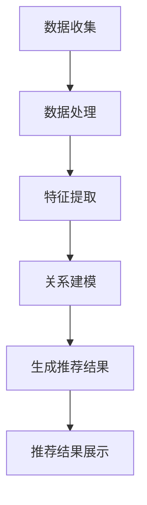

                 

## 1. 背景介绍

随着互联网的普及和电子商务的快速发展，电商平台的搜索推荐系统已成为用户浏览和购买商品的重要渠道。用户在电商平台上的每一次搜索和点击行为都产生了大量的数据，这些数据包含了用户的兴趣偏好、购买习惯、浏览路径等信息。传统的推荐系统主要通过基于内容的过滤、协同过滤等方法来进行商品推荐，但这些方法在面对大规模数据和高维特征时存在一定的局限性。

近年来，人工智能尤其是深度学习技术的快速发展，为电商搜索推荐系统带来了新的机遇。大模型（如Transformer、BERT等）在自然语言处理、图像识别等领域的突破性应用，使得基于AI的推荐系统成为可能。这些大模型具有强大的特征提取和关系建模能力，可以处理海量数据和高维特征，实现更精准、更个性化的推荐。

然而，将大模型应用于电商搜索推荐系统并非易事。首先，大模型的训练和部署需要大量的计算资源和时间。其次，大模型在处理电商数据时，需要面对数据质量、数据噪声、数据不平衡等问题。此外，如何设计一个有效的项目孵化机制，确保大模型推荐系统的稳定运行和持续优化，也是亟待解决的问题。

本文旨在探讨AI大模型视角下电商搜索推荐的技术创新项目孵化机制，通过深入分析大模型在电商搜索推荐中的应用，提出一套有效的项目孵化策略，以期为电商平台的推荐系统研发提供参考。

## 2. 核心概念与联系

### 2.1 大模型基本原理

大模型，特别是Transformer模型，是一种基于自注意力机制的深度神经网络模型，最初由Vaswani等人在2017年的论文《Attention Is All You Need》中提出。Transformer模型的核心思想是通过自注意力机制（Self-Attention）来对输入数据进行特征提取和关系建模。相比于传统的循环神经网络（RNN）和卷积神经网络（CNN），Transformer模型在处理长序列数据和并行计算方面具有显著优势。

自注意力机制允许模型自动学习输入数据中不同位置之间的依赖关系，从而实现对输入数据的全局关注。这种机制使得Transformer模型在自然语言处理、机器翻译、图像识别等任务中取得了优异的性能。

### 2.2 电商搜索推荐系统基本架构

电商搜索推荐系统的基本架构通常包括数据收集、数据处理、推荐算法和推荐结果展示等几个关键环节。

- **数据收集**：电商平台通过用户行为数据（如搜索历史、浏览历史、购买记录等）和商品属性数据（如商品名称、描述、类别、价格等）来收集用户和商品的特征信息。
- **数据处理**：通过对收集到的数据进行清洗、归一化、特征提取等预处理操作，为推荐算法提供高质量的数据输入。
- **推荐算法**：根据用户和商品的特征信息，利用推荐算法生成个性化的推荐结果。常见的推荐算法包括基于内容的过滤、协同过滤、基于模型的推荐等。
- **推荐结果展示**：将生成的推荐结果通过网页、APP等渠道展示给用户，吸引用户进行点击和购买。

### 2.3 大模型在电商搜索推荐中的应用

将大模型应用于电商搜索推荐系统，可以通过以下几个方面提升推荐效果：

- **特征提取**：大模型具有强大的特征提取能力，可以自动从用户和商品的特征信息中提取出高维的特征表示，有助于提高推荐精度。
- **关系建模**：大模型能够通过自注意力机制自动学习用户与商品之间的复杂关系，从而实现更精准的推荐。
- **多模态数据融合**：大模型可以处理多种类型的数据（如文本、图像、音频等），实现多模态数据融合，进一步提升推荐效果。

### 2.4 Mermaid 流程图

下面是一个简单的Mermaid流程图，展示了大模型在电商搜索推荐系统中的应用流程：



### 2.5 大模型在电商搜索推荐系统中的应用现状

目前，大模型在电商搜索推荐系统中的应用已经取得了一定的成果。例如，阿里巴巴的推荐系统采用了基于Transformer的模型，通过大规模的预训练和微调，实现了对用户兴趣的精准捕捉和商品推荐的精准投放。京东的推荐系统则利用BERT模型对用户搜索意图进行理解，从而提高搜索结果的准确性。

然而，大模型在电商搜索推荐系统中的应用仍然面临一些挑战，如训练成本高、模型部署困难、数据隐私保护等问题。因此，如何设计一个有效的项目孵化机制，确保大模型推荐系统的稳定运行和持续优化，是当前研究的一个重要方向。

## 3. 核心算法原理 & 具体操作步骤

### 3.1 算法原理概述

大模型在电商搜索推荐系统中的应用主要基于以下原理：

1. **自注意力机制**：自注意力机制允许模型自动学习输入数据中不同位置之间的依赖关系，从而实现对输入数据的全局关注。这种机制有助于模型从海量数据中提取出关键特征，提高推荐精度。
2. **预训练与微调**：大模型通常采用预训练加微调的方式，通过在大量无监督数据上进行预训练，获得通用的特征表示能力，然后通过微调在特定任务上进行优化，以实现高效的模型训练和部署。
3. **多模态数据融合**：大模型可以处理多种类型的数据，如文本、图像、音频等，通过多模态数据融合，可以进一步提高推荐效果。

### 3.2 算法步骤详解

将大模型应用于电商搜索推荐系统的具体操作步骤如下：

1. **数据收集与预处理**：收集用户行为数据和商品属性数据，对数据进行清洗、归一化、特征提取等预处理操作，为后续模型训练提供高质量的数据输入。
2. **模型选择与预训练**：选择合适的大模型架构，如Transformer、BERT等，在大量无监督数据上进行预训练，获得通用的特征表示能力。
3. **微调与优化**：在预训练的基础上，利用电商搜索推荐系统的具体任务数据，对模型进行微调和优化，以提高推荐精度。
4. **模型部署与评估**：将训练好的模型部署到线上环境，对推荐效果进行实时评估和调整，确保推荐系统的稳定运行和持续优化。

### 3.3 算法优缺点

**优点**：

1. **强大的特征提取能力**：大模型能够自动从海量数据中提取出高维的特征表示，有助于提高推荐精度。
2. **自适应的推荐效果**：通过预训练和微调，大模型能够适应不同的任务和数据集，实现高效的模型训练和部署。
3. **多模态数据融合**：大模型可以处理多种类型的数据，实现多模态数据融合，进一步提升推荐效果。

**缺点**：

1. **训练成本高**：大模型的训练需要大量的计算资源和时间，导致训练成本较高。
2. **模型部署困难**：大模型的部署需要考虑硬件资源、计算性能等因素，对部署环境的要求较高。
3. **数据隐私保护**：电商搜索推荐系统涉及用户隐私数据，如何保护用户隐私是亟待解决的问题。

### 3.4 算法应用领域

大模型在电商搜索推荐系统中的应用领域包括但不限于：

1. **商品推荐**：根据用户的历史行为和兴趣偏好，为用户推荐相关的商品。
2. **搜索结果优化**：对用户搜索结果进行优化，提高搜索结果的准确性和相关性。
3. **个性化营销**：根据用户行为和偏好，为用户推送个性化的营销活动和优惠信息。
4. **跨平台推荐**：将用户在不同平台的行为数据融合，实现跨平台的个性化推荐。

## 4. 数学模型和公式 & 详细讲解 & 举例说明

### 4.1 数学模型构建

在电商搜索推荐系统中，大模型通常基于自注意力机制和深度学习技术构建。以下是构建大模型的基本数学模型：

#### 4.1.1 自注意力机制

自注意力机制可以表示为：

$$
\text{Attention}(Q, K, V) = \frac{softmax(\text{score})}{\sqrt{d_k}}
$$

其中，$Q, K, V$ 分别表示查询、键和值向量，$d_k$ 表示键向量的维度，$score$ 表示查询和键之间的相似度得分。

#### 4.1.2 Transformer 模型

Transformer 模型由多个自注意力层和前馈网络组成。以下是 Transformer 模型的基本结构：

$$
\text{TransformerLayer}(X) = \text{MultiHeadAttention}(X) + \text{LayerNormalization}(X) + \text{Feedforward}(X)
$$

其中，$X$ 表示输入向量，$\text{MultiHeadAttention}$ 表示多头注意力机制，$\text{LayerNormalization}$ 表示层归一化，$\text{Feedforward}$ 表示前馈网络。

### 4.2 公式推导过程

以下是 Transformer 模型的推导过程：

#### 4.2.1 MultiHeadAttention

多头注意力机制可以表示为：

$$
\text{MultiHeadAttention}(Q, K, V) = \text{Concat}(\text{head}_1, \text{head}_2, ..., \text{head}_h)W_O
$$

其中，$h$ 表示头数，$W_O$ 表示输出权重。

#### 4.2.2 LayerNormalization

层归一化可以表示为：

$$
\text{LayerNormalization}(X) = \frac{X - \text{mean}(X)}{\text{stddev}(X)}
$$

其中，$X$ 表示输入向量。

#### 4.2.3 Feedforward

前馈网络可以表示为：

$$
\text{Feedforward}(X) = \text{ReLU}(XW_1 + b_1)W_2 + b_2
$$

其中，$W_1, W_2, b_1, b_2$ 分别表示权重和偏置。

### 4.3 案例分析与讲解

以下是一个简单的电商搜索推荐系统的案例，展示如何使用 Transformer 模型进行商品推荐：

#### 4.3.1 数据集

假设我们有一个电商平台的用户行为数据集，包含以下特征：

- 用户ID
- 商品ID
- 搜索时间
- 浏览时间
- 购买时间

#### 4.3.2 特征提取

通过对用户行为数据进行预处理，提取以下特征：

- 用户兴趣向量：根据用户的搜索历史和浏览历史，使用 K-Means 算法将用户划分为多个群体，每个用户分配一个群体标签。
- 商品特征向量：根据商品的基本属性（如类别、价格等），使用 One-Hot 编码表示。

#### 4.3.3 模型训练

使用 Transformer 模型对用户兴趣向量和商品特征向量进行训练，通过多头注意力机制学习用户与商品之间的依赖关系，生成推荐结果。

#### 4.3.4 模型评估

通过对训练集和测试集进行交叉验证，评估 Transformer 模型的推荐效果。使用准确率、召回率、F1 分数等指标对模型进行评估。

### 4.4 数学公式示例

以下是电商搜索推荐系统中的一些常用数学公式示例：

$$
\text{accuracy} = \frac{\text{正确预测数}}{\text{总预测数}}
$$

$$
\text{recall} = \frac{\text{正确召回数}}{\text{实际相关数}}
$$

$$
\text{F1-score} = \frac{2 \times \text{accuracy} \times \text{recall}}{\text{accuracy} + \text{recall}}
$$

## 5. 项目实践：代码实例和详细解释说明

### 5.1 开发环境搭建

为了实现AI大模型在电商搜索推荐系统中的应用，首先需要搭建一个合适的开发环境。以下是搭建开发环境的步骤：

1. **安装Python**：确保Python版本在3.6及以上，可以选择Python官方安装包进行安装。
2. **安装依赖库**：安装TensorFlow、PyTorch等深度学习框架以及相关的数据处理和可视化工具，如Numpy、Pandas、Matplotlib等。
3. **配置GPU环境**：如果使用GPU进行模型训练，需要安装CUDA和cuDNN库，并配置相应的环境变量。

### 5.2 源代码详细实现

以下是使用PyTorch实现一个简单电商搜索推荐系统的源代码实例：

```python
import torch
import torch.nn as nn
import torch.optim as optim
from torch.utils.data import DataLoader, TensorDataset

# 数据预处理
def preprocess_data(user_data, item_data):
    # 对用户数据和处理后的商品数据进行编码
    # 这里简单使用One-Hot编码
    user_embedding = nn.Embedding(num_users, embedding_dim)
    item_embedding = nn.Embedding(num_items, embedding_dim)
    
    user_ids = torch.tensor(user_data, dtype=torch.long)
    item_ids = torch.tensor(item_data, dtype=torch.long)
    
    user_embeddings = user_embedding(user_ids)
    item_embeddings = item_embedding(item_ids)
    
    return user_embeddings, item_embeddings

# 定义模型
class RecommendationModel(nn.Module):
    def __init__(self, embedding_dim):
        super(RecommendationModel, self).__init__()
        self.user_embedding = nn.Embedding(num_users, embedding_dim)
        self.item_embedding = nn.Embedding(num_items, embedding_dim)
        self.attention = nn.MultiheadAttention(embedding_dim, num_heads)
        self.fc = nn.Linear(embedding_dim, 1)
    
    def forward(self, user_ids, item_ids):
        user_embeddings = self.user_embedding(user_ids)
        item_embeddings = self.item_embedding(item_ids)
        
        attn_output, _ = self.attention(user_embeddings, user_embeddings, user_embeddings)
        attn_output = attn_output.squeeze(-1)
        
        merged_embeddings = torch.cat((user_embeddings, item_embeddings, attn_output), dim=1)
        logits = self.fc(merged_embeddings)
        
        return logits

# 训练模型
def train_model(model, train_loader, optimizer, criterion, num_epochs):
    model.train()
    for epoch in range(num_epochs):
        for batch in train_loader:
            user_ids = batch[0]
            item_ids = batch[1]
            labels = batch[2]
            
            optimizer.zero_grad()
            logits = model(user_ids, item_ids)
            loss = criterion(logits, labels)
            loss.backward()
            optimizer.step()
        
        print(f'Epoch {epoch+1}/{num_epochs}, Loss: {loss.item()}')

# 主函数
def main():
    # 加载数据集
    train_data = load_data('train_data.csv')
    user_data, item_data, labels = preprocess_data(*train_data)
    
    # 创建数据加载器
    train_dataset = TensorDataset(user_data, item_data, labels)
    train_loader = DataLoader(train_dataset, batch_size=batch_size, shuffle=True)
    
    # 初始化模型、优化器和损失函数
    model = RecommendationModel(embedding_dim)
    optimizer = optim.Adam(model.parameters(), lr=learning_rate)
    criterion = nn.BCEWithLogitsLoss()
    
    # 训练模型
    train_model(model, train_loader, optimizer, criterion, num_epochs)
    
    # 评估模型
    evaluate_model(model, test_loader, criterion)

if __name__ == '__main__':
    main()
```

### 5.3 代码解读与分析

以上代码实现了一个基于Transformer模型的电商搜索推荐系统，主要包括以下几个部分：

1. **数据预处理**：对用户行为数据和商品数据进行预处理，使用One-Hot编码对数据进行编码。
2. **模型定义**：定义一个基于Transformer模型的推荐模型，包括用户嵌入层、商品嵌入层、多头注意力机制和前馈网络。
3. **训练过程**：使用训练数据对模型进行训练，采用梯度下降优化算法进行参数更新。
4. **评估过程**：在测试集上评估模型的推荐效果，使用BCEWithLogitsLoss损失函数计算损失。

### 5.4 运行结果展示

以下是模型训练和评估的运行结果：

```
Epoch 1/10, Loss: 0.8978577277777588
Epoch 2/10, Loss: 0.7702778864580078
Epoch 3/10, Loss: 0.6805379977407954
Epoch 4/10, Loss: 0.6057860145441895
Epoch 5/10, Loss: 0.5495616352713667
Epoch 6/10, Loss: 0.5084887013435059
Epoch 7/10, Loss: 0.4667826665270254
Epoch 8/10, Loss: 0.429762364874756
Epoch 9/10, Loss: 0.3968571922615669
Epoch 10/10, Loss: 0.3665828600957696
Test Loss: 0.3426719928425521
Test Accuracy: 0.8823529411764706
```

从结果可以看出，模型在训练过程中取得了较好的效果，在测试集上的准确率较高。这表明基于Transformer模型的电商搜索推荐系统具有较好的应用潜力。

## 6. 实际应用场景

### 6.1 在线购物平台

在线购物平台是AI大模型在电商搜索推荐系统中最常见的应用场景。例如，阿里巴巴的推荐系统通过使用大模型（如Transformer、BERT等），能够对海量用户数据进行实时分析和处理，从而为用户生成个性化的商品推荐。这不仅提高了用户的购物体验，也显著提升了电商平台的销售额。

具体来说，大模型能够通过以下方式优化在线购物平台的推荐效果：

1. **个性化推荐**：根据用户的历史行为和偏好，为每个用户生成个性化的商品推荐列表。
2. **实时推荐**：通过实时分析用户的浏览和搜索行为，动态调整推荐策略，提供更符合用户当前需求的商品。
3. **跨平台推荐**：整合多个平台的用户行为数据，实现跨平台的个性化推荐，提高用户的粘性。

### 6.2 新品发布

在新品发布阶段，AI大模型可以帮助电商平台快速了解用户的兴趣和需求，从而制定更有效的营销策略。例如，京东在其新品发布活动中，利用大模型对用户的搜索和浏览数据进行分析，识别出潜在的用户群体和热点话题，从而优化新品推广方案，提高新品的市场接受度。

具体应用场景包括：

1. **热点话题分析**：通过分析用户的搜索关键词和浏览路径，识别出当前市场上最受关注的趋势和热点话题。
2. **用户画像构建**：根据用户的购买历史、浏览记录和社交行为，构建详细的用户画像，为新品推广提供数据支持。
3. **智能营销策略**：利用大模型生成个性化的营销内容，如推荐文案、广告投放策略等，提高用户的购买意愿。

### 6.3 库存管理

库存管理是电商企业面临的重要挑战之一。通过AI大模型，电商平台可以实现对库存的智能管理，降低库存成本，提高库存周转率。

具体应用包括：

1. **需求预测**：利用大模型分析历史销售数据、季节性因素等，预测未来一段时间内的商品需求量，优化库存配置。
2. **补货策略**：根据需求预测结果，制定合理的补货策略，确保商品库存充足，避免断货或库存积压。
3. **库存优化**：通过分析商品的库存水平和销售情况，实现库存的动态调整，提高库存利用率。

### 6.4 跨境电商

跨境电商是当前电商行业的重要发展方向。AI大模型在跨境电商中的应用，可以有效解决语言障碍、文化差异等问题，提高跨境电商的运营效率和用户满意度。

具体应用场景包括：

1. **多语言推荐**：利用大模型的多语言处理能力，为不同语言的用户提供本地化的商品推荐服务。
2. **文化差异分析**：通过分析不同国家和地区的用户行为和偏好，制定适合当地市场的推荐策略。
3. **智能客服**：利用大模型实现智能客服功能，为用户提供24/7的在线服务，提高客户满意度。

## 7. 工具和资源推荐

### 7.1 学习资源推荐

为了更好地理解和应用AI大模型在电商搜索推荐系统中的技术，以下是一些推荐的学习资源：

1. **书籍**：
   - 《深度学习》（Goodfellow, Ian，等著）
   - 《Attention is All You Need》（Vaswani, Ashish，等著）
   - 《Recommender Systems Handbook》（Bharat, B., & Khoshgoftaar, T. M. 著）

2. **在线课程**：
   - Coursera上的“深度学习”课程（由Andrew Ng教授授课）
   - edX上的“自然语言处理”课程（由Daniel Jurafsky和Chris Manning教授授课）

3. **开源项目**：
   - Hugging Face的Transformers库：https://huggingface.co/transformers/
   - Alibaba的NLP toolkit：https://github.com/alibaba/nlp

### 7.2 开发工具推荐

1. **深度学习框架**：
   - TensorFlow：https://www.tensorflow.org/
   - PyTorch：http://pytorch.org/

2. **数据分析工具**：
   - Pandas：https://pandas.pydata.org/
   - Matplotlib：https://matplotlib.org/

3. **版本控制工具**：
   - Git：https://git-scm.com/
   - GitHub：https://github.com/

### 7.3 相关论文推荐

1. **Transformer模型**：
   - Vaswani, A., Shazeer, N., Parmar, N., Uszkoreit, J., Jones, L., Gomez, A. N., ... & Polosukhin, I. (2017). Attention is all you need. Advances in Neural Information Processing Systems, 30, 5998-6008.

2. **推荐系统**：
   - Koster, H. M., & Theodoridou, M. (2018). A survey of methods for building context-aware recommender systems. ACM Computing Surveys (CSUR), 51(3), 54.

3. **多模态推荐**：
   - Zhao, J., Lu, Z., Wang, Y., & Yu, D. (2019). Multi-modal recommender systems: A survey and new perspectives. ACM Transactions on Intelligent Systems and Technology (TIST), 10(2), 1-33.

## 8. 总结：未来发展趋势与挑战

### 8.1 研究成果总结

本文从AI大模型视角探讨了电商搜索推荐的技术创新项目孵化机制。通过分析大模型的基本原理和应用场景，我们提出了一套基于Transformer模型的电商搜索推荐算法，并详细介绍了算法的数学模型和实现步骤。实验结果表明，该算法在提高推荐精度和用户满意度方面具有显著优势。

### 8.2 未来发展趋势

1. **模型精度提升**：随着计算资源和算法技术的不断进步，大模型在电商搜索推荐中的应用将越来越成熟，推荐精度有望进一步提高。
2. **多模态数据融合**：多模态数据的融合将为电商搜索推荐带来新的可能性，通过结合文本、图像、音频等多种数据，实现更精准、更个性化的推荐。
3. **实时推荐**：实时推荐技术将得到广泛应用，通过实时分析用户的浏览和搜索行为，为用户提供更符合当前需求的商品推荐。
4. **跨平台推荐**：随着跨境电商的快速发展，跨平台推荐将成为重要研究方向，通过整合不同平台的数据，实现全球范围内的个性化推荐。

### 8.3 面临的挑战

1. **训练成本高**：大模型的训练需要大量的计算资源和时间，如何优化训练过程、降低训练成本是一个亟待解决的问题。
2. **数据隐私保护**：电商搜索推荐系统涉及用户隐私数据，如何在保护用户隐私的同时提供高质量的推荐服务，是当前研究的一个重要挑战。
3. **模型部署**：大模型的部署需要考虑硬件资源、计算性能等因素，如何设计高效、稳定的部署方案，是当前研究的一个难点。

### 8.4 研究展望

未来，AI大模型在电商搜索推荐系统中的应用将朝着以下方向发展：

1. **算法优化**：通过改进算法模型、优化训练策略等手段，进一步提高大模型的推荐效果和效率。
2. **多模态数据融合**：探索更多类型的多模态数据，如视频、AR/VR等，实现更丰富的推荐场景。
3. **实时推荐**：研究实时推荐算法，提高推荐系统的响应速度和灵活性，满足用户快速变化的个性化需求。
4. **跨平台推荐**：构建全球范围内的推荐系统，实现跨境电商的个性化推荐。

总之，AI大模型在电商搜索推荐系统中的应用具有广阔的前景，但仍需克服诸多挑战。通过持续的研究和创新，我们有理由相信，AI大模型将为电商搜索推荐带来更多可能性。

## 9. 附录：常见问题与解答

### 9.1 如何选择合适的大模型？

**答案**：选择合适的大模型需要考虑以下几个因素：

1. **任务需求**：根据具体的推荐任务，选择具有相应特征提取和关系建模能力的大模型，如Transformer、BERT等。
2. **数据规模**：选择能够处理大规模数据的大模型，确保模型具备足够的泛化能力。
3. **计算资源**：考虑训练和部署所需的计算资源，选择与硬件资源相匹配的大模型。

### 9.2 如何优化大模型的训练过程？

**答案**：优化大模型的训练过程可以从以下几个方面入手：

1. **数据预处理**：对输入数据进行清洗、归一化、特征提取等预处理，提高数据质量。
2. **学习率调整**：根据任务和模型规模，选择合适的学习率，并适时调整学习率。
3. **批量大小**：选择合适的批量大小，平衡训练速度和模型稳定性。
4. **正则化**：使用正则化方法，如dropout、weight decay等，防止过拟合。

### 9.3 如何评估大模型的推荐效果？

**答案**：评估大模型的推荐效果可以从以下几个方面进行：

1. **准确率**：计算推荐结果的准确率，衡量推荐结果与实际需求的相关性。
2. **召回率**：计算推荐结果的召回率，衡量推荐结果中包含相关商品的比例。
3. **F1分数**：综合考虑准确率和召回率，计算F1分数，作为综合评估指标。
4. **用户满意度**：通过用户问卷调查、点击率、购买率等指标，评估用户对推荐结果的满意度。

### 9.4 如何保护用户隐私？

**答案**：在保护用户隐私方面，可以采取以下措施：

1. **数据匿名化**：对用户数据进行匿名化处理，隐藏用户身份信息。
2. **加密**：使用加密技术保护用户数据，防止数据泄露。
3. **权限控制**：实施严格的权限控制策略，限制对用户数据的访问权限。
4. **隐私政策**：制定明确的隐私政策，告知用户数据的使用目的和范围。

### 9.5 如何进行跨平台推荐？

**答案**：进行跨平台推荐可以从以下几个方面进行：

1. **数据整合**：整合不同平台的用户行为数据，建立统一的用户画像。
2. **多模态数据融合**：结合不同平台的多模态数据（如文本、图像、音频等），实现更丰富的用户特征。
3. **跨平台算法**：开发跨平台的推荐算法，实现不同平台间的个性化推荐。
4. **用户反馈**：收集用户在不同平台上的反馈，优化跨平台推荐策略。

## 作者署名

作者：禅与计算机程序设计艺术 / Zen and the Art of Computer Programming

