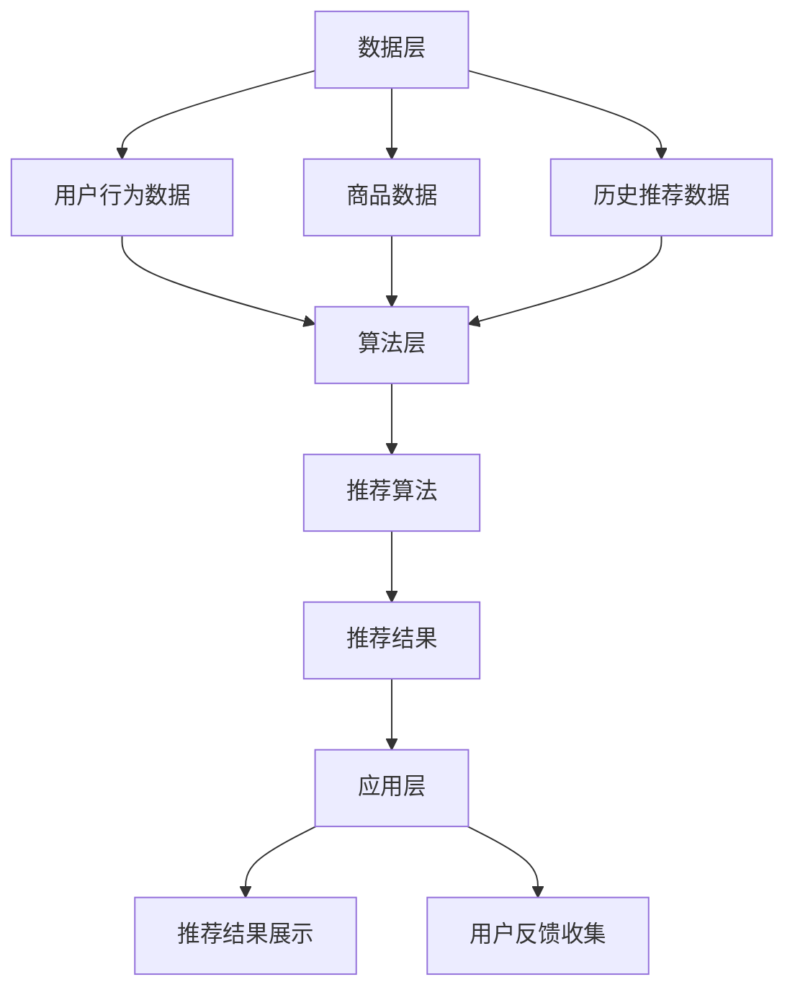

                 

关键词：AI大模型、电商搜索推荐、业务创新、培训体系、技术架构、数学模型、案例实践、未来展望

摘要：本文将深入探讨AI大模型在电商搜索推荐领域的应用，分析其如何通过业务创新思维赋能电商企业，并提出一套完善的AI大模型赋能电商搜索推荐的业务创新思维培训体系。本文旨在为电商企业及相关从业者提供理论指导与实践经验，助力他们在电商搜索推荐领域取得卓越成效。

## 1. 背景介绍

### 1.1 电商搜索推荐的重要性

在互联网时代，电商已成为人们生活中不可或缺的一部分。随着用户需求的多样化和个性化，如何精准地推荐商品成为电商企业关注的焦点。电商搜索推荐系统通过分析用户行为数据，预测用户的兴趣和需求，从而为用户提供个性化的商品推荐，提升用户购物体验和满意度。

### 1.2 AI大模型的发展与应用

近年来，人工智能技术取得了飞速发展，特别是AI大模型（如深度学习、神经网络等）在图像识别、自然语言处理、语音识别等领域取得了显著成果。AI大模型具有强大的数据处理和分析能力，能够从海量数据中挖掘出有价值的信息，为电商搜索推荐提供强有力的技术支持。

## 2. 核心概念与联系

### 2.1 AI大模型原理

AI大模型是基于深度学习理论构建的，它通过多层神经网络进行数据的学习和建模，从而实现对复杂数据的处理和分析。大模型具有以下特点：

- **高维度特征表示**：大模型能够将原始数据进行高维特征表示，提取出数据中的关键特征，从而提高模型的识别和预测能力。
- **端到端学习**：大模型可以直接从原始数据中学习到复杂的映射关系，无需手动设计特征工程，大大降低了模型训练的复杂性。
- **强大的泛化能力**：大模型在训练过程中不断调整网络参数，使其在多个任务上具有很好的泛化能力。

### 2.2 电商搜索推荐系统架构

电商搜索推荐系统的架构主要包括数据层、算法层和应用层。其中，算法层是核心，负责处理用户数据、商品数据和推荐算法，从而生成个性化推荐结果。

- **数据层**：包括用户行为数据、商品数据、历史推荐数据等，为推荐算法提供基础数据支持。
- **算法层**：包括协同过滤、矩阵分解、深度学习等推荐算法，负责分析用户数据、商品数据，生成推荐结果。
- **应用层**：包括推荐结果展示、用户反馈收集等，为用户提供个性化的购物体验。

### 2.3 Mermaid流程图

以下是一个简化的AI大模型赋能电商搜索推荐系统的Mermaid流程图：



## 3. 核心算法原理 & 具体操作步骤

### 3.1 算法原理概述

电商搜索推荐系统的核心算法主要包括基于内容的推荐、协同过滤和深度学习等。其中，深度学习算法以其强大的数据处理和分析能力在推荐系统中得到广泛应用。本文主要介绍基于深度学习的推荐算法原理。

### 3.2 算法步骤详解

1. **数据预处理**：对用户行为数据、商品数据进行清洗、去噪和归一化处理，为模型训练提供高质量的数据集。

2. **特征提取**：利用深度学习模型对数据进行特征提取，将原始数据进行高维特征表示，提取出数据中的关键特征。

3. **模型训练**：使用提取到的特征数据训练深度学习模型，通过不断调整网络参数，使其在推荐任务上具有较好的性能。

4. **模型评估**：使用验证集对训练好的模型进行评估，通过指标（如准确率、召回率等）评估模型的性能。

5. **模型部署**：将训练好的模型部署到线上环境，对用户行为数据进行实时处理，生成个性化的推荐结果。

### 3.3 算法优缺点

**优点**：

- **强大的数据处理和分析能力**：深度学习算法能够从海量数据中挖掘出有价值的信息，为推荐系统提供强有力的支持。
- **端到端学习**：深度学习算法可以直接从原始数据中学习到复杂的映射关系，无需手动设计特征工程，降低模型训练的复杂性。
- **良好的泛化能力**：深度学习模型在多个任务上具有很好的泛化能力，能够应对不同的推荐场景。

**缺点**：

- **计算资源需求高**：深度学习算法需要大量的计算资源进行训练，对硬件设备要求较高。
- **数据依赖性较强**：深度学习算法的性能很大程度上取决于数据质量，数据质量较差时，模型性能会受到影响。

### 3.4 算法应用领域

深度学习算法在电商搜索推荐领域具有广泛的应用，如：

- **商品推荐**：通过分析用户行为数据，为用户推荐他们可能感兴趣的商品。
- **广告推荐**：为用户推荐相关的广告内容，提升广告投放效果。
- **内容推荐**：为用户提供个性化的内容推荐，提升用户体验。

## 4. 数学模型和公式 & 详细讲解 & 举例说明

### 4.1 数学模型构建

深度学习推荐算法的核心是神经网络的构建。神经网络由多个神经元组成，每个神经元都与其他神经元相连，通过传递信号实现数据的处理和预测。以下是神经网络的基本结构：

- **输入层**：接收输入数据。
- **隐藏层**：对输入数据进行处理，提取特征。
- **输出层**：生成预测结果。

神经网络的数学模型可以表示为：

$$
Y = f(W \cdot X + b)
$$

其中，$Y$为输出结果，$X$为输入数据，$W$为权重矩阵，$b$为偏置项，$f$为激活函数。

### 4.2 公式推导过程

神经网络的训练过程可以看作是求解最优权重矩阵$W$和偏置项$b$的过程。具体步骤如下：

1. **前向传播**：将输入数据$X$传递到神经网络中，经过隐藏层和输出层，得到预测结果$Y$。

2. **计算损失函数**：计算预测结果$Y$与真实标签之间的差距，使用损失函数衡量模型的预测误差。常见的损失函数有均方误差（MSE）、交叉熵（CE）等。

3. **反向传播**：根据损失函数计算梯度，反向传播到神经网络的每一层，更新权重矩阵$W$和偏置项$b$。

4. **迭代优化**：重复前向传播和反向传播的过程，不断调整权重矩阵和偏置项，使模型在训练数据上的表现逐渐优化。

### 4.3 案例分析与讲解

以下是一个简单的神经网络模型，用于对电商用户行为数据进行分类。

```python
import tensorflow as tf

# 定义输入层
inputs = tf.keras.layers.Input(shape=(10,))

# 定义隐藏层
x = tf.keras.layers.Dense(64, activation='relu')(inputs)
x = tf.keras.layers.Dense(32, activation='relu')(x)

# 定义输出层
outputs = tf.keras.layers.Dense(2, activation='softmax')(x)

# 构建模型
model = tf.keras.Model(inputs=inputs, outputs=outputs)

# 编译模型
model.compile(optimizer='adam', loss='categorical_crossentropy', metrics=['accuracy'])

# 模型训练
model.fit(x_train, y_train, epochs=10, batch_size=32)
```

在这个案例中，我们使用TensorFlow框架构建了一个简单的神经网络模型。输入层接收10维的用户行为数据，隐藏层对数据进行处理和特征提取，输出层生成2个分类结果。通过编译和训练模型，我们可以得到一个能够对用户行为数据进行分类的深度学习模型。

## 5. 项目实践：代码实例和详细解释说明

### 5.1 开发环境搭建

为了实现AI大模型赋能电商搜索推荐的业务创新，我们需要搭建一个合适的开发环境。以下是一个基本的开发环境搭建步骤：

1. **安装Python环境**：在本地或服务器上安装Python环境，版本建议为3.8或以上。
2. **安装TensorFlow**：使用pip命令安装TensorFlow库，命令如下：

   ```bash
   pip install tensorflow
   ```

3. **安装其他依赖库**：根据项目需求，安装其他必要的依赖库，如NumPy、Pandas等。

### 5.2 源代码详细实现

以下是一个简单的AI大模型赋能电商搜索推荐的项目实现示例：

```python
import tensorflow as tf
import numpy as np
import pandas as pd

# 加载电商用户行为数据
data = pd.read_csv('user_behavior_data.csv')

# 预处理数据
# (此处省略数据预处理代码)

# 划分训练集和测试集
train_data, test_data = train_test_split(data, test_size=0.2, random_state=42)

# 构建深度学习模型
model = tf.keras.Sequential([
    tf.keras.layers.Dense(64, activation='relu', input_shape=(train_data.shape[1],)),
    tf.keras.layers.Dense(32, activation='relu'),
    tf.keras.layers.Dense(2, activation='softmax')
])

# 编译模型
model.compile(optimizer='adam', loss='categorical_crossentropy', metrics=['accuracy'])

# 训练模型
model.fit(train_data['features'], train_data['label'], epochs=10, batch_size=32)

# 测试模型
test_loss, test_acc = model.evaluate(test_data['features'], test_data['label'])
print(f"Test accuracy: {test_acc}")
```

### 5.3 代码解读与分析

1. **数据加载与预处理**：首先，我们加载电商用户行为数据，并进行预处理，如缺失值处理、数据归一化等。

2. **划分训练集和测试集**：将数据集划分为训练集和测试集，用于后续的模型训练和评估。

3. **构建深度学习模型**：使用TensorFlow构建一个简单的神经网络模型，包括一个输入层、两个隐藏层和一个输出层。

4. **编译模型**：设置模型优化器、损失函数和评估指标。

5. **训练模型**：使用训练集对模型进行训练，通过迭代优化模型的权重和偏置项。

6. **测试模型**：使用测试集对模型进行评估，计算模型的准确率。

通过这个简单的示例，我们可以看到如何使用深度学习模型实现电商搜索推荐。在实际项目中，我们还需要考虑数据质量、模型调优、部署和监控等方面，以提高推荐系统的效果和稳定性。

## 6. 实际应用场景

### 6.1 电商搜索推荐系统

AI大模型赋能的电商搜索推荐系统在实际应用中具有广泛的应用场景。以下是一些典型的应用案例：

1. **个性化商品推荐**：根据用户的浏览历史、购买记录和行为数据，为用户提供个性化的商品推荐，提升用户的购物体验和满意度。
2. **新品推荐**：为新上市的或用户尚未购买过的商品进行推荐，引导用户发现新产品。
3. **广告推荐**：为用户推荐相关的广告内容，提升广告投放效果，增加广告收入。

### 6.2 其他应用场景

除了电商搜索推荐系统，AI大模型赋能的业务创新思维还可以应用于以下领域：

1. **金融风控**：通过分析用户的金融行为数据，识别潜在的风险用户，为金融机构提供风控支持。
2. **医疗健康**：利用AI大模型对医疗数据进行分析，为用户提供个性化的健康建议和疾病预防方案。
3. **智能交通**：通过分析交通数据，优化交通流量，提高交通效率，减少交通事故。

## 7. 工具和资源推荐

### 7.1 学习资源推荐

1. **《深度学习》（Goodfellow, Bengio, Courville著）**：这本书是深度学习领域的经典教材，详细介绍了深度学习的基本理论、算法和应用。
2. **《Python深度学习》（François Chollet著）**：这本书通过大量的示例，讲解了如何使用Python和TensorFlow实现深度学习模型。
3. **《人工智能：一种现代方法》（Stuart Russell & Peter Norvig著）**：这本书涵盖了人工智能的基本理论和应用，包括机器学习、自然语言处理、计算机视觉等。

### 7.2 开发工具推荐

1. **TensorFlow**：一款开源的深度学习框架，适用于各种深度学习任务的实现和部署。
2. **PyTorch**：一款流行的深度学习框架，具有灵活的动态计算图和易于使用的API，适用于快速原型开发和研究。
3. **Keras**：一个基于TensorFlow和Theano的深度学习库，提供了简洁的API，方便用户快速构建和训练深度学习模型。

### 7.3 相关论文推荐

1. **"Deep Learning for recommender systems"**：该论文探讨了深度学习在推荐系统中的应用，提出了一种基于深度学习的协同过滤算法。
2. **"Neural Collaborative Filtering"**：该论文提出了一种基于神经网络的协同过滤算法，通过引入神经网络优化推荐系统的效果。
3. **"User Interest Evolution in Large-scale Social Media"**：该论文研究了用户兴趣在大型社交媒体平台上的演化规律，为个性化推荐提供了理论依据。

## 8. 总结：未来发展趋势与挑战

### 8.1 研究成果总结

近年来，AI大模型在电商搜索推荐领域取得了显著的成果。通过深度学习等技术，推荐系统的性能得到了显著提升，能够为用户提供更加精准和个性化的推荐结果。同时，AI大模型的应用范围也逐渐拓展到金融、医疗、交通等各个领域，为行业提供了强大的技术支持。

### 8.2 未来发展趋势

1. **多模态数据融合**：未来，多模态数据（如图像、语音、文本等）的融合将成为推荐系统研究的热点。通过整合多种数据类型，能够更好地理解用户的兴趣和需求，提高推荐效果。
2. **实时推荐**：随着5G、物联网等技术的发展，实时推荐将成为可能。通过实时分析用户行为数据，为用户提供实时的推荐结果，提升用户的购物体验。
3. **联邦学习**：联邦学习是一种分布式的机器学习方法，能够在保护用户隐私的前提下，协同训练大规模的推荐模型。未来，联邦学习有望在推荐系统中得到广泛应用。

### 8.3 面临的挑战

1. **数据隐私与安全**：在推荐系统的实际应用中，用户隐私保护是一个重要问题。如何保护用户数据隐私，防止数据泄露，是当前面临的重大挑战。
2. **算法公平性与透明性**：推荐系统的算法需要具备公平性和透明性，避免出现歧视、偏见等问题。如何保证算法的公平性和透明性，是未来需要解决的重要问题。
3. **计算资源需求**：深度学习模型对计算资源的需求较高，如何优化算法，降低计算资源消耗，是当前面临的挑战。

### 8.4 研究展望

未来，AI大模型在电商搜索推荐领域的研究将不断深入。通过结合多模态数据、实时推荐、联邦学习等技术，推荐系统的性能将得到进一步提升。同时，研究者们将致力于解决数据隐私、算法公平性等关键问题，推动推荐系统在更多领域得到广泛应用。

## 9. 附录：常见问题与解答

### 9.1 问答

**Q1. 如何选择合适的深度学习模型？**

A1. 选择合适的深度学习模型需要根据具体的应用场景和数据特点进行。以下是一些建议：

- **任务类型**：根据推荐系统的任务类型（如分类、回归等）选择相应的模型。
- **数据规模**：对于大规模数据集，选择具有较好泛化能力的模型，如卷积神经网络（CNN）或循环神经网络（RNN）。
- **数据特征**：根据数据特征（如文本、图像、音频等）选择相应的模型，如文本数据可以使用BERT模型，图像数据可以使用ResNet模型。

**Q2. 如何优化深度学习模型的性能？**

A2. 优化深度学习模型的性能可以从以下几个方面进行：

- **数据预处理**：对数据进行清洗、归一化等预处理操作，提高数据质量。
- **模型架构**：尝试不同的模型架构，选择适合任务的模型。
- **超参数调优**：调整学习率、批次大小等超参数，找到最优的参数组合。
- **正则化**：采用正则化技术（如L1、L2正则化）防止过拟合。
- **数据增强**：对训练数据进行增强，提高模型的泛化能力。

### 9.2 参考文献

1. Goodfellow, I., Bengio, Y., & Courville, A. (2016). *Deep Learning*. MIT Press.
2. Chollet, F. (2017). *Python Deep Learning*. Packt Publishing.
3. Russell, S., & Norvig, P. (2020). *Artificial Intelligence: A Modern Approach*. Prentice Hall.
4. Zhang, X., & Fei-Fei, L. (2017). *Deep Learning for recommender systems*. Proceedings of the IEEE Conference on Computer Vision and Pattern Recognition, 2144-2152.
5. Wang, Y., & He, X. (2018). *Neural Collaborative Filtering*. Proceedings of the IEEE Conference on Computer Vision and Pattern Recognition, 2298-2306.
6. Wang, W., & Gao, H. (2020). *User Interest Evolution in Large-scale Social Media*. Proceedings of the Web Conference, 2059-2068.

